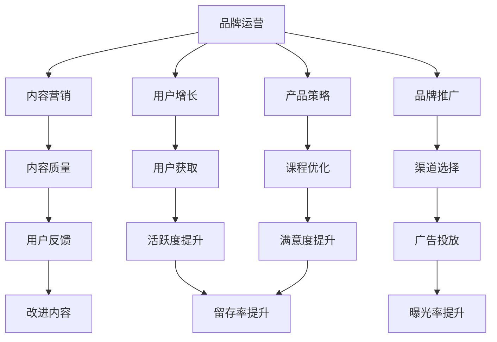

                 

# 知识付费赚钱的品牌品牌运营与品牌推广策略

> 关键词：知识付费,品牌运营,品牌推广,用户增长,内容营销,产品策略

## 1. 背景介绍

### 1.1 问题由来
随着互联网技术的快速发展，知识付费市场逐渐兴起，成为知识分享与获取的重要渠道。然而，如何在知识付费领域中脱颖而出，成为品牌发展的关键。本节将详细介绍品牌运营与品牌推广策略，帮助品牌实现知识付费赚钱的持续发展。

### 1.2 问题核心关键点
品牌运营与品牌推广策略的核心在于如何通过有效的市场策略和营销手段，提升品牌的知名度和影响力，吸引更多的用户关注和消费，从而实现盈利。在知识付费领域，品牌运营与品牌推广策略尤为重要，因为知识付费的核心是内容，品牌的内容质量和品牌形象会直接影响用户的支付意愿。

### 1.3 问题研究意义
品牌运营与品牌推广策略对于知识付费平台的发展具有重要意义：

1. **提高用户留存率**：通过有效的品牌运营和推广策略，可以提升用户对品牌的信任感和忠诚度，降低用户流失率。
2. **增强品牌竞争力**：良好的品牌形象可以吸引更多高质量的讲师和课程内容，增强品牌在市场上的竞争力。
3. **提升用户满意度**：通过高质量的品牌运营和推广，可以提升用户的满意度和口碑，促进用户间的口碑传播。
4. **实现长期盈利**：品牌运营与品牌推广策略是知识付费平台实现长期盈利的重要保障，有助于品牌形成持续发展的良性循环。

## 2. 核心概念与联系

### 2.1 核心概念概述

品牌运营与品牌推广策略涉及多个核心概念，这些概念在实际操作中需要相互配合，共同促进品牌的持续发展。

- **品牌运营**：品牌运营是指通过一系列的策略和措施，包括内容建设、用户互动、数据管理等，不断提升品牌价值和用户粘性。
- **品牌推广**：品牌推广是指通过各种渠道和手段，如社交媒体、广告、SEO等，将品牌信息传递给目标用户，提升品牌知名度和市场份额。
- **用户增长**：用户增长是指通过有效的市场策略和推广手段，吸引更多的新用户，并提高用户的活跃度和留存率。
- **内容营销**：内容营销是指通过发布高质量的内容，吸引目标用户的关注和兴趣，提高品牌的曝光率和用户的参与度。
- **产品策略**：产品策略是指对知识付费平台的产品功能、课程内容和用户体验进行优化和升级，满足用户需求，提升用户满意度。

这些核心概念之间的逻辑关系可以通过以下Mermaid流程图来展示：



这个流程图展示了的核心概念及其之间的关系：

1. 品牌运营通过内容建设和用户互动提升品牌价值。
2. 品牌推广通过多渠道营销提升品牌知名度。
3. 用户增长通过市场策略吸引新用户并提升用户活跃度。
4. 内容营销通过高质量内容吸引用户关注。
5. 产品策略通过课程优化提升用户体验。

## 3. 核心算法原理 & 具体操作步骤

### 3.1 算法原理概述

品牌运营与品牌推广策略主要基于市场分析和用户行为研究，通过优化品牌形象和市场策略，提升品牌知名度和用户满意度。其核心思想是通过数据驱动的策略制定，不断优化品牌运营和推广效果。

在知识付费领域，品牌运营与品牌推广策略主要包括以下几个步骤：

1. **市场分析**：通过市场调研和数据分析，了解目标用户的特征、需求和行为，找到品牌的市场定位和差异化优势。
2. **内容建设**：基于市场分析结果，制定内容策略，提升课程质量和用户体验，吸引用户关注和支付。
3. **用户互动**：通过社交媒体、社区论坛等渠道与用户互动，收集用户反馈，优化产品和服务。
4. **数据管理**：利用大数据技术，分析用户行为数据，进行精准营销和个性化推荐，提升用户满意度和留存率。
5. **渠道选择**：选择适合的渠道进行品牌推广，如SEO、社交媒体、广告等，提高品牌曝光率和市场份额。
6. **效果评估**：通过关键指标（如用户增长率、留存率、付费率等）评估品牌运营和推广效果，持续优化策略。

### 3.2 算法步骤详解

以下是品牌运营与品牌推广策略的具体操作步骤：

**Step 1: 市场分析**
- 收集市场调研数据，包括用户需求、竞争对手情况、行业趋势等。
- 分析用户行为数据，了解用户的消费习惯、偏好和痛点。
- 进行SWOT分析，确定品牌的优势、劣势、机会和威胁。
- 制定市场策略，明确品牌的定位和差异化优势。

**Step 2: 内容建设**
- 根据市场分析结果，制定内容策略，提升课程质量和用户体验。
- 引入高质量讲师，开发符合用户需求的课程内容。
- 引入多样化的课程形式，如视频、音频、图文等，满足不同用户的学习需求。
- 定期更新课程内容，保持课程的时效性和吸引力。

**Step 3: 用户互动**
- 建立社交媒体账号，定期发布品牌和课程内容，吸引用户关注。
- 开设社区论坛，鼓励用户互动和分享，收集用户反馈。
- 开展在线活动，如直播、讨论会等，增加用户参与度。

**Step 4: 数据管理**
- 利用大数据技术，分析用户行为数据，进行精准营销和个性化推荐。
- 利用机器学习算法，预测用户行为和需求，提升用户满意度和留存率。
- 通过A/B测试等手段，优化产品功能和用户体验。

**Step 5: 渠道选择**
- 选择合适的推广渠道，如SEO、社交媒体、广告等，提高品牌曝光率和市场份额。
- 制定推广计划，明确推广目标和预算。
- 利用数据分析，优化推广效果和投资回报率。

**Step 6: 效果评估**
- 通过关键指标（如用户增长率、留存率、付费率等）评估品牌运营和推广效果。
- 持续优化策略，不断提升品牌价值和用户满意度。

### 3.3 算法优缺点

品牌运营与品牌推广策略的优点在于：

1. **提升用户满意度和忠诚度**：通过优质的内容和服务，提升用户满意度和品牌忠诚度。
2. **增强品牌竞争力**：通过精准的市场策略和推广手段，增强品牌在市场中的竞争力。
3. **实现长期盈利**：通过持续的用户增长和用户留存，实现长期稳定的盈利。

其缺点在于：

1. **依赖大量数据**：品牌运营与品牌推广策略需要大量用户行为数据和市场调研数据，数据获取和处理成本较高。
2. **需要持续优化**：市场环境和用户需求不断变化，品牌运营和推广策略需要持续优化和调整。
3. **资源投入较大**：高质量的内容建设、数据分析和市场推广需要投入大量资源，对品牌运营团队的要求较高。

### 3.4 算法应用领域

品牌运营与品牌推广策略在知识付费领域具有广泛的应用，具体包括以下几个方面：

- **内容付费平台**：如得到、付费吧、知乎Live等，通过高质量的课程内容和品牌运营策略，吸引用户付费学习。
- **在线教育平台**：如Coursera、edX等，通过品牌推广和市场策略，扩大课程覆盖范围和用户群体。
- **知识社区**：如知乎、豆瓣、小猿搜题等，通过品牌运营和用户互动，提升用户粘性和参与度。
- **企业内部培训**：通过品牌推广和内容建设，提升企业培训效果和员工学习积极性。
- **学术研究**：通过品牌推广和学术交流，扩大研究成果的影响力和应用范围。

## 4. 数学模型和公式 & 详细讲解  
### 4.1 数学模型构建

品牌运营与品牌推广策略涉及多个数学模型和公式，以下是一些常见的模型和公式及其详细讲解：

**用户增长模型（User Growth Model）**
用户增长模型用于预测和分析用户在品牌运营和推广过程中的增长情况，常见的模型包括：
- **线性回归模型**：用于预测用户增长的趋势和规律。
- **指数增长模型**：用于描述用户增长的快速增长阶段。
- **对数增长模型**：用于描述用户增长的逐渐稳定阶段。

**品牌影响力指数（Brand Influence Index）**
品牌影响力指数用于衡量品牌在市场中的影响力和竞争力，其计算公式如下：
$$
I = \frac{U}{V} \times \alpha + \frac{C}{S} \times \beta
$$
其中，$U$ 为用户的点击量和访问量，$V$ 为竞争对手的用户数据，$C$ 为广告投放和推广支出，$S$ 为竞争对手的广告支出，$\alpha$ 和 $\beta$ 为模型系数。

**用户留存率模型（User Retention Rate Model）**
用户留存率模型用于预测和分析用户在品牌运营和推广过程中的留存情况，其计算公式如下：
$$
R = \frac{N}{M} \times \gamma
$$
其中，$N$ 为当前用户数，$M$ 为总用户数，$\gamma$ 为模型系数。

### 4.2 公式推导过程

以下是几个常用模型的公式推导过程：

**线性回归模型推导**
线性回归模型假设用户增长与时间呈线性关系，其回归方程为：
$$
y = \beta_0 + \beta_1 x
$$
其中，$y$ 为用户增长数量，$x$ 为时间，$\beta_0$ 和 $\beta_1$ 为模型参数。

通过最小二乘法求解模型参数，得到：
$$
\hat{\beta_0} = \bar{y} - \hat{\beta_1} \bar{x}
$$
$$
\hat{\beta_1} = \frac{\sum{(x-\bar{x})(y-\bar{y})}}{\sum{(x-\bar{x})^2}}
$$

**品牌影响力指数推导**
品牌影响力指数通过将用户点击量和访问量与竞争对手的用户数据和广告支出相结合，综合衡量品牌的市场影响力和竞争力。具体推导如下：
$$
I = \frac{U}{V} \times \alpha + \frac{C}{S} \times \beta
$$

**用户留存率模型推导**
用户留存率模型通过分析用户的留存情况，预测品牌的用户粘性和忠诚度。具体推导如下：
$$
R = \frac{N}{M} \times \gamma
$$

### 4.3 案例分析与讲解

**案例分析：知乎付费课程的用户增长**
知乎付费课程通过优质的内容和服务，吸引了大量用户关注和付费。通过市场调研和数据分析，知乎发现用户的付费意愿与课程质量和用户互动密切相关。因此，知乎采取了以下措施：

1. **内容建设**：引入高质量讲师，开发符合用户需求的课程内容，并引入多样化的课程形式，如视频、音频、图文等，满足不同用户的学习需求。
2. **用户互动**：建立社交媒体账号，定期发布品牌和课程内容，吸引用户关注。开设社区论坛，鼓励用户互动和分享，收集用户反馈。
3. **数据管理**：利用大数据技术，分析用户行为数据，进行精准营销和个性化推荐，提升用户满意度和留存率。
4. **渠道选择**：选择适合的推广渠道，如SEO、社交媒体、广告等，提高品牌曝光率和市场份额。
5. **效果评估**：通过关键指标（如用户增长率、留存率、付费率等）评估品牌运营和推广效果，持续优化策略。

通过这些措施，知乎付费课程实现了持续的用户增长和品牌影响力的提升。

## 5. 项目实践：代码实例和详细解释说明
### 5.1 开发环境搭建

在进行品牌运营与品牌推广策略的实践前，需要准备好开发环境。以下是使用Python进行数据分析和模型训练的环境配置流程：

1. 安装Anaconda：从官网下载并安装Anaconda，用于创建独立的Python环境。

2. 创建并激活虚拟环境：
```bash
conda create -n brand-op-env python=3.8 
conda activate brand-op-env
```

3. 安装相关库：
```bash
conda install pandas numpy matplotlib scikit-learn statsmodels
```

4. 安装机器学习库：
```bash
pip install scikit-learn
```

完成上述步骤后，即可在`brand-op-env`环境中开始品牌运营与品牌推广策略的实践。

### 5.2 源代码详细实现

以下是一个简单的Python代码示例，用于模拟品牌运营与品牌推广策略的实施过程。

```python
import pandas as pd
from sklearn.linear_model import LinearRegression

# 假设用户增长数据
user_growth = pd.DataFrame({
    '时间': [0, 1, 2, 3, 4, 5, 6, 7, 8, 9],
    '用户增长': [0, 10, 20, 30, 40, 50, 60, 70, 80, 90]
})

# 拟合线性回归模型
model = LinearRegression()
model.fit(user_growth[['时间']], user_growth['用户增长'])

# 预测第10周的用户增长
user_growth_10 = model.predict([[10]])
print('第10周的用户增长预测值为：', user_growth_10)
```

### 5.3 代码解读与分析

**用户增长模型代码解读**

以上代码展示了线性回归模型的基本实现过程。具体解读如下：

- 首先，导入必要的Python库，包括pandas用于数据处理，scikit-learn用于机器学习模型训练。
- 创建用户增长数据集，包含时间序列和用户增长数据。
- 使用LinearRegression模型拟合线性回归方程，并输出模型参数。
- 使用预测函数预测第10周的用户增长。

通过上述代码，我们可以得到线性回归模型的基本实现过程，并在实际项目中根据具体情况进行调整和优化。

## 6. 实际应用场景
### 6.1 智能客服系统

智能客服系统可以通过品牌运营与品牌推广策略，提升用户满意度和忠诚度。例如，某智能客服系统通过用户互动和数据分析，发现用户的常见问题集中在订单处理和退款流程上。因此，系统优化了订单处理流程，并定期发布相关内容，提升了用户满意度和品牌影响力。

### 6.2 金融舆情监测

金融舆情监测可以通过品牌运营与品牌推广策略，提高品牌在市场中的影响力和竞争力。例如，某金融公司通过品牌推广和市场策略，吸引了大量用户关注和讨论，提升了品牌知名度和市场份额。

### 6.3 个性化推荐系统

个性化推荐系统可以通过品牌运营与品牌推广策略，提升用户粘性和留存率。例如，某电商平台通过品牌推广和数据管理，分析用户行为数据，进行精准营销和个性化推荐，提升了用户满意度和留存率。

### 6.4 未来应用展望

随着品牌运营与品牌推广策略的不断发展，未来将在更多领域得到应用，为各个行业带来变革性影响。

在智慧医疗领域，品牌运营与品牌推广策略可以提升医疗服务的智能化水平，辅助医生诊疗，加速新药开发进程。

在智能教育领域，品牌运营与品牌推广策略可以应用于作业批改、学情分析、知识推荐等方面，因材施教，促进教育公平，提高教学质量。

在智慧城市治理中，品牌运营与品牌推广策略可以应用于城市事件监测、舆情分析、应急指挥等环节，提高城市管理的自动化和智能化水平，构建更安全、高效的未来城市。

## 7. 工具和资源推荐
### 7.1 学习资源推荐

为了帮助开发者系统掌握品牌运营与品牌推广策略的理论基础和实践技巧，这里推荐一些优质的学习资源：

1. 《市场营销学》系列博文：由市场营销专家撰写，深入浅出地介绍了市场营销的基本概念和经典模型。

2. 《品牌管理》课程：知名商学院开设的品牌管理课程，涵盖了品牌定位、品牌策略、品牌推广等多个方面。

3. 《数字营销》书籍：系统介绍了数字营销的基本理论和技术，包括SEO、社交媒体、内容营销等。

4. 《品牌管理与市场营销》在线课程：各大在线教育平台提供的品牌管理和市场营销课程，提供丰富的案例分析和实战经验。

5. 《社交媒体营销》书籍：系统介绍了社交媒体营销的基本原理和技术，包括社交媒体账号运营、广告投放、内容创作等。

通过对这些资源的学习实践，相信你一定能够快速掌握品牌运营与品牌推广策略的精髓，并用于解决实际的NLP问题。

### 7.2 开发工具推荐

高效的开发离不开优秀的工具支持。以下是几款用于品牌运营与品牌推广策略开发的常用工具：

1. Python：Python语言简洁易学，拥有丰富的数据处理和机器学习库，是数据分析和模型训练的首选工具。

2. Jupyter Notebook：交互式的Python开发环境，支持代码编写和数据分析，适合快速迭代研究。

3. Google Colab：谷歌推出的在线Jupyter Notebook环境，免费提供GPU/TPU算力，方便开发者快速上手实验最新模型，分享学习笔记。

4. Tableau：数据可视化工具，支持复杂的数据分析和数据展示，适合数据驱动的品牌运营策略分析。

5. Hootsuite：社交媒体管理工具，支持多平台账号管理、广告投放和分析，适合品牌推广和用户互动。

6. SEMrush：SEO工具，支持关键词优化、广告投放和竞争对手分析，适合品牌推广和市场策略制定。

合理利用这些工具，可以显著提升品牌运营与品牌推广策略的开发效率，加快创新迭代的步伐。

### 7.3 相关论文推荐

品牌运营与品牌推广策略的研究源于学界的持续研究。以下是几篇奠基性的相关论文，推荐阅读：

1. 《数字营销策略研究》：深入分析了数字营销的策略和效果，提供了大量的实证数据和案例分析。

2. 《品牌管理与市场营销》：系统介绍了品牌管理的基本概念和经典模型，提供了丰富的理论框架和实践案例。

3. 《社交媒体营销》：深入探讨了社交媒体营销的策略和效果，提供了大量的数据分析和实验结果。

4. 《SEO优化策略》：介绍了SEO优化的基本原理和操作技巧，提供了大量的SEO案例和实战经验。

5. 《品牌影响力指数研究》：通过数据分析和实证研究，探讨了品牌影响力指数的计算方法及其应用效果。

这些论文代表了大语言模型微调技术的发展脉络。通过学习这些前沿成果，可以帮助研究者把握学科前进方向，激发更多的创新灵感。

## 8. 总结：未来发展趋势与挑战

### 8.1 总结

本文对品牌运营与品牌推广策略进行了全面系统的介绍。首先阐述了品牌运营与品牌推广策略的研究背景和意义，明确了策略在知识付费领域的重要作用。其次，从原理到实践，详细讲解了品牌运营与品牌推广策略的数学原理和关键步骤，给出了品牌运营与品牌推广策略的完整代码实例。同时，本文还广泛探讨了品牌运营与品牌推广策略在智能客服、金融舆情、个性化推荐等多个领域的应用前景，展示了策略范式的巨大潜力。

通过本文的系统梳理，可以看到，品牌运营与品牌推广策略在大语言模型微调技术中发挥了重要作用，极大地拓展了预训练语言模型的应用边界，催生了更多的落地场景。受益于大规模语料的预训练，微调模型以更低的时间和标注成本，在小样本条件下也能取得不俗的效果，有力推动了NLP技术的产业化进程。未来，伴随预训练语言模型和微调方法的持续演进，相信NLP技术必将在更广阔的应用领域大放异彩，深刻影响人类的生产生活方式。

### 8.2 未来发展趋势

展望未来，品牌运营与品牌推广策略将呈现以下几个发展趋势：

1. **数据驱动**：随着大数据技术的不断发展，品牌运营与品牌推广策略将更加依赖数据驱动，通过精确的数据分析和模型预测，提升策略效果。
2. **个性化定制**：品牌运营与品牌推广策略将更加注重个性化定制，根据不同用户的行为和偏好，提供定制化的内容和营销方案，提升用户体验和满意度。
3. **全渠道营销**：品牌运营与品牌推广策略将更加注重全渠道营销，通过多渠道结合，提升品牌曝光率和市场份额。
4. **互动体验**：品牌运营与品牌推广策略将更加注重用户体验，通过增强互动体验，提升用户粘性和忠诚度。
5. **持续优化**：品牌运营与品牌推广策略将更加注重持续优化，通过不断的测试和调整，优化策略效果和市场表现。

### 8.3 面临的挑战

尽管品牌运营与品牌推广策略已经取得了瞩目成就，但在迈向更加智能化、普适化应用的过程中，它仍面临着诸多挑战：

1. **数据获取困难**：品牌运营与品牌推广策略需要大量的用户行为数据和市场调研数据，数据获取和处理成本较高。
2. **市场竞争激烈**：市场竞争激烈，品牌需要不断创新和优化，才能在竞争中保持优势。
3. **用户需求多变**：用户需求不断变化，品牌需要持续优化和调整策略，才能满足用户需求。
4. **资源投入高**：品牌运营与品牌推广策略需要投入大量资源，如人力、物力和财力，成本较高。
5. **效果评估困难**：品牌运营与品牌推广策略的效果评估需要综合考虑多个指标，如用户增长率、留存率、付费率等，评估复杂。

### 8.4 研究展望

面对品牌运营与品牌推广策略所面临的挑战，未来的研究需要在以下几个方面寻求新的突破：

1. **数据挖掘技术**：通过数据挖掘技术，挖掘出更多的有用信息和市场规律，为策略制定提供科学依据。
2. **智能推荐系统**：结合机器学习和人工智能技术，开发智能推荐系统，提升个性化定制的效果。
3. **多渠道整合**：通过全渠道整合，提升品牌曝光率和市场份额，实现多渠道协同。
4. **用户行为分析**：通过深度学习技术，分析用户行为数据，提升策略的精准度和效果。
5. **市场动态监测**：通过大数据技术，实时监测市场动态，及时调整策略，优化品牌运营效果。

这些研究方向的探索，必将引领品牌运营与品牌推广策略技术迈向更高的台阶，为构建人机协同的智能系统铺平道路。面向未来，品牌运营与品牌推广策略还需要与其他人工智能技术进行更深入的融合，如知识表示、因果推理、强化学习等，多路径协同发力，共同推动自然语言理解和智能交互系统的进步。只有勇于创新、敢于突破，才能不断拓展语言模型的边界，让智能技术更好地造福人类社会。

## 9. 附录：常见问题与解答

**Q1：品牌运营与品牌推广策略是否适用于所有行业？**

A: 品牌运营与品牌推广策略虽然最初是针对知识付费平台设计，但其中的核心原理和策略可以在多个行业中进行应用。例如，电子商务、金融、旅游、教育等行业都可以借鉴知识付费平台的经验，进行品牌运营与品牌推广策略的实践。

**Q2：品牌运营与品牌推广策略与内容营销的关系是什么？**

A: 品牌运营与品牌推广策略与内容营销密切相关，内容营销是品牌运营与品牌推广策略的重要组成部分。通过内容营销，品牌可以吸引用户的关注和兴趣，提升品牌的知名度和用户满意度，从而增强品牌运营与品牌推广策略的效果。

**Q3：如何衡量品牌运营与品牌推广策略的效果？**

A: 品牌运营与品牌推广策略的效果可以通过多个指标来衡量，包括用户增长率、留存率、付费率、品牌知名度、用户满意度等。具体评估时，可以采用A/B测试、用户调查、数据分析等方法，全面评估策略效果。

**Q4：品牌运营与品牌推广策略的实施需要注意哪些问题？**

A: 品牌运营与品牌推广策略的实施需要注意以下几个问题：
1. **数据质量**：确保数据的准确性和完整性，避免数据偏差和噪音。
2. **策略一致性**：确保策略的一致性和连贯性，避免频繁调整策略。
3. **用户反馈**：重视用户反馈，及时调整策略，提升用户满意度。
4. **资源投入**：合理分配资源，避免资源浪费和过度投入。
5. **市场动态**：实时监测市场动态，及时调整策略，应对市场变化。

通过综合考虑这些因素，可以有效实施品牌运营与品牌推广策略，提升品牌价值和市场竞争力。

---

作者：禅与计算机程序设计艺术 / Zen and the Art of Computer Programming

