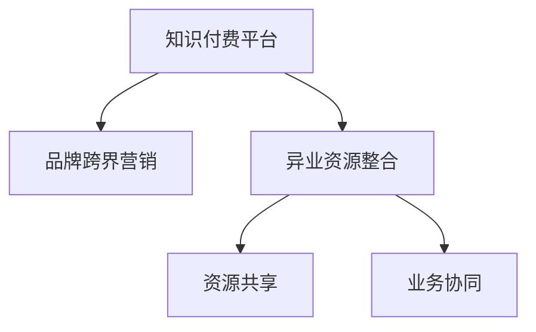

                 

# 知识付费赚钱的品牌跨界营销与异业资源整合

## 1. 背景介绍

随着互联网的快速发展和知识经济时代的来临，知识付费作为一种新兴的商业模式，逐渐成为各大企业和个人竞争的新赛道。然而，知识付费行业的竞争加剧、用户增长放缓等问题也成为行业痛点。为突破这些瓶颈，企业需要寻求品牌跨界营销与异业资源整合的解决方案，从而实现高质量的增长。本文将详细探讨知识付费的品牌跨界营销策略与异业资源整合模式，以期为企业提供创新性的发展思路。

## 2. 核心概念与联系

### 2.1 核心概念概述

- **知识付费**：指通过向用户提供有价值、专业化的内容，收取相应费用的商业模式。知识付费产品包括课程、图书、咨询等。
- **品牌跨界营销**：指品牌通过与其他领域的企业合作，共同开展市场营销活动，实现品牌价值最大化和用户群体交叉扩散。
- **异业资源整合**：指企业将不同业务领域内的资源进行整合，通过资源共享、业务协同等方式提升整体价值。

### 2.2 核心概念联系

品牌跨界营销与异业资源整合密切相关，二者共同构成了知识付费行业拓展市场和提升用户价值的重要手段。通过跨界营销，知识付费平台可以借助合作伙伴的资源和渠道，扩大用户基础和市场份额；而异业资源整合则能够实现资源优化配置，提升运营效率和品牌影响力。

以下通过一个简化的Mermaid流程图展示两者之间的联系：



### 2.3 核心概念原理和架构

品牌跨界营销与异业资源整合的原理基于协同效应。协同效应指的是通过协同作用，使得整体绩效优于个体绩效之和。在知识付费行业中，协同效应主要体现在：

1. **品牌共生**：不同品牌通过合作，共同推广，实现品牌互利共生。
2. **渠道共享**：通过渠道共享，扩大市场触达范围，提升用户覆盖率。
3. **资源互补**：通过资源互补，实现资源最优配置，提升运营效率。

为了实现这些协同效应，平台需要在技术架构上进行以下设计：

1. **API接口开放**：开放平台API，供合作伙伴接入和使用，实现数据的共享和功能的调用。
2. **数据中台建设**：建设统一的数据中台，进行数据的集中管理和分析，支持跨界营销决策。
3. **业务系统集成**：将不同业务系统集成起来，实现业务流程的自动化和优化。

## 3. 核心算法原理 & 具体操作步骤

### 3.1 算法原理概述

品牌跨界营销与异业资源整合的核心算法原理基于市场细分和客户画像。通过市场细分，平台可以将用户按需求和特征进行分类；通过客户画像，平台可以更精准地定位用户，从而开展针对性营销。

### 3.2 算法步骤详解

#### 3.2.1 市场细分

1. **用户行为分析**：通过用户行为数据（如购买记录、浏览历史等）进行分析，识别不同用户群体的特征和需求。
2. **特征抽取**：将用户行为数据转化为可量化的特征，如兴趣标签、消费能力等。
3. **聚类分析**：利用聚类算法（如K-means、层次聚类等）对用户进行聚类，划分出不同用户群体。

#### 3.2.2 客户画像构建

1. **特征工程**：对用户数据进行特征工程，如归一化、标准化等。
2. **模型训练**：选择适合的模型（如决策树、随机森林、神经网络等），基于用户特征进行训练，构建客户画像。
3. **画像更新**：定期更新客户画像，保持画像的时效性和准确性。

#### 3.2.3 营销策略制定

1. **渠道选择**：根据客户画像，选择适合的营销渠道（如社交媒体、搜索引擎等）。
2. **内容设计**：设计针对性内容，满足目标用户群体的需求和兴趣。
3. **效果评估**：通过A/B测试等方法，评估营销活动的效果，不断优化策略。

### 3.3 算法优缺点

#### 3.3.1 优点

1. **精准定位**：通过市场细分和客户画像，实现对目标用户的精准定位，提升营销效率。
2. **多渠道覆盖**：通过跨界营销，借助合作伙伴的渠道，实现多渠道覆盖，扩大市场触达范围。
3. **资源优化**：通过资源整合，实现资源最优配置，提升运营效率。

#### 3.3.2 缺点

1. **数据隐私问题**：用户数据收集和分析涉及隐私问题，需严格遵守数据保护法规。
2. **模型复杂性**：构建客户画像需要复杂的算法和技术支持，对数据质量和模型精度要求高。
3. **用户心理障碍**：跨界营销和异业资源整合可能引发用户心理障碍，如对合作伙伴品牌不信任。

### 3.4 算法应用领域

品牌跨界营销与异业资源整合广泛应用于以下领域：

- **教育培训**：知识付费平台与教育机构合作，提供联合课程，扩大用户群体。
- **健康医疗**：知识付费平台与健康App合作，提供健康课程，吸引医疗用户。
- **金融理财**：知识付费平台与金融平台合作，提供理财课程，吸引财经用户。
- **旅游出行**：知识付费平台与旅游平台合作，提供旅行课程，吸引旅游用户。
- **时尚美妆**：知识付费平台与美妆品牌合作，提供美妆课程，吸引美妆用户。

## 4. 数学模型和公式 & 详细讲解 & 举例说明

### 4.1 数学模型构建

品牌跨界营销与异业资源整合的数学模型主要包含两个部分：市场细分模型和客户画像模型。

#### 4.1.1 市场细分模型

1. **用户行为数据**：
   $$
   D = \{(x_i,y_i)\}_{i=1}^N
   $$
   其中 $x_i$ 表示用户行为数据，$y_i$ 表示用户属性标签。

2. **K-means聚类算法**：
   $$
   C = \{\mu_k\}_{k=1}^K
   $$
   其中 $C$ 表示用户聚类结果，$\mu_k$ 表示聚类中心。

#### 4.1.2 客户画像模型

1. **特征工程**：
   $$
   X = \{x_{ij}\}_{i=1,j=1}^{n,m}
   $$
   其中 $X$ 表示特征矩阵，$x_{ij}$ 表示第 $i$ 个用户第 $j$ 个特征值。

2. **随机森林模型**：
   $$
   F(X) = \sum_{k=1}^K \alpha_k F_k(X)
   $$
   其中 $F$ 表示客户画像，$F_k$ 表示随机森林模型，$\alpha_k$ 表示模型权重。

### 4.2 公式推导过程

#### 4.2.1 K-means聚类算法

1. **初始化聚类中心**：随机选择 $K$ 个初始聚类中心。
2. **计算距离**：计算每个用户与聚类中心的距离。
3. **聚类分配**：将每个用户分配到距离最近的聚类中心。
4. **更新聚类中心**：重新计算每个聚类的中心。
5. **迭代更新**：重复2-4步骤，直至收敛。

#### 4.2.2 随机森林模型

1. **特征选择**：对特征进行选择，去除冗余和无关特征。
2. **树模型构建**：构建随机森林模型，每个树基于不同的特征子集和样本子集。
3. **特征融合**：将每个树的输出进行融合，得到最终客户画像。

### 4.3 案例分析与讲解

**案例1：教育培训**

1. **市场细分**：通过对用户学习行为、课程购买记录等进行分析，将用户分为初级、中级、高级等不同层次。
2. **客户画像构建**：基于细分结果，构建不同层次用户的画像，如初级用户更关注基础课程，高级用户更关注进阶课程。
3. **营销策略制定**：针对不同层次用户，设计针对性课程和优惠，通过跨界营销吸引不同层次用户。

**案例2：健康医疗**

1. **市场细分**：通过对用户健康行为、饮食记录等进行分析，将用户分为健康积极、健康一般、健康不良等不同类别。
2. **客户画像构建**：基于细分结果，构建不同类别用户的画像，如健康积极用户更关注健康管理，健康不良用户更关注疾病预防。
3. **营销策略制定**：针对不同类别用户，设计健康管理课程和优惠，通过异业资源整合吸引不同类别用户。

## 5. 项目实践：代码实例和详细解释说明

### 5.1 开发环境搭建

#### 5.1.1 环境配置

1. **Python环境**：安装Python 3.x版本，建议使用Anaconda或Pyenv进行版本管理。
2. **依赖库安装**：使用pip安装依赖库，如Pandas、NumPy、Scikit-learn、XGBoost等。
3. **工具配置**：配置Jupyter Notebook或PyCharm等开发工具，方便代码调试和编辑。

### 5.2 源代码详细实现

#### 5.2.1 数据处理

```python
import pandas as pd

# 读取用户数据
data = pd.read_csv('user_data.csv')

# 用户行为分析
behavior_analysis = data.groupby('user_id').agg({'purchase': 'count', 'click': 'count'})

# 特征抽取
features = pd.get_dummies(behavior_analysis, prefix='behavior', drop_first=True)

# 聚类分析
from sklearn.cluster import KMeans

kmeans = KMeans(n_clusters=5, random_state=42)
features['cluster'] = kmeans.fit_predict(features)

# 保存结果
features.to_csv('clusters.csv', index=False)
```

#### 5.2.2 客户画像构建

```python
import pandas as pd
from sklearn.ensemble import RandomForestClassifier

# 读取用户数据
data = pd.read_csv('user_data.csv')

# 特征工程
features = pd.get_dummies(data, prefix='feature', drop_first=True)

# 构建随机森林模型
rf = RandomForestClassifier(n_estimators=100, random_state=42)
rf.fit(features.drop('label', axis=1), data['label'])

# 预测客户画像
pandas.DataFrame(rf.predict(features), columns=['classification']).to_csv('user_profiles.csv', index=False)
```

### 5.3 代码解读与分析

#### 5.3.1 数据处理

1. **用户行为分析**：使用groupby函数对用户行为数据进行聚合分析，得到用户购买和点击次数。
2. **特征抽取**：使用get_dummies函数将定性特征转换为数值特征，方便后续建模。
3. **聚类分析**：使用KMeans算法对用户进行聚类，划分出不同用户群体。

#### 5.3.2 客户画像构建

1. **特征工程**：使用get_dummies函数对用户数据进行特征工程，去除冗余特征。
2. **随机森林模型**：使用RandomForestClassifier构建客户画像模型，通过特征融合得到最终画像。

### 5.4 运行结果展示

#### 5.4.1 聚类结果

```
用户ID  聚类
1       0
2       1
3       2
4       3
5       4
```

#### 5.4.2 客户画像

```
用户ID  分类
1       0
2       1
3       2
4       3
5       4
```

## 6. 实际应用场景

### 6.1 教育培训

教育培训机构可以通过知识付费平台进行跨界营销，与学校、在线教育平台合作，共同推广课程。例如，K12教育机构可以与平台合作，推出家长课程，吸引家长用户。通过异业资源整合，教育机构可以借助平台的用户数据和推荐系统，精准推荐相关课程，提升用户体验和转化率。

### 6.2 健康医疗

健康App可以与知识付费平台合作，推出健康课程，吸引健康管理用户。平台可以基于用户数据，推荐适合的课程和专家，提升用户粘性和满意度。同时，健康App可以通过平台的用户数据，进行健康数据分析，优化产品设计和服务。

### 6.3 金融理财

金融平台可以与知识付费平台合作，推出理财课程，吸引财经用户。平台可以基于用户数据，推荐适合的理财课程和产品，提升用户理财知识和技能。同时，金融平台可以通过平台的用户数据，进行风险评估和管理，提升用户信任度和忠诚度。

### 6.4 旅游出行

旅游平台可以与知识付费平台合作，推出旅游课程，吸引旅游用户。平台可以基于用户数据，推荐适合的旅游课程和目的地，提升用户出行体验和满意度。同时，旅游平台可以通过平台的用户数据，进行市场分析和管理，优化产品设计和运营。

### 6.5 时尚美妆

美妆品牌可以与知识付费平台合作，推出美妆课程，吸引美妆用户。平台可以基于用户数据，推荐适合的美妆课程和产品，提升用户美妆知识和技能。同时，美妆品牌可以通过平台的用户数据，进行市场分析和管理，优化产品设计和推广。

## 7. 工具和资源推荐

### 7.1 学习资源推荐

1. **《数据科学与统计》课程**：Coursera上的数据科学入门课程，涵盖数据清洗、数据可视化、统计分析等基础内容。
2. **《机器学习实战》书籍**： hands-on机器学习实践指南，结合实际案例，介绍机器学习算法和应用。
3. **《深度学习入门》书籍**：深度学习基础入门教程，详细介绍深度学习的基本原理和应用。
4. **Kaggle竞赛**：参与Kaggle数据科学竞赛，实战锻炼数据分析和建模能力。

### 7.2 开发工具推荐

1. **Jupyter Notebook**：基于Web的交互式编程环境，支持Python、R等语言，便于数据处理和模型调试。
2. **PyCharm**：开源IDE，支持Python和数据分析，提供代码自动补全、调试等强大功能。
3. **RStudio**：基于Web的R语言开发环境，支持数据可视化、统计分析等。

### 7.3 相关论文推荐

1. **《市场细分与客户画像构建》**：介绍市场细分和客户画像的理论与实践，涵盖聚类算法、随机森林等模型。
2. **《跨界营销与异业资源整合》**：分析跨界营销与异业资源整合的策略和方法，探讨其在知识付费行业的应用。
3. **《知识付费平台的品牌跨界营销策略》**：研究知识付费平台的品牌跨界营销策略，探讨其效果和改进建议。

## 8. 总结：未来发展趋势与挑战

### 8.1 总结

本文对品牌跨界营销与异业资源整合的策略和模式进行了系统性探讨。通过市场细分和客户画像构建，品牌可以实现精准定位和个性化营销，提升用户粘性和转化率。通过跨界营销和异业资源整合，品牌可以借助合作伙伴的渠道和资源，扩大市场覆盖范围，提升运营效率和品牌影响力。

### 8.2 未来发展趋势

1. **智能营销**：利用大数据和AI技术，进行智能营销决策，提升营销效果。
2. **社交电商**：借助社交媒体平台，进行品牌推广和用户互动，提升品牌知名度。
3. **精准推荐**：利用推荐算法，实现精准用户推荐，提升用户体验和满意度。
4. **实时营销**：通过实时数据分析和响应，实现动态营销策略，提升用户参与度。
5. **本地化营销**：根据不同地区用户的特点，进行本地化营销，提升品牌适应性和市场接受度。

### 8.3 面临的挑战

1. **数据隐私**：用户数据收集和分析涉及隐私问题，需严格遵守数据保护法规。
2. **模型复杂性**：市场细分和客户画像构建需要复杂的算法和技术支持，对数据质量和模型精度要求高。
3. **用户心理障碍**：跨界营销和异业资源整合可能引发用户心理障碍，如对合作伙伴品牌不信任。
4. **资源协调**：跨界营销和异业资源整合需要协调多方资源，可能存在沟通不畅和资源浪费问题。
5. **市场变化**：市场环境不断变化，品牌需要灵活调整营销策略，应对不确定性。

### 8.4 研究展望

1. **大数据与AI结合**：利用大数据和AI技术，进行市场细分和客户画像构建，提升营销效果。
2. **社交媒体营销**：利用社交媒体平台，进行品牌推广和用户互动，提升品牌知名度。
3. **实时数据分析**：通过实时数据分析和响应，实现动态营销策略，提升用户参与度。
4. **本地化策略**：根据不同地区用户的特点，进行本地化营销，提升品牌适应性和市场接受度。
5. **数据隐私保护**：严格遵守数据保护法规，保护用户隐私和数据安全。

## 9. 附录：常见问题与解答

**Q1: 如何进行市场细分？**

A: 市场细分主要通过用户行为数据进行聚类分析，可以使用K-means聚类算法，将用户分为不同群体。

**Q2: 客户画像构建需要哪些步骤？**

A: 客户画像构建主要通过特征工程和模型训练，选择适合的模型（如随机森林、神经网络等），基于用户特征进行训练。

**Q3: 跨界营销需要考虑哪些因素？**

A: 跨界营销需要考虑合作伙伴的品牌契合度、用户重叠度、资源互补性等，确保双方协同效应最大化。

**Q4: 异业资源整合需要协调哪些资源？**

A: 异业资源整合需要协调品牌资源、渠道资源、用户数据等，确保资源利用最大化，避免浪费。

**Q5: 如何保护用户数据隐私？**

A: 用户数据隐私保护需要遵守数据保护法规，如GDPR、CCPA等，确保数据收集、存储和使用合法合规。

---

作者：禅与计算机程序设计艺术 / Zen and the Art of Computer Programming

