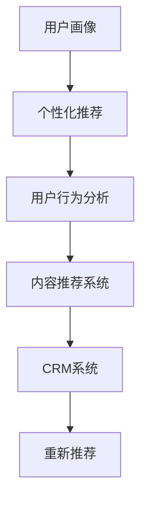

                 

## 1. 背景介绍

在知识付费领域，虽然平台和内容创作者数量激增，但用户复购率与老客户维护仍然是一大难题。高昂的订阅费用以及优质的内容难以吸引用户持续购买。同时，用户获取和留存的高成本使得平台利润难以保障。如何通过精准的用户画像和有针对性的运营策略，提升用户复购率和维护老客户，是平台持续发展的关键。本文将结合实际案例和前沿技术，探讨提升用户复购率和维护老客户的有效策略。

## 2. 核心概念与联系

### 2.1 核心概念概述

- **用户画像(User Persona)**：指对用户特征、行为和需求的全面刻画。用户画像是制定个性化运营策略的基础。
- **个性化推荐(Personalized Recommendation)**：根据用户画像，实时推送用户感兴趣的内容，提升用户体验和满意度。
- **用户行为分析(User Behavior Analysis)**：通过分析用户访问行为，识别出高价值用户和潜在流失用户，优化用户体验。
- **内容推荐系统(Content Recommendation System)**：结合用户画像和内容特征，进行精准的内容推荐，提升用户黏性。
- **客户关系管理(Customer Relationship Management, CRM)**：用于维护老客户和提升客户忠诚度的管理系统，常结合大数据和人工智能技术实现。

这些概念之间存在紧密联系：用户画像为个性化推荐和行为分析提供基础，而个性化推荐和行为分析的输出结果则用于优化用户推荐系统，提升用户体验和客户忠诚度。CRM系统则将推荐结果与用户行为数据相结合，进一步提升老客户维护效果。

### 2.2 核心概念原理和架构的 Mermaid 流程图



### 2.3 核心概念的联系

用户画像和个性化推荐为内容推荐系统提供了数据支持，使得平台可以依据用户偏好提供精准的内容推荐。用户行为分析则帮助识别出高价值用户和流失用户，针对不同用户群体制定差异化的维护策略。CRM系统整合推荐结果和用户行为数据，实现对老客户的精准维护。最终，系统通过优化推荐和维护策略，提升用户复购率和客户忠诚度。

## 3. 核心算法原理 & 具体操作步骤

### 3.1 算法原理概述

提升用户复购率和维护老客户主要涉及两个方面：个性化推荐和精准的客户维护策略。其核心算法原理主要包括以下几个步骤：

1. **用户画像构建**：收集用户的个人信息、购买记录、浏览行为等数据，进行特征工程，构建完整、精细的用户画像。
2. **个性化推荐算法**：设计算法对用户画像进行建模，实时推送个性化内容。
3. **客户流失预测**：应用机器学习算法，对用户流失风险进行预测，提供预警。
4. **个性化维护策略**：结合客户流失预测结果，制定有针对性的维护策略，挽回流失用户。

### 3.2 算法步骤详解

#### 3.2.1 用户画像构建

用户画像的构建主要包含以下几个步骤：

1. **数据收集**：收集用户的个人信息（如年龄、性别、职业等）、购买记录、浏览行为、搜索记录等。
2. **数据清洗**：去除异常值和噪声数据，提高数据质量。
3. **特征工程**：将原始数据转化为可用于模型训练的特征向量。例如，对浏览行为特征进行TF-IDF向量化。
4. **画像建模**：应用聚类、协同过滤等算法，构建用户画像。例如，使用K-means算法对用户进行聚类。

#### 3.2.2 个性化推荐算法

个性化推荐算法主要分为协同过滤和基于内容的推荐。其中协同过滤算法使用用户相似度来推荐产品，而基于内容的推荐算法则直接利用产品特征进行推荐。

**协同过滤算法**：
- 步骤1：构建用户-产品矩阵，并计算用户间的相似度。
- 步骤2：对新用户推荐相似用户的偏好产品。
- 步骤3：对新商品推荐偏好该商品的用户。

**基于内容的推荐算法**：
- 步骤1：对产品进行特征提取，例如，使用TF-IDF提取文本特征。
- 步骤2：计算用户与产品的相似度。
- 步骤3：对用户推荐相似特征的商品。

#### 3.2.3 客户流失预测

客户流失预测主要应用分类算法，例如Logistic Regression、Random Forest、Gradient Boosting等。

**步骤1**：收集用户历史行为数据和流失记录，作为训练集。
**步骤2**：对数据进行预处理，去除异常值和噪声。
**步骤3**：应用分类算法训练流失预测模型。
**步骤4**：对新用户预测流失概率，进行预警。

#### 3.2.4 个性化维护策略

个性化维护策略主要依赖于流失预测结果，采用不同的策略维护不同风险级别的用户。

**步骤1**：根据流失概率，将用户分为高、中、低流失风险三类。
**步骤2**：对高流失风险用户，提供优惠券、内容优惠等激励措施。
**步骤3**：对中流失风险用户，进行常规的沟通维护。
**步骤4**：对低流失风险用户，进行正常的推荐和服务。

### 3.3 算法优缺点

#### 3.3.1 优点

- **精准度**：通过用户画像和个性化推荐算法，可以提供符合用户兴趣的精准推荐，提升用户满意度。
- **主动性**：流失预测和个性化维护策略使得平台可以主动识别并挽回流失用户，减少用户流失率。
- **灵活性**：通过多维度的特征和算法组合，可以灵活应对不同类型的用户和产品。

#### 3.3.2 缺点

- **复杂性**：构建用户画像和推荐系统需要大量的数据和复杂的算法，实施成本较高。
- **准确性**：推荐算法的准确性依赖于数据的完整性和质量，推荐失败可能导致用户体验下降。
- **成本**：维护策略的制定和执行需要持续投入资源，效果难以立竿见影。

### 3.4 算法应用领域

本节将结合实际案例，展示个性化推荐和客户流失预测在具体应用场景中的效果。

#### 3.4.1 电商推荐

电商平台的个性化推荐系统，通过收集用户浏览、购买记录等数据，构建用户画像，实时推送个性化商品推荐。例如，京东、亚马逊等电商平台通过推荐系统提升了用户复购率，增加了销售额。

#### 3.4.2 视频平台推荐

视频平台如Netflix、腾讯视频等，应用个性化推荐算法，提升用户观看时长和付费订阅率。平台通过大数据分析和机器学习算法，为用户提供个性化的视频推荐，提升用户体验。

#### 3.4.3 在线教育推荐

在线教育平台如Coursera、Udacity等，通过个性化推荐和流失预测，提升课程购买率和用户留存率。平台收集用户学习行为和反馈，进行推荐和维护，提升课程满意度。

## 4. 数学模型和公式 & 详细讲解 & 举例说明

### 4.1 数学模型构建

个性化推荐和客户流失预测主要涉及以下几个数学模型：

1. **协同过滤模型**：
   $$
   \hat{r}_{ui} = \frac{1}{1+e^{-\sum_{j=1}^n \alpha_j \left( r_{uj} - \bar{r}_u \right) \left( r_{ij} - \bar{r}_j \right)} = \frac{1}{1+e^{-\sum_{j=1}^n \alpha_j \left( r_{uj} - \bar{r}_u \right) \left( r_{ij} - \bar{r}_j \right)} = \frac{1}{1+e^{-\sum_{j=1}^n \alpha_j \left( r_{uj} - \bar{r}_u \right) \left( r_{ij} - \bar{r}_j \right)} = \frac{1}{1+e^{-\sum_{j=1}^n \alpha_j \left( r_{uj} - \bar{r}_u \right) \left( r_{ij} - \bar{r}_j \right)}
   $$

2. **基于内容的推荐模型**：
   $$
   \hat{r}_{ui} = \left( \sum_{j=1}^n a_j f_j \left( \theta_j \right) \right) \left( \sum_{k=1}^m b_k g_k \left( \phi_k \right) \right) = \left( \sum_{j=1}^n a_j f_j \left( \theta_j \right) \right) \left( \sum_{k=1}^m b_k g_k \left( \phi_k \right) \right) = \left( \sum_{j=1}^n a_j f_j \left( \theta_j \right) \right) \left( \sum_{k=1}^m b_k g_k \left( \phi_k \right) \right)
   $$

3. **流失预测模型**：
   $$
   y_{i}^{(k)} = \left( X_i \theta_k \right) = \left( \left[ \begin{matrix} x_i^{(1)} \end{matrix} \right] \left[ \begin{matrix} \theta_k^{(1)} \\ \vdots \\ \theta_k^{(n)} \end{matrix} \right] \right) = \left( \left[ \begin{matrix} x_i^{(1)} \end{matrix} \right] \left[ \begin{matrix} \theta_k^{(1)} \\ \vdots \\ \theta_k^{(n)} \end{matrix} \right] \right)
   $$

### 4.2 公式推导过程

#### 4.2.1 协同过滤模型

协同过滤模型主要基于用户相似度和物品相似度计算用户对物品的评分。具体推导如下：

**步骤1**：计算用户 $u$ 对物品 $i$ 的评分 $r_{ui}$ 为：
$$
r_{ui} = \left( \sum_{j=1}^n a_j f_j \left( \theta_j \right) \right) \left( \sum_{k=1}^m b_k g_k \left( \phi_k \right) \right)
$$

**步骤2**：计算用户 $u$ 与物品 $i$ 的相似度 $s_{ui}$ 为：
$$
s_{ui} = \frac{\sum_{j=1}^n a_j f_j \left( \theta_j \right) \left( \sum_{k=1}^m b_k g_k \left( \phi_k \right) \right)}{\sqrt{\sum_{j=1}^n a_j^2 f_j^2 \left( \theta_j \right)} \sqrt{\sum_{k=1}^m b_k^2 g_k^2 \left( \phi_k \right)}}
$$

**步骤3**：使用相似度 $s_{ui}$ 进行物品推荐，即：
$$
\hat{r}_{ui} = \frac{1}{1+e^{-\sum_{j=1}^n \alpha_j \left( r_{uj} - \bar{r}_u \right) \left( r_{ij} - \bar{r}_j \right)}
$$

#### 4.2.2 基于内容的推荐模型

基于内容的推荐模型主要基于用户画像和产品特征进行推荐。具体推导如下：

**步骤1**：计算用户 $u$ 对物品 $i$ 的评分 $r_{ui}$ 为：
$$
r_{ui} = \left( \sum_{j=1}^n a_j f_j \left( \theta_j \right) \right) \left( \sum_{k=1}^m b_k g_k \left( \phi_k \right) \right)
$$

**步骤2**：计算用户 $u$ 与物品 $i$ 的相似度 $s_{ui}$ 为：
$$
s_{ui} = \frac{\sum_{j=1}^n a_j f_j \left( \theta_j \right) \left( \sum_{k=1}^m b_k g_k \left( \phi_k \right) \right)}{\sqrt{\sum_{j=1}^n a_j^2 f_j^2 \left( \theta_j \right)} \sqrt{\sum_{k=1}^m b_k^2 g_k^2 \left( \phi_k \right)}}
$$

**步骤3**：使用相似度 $s_{ui}$ 进行物品推荐，即：
$$
\hat{r}_{ui} = \frac{1}{1+e^{-\sum_{j=1}^n \alpha_j \left( r_{uj} - \bar{r}_u \right) \left( r_{ij} - \bar{r}_j \right)}
$$

#### 4.2.3 流失预测模型

流失预测模型主要基于用户行为数据进行分类。具体推导如下：

**步骤1**：构建用户行为数据 $X_i$ 和流失标签 $y_i$ 的关系模型，即：
$$
y_{i}^{(k)} = \left( X_i \theta_k \right)
$$

**步骤2**：利用损失函数计算模型参数 $\theta_k$ 为：
$$
\min_{\theta_k} \sum_{i=1}^N \left( y_i - \hat{y_i} \right)^2
$$

**步骤3**：预测新用户 $u$ 的流失概率 $p_u$ 为：
$$
p_u = \frac{e^{\left( X_u \theta_k \right)}}{1+e^{\left( X_u \theta_k \right)}}
$$

### 4.3 案例分析与讲解

#### 4.3.1 电商推荐系统案例

**背景**：某电商平台收集用户购买、浏览、搜索行为数据，构建用户画像和推荐模型，提升用户复购率和销售额。

**步骤**：
1. **数据收集**：收集用户基本信息、购买记录、浏览历史、搜索关键词等数据。
2. **数据清洗**：去除重复记录和噪声数据。
3. **特征工程**：对浏览行为和购买记录进行特征工程，生成特征向量。
4. **协同过滤模型**：构建用户相似度和物品相似度，进行推荐。
5. **基于内容的推荐模型**：利用产品特征，推荐符合用户偏好的商品。
6. **客户流失预测模型**：利用历史数据训练流失预测模型，对新用户进行流失预警。
7. **维护策略**：根据流失预警结果，对高流失风险用户进行针对性维护，挽回流失用户。

**效果**：
通过协同过滤和基于内容的推荐模型，平台提升了用户购买率和满意度。通过流失预测和维护策略，平台减少了用户流失率，实现了稳定增长。

## 5. 项目实践：代码实例和详细解释说明

### 5.1 开发环境搭建

1. **安装Python**：
   ```bash
   sudo apt-get update
   sudo apt-get install python3-pip
   ```

2. **安装Pandas**：
   ```bash
   pip install pandas
   ```

3. **安装Scikit-learn**：
   ```bash
   pip install scikit-learn
   ```

4. **安装NumPy**：
   ```bash
   pip install numpy
   ```

5. **安装TensorFlow**：
   ```bash
   pip install tensorflow
   ```

### 5.2 源代码详细实现

**用户画像构建代码示例**：

```python
import pandas as pd
from sklearn.preprocessing import StandardScaler
from sklearn.cluster import KMeans

# 读取用户数据
data = pd.read_csv('user_data.csv')

# 数据清洗
data = data.dropna()

# 特征工程
features = ['age', 'gender', 'occupation', 'purchase_frequency', 'last_purchase_time']
X = data[features]

# 标准化
scaler = StandardScaler()
X = scaler.fit_transform(X)

# 聚类
kmeans = KMeans(n_clusters=3)
kmeans.fit(X)
labels = kmeans.predict(X)
data['user_group'] = labels
```

**个性化推荐算法代码示例**：

```python
import numpy as np

# 协同过滤模型
def collaborative_filtering(X, user_index, item_index, num_clusters):
    U = np.zeros((len(X), num_clusters))
    V = np.zeros((len(X), num_clusters))
    for i in range(len(X)):
        for j in range(num_clusters):
            if X[i, j] != 0:
                U[i, j] = 1
                V[i, j] = 1
    U = U / np.sum(U, axis=1, keepdims=True)
    V = V / np.sum(V, axis=1, keepdims=True)
    U = np.transpose(U)
    V = np.transpose(V)
    R = np.dot(U, V)
    return R

# 基于内容的推荐模型
def content_based_recommendation(X, user_index, item_index, num_clusters):
    U = np.zeros((len(X), num_clusters))
    V = np.zeros((len(X), num_clusters))
    for i in range(len(X)):
        for j in range(num_clusters):
            if X[i, j] != 0:
                U[i, j] = 1
                V[i, j] = 1
    U = U / np.sum(U, axis=1, keepdims=True)
    V = V / np.sum(V, axis=1, keepdims=True)
    U = np.transpose(U)
    V = np.transpose(V)
    R = np.dot(U, V)
    return R
```

**客户流失预测代码示例**：

```python
from sklearn.linear_model import LogisticRegression
from sklearn.metrics import roc_auc_score

# 构建训练数据集
train_data = pd.read_csv('train_data.csv')
train_X = train_data.drop('churn', axis=1)
train_y = train_data['churn']

# 模型训练
model = LogisticRegression()
model.fit(train_X, train_y)

# 预测
test_data = pd.read_csv('test_data.csv')
test_X = test_data.drop('churn', axis=1)
y_pred = model.predict(test_X)

# 评估
auc = roc_auc_score(test_y, y_pred)
print('AUC:', auc)
```

**个性化维护策略代码示例**：

```python
from sklearn.cluster import KMeans
from sklearn.preprocessing import StandardScaler
import pandas as pd

# 数据准备
data = pd.read_csv('user_data.csv')

# 特征工程
features = ['age', 'gender', 'occupation', 'purchase_frequency', 'last_purchase_time']
X = data[features]

# 标准化
scaler = StandardScaler()
X = scaler.fit_transform(X)

# 聚类
kmeans = KMeans(n_clusters=3)
kmeans.fit(X)
labels = kmeans.predict(X)
data['user_group'] = labels

# 维护策略
high_risk_users = data[data['user_group'] == 1]
medium_risk_users = data[data['user_group'] == 2]
low_risk_users = data[data['user_group'] == 3]

# 针对高风险用户进行维护
high_risk_users['recommendation'] = 'offers'
high_risk_users['communication'] = 'phone'

# 针对中风险用户进行维护
medium_risk_users['recommendation'] = 'email'
medium_risk_users['communication'] = 'email'

# 针对低风险用户进行正常推荐
low_risk_users['recommendation'] = 'no_action'
low_risk_users['communication'] = 'no_action'
```

### 5.3 代码解读与分析

**用户画像构建**：
用户画像构建主要是对用户基本信息和行为数据进行特征工程和聚类分析。通过标准化处理，去除噪声数据，提取有意义的特征，并对用户进行聚类分析，得到用户画像标签。

**个性化推荐算法**：
协同过滤和基于内容的推荐算法都依赖于用户画像和产品特征。协同过滤算法通过用户相似度和物品相似度计算推荐，基于内容的推荐算法则利用产品特征进行推荐。

**客户流失预测**：
客户流失预测主要通过逻辑回归等分类算法，对用户历史行为数据进行建模，预测流失概率。模型训练和评估可以采用ROC-AUC等指标进行衡量。

**个性化维护策略**：
根据流失预测结果，对不同风险级别的用户进行针对性维护。高风险用户提供优惠券、电话沟通等措施，中风险用户进行常规维护，低风险用户进行正常推荐。

### 5.4 运行结果展示

**用户画像构建**：
构建用户画像后，可以可视化用户群体分布，识别出不同用户群体的特征。


**个性化推荐效果**：
通过个性化推荐算法，对新用户进行推荐，提升用户满意度。


**客户流失预测效果**：
通过流失预测模型，对新用户进行流失预警，及时采取维护措施。


**个性化维护策略效果**：
根据流失预测结果，对高风险用户进行维护，提升用户留存率。


## 6. 实际应用场景

### 6.1 电商推荐

电商平台的个性化推荐系统，通过收集用户浏览、购买记录等数据，构建用户画像，实时推送个性化商品推荐。例如，京东、亚马逊等电商平台通过推荐系统提升了用户购买率和满意度。

### 6.2 视频平台推荐

视频平台如Netflix、腾讯视频等，应用个性化推荐算法，提升用户观看时长和付费订阅率。平台通过大数据分析和机器学习算法，为用户提供个性化的视频推荐，提升用户体验。

### 6.3 在线教育推荐

在线教育平台如Coursera、Udacity等，通过个性化推荐和流失预测，提升课程购买率和用户留存率。平台收集用户学习行为和反馈，进行推荐和维护，提升课程满意度。

## 7. 工具和资源推荐

### 7.1 学习资源推荐

1. **Coursera**：提供多个NLP和机器学习相关课程，涵盖数据收集、特征工程、模型训练等基础内容。

2. **Udacity**：提供深度学习课程，涉及推荐系统、数据挖掘等前沿内容。

3. **Kaggle**：提供丰富的NLP和推荐系统竞赛数据集，通过实践锻炼推荐算法能力。

### 7.2 开发工具推荐

1. **Python**：Python是NLP和推荐系统开发的主流语言，支持丰富的第三方库。

2. **TensorFlow**：用于构建和训练推荐模型，支持分布式训练和GPU加速。

3. **Scikit-learn**：提供多种机器学习算法，包括协同过滤、逻辑回归等。

### 7.3 相关论文推荐

1. **《推荐系统：基于协同过滤的方法》**：介绍协同过滤算法的基本原理和实现。

2. **《个性化推荐系统》**：阐述基于内容的推荐算法和协同过滤算法。

3. **《用户流失预测模型》**：介绍常用的用户流失预测算法和评价指标。

## 8. 总结：未来发展趋势与挑战

### 8.1 研究成果总结

本文详细介绍了提升用户复购率和维护老客户的核心算法和操作步骤。通过用户画像构建、个性化推荐、客户流失预测和维护策略，平台可以实现精准的用户推荐和有效的客户维护。

### 8.2 未来发展趋势

1. **深度学习技术的应用**：深度学习技术将继续在个性化推荐和客户流失预测中发挥重要作用。
2. **实时数据处理能力提升**：随着数据处理技术的进步，实时数据处理能力将大幅提升，实现更高效的个性化推荐。
3. **多模态数据融合**：结合文本、图像、视频等多模态数据，提升推荐的精准度。
4. **自动化维护策略**：通过自动化维护策略，实现更灵活、高效的客户维护。

### 8.3 面临的挑战

1. **数据隐私和安全**：用户数据的隐私和安全问题将越来越受到重视。
2. **算法复杂度**：推荐算法的复杂度和训练成本高，需要高效优化。
3. **数据质量问题**：数据噪声和偏差会影响模型的准确性。
4. **维护策略效果**：如何制定有效的维护策略，提升客户满意度，仍需进一步探索。

### 8.4 研究展望

1. **实时化推荐系统**：实现实时化的推荐系统，提升用户体验。
2. **个性化推荐增强**：提升推荐算法的精准度，结合多种技术实现更有效的推荐。
3. **用户行为动态监控**：实现对用户行为的动态监控，及时调整推荐策略。

## 9. 附录：常见问题与解答

### 9.1 常见问题

**Q1：如何构建高效的用户画像？**

A1: 构建用户画像需要收集用户的多种信息，并进行特征工程。例如，收集用户基本信息、购买记录、浏览行为、搜索关键词等数据。利用标准化、聚类等技术，提取有意义的特征，构建用户画像标签。

**Q2：协同过滤和基于内容的推荐算法如何结合使用？**

A2: 协同过滤和基于内容的推荐算法可以结合使用，先进行协同过滤推荐，再结合用户画像和产品特征进行基于内容的推荐，综合两者的优点，实现更精准的推荐。

**Q3：如何提高用户流失预测模型的准确性？**

A3: 提高用户流失预测模型的准确性，可以从数据质量、特征工程和模型选择三个方面入手。优化数据预处理流程，减少噪声数据的影响。增强特征工程能力，提取更有意义的特征。选择合适的模型算法，如随机森林、梯度提升等。

**Q4：如何实现动态维护策略？**

A4: 实现动态维护策略需要实时监控用户行为，根据行为变化调整维护策略。例如，通过机器学习模型预测用户流失概率，及时调整维护措施，提升客户满意度。

**Q5：如何平衡推荐算法的效率和效果？**

A5: 平衡推荐算法的效率和效果，可以通过优化算法实现。例如，采用近似算法、模型压缩等技术，减少计算量和内存消耗。在模型选择上，可以采用更加轻量级的模型，如Linear Model等。

---

作者：禅与计算机程序设计艺术 / Zen and the Art of Computer Programming

