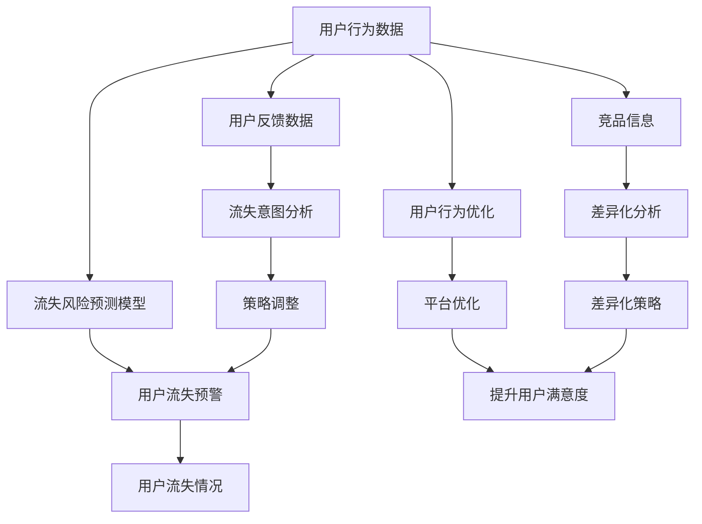

                 

# 知识付费赚钱的用户流失预警与挽留策略

在数字化经济蓬勃发展的今天，知识付费平台已成为用户获取高质量内容的重要渠道。然而，用户流失问题在知识付费领域尤为突出。本文将深入探讨知识付费平台用户流失的预警与挽留策略，旨在为平台运营商提供可行的解决方案，提升用户体验和平台收益。

## 1. 背景介绍

### 1.1 问题由来
随着在线教育市场的迅速扩张，知识付费平台如雨后春笋般涌现。以知识付费为核心的商业模式受到广泛关注。然而，用户流失问题不容忽视，严重影响了平台的长期盈利能力。特别是在新用户获取成本日益高企的背景下，提高用户留存率成为知识付费平台运营的优先任务。

### 1.2 问题核心关键点
用户流失问题主要表现为以下几个方面：
- **订阅率低**：部分用户难以持续支付订阅费用，导致平台流失大量用户。
- **内容满意度低**：用户对内容质量的不满，可能放弃继续使用。
- **平台体验差**：包括界面设计、功能使用等不友好体验，影响用户黏性。
- **竞品诱惑**：其他平台的优质内容和服务吸引部分用户转投他处。
- **服务中断**：平台技术问题、服务器宕机等造成用户体验下降。

### 1.3 问题研究意义
解决用户流失问题，不仅有助于知识付费平台提升用户黏性和平台收益，还能增强平台市场竞争力，为行业的健康发展提供支持。此外，有效的用户留存策略可以降低新用户获取成本，优化资源配置，提升整体运营效率。

## 2. 核心概念与联系

### 2.1 核心概念概述
为更好地理解用户流失预警与挽留策略，我们首先需要明确以下核心概念：

- **用户流失预警**：通过数据分析和模型预测，提前识别用户可能流失的迹象，帮助平台及时采取干预措施。
- **用户挽留策略**：针对已流失用户，制定科学合理的策略，促使他们回归并重新订阅。

### 2.2 核心概念原理和架构的 Mermaid 流程图



此流程图展示了大语言模型微调的核心概念及相互关系：

1. **用户行为数据**：平台收集的用户行为数据，如订阅状态、观看时长、支付行为等，为预警和挽留提供数据基础。
2. **流失风险预测模型**：基于用户行为数据和历史流失数据，建立预测模型，识别高流失风险用户。
3. **用户流失预警**：通过预测模型输出，平台可以及时预警流失风险用户，采取措施。
4. **用户反馈数据**：用户对内容和服务的具体反馈，帮助分析流失原因。
5. **流失意图分析**：分析用户反馈和行为数据，挖掘流失意图，为策略调整提供依据。
6. **策略调整**：针对不同流失意图和情境，制定差异化的挽留策略。
7. **用户流失情况**：实施挽留策略后的用户流失情况，为模型优化提供反馈。
8. **用户行为优化**：通过行为数据分析，优化平台功能和内容，提升用户体验。
9. **平台优化**：针对数据质量、系统稳定性等问题，进行平台整体优化。
10. **提升用户满意度**：通过多维度的策略调整和平台优化，提升用户整体满意度。
11. **竞品信息**：分析竞品平台的用户流失数据，帮助制定差异化策略。
12. **差异化分析**：对竞品和自身平台进行差异化分析，发现优势和劣势。
13. **差异化策略**：制定针对性策略，提升平台竞争优势。

## 3. 核心算法原理 & 具体操作步骤

### 3.1 算法原理概述

用户流失预警与挽留策略基于机器学习和数据挖掘技术。通过数据分析和模型训练，平台可以识别高流失风险用户，并针对不同流失原因制定相应的挽留策略，以实现用户留存目标。

核心流程包括以下几个关键步骤：

1. **数据收集与预处理**：收集用户行为数据和反馈数据，并进行清洗和预处理。
2. **流失风险预测**：建立用户流失风险预测模型，识别高流失风险用户。
3. **流失原因分析**：利用机器学习模型，分析用户流失的深层次原因。
4. **策略制定与实施**：根据流失原因，制定差异化的挽留策略，并实施策略。
5. **效果评估与优化**：评估策略效果，进行持续优化和调整。

### 3.2 算法步骤详解

以下是具体的操作步骤：

#### Step 1: 数据收集与预处理

用户行为数据和反馈数据是构建预测模型的基础。收集的数据包括：

- **订阅数据**：用户订阅状态、订阅时长、续费次数等。
- **观看数据**：课程观看时长、观看频率、课程完成率等。
- **支付数据**：交易金额、交易时间、订单备注等。
- **反馈数据**：用户对课程、平台功能的评分和评论等。
- **竞品数据**：竞品平台的订阅用户数量、课程质量和用户反馈等。

数据预处理包括：
- **缺失值处理**：对缺失数据进行插补或删除。
- **数据清洗**：去除异常值和噪声。
- **数据转换**：进行特征提取、归一化、编码等。

#### Step 2: 流失风险预测

构建用户流失风险预测模型，通常采用监督学习算法，如逻辑回归、随机森林、梯度提升树等。以二分类任务为例，预测模型输出用户流失概率：

- **数据准备**：将用户行为数据和反馈数据进行合并，生成预测数据集。
- **特征工程**：选择和构建预测模型所需特征，包括基本特征、组合特征、时间特征等。
- **模型选择**：选择适合的机器学习算法，如随机森林、梯度提升树等。
- **模型训练**：使用历史流失数据和未流失数据进行模型训练，并交叉验证调优。
- **模型评估**：在测试集上评估模型性能，选择最优模型。

#### Step 3: 流失原因分析

利用机器学习模型分析用户流失原因。例如，可以使用关联规则挖掘、分类算法等，从大量行为数据中发现用户流失的潜在原因。

#### Step 4: 策略制定与实施

根据流失原因，制定针对性的挽留策略，主要包括：

- **内容优化**：针对内容质量不足，重新策划课程内容、增加互动环节。
- **价格调整**：对于高流失风险用户，提供特别优惠价格或折扣。
- **功能优化**：优化平台功能和界面设计，提升用户体验。
- **营销策略**：通过邮件、推送等方式，向流失用户推送专属内容和服务。

#### Step 5: 效果评估与优化

评估挽留策略的效果，通过以下指标进行评估：
- **流失率**：挽留后用户的流失率是否降低。
- **续订率**：挽留用户的续订率是否提升。
- **活跃度**：挽留用户的使用活跃度是否提高。

根据评估结果，对策略进行持续优化和调整。

### 3.3 算法优缺点

用户流失预警与挽留策略的优势：
- **精准识别**：利用数据挖掘和机器学习技术，精准识别流失风险用户。
- **个性化策略**：根据流失原因，制定个性化挽留策略。
- **动态调整**：根据用户反馈和流失数据，实时调整策略，提升效果。

然而，该策略也存在以下缺点：
- **数据依赖**：模型效果依赖高质量数据，数据获取成本高。
- **模型偏差**：模型可能因数据样本偏差，导致预测结果不准确。
- **策略复杂性**：不同用户流失原因复杂，策略实施难度大。

### 3.4 算法应用领域

用户流失预警与挽留策略在多个领域得到广泛应用：

- **在线教育**：如Coursera、Udemy等平台，通过挽留策略提升用户留存率，实现长期盈利。
- **电子书订阅**：如Kindle、Apple Books等，通过挽留策略增加用户订阅量，提升收益。
- **健康咨询**：如Fitbit、MyFitnessPal等，通过挽留策略提升用户粘性，增强平台价值。
- **金融理财**：如 Robinhood、E*TRADE 等，通过挽留策略提高用户忠诚度，增强用户粘性。
- **在线旅行**：如 Expedia、Booking.com 等，通过挽留策略提升用户续订率，增加收入。

## 4. 数学模型和公式 & 详细讲解 & 举例说明

### 4.1 数学模型构建

我们以逻辑回归模型为例，进行详细解释。假设用户流失预测模型为：

$$
P(y=1|x) = \frac{1}{1 + e^{-\theta^T x}}
$$

其中 $x$ 为特征向量，$y$ 为流失标签，$\theta$ 为模型参数。

### 4.2 公式推导过程

#### Step 1: 数据准备
将用户行为数据和反馈数据进行合并，生成预测数据集 $D$，包含 $N$ 个样本，每个样本包含 $d$ 个特征：

$$
D = \{(x_i, y_i)\}_{i=1}^N, x_i \in \mathbb{R}^d, y_i \in \{0, 1\}
$$

#### Step 2: 特征工程
选择和构建预测模型所需特征，包括基本特征 $x_{ij}$、组合特征 $x_{ij}^2$、时间特征 $x_{ij}^t$ 等。

#### Step 3: 模型训练
使用逻辑回归模型，最小化负对数似然损失函数：

$$
\min_{\theta} \frac{1}{N}\sum_{i=1}^N [y_i \log P(y_i=1|x_i) + (1-y_i) \log P(y_i=0|x_i)]
$$

采用梯度下降算法更新模型参数：

$$
\theta \leftarrow \theta - \eta \nabla_{\theta} L(\theta)
$$

其中 $\eta$ 为学习率。

#### Step 4: 模型评估
在测试集上评估模型性能，使用准确率、精确率、召回率等指标：

$$
\text{Accuracy} = \frac{TP + TN}{TP + TN + FP + FN}
$$

$$
\text{Precision} = \frac{TP}{TP + FP}
$$

$$
\text{Recall} = \frac{TP}{TP + FN}
$$

其中 $TP$ 为真正例数，$TN$ 为真负例数，$FP$ 为假正例数，$FN$ 为假负例数。

### 4.3 案例分析与讲解

以某知识付费平台的流失预测为例：
- **数据准备**：收集用户订阅数据、观看数据、支付数据、反馈数据等。
- **特征选择**：选择订阅时长、课程观看次数、支付频率、课程评分等特征。
- **模型训练**：使用逻辑回归模型，选择交叉熵损失函数，最小化负对数似然损失。
- **模型评估**：在测试集上评估模型性能，选择最优模型。
- **策略制定**：针对高流失风险用户，进行个性化挽留策略，如优惠价格、内容推荐等。
- **效果评估**：通过流失率、续订率、活跃度等指标，评估挽留策略效果。

## 5. 项目实践：代码实例和详细解释说明

### 5.1 开发环境搭建

以下是Python环境下搭建数据处理和模型训练环境的步骤：

1. 安装Anaconda，创建虚拟环境：
```bash
conda create -n user_study python=3.8 
conda activate user_study
```

2. 安装Python库：
```bash
pip install numpy pandas scikit-learn matplotlib jupyter notebook
```

3. 安装机器学习库：
```bash
pip install xgboost scikit-learn-ensemble
```

4. 安装数据可视化库：
```bash
pip install matplotlib seaborn
```

5. 安装机器学习模型：
```bash
pip install sklearn
```

### 5.2 源代码详细实现

以下是一个基于逻辑回归模型的用户流失预测代码实现：

```python
import numpy as np
from sklearn.linear_model import LogisticRegression
from sklearn.model_selection import train_test_split
from sklearn.metrics import accuracy_score, precision_score, recall_score
import pandas as pd

# 加载数据
df = pd.read_csv('user_data.csv')

# 数据预处理
# 省略具体数据清洗步骤

# 特征选择
features = ['订阅时长', '观看次数', '支付频率', '课程评分']
X = df[features]
y = df['流失标签']

# 数据分割
X_train, X_test, y_train, y_test = train_test_split(X, y, test_size=0.2, random_state=42)

# 模型训练
model = LogisticRegression()
model.fit(X_train, y_train)

# 模型评估
y_pred = model.predict(X_test)
accuracy = accuracy_score(y_test, y_pred)
precision = precision_score(y_test, y_pred)
recall = recall_score(y_test, y_pred)

print('Accuracy:', accuracy)
print('Precision:', precision)
print('Recall:', recall)

# 策略制定与实施
# 省略具体策略实施步骤
```

### 5.3 代码解读与分析

**数据预处理**：
数据预处理包括数据清洗、缺失值处理、数据转换等步骤，确保数据质量。

**特征选择**：
选择对流失风险预测有显著影响的特征，如订阅时长、观看次数、支付频率、课程评分等。

**模型训练**：
使用逻辑回归模型，最小化负对数似然损失函数，训练流失风险预测模型。

**模型评估**：
使用准确率、精确率、召回率等指标评估模型性能，选择最优模型。

**策略制定与实施**：
根据流失风险预测结果，制定差异化的挽留策略，如提供优惠价格、增加互动环节等。

### 5.4 运行结果展示

运行结果应展示模型的各项评估指标，以及策略实施后的流失率和续订率变化。

## 6. 实际应用场景

### 6.1 在线教育

在线教育平台通过用户流失预警与挽留策略，有效提升用户留存率。Coursera等平台通过分析用户行为数据，识别高流失风险用户，并提供个性化课程推荐、专属优惠价格等服务，显著降低用户流失率。

### 6.2 电子书订阅

电子书订阅平台如Kindle、Apple Books等，通过挽留策略，增加用户订阅量。平台收集用户阅读数据，预测用户流失概率，并提供推荐书籍、优惠券等，提升用户满意度和订阅量。

### 6.3 健康咨询

健康咨询平台如Fitbit、MyFitnessPal等，通过挽留策略，提升用户粘性。平台分析用户运动数据、健康数据，预测用户流失风险，并提供定制化健康计划、专属运动建议等服务。

### 6.4 金融理财

金融理财平台如 Robinhood、E*TRADE 等，通过挽留策略，提高用户忠诚度。平台收集用户交易数据、持仓数据，预测用户流失风险，并提供投资建议、优惠利率等服务。

### 6.5 在线旅行

在线旅行平台如 Expedia、Booking.com 等，通过挽留策略，增加用户续订率。平台分析用户预订数据、旅行数据，预测用户流失风险，并提供专属行程推荐、优惠券等服务。

## 7. 工具和资源推荐

### 7.1 学习资源推荐

1. **Coursera课程**：提供机器学习和数据分析领域的经典课程，涵盖数据预处理、特征工程、模型选择等内容。
2. **Kaggle竞赛**：通过实际数据集进行机器学习竞赛，提升实战能力。
3. **《Python数据科学手册》**：介绍Python在数据科学和机器学习中的应用，包含数据处理、模型训练等实战案例。
4. **《机器学习实战》**：介绍常见机器学习算法和应用场景，适合初学者和进阶者阅读。

### 7.2 开发工具推荐

1. **Jupyter Notebook**：强大的交互式编程环境，适合数据处理、模型训练和结果展示。
2. **Scikit-learn**：Python机器学习库，提供丰富的数据预处理、模型训练和评估工具。
3. **XGBoost**：高效优化的梯度提升树库，适合大规模数据集训练。
4. **TensorFlow**：广泛使用的深度学习框架，提供丰富的模型训练工具。
5. **Keras**：高级神经网络库，适合快速原型开发和模型构建。

### 7.3 相关论文推荐

1. **《用户流失预测与干预研究综述》**：综述用户流失预测和干预方法，涵盖数据挖掘、机器学习、心理学等多个角度。
2. **《基于用户行为数据的流失预测模型研究》**：提出基于用户行为数据的流失预测模型，评估不同特征对流失风险的影响。
3. **《机器学习在用户流失预测中的应用》**：探讨机器学习在用户流失预测中的应用，分析不同模型的效果和优势。

## 8. 总结：未来发展趋势与挑战

### 8.1 总结

本文深入探讨了用户流失预警与挽留策略，通过数据分析和机器学习技术，识别高流失风险用户，并制定个性化挽留策略，有效提升用户留存率。

### 8.2 未来发展趋势

未来用户流失预警与挽留策略将呈现以下几个发展趋势：

1. **多模态数据融合**：融合用户行为数据、反馈数据、社交媒体数据等多模态数据，提升预测精度和策略效果。
2. **实时数据分析**：利用流计算技术，实时分析用户行为数据，及时预警流失风险。
3. **自适应策略**：根据用户行为和反馈动态调整策略，提高策略灵活性和有效性。
4. **个性化推荐**：通过推荐系统，提供个性化内容和服务，提升用户体验和满意度。
5. **跨平台协同**：实现跨平台数据共享和协同预测，提升策略的整体效果。
6. **深度学习应用**：引入深度学习模型，如神经网络、卷积神经网络等，提升预测精度和策略效果。

### 8.3 面临的挑战

尽管用户流失预警与挽留策略已经取得了显著效果，但仍面临以下挑战：

1. **数据质量问题**：数据缺失、噪声和异常值问题，影响模型效果。
2. **隐私保护**：用户隐私保护要求高，如何在确保隐私的同时进行数据分析和预测。
3. **策略复杂性**：不同用户的流失原因复杂，策略制定难度大。
4. **模型选择**：选择合适的模型算法，提升预测精度和策略效果。
5. **用户反馈处理**：用户反馈多样，处理和分析难度大。
6. **资源消耗**：大规模数据训练和实时分析对计算资源消耗大。

### 8.4 研究展望

未来研究需要在以下几个方面进行深入探索：

1. **多源数据融合**：融合多种数据源，提升预测精度和策略效果。
2. **实时数据分析**：利用流计算和大数据技术，实现实时数据分析和预警。
3. **用户行为建模**：建立用户行为模型，深入理解用户需求和行为特征。
4. **跨平台协同**：实现不同平台之间的数据共享和协同预测。
5. **隐私保护技术**：探索隐私保护技术，确保用户数据安全。
6. **深度学习应用**：引入深度学习技术，提升预测精度和策略效果。

## 9. 附录：常见问题与解答

**Q1: 如何有效地收集用户行为数据？**

A: 利用平台现有的日志和交互数据，进行数据清洗和预处理，确保数据质量。同时，可以通过主动收集、用户反馈等方式，进一步丰富数据来源。

**Q2: 如何评估模型的效果？**

A: 利用准确率、精确率、召回率等指标评估模型效果。同时，可以进行A/B测试，比较策略实施前后的用户流失率和续订率变化。

**Q3: 如何处理用户隐私问题？**

A: 采取匿名化和数据脱敏措施，确保用户数据安全。同时，进行数据最小化收集，只收集必要的数据。

**Q4: 如何提升策略的灵活性？**

A: 利用机器学习模型进行实时分析和预测，根据用户行为和反馈动态调整策略。

**Q5: 如何优化策略效果？**

A: 定期评估策略效果，进行持续优化和调整。同时，借鉴其他平台的成功经验，进行策略改进和优化。

---

作者：禅与计算机程序设计艺术 / Zen and the Art of Computer Programming

