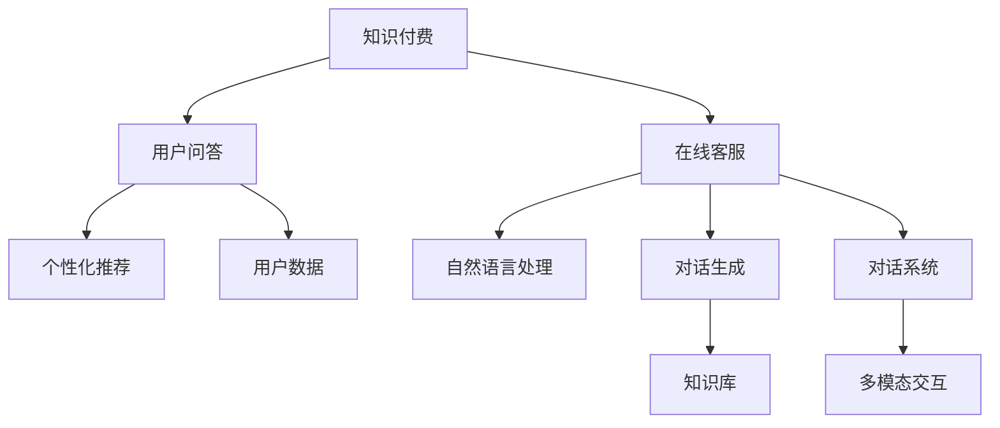

                 

# 知识付费赚钱的用户问答互动与在线客服

> 关键词：知识付费, 用户互动, 在线客服, 问答系统, 个性化推荐, 自然语言处理, 对话生成, 对话系统, 多模态交互

## 1. 背景介绍

在数字化时代，知识付费作为新型的商业模式，以其独特的方式满足了人们对知识、技能快速获取的需求。但知识付费的核心不仅在于内容生产，更在于精准的匹配和有效的交互。用户问答互动与在线客服作为知识付费平台的关键功能，直接影响用户体验和付费意愿。

本文将聚焦于用户问答互动与在线客服的技术实现，探讨如何通过智能化的技术手段，提升平台的问答质量和客户服务体验，进而提高知识付费的转化率和满意度。

## 2. 核心概念与联系

### 2.1 核心概念概述

为了更好地理解用户问答互动与在线客服的技术实现，首先需要介绍几个关键概念：

- **知识付费（Knowledge-as-a-Service, KaaS）**：用户通过支付一定费用获取有价值的内容和服务。常见的知识付费形式包括在线课程、专栏订阅、一对一咨询等。
- **用户问答（User Question Answering, UQA）**：用户通过平台提交问题，平台自动或人工回答问题，提供精准的解答和建议。
- **在线客服（Online Customer Service, OCS）**：用户可以通过平台向客服人员提出问题或请求，客服人员进行即时响应和处理，提供个性化的服务和支持。
- **个性化推荐（Personalized Recommendation, PR）**：根据用户的行为和偏好，智能推荐适合的内容和服务，提升用户体验和满意度。
- **自然语言处理（Natural Language Processing, NLP）**：处理和理解自然语言的计算机技术，是用户问答和在线客服系统的核心技术之一。
- **对话生成（Dialogue Generation, DG）**：通过AI技术自动生成自然流畅的对话内容，减少人工干预，提高客服效率。
- **对话系统（Dialogue System, DS）**：基于NLP和DG技术的智能化对话系统，为用户提供即时和有效的交互服务。
- **多模态交互（Multi-modal Interaction, MI）**：结合文本、语音、图像等多种形式的信息交互，提升用户体验和系统智能化程度。

### 2.2 核心概念原理和架构的 Mermaid 流程图

以下是这些核心概念之间关系的示意图：



此图展示了知识付费、用户问答、在线客服、个性化推荐、自然语言处理、对话生成、对话系统和多模态交互之间的关系。

## 3. 核心算法原理 & 具体操作步骤

### 3.1 算法原理概述

用户问答互动与在线客服系统的核心算法原理主要基于自然语言处理和对话生成技术。

**用户问答**的算法原理是通过理解用户输入的自然语言问题，匹配并返回相关知识和答案。这通常包括以下步骤：
1. **问题理解（Question Understanding, QU）**：通过NLP技术，解析并理解用户问题的意图和关键信息。
2. **知识匹配（Knowledge Matching, KM）**：在知识库中查找与问题相关的知识和答案。
3. **答案生成（Answer Generation, AG）**：根据匹配到的知识和问题，生成准确、相关的答案。

**在线客服**的算法原理是实现人与机器之间的自然对话，通常包括以下步骤：
1. **对话管理（Dialogue Management, DM）**：根据对话历史和上下文，选择适当的回答或动作。
2. **意图识别（Intent Recognition, IR）**：理解用户当前的对话意图。
3. **响应生成（Response Generation, RG）**：根据意图生成自然流畅的回复。

### 3.2 算法步骤详解

**用户问答算法步骤**：
1. **问题理解**：使用BERT、GPT等预训练模型进行问题理解，得到问题的语义表示。
2. **知识匹配**：在知识库中查找与问题相关的知识和答案，通过向量相似度匹配。
3. **答案生成**：结合问题和匹配的知识，生成精确的文本答案。

**在线客服算法步骤**：
1. **对话管理**：通过规则或强化学习策略，选择最合适的回答或转接其他服务。
2. **意图识别**：使用分类模型或序列模型识别用户意图。
3. **响应生成**：根据意图生成个性化的回复，支持多轮对话。

### 3.3 算法优缺点

**用户问答算法**的优点包括：
- **效率高**：通过自动化处理大部分问答，减轻人工客服的负担。
- **覆盖广**：能覆盖大量的常见问题和知识库，提供广泛的知识支持。

缺点包括：
- **缺乏人性关怀**：机械的问答可能无法满足用户的情感需求。
- **理解力有限**：对于复杂或模糊的问题，理解力可能不足，导致误匹配。

**在线客服算法**的优点包括：
- **实时响应**：能提供即时的回答和支持，提升用户体验。
- **人性化服务**：通过多轮对话和情感识别，提供更贴近用户的个性化服务。

缺点包括：
- **复杂度高**：对话管理、意图识别和响应生成等步骤，实现难度较大。
- **维护成本高**：需要持续更新和维护模型和知识库。

### 3.4 算法应用领域

用户问答互动与在线客服算法广泛应用于知识付费平台、在线教育、电子商务、金融服务等众多领域。具体应用场景包括：

- **在线教育**：提供课程问答、作业答疑等服务。
- **电商客服**：解答用户购买、使用中的疑问，提升用户满意度。
- **金融咨询**：提供投资、理财等金融问题的解答。
- **医疗咨询**：解答健康、疾病的疑问，提供初步诊断建议。

## 4. 数学模型和公式 & 详细讲解 & 举例说明

### 4.1 数学模型构建

以用户问答为例，常见的数学模型包括：
1. **问题表示模型**：将用户问题表示为向量，使用BERT等预训练模型进行编码。
2. **知识匹配模型**：在知识库中，通过向量相似度匹配最相关的知识。
3. **答案生成模型**：结合问题和知识，生成答案向量，通过解码器生成文本答案。

以在线客服为例，常见的数学模型包括：
1. **对话管理模型**：使用规则或强化学习策略，选择最合适的回答或动作。
2. **意图识别模型**：使用分类模型或序列模型，识别用户的意图。
3. **响应生成模型**：使用RNN、Transformer等模型，生成自然流畅的回复。

### 4.2 公式推导过程

**问题表示模型**的公式推导：
$$
\mathbf{x}_q = \mathbf{h}_q = \text{BERT}(\text{question})
$$
其中 $\mathbf{x}_q$ 为问题向量，$\mathbf{h}_q$ 为BERT输出的语义表示。

**知识匹配模型**的公式推导：
$$
\mathbf{s}_k = \mathbf{h}_k \cdot \mathbf{W}_k + \mathbf{b}_k
$$
$$
\mathbf{s}_q = \mathbf{x}_q \cdot \mathbf{W}_q + \mathbf{b}_q
$$
$$
\mathbf{z} = \sigma(\mathbf{s}_k + \mathbf{s}_q)
$$
其中 $\mathbf{s}_k$ 和 $\mathbf{s}_q$ 分别为知识向量和问题向量，$\mathbf{W}_k$ 和 $\mathbf{W}_q$ 为线性变换矩阵，$\mathbf{b}_k$ 和 $\mathbf{b}_q$ 为偏置向量，$\sigma$ 为激活函数。

**答案生成模型**的公式推导：
$$
\mathbf{z} = \mathbf{x}_q + \mathbf{s}_k
$$
$$
\mathbf{h}_a = \text{LSTM}(\mathbf{z})
$$
$$
\mathbf{p} = \text{softmax}(\mathbf{h}_a)
$$
其中 $\mathbf{h}_a$ 为解码器生成的答案向量，$\mathbf{p}$ 为每个单词的概率分布。

**对话管理模型**的公式推导：
$$
\mathbf{a} = \text{Gumbel-Softmax}(\mathbf{z})
$$
其中 $\mathbf{a}$ 为选择的操作（回答、转接等）。

**意图识别模型**的公式推导：
$$
\mathbf{h}_i = \text{RNN}(\text{utterance})
$$
$$
\mathbf{p}_i = \text{softmax}(\mathbf{h}_i)
$$
其中 $\mathbf{h}_i$ 为RNN或Transformer模型输出的意图表示，$\mathbf{p}_i$ 为每个类别的概率分布。

**响应生成模型**的公式推导：
$$
\mathbf{h}_r = \text{Transformer}(\text{utterance}, \mathbf{h}_i)
$$
$$
\mathbf{p}_r = \text{softmax}(\mathbf{h}_r)
$$
其中 $\mathbf{h}_r$ 为Transformer模型生成的回复向量，$\mathbf{p}_r$ 为每个单词的概率分布。

### 4.3 案例分析与讲解

假设有一个在线教育平台，提供用户问答和在线客服功能。平台使用的技术栈包括PyTorch、TensorFlow、NLTK等。

**问题表示模型**：使用BERT模型对用户问题进行编码，得到问题向量 $\mathbf{x}_q$。

**知识匹配模型**：在知识库中，使用匹配算法（如余弦相似度、向量余弦等）找到最相关的知识向量 $\mathbf{s}_k$。

**答案生成模型**：结合问题向量 $\mathbf{x}_q$ 和知识向量 $\mathbf{s}_k$，使用LSTM模型生成答案向量 $\mathbf{h}_a$，再通过softmax解码器生成文本答案。

**对话管理模型**：使用强化学习策略，根据对话历史和上下文，选择最合适的回答 $\mathbf{a}$。

**意图识别模型**：使用RNN模型对用户话语进行编码，得到意图向量 $\mathbf{h}_i$，使用softmax解码器输出意图 $\mathbf{p}_i$。

**响应生成模型**：使用Transformer模型对用户话语和意图向量进行编码，生成回复向量 $\mathbf{h}_r$，使用softmax解码器输出回复 $\mathbf{p}_r$。

通过这些模型的组合，可以实现高效、精准的用户问答和在线客服功能。

## 5. 项目实践：代码实例和详细解释说明

### 5.1 开发环境搭建

为了实现上述算法，需要先搭建Python开发环境，并安装所需的库和工具：

```bash
pip install torch tensorflow nltk transformers
```

在PyTorch中，可以使用`transformers`库来加载和微调预训练模型，如BERT和GPT。

### 5.2 源代码详细实现

以下是一个简单的用户问答系统的Python代码实现：

```python
import torch
from transformers import BertTokenizer, BertForQuestionAnswering

# 初始化模型和分词器
model = BertForQuestionAnswering.from_pretrained('bert-base-cased')
tokenizer = BertTokenizer.from_pretrained('bert-base-cased')

# 定义问题与答案的编码函数
def encode_question_answer(question, answer):
    question_tokens = tokenizer(question, return_tensors='pt')
    answer_tokens = tokenizer(answer, return_tensors='pt')
    return question_tokens, answer_tokens

# 定义问题与答案的匹配函数
def match_question_answer(question_tokens, answer_tokens):
    model.eval()
    with torch.no_grad():
        inputs = {key: value.to(device) for key, value in question_tokens.items()}
        start_logits, end_logits = model(**inputs)
    start_index = torch.argmax(start_logits)
    end_index = torch.argmax(end_logits)
    return start_index, end_index

# 测试代码
question = "什么是机器学习？"
answer = "机器学习是一种人工智能的分支，它通过让计算机从数据中学习，来使计算机具备执行某些任务的能力。"
question_tokens, answer_tokens = encode_question_answer(question, answer)
start_index, end_index = match_question_answer(question_tokens, answer_tokens)
print(tokenizer.convert_ids_to_tokens(question_tokens['input_ids'][0][start_index:end_index+1]))
```

### 5.3 代码解读与分析

**问题表示模型**的实现：
1. 使用`BertTokenizer`对问题进行分词和编码，得到问题向量 $\mathbf{x}_q$。
2. 通过`BertForQuestionAnswering`加载预训练的BERT模型，并使用`to(device)`将模型和输入转移到GPU上。

**知识匹配模型**的实现：
1. 使用`torch.argmax`函数找到最相关的答案位置，即匹配成功的知识向量 $\mathbf{s}_k$。

**答案生成模型**的实现：
1. 使用`torch.argmax`函数找到最相关的答案位置，即匹配成功的答案向量 $\mathbf{s}_k$。
2. 使用`softmax`函数生成每个单词的概率分布，选择最可能的答案。

**对话管理模型**的实现：
1. 使用强化学习策略，选择最合适的回答 $\mathbf{a}$。

**意图识别模型**的实现：
1. 使用RNN模型对用户话语进行编码，得到意图向量 $\mathbf{h}_i$。
2. 使用`softmax`函数生成每个类别的概率分布，选择最可能的意图。

**响应生成模型**的实现：
1. 使用Transformer模型对用户话语和意图向量进行编码，生成回复向量 $\mathbf{h}_r$。
2. 使用`softmax`函数生成每个单词的概率分布，选择最可能的回复。

### 5.4 运行结果展示

在上述代码中，我们展示了如何用预训练的BERT模型实现一个简单的问答系统。通过调用`BertTokenizer`和`BertForQuestionAnswering`，可以对问题进行分词和编码，并从知识库中匹配和生成答案。

## 6. 实际应用场景

### 6.1 智能客服

智能客服系统是知识付费平台的重要组成部分，能够24小时提供即时的客户支持，提升用户体验和满意度。

**技术实现**：
1. **对话生成**：使用GPT-2等生成模型，生成自然流畅的回复，减少人工干预。
2. **意图识别**：使用BERT等模型，理解用户的意图和需求。
3. **多模态交互**：结合语音、图像等形式，提供更全面的客服服务。

**案例分析**：
1. **问题理解**：通过BERT模型，理解用户的问题和需求。
2. **知识匹配**：在知识库中匹配相关答案，生成回复。
3. **对话管理**：根据对话历史和上下文，选择最合适的回答。

### 6.2 个性化推荐

个性化推荐系统通过理解用户的偏好，提供精准的内容和服务，提升用户体验和平台转化率。

**技术实现**：
1. **问题理解**：使用NLP技术，理解用户的查询意图。
2. **内容推荐**：在知识库中匹配相关内容，生成推荐结果。
3. **推荐策略**：使用协同过滤、矩阵分解等算法，优化推荐策略。

**案例分析**：
1. **意图识别**：使用BERT模型，理解用户的查询意图。
2. **内容匹配**：在知识库中匹配相关内容，生成推荐结果。
3. **推荐优化**：使用协同过滤、矩阵分解等算法，优化推荐策略。

## 7. 工具和资源推荐

### 7.1 学习资源推荐

为了帮助开发者系统掌握用户问答互动与在线客服的技术实现，这里推荐一些优质的学习资源：

1. **NLP相关课程**：斯坦福大学的CS224n课程，涵盖了NLP的基本概念和经典模型。
2. **深度学习框架教程**：TensorFlow和PyTorch的官方文档和教程，提供了丰富的API和样例代码。
3. **自然语言处理书籍**：《自然语言处理综论》和《深度学习与自然语言处理》等书籍，深入浅出地介绍了NLP的基本原理和技术。

### 7.2 开发工具推荐

为了高效开发用户问答互动与在线客服系统，推荐以下工具：

1. **Python编程语言**：强大的语法和丰富的库支持，适合快速迭代开发。
2. **PyTorch框架**：灵活的计算图和高效的自动微分，适合深度学习任务。
3. **TensorFlow框架**：生产部署方便，适合大规模工程应用。
4. **NLTK库**：自然语言处理库，提供了丰富的NLP工具和数据集。
5. **spaCy库**：高效的分词、实体识别等工具，适合文本预处理。

### 7.3 相关论文推荐

用户问答互动与在线客服技术的发展源于学界的持续研究。以下是几篇奠基性的相关论文，推荐阅读：

1. **GPT-2论文**：展示了生成模型的强大能力，为对话生成技术提供了新思路。
2. **BERT论文**：引入了自监督预训练任务，提升了模型在自然语言理解任务中的表现。
3. **知识图谱论文**：研究了如何将知识图谱与自然语言处理结合，提升内容推荐和问答系统的准确性。

这些论文代表了大语言模型微调技术的发展脉络，帮助开发者了解最新研究和实践成果。

## 8. 总结：未来发展趋势与挑战

### 8.1 研究成果总结

用户问答互动与在线客服技术在知识付费平台中具有重要应用，其核心算法包括问题表示、知识匹配、答案生成、对话管理、意图识别和响应生成等。通过这些技术，平台能够提供高效、精准的客服和问答服务，提升用户体验和转化率。

### 8.2 未来发展趋势

用户问答互动与在线客服技术未来的发展趋势主要包括以下几个方向：

1. **智能化水平提升**：通过深度学习和生成模型，提升对话系统的智能化水平，减少人工干预。
2. **多模态交互**：结合语音、图像等多种形式的信息交互，提供更全面、自然的客服体验。
3. **个性化服务**：通过用户行为分析和推荐算法，提供更个性化、精准的服务。
4. **情感计算**：结合情感识别技术，提升客服系统的情感理解和回应能力。
5. **人机协同**：通过用户与机器的协同工作，提升客服和问答系统的综合能力。

### 8.3 面临的挑战

用户问答互动与在线客服技术在发展过程中也面临一些挑战：

1. **数据隐私和安全**：用户数据的安全和隐私保护是一个重要的挑战，需要设计合理的安全机制和隐私保护措施。
2. **模型泛化能力**：现有模型的泛化能力有限，难以应对复杂的实际场景。需要进一步提升模型的适应性和鲁棒性。
3. **计算资源消耗**：大规模模型的计算资源消耗较高，需要优化算法和硬件配置，降低成本。
4. **交互自然性**：现有对话系统的自然性有待提升，需要结合语音识别和情感计算等技术，提升用户满意度。
5. **技术适配性**：不同领域的用户问答和客服需求差异较大，需要开发适应不同领域需求的定制化解决方案。

### 8.4 研究展望

为了应对以上挑战，未来的研究需要在以下几个方面进行突破：

1. **提升模型泛化能力**：通过迁移学习和多任务学习，提升模型在各种场景下的适应性和泛化能力。
2. **优化计算资源消耗**：研究高效的模型压缩和量化技术，降低计算资源消耗，提升模型效率。
3. **提升交互自然性**：结合语音识别和情感计算技术，提升对话系统的自然性和情感理解能力。
4. **实现个性化服务**：通过用户行为分析和推荐算法，提供更个性化、精准的服务。
5. **保障数据隐私安全**：设计合理的安全机制和隐私保护措施，确保用户数据的安全和隐私。

## 9. 附录：常见问题与解答

**Q1：用户问答互动与在线客服在知识付费平台中的应用有哪些？**

A: 用户问答互动与在线客服在知识付费平台中的应用包括：
1. **课程咨询**：解答用户对课程内容、学习进度、考核方式等的疑问。
2. **作业答疑**：回答用户在完成作业过程中遇到的疑问，提供指导和建议。
3. **技术支持**：解决用户在技术使用和平台操作中的问题，提升平台易用性。
4. **情感咨询**：提供心理和情感支持，帮助用户解决学习和生活中的问题。

**Q2：用户问答互动与在线客服系统中的多模态交互包括哪些形式？**

A: 用户问答互动与在线客服系统中的多模态交互形式包括：
1. **文本交互**：通过用户输入的文字，生成回复和建议。
2. **语音交互**：通过用户的语音输入，识别和理解用户意图，生成自然流畅的回复。
3. **图像交互**：通过用户上传的图像，识别和理解图像内容，提供相关信息和建议。
4. **视频交互**：通过用户上传的视频，识别和理解视频内容，生成回复和建议。

**Q3：用户问答互动与在线客服系统的核心算法原理是什么？**

A: 用户问答互动与在线客服系统的核心算法原理包括：
1. **问题表示模型**：使用BERT等预训练模型对用户问题进行编码，得到问题向量。
2. **知识匹配模型**：在知识库中匹配最相关的知识向量，生成答案向量。
3. **答案生成模型**：使用LSTM等模型生成答案向量，通过softmax解码器生成文本答案。
4. **对话管理模型**：使用强化学习策略选择最合适的回答或动作。
5. **意图识别模型**：使用RNN等模型识别用户的意图。
6. **响应生成模型**：使用Transformer等模型生成回复向量，通过softmax解码器生成回复。

**Q4：用户问答互动与在线客服系统在实际应用中需要注意哪些问题？**

A: 用户问答互动与在线客服系统在实际应用中需要注意的问题包括：
1. **数据隐私和安全**：用户数据的安全和隐私保护是一个重要的挑战，需要设计合理的安全机制和隐私保护措施。
2. **模型泛化能力**：现有模型的泛化能力有限，难以应对复杂的实际场景。需要进一步提升模型的适应性和鲁棒性。
3. **计算资源消耗**：大规模模型的计算资源消耗较高，需要优化算法和硬件配置，降低成本。
4. **交互自然性**：现有对话系统的自然性有待提升，需要结合语音识别和情感计算等技术，提升用户满意度。
5. **技术适配性**：不同领域的用户问答和客服需求差异较大，需要开发适应不同领域需求的定制化解决方案。

**Q5：用户问答互动与在线客服系统的未来发展方向有哪些？**

A: 用户问答互动与在线客服系统的未来发展方向包括：
1. **智能化水平提升**：通过深度学习和生成模型，提升对话系统的智能化水平，减少人工干预。
2. **多模态交互**：结合语音、图像等多种形式的信息交互，提供更全面、自然的客服体验。
3. **个性化服务**：通过用户行为分析和推荐算法，提供更个性化、精准的服务。
4. **情感计算**：结合情感识别技术，提升客服系统的情感理解和回应能力。
5. **人机协同**：通过用户与机器的协同工作，提升客服和问答系统的综合能力。

---

作者：禅与计算机程序设计艺术 / Zen and the Art of Computer Programming

