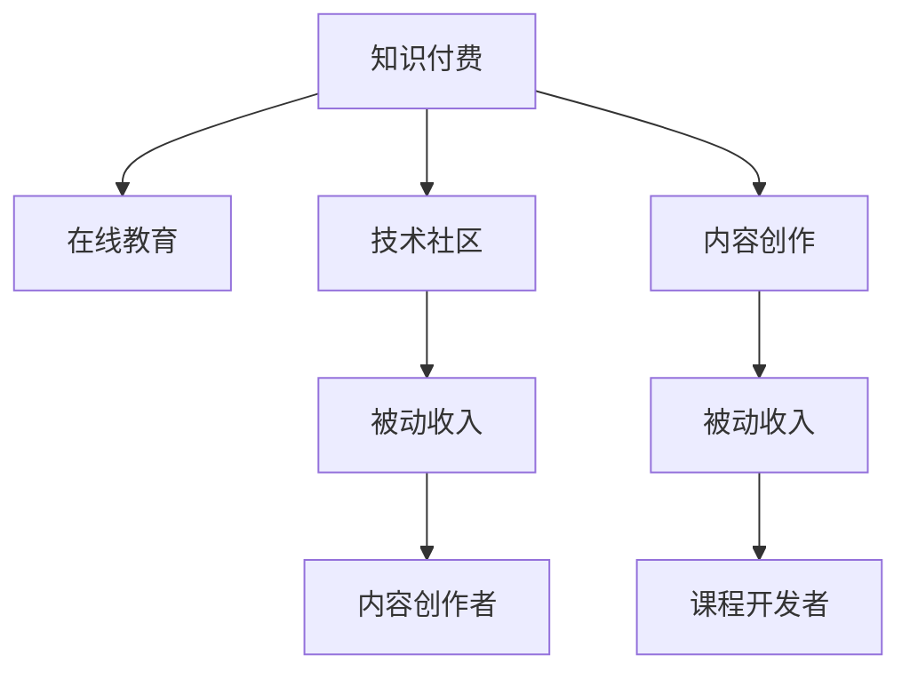

                 

# 知识付费：程序员的被动收入之道

## 1. 背景介绍

### 1.1 问题由来
随着互联网的普及和信息技术的飞速发展，人们获取知识和信息的方式已经发生了巨大变化。传统的纸质书籍、报纸、电视等媒介逐渐被数字化、网络化的内容所取代。在这个过程中，知识付费应运而生，成为了人们获取专业知识和服务的新途径。

程序员作为互联网和软件技术的重要推动者，其知识经验和技术技能在市场上具有很高的价值。随着知识付费的兴起，程序员有了新的机会，可以通过分享自己的专业知识和技能，获取被动收入。

### 1.2 问题核心关键点
程序员通过知识付费获取被动收入的主要途径有以下几种：

- **在线课程**：利用视频、图文等多种形式，向学员讲解技术知识，包括编程语言、算法、框架、设计模式等。
- **技术博客**：在博客平台上分享技术心得、项目案例、开发经验等，建立个人品牌。
- **咨询和培训**：通过在线咨询、线下培训等方式，提供专业性的技术支持和服务。
- **软件和工具开发**：开发实用的软件工具，通过销售、订阅或广告收入获利。
- **知识共享平台**：加入知识共享平台，通过提供内容赚取平台分成。

## 2. 核心概念与联系

### 2.1 核心概念概述

为更好地理解程序员如何通过知识付费获得被动收入，本节将介绍几个关键概念：

- **知识付费**：指用户为获取知识或信息，支付相应费用的模式。
- **被动收入**：指无需主动劳动，通过投资、版权、广告、订阅等方式获得的收入。
- **在线教育**：通过互联网平台提供课程、讲座、培训等服务，帮助用户学习知识和技能。
- **内容创作**：包括文章、视频、音频等多种形式的内容创作，供用户学习参考。
- **技术社区**：程序员通过参与技术社区，分享经验、交流心得、解决问题，提升自身影响力。
- **知识共享**：利用平台或工具，将知识和技能分享给更多用户，实现资源共享。

这些概念之间的逻辑关系可以通过以下Mermaid流程图来展示：



这个流程图展示了几类关键概念及其之间的关系：

1. 知识付费是整个系统的起点，通过平台和服务提供知识资源。
2. 在线教育和内容创作是主要的知识供给方式，由课程开发者和技术社区成员提供。
3. 技术社区和内容创作者通过平台分享知识，获得被动收入。
4. 在线教育平台通过提供课程服务，获得订阅和广告收入。

## 3. 核心算法原理 & 具体操作步骤
### 3.1 算法原理概述

程序员通过知识付费获取被动收入的过程，可以简单概括为以下几个步骤：

1. **内容创作**：程序员利用自身专业知识，创作出有价值的内容。
2. **平台分享**：将内容分享到知识付费平台，如Coursera、Udemy、Bilibili、知乎等。
3. **用户支付**：用户支付相应费用，获取知识或服务。
4. **平台分成**：平台根据内容创作者的表现和用户反馈，进行收益分成。
5. **持续优化**：根据用户反馈和市场需求，不断优化和改进内容。

### 3.2 算法步骤详解

以下我们将详细讲解知识付费的整个过程：

**Step 1: 内容创作**
- 确定主题和受众：根据自身兴趣和市场需求，确定创作主题和目标受众。
- 内容准备：收集资料、编写脚本、制作视频或图文等。
- 质量保证：保证内容的质量和实用性，避免误导用户。

**Step 2: 平台分享**
- 选择合适的平台：根据目标受众和内容类型，选择合适的知识付费平台。
- 提交内容：上传内容至平台，填写详细描述、价格等信息。
- 审核发布：平台审核内容，确认无误后发布。

**Step 3: 用户支付**
- 用户购买：用户浏览内容后，选择购买或订阅。
- 支付费用：通过平台提供的支付渠道，支付相应费用。
- 获取内容：平台提供下载、观看或阅读权限。

**Step 4: 平台分成**
- 收益结算：平台根据内容表现和用户反馈，进行收益结算，扣除平台费用。
- 支付分成：平台将分成支付给内容创作者。

**Step 5: 持续优化**
- 收集反馈：收集用户反馈，了解内容效果和用户需求。
- 改进内容：根据反馈进行优化，提高内容质量。
- 推广内容：利用平台和社交媒体等渠道，推广内容。

### 3.3 算法优缺点

知识付费模式具有以下优点：

- **高价值输出**：程序员利用专业知识输出有价值的内容，满足用户需求。
- **灵活性高**：内容创作和分享灵活，适合不同背景和需求的程序员。
- **收益多样**：通过平台分成、广告、销售等多种方式获取收入，收益渠道多样。

同时，该模式也存在以下局限性：

- **质量控制困难**：缺乏统一标准，内容质量参差不齐，影响用户体验。
- **用户依赖性高**：依赖平台流量和推荐，用户粘性不足。
- **市场竞争激烈**：平台众多，内容创作和竞争激烈，容易导致内容同质化。
- **知识产权风险**：平台可能存在版权纠纷，创作者需注意知识产权保护。

### 3.4 算法应用领域

知识付费模式不仅适用于技术领域，在教育、医疗、艺术等多个领域都有广泛应用。在编程技术领域，以下几类内容最受欢迎：

- **编程语言教程**：如Python、Java、C++等编程语言的入门和进阶教程。
- **框架和库使用**：如Django、React、TensorFlow等框架和库的详细讲解和实战案例。
- **算法和数据结构**：如排序算法、图算法、数据结构等，帮助用户提升编程技能。
- **项目实战**：如Web开发项目、移动应用开发、数据科学项目等，提供实战经验。
- **软技能**：如代码管理、团队协作、项目规划等，提升程序员的综合能力。

## 4. 数学模型和公式 & 详细讲解 & 举例说明

### 4.1 数学模型构建

我们假设有N个程序员，每个程序员每年创作并发布m篇内容。内容被用户购买或订阅的概率为p，平台分成率为r。则每个程序员每年的被动收入为：

$$
\text{收入} = N \times m \times p \times r
$$

其中，N为程序员数量，m为每人的内容数量，p为内容被购买的概率，r为平台分成率。

### 4.2 公式推导过程

- **内容创作数量**：假设有N个程序员，每人每年创作m篇内容，则全年内容总数为 $N \times m$。
- **购买概率**：设内容被用户购买的概率为p，则每篇内容被购买的期望次数为 $p \times N \times m$。
- **平台分成**：设平台分成率为r，则每篇内容的分成收入为 $p \times N \times m \times r$。
- **被动收入**：每位程序员每年的被动收入为 $p \times N \times m \times r$。

### 4.3 案例分析与讲解

假设某技术社区有1000名程序员，每人每年创作10篇技术文章，文章被购买的概率为20%，平台分成率为30%，则每位程序员每年的被动收入为：

$$
\text{收入} = 1000 \times 10 \times 0.2 \times 0.3 = 600 \text{元/年}
$$

这个案例展示了知识付费模式的基本计算过程，程序员通过平台分享内容，获取被动收入。

## 5. 项目实践：代码实例和详细解释说明

### 5.1 开发环境搭建

在进行知识付费项目开发前，需要准备开发环境，以下是一些基本步骤：

1. **选择开发平台**：根据需求选择在线教育平台、技术博客、知识共享平台等。
2. **安装开发工具**：如Python、Git、IDE等。
3. **配置开发环境**：如安装必要的库、配置开发环境等。

### 5.2 源代码详细实现

这里以在线教育平台为例，展示如何通过Python开发在线课程：

```python
# 导入必要的库
from flask import Flask, request, render_template
from flask_login import LoginManager, UserMixin, login_user, login_required, logout_user

# 初始化应用
app = Flask(__name__)

# 配置数据库
app.config['SQLALCHEMY_DATABASE_URI'] = 'sqlite:///app.db'
db = SQLAlchemy(app)

# 定义用户模型
class User(db.Model, UserMixin):
    id = db.Column(db.Integer, primary_key=True)
    username = db.Column(db.String(100))
    password = db.Column(db.String(100))

# 定义课程模型
class Course(db.Model):
    id = db.Column(db.Integer, primary_key=True)
    title = db.Column(db.String(100))
    content = db.Column(db.Text)
    price = db.Column(db.Float)

# 定义登录和注销路由
@app.route('/login', methods=['GET', 'POST'])
def login():
    if request.method == 'POST':
        username = request.form['username']
        password = request.form['password']
        user = User.query.filter_by(username=username, password=password).first()
        if user:
            login_user(user)
            return redirect('/')
        else:
            return render_template('login.html', error='Invalid username or password')
    return render_template('login.html')

@app.route('/logout')
@login_required
def logout():
    logout_user()
    return redirect('/')

# 定义课程管理路由
@app.route('/courses', methods=['GET', 'POST'])
@login_required
def courses():
    courses = Course.query.all()
    return render_template('courses.html', courses=courses)

# 定义添加课程路由
@app.route('/add_course', methods=['GET', 'POST'])
@login_required
def add_course():
    if request.method == 'POST':
        title = request.form['title']
        content = request.form['content']
        price = request.form['price']
        course = Course(title=title, content=content, price=price)
        db.session.add(course)
        db.session.commit()
        return redirect('/courses')
    return render_template('add_course.html')

if __name__ == '__main__':
    app.run(debug=True)
```

### 5.3 代码解读与分析

**Flask框架**：
- 使用Flask框架搭建在线教育平台，提供基本的路由、模板渲染和用户管理功能。
- 使用SQLAlchemy作为ORM，管理数据库中的用户和课程数据。
- 使用Flask-Login进行用户认证，提供登录和注销功能。

**用户管理**：
- 定义用户模型，存储用户名和密码。
- 实现登录和注销功能，使用户能够访问课程页面。

**课程管理**：
- 定义课程模型，存储课程的标题、内容和价格。
- 提供课程列表和添加课程功能，供用户查看和管理。

**功能实现**：
- 使用表单和路由实现用户登录、课程列表和添加课程功能。
- 使用模板渲染技术，提供静态页面的呈现方式。

**运行结果展示**：
- 运行代码后，启动服务器，访问指定的URL地址，即可看到在线教育平台的界面。用户可以登录、查看课程列表、添加课程等。

## 6. 实际应用场景

### 6.1 技术博客平台

技术博客平台是程序员分享知识和经验的重要渠道。程序员可以在博客上发布技术文章、项目案例、编程心得等，吸引粉丝关注，并通过打赏、广告等方式获得收益。

### 6.2 在线教育平台

在线教育平台提供了系统化的学习资源，程序员可以通过录制视频、编写课程等形式，向学员提供编程技能、软件开发、人工智能等课程。学员支付相应的费用，平台提供课程服务。

### 6.3 知识共享平台

知识共享平台如GitHub、Stack Overflow等，程序员可以通过提供代码、回答问题等方式，分享知识和经验，获取平台积分或货币奖励。

### 6.4 未来应用展望

未来知识付费模式将更加多样化和灵活化，以下是一些趋势：

1. **个性化学习**：根据用户兴趣和需求，提供个性化的课程和内容，提升学习效果。
2. **微课程和小视频**：利用短视频、微课程等形式，提高用户学习体验。
3. **社区互动**：建立社区，增强用户互动，提供学习交流平台。
4. **跨平台联动**：通过不同平台之间的联动，提升整体用户粘性和影响力。
5. **全球化市场**：拓展全球用户市场，获取更多潜在用户。

## 7. 工具和资源推荐

### 7.1 学习资源推荐

为了帮助程序员系统掌握知识付费的理论和实践，推荐以下学习资源：

1. **《知识付费：互联网时代的商业模式》**：介绍知识付费的市场现状、商业模式、用户需求等，提供系统的知识框架。
2. **Coursera、Udemy等在线教育平台**：提供丰富的课程资源和实践机会，学习编程技能、软件开发、数据分析等。
3. **知乎、CSDN等技术社区**：提供技术交流平台，分享编程心得、项目案例等，提升自身影响力。
4. **Google Analytics、AdWords等工具**：分析用户行为，优化内容表现，提升收益效果。
5. **知识共享平台文档**：学习如何使用GitHub、Stack Overflow等平台，提供代码分享和问题解答功能。

### 7.2 开发工具推荐

高效的开发离不开优秀的工具支持。以下是几款常用的知识付费开发工具：

1. **Flask框架**：简单易用的Web框架，适合快速开发在线教育平台和博客平台。
2. **SQLAlchemy**：ORM框架，用于管理数据库中的用户和课程数据。
3. **Flask-Login**：用户认证框架，提供登录和注销功能。
4. **Markdown编辑器**：如Typora、MarkdownPad等，用于编写和渲染技术文章。
5. **GitHub**：代码托管平台，用于版本控制和代码分享。
6. **AdWords**：广告平台，用于提升平台流量和用户转化率。

### 7.3 相关论文推荐

知识付费领域的理论研究和实践探索，得益于众多学者的努力。以下是几篇重要的相关论文，推荐阅读：

1. **《知识付费的市场规模和增长潜力》**：研究知识付费市场的现状和增长潜力，提供数据支持。
2. **《知识付费模式的研究与实践》**：探讨知识付费的商业模式和用户需求，提供理论框架和实践经验。
3. **《在线教育平台的技术架构与实践》**：介绍在线教育平台的技术实现，提供系统化的开发经验。
4. **《内容创作者的经济模型》**：研究内容创作者的经济模型和收益分配机制，提供经济学视角。
5. **《社交媒体对知识付费的影响》**：分析社交媒体对知识付费的影响，提供实证研究。

## 8. 总结：未来发展趋势与挑战

### 8.1 总结

本文对程序员通过知识付费获取被动收入的过程进行了全面系统的介绍。首先阐述了知识付费和被动收入的概念，明确了程序员通过内容创作获取收益的途径。其次，从原理到实践，详细讲解了知识付费的数学模型和具体步骤，给出了实际开发中的代码实现和运行结果展示。同时，本文还探讨了知识付费在实际应用中的多种场景，展示了其广泛的应用前景。

通过本文的系统梳理，可以看到，知识付费为程序员提供了一个全新的获取被动收入的渠道，提升了程序员的综合价值。未来，伴随知识付费模式的持续演进，相信程序员将能够更高效地分享知识，获取更多收益。

### 8.2 未来发展趋势

展望未来，知识付费模式将呈现以下几个发展趋势：

1. **内容多样化**：除了传统的编程技能外，更多跨领域、跨学科的内容将进入知识付费市场。
2. **平台集成化**：更多知识付费平台将实现功能整合，提供一站式学习体验。
3. **AI驱动个性化**：利用AI技术，实现内容的个性化推荐和推送，提升用户体验。
4. **区块链应用**：引入区块链技术，保障内容版权和收益透明性。
5. **社交化学习**：增强社交功能，促进用户之间的互动和交流。
6. **全球化市场**：拓展全球用户市场，提供多语言支持和学习资源。

### 8.3 面临的挑战

尽管知识付费模式已经取得了瞩目成就，但在迈向更加智能化、普适化应用的过程中，它仍面临诸多挑战：

1. **内容质量参差不齐**：创作者水平不一，内容质量难以保证，影响用户体验。
2. **市场竞争激烈**：平台众多，内容同质化严重，难以脱颖而出。
3. **用户信任问题**：用户对知识付费平台和内容创作者缺乏信任，付费意愿较低。
4. **知识产权风险**：平台可能存在版权纠纷，创作者需注意知识产权保护。
5. **技术门槛高**：内容创作和平台开发需要一定的技术能力，门槛较高。
6. **市场规范化**：知识付费市场缺乏统一标准和规范，存在一定的乱象。

### 8.4 研究展望

面对知识付费面临的挑战，未来的研究需要在以下几个方面寻求新的突破：

1. **内容质量控制**：建立严格的内容审核机制，提升内容质量。
2. **市场差异化**：开发更多差异化、垂直化的内容，满足用户多样化需求。
3. **用户信任增强**：建立可信的平台机制，保障用户权益。
4. **技术普及化**：降低技术门槛，提供简单易用的开发工具和平台。
5. **市场规范化**：制定行业标准和规范，推动市场健康发展。
6. **技术创新**：利用AI、区块链等新技术，提升平台功能和用户体验。

这些研究方向的探索，必将引领知识付费模式走向更高的台阶，为程序员提供更多获取被动收入的机会，推动技术知识的传播和应用。

## 9. 附录：常见问题与解答

**Q1: 知识付费适合哪些类型的程序员？**

A: 知识付费适合具有一定专业知识和技能的程序员。无论是在线教育、技术博客、知识共享平台还是其他领域，只要有价值的内容，都可以通过知识付费获取收益。

**Q2: 程序员如何选择合适的知识付费平台？**

A: 选择合适的平台需要考虑平台的用户规模、用户质量、内容类型、收益分成等因素。建议先进行市场调研，了解不同平台的特点和优势，选择适合自己的平台。

**Q3: 程序员如何提升内容质量？**

A: 提升内容质量需要从以下几个方面入手：
1. 持续学习：不断学习新知识，保持内容的时效性和实用性。
2. 用户反馈：收集用户反馈，了解用户需求和意见，改进内容。
3. 形式多样：采用多种形式的内容呈现方式，如图文、视频、直播等。
4. 版权保护：注意版权保护，避免侵权纠纷。

**Q4: 程序员如何有效推广内容？**

A: 推广内容可以通过以下几个途径：
1. 社交媒体：利用Twitter、LinkedIn等社交媒体平台，推广内容和平台。
2. 技术社区：在CSDN、Stack Overflow等技术社区发布内容，吸引关注。
3. 搜索引擎优化：优化SEO，提高内容在搜索引擎中的排名。
4. 合作推广：与其他内容创作者、技术博主合作，共同推广内容。

**Q5: 程序员如何应对知识付费平台的变化？**

A: 应对知识付费平台的变化需要关注以下几个方面：
1. 平台动态：关注平台政策变化，及时调整内容发布和推广策略。
2. 用户需求：了解用户需求变化，更新和优化内容。
3. 技术创新：利用新技术提升平台功能，提升用户体验。
4. 市场调研：持续市场调研，了解最新市场趋势和技术动态。

---

作者：禅与计算机程序设计艺术 / Zen and the Art of Computer Programming

