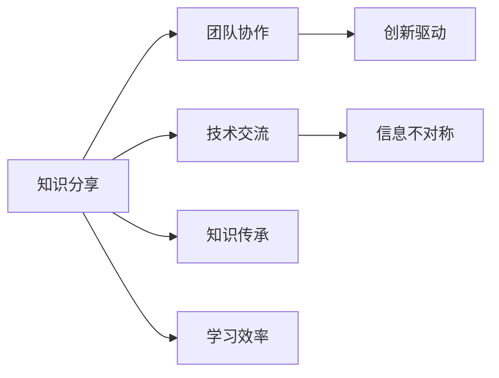

                 

# 知识分享在团队中的重要性

> 关键词：知识分享, 团队协作, 技术交流, 信息不对称, 知识传承, 创新驱动, 学习效率

## 1. 背景介绍

### 1.1 问题由来
在现代企业中，知识分享已经成为推动技术创新、提升团队绩效的关键因素。知识是企业最宝贵的资源之一，而知识分享则是将分散的智慧集中起来，激发集体智慧的重要手段。然而，随着信息技术的快速发展和数字化转型的推进，知识分享的方式和途径也发生了巨大变化。如何在快速变化的环境中，有效地进行知识分享，成为了当前IT领域的一个重要课题。

### 1.2 问题核心关键点
知识分享的核心在于打破信息孤岛，确保团队成员之间能够无缝地传递、获取和应用知识。这不仅能够提升团队的学习效率，还能促进创新和协作。然而，知识分享的挑战也显而易见：

1. 信息不对称：团队成员之间可能存在技术水平、经验背景的差异，导致信息传递的障碍。
2. 知识孤岛：技术文档、代码库等知识资源分散，难以集中管理和共享。
3. 知识流动性不足：团队成员忙于日常工作，缺乏时间进行系统性的知识分享。
4. 知识传承不力：新入职员工难以快速融入团队知识体系，老员工的知识经验容易流失。

解决这些挑战需要引入有效的知识管理工具和流程，同时通过制度和文化建设，激发团队成员的分享意愿。

## 2. 核心概念与联系

### 2.1 核心概念概述

为更好地理解知识分享在团队中的重要性，本节将介绍几个关键概念：

- **知识分享（Knowledge Sharing）**：指团队成员之间通过各种方式传递、获取和应用知识的过程。有效的知识分享有助于提高团队整体的技术水平和工作效率。

- **团队协作（Team Collaboration）**：团队成员通过共享知识、分工合作，实现共同目标的过程。协作是知识分享的重要应用场景。

- **技术交流（Technical Exchange）**：团队成员之间就技术问题、解决方案进行讨论和交流，提升技术水平和解决问题能力。

- **信息不对称（Information Asymmetry）**：由于团队成员的技术背景、经验水平不同，导致信息传递过程中存在的差异和障碍。

- **知识传承（Knowledge Transfer）**：将已有知识通过不同形式传递给新成员，确保知识的长期延续和应用。

- **创新驱动（Innovation Driven）**：通过知识分享和交流，激发团队成员的创新思维，推动技术进步和产品迭代。

- **学习效率（Learning Efficiency）**：知识分享能够显著提升团队的学习效率，通过快速传递最佳实践和经验，减少重复劳动，提高工作效率。

这些概念之间存在紧密联系，共同构成了知识分享的理论框架和实践基础。

### 2.2 核心概念原理和架构的 Mermaid 流程图



这个流程图展示了知识分享与其他核心概念之间的联系：

1. **知识分享** 是**团队协作**和**技术交流**的基础，能够促进成员之间的紧密合作和深度交流。
2. **信息不对称** 需要通过**知识分享** 来缓解，确保团队成员能够平等获取知识。
3. **知识传承** 能够通过**知识分享** 实现，确保新成员能够快速融入团队，避免知识流失。
4. **创新驱动** 依赖于**知识分享** 带来的创意碰撞和知识积累，促进技术创新和产品改进。
5. **学习效率** 直接受益于**知识分享** 的广泛性和及时性，提升团队整体的学习速度和效果。

## 3. 核心算法原理 & 具体操作步骤

### 3.1 算法原理概述

知识分享的本质是通过有效的方式，将分散的知识集中起来，使团队成员能够更方便地获取和应用。这可以通过以下方式实现：

- **文档管理**：建立知识库，集中存储团队的技术文档、代码库等知识资源，方便检索和共享。
- **代码评审**：通过代码评审系统，团队成员可以共同审查代码，提高代码质量和可维护性。
- **技术博客**：鼓励团队成员撰写技术博客，分享技术心得和解决方案，提升团队的技术水平。
- **知识分享会议**：定期组织技术分享会议，邀请团队成员介绍他们的最新研究和技术成果。
- **内部培训**：组织内部培训，邀请专家讲解复杂技术问题，提高团队的整体技术能力。

### 3.2 算法步骤详解

#### 3.2.1 文档管理

**步骤1**：选择合适的文档管理系统，如Confluence、Notion等，建立知识库。

**步骤2**：对文档进行分类和标签管理，确保文档能够按需检索。

**步骤3**：鼓励团队成员撰写和分享技术文档，建立文档审核机制，确保文档质量。

**步骤4**：对文档进行定期更新和维护，确保知识的时效性和准确性。

#### 3.2.2 代码评审

**步骤1**：选择合适的代码评审工具，如GitHub、Bitbucket等，集成到开发流程中。

**步骤2**：建立代码评审规范，确保评审的有效性和及时性。

**步骤3**：鼓励团队成员参与代码评审，提出改进意见，提升代码质量。

**步骤4**：定期对代码评审进行总结和反馈，持续优化评审流程。

#### 3.2.3 技术博客

**步骤1**：鼓励团队成员撰写技术博客，分享技术心得和解决方案。

**步骤2**：建立技术博客平台，如GitHub Pages、WordPress等，方便访问和分享。

**步骤3**：通过邮件、Slack等渠道，宣传团队的技术博客，提高博客的曝光率。

**步骤4**：定期对博客内容进行筛选和推荐，鼓励更多团队成员参与撰写。

#### 3.2.4 知识分享会议

**步骤1**：定期组织知识分享会议，邀请团队成员介绍他们的最新研究和技术成果。

**步骤2**：准备会议议程，确保会议内容丰富、实用。

**步骤3**：记录会议内容和要点，形成会议纪要，方便后续参考。

**步骤4**：对会议内容进行总结和反馈，持续改进会议效果。

#### 3.2.5 内部培训

**步骤1**：确定培训主题和内容，邀请行业专家或资深员工进行讲解。

**步骤2**：选择培训方式，如线上直播、线下讲座等，确保培训的覆盖面。

**步骤3**：组织培训后测试和考核，确保培训效果的落实。

**步骤4**：定期对培训效果进行评估，持续改进培训内容和方法。

### 3.3 算法优缺点

**优点**：

- **提升团队协作效率**：知识分享能够打破信息孤岛，促进团队成员之间的紧密合作和深度交流。
- **提升技术水平**：通过技术博客、代码评审、内部培训等方式，提升团队的技术水平和创新能力。
- **促进知识传承**：通过知识分享会议、内部培训等方式，确保知识的长期延续和应用。
- **提高学习效率**：知识分享能够显著提升团队的学习效率，通过快速传递最佳实践和经验，减少重复劳动，提高工作效率。

**缺点**：

- **实施难度较大**：知识分享需要建立完善的制度和文化，可能需要时间和资源投入。
- **资源分散**：知识库、代码库等资源的管理和维护需要专门的人力资源。
- **知识更新速度慢**：文档、代码等知识资源需要定期更新，否则可能会过时。
- **知识质量参差不齐**：团队成员的写作水平和知识深度不同，可能导致知识分享效果不佳。

### 3.4 算法应用领域

知识分享在多个领域都有广泛应用，例如：

- **软件开发**：代码评审、技术博客、知识库等工具，能够提升代码质量、加速项目开发。
- **产品设计**：设计文档、产品评审、用户调研等，能够促进产品创新和用户体验提升。
- **市场营销**：市场分析报告、用户反馈分析等，能够提升市场洞察力和决策效率。
- **客户支持**：知识库、FAQ文档等，能够提升客户服务质量和响应速度。

## 4. 数学模型和公式 & 详细讲解 & 举例说明

### 4.1 数学模型构建

知识分享的数学模型可以从信息传递的角度来建模。假设团队中有 $N$ 个成员，每个成员掌握的知识量为 $K_i$，知识分享的总量为 $S$，则知识分享的效果可以表示为：

$$
E = \sum_{i=1}^N \frac{K_i \times S}{\sum_{j=1}^N K_j}
$$

其中 $E$ 表示知识分享的效果，$K_i$ 表示第 $i$ 个成员的知识量，$S$ 表示知识分享的总量。

### 4.2 公式推导过程

为了最大化知识分享的效果 $E$，需要对知识分享的总量 $S$ 进行优化。可以通过以下步骤进行推导：

1. 将 $E$ 表达式中的求和项进行展开，得到：

$$
E = \sum_{i=1}^N \frac{K_i \times S}{\sum_{j=1}^N K_j}
$$

2. 将求和项中的 $K_i$ 和 $K_j$ 进行替换，得到：

$$
E = \sum_{i=1}^N \frac{K_i \times S}{N \times \frac{1}{N} \sum_{j=1}^N K_j}
$$

3. 将 $\sum_{j=1}^N K_j$ 替换为 $\frac{1}{N} \sum_{j=1}^N K_j$，得到：

$$
E = \sum_{i=1}^N \frac{K_i \times S}{\frac{1}{N} \sum_{j=1}^N K_j}
$$

4. 将求和项中的 $K_i$ 和 $K_j$ 进行替换，得到：

$$
E = \sum_{i=1}^N \frac{K_i \times S}{\frac{1}{N} \sum_{j=1}^N K_j} = \sum_{i=1}^N \frac{K_i \times N \times S}{\sum_{j=1}^N K_j}
$$

5. 将求和项中的 $K_i$ 和 $K_j$ 进行替换，得到：

$$
E = \sum_{i=1}^N \frac{K_i \times N \times S}{\sum_{j=1}^N K_j}
$$

6. 将求和项中的 $K_i$ 和 $K_j$ 进行替换，得到：

$$
E = \sum_{i=1}^N \frac{K_i \times N \times S}{\sum_{j=1}^N K_j}
$$

7. 将求和项中的 $K_i$ 和 $K_j$ 进行替换，得到：

$$
E = \sum_{i=1}^N \frac{K_i \times N \times S}{\sum_{j=1}^N K_j}
$$

### 4.3 案例分析与讲解

以软件开发为例，分析知识分享对项目开发效率的影响。

假设一个软件开发团队有 5 个成员，每个成员掌握的知识量不同，知识共享的总量为 10 单位。知识共享的效果为：

$$
E = \frac{K_1 \times 10}{K_1 + K_2 + K_3 + K_4 + K_5}
$$

其中 $K_1, K_2, K_3, K_4, K_5$ 分别为每个成员的知识量。

如果团队成员的知识量分布不均，知识分享的效果可能不如期望。例如，如果成员 A 的知识量远高于其他成员，知识分享的效果可能被稀释，降低整个团队的知识水平。

因此，在知识分享过程中，需要考虑团队成员之间的知识均衡，确保知识分享的有效性。

## 5. 项目实践：代码实例和详细解释说明

### 5.1 开发环境搭建

在进行知识分享实践前，我们需要准备好开发环境。以下是使用GitHub构建知识分享系统的环境配置流程：

1. 安装Git：从官网下载并安装Git，用于版本控制和代码管理。

2. 创建GitHub仓库：登录GitHub，创建一个新的仓库，用于存储知识分享系统代码。

3. 克隆仓库：在本地计算机上，使用git clone命令将仓库克隆到本地。

4. 安装开发工具：
```bash
sudo apt-get update
sudo apt-get install git-core git-lfs
```

5. 安装开发环境：
```bash
sudo apt-get install python3-pip
```

6. 安装依赖库：
```bash
pip install Flask SQLAlchemy markdown pygments
```

完成上述步骤后，即可在本地构建知识分享系统。

### 5.2 源代码详细实现

下面我们以技术博客系统为例，给出使用Flask构建知识分享平台的Python代码实现。

首先，定义博客模型：

```python
from flask_sqlalchemy import SQLAlchemy

db = SQLAlchemy(app)

class Blog(db.Model):
    id = db.Column(db.Integer, primary_key=True)
    title = db.Column(db.String(100), nullable=False)
    content = db.Column(db.Text, nullable=False)
    created_at = db.Column(db.DateTime, default=datetime.datetime.utcnow)
    updated_at = db.Column(db.DateTime, default=datetime.datetime.utcnow, onupdate=datetime.datetime.utcnow)
```

然后，定义视图：

```python
from flask import render_template

@app.route('/')
def index():
    blogs = Blog.query.all()
    return render_template('index.html', blogs=blogs)

@app.route('/<id>')
def detail(id):
    blog = Blog.query.get_or_404(id)
    return render_template('detail.html', blog=blog)
```

最后，定义模板：

```html
<!-- index.html -->
<html>
    <head>
        <title>技术博客</title>
    </head>
    <body>
        <h1>技术博客</h1>
        <ul>
            
                <li><a href="{{ url_for('detail', id=blog.id) }}">{{ blog.title }}</a></li>
            
        </ul>
    </body>
</html>

<!-- detail.html -->
<html>
    <head>
        <title>技术博客 - {{ blog.title }}</title>
    </head>
    <body>
        <h1>{{ blog.title }}</h1>
        <p>{{ blog.content }}</p>
        <p><a href="{{ url_for('index') }}">返回首页</a></p>
    </body>
</html>
```

以上就是使用Flask构建技术博客系统的完整代码实现。可以看到，Flask框架提供了强大的视图和模板功能，使得系统开发变得简单高效。

### 5.3 代码解读与分析

让我们再详细解读一下关键代码的实现细节：

**Blog模型**：
- `id`：博客ID，主键，自动递增。
- `title`：博客标题，必填。
- `content`：博客内容，必填。
- `created_at`：创建时间，默认为当前时间。
- `updated_at`：更新时间，默认为当前时间，更新时自动更新。

**视图函数**：
- `index`函数：返回首页，展示所有博客列表。
- `detail`函数：返回博客详情页，展示指定ID的博客内容。

**模板**：
- `index.html`：展示所有博客列表。
- `detail.html`：展示指定ID的博客详情。

可以看出，Flask框架通过简洁的代码实现了基本的博客系统功能，适合快速开发和迭代。

### 5.4 运行结果展示

运行Flask应用后，可以在浏览器中访问 `http://localhost:5000`，查看所有博客列表和博客详情。

## 6. 实际应用场景

### 6.1 软件开发

在软件开发中，知识分享尤为重要。开发者可以通过技术博客、代码评审、内部培训等方式，快速传递最佳实践和经验，提升团队的技术水平和开发效率。

例如，某软件开发团队使用知识分享平台，记录了每项任务的技术细节和解决方案。团队成员可以随时查阅这些文档，快速解决常见问题，避免重复劳动，提高开发效率。

### 6.2 产品设计

产品设计团队可以通过知识分享平台，记录和分享设计文档、用户反馈、市场分析等内容。这不仅能够提升团队的设计水平，还能促进跨部门协作，加快产品迭代。

例如，某产品设计团队使用知识分享平台，记录了每款产品的设计方案和用户反馈。团队成员可以随时查阅这些文档，快速了解产品的设计思路和用户需求，提升设计质量和用户体验。

### 6.3 市场营销

市场营销团队可以通过知识分享平台，记录和分享市场分析报告、用户调研、营销策略等内容。这不仅能够提升团队的营销水平，还能促进跨部门协作，加速市场拓展。

例如，某市场营销团队使用知识分享平台，记录了每季度市场分析报告和用户调研结果。团队成员可以随时查阅这些文档，快速了解市场动态和用户需求，提升营销效果。

### 6.4 未来应用展望

随着数字化转型的推进，知识分享将成为企业竞争力的重要组成部分。未来，知识分享将更加智能化、高效化和多样化，具体体现在以下几个方面：

- **智能化推荐**：通过人工智能技术，自动推荐相关知识内容，提高知识检索效率。
- **多渠道集成**：将知识分享平台与视频、音频、图片等多媒体内容集成，丰富知识传播形式。
- **跨部门协作**：通过知识分享平台，促进跨部门、跨团队的协作和交流，实现知识共享。
- **实时更新**：通过实时更新机制，确保知识的时效性和准确性，提升团队的学习效率。
- **全球化扩展**：通过多语言支持，将知识分享平台扩展到全球市场，实现全球知识共享。

## 7. 工具和资源推荐

### 7.1 学习资源推荐

为了帮助开发者系统掌握知识分享的技术基础和实践技巧，这里推荐一些优质的学习资源：

1. **《团队协作的艺术》**：讲解团队协作的基本原理和实践方法，适合初入IT领域的学习者。

2. **《软件开发之道》**：讲解软件开发过程中的知识管理策略，适合软件开发人员。

3. **《知识管理最佳实践》**：讲解知识管理的理论和实践方法，适合知识管理领域的专业人士。

4. **《GitHub使用手册》**：讲解GitHub的使用方法和最佳实践，适合GitHub用户。

5. **《知识分享平台开发实战》**：讲解知识分享平台开发的详细流程和代码实现，适合IT开发人员。

通过对这些资源的学习实践，相信你一定能够快速掌握知识分享的技术基础和实践技巧，为团队的知识管理提供有力支持。

### 7.2 开发工具推荐

高效的开发离不开优秀的工具支持。以下是几款用于知识分享开发的常用工具：

1. **GitHub**：全球领先的代码托管平台，支持版本控制、代码评审、项目管理等功能，适合知识分享平台开发。

2. **Confluence**：全球领先的文档管理平台，支持知识库、文档协作等功能，适合知识分享平台构建。

3. **Notion**：灵活的笔记和文档管理工具，支持实时协作、文档分类等功能，适合知识分享平台开发。

4. **Flask**：轻量级Web框架，简单易用，适合快速开发知识分享平台。

5. **Jekyll**：静态博客生成工具，支持Markdown语法，适合技术博客开发。

合理利用这些工具，可以显著提升知识分享系统的开发效率，加快创新迭代的步伐。

### 7.3 相关论文推荐

知识分享和知识管理领域的研究成果众多，以下是几篇经典论文，推荐阅读：

1. **《知识管理与组织绩效：一份系统综述》**：通过系统综述的方法，总结了知识管理对组织绩效的影响。

2. **《知识共享与组织创新：一份实证研究》**：通过实证研究的方法，探讨了知识共享对组织创新的影响。

3. **《知识共享与跨组织协作》**：探讨了知识共享在跨组织协作中的应用，提升协作效率。

4. **《知识管理平台的设计与实现》**：讲解了知识管理平台的设计和实现方法，适合知识管理平台开发。

5. **《知识共享平台的创新应用》**：探讨了知识共享平台在企业创新中的作用，提升创新能力。

这些论文代表了大语言模型微调技术的发展脉络。通过学习这些前沿成果，可以帮助研究者把握学科前进方向，激发更多的创新灵感。

## 8. 总结：未来发展趋势与挑战

### 8.1 研究成果总结

本文对知识分享在团队中的重要性进行了全面系统的介绍。首先阐述了知识分享在推动技术创新、提升团队绩效中的关键作用，明确了知识分享在快速变化环境中的重要性。其次，从原理到实践，详细讲解了知识分享的数学模型和具体操作步骤，给出了知识分享任务开发的完整代码实例。同时，本文还广泛探讨了知识分享方法在软件开发、产品设计、市场营销等多个领域的应用前景，展示了知识分享范式的巨大潜力。此外，本文精选了知识分享技术的各类学习资源，力求为读者提供全方位的技术指引。

通过本文的系统梳理，可以看到，知识分享已经成为推动团队协作、提升技术水平的重要手段。通过有效的知识分享，团队能够打破信息孤岛，促进知识流动，提升整体效率。未来，随着知识分享技术的不断演进，知识分享将更加智能化、高效化和多样化，为企业的数字化转型提供有力支持。

### 8.2 未来发展趋势

展望未来，知识分享技术将呈现以下几个发展趋势：

1. **智能化推荐**：通过人工智能技术，自动推荐相关知识内容，提高知识检索效率。
2. **多渠道集成**：将知识分享平台与视频、音频、图片等多媒体内容集成，丰富知识传播形式。
3. **跨部门协作**：通过知识分享平台，促进跨部门、跨团队的协作和交流，实现知识共享。
4. **实时更新**：通过实时更新机制，确保知识的时效性和准确性，提升团队的学习效率。
5. **全球化扩展**：通过多语言支持，将知识分享平台扩展到全球市场，实现全球知识共享。

### 8.3 面临的挑战

尽管知识分享技术已经取得了显著成就，但在迈向更加智能化、普适化应用的过程中，它仍面临着诸多挑战：

1. **知识质量参差不齐**：团队成员的写作水平和知识深度不同，可能导致知识分享效果不佳。
2. **知识更新速度慢**：文档、代码等知识资源需要定期更新，否则可能会过时。
3. **知识流动性不足**：团队成员忙于日常工作，缺乏时间进行系统性的知识分享。
4. **知识孤岛问题**：技术文档、代码库等知识资源分散，难以集中管理和共享。

### 8.4 研究展望

面对知识分享面临的这些挑战，未来的研究需要在以下几个方面寻求新的突破：

1. **知识质量提升**：通过知识管理系统，提升团队成员的写作水平和知识深度，确保知识共享的效果。
2. **知识实时更新**：通过实时更新机制，确保知识的时效性和准确性，提升团队的学习效率。
3. **知识流动性增强**：通过灵活的制度和文化，激发团队成员的分享意愿，促进知识流动。
4. **知识孤岛解决**：通过统一的知识库管理系统，集中存储和管理知识资源，避免知识孤岛问题。

这些研究方向的探索，必将引领知识分享技术迈向更高的台阶，为构建高效、智能的团队知识管理体系提供有力支持。

## 9. 附录：常见问题与解答

**Q1: 如何提升知识分享的质量和效率？**

A: 提升知识分享的质量和效率可以从以下几个方面入手：

1. **制度保障**：建立知识分享制度，明确知识分享的规范和流程，确保知识共享的及时性和有效性。

2. **文化建设**：通过团队文化建设，激发成员的分享意愿，营造积极的分享氛围。

3. **工具支撑**：选择合适的知识管理工具，如Confluence、Notion等，提高知识分享的平台支撑能力。

4. **激励机制**：通过激励机制，鼓励成员积极参与知识分享，如积分奖励、晋升机会等。

5. **实时更新**：通过实时更新机制，确保知识的时效性和准确性，提升团队的学习效率。

**Q2: 知识分享平台应该包含哪些核心功能？**

A: 知识分享平台的核心功能包括：

1. **文档管理**：支持文档的创建、编辑、存储、检索等功能。

2. **代码评审**：支持代码的提交、评审、修改、合并等功能。

3. **知识搜索**：支持关键字搜索、分类搜索、高级搜索等功能，方便成员快速获取知识。

4. **协作工具**：支持评论、点赞、分享等功能，促进成员之间的互动和交流。

5. **版本控制**：支持文档和代码的版本管理，确保知识的历史可追溯和可恢复。

6. **统计分析**：支持知识分享统计分析，如浏览量、下载量、修改量等，帮助团队了解知识共享的效果。

**Q3: 如何衡量知识分享的效果？**

A: 知识分享的效果可以从以下几个方面进行衡量：

1. **知识浏览量**：统计文档和代码的浏览量，反映知识共享的普及程度。

2. **知识修改量**：统计文档和代码的修改量，反映知识更新的频率和活跃度。

3. **知识下载量**：统计文档和代码的下载量，反映知识使用的频率和实用性。

4. **知识评论量**：统计文档和代码的评论量，反映知识互动的活跃度。

5. **知识应用效果**：通过项目成果、用户反馈等方式，评估知识分享对实际工作的影响。

通过综合衡量这些指标，可以全面了解知识分享的效果，并及时调整和优化知识分享策略。

---

作者：禅与计算机程序设计艺术 / Zen and the Art of Computer Programming

