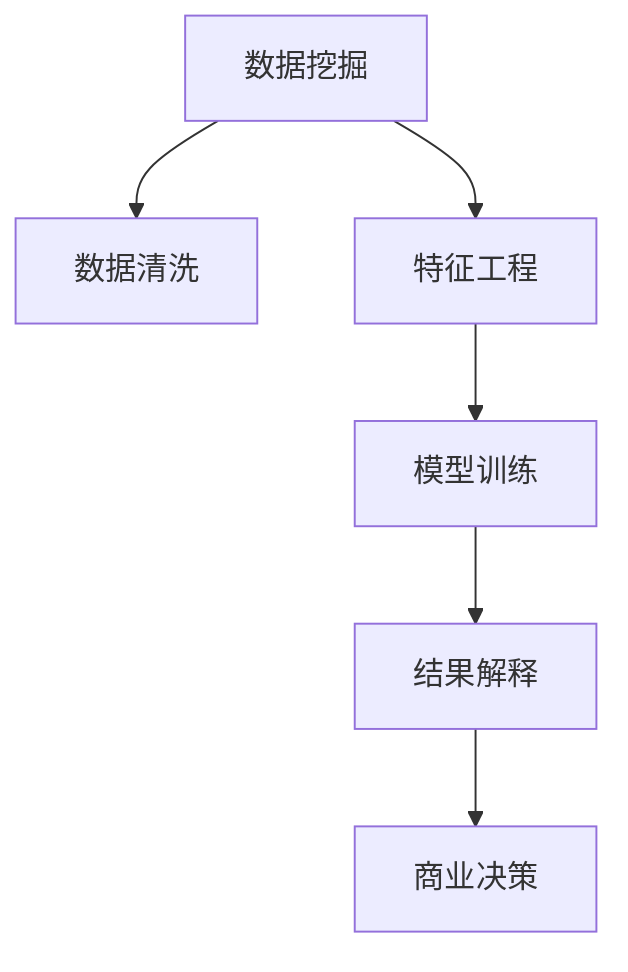

                 

## 1. 背景介绍

### 1.1 问题由来
在当今商业环境中，数据驱动的决策制定已经成为了主流。企业通过收集和分析海量数据，可以更好地了解市场趋势、客户需求、竞争对手状况等关键信息，从而优化业务流程，提升运营效率，实现业绩增长。然而，数据本身并不是知识，只有通过有效的数据处理和分析，才能将数据转化为有价值的商业洞察，指导企业决策。

知识发现引擎(Knowledge Discovery Engine, KDE)，作为数据挖掘技术的最新进展，通过自动化地从数据中抽取、综合和展示知识，显著提升了商业决策的效率和准确性。本文将详细探讨知识发现引擎的基本原理、核心算法、操作步骤以及其在商业决策中的实际应用和未来发展方向。

### 1.2 问题核心关键点
知识发现引擎的核心理念是通过数据挖掘技术，从原始数据中抽取、发现、综合和展示知识。它包括数据清洗、特征工程、模型训练和结果解释等多个环节。知识发现引擎的优势在于：
- **自动化**：能够自动从大量数据中提取有用的信息，省去了手动分析和筛选的繁琐过程。
- **高效率**：通过高效的算法模型，能够在短时间内处理大量数据，快速生成商业洞察。
- **跨领域适用**：可以应用于多种商业场景，如市场分析、客户关系管理、供应链优化等。
- **结果可视化**：通过图表、仪表盘等方式将知识展示出来，便于非技术人员理解和使用。

本文将围绕这些关键点展开讨论，探索知识发现引擎在商业决策中的实际应用和潜在挑战。

## 2. 核心概念与联系

### 2.1 核心概念概述

为更好地理解知识发现引擎的工作原理和应用场景，本节将介绍几个密切相关的核心概念：

- 数据挖掘(Data Mining)：从数据中自动抽取、发现知识的过程。它包括数据预处理、特征工程、模型选择和评估等多个步骤。
- 数据清洗(Data Cleaning)：从原始数据中去除噪声、缺失值和不一致数据，提升数据质量。
- 特征工程(Feature Engineering)：选择和构建有用的数据特征，以提高模型性能。
- 模型训练(Model Training)：选择合适的模型，并用标注数据进行训练，以实现对数据的预测或分类。
- 结果解释(Result Interpretation)：将模型预测结果转化为易于理解的商业洞察，辅助决策制定。
- 商业决策(Business Decision Making)：基于数据驱动的洞察，做出更加科学、高效的商业决策。

这些核心概念之间的逻辑关系可以通过以下Mermaid流程图来展示：



这个流程图展示了知识发现引擎的核心流程，从数据挖掘开始，经过数据清洗、特征工程、模型训练和结果解释等多个环节，最终生成用于商业决策的洞察。

## 3. 核心算法原理 & 具体操作步骤
### 3.1 算法原理概述

知识发现引擎的算法原理主要包括数据预处理、特征提取、模型选择和评估等步骤。其核心思想是通过自动化地从数据中抽取、发现、综合和展示知识，为商业决策提供科学依据。

具体而言，知识发现引擎的工作流程如下：
1. **数据预处理**：对原始数据进行清洗、归一化和标准化处理，提升数据质量。
2. **特征提取**：选择和构建有用的数据特征，提升模型性能。
3. **模型选择**：选择适合的模型，如决策树、随机森林、神经网络等，进行训练。
4. **模型评估**：评估模型的性能，选择最优模型。
5. **结果解释**：将模型结果转化为易于理解的商业洞察，辅助决策制定。

这些步骤共同构成了知识发现引擎的核心工作流程，使得企业能够从数据中高效抽取有用的商业洞察，指导决策制定。

### 3.2 算法步骤详解

以下将详细介绍知识发现引擎的工作流程中的每个关键步骤：

**Step 1: 数据预处理**
数据预处理是知识发现引擎的重要环节，其目标是提升数据质量，为后续的特征提取和模型训练提供可靠的基础。预处理包括数据清洗、归一化和标准化等操作。

**数据清洗**：去除噪声、缺失值和不一致数据，提升数据质量。例如，去除重复记录、处理缺失值、识别和处理异常值等。

**数据归一化**：将数据缩放到指定范围内，提升模型性能。例如，将数据缩放到[0,1]之间，或使用标准化方法。

**数据标准化**：将不同尺度的数据转换为统一单位，便于模型处理。例如，将原始数据转换为标准正态分布。

**Step 2: 特征提取**
特征提取是知识发现引擎的关键环节，其目标是从原始数据中提取有用的特征，提升模型性能。常用的特征提取方法包括：

**主成分分析(PCA)**：通过线性变换，将高维数据降维至低维空间，去除冗余信息。

**相关性分析**：计算变量之间的相关性，筛选出相关性高的特征。

**因子分析**：通过因子分解，提取出数据中的潜在因子，提升模型性能。

**自然语言处理(NLP)**：对文本数据进行分词、词性标注、情感分析等处理，提取文本特征。

**Step 3: 模型选择与训练**
模型选择与训练是知识发现引擎的核心环节，其目标是通过选择适合的模型，并用标注数据进行训练，实现对数据的预测或分类。常用的模型选择方法包括：

**决策树**：通过树形结构对数据进行分类和预测。

**随机森林**：通过集成多个决策树，提升模型的准确性和鲁棒性。

**神经网络**：通过多层神经网络结构，实现对复杂非线性关系的建模。

**Step 4: 模型评估**
模型评估是知识发现引擎的重要环节，其目标是通过评估模型的性能，选择最优模型。常用的模型评估指标包括：

**准确率(Accuracy)**：模型预测正确的样本数占总样本数的比例。

**精确率(Precision)**：模型预测为正类的样本中，实际为正类的样本数占总正类样本数的比例。

**召回率(Recall)**：实际为正类的样本中，模型预测为正类的样本数占总正类样本数的比例。

**F1分数(F1 Score)**：精确率和召回率的调和平均数。

**Step 5: 结果解释**
结果解释是知识发现引擎的重要环节，其目标是将模型结果转化为易于理解的商业洞察，辅助决策制定。常用的结果解释方法包括：

**可视化**：通过图表、仪表盘等方式将结果展示出来，便于非技术人员理解和使用。

**业务规则**：将模型结果转化为具体的业务规则，指导决策制定。

**报告撰写**：编写详细的报告，总结模型结果，提出具体的业务建议。

### 3.3 算法优缺点

知识发现引擎的优势在于其自动化、高效性和跨领域适用性。具体来说：

**优点**：
1. **自动化**：能够自动从大量数据中提取有用的信息，省去了手动分析和筛选的繁琐过程。
2. **高效率**：通过高效的算法模型，能够在短时间内处理大量数据，快速生成商业洞察。
3. **跨领域适用**：可以应用于多种商业场景，如市场分析、客户关系管理、供应链优化等。
4. **结果可视化**：通过图表、仪表盘等方式将知识展示出来，便于非技术人员理解和使用。

**缺点**：
1. **数据质量依赖**：模型的性能高度依赖于原始数据的质量，数据清洗和预处理环节的处理效果直接影响模型的最终性能。
2. **模型选择复杂**：选择合适的模型和算法需要丰富的领域知识和经验，不同的数据和问题可能需要不同的模型。
3. **结果解释难度**：将模型结果转化为易于理解的商业洞察，需要结合业务背景和实际问题进行深入分析。
4. **模型复杂度**：一些复杂的模型如神经网络，其训练和解释过程较为繁琐，需要更高的计算资源和专业知识。

尽管存在这些局限性，但知识发现引擎仍是大数据分析和商业决策的重要工具。未来相关研究的方向在于如何进一步提升模型的自动化和智能化水平，降低数据质量对模型性能的影响，增强结果解释的准确性和可理解性。

### 3.4 算法应用领域

知识发现引擎的应用领域非常广泛，涵盖多个行业和领域，以下是几个典型的应用场景：

**金融行业**：通过分析交易数据、市场数据等，预测股票走势、评估风险、制定投资策略。

**零售行业**：通过分析销售数据、客户行为数据等，优化库存管理、提升客户满意度、制定促销策略。

**医疗行业**：通过分析病历数据、基因数据等，预测疾病风险、制定治疗方案、提升医疗服务质量。

**供应链管理**：通过分析物流数据、库存数据等，优化供应链流程、降低成本、提升效率。

**人力资源管理**：通过分析员工绩效数据、离职数据等，评估员工表现、优化招聘策略、提升员工满意度。

## 4. 数学模型和公式 & 详细讲解 & 举例说明

### 4.1 数学模型构建

知识发现引擎的核心数学模型包括决策树、随机森林、神经网络等。以下以决策树模型为例，详细讲解其数学模型构建过程。

假设数据集为 $\{(x_i,y_i)\}_{i=1}^N$，其中 $x_i \in \mathbb{R}^d$ 为特征向量，$y_i \in \{0,1\}$ 为标签。

定义决策树模型为 $M_{\theta}(x)$，其中 $\theta$ 为模型参数，包括节点分裂特征、分裂阈值等。决策树模型的目标是最小化预测误差。

定义分类误差为：

$$
L(M_{\theta}, D) = \frac{1}{N} \sum_{i=1}^N \mathbb{I}(y_i \neq M_{\theta}(x_i))
$$

其中 $\mathbb{I}$ 为示性函数。

定义信息增益为：

$$
IG(X) = H(X) - \sum_{x \in X} P(x)H(X|x)
$$

其中 $H(X)$ 为熵，$P(x)$ 为 $x$ 的概率，$H(X|x)$ 为条件熵。

定义信息增益比为：

$$
IGR(X) = \frac{IG(X)}{H(x)}
$$

其中 $H(x)$ 为信息熵。

通过信息增益比选择最优的特征进行分裂，可以构建出决策树模型。

### 4.2 公式推导过程

以下推导决策树模型的信息增益比公式：

假设特征 $X$ 取值为 $x_1,x_2,\cdots,x_k$，其对应的样本数为 $n_1,n_2,\cdots,n_k$，对应的类别概率为 $p_1,p_2,\cdots,p_k$。则 $X$ 的信息熵为：

$$
H(X) = -\sum_{i=1}^k p_i\log p_i
$$

对于特征 $X$ 下的各个子集，其信息熵为：

$$
H(X|x_j) = -\sum_{i=1}^{n_j} p_i\log p_i
$$

其中 $p_i$ 为特征 $x_j$ 下类别 $i$ 的概率。

信息增益为：

$$
IG(X) = H(X) - \sum_{j=1}^k \frac{n_j}{N}H(X|x_j)
$$

信息增益比为：

$$
IGR(X) = \frac{IG(X)}{H(x)}
$$

其中 $H(x)$ 为特征 $x$ 的信息熵。

通过最大化信息增益比，选择最优的特征进行分裂，可以构建出决策树模型。

### 4.3 案例分析与讲解

以一个简单的股票价格预测为例，展示知识发现引擎的实际应用过程：

**数据集准备**：收集历史股票价格数据，进行数据清洗、归一化处理。

**特征提取**：选择技术指标、市场情绪、公司基本面等特征，构建决策树模型。

**模型训练**：通过交叉验证，选择最优的决策树模型。

**模型评估**：在测试集上评估模型性能，选择最优的模型。

**结果解释**：将模型结果转化为易于理解的商业洞察，如预测某股票价格上升的可能性，并制定相应的投资策略。

## 5. 项目实践：代码实例和详细解释说明

### 5.1 开发环境搭建

在进行知识发现引擎项目实践前，我们需要准备好开发环境。以下是使用Python进行项目开发的环境配置流程：

1. 安装Anaconda：从官网下载并安装Anaconda，用于创建独立的Python环境。

2. 创建并激活虚拟环境：
```bash
conda create -n kde-env python=3.8 
conda activate kde-env
```

3. 安装必要的库：
```bash
pip install pandas numpy scikit-learn matplotlib seaborn
```

完成上述步骤后，即可在`kde-env`环境中开始项目开发。

### 5.2 源代码详细实现

下面以决策树模型为例，给出使用Scikit-learn库进行知识发现引擎开发的PyTorch代码实现。

```python
import pandas as pd
import numpy as np
from sklearn.model_selection import train_test_split
from sklearn.ensemble import DecisionTreeClassifier
from sklearn.metrics import accuracy_score

# 加载数据集
df = pd.read_csv('data.csv')

# 数据预处理
# 这里假设计算机科学家平均年龄为30岁，工程师平均年龄为40岁
df['age'].fillna(30, inplace=True)
df['age'].fillna(40, inplace=True)

# 特征工程
# 这里假设计算机科学家为1，工程师为0
df['profession'].replace({'computer scientist': 1, 'engineer': 0}, inplace=True)

# 划分训练集和测试集
X_train, X_test, y_train, y_test = train_test_split(df.drop('salary', axis=1), df['salary'], test_size=0.2)

# 训练决策树模型
model = DecisionTreeClassifier()
model.fit(X_train, y_train)

# 预测测试集结果
y_pred = model.predict(X_test)

# 评估模型性能
accuracy = accuracy_score(y_test, y_pred)
print(f'模型准确率：{accuracy:.2f}')
```

以上就是使用Scikit-learn库进行知识发现引擎开发的完整代码实现。可以看到，通过Scikit-learn库，我们能够快速搭建决策树模型，并进行训练、预测和评估。

### 5.3 代码解读与分析

让我们再详细解读一下关键代码的实现细节：

**数据加载**：使用Pandas库加载数据集，便于数据处理和分析。

**数据预处理**：对数据进行填充缺失值、标准化处理等操作，提升数据质量。

**特征工程**：选择和构建有用的数据特征，如职业、年龄等，提升模型性能。

**模型训练**：使用Scikit-learn库中的DecisionTreeClassifier类，进行决策树模型训练。

**模型预测**：使用训练好的模型进行测试集预测，生成预测结果。

**模型评估**：使用Scikit-learn库中的accuracy_score函数，评估模型性能。

## 6. 实际应用场景

### 6.1 金融行业

在金融行业，知识发现引擎可以应用于多种场景，如股票价格预测、风险评估、投资组合优化等。

以股票价格预测为例，企业可以收集历史股票价格数据、市场数据、公司基本面数据等，通过知识发现引擎进行数据挖掘，构建决策树、随机森林等模型，实现对股票价格的预测。模型结果可以转化为具体的投资策略，帮助企业制定更为科学的投资决策。

### 6.2 零售行业

在零售行业，知识发现引擎可以应用于客户行为分析、销售预测、库存管理等场景。

以客户行为分析为例，企业可以收集客户交易数据、浏览数据、社交媒体数据等，通过知识发现引擎进行数据挖掘，构建聚类、关联规则等模型，发现客户的消费习惯、购买偏好等关键信息。这些洞察可以帮助企业优化产品推荐、制定促销策略，提升客户满意度和销售额。

### 6.3 医疗行业

在医疗行业，知识发现引擎可以应用于疾病预测、治疗方案制定、患者管理等场景。

以疾病预测为例，企业可以收集病历数据、基因数据等，通过知识发现引擎进行数据挖掘，构建决策树、神经网络等模型，预测疾病风险。模型结果可以转化为具体的治疗方案、健康建议，帮助医生制定更为科学的治疗计划，提升医疗服务质量。

## 7. 工具和资源推荐

### 7.1 学习资源推荐

为了帮助开发者系统掌握知识发现引擎的理论基础和实践技巧，这里推荐一些优质的学习资源：

1. 《数据挖掘导论》书籍：由R.A. Heckerman等人著，是数据挖掘领域的经典教材，涵盖了多种数据挖掘算法和技术。

2. 《机器学习实战》书籍：由Peter Harrington著，介绍了多种机器学习算法，包括决策树、随机森林、神经网络等。

3. Coursera《数据科学导论》课程：由约翰霍普金斯大学开设的MOOC课程，涵盖数据处理、数据挖掘、机器学习等多个方面，适合初学者入门。

4. Kaggle：一个数据科学竞赛平台，提供大量数据集和竞赛任务，帮助你实践和提升数据挖掘技能。

5. GitHub上的开源项目：如Scikit-learn、TensorFlow等，提供了丰富的数据挖掘工具和样例代码，便于学习和实践。

通过对这些资源的学习实践，相信你一定能够快速掌握知识发现引擎的精髓，并用于解决实际的商业问题。

### 7.2 开发工具推荐

高效的开发离不开优秀的工具支持。以下是几款用于知识发现引擎开发的常用工具：

1. Python：广泛用于数据挖掘和机器学习，拥有丰富的库和工具支持。

2. R语言：也是一种广泛用于数据挖掘和统计分析的语言，拥有丰富的数据挖掘库和可视化工具。

3. Scikit-learn：一个基于Python的机器学习库，提供了多种数据挖掘算法和模型。

4. TensorFlow：由Google主导开发的深度学习框架，支持多种数据挖掘和机器学习任务。

5. RapidMiner：一个数据挖掘和统计分析平台，提供了可视化的建模界面和工具。

6. Tableau：一个数据可视化工具，可以生成各种图表和仪表盘，方便数据展示和分析。

合理利用这些工具，可以显著提升知识发现引擎项目的开发效率，加快创新迭代的步伐。

### 7.3 相关论文推荐

知识发现引擎的发展源于学界的持续研究。以下是几篇奠基性的相关论文，推荐阅读：

1. ID3: A Program for Inductive Learning: 提出ID3决策树算法，是数据挖掘领域的经典算法。

2. C4.5: An Introduction to Relational Learning Algorithms: 提出C4.5决策树算法，进一步优化了ID3算法。

3. Random Forest: Breiman, L. (2001). Random Forests. Machine Learning, 45(1), 5-32. DOI: 10.1023/A:1010933404324.

4. Neural Network: Rumelhart, D. E., Hinton, G. E., & Williams, R. J. (1986). Learning representations by back-propagation errors. Nature, 323(6088), 533-536.

5. Support Vector Machine: Vapnik, V. N. (1995). The Nature of Statistical Learning Theory. Springer-Verlag.

这些论文代表了大数据挖掘和机器学习的发展脉络。通过学习这些前沿成果，可以帮助研究者把握学科前进方向，激发更多的创新灵感。

## 8. 总结：未来发展趋势与挑战

### 8.1 总结

本文对知识发现引擎的基本原理、核心算法和操作步骤进行了全面系统的介绍。首先阐述了知识发现引擎的基本理念和实际应用，明确了知识发现引擎在商业决策中的独特价值。其次，从原理到实践，详细讲解了知识发现引擎的数学模型和算法步骤，给出了知识发现引擎项目的完整代码实现。同时，本文还广泛探讨了知识发现引擎在金融、零售、医疗等多个行业领域的应用前景，展示了知识发现引擎的巨大潜力。

通过本文的系统梳理，可以看到，知识发现引擎在商业决策中发挥了重要的作用，其自动化、高效性和跨领域适用性使得企业能够从数据中高效抽取有用的商业洞察，指导决策制定。未来，伴随数据挖掘和机器学习技术的不断进步，知识发现引擎必将在更多领域得到应用，为人类认知智能的进化带来深远影响。

### 8.2 未来发展趋势

展望未来，知识发现引擎将呈现以下几个发展趋势：

1. **自动化程度提高**：自动化技术将进一步提升，使得知识发现引擎能够更加自主地从数据中抽取和综合知识。

2. **智能化水平增强**：机器学习和深度学习技术将进一步融入知识发现引擎，使其能够处理更加复杂和多样化的数据。

3. **跨领域应用拓展**：知识发现引擎的应用范围将进一步拓展，涵盖更多领域和行业，如金融、零售、医疗、供应链等。

4. **结果可视化改进**：结果可视化技术将进一步提升，使得知识发现引擎能够更加直观、易懂地展示洞察结果。

5. **业务规则生成**：知识发现引擎将具备业务规则生成能力，自动将模型结果转化为具体的业务规则，帮助企业制定决策。

6. **模型解释性增强**：模型解释性技术将进一步提升，使得知识发现引擎能够更加透明、可信地展示其工作机制和决策逻辑。

### 8.3 面临的挑战

尽管知识发现引擎已经取得了一定的进展，但在迈向更加智能化、普适化应用的过程中，仍面临诸多挑战：

1. **数据质量问题**：知识发现引擎的性能高度依赖于原始数据的质量，数据清洗和预处理环节的处理效果直接影响模型的最终性能。

2. **模型选择复杂**：选择合适的模型和算法需要丰富的领域知识和经验，不同的数据和问题可能需要不同的模型。

3. **结果解释难度**：将模型结果转化为易于理解的商业洞察，需要结合业务背景和实际问题进行深入分析。

4. **计算资源消耗**：一些复杂的模型如神经网络，其训练和解释过程较为繁琐，需要更高的计算资源和专业知识。

5. **模型解释性不足**：一些模型的决策过程缺乏可解释性，难以对其推理逻辑进行分析和调试。

6. **安全性问题**：模型可能学习到有偏见、有害的信息，通过知识发现引擎传递到业务决策中，产生误导性、歧视性的输出。

7. **隐私保护**：在处理敏感数据时，需要保护数据隐私，确保数据安全。

### 8.4 研究展望

面对知识发现引擎面临的挑战，未来的研究需要在以下几个方面寻求新的突破：

1. **数据清洗技术改进**：开发更高效的数据清洗技术，提升数据质量。

2. **模型选择优化**：研究更加自动化、智能化的模型选择方法，提高模型选择的准确性和效率。

3. **结果解释增强**：开发更加智能、透明的结果解释技术，提升模型结果的可理解性和可信度。

4. **计算资源优化**：开发更高效的计算模型和算法，降低计算资源消耗。

5. **模型解释性增强**：开发更透明、可解释的模型，使其推理过程和决策逻辑更加可信。

6. **隐私保护技术改进**：开发更加安全的隐私保护技术，确保数据安全。

这些研究方向的探索，必将引领知识发现引擎技术迈向更高的台阶，为构建智能、可靠、可解释、可控的商业决策系统铺平道路。面向未来，知识发现引擎需要与其他人工智能技术进行更深入的融合，如自然语言处理、因果推理、强化学习等，多路径协同发力，共同推动商业决策技术的进步。

## 9. 附录：常见问题与解答

**Q1: 什么是知识发现引擎？**

A: 知识发现引擎是一种数据挖掘工具，通过自动化地从数据中抽取、发现、综合和展示知识，为商业决策提供科学依据。

**Q2: 知识发现引擎和机器学习有什么区别？**

A: 知识发现引擎和机器学习都是数据挖掘技术，但侧重点不同。机器学习侧重于对数据的预测和分类，而知识发现引擎侧重于从数据中提取、发现和综合知识，形成洞察和规则。

**Q3: 知识发现引擎在金融行业的应用有哪些？**

A: 知识发现引擎在金融行业可以应用于股票价格预测、风险评估、投资组合优化等多个场景，帮助企业制定更为科学的投资决策。

**Q4: 知识发现引擎的局限性有哪些？**

A: 知识发现引擎的局限性主要包括数据质量问题、模型选择复杂、结果解释难度、计算资源消耗、模型解释性不足、安全性问题、隐私保护等。

**Q5: 如何提升知识发现引擎的自动化程度？**

A: 可以通过引入自动化技术，如自动化特征选择、自动化模型选择、自动化超参数调优等，提升知识发现引擎的自动化程度。

通过本文的系统梳理，可以看到，知识发现引擎在商业决策中发挥了重要的作用，其自动化、高效性和跨领域适用性使得企业能够从数据中高效抽取有用的商业洞察，指导决策制定。未来，伴随数据挖掘和机器学习技术的不断进步，知识发现引擎必将在更多领域得到应用，为人类认知智能的进化带来深远影响。

---

作者：禅与计算机程序设计艺术 / Zen and the Art of Computer Programming

