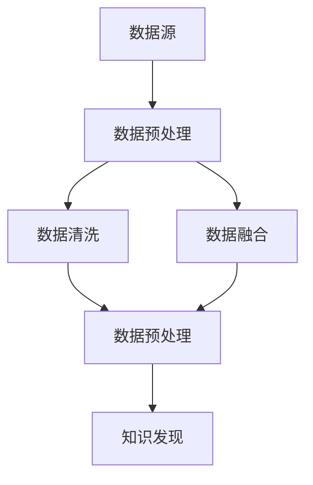

                 

# 知识发现引擎的数据源获取与处理

> 关键词：知识发现引擎, 数据源获取, 数据处理, 数据清洗, 数据融合, 数据预处理, 数据质量

## 1. 背景介绍

### 1.1 问题由来

在信息化社会，数据已经成为了一种至关重要的资源。从科学研究到商业决策，从政策制定到个人行为分析，数据无处不在。然而，数据本身的价值并非总能被充分挖掘和利用。如何在海量数据中发现潜在的知识，成为了一项挑战性的任务。

为此，知识发现引擎(Knowledge Discovery Engine, KDE)应运而生。它通过先进的数据处理和分析技术，从原始数据中挖掘出有价值的知识模式、关联规则、分类器等，为决策制定、市场分析、客户管理等领域提供有力支持。数据源获取与处理是知识发现引擎的核心环节，其数据质量直接决定了知识发现的准确性和实用性。

### 1.2 问题核心关键点

数据源获取与处理的核心在于选择合适的数据源，并通过预处理、清洗、融合、预处理等技术手段，将原始数据转化为可用于知识发现的结构化数据。其关键点包括：

- **数据源选择**：选择与目标任务相关的数据源，涵盖结构化数据、半结构化数据、非结构化数据等多种形式的数据。
- **数据预处理**：对原始数据进行清洗、归一化、去噪等预处理，去除冗余和异常数据，提升数据质量。
- **数据融合**：将来自不同数据源的数据进行整合，消除冗余和冲突，构建统一的数据视图。
- **数据预处理**：对融合后的数据进行进一步的处理，如特征选择、特征提取、降维等，提升模型训练和分析的效率。

## 2. 核心概念与联系

### 2.1 核心概念概述

为更好地理解知识发现引擎的数据源获取与处理流程，本节将介绍几个密切相关的核心概念：

- **知识发现引擎(KDE)**：通过数据挖掘、统计学习等方法，从原始数据中提取有价值知识的模式和规则，辅助决策分析的智能系统。
- **数据源(Data Source)**：原始数据存储的物理或虚拟位置，包括数据库、文件系统、Web服务等。
- **数据预处理(Data Preprocessing)**：对原始数据进行清洗、归一化、去噪等预处理，去除冗余和异常数据，提升数据质量。
- **数据清洗(Data Cleaning)**：识别并修正数据中的错误、缺失和异常值，保证数据的一致性和完整性。
- **数据融合(Data Fusion)**：将来自不同数据源的数据进行整合，消除冗余和冲突，构建统一的数据视图。
- **数据预处理(Data Preprocessing)**：对融合后的数据进行进一步的处理，如特征选择、特征提取、降维等，提升模型训练和分析的效率。

这些核心概念之间的逻辑关系可以通过以下Mermaid流程图来展示：



这个流程图展示了大语言模型的核心概念及其之间的关系：

1. 数据源提供原始数据。
2. 数据预处理对原始数据进行初步处理，如清洗、归一化、去噪等。
3. 数据清洗识别并修正数据中的错误、缺失和异常值，保证数据的一致性和完整性。
4. 数据融合将来自不同数据源的数据进行整合，消除冗余和冲突，构建统一的数据视图。
5. 数据预处理对融合后的数据进行进一步的处理，如特征选择、特征提取、降维等，提升模型训练和分析的效率。
6. 最终将处理后的数据输入知识发现引擎，进行知识发现和分析。

## 3. 核心算法原理 & 具体操作步骤
### 3.1 算法原理概述

知识发现引擎的数据源获取与处理，本质上是一个多步骤的数据处理流程。其核心思想是：从原始数据中提取出有用的信息，构建可供知识发现和分析的模型。具体流程包括数据源选择、数据预处理、数据清洗、数据融合和数据预处理等环节。

形式化地，假设原始数据集为 $D$，目标任务为 $T$，则数据源获取与处理的总体目标为：

$$
D' = \mathop{\arg\min}_{D'} \mathcal{L}(D',T)
$$

其中 $\mathcal{L}$ 为任务损失函数，用于衡量处理后的数据集 $D'$ 在目标任务 $T$ 上的性能。

数据源选择、预处理、清洗、融合和预处理等环节，共同构成了一个优化问题，通过最小化损失函数 $\mathcal{L}$ 来实现目标任务 $T$ 的最佳表现。

### 3.2 算法步骤详解

基于知识发现引擎的数据源获取与处理流程，通常包括以下关键步骤：

**Step 1: 数据源选择**

- 根据任务需求，选择相关性高、覆盖广泛的数据源。
- 评估数据源的质量、更新频率、成本等指标，综合考虑选择合适的数据源。

**Step 2: 数据预处理**

- 对原始数据进行清洗、归一化、去噪等预处理，去除冗余和异常数据。
- 根据任务需求，选择合适的数据格式和数据类型，如数值型、分类型、文本型等。

**Step 3: 数据清洗**

- 识别并修正数据中的错误、缺失和异常值，保证数据的一致性和完整性。
- 使用规则、统计方法、专家知识等手段，进行数据清洗。

**Step 4: 数据融合**

- 将来自不同数据源的数据进行整合，消除冗余和冲突，构建统一的数据视图。
- 使用数据融合技术，如数据集成、数据合并、数据重构等，提升数据的一致性和完整性。

**Step 5: 数据预处理**

- 对融合后的数据进行进一步的处理，如特征选择、特征提取、降维等，提升模型训练和分析的效率。
- 使用特征选择算法，如信息增益、相关系数、主成分分析等，选择最有用的特征。
- 使用特征提取算法，如PCA、LDA、NMF等，进行特征变换。
- 使用降维算法，如PCA、t-SNE、LLE等，减少数据的维度。

### 3.3 算法优缺点

基于知识发现引擎的数据源获取与处理流程，具有以下优点：

- **全面覆盖**：通过选择合适的数据源，可以获取全面的数据信息，涵盖不同的数据类型和数据格式。
- **高效处理**：通过数据清洗、融合、预处理等技术手段，可以去除冗余和异常数据，提升数据质量。
- **提升准确性**：通过数据预处理、特征选择等技术，可以提升模型的训练和分析效果，提高知识发现的准确性。

同时，该流程也存在一定的局限性：

- **依赖标注数据**：数据源获取与处理需要依赖标注数据，标注数据的质量和数量直接决定了数据处理的效果。
- **计算复杂度高**：数据预处理、清洗、融合、预处理等环节计算复杂度较高，需要较大的计算资源。
- **难以避免偏差**：数据源选择和数据处理过程中，可能引入人为的偏差，影响知识发现的公平性和客观性。

尽管存在这些局限性，但就目前而言，基于知识发现引擎的数据源获取与处理流程仍是大规模数据处理和知识发现的重要手段。未来相关研究的重点在于如何进一步降低数据处理的计算成本，提高数据处理的效率和效果，同时兼顾数据处理的公平性和客观性。

### 3.4 算法应用领域

基于知识发现引擎的数据源获取与处理流程，已经在多个领域得到了广泛的应用，例如：

- **科学研究**：从科学论文、专利文献、实验数据中提取知识，为科学研究提供支持。
- **市场分析**：从市场交易数据、用户行为数据中提取模式，辅助商业决策。
- **客户管理**：从客户反馈、行为数据中提取有价值的信息，提升客户满意度和忠诚度。
- **政策制定**：从公共数据、社会调查中提取统计规律，辅助政策制定和执行。
- **健康医疗**：从医疗记录、患者反馈中提取知识，辅助疾病诊断和治疗方案的制定。

除了上述这些经典领域外，知识发现引擎的数据源获取与处理流程还被创新性地应用到更多场景中，如金融风险预测、自然灾害监测、环境保护等，为各类决策提供科学依据。随着数据处理技术的不断进步，相信知识发现引擎将在更广阔的应用领域发挥重要作用。

## 4. 数学模型和公式 & 详细讲解 & 举例说明（备注：数学公式请使用latex格式，latex嵌入文中独立段落使用 $$，段落内使用 $)
### 4.1 数学模型构建

本节将使用数学语言对知识发现引擎的数据源获取与处理流程进行更加严格的刻画。

记原始数据集为 $D=\{(x_i,y_i)\}_{i=1}^N$，其中 $x_i$ 为输入特征，$y_i$ 为标签。假设目标任务为二分类任务，则数据源获取与处理的数学模型为：

$$
D' = \mathop{\arg\min}_{D'} \mathcal{L}(D',y)
$$

其中 $\mathcal{L}$ 为损失函数，用于衡量处理后的数据集 $D'$ 在目标任务 $T$ 上的性能。对于二分类任务，常用的损失函数包括交叉熵损失、对数损失等。

### 4.2 公式推导过程

以交叉熵损失函数为例，推导其在数据源获取与处理中的应用：

假设模型 $M_{\theta}$ 在输入 $x$ 上的输出为 $\hat{y}=M_{\theta}(x) \in [0,1]$，表示样本属于正类的概率。真实标签 $y \in \{0,1\}$。则二分类交叉熵损失函数定义为：

$$
\ell(M_{\theta}(x),y) = -[y\log \hat{y} + (1-y)\log (1-\hat{y})]
$$

将其代入经验风险公式，得：

$$
\mathcal{L}(\theta) = -\frac{1}{N}\sum_{i=1}^N [y_i\log M_{\theta}(x_i)+(1-y_i)\log(1-M_{\theta}(x_i))]
$$

数据源选择和预处理的目标是最大化模型的准确性，即最小化交叉熵损失 $\mathcal{L}(\theta)$。因此，数据源选择和预处理的目标函数为：

$$
\mathcal{L}_{\text{source}}(\theta) = \mathop{\min}_{D} \mathcal{L}(\theta)
$$

其中 $D$ 为原始数据集。通过最小化上述目标函数，可以优化数据源的选择和预处理。

## 5. 项目实践：代码实例和详细解释说明
### 5.1 开发环境搭建

在进行数据源获取与处理实践前，我们需要准备好开发环境。以下是使用Python进行Pandas开发的环境配置流程：

1. 安装Anaconda：从官网下载并安装Anaconda，用于创建独立的Python环境。

2. 创建并激活虚拟环境：
```bash
conda create -n pandas-env python=3.8 
conda activate pandas-env
```

3. 安装Pandas：
```bash
pip install pandas
```

4. 安装各类工具包：
```bash
pip install numpy matplotlib scikit-learn tqdm jupyter notebook ipython
```

完成上述步骤后，即可在`pandas-env`环境中开始数据源获取与处理的实践。

### 5.2 源代码详细实现

下面我们以数据预处理和数据清洗为例，给出使用Pandas库进行数据源获取与处理的PyTorch代码实现。

首先，定义数据预处理函数：

```python
import pandas as pd
import numpy as np

def data_preprocessing(df):
    # 删除缺失值
    df = df.dropna()
    
    # 标准化数据
    df = (df - df.mean()) / df.std()
    
    # 编码分类数据
    df = pd.get_dummies(df, columns=['category'])
    
    return df
```

然后，定义数据清洗函数：

```python
def data_cleaning(df):
    # 识别并修正错误
    df = df.replace(to_replace='error', value='correct')
    
    # 识别并删除异常值
    df = df[df['value'].between(0, 100)]
    
    return df
```

最后，使用上述函数对数据集进行处理：

```python
# 加载原始数据集
df = pd.read_csv('data.csv')

# 预处理数据
df = data_preprocessing(df)

# 清洗数据
df = data_cleaning(df)

# 保存处理后的数据集
df.to_csv('processed_data.csv', index=False)
```

以上就是使用Pandas进行数据源获取与处理的完整代码实现。可以看到，Pandas提供了丰富的数据处理功能，使得数据源获取与处理的代码实现变得简洁高效。

### 5.3 代码解读与分析

让我们再详细解读一下关键代码的实现细节：

**data_preprocessing函数**：
- 删除缺失值：使用`dropna`方法删除包含缺失值的行。
- 标准化数据：使用`(df - df.mean()) / df.std()`方法对数据进行标准化处理。
- 编码分类数据：使用`pd.get_dummies`方法将分类数据进行独热编码。

**data_cleaning函数**：
- 识别并修正错误：使用`replace`方法将特定值替换为正确值。
- 识别并删除异常值：使用`between`方法筛选出在合理范围内的数据。

**数据处理流程**：
- 加载原始数据集：使用`pd.read_csv`方法加载CSV格式的数据集。
- 预处理数据：调用`data_preprocessing`函数对数据进行预处理。
- 清洗数据：调用`data_cleaning`函数对数据进行清洗。
- 保存处理后的数据集：使用`to_csv`方法将处理后的数据集保存为CSV文件。

可以看到，Pandas提供了强大的数据处理功能，使得数据源获取与处理的任务变得简单高效。通过合理利用Pandas的各类方法，我们可以实现对数据的清洗、标准化、编码等预处理，为知识发现引擎的后续处理奠定基础。

当然，工业级的系统实现还需考虑更多因素，如数据的异构性、数据的安全性和隐私性等。但核心的数据源获取与处理流程基本与此类似。

## 6. 实际应用场景
### 6.1 科学研究

在科学研究中，数据源获取与处理是获取科学知识的重要手段。科学数据通常涵盖实验记录、观察数据、文献资料等多种形式，需要经过系统性的处理和分析，才能提取出有价值的科学知识。

例如，在生物医学研究中，研究人员可以从基因数据库、临床试验数据、文献数据库中获取数据，通过数据预处理和清洗，构建可供分析的科学数据集。利用机器学习算法，可以从数据中提取基因表达模式、疾病风险因素等科学知识，为临床诊断和治疗提供指导。

### 6.2 市场分析

在市场分析中，数据源获取与处理是理解市场趋势、发现商业机会的重要手段。市场数据通常涵盖销售数据、客户行为数据、社交媒体数据等多种形式，需要经过系统性的处理和分析，才能提取出有价值的市场知识。

例如，在电子商务中，商家可以从销售记录、客户评价、社交媒体评论中获取数据，通过数据预处理和清洗，构建可供分析的市场数据集。利用机器学习算法，可以从数据中提取销售趋势、客户偏好、竞争对手信息等市场知识，为市场决策提供支持。

### 6.3 客户管理

在客户管理中，数据源获取与处理是提升客户满意度和忠诚度的重要手段。客户数据通常涵盖交易记录、客户反馈、行为数据等多种形式，需要经过系统性的处理和分析，才能提取出有价值的客户知识。

例如，在金融服务中，银行可以从客户交易记录、信用记录、客户反馈中获取数据，通过数据预处理和清洗，构建可供分析的客户数据集。利用机器学习算法，可以从数据中提取客户偏好、风险评估、流失预测等客户知识，为个性化服务提供支持。

### 6.4 未来应用展望

随着数据处理技术的不断进步，基于知识发现引擎的数据源获取与处理流程将在更多领域得到应用，为各类决策提供科学依据。

在智慧医疗领域，数据源获取与处理可以用于医学影像分析、药物研发、疾病预测等环节，提升医疗服务的智能化水平，辅助医生诊疗，加速新药开发进程。

在智能教育领域，数据源获取与处理可以用于学生行为分析、个性化推荐、学习效果评估等环节，因材施教，促进教育公平，提高教学质量。

在智慧城市治理中，数据源获取与处理可以用于城市事件监测、舆情分析、应急指挥等环节，提高城市管理的自动化和智能化水平，构建更安全、高效的未来城市。

此外，在企业生产、社会治理、文娱传媒等众多领域，基于知识发现引擎的数据源获取与处理流程也将不断涌现，为经济社会发展注入新的动力。相信随着数据处理技术的不断进步，基于知识发现引擎的数据源获取与处理流程必将在构建人机协同的智能时代中扮演越来越重要的角色。

## 7. 工具和资源推荐
### 7.1 学习资源推荐

为了帮助开发者系统掌握知识发现引擎的数据源获取与处理流程的理论基础和实践技巧，这里推荐一些优质的学习资源：

1. 《Python数据科学手册》：由Wes McKinney（Pandas的创建者）撰写，全面介绍了Python在数据科学中的应用，包括数据源获取与处理、数据预处理、数据清洗、数据融合等。

2. 《R语言实战》：由Hadley Wickham（R语言的开发团队核心成员）撰写，介绍了R语言在数据科学中的应用，包括数据预处理、数据清洗、数据融合等。

3. 《数据科学与机器学习入门》：由Udacity提供，系统介绍了数据科学和机器学习的基本概念和技术，包括数据源获取与处理、数据预处理、数据清洗、数据融合等。

4. Kaggle官方教程：Kaggle提供的数据科学教程，涵盖数据源获取与处理、数据预处理、数据清洗、数据融合等，适合初学者和进阶者。

5. Coursera《数据科学与机器学习》课程：由斯坦福大学提供，系统介绍了数据科学与机器学习的基本概念和技术，包括数据源获取与处理、数据预处理、数据清洗、数据融合等。

通过对这些资源的学习实践，相信你一定能够快速掌握知识发现引擎的数据源获取与处理流程，并用于解决实际的科学问题。

### 7.2 开发工具推荐

高效的开发离不开优秀的工具支持。以下是几款用于数据源获取与处理开发的常用工具：

1. Pandas：基于Python的开源数据分析工具，提供了强大的数据处理和分析功能，支持数据清洗、数据预处理、数据融合等。

2. SQL：关系型数据库管理系统，支持结构化数据的存储和查询，适合于数据源的选择和数据预处理。

3. Hadoop/Spark：分布式计算框架，支持大规模数据处理，适合于数据融合和数据预处理。

4. Elasticsearch：全文搜索引擎，支持文本数据的存储和查询，适合于文本数据的清洗和预处理。

5. PyTorch：基于Python的开源深度学习框架，支持机器学习算法的实现和训练，适合于数据预处理和数据分析。

6. TensorFlow：由Google主导开发的开源深度学习框架，支持机器学习算法的实现和训练，适合于数据预处理和数据分析。

合理利用这些工具，可以显著提升知识发现引擎的数据源获取与处理任务的开发效率，加快创新迭代的步伐。

### 7.3 相关论文推荐

知识发现引擎的数据源获取与处理流程源于学界的持续研究。以下是几篇奠基性的相关论文，推荐阅读：

1. "A Survey of Knowledge Discovery Techniques"：文中系统介绍了知识发现引擎的基本概念和技术，包括数据源选择、数据预处理、数据清洗、数据融合等。

2. "Data Cleaning: A Survey"：文中介绍了数据清洗的基本概念和技术，包括识别和修正数据中的错误、缺失和异常值等。

3. "Data Fusion: A Survey"：文中介绍了数据融合的基本概念和技术，包括数据集成、数据合并、数据重构等。

4. "A Survey of Data Preprocessing Techniques"：文中介绍了数据预处理的基本概念和技术，包括特征选择、特征提取、降维等。

这些论文代表了大规模数据处理和知识发现引擎的发展脉络。通过学习这些前沿成果，可以帮助研究者把握学科前进方向，激发更多的创新灵感。

## 8. 总结：未来发展趋势与挑战

### 8.1 总结

本文对知识发现引擎的数据源获取与处理流程进行了全面系统的介绍。首先阐述了数据源获取与处理的重要性，明确了其在大规模数据处理和知识发现中的核心作用。其次，从原理到实践，详细讲解了数据源选择、预处理、清洗、融合和预处理等关键步骤，给出了数据源获取与处理的完整代码实例。同时，本文还广泛探讨了数据源获取与处理流程在科学研究、市场分析、客户管理等多个领域的应用前景，展示了其巨大的应用潜力。此外，本文精选了数据源获取与处理流程的学习资源，力求为读者提供全方位的技术指引。

通过本文的系统梳理，可以看到，知识发现引擎的数据源获取与处理流程在大规模数据处理和知识发现中扮演了重要角色，极大地提升了数据处理和分析的效率和效果。未来，伴随数据处理技术的不断进步，基于知识发现引擎的数据源获取与处理流程必将在更多领域得到应用，为经济社会发展注入新的动力。

### 8.2 未来发展趋势

展望未来，知识发现引擎的数据源获取与处理流程将呈现以下几个发展趋势：

1. **自动化处理**：随着AI技术的不断发展，数据源获取与处理将更加自动化和智能化，能够自动选择数据源、自动清洗数据、自动融合数据等。

2. **实时处理**：基于流处理技术的引入，数据源获取与处理将具备实时处理的能力，能够及时响应数据的变化和需求。

3. **跨平台融合**：随着异构数据的不断增加，数据源获取与处理将具备跨平台融合的能力，能够整合来自不同平台和格式的数据。

4. **大数据处理**：基于分布式计算技术的引入，数据源获取与处理将具备大数据处理的能力，能够高效处理大规模数据集。

5. **多模态融合**：数据源获取与处理将引入多模态融合的技术，能够整合来自不同模态的数据，提升数据处理的效果和准确性。

6. **知识驱动**：数据源获取与处理将引入知识驱动的框架，能够根据领域知识自动调整处理流程和参数，提升数据处理的效果和可靠性。

以上趋势凸显了知识发现引擎的数据源获取与处理流程的广阔前景。这些方向的探索发展，必将进一步提升数据处理和分析的效率和效果，为经济社会发展注入新的动力。

### 8.3 面临的挑战

尽管知识发现引擎的数据源获取与处理流程已经取得了一定的进展，但在迈向更加智能化、普适化应用的过程中，它仍面临诸多挑战：

1. **数据质量问题**：数据源获取与处理依赖于高质量的数据源和数据集，而数据质量问题（如数据缺失、数据异常等）仍然是一个重大挑战。

2. **计算资源限制**：数据源获取与处理过程需要大量的计算资源，如何高效利用计算资源，提高数据处理效率，是一个亟待解决的问题。

3. **数据隐私和安全**：在数据源获取与处理过程中，数据隐私和安全问题需要得到充分考虑和保护，以防止数据泄露和滥用。

4. **数据多样性**：数据源获取与处理需要处理来自不同来源和格式的数据，如何实现数据的多样性和一致性，是一个复杂的挑战。

5. **数据处理算法**：现有的数据处理算法在处理大规模数据时，可能会遇到效率和准确性的问题，需要进一步优化和改进。

6. **数据处理流程自动化**：数据源获取与处理流程需要更加自动化和智能化，如何实现自动化的处理流程，是未来的一个重要方向。

正视数据源获取与处理流程面临的这些挑战，积极应对并寻求突破，将是知识发现引擎发展的重要课题。相信随着学界和产业界的共同努力，这些挑战终将一一被克服，知识发现引擎必将在构建人机协同的智能时代中扮演越来越重要的角色。

### 8.4 研究展望

面向未来，知识发现引擎的数据源获取与处理流程需要在以下几个方面寻求新的突破：

1. **引入更多先验知识**：将符号化的先验知识，如知识图谱、逻辑规则等，与神经网络模型进行巧妙融合，引导数据处理过程学习更准确、合理的知识表示。

2. **引入因果分析和博弈论工具**：通过引入因果分析方法，识别出数据处理过程中的关键特征，增强数据处理输出的因果性和逻辑性。借助博弈论工具，主动探索并规避数据处理过程中的脆弱点，提高系统稳定性。

3. **引入多模态数据融合技术**：数据源获取与处理将引入多模态数据融合的技术，能够整合来自不同模态的数据，提升数据处理的效果和准确性。

4. **引入跨平台数据融合技术**：数据源获取与处理将引入跨平台数据融合的技术，能够整合来自不同平台和格式的数据。

5. **引入知识驱动的数据处理框架**：数据源获取与处理将引入知识驱动的框架，能够根据领域知识自动调整处理流程和参数，提升数据处理的效果和可靠性。

6. **引入大数据处理技术**：数据源获取与处理将引入大数据处理的技术，能够高效处理大规模数据集。

这些研究方向的探索，必将引领知识发现引擎的数据源获取与处理流程迈向更高的台阶，为经济社会发展注入新的动力。面向未来，知识发现引擎的数据源获取与处理流程还需要与其他人工智能技术进行更深入的融合，如知识表示、因果推理、强化学习等，多路径协同发力，共同推动自然语言理解和智能交互系统的进步。只有勇于创新、敢于突破，才能不断拓展知识发现引擎的边界，让智能技术更好地造福人类社会。

## 9. 附录：常见问题与解答

**Q1：知识发现引擎的数据源获取与处理流程是否适用于所有领域？**

A: 知识发现引擎的数据源获取与处理流程在大多数领域中都能取得不错的效果，特别是对于数据量较大的领域。但对于一些特定领域的领域，如医学、法律等，仅仅依靠通用语料预训练的模型可能难以很好地适应。此时需要在特定领域语料上进一步预训练，再进行微调，才能获得理想效果。此外，对于一些需要时效性、个性化很强的任务，如对话、推荐等，数据源获取与处理方法也需要针对性的改进优化。

**Q2：如何选择适合的数据源？**

A: 选择适合的数据源是数据源获取与处理的重要环节。具体而言，可以从以下几个方面进行考虑：

1. 数据源的相关性：选择与目标任务相关的数据源，涵盖结构化数据、半结构化数据、非结构化数据等多种形式的数据。

2. 数据源的质量：评估数据源的质量、更新频率、成本等指标，综合考虑选择合适的数据源。

3. 数据源的多样性：选择多样化的数据源，涵盖不同来源、不同格式、不同数据量的数据，以提高数据处理的效果和可靠性。

4. 数据源的可用性：评估数据源的可用性，包括数据的访问方式、访问权限、数据格式等，确保数据能够被顺利获取和使用。

**Q3：数据源获取与处理流程中如何进行数据清洗？**

A: 数据清洗是数据源获取与处理的重要环节，其主要目的是识别并修正数据中的错误、缺失和异常值，保证数据的一致性和完整性。具体而言，可以从以下几个方面进行数据清洗：

1. 识别错误：通过规则、统计方法、专家知识等手段，识别数据中的错误，并将其修正。

2. 识别缺失值：识别数据中的缺失值，并选择合适的填充方法，如均值填充、插值填充、删除等。

3. 识别异常值：识别数据中的异常值，并选择合适的处理方法，如截断、替换、删除等。

**Q4：数据源获取与处理流程中如何进行数据融合？**

A: 数据融合是数据源获取与处理的重要环节，其主要目的是将来自不同数据源的数据进行整合，消除冗余和冲突，构建统一的数据视图。具体而言，可以从以下几个方面进行数据融合：

1. 数据集成：将来自不同数据源的数据进行整合，生成统一的数据视图。

2. 数据合并：将来自不同数据源的数据进行合并，生成更加完整的数据集。

3. 数据重构：将来自不同数据源的数据进行重构，消除冗余和冲突，生成更加高质量的数据集。

**Q5：数据源获取与处理流程中如何进行数据预处理？**

A: 数据预处理是数据源获取与处理的重要环节，其主要目的是对原始数据进行清洗、归一化、去噪等预处理，去除冗余和异常数据，提升数据质量。具体而言，可以从以下几个方面进行数据预处理：

1. 清洗数据：通过规则、统计方法、专家知识等手段，识别并修正数据中的错误、缺失和异常值，保证数据的一致性和完整性。

2. 归一化数据：对数据进行归一化处理，如标准化、正则化、归一化等，保证数据的一致性和可比性。

3. 去噪数据：对数据进行去噪处理，如滤波、降噪、去重等，提高数据的准确性和可靠性。

4. 编码数据：对分类数据进行编码，如独热编码、标签编码等，保证数据的可用性和可分析性。

以上就是知识发现引擎的数据源获取与处理流程的完整介绍。通过本文的系统梳理，可以看到，数据源获取与处理流程在大规模数据处理和知识发现中扮演了重要角色，极大地提升了数据处理和分析的效率和效果。未来，伴随数据处理技术的不断进步，基于知识发现引擎的数据源获取与处理流程必将在更多领域得到应用，为经济社会发展注入新的动力。

作者：禅与计算机程序设计艺术 / Zen and the Art of Computer Programming

