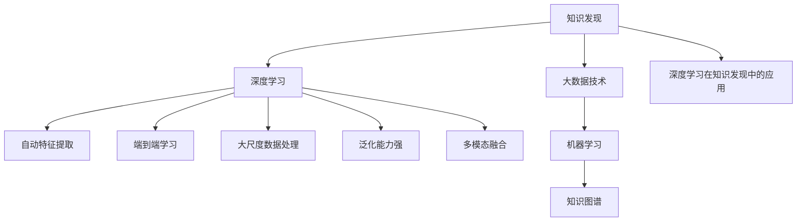

                 

# 知识发现引擎的深度学习应用

> 关键词：知识发现引擎,深度学习,大数据,数据挖掘,机器学习,数据科学

## 1. 背景介绍

### 1.1 问题由来
在当今数据爆炸的时代，数据已经成为各个领域的重要资源。从互联网公司到金融企业，从科研机构到政府部门，数据无处不在。然而，数据本身并不直接蕴含价值，只有通过挖掘和分析，将数据转化为可用的知识，才能真正发挥其潜力。

知识发现引擎（Knowledge Discovery Engine, KDE），是一类能够从大规模数据中挖掘出有价值知识的工具。传统的知识发现引擎主要依赖统计学和数据库技术，而随着深度学习和大数据技术的发展，越来越多的研究者开始探索使用深度学习模型进行知识发现。

本文章将对深度学习在知识发现中的应用进行系统介绍，包括其原理、算法、技术实现以及实际应用案例。通过深入分析，我们希望能为读者提供全面的指导，帮助他们在知识发现工程实践中，利用深度学习技术，高效挖掘数据中的有价值知识。

### 1.2 问题核心关键点
深度学习在知识发现中的应用主要体现在以下几个方面：

1. **自动特征提取**：传统知识发现依赖人工设计特征，而深度学习能够自动从数据中学习高层次的抽象特征，显著提升特征工程的效率和效果。
2. **端到端学习**：深度学习可以通过一次性端到端训练，从原始数据直接学习到知识发现模型，无需人工干预，简化了知识发现流程。
3. **大尺度数据处理**：深度学习模型可以处理海量数据，利用分布式计算和大数据技术，支持对大规模数据进行高效分析和挖掘。
4. **泛化能力强**：深度学习模型在泛化能力上优于传统统计模型，可以在不同数据集和应用场景中，取得稳定的知识发现效果。
5. **多模态融合**：深度学习能够自然地融合不同模态的数据，如图像、文本、语音等，构建更加全面、准确的知识发现系统。

深度学习在知识发现中的独特优势，使其成为现代知识发现引擎的重要组成部分。

## 2. 核心概念与联系

### 2.1 核心概念概述

为更好地理解深度学习在知识发现中的应用，本节将介绍几个密切相关的核心概念：

- **知识发现（Knowledge Discovery）**：指从大规模数据中自动挖掘出有价值的模式、规则、关联等知识，辅助决策和优化。
- **深度学习（Deep Learning）**：一类通过多层神经网络学习数据的层次化特征表示的技术，广泛用于图像、语音、文本等领域。
- **大数据技术（Big Data Technology）**：涉及数据采集、存储、处理、分析等技术，支持对海量数据进行高效处理。
- **机器学习（Machine Learning）**：一类从数据中学习规律和模型，进而进行预测和决策的技术。
- **知识图谱（Knowledge Graph）**：一种表示实体及其关系的图结构，用于组织和检索知识。
- **多模态学习（Multimodal Learning）**：一种融合不同模态数据（如图像、文本、音频等）的学习技术，提升知识发现的全面性和准确性。
- **深度学习在知识发现中的应用**：指利用深度学习模型对数据进行特征提取、分类、聚类、关联规则挖掘等知识发现任务，提升知识发现的效率和效果。

这些核心概念之间的逻辑关系可以通过以下Mermaid流程图来展示：



这个流程图展示了大规模数据处理技术、机器学习、知识图谱、多模态数据融合等技术，如何共同支撑深度学习在知识发现中的应用。

## 3. 核心算法原理 & 具体操作步骤
### 3.1 算法原理概述

深度学习在知识发现中的应用，本质上是通过多层神经网络对数据进行特征提取和模式学习，进而发现数据中的知识。其核心思想是利用数据驱动的方法，自动构建层次化的特征表示，并通过不断优化神经网络参数，从原始数据中学习出有价值的模式和规律。

知识发现任务的深度学习模型通常分为两部分：

1. **特征提取层**：用于自动学习数据的层次化特征表示，通常包含卷积神经网络（CNN）、递归神经网络（RNN）、长短期记忆网络（LSTM）、变换器（Transformer）等。
2. **任务处理层**：用于对特征表示进行进一步处理，完成特定的知识发现任务，如分类、聚类、关联规则挖掘等，通常使用全连接层、分类器、距离度量等。

知识发现任务的深度学习流程通常包括以下步骤：

1. **数据预处理**：包括数据清洗、归一化、特征工程等。
2. **模型训练**：使用深度学习模型对数据进行特征提取和模式学习。
3. **模型评估**：通过评估指标（如准确率、召回率、F1-score等）对模型性能进行评估。
4. **知识发现**：将模型应用于实际数据，发现新的知识。

### 3.2 算法步骤详解

以下以图像分类为例，详细讲解深度学习在知识发现中的应用。

**Step 1: 数据预处理**
- 收集并清洗图像数据，去除噪声和冗余数据。
- 对图像进行归一化处理，调整像素值范围。
- 对图像进行数据增强，如旋转、翻转、裁剪等，扩充训练集。

**Step 2: 模型构建**
- 选择合适的深度学习模型，如卷积神经网络（CNN）。
- 设计模型架构，包括卷积层、池化层、全连接层等。
- 使用合适的损失函数（如交叉熵损失），定义模型优化目标。

**Step 3: 模型训练**
- 将训练数据输入模型进行前向传播，计算损失函数。
- 反向传播更新模型参数，优化损失函数。
- 周期性在验证集上评估模型性能，防止过拟合。
- 重复上述步骤直至收敛。

**Step 4: 模型评估**
- 使用测试集评估模型性能，计算准确率、召回率、F1-score等指标。
- 分析模型在各类类别上的表现，识别模型缺陷。
- 调整模型超参数，优化模型性能。

**Step 5: 知识发现**
- 将训练好的模型应用于实际数据，进行分类预测。
- 对预测结果进行可视化，识别数据中的模式和规律。
- 进一步分析数据特征，提取有价值的信息。

### 3.3 算法优缺点

深度学习在知识发现中的应用，具有以下优点：

1. **自动特征提取**：深度学习能够自动学习数据的层次化特征表示，无需人工设计特征。
2. **端到端学习**：通过一次性端到端训练，从原始数据直接学习到知识发现模型，无需人工干预。
3. **泛化能力强**：深度学习模型在泛化能力上优于传统统计模型，可以在不同数据集和应用场景中，取得稳定的知识发现效果。
4. **大尺度数据处理**：深度学习模型可以处理海量数据，利用分布式计算和大数据技术，支持对大规模数据进行高效分析和挖掘。
5. **多模态融合**：深度学习能够自然地融合不同模态的数据，如图像、文本、语音等，构建更加全面、准确的知识发现系统。

但深度学习在知识发现中也有以下缺点：

1. **计算资源消耗大**：深度学习模型参数量大，训练和推理时计算资源消耗较大。
2. **模型难以解释**：深度学习模型通常是一个“黑盒”，难以解释其内部工作机制和决策逻辑。
3. **过拟合风险高**：深度学习模型容易过拟合，特别是在标注数据不足的情况下。
4. **高门槛**：深度学习模型需要专业知识，对数据和算法都有较高要求，需要专业的团队进行开发和维护。

尽管存在这些局限性，但深度学习在知识发现中的应用，依然具有巨大的潜力。

### 3.4 算法应用领域

深度学习在知识发现中的应用，已经涵盖了各种领域，例如：

1. **自然语言处理（NLP）**：通过文本分类、情感分析、文本聚类等任务，挖掘文本中的知识和信息。
2. **图像处理（CV）**：通过图像分类、目标检测、图像分割等任务，挖掘图像中的模式和规律。
3. **医疗领域**：通过病历分析、疾病诊断、药物研发等任务，挖掘医疗数据中的知识。
4. **金融领域**：通过交易预测、风险评估、市场分析等任务，挖掘金融数据中的知识和信息。
5. **工业制造**：通过故障诊断、质量检测、设备维护等任务，挖掘制造数据中的知识和信息。
6. **社交网络分析**：通过用户行为分析、社群发现、情感分析等任务，挖掘社交数据中的知识和信息。
7. **智慧城市**：通过交通流量分析、环境监测、公共安全等任务，挖掘城市数据中的知识和信息。

以上领域仅是深度学习在知识发现中应用的冰山一角，未来随着深度学习技术的不断进步，其应用领域还将进一步拓展和深化。

## 4. 数学模型和公式 & 详细讲解
### 4.1 数学模型构建

知识发现任务的深度学习模型通常基于神经网络架构，以下以图像分类任务为例，介绍其数学模型构建过程。

假设输入图像数据为 $x \in \mathbb{R}^{n_x}$，输出标签为 $y \in \{1, 2, \cdots, C\}$，其中 $C$ 为类别数。一个典型的图像分类任务深度学习模型可以表示为：

$$
y = M_{\theta}(x)
$$

其中 $M_{\theta}$ 为神经网络模型，$\theta$ 为模型参数。

### 4.2 公式推导过程

以卷积神经网络（CNN）为例，进行公式推导。

**Step 1: 特征提取层**
- 使用卷积层提取图像特征，计算输出特征图 $f \in \mathbb{R}^{n_f}$，其中 $n_f$ 为特征图维度。
- 使用池化层对特征图进行下采样，得到 $f' \in \mathbb{R}^{n'_f}$，其中 $n'_f < n_f$。
- 通过多层卷积和池化，逐步提取更高层次的特征表示，最终得到特征表示 $F \in \mathbb{R}^{n'_f}$。

**Step 2: 任务处理层**
- 将特征表示 $F$ 输入全连接层，计算输出 $Z \in \mathbb{R}^{C}$。
- 使用 Softmax 函数对输出进行归一化，得到概率分布 $P \in \mathbb{R}^{C}$。
- 定义损失函数，如交叉熵损失，计算模型预测输出与真实标签之间的差异。

### 4.3 案例分析与讲解

以医学图像分类为例，介绍深度学习在知识发现中的应用。

**数据预处理**：收集并清洗医学图像数据，去除噪声和冗余数据。对图像进行归一化处理，调整像素值范围。使用数据增强技术，如旋转、翻转、裁剪等，扩充训练集。

**模型构建**：选择卷积神经网络（CNN）作为特征提取层，设计模型架构，包括卷积层、池化层、全连接层等。使用交叉熵损失函数作为优化目标，定义模型优化目标。

**模型训练**：将训练数据输入模型进行前向传播，计算损失函数。反向传播更新模型参数，优化损失函数。周期性在验证集上评估模型性能，防止过拟合。重复上述步骤直至收敛。

**模型评估**：使用测试集评估模型性能，计算准确率、召回率、F1-score等指标。分析模型在各类类别上的表现，识别模型缺陷。调整模型超参数，优化模型性能。

**知识发现**：将训练好的模型应用于实际医学图像数据，进行分类预测。对预测结果进行可视化，识别数据中的模式和规律。进一步分析数据特征，提取有价值的信息，如肿瘤类型、病变程度等。

## 5. 项目实践：代码实例和详细解释说明
### 5.1 开发环境搭建

在进行深度学习知识发现项目实践前，我们需要准备好开发环境。以下是使用Python进行TensorFlow开发的环境配置流程：

1. 安装Anaconda：从官网下载并安装Anaconda，用于创建独立的Python环境。

2. 创建并激活虚拟环境：
```bash
conda create -n tf-env python=3.8 
conda activate tf-env
```

3. 安装TensorFlow：根据CUDA版本，从官网获取对应的安装命令。例如：
```bash
conda install tensorflow -c pytorch -c conda-forge
```

4. 安装各类工具包：
```bash
pip install numpy pandas scikit-learn matplotlib tqdm jupyter notebook ipython
```

完成上述步骤后，即可在`tf-env`环境中开始知识发现项目实践。

### 5.2 源代码详细实现

下面我们以图像分类任务为例，给出使用TensorFlow进行知识发现项目开发的PyTorch代码实现。

首先，定义图像分类任务的数据处理函数：

```python
import tensorflow as tf
from tensorflow.keras import layers
from tensorflow.keras.preprocessing.image import ImageDataGenerator

class ImageClassificationDataset(tf.keras.utils.Sequence):
    def __init__(self, image_paths, labels, batch_size=32):
        self.image_paths = image_paths
        self.labels = labels
        self.batch_size = batch_size
        self.data_gen = ImageDataGenerator(
            rescale=1.0/255,
            shear_range=0.2,
            zoom_range=0.2,
            horizontal_flip=True,
            validation_split=0.2
        )
    
    def __len__(self):
        return len(self.image_paths) // self.batch_size
    
    def __getitem__(self, idx):
        img = tf.image.decode_jpeg(tf.io.read_file(self.image_paths[idx]))
        img = tf.image.resize(img, (224, 224))
        img = tf.keras.applications.resnet50.preprocess_input(img)
        label = self.labels[idx]
        x = self.data_gen.flow(img, label, batch_size=self.batch_size, shuffle=False)
        return tf.next_element(x)
```

然后，定义模型和优化器：

```python
from tensorflow.keras import Model, optimizers

model = tf.keras.Sequential([
    layers.Conv2D(32, (3, 3), activation='relu', input_shape=(224, 224, 3)),
    layers.MaxPooling2D((2, 2)),
    layers.Conv2D(64, (3, 3), activation='relu'),
    layers.MaxPooling2D((2, 2)),
    layers.Conv2D(128, (3, 3), activation='relu'),
    layers.MaxPooling2D((2, 2)),
    layers.Flatten(),
    layers.Dense(64, activation='relu'),
    layers.Dense(10)
])

optimizer = optimizers.Adam()
```

接着，定义训练和评估函数：

```python
from tensorflow.keras import metrics

def train_epoch(model, dataset, batch_size, optimizer):
    model.compile(optimizer=optimizer, loss=tf.keras.losses.SparseCategoricalCrossentropy(from_logits=True), metrics=['accuracy'])
    model.fit(dataset, epochs=1, batch_size=batch_size, verbose=0)
    return model.metrics['accuracy'][0]

def evaluate(model, dataset, batch_size):
    model.evaluate(dataset, batch_size=batch_size, verbose=0)
```

最后，启动训练流程并在测试集上评估：

```python
epochs = 5
batch_size = 16

for epoch in range(epochs):
    accuracy = train_epoch(model, train_dataset, batch_size, optimizer)
    print(f"Epoch {epoch+1}, train accuracy: {accuracy:.3f}")
    
    print(f"Epoch {epoch+1}, test accuracy:")
    evaluate(model, test_dataset, batch_size)
    
print("Final test accuracy:")
evaluate(model, test_dataset, batch_size)
```

以上就是使用TensorFlow进行图像分类任务的知识发现项目开发的完整代码实现。可以看到，得益于TensorFlow的强大封装，我们能够用相对简洁的代码完成图像分类模型的训练和评估。

### 5.3 代码解读与分析

让我们再详细解读一下关键代码的实现细节：

**ImageClassificationDataset类**：
- `__init__`方法：初始化图像路径、标签、批次大小等关键组件，并创建ImageDataGenerator实例。
- `__len__`方法：返回数据集的样本数量。
- `__getitem__`方法：对单个样本进行处理，读取图像路径，进行预处理，计算标签，并生成批次数据。

**train_epoch函数**：
- 定义模型编译方式，指定优化器和损失函数。
- 使用训练数据集对模型进行一次epoch训练，返回训练准确率。

**evaluate函数**：
- 使用测试数据集对模型进行评估，输出测试准确率。

**训练流程**：
- 定义总的epoch数和批次大小，开始循环迭代
- 每个epoch内，先在训练集上训练，输出训练准确率
- 在测试集上评估，输出测试准确率
- 所有epoch结束后，在测试集上评估，给出最终测试准确率

可以看到，TensorFlow的高级API使得知识发现模型的开发变得简洁高效。开发者可以将更多精力放在数据处理、模型改进等高层逻辑上，而不必过多关注底层的实现细节。

当然，工业级的系统实现还需考虑更多因素，如模型的保存和部署、超参数的自动搜索、更灵活的任务适配层等。但核心的知识发现流程基本与此类似。

## 6. 实际应用场景
### 6.1 医疗图像分类

医疗图像分类是知识发现的一个重要应用场景。医疗影像如X光片、CT扫描等，是临床诊断的重要依据。通过深度学习模型对医疗图像进行分类，可以快速准确地识别出各类病变和异常，辅助医生进行诊断和治疗。

在实践中，可以收集大量的医疗图像数据，将其分为训练集和测试集。使用卷积神经网络（CNN）对医疗图像进行特征提取和分类，得到准确率、召回率等指标，进一步分析数据特征，提取有价值的医学信息。

### 6.2 金融交易预测

金融交易预测是知识发现的重要应用场景。通过深度学习模型对历史交易数据进行学习，可以预测未来市场趋势，辅助投资者进行投资决策。

在实践中，可以收集历史交易数据，将其分为训练集和测试集。使用长短期记忆网络（LSTM）对交易数据进行时间序列预测，得到准确率、误差率等指标，进一步分析数据特征，预测市场趋势，辅助投资者进行投资决策。

### 6.3 社交媒体情感分析

社交媒体情感分析是知识发现的重要应用场景。通过深度学习模型对社交媒体数据进行情感分析，可以实时监测用户情绪和舆情变化，辅助政府和企业进行决策和预警。

在实践中，可以收集社交媒体数据，将其分为训练集和测试集。使用卷积神经网络（CNN）或循环神经网络（RNN）对社交媒体文本进行情感分类，得到准确率、召回率等指标，进一步分析数据特征，识别出用户情绪和舆情变化趋势，辅助政府和企业进行决策和预警。

### 6.4 未来应用展望

随着深度学习技术的不断进步，基于深度学习知识发现引擎的应用前景将更加广阔。

1. **多模态学习**：未来知识发现引擎将更加注重多模态数据的融合，如图像、文本、语音等，构建更加全面、准确的知识发现系统。
2. **分布式训练**：随着数据规模的不断扩大，分布式训练技术将逐步普及，提升知识发现引擎的训练效率和可扩展性。
3. **自监督学习**：自监督学习将进一步提升深度学习模型在知识发现中的表现，无需大量标注数据即可取得理想的效果。
4. **端到端应用**：知识发现引擎将更加注重端到端应用，构建一体化解决方案，提升用户使用体验。
5. **实时计算**：实时计算技术将提升知识发现引擎的响应速度和实时性，满足实际应用的需求。
6. **数据治理**：数据治理技术将提升知识发现引擎的数据质量和管理效率，保障数据安全和合规性。

以上趋势凸显了深度学习在知识发现中的应用潜力。这些方向的探索发展，必将进一步提升知识发现引擎的性能和应用范围，为各个领域带来变革性影响。

## 7. 工具和资源推荐
### 7.1 学习资源推荐

为了帮助开发者系统掌握深度学习在知识发现中的应用，这里推荐一些优质的学习资源：

1. **《深度学习》（Ian Goodfellow）**：全面介绍了深度学习的理论和实践，是深度学习领域的经典教材。
2. **《TensorFlow官方文档》**：TensorFlow的官方文档，提供了丰富的教程和示例，适合新手入门。
3. **《PyTorch官方文档》**：PyTorch的官方文档，提供了丰富的教程和示例，适合新手入门。
4. **《Keras官方文档》**：Keras的官方文档，提供了丰富的教程和示例，适合新手入门。
5. **《自然语言处理综论》（Daniel Jurafsky & James H. Martin）**：全面介绍了自然语言处理的理论和实践，是NLP领域的经典教材。
6. **《计算机视觉：模型、学习和推理》（Russell Johannson）**：全面介绍了计算机视觉的理论和实践，是CV领域的经典教材。
7. **《医疗数据分析》（Vladimir Cherkassky）**：介绍了医疗数据分析的理论与实践，是医疗领域的经典教材。

通过对这些资源的学习实践，相信你一定能够快速掌握深度学习在知识发现中的应用，并用于解决实际的NLP问题。

### 7.2 开发工具推荐

高效的开发离不开优秀的工具支持。以下是几款用于深度学习知识发现开发的常用工具：

1. **TensorFlow**：谷歌开发的深度学习框架，支持分布式计算和大数据处理，适合大规模知识发现应用。
2. **PyTorch**：Facebook开发的深度学习框架，灵活动态的计算图，适合快速迭代研究。
3. **Keras**：Keras API，基于TensorFlow和Theano的深度学习框架，简单易用，适合新手入门。
4. **MXNet**：由亚马逊开发的深度学习框架，支持分布式计算和大数据处理，适合大规模知识发现应用。
5. **JAX**：Google开发的深度学习框架，支持自动微分和分布式计算，适合研究型应用。
6. **TensorBoard**：TensorFlow配套的可视化工具，可实时监测模型训练状态，提供丰富的图表呈现方式。
7. **Weights & Biases**：模型训练的实验跟踪工具，可以记录和可视化模型训练过程中的各项指标，方便对比和调优。

合理利用这些工具，可以显著提升深度学习知识发现项目的开发效率，加快创新迭代的步伐。

### 7.3 相关论文推荐

深度学习在知识发现中的应用，源于学界的持续研究。以下是几篇奠基性的相关论文，推荐阅读：

1. **《ImageNet Classification with Deep Convolutional Neural Networks》**：AlexNet论文，展示了深度学习在图像分类任务上的优越表现。
2. **《Google's Neural Machine Translation System: Bridging the Gap Between Human and Machine Translation》**：Google翻译论文，展示了深度学习在机器翻译任务上的优越表现。
3. **《Understanding the Difficulties of Training Recurrent Neural Networks》**：RNN论文，展示了深度学习在时间序列预测任务上的优越表现。
4. **《Attention is All You Need》**：Transformer论文，展示了深度学习在文本分类任务上的优越表现。
5. **《Natural Language Processing with Attention-based Deep Learning》**：NLP与Attention论文，展示了深度学习在自然语言处理任务上的优越表现。
6. **《Multimodal Learning in Computer Vision》**：多模态学习论文，展示了深度学习在多模态数据融合任务上的优越表现。
7. **《Deep Learning in Drug Discovery》**：药物发现论文，展示了深度学习在医学领域的应用效果。

这些论文代表了大规模数据处理技术、机器学习、知识图谱、多模态数据融合等技术的发展脉络。通过学习这些前沿成果，可以帮助研究者把握学科前进方向，激发更多的创新灵感。

## 8. 总结：未来发展趋势与挑战

### 8.1 总结

本文对深度学习在知识发现中的应用进行了全面系统的介绍。首先阐述了深度学习在知识发现中的应用背景和意义，明确了知识发现引擎的核心功能。其次，从原理到实践，详细讲解了深度学习在知识发现中的数学模型和算法流程，给出了深度学习知识发现项目的完整代码实现。同时，本文还广泛探讨了深度学习在知识发现引擎中的应用场景，展示了深度学习技术在各个领域中的巨大潜力。

通过本文的系统梳理，可以看到，深度学习在知识发现中的应用，已经成为现代知识发现引擎的重要组成部分。其自动特征提取、端到端学习、大尺度数据处理、泛化能力强、多模态融合等优势，使其在知识发现中具有不可替代的地位。

### 8.2 未来发展趋势

展望未来，深度学习在知识发现中的应用将呈现以下几个发展趋势：

1. **自动特征提取**：深度学习将继续提升自动特征提取的能力，利用自监督学习、对抗生成网络（GAN）等技术，进一步提高特征工程效率和效果。
2. **端到端学习**：深度学习将继续优化端到端学习流程，利用迁移学习、预训练等技术，提升模型泛化能力和性能。
3. **大尺度数据处理**：深度学习将继续利用分布式计算和大数据技术，处理海量数据，提升知识发现引擎的可扩展性和效率。
4. **泛化能力强**：深度学习将继续提升泛化能力，利用自适应学习、正则化等技术，避免过拟合和灾难性遗忘。
5. **多模态融合**：深度学习将继续提升多模态融合能力，利用多模态深度学习技术，融合图像、文本、语音等多种数据，提升知识发现引擎的全面性和准确性。
6. **实时计算**：深度学习将继续提升实时计算能力，利用分布式计算、云计算等技术，提升知识发现引擎的响应速度和实时性。
7. **数据治理**：深度学习将继续提升数据治理能力，利用数据清洗、数据标注、数据加密等技术，保障数据安全和合规性。

以上趋势凸显了深度学习在知识发现中的应用潜力。这些方向的探索发展，必将进一步提升知识发现引擎的性能和应用范围，为各个领域带来变革性影响。

### 8.3 面临的挑战

尽管深度学习在知识发现中的应用已经取得了巨大成功，但在迈向更加智能化、普适化应用的过程中，它仍面临着诸多挑战：

1. **标注数据依赖**：深度学习模型需要大量标注数据进行训练，对于某些领域，获取高质量标注数据成本较高。如何降低深度学习模型对标注数据的依赖，是未来亟待解决的问题。
2. **计算资源消耗大**：深度学习模型参数量大，训练和推理时计算资源消耗较大。如何降低计算资源消耗，提升模型训练和推理效率，是未来亟待解决的问题。
3. **模型难以解释**：深度学习模型通常是一个“黑盒”，难以解释其内部工作机制和决策逻辑。如何提升深度学习模型的可解释性，保障其决策透明性和可信度，是未来亟待解决的问题。
4. **过拟合风险高**：深度学习模型容易过拟合，特别是在标注数据不足的情况下。如何降低过拟合风险，提升深度学习模型的泛化能力，是未来亟待解决的问题。
5. **高门槛**：深度学习模型需要专业知识，对数据和算法都有较高要求，需要专业的团队进行开发和维护。如何降低深度学习模型的使用门槛，使其更加易于上手和部署，是未来亟待解决的问题。

尽管存在这些挑战，但深度学习在知识发现中的应用，依然具有巨大的潜力。未来，随着深度学习技术的不断进步和完善，其应用前景将更加广阔。

### 8.4 研究展望

面对深度学习在知识发现中面临的挑战，未来的研究需要在以下几个方面寻求新的突破：

1. **自监督学习**：探索无监督学习和半监督学习技术，降低深度学习模型对标注数据的依赖，利用非结构化数据进行知识发现。
2. **参数高效微调**：开发参数高效的微调方法，如知识蒸馏、参数裁剪等，在固定大部分预训练参数的情况下，只更新极少量的任务相关参数。
3. **迁移学习**：探索迁移学习技术，利用预训练模型和任务间的相似性，提升知识发现模型的泛化能力和性能。
4. **多模态深度学习**：探索多模态深度学习技术，融合图像、文本、语音等多种数据，提升知识发现模型的全面性和准确性。
5. **可解释性学习**：探索可解释性学习技术，利用知识蒸馏、模型可视化等技术，提升深度学习模型的可解释性和可信度。
6. **实时计算和分布式计算**：探索实时计算和分布式计算技术，提升知识发现模型的响应速度和可扩展性。
7. **数据治理和安全保护**：探索数据治理和安全保护技术，保障数据安全和合规性，提升知识发现模型的可靠性和鲁棒性。

这些研究方向的发展，必将进一步提升深度学习在知识发现中的应用效果和应用范围，为各个领域带来变革性影响。

## 9. 附录：常见问题与解答

**Q1：深度学习在知识发现中的应用是否适用于所有领域？**

A: 深度学习在知识发现中的应用，已经涵盖了各个领域，如自然语言处理、图像处理、医疗领域等。但对于某些特定领域，如金融、法律等，可能需要针对性地进行数据预处理和模型设计。因此，深度学习在知识发现中的应用，需要根据具体领域进行定制化设计。

**Q2：深度学习在知识发现中的应用是否需要大量标注数据？**

A: 深度学习在知识发现中的应用，通常需要大量标注数据进行训练。但对于某些特定任务，如少样本学习和多模态学习，可以通过数据增强、迁移学习等技术，减少对标注数据的依赖。

**Q3：深度学习在知识发现中的应用是否容易过拟合？**

A: 深度学习在知识发现中的应用，容易过拟合，尤其是在标注数据不足的情况下。为了缓解过拟合问题，可以采用正则化技术、数据增强技术、模型裁剪技术等。

**Q4：深度学习在知识发现中的应用是否需要高深的数学知识？**

A: 深度学习在知识发现中的应用，需要一定的数学知识，如线性代数、概率论等。但并不需要高深的数学知识，可以通过在线课程、书籍、博客等资源进行自学。

**Q5：深度学习在知识发现中的应用是否需要高性能计算资源？**

A: 深度学习在知识发现中的应用，需要高性能计算资源，如GPU、TPU等。但通过分布式计算和大数据技术，可以显著提升模型的训练和推理效率。

通过对这些常见问题的回答，希望能够帮助读者更好地理解深度学习在知识发现中的应用，并在实际开发中解决潜在问题。

