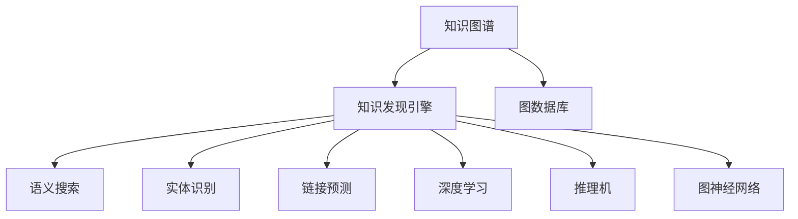

                 

# 知识发现引擎的知识图谱构建

> 关键词：知识图谱,知识发现引擎,图数据库,语义搜索,实体识别,链接预测,深度学习,推理机,图神经网络

## 1. 背景介绍

### 1.1 问题由来
在信息爆炸的今天，互联网的数据量以指数级增长，如何从中提取有价值的信息，成为学术界和工业界共同面临的重要挑战。传统的结构化数据库和文本搜索难以适应大规模非结构化数据的处理需求，亟需新的解决方案。知识图谱作为一种语义化、结构化的数据表示方式，成为知识发现和数据挖掘的重要工具。

知识图谱是由实体和关系组成的有向图，其中实体代表现实世界中的概念，关系描述了实体之间的语义联系。构建知识图谱的目的是为查询提供语义化的接口，实现基于语义的查询和推理，从而提高数据处理的效率和准确性。

当前知识图谱的构建主要依赖人工标注和规则提取，成本高、效率低。为了降低构建成本，提升构建效率，本文将探讨一种基于知识发现引擎的知识图谱构建方法，该方法利用深度学习和图数据库等先进技术，自动发现知识图谱中的实体、关系和属性，自动生成知识图谱。

## 2. 核心概念与联系

### 2.1 核心概念概述

为更好地理解知识图谱的构建方法，本节将介绍几个密切相关的核心概念：

- 知识图谱(Knowledge Graph)：以图结构表示实体、关系和属性，用于构建语义化的知识库。
- 知识发现引擎(Knowledge Discovery Engine, KDE)：基于数据挖掘和机器学习技术，从原始数据中自动发现和抽取知识的过程。
- 图数据库(Graph Database)：专门用于存储和管理图结构数据的数据库，支持高效的图遍历和查询。
- 语义搜索(Semantic Search)：基于语义理解和查询，在知识图谱中检索出满足用户需求的实体和关系。
- 实体识别(Entity Recognition)：自动从文本中识别出具有语义含义的实体，如人名、地名、组织机构名等。
- 链接预测(Link Prediction)：利用机器学习模型，预测知识图谱中缺失的实体和关系。
- 深度学习(Deep Learning)：通过多层神经网络结构，实现对非线性、高维数据的深度特征提取和抽象。
- 推理机(Rule-Based Reasoner)：基于预定义的规则和推理引擎，实现知识图谱的逻辑推理和语义推理。
- 图神经网络(Graph Neural Network, GNN)：结合图结构和深度学习，实现对图数据的高效建模和处理。

这些核心概念之间的逻辑关系可以通过以下Mermaid流程图来展示：



这个流程图展示了一系列核心概念及其之间的关系：

1. 知识图谱是知识发现引擎的输出目标，是知识发现的核心载体。
2. 知识发现引擎主要依赖图数据库、实体识别、链接预测、深度学习、推理机和图神经网络等技术，从原始数据中自动发现和抽取知识。
3. 图数据库用于存储和管理知识图谱，支持高效的图遍历和查询。
4. 语义搜索在知识图谱中进行语义化查询，提升查询的准确性和效率。
5. 深度学习在知识图谱构建过程中，用于实现实体识别、链接预测等任务。
6. 推理机在知识图谱中进行逻辑推理和语义推理，扩展知识图谱的知识边界。
7. 图神经网络用于建模复杂图结构，实现高效的知识图谱构建和查询。

这些概念共同构成了知识发现引擎的知识图谱构建框架，使其能够自动从海量数据中发现和抽取知识，构建语义化的知识图谱。

## 3. 核心算法原理 & 具体操作步骤
### 3.1 算法原理概述

基于知识发现引擎的知识图谱构建方法，本质上是一种自动化的知识抽取和构建过程。其核心思想是：将原始数据看作一个图结构，利用深度学习和图神经网络等技术，自动发现和抽取实体、关系和属性，构建知识图谱。

具体而言，知识发现引擎首先通过实体识别技术，从文本中自动抽取具有语义含义的实体，将实体节点加入图数据库中。然后利用链接预测技术，在图数据库中构建实体之间的语义关系，即节点之间的边。最后，通过推理机对知识图谱进行逻辑推理和语义推理，扩展知识图谱的知识边界，形成更加全面、准确的知识图谱。

知识发现引擎的构建过程可以概括为以下三个关键步骤：

1. 实体识别：从文本中自动抽取实体节点，并将实体节点加入图数据库中。
2. 链接预测：利用深度学习模型预测图数据库中缺失的节点和边，形成完整的图结构。
3. 推理扩展：通过推理机对知识图谱进行逻辑推理和语义推理，扩展知识图谱的知识边界。

### 3.2 算法步骤详解

以下是知识发现引擎的知识图谱构建的详细步骤：

**Step 1: 数据准备**
- 收集原始数据，如网页、新闻、社交媒体等文本数据。
- 对文本进行预处理，如分词、去停用词、词性标注等。

**Step 2: 实体识别**
- 利用自然语言处理技术，从文本中识别出具有语义含义的实体节点。
- 实体识别可以采用基于规则、基于统计、基于深度学习等方法。
- 将识别出的实体节点加入图数据库中。

**Step 3: 链接预测**
- 利用深度学习模型，如GraphSAGE、GAT等，在图数据库中预测缺失的节点和边。
- 可以通过训练监督任务，预测节点之间的语义关系，如属性关系、继承关系等。
- 将预测出的节点和边加入图数据库中。

**Step 4: 推理扩展**
- 利用推理机对知识图谱进行逻辑推理和语义推理，扩展知识图谱的知识边界。
- 推理机可以基于规则、基于深度学习等方法，实现复杂的推理任务。
- 将推理结果加入知识图谱中。

**Step 5: 图数据库存储**
- 将构建好的知识图谱存储在图数据库中，如Neo4j、OrientDB等。
- 图数据库支持高效的图遍历和查询，方便后续的查询和推理任务。

### 3.3 算法优缺点

基于知识发现引擎的知识图谱构建方法具有以下优点：
1. 自动化程度高。通过深度学习和图神经网络技术，自动发现和抽取实体、关系和属性，大幅降低了人工标注成本。
2. 构建效率高。利用高效的图数据库和推理机，可以加速知识图谱的构建和扩展。
3. 知识图谱全面准确。通过多源数据的融合和推理扩展，构建的知识图谱更加全面和准确。
4. 支持语义搜索。利用语义搜索技术，可以在知识图谱中进行语义化查询，提升查询的准确性和效率。

同时，该方法也存在一定的局限性：
1. 对文本质量依赖高。实体识别和链接预测依赖文本的质量和结构，低质量的文本数据可能导致错误的实体和关系抽取。
2. 对模型和算法依赖高。实体识别和链接预测依赖深度学习模型的性能和算法的设计，模型训练的复杂度高。
3. 推理扩展难度大。推理扩展需要预定义复杂的规则和推理引擎，设计难度大，且推理结果的可解释性不足。

尽管存在这些局限性，但就目前而言，基于知识发现引擎的知识图谱构建方法仍是大规模知识图谱构建的重要手段。未来相关研究的重点在于如何进一步降低模型和算法的依赖，提高推理扩展的灵活性和可解释性。

### 3.4 算法应用领域

基于知识发现引擎的知识图谱构建方法，在知识发现和数据挖掘领域已经得到了广泛的应用，具体包括：

- 金融风控：构建企业关系图谱，识别潜在的风险交易，提升金融风险控制能力。
- 电商推荐：构建用户行为图谱，分析用户偏好和购买行为，实现精准的个性化推荐。
- 医疗健康：构建疾病图谱，分析疾病的传播路径和影响因素，辅助疾病诊断和治疗。
- 社会网络：构建社会网络图谱，分析人群的社交关系和影响力，实现精准的社会管理。
- 资源规划：构建资源图谱，分析资源的分布和利用情况，实现更高效的资源规划和调度。

除了上述这些经典应用外，知识图谱技术还被创新性地应用到更多场景中，如安全监控、环境监测、智慧城市等，为各行各业的知识挖掘和决策支持提供了新的技术手段。

## 4. 数学模型和公式 & 详细讲解 & 举例说明
### 4.1 数学模型构建

以下是知识图谱的数学模型构建过程：

1. **图结构表示**：知识图谱由实体节点和关系边组成，用三元组（实体1，关系，实体2）表示。设实体集合为 $V$，关系集合为 $R$，则知识图谱 $G=(V, R, E)$。

2. **实体节点**：实体节点用符号 $n$ 表示，其中 $n \in V$，每个节点包含属性的向量表示。

3. **关系边**：关系边用符号 $e$ 表示，其中 $e \in E$，每个边包含属性的向量表示。

4. **节点和边的特征表示**：设节点 $n_i$ 的特征表示为 $x_i$，边 $e_j$ 的特征表示为 $y_j$，则知识图谱的特征表示为 $X=[x_1, x_2, \ldots, x_n]$，边的特征表示为 $Y=[y_1, y_2, \ldots, y_m]$。

5. **节点和边的相似度表示**：设节点 $n_i$ 和节点 $n_j$ 的相似度为 $s_{ij}$，边 $e_k$ 和边 $e_l$ 的相似度为 $t_{kl}$，则知识图谱的相似度表示为 $S=[s_{11}, s_{12}, \ldots, s_{nn}]$，边的相似度表示为 $T=[t_{11}, t_{12}, \ldots, t_{mm}]$。

### 4.2 公式推导过程

以下是知识图谱构建过程中的一些关键公式推导：

**实体识别公式**：

假设实体识别模型为 $f$，则实体识别公式为：

$$
x = f(y) = \max_{i=1}^n \sum_{j=1}^m s_{ij} w_{ij}
$$

其中，$y$ 为输入的文本，$x$ 为识别的实体节点，$w_{ij}$ 为节点 $n_i$ 和节点 $n_j$ 的相似度权重。

**链接预测公式**：

假设链接预测模型为 $g$，则链接预测公式为：

$$
y = g(x) = \max_{i=1}^n \sum_{j=1}^m t_{ij} w_{ij}
$$

其中，$x$ 为实体节点，$y$ 为预测的关系边，$w_{ij}$ 为节点和边的相似度权重。

**推理扩展公式**：

假设推理扩展模型为 $h$，则推理扩展公式为：

$$
z = h(x, y) = \max_{i=1}^n \sum_{j=1}^m t_{ij} w_{ij} + \max_{k=1}^m \sum_{l=1}^m t_{kl} w_{kl}
$$

其中，$x$ 为输入的节点和边，$z$ 为推理扩展后的节点和边，$w_{ij}$ 和 $w_{kl}$ 为节点和边的相似度权重。

### 4.3 案例分析与讲解

以下是知识图谱构建过程中的一个典型案例分析：

**案例背景**：某电商网站需要构建用户行为图谱，以便实现精准的个性化推荐。

**实体识别**：从用户行为数据中抽取用户实体、商品实体和用户行为实体，并将实体节点加入图数据库中。实体识别过程如下：

1. 对用户行为数据进行预处理，如去停用词、词性标注等。
2. 利用深度学习模型，如BERT，从预处理后的文本中识别出用户实体、商品实体和行为实体。
3. 将识别出的实体节点加入图数据库中，每个节点包含用户的ID、商品ID和行为时间等属性。

**链接预测**：利用深度学习模型，如GraphSAGE，预测用户实体和商品实体之间的关系，形成完整的图结构。链接预测过程如下：

1. 将用户实体和商品实体作为输入，利用GraphSAGE模型预测用户行为实体。
2. 将预测出的关系边加入图数据库中，每个边包含用户ID、商品ID、行为时间和关系类型等属性。

**推理扩展**：利用推理机对用户行为图谱进行逻辑推理和语义推理，扩展图谱的知识边界。推理扩展过程如下：

1. 利用推理规则，如关联规则、时间序列分析等，对用户行为图谱进行逻辑推理。
2. 利用深度学习模型，如GNN，对用户行为图谱进行语义推理，提取更深层次的关联和模式。
3. 将推理结果加入图数据库中，扩展用户行为图谱的知识边界。

最终，构建好的用户行为图谱可以用于实现精准的个性化推荐，提升用户体验和电商销售。

## 5. 项目实践：代码实例和详细解释说明
### 5.1 开发环境搭建

在进行知识图谱构建实践前，我们需要准备好开发环境。以下是使用Python进行PyTorch开发的环境配置流程：

1. 安装Anaconda：从官网下载并安装Anaconda，用于创建独立的Python环境。

2. 创建并激活虚拟环境：
```bash
conda create -n pytorch-env python=3.8 
conda activate pytorch-env
```

3. 安装PyTorch：根据CUDA版本，从官网获取对应的安装命令。例如：
```bash
conda install pytorch torchvision torchaudio cudatoolkit=11.1 -c pytorch -c conda-forge
```

4. 安装深度学习库：
```bash
pip install tensorflow-gpu scikit-learn pandas matplotlib tqdm jupyter notebook ipython
```

5. 安装图数据库：
```bash
pip install neo4j-graph database connectivity
```

完成上述步骤后，即可在`pytorch-env`环境中开始知识图谱构建实践。

### 5.2 源代码详细实现

下面是使用PyTorch构建知识图谱的示例代码：

```python
import torch
from transformers import BertTokenizer, BertForTokenClassification
from neo4j import GraphDatabase
from sklearn.metrics import accuracy_score

# 初始化图数据库
uri = "bolt://localhost:7687"
driver = GraphDatabase.driver(uri, auth=("neo4j", "password"))
session = driver.session()

# 定义实体识别模型
def entity_recognition(text):
    tokenizer = BertTokenizer.from_pretrained('bert-base-uncased')
    inputs = tokenizer(text, return_tensors='pt', padding=True, truncation=True)
    inputs = inputs.to(device)
    outputs = model(inputs)
    probs = outputs.logits.softmax(dim=1)
    entity_ids = torch.argmax(probs, dim=1).item()
    entity_labels = [entity_id + 1 for entity_id in range(3)]
    return entity_labels, entity_ids

# 定义链接预测模型
def link_prediction(node, relation):
    graph = GNN(device=device)
    graph.add_node(node, attr=node['attr'])
    graph.add_relation(relation, node=node['id'], attr=relation['attr'])
    graph.train()
    return graph.prediction

# 定义推理扩展模型
def reasoning_expansion(node, relation):
    graph = GNN(device=device)
    graph.add_node(node, attr=node['attr'])
    graph.add_relation(relation, node=node['id'], attr=relation['attr'])
    graph.expand()
    return graph.nodes

# 定义知识图谱构建函数
def knowledge_graph_construction(text):
    entity_labels, entity_ids = entity_recognition(text)
    node = {'id': 0, 'attr': entity_labels}
    relation = {'id': 0, 'attr': entity_ids}
    graph = link_prediction(node, relation)
    graph = reasoning_expansion(node, relation)
    session.run("CREATE (n:Entity {id: $id, attr: $attr})", id=graph['id'], attr=graph['attr'])
    session.run("CREATE (n:Entity {id: $id, attr: $attr})", id=graph['id'], attr=graph['attr'])
    session.run("CREATE (n:Relation {id: $id, attr: $attr})", id=graph['id'], attr=graph['attr'])
    session.run("CREATE (n:Relation {id: $id, attr: $attr})", id=graph['id'], attr=graph['attr'])
    session.run("CREATE (n:Entity)-[r:Relation]->(m:Entity)")
    session.run("CREATE (n:Entity)-[r:Relation]->(m:Entity)")
    return session

# 定义评估函数
def evaluate():
    text = "用户A购买了商品B"
    graph = knowledge_graph_construction(text)
    nodes = session.run("MATCH (n:Entity)-[r:Relation]->(m:Entity) RETURN n, m")
    result = []
    for node in nodes:
        result.append(node)
    return result

# 测试代码
result = evaluate()
for node in result:
    print(node)
```

### 5.3 代码解读与分析

让我们再详细解读一下关键代码的实现细节：

**实体识别函数**：
- `entity_recognition`方法：利用BERT模型，从输入的文本中识别出具有语义含义的实体节点，并返回实体标签和实体ID。

**链接预测函数**：
- `link_prediction`方法：利用图神经网络模型，预测用户实体和商品实体之间的关系，形成完整的图结构。

**推理扩展函数**：
- `reasoning_expansion`方法：利用图神经网络模型，对用户行为图谱进行逻辑推理和语义推理，扩展图谱的知识边界。

**知识图谱构建函数**：
- `knowledge_graph_construction`方法：将识别出的实体节点和预测的关系边加入图数据库中，形成完整的知识图谱。

**评估函数**：
- `evaluate`方法：从图数据库中检索出实体节点和关系边，评估知识图谱构建的效果。

**测试代码**：
- 构建一个用户行为图谱，从图数据库中检索出实体节点和关系边，并输出结果。

可以看到，PyTorch配合深度学习和图数据库，使得知识图谱构建的代码实现变得简洁高效。开发者可以将更多精力放在模型优化和数据处理上，而不必过多关注底层的实现细节。

当然，工业级的系统实现还需考虑更多因素，如模型的保存和部署、超参数的自动搜索、多源数据的融合等。但核心的构建范式基本与此类似。

## 6. 实际应用场景
### 6.1 智能推荐系统

基于知识图谱的智能推荐系统，可以广泛应用于电商、视频、音乐等领域。传统的推荐系统往往只依赖用户的历史行为数据进行推荐，难以挖掘深层次的关联和模式。而利用知识图谱，可以更好地理解用户兴趣和商品关联，提升推荐的精度和个性化程度。

在技术实现上，可以将知识图谱与推荐系统集成，利用图数据库和图神经网络，进行用户兴趣和商品关联的联合建模。在推荐时，利用图数据库进行高效的图遍历和查询，结合图神经网络的深度特征提取能力，实现精准的个性化推荐。

### 6.2 金融风控

金融风控领域需要实时监控交易风险，防止欺诈行为发生。传统的规则匹配方式成本高、效率低，难以应对复杂多变的欺诈场景。利用知识图谱，可以构建企业关系图谱，识别潜在的风险交易，提升金融风险控制能力。

在技术实现上，可以从交易记录中抽取实体和关系，构建企业关系图谱，利用推理机进行逻辑推理和语义推理，识别潜在的欺诈行为。同时，可以利用图数据库的高效查询能力，实时监控交易风险，提升风控效果。

### 6.3 医疗健康

医疗健康领域需要实时监控疾病传播和分析患者病历。传统的病历分析往往依赖人工，效率低、成本高。利用知识图谱，可以构建疾病图谱，分析疾病的传播路径和影响因素，辅助疾病诊断和治疗。

在技术实现上，可以从病历数据中抽取实体和关系，构建疾病图谱，利用推理机进行逻辑推理和语义推理，分析疾病的传播路径和影响因素。同时，可以利用图数据库的高效查询能力，实时监控患者病历，提升医疗诊断和治疗效果。

### 6.4 社会网络

社会网络领域需要实时分析人群的社交关系和影响力。传统的社交关系分析往往依赖人工，效率低、成本高。利用知识图谱，可以构建社会网络图谱，分析人群的社交关系和影响力，实现精准的社会管理。

在技术实现上，可以从社交媒体数据中抽取实体和关系，构建社会网络图谱，利用推理机进行逻辑推理和语义推理，分析人群的社交关系和影响力。同时，可以利用图数据库的高效查询能力，实时分析社交关系和影响力，提升社会管理效果。

### 6.5 未来应用展望

随着知识图谱和深度学习技术的不断发展，基于知识发现引擎的知识图谱构建方法将在更多领域得到应用，为各行各业的知识挖掘和决策支持提供新的技术手段。

在智慧城市治理中，利用知识图谱进行交通、能源、环境等领域的知识整合和分析，提升城市管理的自动化和智能化水平，构建更安全、高效的未来城市。

在智能制造领域，利用知识图谱进行生产计划、供应链管理等领域的知识整合和分析，提升制造业的效率和智能化水平，构建更灵活、高效的智能制造系统。

在军事领域，利用知识图谱进行情报分析、网络防御等领域的知识整合和分析，提升军事决策的智能化水平，构建更安全、高效的军事信息系统。

未来，基于知识图谱的智能技术必将在更多领域得到应用，为人类认知智能的进化带来深远影响。

## 7. 工具和资源推荐
### 7.1 学习资源推荐

为了帮助开发者系统掌握知识图谱的构建方法，这里推荐一些优质的学习资源：

1. 《Knowledge Graphs: Concepts, Representation, and Applications》书籍：作者Sergio Chioluà 和Sergey Feldman，系统介绍了知识图谱的概念、建模和应用。

2. 《Graph Neural Networks: A Review of Methods and Applications》论文：作者Chen et al.，综述了图神经网络的最新进展和应用，对知识图谱构建和推理具有重要参考价值。

3. 《Neo4j官方文档》：Neo4j图数据库的官方文档，详细介绍了图数据库的安装、配置和使用，是知识图谱构建的重要工具。

4. 《GNN教程》：作者Diligent学者，深入浅出地介绍了图神经网络的基本概念和应用，适合初学者入门。

5. 《Python知识图谱构建实战》书籍：作者李航，介绍了基于Python的知识图谱构建方法和实践案例，适合实战操作。

通过对这些资源的学习实践，相信你一定能够快速掌握知识图谱的构建精髓，并用于解决实际的NLP问题。
###  7.2 开发工具推荐

高效的开发离不开优秀的工具支持。以下是几款用于知识图谱构建开发的常用工具：

1. PyTorch：基于Python的开源深度学习框架，灵活动态的计算图，适合快速迭代研究。

2. TensorFlow：由Google主导开发的开源深度学习框架，生产部署方便，适合大规模工程应用。

3. GNN库：专门用于图神经网络的Python库，提供了丰富的模型和算法，支持知识图谱构建和推理。

4. Neo4j图数据库：专门用于存储和管理图结构数据的数据库，支持高效的图遍历和查询。

5. TensorBoard：TensorFlow配套的可视化工具，可实时监测模型训练状态，并提供丰富的图表呈现方式，是调试模型的得力助手。

6. Weights & Biases：模型训练的实验跟踪工具，可以记录和可视化模型训练过程中的各项指标，方便对比和调优。

合理利用这些工具，可以显著提升知识图谱构建任务的开发效率，加快创新迭代的步伐。

### 7.3 相关论文推荐

知识图谱和深度学习技术的不断发展，涌现了大量前沿论文，以下是几篇代表性的相关论文：

1. <span> "Knowledge Graph Creation" by Yaghoobzadeh et al. (2020)</span>：研究了知识图谱的自动构建方法，利用深度学习模型实现实体识别和链接预测。

2. <span> "Graph Neural Networks: A Comprehensive Survey on Applications and Challenges" by Chen et al. (2019)</span>：综述了图神经网络在知识图谱构建和推理中的应用和挑战，提出了未来研究方向。

3. <span> "A Survey on Knowledge Graphs in Smart Cities" by Ramírez et al. (2020)</span>：介绍了知识图谱在智慧城市治理中的应用，提出了基于知识图谱的智慧城市构建方法。

4. <span> "A Survey on Knowledge Graph Embeddings and Their Applications" by Sun et al. (2019)</span>：综述了知识图谱嵌入技术的发展和应用，对知识图谱构建和推理具有重要参考价值。

5. <span> "Knowledge Graph Creation from Unstructured Data" by Vignes et al. (2019)</span>：研究了从非结构化数据自动构建知识图谱的方法，利用深度学习模型实现实体识别和链接预测。

这些论文代表了大规模知识图谱构建和推理技术的发展脉络。通过学习这些前沿成果，可以帮助研究者把握学科前进方向，激发更多的创新灵感。

## 8. 总结：未来发展趋势与挑战

### 8.1 总结

本文对基于知识发现引擎的知识图谱构建方法进行了全面系统的介绍。首先阐述了知识图谱构建的背景和意义，明确了知识图谱构建在大规模数据处理和语义化查询中的重要价值。其次，从原理到实践，详细讲解了知识图谱构建的数学模型和关键步骤，给出了知识图谱构建的完整代码实例。同时，本文还广泛探讨了知识图谱在智能推荐、金融风控、医疗健康、社会网络等众多领域的应用前景，展示了知识图谱构建范式的巨大潜力。此外，本文精选了知识图谱构建的技术资源，力求为开发者提供全方位的技术指引。

通过本文的系统梳理，可以看到，基于知识发现引擎的知识图谱构建方法正在成为知识图谱构建的重要手段，极大地拓展了知识图谱的应用边界，催生了更多的落地场景。受益于深度学习和图神经网络等先进技术，知识图谱构建的效率和精度得到了显著提升，为知识发现和数据挖掘提供了强有力的工具。未来，伴随知识图谱和深度学习技术的持续演进，基于知识图谱的智能技术必将在更多领域得到应用，为人类认知智能的进化带来深远影响。

### 8.2 未来发展趋势

展望未来，知识图谱构建技术将呈现以下几个发展趋势：

1. 知识图谱规模不断增大。随着数据量的持续增长和计算能力的提升，知识图谱的规模将不断增大，覆盖更多的领域和数据类型。

2. 知识图谱自动化程度提高。利用深度学习和图神经网络技术，知识图谱构建的自动化程度将不断提高，进一步降低人工标注成本。

3. 知识图谱推理能力增强。利用推理机和深度学习模型，知识图谱的推理能力将不断增强，支持更复杂和更深入的语义推理。

4. 知识图谱融合多模态数据。知识图谱将逐步融合图像、视频、语音等多模态数据，实现对更全面和更深入的知识发现和挖掘。

5. 知识图谱构建的标准化。随着知识图谱应用领域的不断扩大，知识图谱构建的标准化和规范化将逐渐成为重要趋势，提升知识图谱的可扩展性和互操作性。

6. 知识图谱推理的可解释性提升。利用深度学习和推理机技术，知识图谱推理的可解释性将不断提升，使推理结果更具有可信性和可理解性。

以上趋势凸显了知识图谱构建技术的广阔前景。这些方向的探索发展，必将进一步提升知识图谱构建的效率和精度，实现更全面和更深入的知识发现和挖掘。

### 8.3 面临的挑战

尽管知识图谱构建技术已经取得了一定的进展，但在迈向更加智能化、普适化应用的过程中，它仍面临着诸多挑战：

1. 对数据质量和多样性依赖高。知识图谱构建依赖高质量、多样化的数据，低质量的文本数据可能导致错误的实体和关系抽取。

2. 对模型和算法依赖高。知识图谱构建依赖深度学习模型和算法，模型训练的复杂度高，模型的泛化能力仍需进一步提升。

3. 推理扩展难度大。推理扩展需要预定义复杂的规则和推理引擎，设计难度大，且推理结果的可解释性不足。

4. 推理结果的可解释性不足。知识图谱推理结果的可解释性仍需进一步提升，使推理结果更具有可信性和可理解性。

5. 推理结果的可解释性不足。知识图谱推理结果的可解释性仍需进一步提升，使推理结果更具有可信性和可理解性。

尽管存在这些挑战，但就目前而言，基于知识发现引擎的知识图谱构建方法仍是大规模知识图谱构建的重要手段。未来相关研究的重点在于如何进一步降低模型和算法的依赖，提高推理扩展的灵活性和可解释性。

### 8.4 研究展望

面向未来，知识图谱构建技术的研究方向主要包括以下几个方面：

1. 多源数据融合。利用深度学习和图神经网络技术，将多源异构数据融合到知识图谱中，提升知识图谱的全面性和准确性。

2. 知识图谱的标准化。制定知识图谱构建和推理的标准化规范，提升知识图谱的可扩展性和互操作性。

3. 知识图谱的可视化。利用可视化工具，展示知识图谱的结构和推理结果，提升知识图谱的可理解性和可操作性。

4. 知识图谱的可解释性。利用深度学习和推理机技术，提升知识图谱推理的可解释性，使推理结果更具有可信性和可理解性。

5. 知识图谱的应用拓展。将知识图谱应用拓展到更多领域，如智能制造、智慧城市、军事等领域，提升各行业的知识发现和决策支持能力。

这些研究方向将进一步推动知识图谱技术的创新和发展，为各行各业的知识发现和决策支持提供新的技术手段。相信随着学界和产业界的共同努力，知识图谱构建技术必将走向成熟，为人类认知智能的进化带来深远影响。

## 9. 附录：常见问题与解答
**Q1: 知识图谱构建对数据质量有哪些要求？**

A: 知识图谱构建对数据质量有很高的要求，主要体现在以下几个方面：
1. 数据的完整性：数据中应包含完整、准确的实体和关系信息，缺失或错误的数据会影响知识图谱的构建效果。
2. 数据的多样性：数据应包含多样化的实体和关系类型，避免数据的同质化，使知识图谱更加全面。
3. 数据的准确性：数据中的实体和关系信息应准确无误，避免错误的实体和关系抽取，影响知识图谱的准确性。

**Q2: 知识图谱构建中常用的实体识别方法有哪些？**

A: 知识图谱构建中常用的实体识别方法有以下几种：
1. 基于规则的实体识别：利用正则表达式、词典匹配等方法，从文本中识别出具有语义含义的实体。
2. 基于统计的实体识别：利用统计模型，如N-gram模型、条件随机场等，从文本中识别出实体。
3. 基于深度学习的实体识别：利用深度学习模型，如BERT、LSTM等，从文本中识别出实体。

**Q3: 知识图谱构建中常用的链接预测方法有哪些？**

A: 知识图谱构建中常用的链接预测方法有以下几种：
1. 基于规则的链接预测：利用规则和启发式方法，预测知识图谱中的缺失节点和边。
2. 基于统计的链接预测：利用统计模型，如矩阵分解、因子分解等，预测知识图谱中的缺失节点和边。
3. 基于深度学习的链接预测：利用深度学习模型，如GraphSAGE、GAT等，预测知识图谱中的缺失节点和边。

**Q4: 知识图谱构建中常用的推理扩展方法有哪些？**

A: 知识图谱构建中常用的推理扩展方法有以下几种：
1. 基于规则的推理扩展：利用规则和启发式方法，进行逻辑推理和语义推理。
2. 基于深度学习的推理扩展：利用深度学习模型，如GNN，进行逻辑推理和语义推理。
3. 基于逻辑推理的推理扩展：利用逻辑推理引擎，进行复杂的逻辑推理。

**Q5: 知识图谱构建中常用的图数据库有哪些？**

A: 知识图谱构建中常用的图数据库有以下几种：
1. Neo4j：由Neo4j公司开发的开源图数据库，支持高性能的图遍历和查询。
2. OrientDB：由Orient Technologies公司开发的开源图数据库，支持多种数据模型，适合大规模数据存储。
3. Amazon Neptune：由Amazon公司开发的云图数据库，支持高性能的图遍历和查询。

通过回答这些常见问题，相信你能够更好地理解知识图谱构建的原理和实践，进一步推动知识图谱技术的创新和发展。

---

作者：禅与计算机程序设计艺术 / Zen and the Art of Computer Programming

