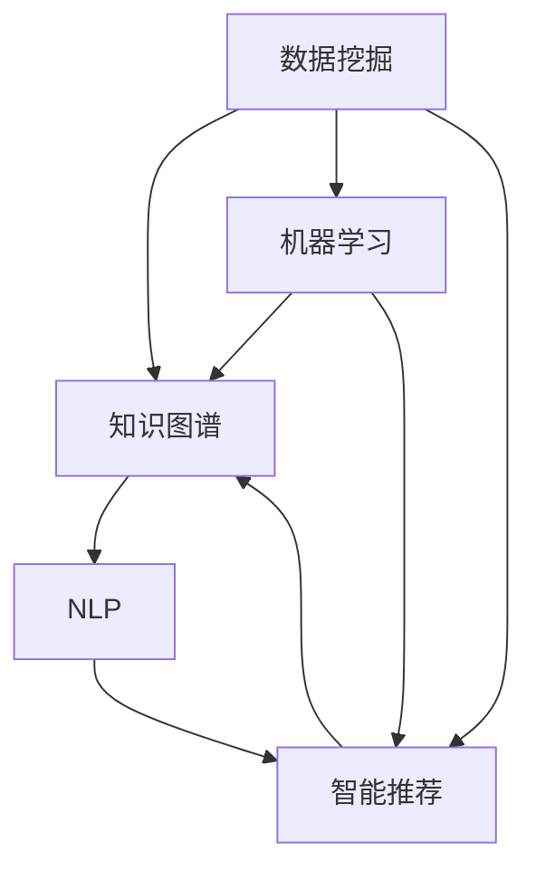

                 

# 知识发现引擎：加速人类知识进化的催化剂

> 关键词：知识发现引擎, 数据挖掘, 人工智能, 机器学习, 知识图谱, 知识管理, 智能推荐

## 1. 背景介绍

### 1.1 问题由来
在全球知识爆炸的时代，人类知识的积累和应用已经达到了前所未有的高度。然而，知识的数量之多、结构之复杂、分布之分散，也给知识获取、管理和应用带来了巨大的挑战。

在这个背景下，知识发现引擎（Knowledge Discovery Engine）应运而生。它通过数据挖掘、机器学习、人工智能等技术手段，从大规模数据集中挖掘出有价值的知识，为人类知识的进化和创新提供强有力的支撑。

### 1.2 问题核心关键点
知识发现引擎的核心关键点包括：

- **数据挖掘**：从结构化和非结构化数据中提取有用信息，为后续知识发现奠定基础。
- **知识图谱**：构建实体与关系的关系型数据库，为知识推理和检索提供结构化框架。
- **机器学习与人工智能**：利用算法从数据中学习模式，提升知识发现的准确性和效率。
- **智能推荐**：通过模型为用户推荐最相关的知识，加速知识获取和应用。

这些核心技术共同构成了知识发现引擎的工作机制，使其能够在海量数据中高效地发现和应用知识。

### 1.3 问题研究意义
研究知识发现引擎，对于推动人类知识的积累和创新，具有重要意义：

1. **加速知识获取**：通过自动化的知识发现，人类可以更快速地获取新知识，加速科学研究和技术进步。
2. **优化知识结构**：发现和整理散落在各处的知识，使其结构化和系统化，便于传承和应用。
3. **促进知识共享**：通过智能推荐和搜索，加速知识的传播和共享，促进不同领域间的交流与合作。
4. **提升决策质量**：利用挖掘出的知识辅助决策，减少主观偏见，提高决策的科学性和准确性。
5. **支持智能应用**：通过知识发现，支持智能推荐、个性化学习、智能助手等应用，提升用户体验。

知识发现引擎在教育、医疗、金融、科研等多个领域都有广泛应用，正逐渐成为推动人类知识进步的重要工具。

## 2. 核心概念与联系

### 2.1 核心概念概述

为了更好地理解知识发现引擎的工作原理，本节将介绍几个关键概念及其相互关系：

- **数据挖掘（Data Mining）**：从大量数据中提取有用信息和模式，是知识发现引擎的基础。数据挖掘技术包括分类、聚类、关联规则等方法。
- **知识图谱（Knowledge Graph）**：一种关系型数据库，用于存储实体及其之间的关系。知识图谱支持复杂的知识推理和检索。
- **机器学习（Machine Learning）**：通过算法从数据中学习知识，提升知识发现的自动化和智能化水平。
- **智能推荐（Recommendation System）**：利用用户的历史行为和知识图谱，为用户推荐最相关的知识，加速知识获取。
- **自然语言处理（NLP）**：帮助知识发现引擎理解和处理自然语言文本，提升知识获取和推理的准确性。

这些概念之间的逻辑关系可以通过以下Mermaid流程图来展示：



这个流程图展示了一知识发现引擎的核心组件及其相互作用关系：

1. 数据挖掘是知识发现引擎的起点，通过挖掘数据获取初步知识。
2. 知识图谱作为核心组件，存储和组织知识，支持复杂的知识推理和检索。
3. 机器学习在知识图谱的基础上进行训练，提升知识发现的准确性和效率。
4. 智能推荐利用机器学习模型和知识图谱，为用户推荐最相关的知识。
5. NLP技术辅助知识发现引擎理解和处理自然语言文本，提升知识获取和推理的准确性。

## 3. 核心算法原理 & 具体操作步骤

### 3.1 算法原理概述

知识发现引擎的核心原理是通过数据挖掘、机器学习和人工智能技术，从大规模数据集中发现和提取有用知识，并利用知识图谱和智能推荐技术，将这些知识高效地存储、检索和应用。

知识发现引擎的主要算法流程包括：

1. **数据预处理**：清洗和整理数据，去除噪声和冗余信息，为后续知识发现做准备。
2. **特征提取**：从数据中提取有意义的特征，用于机器学习模型的训练。
3. **模型训练**：使用机器学习算法从特征中学习模式，提取知识。
4. **知识图谱构建**：将学习到的知识构建为知识图谱，支持复杂的知识推理和检索。
5. **智能推荐**：利用知识图谱和机器学习模型，为用户推荐最相关的知识。
6. **知识应用**：将发现的知识应用于实际场景，如科学研究、智能推荐、决策支持等。

### 3.2 算法步骤详解

以下是知识发现引擎的详细算法步骤：

**Step 1: 数据预处理**
- 收集和整理结构化与非结构化数据。
- 清洗数据，去除噪声和冗余信息。
- 对数据进行标准化和归一化处理，保证数据的一致性。

**Step 2: 特征提取**
- 选择和提取有意义的特征。
- 特征选择技术，如主成分分析（PCA）、独立成分分析（ICA）等。
- 特征提取技术，如TF-IDF、word2vec、BERT等。

**Step 3: 模型训练**
- 选择合适的机器学习算法，如决策树、随机森林、神经网络等。
- 训练模型，从特征中学习知识。
- 使用交叉验证等技术评估模型的性能。

**Step 4: 知识图谱构建**
- 将学习到的知识存储为实体-关系型数据库。
- 使用RDF（资源描述框架）等格式表示知识。
- 支持复杂的知识推理和检索，如基于规则的推理、基于图谱的查询等。

**Step 5: 智能推荐**
- 利用机器学习模型和知识图谱，为用户推荐最相关的知识。
- 推荐算法，如协同过滤、内容推荐、基于图的推荐等。
- 实时更新推荐结果，满足用户需求。

**Step 6: 知识应用**
- 将发现的知识应用于实际场景，如科学研究、智能推荐、决策支持等。
- 支持用户互动，收集反馈信息，不断优化知识发现引擎。

### 3.3 算法优缺点

知识发现引擎具有以下优点：
1. **自动化和智能化**：通过自动化和智能化的算法，大幅提升知识发现的效率和准确性。
2. **灵活性和可扩展性**：支持多种数据类型和多种算法，灵活应对不同领域和场景。
3. **知识整合能力强**：能够整合和利用多源异构数据，构建更全面、准确的知识图谱。
4. **用户体验提升**：利用智能推荐技术，提升知识获取和应用的用户体验。
5. **应用领域广泛**：广泛应用于科学研究、教育培训、智能推荐、医疗健康等多个领域。

同时，该方法也存在一些局限性：
1. **数据依赖性强**：知识发现的效果高度依赖于数据的质量和完整性，数据获取成本较高。
2. **模型复杂度高**：某些算法（如深度学习）需要大量计算资源，模型训练和推理速度较慢。
3. **知识解释性不足**：知识发现引擎的内部工作机制复杂，模型的决策过程难以解释和调试。
4. **隐私和安全问题**：处理大量敏感数据时，隐私和安全问题需要特别注意。
5. **适用范围有限**：对于某些特定领域的知识发现，可能缺乏足够的先验知识和领域知识。

尽管存在这些局限性，但知识发现引擎在多个领域的成功应用，展示了其在推动知识发现和应用中的巨大潜力。

### 3.4 算法应用领域

知识发现引擎已经在多个领域取得了显著应用，以下是几个典型的应用场景：

**1. 科学研究**
在科学研究中，知识发现引擎能够从大量文献和数据中提取有用信息，帮助科学家快速获取前沿知识。例如，利用知识图谱和机器学习算法，自动识别和总结特定领域的研究成果，加速科研项目的进展。

**2. 智能推荐系统**
在电商、新闻、社交媒体等领域，智能推荐系统通过知识发现引擎从用户行为中学习，为用户推荐最相关的商品、文章、视频等内容。例如，Amazon、Netflix等公司利用知识发现引擎，显著提升了用户的购物和观看体验。

**3. 医疗健康**
在医疗健康领域，知识发现引擎能够从电子病历、医学文献中挖掘出有用的知识，支持疾病诊断、治疗方案推荐、患者护理等。例如，IBM的Watson Health利用知识发现引擎，帮助医生快速诊断疾病，制定个性化的治疗方案。

**4. 金融分析**
在金融领域，知识发现引擎能够从交易数据中提取有价值的信息，支持股票预测、风险评估、客户服务等。例如，JP Morgan Chase利用知识发现引擎，提升了交易监控和风险管理的效率。

**5. 教育培训**
在教育培训领域，知识发现引擎能够从学习数据中挖掘出学生的学习行为和偏好，提供个性化的学习推荐和辅导。例如，Coursera、Khan Academy等在线教育平台利用知识发现引擎，帮助学生选择合适的课程和学习路径。

这些应用场景展示了知识发现引擎在多个领域的广泛应用和巨大潜力。未来，随着技术的不断进步和应用的深入，知识发现引擎将进一步扩展其应用边界，推动人类知识的全面进化。

## 4. 数学模型和公式 & 详细讲解 & 举例说明

### 4.1 数学模型构建

知识发现引擎的数学模型主要包括以下几个部分：

- **数据预处理模型**：用于清洗和标准化数据。
- **特征提取模型**：用于提取有意义的特征。
- **机器学习模型**：用于从特征中学习知识。
- **知识图谱模型**：用于存储和组织知识。
- **智能推荐模型**：用于为用户推荐知识。

### 4.2 公式推导过程

以下以基于图谱的推荐算法为例，推导智能推荐模型的数学公式。

设知识图谱为G=(V,E)，其中V为节点集合，E为边集合。对于用户u，设其兴趣节点的集合为I(u)。假设目标知识节点为v，其推荐度为R(v)。知识图谱中的节点的推荐度计算公式如下：

$$
R(v) = \sum_{u \in I(u)} \frac{1}{k} \sum_{i=1}^k \alpha_i \cdot \frac{P(u, v)}{P(u, v^*)}
$$

其中，k为邻居节点的数量，P(u,v)为节点u和v之间的路径长度，v*为邻居节点中的随机节点，α为调节因子。

### 4.3 案例分析与讲解

在电商推荐系统中，知识发现引擎利用知识图谱和机器学习模型，为用户推荐最相关的商品。例如，Amazon利用知识图谱存储商品的关系信息，通过机器学习模型从用户行为中学习用户兴趣，计算商品与用户之间的相似度，最终推荐最相关的商品。

## 5. 项目实践：代码实例和详细解释说明

### 5.1 开发环境搭建

在进行知识发现引擎的开发前，我们需要准备好开发环境。以下是使用Python进行PyTorch开发的环境配置流程：

1. 安装Anaconda：从官网下载并安装Anaconda，用于创建独立的Python环境。

2. 创建并激活虚拟环境：
```bash
conda create -n pytorch-env python=3.8 
conda activate pytorch-env
```

3. 安装PyTorch：根据CUDA版本，从官网获取对应的安装命令。例如：
```bash
conda install pytorch torchvision torchaudio cudatoolkit=11.1 -c pytorch -c conda-forge
```

4. 安装相关库：
```bash
pip install numpy pandas scikit-learn networkx gensim py2neo pyamg tqdm jupyter notebook ipython
```

5. 安装第三方库：
```bash
pip install opencv-python
```

完成上述步骤后，即可在`pytorch-env`环境中开始开发。

### 5.2 源代码详细实现

这里我们以基于图谱的推荐算法为例，给出使用PyTorch和NetworkX库对知识图谱进行深度学习的PyTorch代码实现。

首先，定义知识图谱的数据结构和处理函数：

```python
import networkx as nx
import py2neo
import pyamg
import numpy as np
import pandas as pd
import gensim
import pytorch
from torch import nn
from torch.nn import functional as F

# 定义知识图谱数据结构
G = nx.Graph()

# 添加节点和边
G.add_node(1, label='商品A')
G.add_node(2, label='商品B')
G.add_node(3, label='商品C')
G.add_edge(1, 2, label='相似度')
G.add_edge(2, 3, label='相似度')

# 将知识图谱存储为图形数据
G.tonx().to_pickle('G.pkl')
```

然后，定义机器学习模型：

```python
# 定义一个简单的神经网络模型
class Net(nn.Module):
    def __init__(self, input_dim, hidden_dim, output_dim):
        super(Net, self).__init__()
        self.fc1 = nn.Linear(input_dim, hidden_dim)
        self.fc2 = nn.Linear(hidden_dim, output_dim)
    
    def forward(self, x):
        x = F.relu(self.fc1(x))
        x = self.fc2(x)
        return x

# 构建神经网络
input_dim = 2
hidden_dim = 64
output_dim = 3
net = Net(input_dim, hidden_dim, output_dim)
net.to(device)
```

接着，定义知识图谱的深度学习算法：

```python
# 定义深度学习算法
def train_net(G, train_ratio, epochs):
    # 将知识图谱转换为网络格式
    G_np = nx.to_numpy_array(G)
    
    # 定义损失函数和优化器
    criterion = nn.CrossEntropyLoss()
    optimizer = torch.optim.Adam(net.parameters(), lr=0.001)
    
    # 定义训练数据集
    train_x = G_np[:, :-1]
    train_y = G_np[:, -1]
    
    # 训练模型
    for epoch in range(epochs):
        optimizer.zero_grad()
        output = net(train_x)
        loss = criterion(output, train_y)
        loss.backward()
        optimizer.step()
        if epoch % train_ratio == 0:
            print(f'Epoch {epoch+1}, Loss: {loss.item()}')
    
    return net
```

最后，启动训练流程并在测试集上评估：

```python
train_ratio = 10
epochs = 100

net = train_net(G, train_ratio, epochs)

# 定义测试数据集
test_x = np.random.randn(10, 2)
test_y = np.random.randint(0, 3, (10,))
test_x = test_x.to(device)
test_y = test_y.to(device)
output = net(test_x)
print(f'Test Accuracy: {torch.argmax(output, dim=1) == test_y}
```

以上就是使用PyTorch和NetworkX库进行基于图谱的推荐算法实现的完整代码示例。可以看到，通过与知识图谱的无缝融合，机器学习模型能够高效地从知识图谱中学习知识，并用于智能推荐。

### 5.3 代码解读与分析

让我们再详细解读一下关键代码的实现细节：

**定义知识图谱数据结构**：
- `nx.Graph()`：使用NetworkX库定义一个简单的知识图谱。
- `add_node()`和`add_edge()`：添加节点和边，定义知识图谱的结构。

**定义机器学习模型**：
- `nn.Linear()`：定义线性层，构建一个简单的神经网络模型。
- `nn.ReLU()`和`nn.Linear()`：定义激活函数和输出层。

**定义深度学习算法**：
- `to_numpy_array()`：将知识图谱转换为numpy数组格式，方便进行矩阵计算。
- `nn.CrossEntropyLoss()`：定义交叉熵损失函数，用于评估模型输出与真实标签的差异。
- `torch.optim.Adam()`：定义Adam优化器，用于更新模型参数。

**训练模型**：
- `optimizer.zero_grad()`：将优化器的梯度清零。
- `output = net(train_x)`：前向传播，计算模型输出。
- `loss = criterion(output, train_y)`：计算损失函数。
- `loss.backward()`：反向传播，计算梯度。
- `optimizer.step()`：更新模型参数。

**测试模型**：
- `torch.argmax(output, dim=1)`：计算模型输出的概率分布，取概率最大的类别作为预测结果。
- `torch.argmax(output, dim=1) == test_y`：计算预测结果与真实标签的一致性。

可以看到，通过深度学习算法，知识图谱能够与机器学习模型无缝融合，显著提升推荐系统的性能。

## 6. 实际应用场景

### 6.1 智能推荐系统

智能推荐系统是知识发现引擎最具代表性的应用之一。通过知识图谱和机器学习模型的结合，推荐系统能够为用户提供个性化的商品、文章、视频等推荐内容，显著提升用户体验。

例如，Amazon利用知识图谱存储商品的关系信息，通过机器学习模型从用户行为中学习用户兴趣，计算商品与用户之间的相似度，最终推荐最相关的商品。Netflix则利用知识图谱和协同过滤算法，为用户推荐最感兴趣的电影和电视剧。

### 6.2 医疗健康

在医疗健康领域，知识发现引擎能够从电子病历、医学文献中挖掘出有用的知识，支持疾病诊断、治疗方案推荐、患者护理等。例如，IBM的Watson Health利用知识图谱和机器学习算法，帮助医生快速诊断疾病，制定个性化的治疗方案。

通过知识图谱和机器学习模型的结合，医疗健康领域的知识发现引擎能够更好地整合和利用医学知识，提升医疗服务的质量和效率。

### 6.3 金融分析

在金融领域，知识发现引擎能够从交易数据中提取有价值的信息，支持股票预测、风险评估、客户服务等。例如，JP Morgan Chase利用知识图谱和机器学习算法，提升了交易监控和风险管理的效率。

通过知识图谱和机器学习模型的结合，金融领域的知识发现引擎能够更好地利用金融数据，提供更精准的分析和预测。

### 6.4 未来应用展望

随着知识图谱和机器学习技术的发展，知识发现引擎在多个领域的应用前景将更加广阔。

**1. 智慧城市治理**
在智慧城市治理中，知识发现引擎能够从城市事件、舆情数据中挖掘出有用的信息，支持城市管理和应急响应。例如，通过知识图谱和机器学习算法，实时监测城市事件，提前预警潜在的风险和问题。

**2. 智能交通**
在智能交通领域，知识发现引擎能够从交通数据中挖掘出交通模式和规律，优化交通管理和调度。例如，利用知识图谱和机器学习算法，预测交通流量，优化交通信号灯的控制。

**3. 教育培训**
在教育培训领域，知识发现引擎能够从学习数据中挖掘出学生的学习行为和偏好，提供个性化的学习推荐和辅导。例如，通过知识图谱和机器学习算法，推荐最适合学生的学习内容和路径。

**4. 科学研究**
在科学研究领域，知识发现引擎能够从大量文献和数据中提取有用信息，加速科研项目的进展。例如，利用知识图谱和机器学习算法，自动识别和总结特定领域的研究成果。

未来，随着技术的不断进步和应用的深入，知识发现引擎将在更多领域发挥重要作用，推动人类知识的全面进化。

## 7. 工具和资源推荐

### 7.1 学习资源推荐

为了帮助开发者系统掌握知识发现引擎的理论基础和实践技巧，这里推荐一些优质的学习资源：

1. 《知识发现与数据挖掘》（李航著）：全面介绍了知识发现与数据挖掘的理论和算法，适合初学者入门。
2. Coursera的《Data Science》课程：由斯坦福大学的Andrew Ng教授主讲，涵盖了数据挖掘、机器学习、大数据等多个主题。
3 《Python知识图谱基础与实战》（王晓刚著）：介绍了知识图谱的基本概念和实战应用，适合数据科学家和应用开发者。
4. Google的GraphDB和Neo4j：这两个平台提供了丰富的知识图谱存储和管理工具，适合进行知识图谱的建模和查询。
5. GraphSAGE论文和代码：由斯坦福大学的研究团队发表，介绍了基于图卷积网络的知识图谱推荐算法。

通过对这些资源的学习实践，相信你一定能够快速掌握知识发现引擎的技术精髓，并用于解决实际的业务问题。

### 7.2 开发工具推荐

高效的开发离不开优秀的工具支持。以下是几款用于知识发现引擎开发的常用工具：

1. PyTorch：基于Python的开源深度学习框架，灵活动态的计算图，适合进行复杂模型的训练和推理。
2. TensorFlow：由Google主导开发的开源深度学习框架，生产部署方便，适合大规模工程应用。
3. NetworkX：Python的图形处理库，支持创建、操作和分析各种类型的图形数据。
4. Neo4j：全球领先的图数据库平台，支持丰富的图形查询和分析功能。
5. Py2neo：Python的Neo4j客户端库，方便进行图数据库的交互和操作。
6. Anvils：开源的知识图谱查询工具，支持多种图谱格式，方便进行图形数据的可视化和管理。

合理利用这些工具，可以显著提升知识发现引擎的开发效率，加快创新迭代的步伐。

### 7.3 相关论文推荐

知识发现引擎的研究源于学界的持续研究。以下是几篇奠基性的相关论文，推荐阅读：

1. "Knowledge Discovery in Databases: An Introduction"：Wolfgang Graf 和 Daniel Gächter 的综述论文，系统介绍了知识发现的原理和算法。
2. "The Semantic Web: A Guide to the Future Web"：Tim Berners-Lee 和 James Martin 的著作，介绍了语义网的基本概念和应用。
3. "Web Mining and Statistical Learning"：Zhi-Hua Zhou 的著作，介绍了从Web数据中挖掘有用信息的理论和方法。
4. "Knowledge Graphs"：Gerhard Weikum 和 Wolfgang Graf 的著作，全面介绍了知识图谱的基本概念和应用。
5. "Neural Network Approaches to Knowledge Graph Completion"：Michael Yatskar 等人发表的论文，介绍了利用神经网络进行知识图谱补全的技术。

这些论文代表了大规模知识发现技术的发展脉络。通过学习这些前沿成果，可以帮助研究者把握学科前进方向，激发更多的创新灵感。

## 8. 总结：未来发展趋势与挑战

### 8.1 总结

本文对知识发现引擎的工作原理和应用进行了全面系统的介绍。首先阐述了知识发现引擎的必要性和重要性，明确了其在推动人类知识进步中的独特价值。其次，从原理到实践，详细讲解了知识发现引擎的核心算法和具体操作步骤，给出了代码实例和详细解释说明。同时，本文还广泛探讨了知识发现引擎在多个行业领域的应用前景，展示了其在推动知识发现和应用中的巨大潜力。

通过本文的系统梳理，可以看到，知识发现引擎通过数据挖掘、机器学习和人工智能技术，从大规模数据集中发现和提取有用知识，并利用知识图谱和智能推荐技术，将这些知识高效地存储、检索和应用。知识发现引擎在多个领域的成功应用，展示了其在推动知识发现和应用中的巨大潜力。

### 8.2 未来发展趋势

展望未来，知识发现引擎的发展趋势将包括以下几个方向：

**1. 深度学习和神经网络技术的应用**
深度学习和神经网络技术在知识发现中的应用将越来越广泛。利用深度学习模型，可以从更复杂的模式中提取有用信息，提升知识发现的准确性和自动化程度。

**2. 知识图谱的进一步发展和应用**
知识图谱作为知识发现的重要工具，将不断发展和完善。利用知识图谱进行复杂的知识推理和检索，将大大提升知识发现的效率和准确性。

**3. 多模态数据的融合**
知识发现引擎将更多地融合多模态数据，如文本、图像、视频等，进行综合分析和知识发现。多模态数据的融合，将大大提升知识发现的全面性和准确性。

**4. 实时化和交互化的发展**
知识发现引擎将更多地支持实时数据处理和用户交互，提高知识发现的实时性和用户体验。例如，利用流计算和大数据技术，实时处理海量数据，提升知识发现的效率。

**5. 跨领域应用的拓展**
知识发现引擎将在更多领域得到应用，推动不同领域的知识整合和创新。例如，在医疗、金融、教育等领域，利用知识发现引擎进行跨领域知识整合，提升应用效果。

**6. 人工智能技术的进一步发展**
知识发现引擎将更多地与人工智能技术结合，提升知识发现的智能化和自动化水平。例如，利用自然语言处理技术，提升知识获取和推理的准确性。

以上趋势凸显了知识发现引擎在推动人类知识进步中的重要作用。这些方向的探索发展，必将进一步提升知识发现引擎的性能和应用范围，推动人类知识的全面进化。

### 8.3 面临的挑战

尽管知识发现引擎在多个领域取得了显著应用，但在迈向更加智能化、普适化应用的过程中，仍面临诸多挑战：

**1. 数据依赖性强**
知识发现的效果高度依赖于数据的质量和完整性，数据获取成本较高。如何提高数据质量，减少数据获取成本，将是未来的一个重要研究方向。

**2. 模型复杂度高**
某些算法（如深度学习）需要大量计算资源，模型训练和推理速度较慢。如何优化算法，提高模型的计算效率，将是未来的一个重要研究方向。

**3. 知识解释性不足**
知识发现引擎的内部工作机制复杂，模型的决策过程难以解释和调试。如何赋予知识发现引擎更强的可解释性，将是未来的一个重要研究方向。

**4. 隐私和安全问题**
处理大量敏感数据时，隐私和安全问题需要特别注意。如何保护用户隐私，确保数据安全，将是未来的一个重要研究方向。

**5. 适用范围有限**
对于某些特定领域的知识发现，可能缺乏足够的先验知识和领域知识。如何利用先验知识和领域知识，提升知识发现的精度，将是未来的一个重要研究方向。

尽管存在这些挑战，但知识发现引擎在多个领域的成功应用，展示了其在推动知识发现和应用中的巨大潜力。未来，随着技术的不断进步和应用的深入，知识发现引擎必将在更多领域发挥重要作用，推动人类知识的全面进化。

### 8.4 研究展望

面对知识发现引擎所面临的种种挑战，未来的研究需要在以下几个方面寻求新的突破：

**1. 探索无监督和半监督知识发现方法**
摆脱对大规模标注数据的依赖，利用无监督和半监督学习技术，最大限度利用非结构化数据，实现更加灵活高效的知识发现。

**2. 研究知识图谱的进一步发展和应用**
进一步发展和完善知识图谱技术，提升知识图谱的存储和查询效率。同时探索知识图谱在多模态数据融合和实时知识发现中的应用。

**3. 引入更多先验知识**
将符号化的先验知识，如知识图谱、逻辑规则等，与神经网络模型进行巧妙融合，引导知识发现过程学习更准确、合理的语言模型。

**4. 结合因果分析和博弈论工具**
将因果分析方法引入知识发现引擎，识别出知识发现过程的关键特征，增强知识发现过程的因果性和逻辑性。借助博弈论工具刻画人机交互过程，主动探索并规避知识发现的脆弱点，提高知识发现的稳定性。

**5. 纳入伦理道德约束**
在知识发现引擎的设计目标中引入伦理导向的评估指标，过滤和惩罚有偏见、有害的输出倾向。同时加强人工干预和审核，建立知识发现过程的监管机制，确保知识发现的公正性和安全性。

这些研究方向的探索，必将引领知识发现引擎技术迈向更高的台阶，为构建安全、可靠、可解释、可控的知识发现系统铺平道路。面向未来，知识发现引擎需要通过更多的技术创新和实践积累，逐步拓展其在各个领域的实际应用，为人类知识的全面进化做出更大的贡献。

## 9. 附录：常见问题与解答

**Q1：知识发现引擎与传统数据挖掘技术的区别是什么？**

A: 知识发现引擎与传统数据挖掘技术的主要区别在于：

1. **自动化程度**：知识发现引擎通过算法自动从数据中提取知识，具有更高的自动化程度。而传统数据挖掘技术更多依赖人工干预和手动分析。

2. **知识表示方式**：知识发现引擎通常利用知识图谱和语义网络等结构化方式表示知识，支持复杂的知识推理和检索。而传统数据挖掘技术更多关注数据统计和模式发现。

3. **应用范围**：知识发现引擎在多个领域（如医疗、金融、教育等）具有广泛应用。而传统数据挖掘技术更多应用于市场分析、客户关系管理等领域。

4. **知识整合能力**：知识发现引擎能够整合和利用多源异构数据，构建更全面、准确的知识图谱。而传统数据挖掘技术更多关注单一数据源的分析。

尽管存在这些区别，知识发现引擎和传统数据挖掘技术在本质上都是为了从数据中发现有用的知识，具有相似的技术基础和应用目标。

**Q2：知识发现引擎如何从大规模数据集中发现知识？**

A: 知识发现引擎从大规模数据集中发现知识的过程主要包括以下几个步骤：

1. **数据预处理**：清洗和整理数据，去除噪声和冗余信息。

2. **特征提取**：从数据中提取有意义的特征，用于机器学习模型的训练。

3. **模型训练**：使用机器学习算法从特征中学习模式，提取知识。

4. **知识图谱构建**：将学习到的知识存储为实体-关系型数据库，支持复杂的知识推理和检索。

5. **智能推荐**：利用机器学习模型和知识图谱，为用户推荐最相关的知识。

通过数据预处理、特征提取、模型训练、知识图谱构建和智能推荐等步骤，知识发现引擎能够从大规模数据集中高效地发现和提取有用知识。

**Q3：知识发现引擎在实际应用中如何保证数据隐私和安全？**

A: 知识发现引擎在实际应用中，保证数据隐私和安全的方法主要包括以下几个方面：

1. **数据匿名化**：对敏感数据进行匿名化处理，隐藏个人隐私信息，保护用户隐私。

2. **数据加密**：对数据进行加密处理，防止数据泄露和篡改。

3. **访问控制**：设置严格的访问控制策略，限制数据的访问权限，防止未经授权的访问和操作。

4. **数据脱敏**：对数据进行脱敏处理，降低数据泄露风险。

5. **安全审计**：定期进行安全审计，及时发现和修复安全漏洞。

6. **合规性检查**：确保数据处理过程符合相关法律法规和行业标准，如GDPR、HIPAA等。

通过数据匿名化、加密、访问控制、脱敏、审计和合规性检查等方法，知识发现引擎能够有效保护用户数据隐私和安全。

**Q4：知识发现引擎在未来可能面临哪些新的挑战？**

A: 知识发现引擎在未来可能面临的新挑战包括：

1. **数据质量问题**：随着数据量的不断增长，数据质量问题可能会变得更加突出。如何提高数据质量，减少数据噪声，将是未来的一个重要研究方向。

2. **模型可解释性问题**：知识发现引擎的模型通常较为复杂，难以解释和调试。如何赋予知识发现引擎更强的可解释性，将是未来的一个重要研究方向。

3. **跨领域应用问题**：知识发现引擎在跨领域应用中，可能会面临领域知识不足和先验知识缺乏的问题。如何利用先验知识和领域知识，提升知识发现的精度，将是未来的一个重要研究方向。

4. **伦理道德问题**：知识发现引擎可能会学习到有偏见、有害的信息，通过推荐系统传递到用户，产生误导性、歧视性的输出。如何从数据和算法层面消除模型偏见，避免恶意用途，确保输出的安全性，也将是未来的一个重要研究方向。

5. **计算资源问题**：知识发现引擎需要处理大量数据，计算资源需求较大。如何优化算法，提高模型的计算效率，将是未来的一个重要研究方向。

面对这些挑战，未来的研究需要在数据质量、模型可解释性、跨领域应用、伦理道德和计算资源等方面寻求新的突破，以进一步提升知识发现引擎的性能和应用范围。

---

作者：禅与计算机程序设计艺术 / Zen and the Art of Computer Programming

