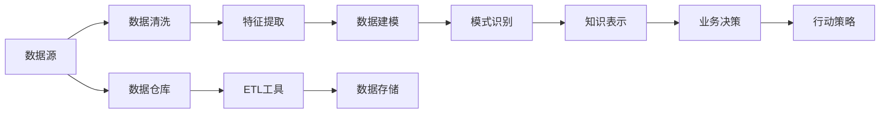

                 

# 知识发现引擎：助力企业决策的智慧引擎

## 1. 背景介绍

在数字化转型的浪潮下，企业面临的决策环境日益复杂多变，传统的经验驱动决策模式已难以满足需求。知识发现引擎作为智能决策的智慧引擎，通过从海量数据中提取有价值的知识，辅助企业快速识别机会、预测趋势、优化运营，实现智能决策。本文将深入剖析知识发现引擎的核心原理、关键技术及应用实践，揭示其在助力企业决策方面的巨大潜力。

### 1.1 问题由来

随着大数据技术的普及，企业在经营过程中积累了大量结构化和非结构化数据。这些数据蕴含着丰富的商业洞察和知识，但直接挖掘却非常困难。传统的决策支持系统往往依赖人工经验和手工报表，效率低下且易出错。而知识发现引擎通过自动化的数据挖掘和分析，可以更高效地从海量数据中提取有价值的商业知识，辅助企业做出科学决策。

在零售、金融、医疗、物流等众多领域，知识发现引擎已经展示了其巨大的价值。以零售行业为例，通过分析销售数据、消费者行为、市场趋势等，企业能够及时调整商品结构、优化库存管理、制定精准营销策略，从而提升整体经营效率和盈利能力。

### 1.2 问题核心关键点

知识发现引擎的核心在于其能够自动从数据中提取商业知识。关键点包括以下几个方面：

- **数据源多样化**：知识发现引擎需要处理多种类型的数据，包括结构化数据（如数据库、报表）和非结构化数据（如文本、图片）。
- **高效算法**：需要设计高效的数据挖掘和模式识别算法，从数据中提取出有价值的商业知识。
- **可解释性强**：知识发现引擎的输出应具有较好的可解释性，方便业务人员理解和使用。
- **应用灵活**：应能够灵活应用于不同业务场景，如市场预测、风险评估、供应链优化等。
- **自适应学习**：应具备自适应学习能力，能够不断学习新数据和新业务模式。

本文将系统介绍知识发现引擎的核心概念、核心算法、实际应用场景等，深入探讨其在企业决策中的重要作用。

## 2. 核心概念与联系

### 2.1 核心概念概述

知识发现引擎融合了数据挖掘、机器学习、统计分析等多种技术手段，通过自动化挖掘数据中的潜在知识，辅助企业决策。其核心概念包括：

- **数据挖掘(Data Mining)**：从数据中发现有趣、有用、新颖的模式和规律。
- **机器学习(Machine Learning)**：通过训练模型，发现数据中的模式和规律，并用于预测和分类。
- **统计分析(Statistical Analysis)**：运用统计学方法对数据进行分析和推理，揭示数据间的内在关系。
- **知识表示(Knowledge Representation)**：将发现的知识转化为易于理解和应用的形式，如规则、图谱等。

### 2.2 核心概念原理和架构的 Mermaid 流程图



此图展示了知识发现引擎的基本流程：从数据源开始，经过清洗、特征提取、建模、识别、表示等步骤，最终形成辅助业务决策的行动策略。

## 3. 核心算法原理 & 具体操作步骤

### 3.1 算法原理概述

知识发现引擎的核心算法包括数据预处理、特征提取、数据建模、模式识别和知识表示等。其核心原理是通过自动化方法从数据中提取有价值的商业知识，辅助决策。

### 3.2 算法步骤详解

#### 3.2.1 数据预处理

数据预处理是知识发现的基础，其目的是将原始数据转换为适合进一步分析的形式。主要步骤包括：

- **数据清洗**：去除噪音数据和异常值，保证数据质量。
- **数据归一化**：将数据按照一定的规则进行转换，使得数据具有更好的可比性和可分析性。
- **缺失值处理**：对缺失值进行填补或删除，确保数据完整性。

#### 3.2.2 特征提取

特征提取是从原始数据中提取出对决策有帮助的特征。常用的特征提取方法包括：

- **统计特征提取**：通过统计学方法提取数据的分布、趋势、离散程度等特征。
- **文本特征提取**：从文本数据中提取出TF-IDF、Word2Vec等特征。
- **图像特征提取**：从图像数据中提取出HOG、CNN等特征。

#### 3.2.3 数据建模

数据建模是知识发现的关键步骤，通过训练模型，从数据中提取模式和规律。常用的建模方法包括：

- **回归分析**：用于预测数值型数据的趋势。
- **分类算法**：用于将数据分为不同的类别。
- **聚类算法**：用于将数据分为不同的群组。
- **关联规则**：用于发现数据之间的关联关系。

#### 3.2.4 模式识别

模式识别是从数据中识别出有价值的模式和规律。常用的模式识别方法包括：

- **关联规则挖掘**：用于发现数据之间的关联关系。
- **异常检测**：用于识别数据中的异常点和异常值。
- **时序模式挖掘**：用于发现时间序列数据中的规律。

#### 3.2.5 知识表示

知识表示是将挖掘出的知识转换为易于理解和应用的形式。常用的知识表示方法包括：

- **规则表示**：通过规则的形式表示知识，如IF-THEN规则。
- **图谱表示**：通过图谱的形式表示知识，如知识图谱。
- **本体表示**：通过本体的形式表示知识，如OWL本体。

### 3.3 算法优缺点

知识发现引擎的优点包括：

- **高效性**：自动化挖掘数据中的知识，提高了决策效率。
- **客观性**：避免了人为偏见和主观因素的影响，提高了决策的客观性。
- **灵活性**：能够灵活应用于多种业务场景。
- **可解释性**：输出结果具有较好的可解释性，方便业务人员理解和应用。

其缺点包括：

- **数据质量依赖**：知识发现的准确性很大程度上依赖于数据的质量和完整性。
- **算法复杂度**：某些算法（如深度学习）需要大量的计算资源。
- **知识解释性**：某些知识表示形式（如神经网络）难以解释，影响决策的可信度。

### 3.4 算法应用领域

知识发现引擎在多个领域中具有广泛的应用：

- **零售行业**：通过分析销售数据、消费者行为、市场趋势等，辅助企业制定精准营销策略、优化库存管理。
- **金融行业**：通过分析交易数据、客户行为、市场舆情等，辅助企业识别风险、优化投资组合、提升客户服务。
- **医疗行业**：通过分析病历数据、基因数据、药品数据等，辅助医生制定诊疗方案、优化药品研发流程。
- **制造业**：通过分析生产数据、设备运行数据、物流数据等，辅助企业优化生产流程、提高设备利用率、降低物流成本。
- **物流行业**：通过分析交通数据、仓库数据、配送数据等，辅助企业优化物流路线、提高配送效率、降低运输成本。

## 4. 数学模型和公式 & 详细讲解 & 举例说明

### 4.1 数学模型构建

知识发现引擎的数学模型主要包括回归模型、分类模型、聚类模型和关联规则模型等。以回归模型为例，其数学模型可以表示为：

$$
y = f(x) + \epsilon
$$

其中，$y$ 为目标变量，$x$ 为自变量，$f(x)$ 为模型函数，$\epsilon$ 为随机误差项。

### 4.2 公式推导过程

以线性回归模型为例，其最小二乘估计公式为：

$$
\hat{\beta} = (X^TX)^{-1}X^Ty
$$

其中，$\hat{\beta}$ 为模型参数，$X$ 为自变量矩阵，$y$ 为目标变量向量。

### 4.3 案例分析与讲解

假设某零售企业需要预测下季度的销售额，可以采用线性回归模型进行分析。首先，收集历史销售数据、季节性因素、促销活动等因素，建立数据集。然后，使用最小二乘法拟合线性回归模型，得到模型参数。最后，利用模型预测下季度的销售额。

## 5. 项目实践：代码实例和详细解释说明

### 5.1 开发环境搭建

为进行知识发现引擎的开发，需要安装Python、R、Pandas、NumPy、Scikit-learn等数据科学工具。以下是在Python环境中搭建开发环境的步骤：

1. 安装Python：从官网下载并安装Python。
2. 安装Pip：在终端中运行 `pip install pip` 安装Pip包管理器。
3. 安装数据科学工具：
   - 安装Pandas：`pip install pandas`
   - 安装NumPy：`pip install numpy`
   - 安装Scikit-learn：`pip install scikit-learn`
   - 安装TensorFlow：`pip install tensorflow`
   - 安装PyTorch：`pip install torch`

### 5.2 源代码详细实现

以下是一个简单的线性回归模型的代码实现：

```python
import pandas as pd
from sklearn.linear_model import LinearRegression

# 读取数据
data = pd.read_csv('sales_data.csv')

# 数据预处理
X = data[['season', 'promotion', 'weekday', 'holiday', 'weather']]
y = data['sales']

# 建立线性回归模型
model = LinearRegression()

# 训练模型
model.fit(X, y)

# 预测销售额
test_data = pd.read_csv('test_sales.csv')
test_X = test_data[['season', 'promotion', 'weekday', 'holiday', 'weather']]
pred_y = model.predict(test_X)
print(pred_y)
```

### 5.3 代码解读与分析

- `data.read_csv()` 函数用于读取数据文件，转换为DataFrame格式。
- `X` 和 `y` 分别为自变量和目标变量的数据矩阵和向量。
- `LinearRegression()` 函数用于建立线性回归模型。
- `model.fit(X, y)` 函数用于训练模型。
- `model.predict(test_X)` 函数用于对测试数据进行预测。

## 6. 实际应用场景

### 6.1 零售行业

在零售行业中，知识发现引擎可以帮助企业优化库存管理、制定精准营销策略、提升客户满意度。

- **库存管理**：通过分析历史销售数据和市场趋势，预测未来的销售量，优化库存水平。
- **精准营销**：通过分析消费者行为数据和购买记录，识别高价值客户，制定个性化营销策略。
- **客户满意度**：通过分析客户反馈和投诉数据，发现服务短板，提升客户满意度。

### 6.2 金融行业

在金融行业中，知识发现引擎可以帮助企业识别风险、优化投资组合、提升客户服务。

- **风险评估**：通过分析交易数据和市场舆情，识别潜在的风险点，优化投资组合。
- **投资组合**：通过分析历史交易数据和市场数据，制定最优投资组合策略。
- **客户服务**：通过分析客户行为数据和交易记录，提供个性化的金融服务。

### 6.3 医疗行业

在医疗行业中，知识发现引擎可以帮助医生制定诊疗方案、优化药品研发流程。

- **诊疗方案**：通过分析病历数据和基因数据，发现疾病的潜在风险因素，制定个性化的诊疗方案。
- **药品研发**：通过分析药物效果数据和基因数据，发现潜在的药物靶点，优化药品研发流程。

### 6.4 未来应用展望

知识发现引擎的未来发展趋势包括：

- **实时化**：实现实时数据挖掘和分析，满足快速决策的需求。
- **智能化**：结合人工智能技术，实现自动化、智能化的知识发现。
- **可视化**：提供更直观的知识发现结果，方便业务人员理解和应用。
- **集成化**：与其他系统集成，形成智能决策平台。
- **可解释性**：提高知识的可解释性，增强决策的透明度和可信度。

## 7. 工具和资源推荐

### 7.1 学习资源推荐

为了系统掌握知识发现引擎的知识，推荐以下学习资源：

- **《数据挖掘导论》**：详细介绍了数据挖掘的基本概念、算法和应用。
- **《机器学习实战》**：介绍了常用的机器学习算法和实战案例。
- **《Python数据科学手册》**：介绍了Python在数据科学中的应用。
- **Coursera《数据科学与统计分析》课程**：由斯坦福大学教授授课，系统介绍了数据科学的基本概念和应用。

### 7.2 开发工具推荐

常用的开发工具包括：

- **Jupyter Notebook**：基于Web的交互式编程环境，方便开发和协作。
- **R Studio**：R语言的集成开发环境，提供了丰富的数据科学工具。
- **PyCharm**：Python的IDE，支持多项目管理和调试。

### 7.3 相关论文推荐

以下是几篇重要的知识发现引擎相关论文，推荐阅读：

- **《数据挖掘技术及其应用》**：介绍了数据挖掘的基本概念、算法和应用。
- **《深度学习在数据挖掘中的应用》**：介绍了深度学习在数据挖掘中的应用。
- **《K-means算法的改进与优化》**：介绍了K-means算法的改进和优化方法。

## 8. 总结：未来发展趋势与挑战

### 8.1 研究成果总结

知识发现引擎作为企业智能决策的智慧引擎，已经取得了显著的成果。其在零售、金融、医疗等领域的应用，显著提升了企业的决策效率和盈利能力。

### 8.2 未来发展趋势

知识发现引擎的未来发展趋势包括：

- **实时化**：实现实时数据挖掘和分析，满足快速决策的需求。
- **智能化**：结合人工智能技术，实现自动化、智能化的知识发现。
- **可视化**：提供更直观的知识发现结果，方便业务人员理解和应用。
- **集成化**：与其他系统集成，形成智能决策平台。
- **可解释性**：提高知识的可解释性，增强决策的透明度和可信度。

### 8.3 面临的挑战

知识发现引擎在发展过程中面临的挑战包括：

- **数据质量依赖**：知识发现的准确性很大程度上依赖于数据的质量和完整性。
- **算法复杂度**：某些算法（如深度学习）需要大量的计算资源。
- **知识解释性**：某些知识表示形式（如神经网络）难以解释，影响决策的可信度。

### 8.4 研究展望

未来，知识发现引擎需要在以下几个方面进行研究：

- **多源数据融合**：将多种数据源进行融合，形成统一的数据平台。
- **知识自动化发现**：实现自动化的知识发现过程，减少人工干预。
- **知识集成与重用**：将不同来源的知识进行集成，实现知识的重用。
- **知识演化与更新**：实现知识库的动态更新，保持知识的的时效性。

## 9. 附录：常见问题与解答

**Q1: 数据质量对知识发现结果有哪些影响？**

A: 数据质量对知识发现结果有重要影响。数据中的噪音、异常值和不完整性都会影响挖掘结果的准确性和可靠性。

**Q2: 如何评估知识发现模型的性能？**

A: 知识发现模型的性能评估包括准确率、召回率、F1值等指标。对于分类问题，可以使用混淆矩阵来评估模型的表现。

**Q3: 知识发现引擎如何与业务系统集成？**

A: 知识发现引擎可以通过API接口与业务系统集成，将挖掘结果提供给业务系统进行决策支持。

**Q4: 知识发现引擎是否适用于所有业务场景？**

A: 知识发现引擎适用于多种业务场景，但需要根据具体的业务需求和数据特征进行定制化开发。

**Q5: 知识发现引擎如何提升企业决策效率？**

A: 知识发现引擎通过自动化挖掘数据中的知识，辅助决策者快速识别机会、预测趋势、优化运营，从而提升企业决策效率。

---

作者：禅与计算机程序设计艺术 / Zen and the Art of Computer Programming

