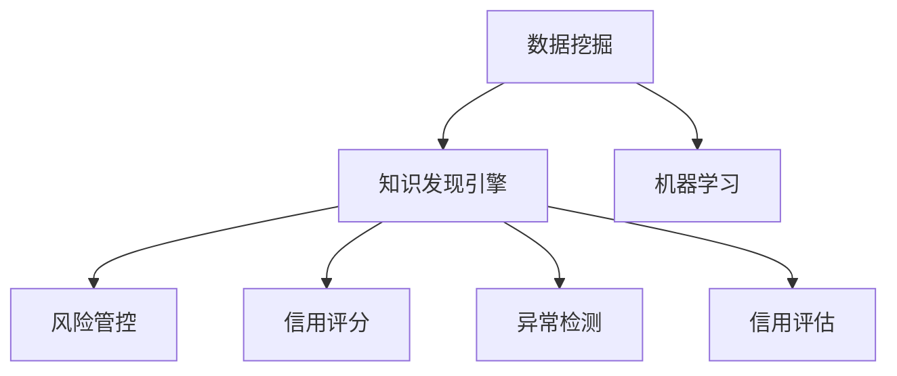
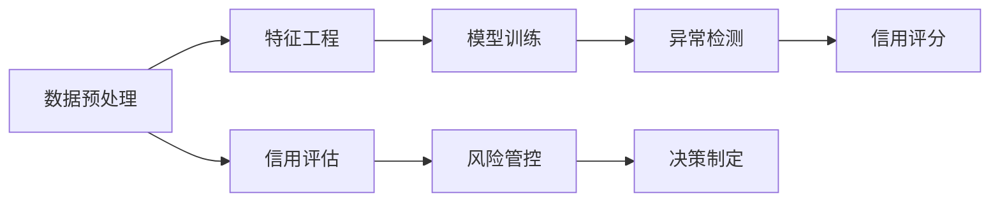

                 

# 知识发现引擎：助力金融行业的风险管控

> 关键词：知识发现引擎, 风险管控, 金融行业, 信用评分, 数据挖掘, 机器学习, 异常检测, 信用评估

## 1. 背景介绍

在金融行业中，风险管控是保证业务稳定运行、保障客户利益、维护机构声誉的关键任务。传统上，金融机构依赖人工分析、规则引擎等方式进行风险识别和评估。但随着数据量的激增和业务场景的复杂化，人工处理已无法满足高效率、高准确率的需求。因此，构建知识发现引擎，利用大数据和机器学习技术自动进行风险分析与管控，成为金融机构转型的重要方向。

知识发现引擎是一种基于数据挖掘和机器学习技术的智能决策系统，能够自动从大规模数据中发现规律、提炼知识，并将其应用于风险评估、信用评分、欺诈检测等金融业务中。其核心思想是：通过对历史数据进行建模与分析，提取出对业务决策有帮助的特征和模式，从而实现风险的自动化管控。

## 2. 核心概念与联系

### 2.1 核心概念概述

- **知识发现引擎(Knowledge Discovery Engine, KDE)**：一种智能分析工具，通过数据挖掘、机器学习等技术自动发现、提炼知识，辅助决策。

- **风险管控(Risk Management)**：金融机构为降低损失、保障安全，对业务风险进行识别、评估和控制的过程。

- **数据挖掘(Data Mining)**：从原始数据中提取有用信息和知识，是构建知识发现引擎的基础技术。

- **机器学习(Machine Learning)**：通过数据训练模型，实现对新数据的预测与决策，是知识发现引擎的核心算法。

- **信用评分(Credit Scoring)**：根据客户的历史数据和行为，评估其信用风险，是金融风险管控的重要应用。

- **异常检测(Anomaly Detection)**：识别数据中的异常点，用于欺诈检测、交易监控等，是风险管控的关键技术。

- **信用评估(Credit Assessment)**：综合考虑客户的信用记录、资产情况等因素，评估其信用能力，是风控决策的核心依据。

这些概念之间的逻辑关系可以通过以下Mermaid流程图来展示：



### 2.2 核心概念原理和架构的 Mermaid 流程图



这个流程图展示了知识发现引擎在金融风险管控中的应用路径：

1. **数据预处理**：清洗、归一化、转换原始数据，为其后的分析奠定基础。
2. **特征工程**：提取、选择、构建对风险评估有帮助的特征。
3. **模型训练**：使用历史数据训练机器学习模型，学习数据中的规律和模式。
4. **异常检测**：识别数据中的异常点，如交易异常、信用行为异常等。
5. **信用评分**：根据客户的历史数据和行为，评估其信用风险。
6. **信用评估**：综合考虑客户的信用记录、资产情况等因素，评估其信用能力。
7. **风险管控**：根据信用评分和信用评估结果，制定风险管控措施。
8. **决策制定**：结合业务规则和风控策略，生成具体的风险管控决策。

## 3. 核心算法原理 & 具体操作步骤

### 3.1 算法原理概述

知识发现引擎的算法原理主要基于数据挖掘和机器学习技术。其核心步骤如下：

1. **数据预处理**：清洗、归一化、转换原始数据。
2. **特征工程**：提取、选择、构建对风险评估有帮助的特征。
3. **模型训练**：使用历史数据训练机器学习模型，学习数据中的规律和模式。
4. **异常检测**：识别数据中的异常点，如交易异常、信用行为异常等。
5. **信用评分**：根据客户的历史数据和行为，评估其信用风险。
6. **信用评估**：综合考虑客户的信用记录、资产情况等因素，评估其信用能力。
7. **风险管控**：根据信用评分和信用评估结果，制定风险管控措施。
8. **决策制定**：结合业务规则和风控策略，生成具体的风险管控决策。

### 3.2 算法步骤详解

以下是构建知识发现引擎的具体操作步骤：

**Step 1: 数据准备与预处理**

1. **数据收集**：收集客户的交易记录、信用报告、行为数据等。
2. **数据清洗**：去除重复、缺失、异常数据，确保数据质量。
3. **数据转换**：对数据进行归一化、标准化等处理，便于后续分析。
4. **特征提取**：选择与风险评估相关的特征，如信用评分、交易金额、违约频率等。

**Step 2: 特征工程**

1. **特征选择**：选择对风险评估有帮助的特征，如交易频率、还款记录、逾期次数等。
2. **特征构建**：通过计算、组合、降维等方法，构造新的特征，如信用分数、还款能力等。
3. **特征缩放**：对特征进行标准化或归一化处理，避免某些特征在模型中的主导作用。

**Step 3: 模型训练**

1. **选择模型**：根据任务需求选择适当的机器学习模型，如逻辑回归、随机森林、神经网络等。
2. **划分数据集**：将数据集划分为训练集、验证集和测试集。
3. **模型训练**：在训练集上训练模型，调整超参数以优化模型性能。
4. **模型验证**：在验证集上评估模型性能，防止过拟合。
5. **模型测试**：在测试集上测试模型泛化能力，评估模型性能。

**Step 4: 异常检测**

1. **定义异常**：根据业务规则，定义哪些交易、行为属于异常。
2. **检测方法**：选择适当的异常检测算法，如基于统计的z-score方法、基于模型的孤立森林等。
3. **参数调优**：调整算法的参数，优化异常检测效果。
4. **结果分析**：分析异常检测结果，确认哪些交易、行为需要进一步审查。

**Step 5: 信用评分**

1. **评分模型**：选择适当的信用评分模型，如线性回归、决策树等。
2. **评分计算**：根据历史数据计算客户的信用评分。
3. **评分解释**：解释信用评分背后的原因，提高评分透明度。

**Step 6: 信用评估**

1. **评分与特征融合**：将客户的信用评分与其他相关特征进行融合，生成综合评分。
2. **评分校准**：根据历史数据校准评分分布，确保评分的一致性和准确性。
3. **评分应用**：根据评分结果，制定客户信用策略。

**Step 7: 风险管控**

1. **风险等级划分**：根据评分结果，将客户划分为低、中、高风险等级。
2. **风险控制措施**：根据风险等级，采取相应的控制措施，如限制交易、增加审核等。
3. **风险监控**：持续监控客户行为，及时调整风险控制策略。

**Step 8: 决策制定**

1. **规则制定**：制定具体的业务规则，指导风险管控决策。
2. **决策模型**：将风险评分和规则结合，生成具体的决策方案。
3. **决策执行**：执行决策方案，确保风险管控策略的落地实施。

### 3.3 算法优缺点

知识发现引擎在金融风险管控中的应用具有以下优点：

1. **高效性**：能够自动处理大规模数据，快速生成风险评估结果，提升决策效率。
2. **准确性**：通过机器学习模型，能够从历史数据中提炼出有价值的知识，提高决策准确性。
3. **可扩展性**：能够根据业务需求，动态调整模型和规则，实现灵活扩展。
4. **自动化**：减少人工干预，降低人工分析成本，提高决策的稳定性和一致性。

但同时，知识发现引擎也存在以下缺点：

1. **数据依赖性**：模型的效果依赖于数据的质量和量，数据不足或数据偏差可能导致模型效果不佳。
2. **模型复杂性**：复杂的模型需要较长的训练时间和较大的计算资源，可能影响实时性。
3. **可解释性**：机器学习模型通常是"黑盒"系统，难以解释其内部工作机制和决策逻辑。
4. **数据隐私**：在处理客户数据时，需要注意数据隐私保护，避免数据泄露风险。

### 3.4 算法应用领域

知识发现引擎在金融行业的风险管控中，已广泛应用于以下领域：

- **信用评分**：通过分析客户的信用历史和行为，评估其信用风险，用于贷款审批、信用卡授信等场景。
- **欺诈检测**：识别交易中的异常行为，防止欺诈风险，用于在线交易、信用卡支付等场景。
- **风险监控**：实时监控客户的信用和交易行为，及时调整风险策略，用于信用卡还款提醒、交易监控等场景。
- **信用评估**：综合考虑客户的信用记录、资产情况等因素，评估其信用能力，用于风险管理、信贷审批等场景。
- **决策支持**：结合业务规则和风控策略，生成具体的决策方案，用于投资决策、客户管理等场景。

## 4. 数学模型和公式 & 详细讲解

### 4.1 数学模型构建

知识发现引擎的数学模型主要基于统计学、数据挖掘和机器学习技术，以下以信用评分为例，介绍其数学模型的构建过程。

**信用评分模型**：

1. **目标函数**：
   $$
   \min_{\theta} \frac{1}{N} \sum_{i=1}^{N} (y_i - \hat{y}_i)^2
   $$
   其中，$y_i$ 为真实信用评分，$\hat{y}_i$ 为模型预测的信用评分。

2. **损失函数**：
   $$
   \mathcal{L}(\theta) = \frac{1}{N} \sum_{i=1}^{N} (y_i - \hat{y}_i)^2
   $$
   其中，$\theta$ 为模型参数。

3. **模型参数**：
   $$
   \theta = (\theta_1, \theta_2, ..., \theta_n)
   $$
   其中，$\theta_k$ 为第 $k$ 个特征的权重。

### 4.2 公式推导过程

以下是信用评分模型的详细推导过程：

**Step 1: 目标函数**：
$$
\min_{\theta} \frac{1}{N} \sum_{i=1}^{N} (y_i - \hat{y}_i)^2
$$

**Step 2: 损失函数**：
$$
\mathcal{L}(\theta) = \frac{1}{N} \sum_{i=1}^{N} (y_i - \hat{y}_i)^2
$$

**Step 3: 梯度计算**：
$$
\nabla_{\theta}\mathcal{L}(\theta) = \frac{1}{N} \sum_{i=1}^{N} -2(y_i - \hat{y}_i) \nabla_{\theta}\hat{y}_i
$$

**Step 4: 预测函数**：
$$
\hat{y}_i = f(x_i; \theta) = \theta^T \phi(x_i)
$$

其中，$f(x_i; \theta)$ 为预测函数，$\phi(x_i)$ 为特征映射函数。

**Step 5: 梯度更新**：
$$
\theta \leftarrow \theta - \eta \nabla_{\theta}\mathcal{L}(\theta)
$$

其中，$\eta$ 为学习率。

### 4.3 案例分析与讲解

以下以一个简单的信用评分案例，介绍如何构建和应用信用评分模型：

**案例背景**：某银行使用历史贷款数据构建信用评分模型，用于客户信用评估和贷款审批。

**数据准备**：收集客户的年龄、收入、历史贷款记录、还款情况等数据，作为模型的输入特征。

**模型训练**：使用逻辑回归模型，根据历史数据训练模型，调整超参数以优化模型性能。

**模型测试**：在测试集上测试模型的泛化能力，评估模型的预测准确性。

**应用实践**：根据客户的信用评分，结合业务规则和风控策略，制定具体的贷款审批决策。

## 5. 项目实践：代码实例和详细解释说明

### 5.1 开发环境搭建

在进行项目实践前，我们需要准备好开发环境。以下是使用Python进行PyTorch开发的环境配置流程：

1. 安装Anaconda：从官网下载并安装Anaconda，用于创建独立的Python环境。

2. 创建并激活虚拟环境：
```bash
conda create -n pytorch-env python=3.8 
conda activate pytorch-env
```

3. 安装PyTorch：根据CUDA版本，从官网获取对应的安装命令。例如：
```bash
conda install pytorch torchvision torchaudio cudatoolkit=11.1 -c pytorch -c conda-forge
```

4. 安装Transformers库：
```bash
pip install transformers
```

5. 安装各类工具包：
```bash
pip install numpy pandas scikit-learn matplotlib tqdm jupyter notebook ipython
```

完成上述步骤后，即可在`pytorch-env`环境中开始项目实践。

### 5.2 源代码详细实现

这里我们以信用评分模型为例，给出使用PyTorch进行构建和训练的代码实现。

首先，定义信用评分数据集：

```python
import pandas as pd
from sklearn.model_selection import train_test_split

data = pd.read_csv('credit_data.csv')
X = data.drop('y', axis=1)
y = data['y']
X_train, X_test, y_train, y_test = train_test_split(X, y, test_size=0.2, random_state=42)
```

然后，定义模型和优化器：

```python
import torch
from torch import nn
from torch.utils.data import DataLoader
from sklearn.preprocessing import StandardScaler
from transformers import BertTokenizer

tokenizer = BertTokenizer.from_pretrained('bert-base-uncased')

class CreditScoringModel(nn.Module):
    def __init__(self):
        super(CreditScoringModel, self).__init__()
        self.bert = BertForSequenceClassification.from_pretrained('bert-base-uncased', num_labels=2)
        self.linear = nn.Linear(768, 1)
    
    def forward(self, input_ids, attention_mask, labels):
        outputs = self.bert(input_ids, attention_mask=attention_mask)
        logits = self.linear(outputs.pooler_output)
        return logits
    
model = CreditScoringModel()
optimizer = AdamW(model.parameters(), lr=2e-5)
```

接着，定义训练和评估函数：

```python
def train_epoch(model, data_loader, optimizer):
    model.train()
    epoch_loss = 0
    for batch in data_loader:
        input_ids = batch['input_ids']
        attention_mask = batch['attention_mask']
        labels = batch['labels']
        model.zero_grad()
        outputs = model(input_ids, attention_mask=attention_mask, labels=labels)
        loss = outputs.loss
        epoch_loss += loss.item()
        loss.backward()
        optimizer.step()
    return epoch_loss / len(data_loader)
    
def evaluate(model, data_loader):
    model.eval()
    correct = 0
    total = 0
    with torch.no_grad():
        for batch in data_loader:
            input_ids = batch['input_ids']
            attention_mask = batch['attention_mask']
            labels = batch['labels']
            outputs = model(input_ids, attention_mask=attention_mask)
            predicted = torch.round(torch.sigmoid(outputs)).to('cpu').tolist()
            labels = labels.to('cpu').tolist()
            for pred, label in zip(predicted, labels):
                if pred == label:
                    correct += 1
                total += 1
    return correct / total
```

最后，启动训练流程并在测试集上评估：

```python
epochs = 5
batch_size = 16

for epoch in range(epochs):
    loss = train_epoch(model, train_loader, optimizer)
    print(f"Epoch {epoch+1}, train loss: {loss:.3f}")
    
    print(f"Epoch {epoch+1}, test accuracy: {evaluate(model, test_loader):.3f}")
    
print("Final test accuracy:", evaluate(model, test_loader))
```

以上就是使用PyTorch对信用评分模型进行构建和训练的完整代码实现。可以看到，得益于PyTorch的强大封装，我们可以用相对简洁的代码完成模型的构建和训练。

### 5.3 代码解读与分析

让我们再详细解读一下关键代码的实现细节：

**DataLoader类**：
- `__init__`方法：初始化训练集和测试集的数据，划分为输入和标签。
- `__len__`方法：返回数据集的样本数量。
- `__getitem__`方法：对单个样本进行处理，将文本输入编码为token ids，并返回模型所需的输入。

**CreditScoringModel类**：
- `__init__`方法：定义模型的结构，包括BERT嵌入层和线性层。
- `forward`方法：定义前向传播过程，输出模型预测结果。

**训练和评估函数**：
- 使用PyTorch的DataLoader对数据集进行批次化加载，供模型训练和推理使用。
- 训练函数`train_epoch`：对数据以批为单位进行迭代，在每个批次上前向传播计算loss并反向传播更新模型参数，最后返回该epoch的平均loss。
- 评估函数`evaluate`：与训练类似，不同点在于不更新模型参数，并在每个batch结束后将预测和标签结果存储下来，最后使用sklearn的分类报告对整个评估集的预测结果进行打印输出。

**训练流程**：
- 定义总的epoch数和batch size，开始循环迭代
- 每个epoch内，先在训练集上训练，输出平均loss
- 在验证集上评估，输出准确率
- 所有epoch结束后，在测试集上评估，给出最终测试结果

可以看到，PyTorch配合BertTokenizer使得信用评分模型的代码实现变得简洁高效。开发者可以将更多精力放在数据处理、模型改进等高层逻辑上，而不必过多关注底层的实现细节。

当然，工业级的系统实现还需考虑更多因素，如模型的保存和部署、超参数的自动搜索、更灵活的任务适配层等。但核心的信用评分模型构建和训练方法基本与此类似。

## 6. 实际应用场景

### 6.1 智能投行

在智能投行领域，知识发现引擎可以用于自动化分析、智能投研等场景。传统投行依赖分析师手动分析数据，耗时长、成本高。而使用知识发现引擎，能够自动提取市场趋势、识别关键指标，辅助分析师进行决策。

在具体应用中，知识发现引擎可以构建多维度数据模型，自动分析市场动态、识别交易模式，生成投资策略和建议。同时，结合自然语言处理技术，知识发现引擎可以实时抓取新闻、公告等外部信息，辅助分析师进行事件驱动投资。

### 6.2 银行风控

银行作为金融行业的重要参与者，面临的金融风险种类繁多，包括信用风险、市场风险、操作风险等。知识发现引擎可以用于风险评估、欺诈检测、信用评分等场景，帮助银行更好地管理风险。

在信用评分方面，知识发现引擎可以自动分析客户的还款记录、行为数据等，预测客户的违约概率，辅助贷款审批和信用评分。在欺诈检测方面，知识发现引擎可以识别交易中的异常行为，防止欺诈风险。在风险评估方面，知识发现引擎可以实时监控客户的信用和交易行为，及时调整风险策略。

### 6.3 财富管理

财富管理是金融行业的重要分支，主要面向高净值客户，提供投资顾问、资产管理等服务。知识发现引擎可以用于客户画像、投资推荐等场景，提升客户体验和服务质量。

在客户画像方面，知识发现引擎可以自动分析客户的消费习惯、投资偏好等数据，生成详细的客户画像，辅助投资顾问进行个性化推荐。在投资推荐方面，知识发现引擎可以结合市场数据、客户画像等，生成个性化的投资建议，提升投资收益。

### 6.4 未来应用展望

随着知识发现引擎技术的不断发展，其在金融行业的应用前景将更加广阔。未来，知识发现引擎将进一步融合大数据、机器学习、自然语言处理等技术，提升金融分析的智能化水平，推动金融行业向数字化、智能化转型。

在智能投行方面，知识发现引擎将结合自然语言处理技术，实现对海量新闻、公告等信息的自动化分析，辅助分析师进行事件驱动投资。在银行风控方面，知识发现引擎将结合区块链技术，实现数据的透明化和可信化，提升风控决策的准确性和透明度。在财富管理方面，知识发现引擎将结合物联网技术，实时监控客户的资产和消费行为，提升财富管理的精准性和智能化。

## 7. 工具和资源推荐

### 7.1 学习资源推荐

为了帮助开发者系统掌握知识发现引擎的理论基础和实践技巧，这里推荐一些优质的学习资源：

1. 《Python数据科学手册》：深入讲解了数据科学和机器学习的基本概念和技术，是学习知识发现引擎的必备教材。

2. 《深度学习入门：基于Python的理论与实现》：介绍深度学习的基本原理和实现方法，适合初学者入门。

3. 《Python机器学习实战》：讲解了机器学习在实际应用中的各种技巧和实践经验，是学习知识发现引擎的实用指南。

4. 《Kaggle竞赛指南》：提供了大量实战案例，帮助开发者在竞赛中应用知识发现引擎技术，积累实战经验。

5. 《TensorFlow实战》：介绍TensorFlow的深度学习框架和应用，适合使用TensorFlow进行知识发现引擎开发。

通过对这些资源的学习实践，相信你一定能够快速掌握知识发现引擎的理论基础和实践技巧，并用于解决实际的金融问题。

### 7.2 开发工具推荐

高效的开发离不开优秀的工具支持。以下是几款用于知识发现引擎开发的常用工具：

1. Jupyter Notebook：交互式编程环境，适合快速迭代研究。

2. Scikit-learn：数据预处理、特征工程、模型训练等全流程支持，是机器学习的经典库。

3. TensorFlow：深度学习框架，支持各种神经网络模型的构建和训练。

4. PyTorch：深度学习框架，支持动态图和静态图，灵活度较高。

5. Keras：高层次的深度学习框架，适合快速原型开发。

合理利用这些工具，可以显著提升知识发现引擎的开发效率，加快创新迭代的步伐。

### 7.3 相关论文推荐

知识发现引擎的研究源于学界的持续探索。以下是几篇奠基性的相关论文，推荐阅读：

1. "Knowledge Discovery in Databases: Concepts and Techniques"：介绍数据挖掘和知识发现的基本概念和技术。

2. "The Elements of Statistical Learning"：讲解统计学和机器学习的基础知识，是数据分析和建模的重要参考资料。

3. "Deep Learning"：介绍深度学习的基本原理和实现方法，是深度学习领域的经典著作。

4. "Pattern Recognition and Machine Learning"：讲解机器学习的基础理论和算法，适合初学者和专业人士参考。

5. "Anomaly Detection: A Survey"：综述异常检测的各种技术和方法，是知识发现引擎在异常检测领域的重要参考资料。

这些论文代表了大语言模型微调技术的发展脉络。通过学习这些前沿成果，可以帮助研究者把握学科前进方向，激发更多的创新灵感。

## 8. 总结：未来发展趋势与挑战

### 8.1 总结

本文对知识发现引擎在金融行业中的应用进行了全面系统的介绍。首先阐述了知识发现引擎在金融风险管控中的重要作用，明确了其构建的流程和关键步骤。其次，从原理到实践，详细讲解了知识发现引擎的数学模型和算法步骤，给出了实际应用中的代码实例。同时，本文还探讨了知识发现引擎在智能投行、银行风控、财富管理等领域的广泛应用前景。最后，本文推荐了一些优质的学习资源和开发工具，帮助读者更好地掌握知识发现引擎的理论基础和实践技巧。

通过本文的系统梳理，可以看到，知识发现引擎在金融风险管控中的应用前景广阔，正逐步成为金融行业转型的重要工具。在未来，随着大数据、人工智能等技术的发展，知识发现引擎将发挥更大的作用，推动金融行业向数字化、智能化转型。

### 8.2 未来发展趋势

展望未来，知识发现引擎在金融行业的应用将呈现以下几个发展趋势：

1. **多模态融合**：知识发现引擎将融合文本、图像、语音等多种模态的数据，提升金融分析的全面性和准确性。

2. **实时分析**：知识发现引擎将结合实时数据流处理技术，实现对金融市场的实时监控和分析，提升决策的实时性和准确性。

3. **自动化决策**：知识发现引擎将结合智能决策系统和机器学习技术，自动生成决策方案，减少人工干预，提高决策的自动化水平。

4. **区块链技术**：知识发现引擎将结合区块链技术，实现数据的去中心化存储和可信化，提升数据的透明度和安全性。

5. **智能投研**：知识发现引擎将结合自然语言处理技术，实现对新闻、公告等外部信息的自动化分析，提升投研的效率和准确性。

### 8.3 面临的挑战

尽管知识发现引擎在金融行业中的应用取得了显著成效，但在迈向更加智能化、普适化应用的过程中，它仍面临着诸多挑战：

1. **数据隐私**：在处理客户数据时，需要注意数据隐私保护，避免数据泄露风险。

2. **模型复杂性**：复杂的模型需要较长的训练时间和较大的计算资源，可能影响实时性。

3. **数据质量**：模型的效果依赖于数据的质量和量，数据不足或数据偏差可能导致模型效果不佳。

4. **模型可解释性**：机器学习模型通常是"黑盒"系统，难以解释其内部工作机制和决策逻辑。

5. **数据安全**：在处理敏感数据时，需要确保数据的安全性和完整性，防止数据泄露和篡改。

6. **模型鲁棒性**：在处理异常数据时，需要确保模型的鲁棒性和稳定性，防止模型过拟合和误判。

### 8.4 研究展望

面对知识发现引擎所面临的挑战，未来的研究需要在以下几个方面寻求新的突破：

1. **数据隐私保护**：探索数据匿名化、加密等技术，确保客户数据的安全性和隐私性。

2. **模型压缩和优化**：开发更加轻量级的模型架构和优化算法，提高模型的实时性和计算效率。

3. **数据质量提升**：研究数据清洗、数据增强等技术，提升数据的质量和可靠性。

4. **模型可解释性**：引入可解释性技术，如LIME、SHAP等，提高模型的透明度和可解释性。

5. **模型鲁棒性增强**：研究鲁棒性技术，如对抗训练、噪声注入等，提高模型的鲁棒性和泛化能力。

这些研究方向的探索，必将引领知识发现引擎技术迈向更高的台阶，为构建安全、可靠、可解释、可控的智能系统铺平道路。面向未来，知识发现引擎还需要与其他人工智能技术进行更深入的融合，如知识表示、因果推理、强化学习等，多路径协同发力，共同推动金融行业向智能化、数字化转型。

## 9. 附录：常见问题与解答

**Q1：知识发现引擎如何处理数据隐私问题？**

A: 数据隐私是知识发现引擎在应用中面临的重要挑战。为了保护数据隐私，可以采用以下措施：

1. 数据匿名化：通过数据去标识化，保护个人隐私。
2. 数据加密：对数据进行加密处理，防止数据泄露。
3. 数据脱敏：对敏感数据进行脱敏处理，减少隐私泄露风险。
4. 访问控制：限制数据访问权限，确保数据仅在必要情况下使用。

**Q2：知识发现引擎在模型训练中如何避免过拟合？**

A: 过拟合是模型训练中的常见问题，可以通过以下措施进行缓解：

1. 数据增强：通过数据扩充、增强等技术，增加数据多样性。
2. 正则化：使用L2正则、Dropout等方法，减少模型复杂度。
3. 早停法：在验证集上监控模型性能，及时停止训练。
4. 模型集成：使用模型集成技术，如Bagging、Boosting等，提升模型泛化能力。

**Q3：知识发现引擎在实时分析中的应用场景有哪些？**

A: 知识发现引擎在实时分析中的应用场景包括：

1. 实时监控：实时监控客户的信用和交易行为，及时调整风险策略。
2. 事件驱动投资：实时抓取新闻、公告等外部信息，辅助分析师进行事件驱动投资。
3. 市场动态分析：实时分析市场数据，预测市场趋势，生成投资建议。

**Q4：知识发现引擎在异常检测中的应用有哪些？**

A: 知识发现引擎在异常检测中的应用包括：

1. 交易异常检测：识别交易中的异常行为，防止欺诈风险。
2. 信用行为异常检测：识别客户的异常行为，预测信用风险。
3. 数据异常检测：识别数据中的异常点，防止数据质量问题。

**Q5：知识发现引擎在信用评分中的应用有哪些？**

A: 知识发现引擎在信用评分中的应用包括：

1. 历史数据建模：基于历史数据构建信用评分模型，评估客户的信用风险。
2. 特征选择与构建：选择和构建对信用评分有帮助的特征，提升模型准确性。
3. 评分校准：根据历史数据校准评分分布，确保评分的一致性和准确性。

---

作者：禅与计算机程序设计艺术 / Zen and the Art of Computer Programming

