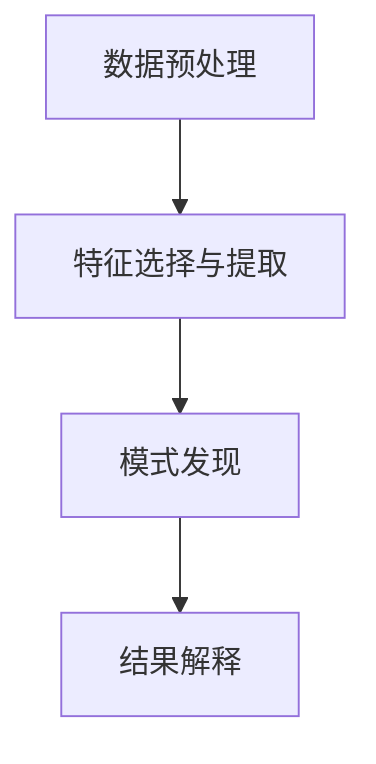

                 

# 知识发现引擎：在信息海洋中导航的灯塔

> 关键词：知识发现引擎,信息抽取,数据集成,自然语言处理,数据挖掘,大数据分析

## 1. 背景介绍

### 1.1 问题由来
在现代社会，信息量呈爆炸性增长，从社交媒体、电子商务、医疗记录到金融交易，几乎所有领域都产生了巨量的数据。然而，面对如此庞大的数据海洋，我们既需要迅速挖掘有价值的信息，又需要精准地整合各种数据源。这一挑战催生了知识发现引擎(Knowledge Discovery Engine, KDE)的诞生。

知识发现引擎是数据挖掘领域的重要工具，通过自动化的数据分析方法，从大量非结构化和半结构化数据中提取出有价值的知识和规律。它在决策支持、商业智能、生物信息学等众多领域都有广泛的应用。通过知识发现引擎，我们能够在纷繁复杂的数据中发现隐藏的规律，洞察真实世界的运行机制，从而做出更为科学合理的决策。

### 1.2 问题核心关键点
知识发现引擎的核心任务包括数据预处理、特征选择与提取、模式发现、结果解释等多个环节。其关键在于如何高效地利用现有数据，通过算法挖掘隐藏的知识，并将其应用于决策支持系统中。

- **数据预处理**：清洗、归一化、去噪等步骤，为后续分析奠定基础。
- **特征选择与提取**：根据特定任务需求，提取重要特征，减少噪音，提升模型的泛化能力。
- **模式发现**：基于统计学、机器学习等方法，自动发现数据中的模式和规律。
- **结果解释**：通过可视化、自然语言生成等技术，将发现的知识转化为易于理解和应用的形态。

## 2. 核心概念与联系

### 2.1 核心概念概述

为了更好地理解知识发现引擎的工作原理和优化方向，本节将介绍几个密切相关的核心概念：

- **数据挖掘(Data Mining)**：通过统计学、机器学习等方法，从数据中自动发现潜在的模式和知识。
- **数据预处理(Preprocessing)**：对原始数据进行清洗、转换、归一化等操作，为后续分析做好准备。
- **特征选择与提取(Feature Selection and Extraction)**：识别出对目标任务有价值的特征，降低维度，减少计算量。
- **模式发现(Pattern Discovery)**：自动地从数据中挖掘出有意义的规律和模式。
- **结果解释(Result Interpretation)**：将发现的知识转化为易于理解和应用的形式。

这些核心概念之间的逻辑关系可以通过以下Mermaid流程图来展示：



这个流程图展示了几大核心概念的逻辑关系：数据预处理为特征提取和模式发现提供干净、有意义的输入数据；特征选择与提取能够聚焦于重要信息，提升模式发现的准确性；模式发现是知识发现引擎的核心步骤，提取数据的规律和关联；结果解释则将发现的知识转化为可操作的形态，实现其应用价值。

## 3. 核心算法原理 & 具体操作步骤
### 3.1 算法原理概述

知识发现引擎的算法原理通常基于统计学、机器学习、数据挖掘等技术，其核心在于通过模型拟合，发现数据中的模式和规律。其中，常用的算法包括：

- **决策树算法**：通过树形结构划分数据，实现特征选择和模式发现。
- **随机森林算法**：基于多个决策树模型的集成，提高模型的鲁棒性和准确性。
- **支持向量机(SVM)**：通过构建超平面，实现数据的高维映射和分类。
- **关联规则学习**：基于Apriori等算法，发现数据项之间的关联规律。
- **聚类算法**：如K-Means、层次聚类等，将相似的数据点分为同一类别。
- **深度学习**：利用神经网络结构，自动发现数据中的复杂模式和关联。

这些算法通过自动化的数据处理和模式发现，帮助知识发现引擎从大量数据中提取有用的信息。

### 3.2 算法步骤详解

知识发现引擎的开发通常包括以下几个关键步骤：

**Step 1: 数据收集与预处理**
- 收集来自不同数据源的数据，如数据库、电子文档、社交媒体等。
- 对数据进行清洗、去重、补全缺失值、归一化等预处理步骤，确保数据质量。

**Step 2: 特征选择与提取**
- 根据任务需求，选择或提取相关特征。
- 使用统计学、机器学习等方法，对特征进行降维、标准化处理。

**Step 3: 模型训练与优化**
- 选择合适的算法，训练模型。
- 通过交叉验证、网格搜索等方法，优化模型参数，提高模型性能。

**Step 4: 模式发现与知识抽取**
- 使用训练好的模型，自动发现数据中的模式和规律。
- 根据具体应用需求，抽取出有价值的知识或规则。

**Step 5: 结果解释与应用**
- 将发现的知识转化为易于理解和应用的形式，如自然语言描述、可视化图表等。
- 将发现的知识应用到实际业务场景中，如决策支持、客户细分、市场预测等。

### 3.3 算法优缺点

知识发现引擎具有以下优点：
- 自动化分析：能够自动地处理大量数据，发现数据中的模式和规律。
- 高效性：通过优化算法，提升模型性能，减少人工干预。
- 可解释性：将发现的知识转化为易于理解的形式，方便业务应用。

同时，知识发现引擎也存在一些局限性：
- 依赖数据质量：数据的准确性、完整性对模型结果有直接影响。
- 模型泛化能力有限：模型过于复杂可能导致过拟合，泛化能力不足。
- 缺乏常识知识：模型只能发现数据中的规律，无法整合人类常识和经验。
- 结果解释难度高：将复杂的数据模式转换为可解释的知识，仍然是一个难题。

尽管如此，知识发现引擎在数据驱动的决策支持系统中仍是不可或缺的工具。未来的研究应进一步提升模型的泛化能力，融合人类常识和经验，同时增强结果的可解释性，为决策提供更有力的支持。

### 3.4 算法应用领域

知识发现引擎在多个领域得到了广泛应用，以下是几个典型例子：

**金融风险评估**：通过分析历史交易数据，发现潜在的风险因素和趋势，帮助金融机构进行风险评估和投资决策。

**市场趋势预测**：利用消费者行为数据，挖掘出市场潜在的增长点，预测未来的市场趋势。

**医疗诊断支持**：通过整合电子病历、临床数据，自动发现疾病征兆和关联规律，辅助医生进行诊断和治疗。

**客户细分与个性化推荐**：利用消费行为数据，发现客户分群和偏好，实现个性化产品推荐和客户管理。

**社交媒体舆情分析**：分析社交媒体上的舆情变化，预测社会情绪和趋势，为政府和企业决策提供支持。

**资源规划与优化**：通过分析供应链数据，自动发现优化资源配置的机会，提高运营效率。

## 4. 数学模型和公式 & 详细讲解 & 举例说明
### 4.1 数学模型构建

为了更好地展示知识发现引擎的数学原理，这里我们将介绍一些常用的数学模型：

**决策树模型**：决策树是一种基于树形结构的数据分割方法。其数学模型可以表示为：

$$
T = \{r, F, R\}
$$

其中 $r$ 为根节点，$F$ 为特征集，$R$ 为结果集。决策树的构建过程，就是从根节点开始，不断根据特征将数据集分割成更小的子集，直到每个子集都只有同一类别的数据。

**支持向量机模型**：支持向量机通过寻找最优的超平面，将数据分割为不同的类别。其数学模型可以表示为：

$$
y = w^T\varphi(x) + b
$$

其中 $w$ 为权重向量，$\varphi(x)$ 为特征映射函数，$b$ 为偏移量。通过求解最优的 $w$ 和 $b$，使得分类误差最小。

**关联规则模型**：Apriori算法是一种常用的关联规则学习算法。其核心在于发现数据项之间的频繁模式，可以通过以下数学公式表示：

$$
\text{support}(X) \geq \alpha
$$

其中 $\text{support}(X)$ 为规则 $X$ 的支持度，$\alpha$ 为最小支持度阈值。

**聚类模型**：K-Means算法是一种基于距离的聚类方法。其核心在于将数据点分配到不同的簇中，使得簇内距离最小，簇间距离最大。其数学模型可以表示为：

$$
\min_{\mu_k, c_k} \sum_{x_i \in C_k} ||x_i - \mu_k||^2
$$

其中 $\mu_k$ 为簇 $C_k$ 的质心，$c_k$ 为数据点 $x_i$ 所属的簇。

### 4.2 公式推导过程

**决策树推导**：
决策树的构建过程可以理解为一种递归的特征选择和数据分割过程。假设当前节点包含数据集 $D=\{(x_i, y_i)\}_{i=1}^N$，特征集 $F=\{f_1, f_2, \ldots, f_m\}$，其数学推导过程如下：

1. 计算每个特征 $f_j$ 的信息增益（IG）：
   $$
   \text{IG}(f_j, D) = H(D) - \sum_{i=1}^N p_i \log p_i
   $$

   其中 $H(D)$ 为数据集 $D$ 的熵，$p_i$ 为类别 $i$ 的概率。

2. 选择信息增益最大的特征 $f_j^*$，作为当前节点的分裂特征。

3. 根据特征 $f_j^*$ 将数据集 $D$ 分割为多个子集 $D_1, D_2, \ldots, D_k$，并递归地构建子树的决策过程。

**支持向量机推导**：
支持向量机的推导过程较为复杂，涉及拉格朗日乘子、对偶问题、核函数等概念。这里简要介绍其基本思路：

1. 构建原始问题：
   $$
   \min_{w, b} \frac{1}{2}||w||^2 + C \sum_{i=1}^N \max(0, 1 - y_i(w^T\varphi(x_i) + b))
   $$

   其中 $w$ 为权重向量，$\varphi(x)$ 为特征映射函数，$b$ 为偏移量，$C$ 为正则化参数。

2. 求解对偶问题：
   $$
   \min_{\alpha} \frac{1}{2}\alpha^TQ\alpha - \sum_{i=1}^N \alpha_iy_i - \frac{1}{2}C\sum_{i=1}^N \alpha_i
   $$

   其中 $Q$ 为矩阵，$\alpha$ 为拉格朗日乘子。

3. 求解拉格朗日乘子 $\alpha$，得到最优的 $w$ 和 $b$。

### 4.3 案例分析与讲解

**案例分析**：某电商公司想要利用客户购买数据，发现客户分群和推荐策略。具体步骤如下：

1. 数据收集与预处理：收集客户购买数据，包括客户ID、购买商品ID、购买时间等。对数据进行清洗、归一化、去重等预处理。

2. 特征选择与提取：选择购买次数、购买金额、购买时间等特征，使用PCA进行降维处理。

3. 模型训练与优化：使用K-Means算法对客户进行聚类，得到不同分群的客户特征。通过网格搜索，优化模型参数。

4. 模式发现与知识抽取：分析不同分群客户的购买行为，发现不同分群的购买偏好和购买时间规律。

5. 结果解释与应用：将不同分群客户的特征转化为自然语言描述，生成推荐策略。

**讲解**：通过以上步骤，电商公司可以发现客户的购买分群特征，根据不同分群的特点进行个性化推荐。例如，针对价格敏感型客户，可以推荐价格较低的商品；针对品质追求型客户，可以推荐评价较高的商品。

## 5. 项目实践：代码实例和详细解释说明
### 5.1 开发环境搭建

在进行知识发现引擎开发前，我们需要准备好开发环境。以下是使用Python进行Scikit-learn开发的环境配置流程：

1. 安装Anaconda：从官网下载并安装Anaconda，用于创建独立的Python环境。

2. 创建并激活虚拟环境：
```bash
conda create -n sklearn-env python=3.8 
conda activate sklearn-env
```

3. 安装Scikit-learn：
```bash
conda install scikit-learn
```

4. 安装其他依赖库：
```bash
pip install pandas numpy matplotlib seaborn
```

完成上述步骤后，即可在`sklearn-env`环境中开始开发。

### 5.2 源代码详细实现

这里我们以一个简单的知识发现引擎为例，展示Scikit-learn库的使用方法。

```python
from sklearn.datasets import load_breast_cancer
from sklearn.model_selection import train_test_split
from sklearn.tree import DecisionTreeClassifier
from sklearn.metrics import accuracy_score
import numpy as np

# 加载数据集
data = load_breast_cancer()
X, y = data.data, data.target

# 划分训练集和测试集
X_train, X_test, y_train, y_test = train_test_split(X, y, test_size=0.2, random_state=42)

# 构建决策树模型
clf = DecisionTreeClassifier()
clf.fit(X_train, y_train)

# 在测试集上进行预测
y_pred = clf.predict(X_test)

# 计算准确率
accuracy = accuracy_score(y_test, y_pred)
print(f"Accuracy: {accuracy:.2f}")
```

以上就是使用Scikit-learn库进行决策树模型训练的完整代码实现。可以看到，Scikit-learn库提供了丰富的机器学习算法，并且代码实现相对简单，适合快速原型开发。

### 5.3 代码解读与分析

让我们再详细解读一下关键代码的实现细节：

**加载数据集**：
- 使用`load_breast_cancer`函数加载乳腺癌数据集，自动生成训练集和测试集。

**划分训练集和测试集**：
- 使用`train_test_split`函数，将数据集划分为训练集和测试集，比例为80:20。

**构建决策树模型**：
- 使用`DecisionTreeClassifier`类构建决策树模型。

**在测试集上进行预测**：
- 使用`predict`函数，在测试集上对模型进行预测，返回预测结果。

**计算准确率**：
- 使用`accuracy_score`函数，计算预测结果与真实标签之间的准确率。

可以看到，Scikit-learn库的API设计非常简洁，易于使用，开发者可以快速搭建原型并进行调试优化。

## 6. 实际应用场景
### 6.1 智能客服系统

知识发现引擎在智能客服系统中有着广泛的应用。智能客服系统通过自动分析客户反馈和行为数据，发现常见的客户问题和解决方法，自动回答客户咨询。

具体而言，可以将客户反馈和行为数据作为训练数据，构建知识发现引擎。通过聚类算法，发现常见的客户问题和解决方法，自动生成常见问题解答。同时，通过关联规则学习，发现不同问题之间的相关性，进一步提升解答的准确性和相关性。

### 6.2 金融风险评估

金融行业需要实时监测市场风险，及时发现潜在的风险因素和趋势。知识发现引擎可以通过分析历史交易数据，发现潜在的风险因素和趋势，帮助金融机构进行风险评估和投资决策。

具体而言，可以将历史交易数据作为训练数据，构建知识发现引擎。通过关联规则学习，发现不同交易行为之间的关联规律，自动发现潜在的风险因素。同时，通过聚类算法，将相似的交易行为分为同一类别，进一步提升风险评估的准确性。

### 6.3 医疗诊断支持

医疗行业需要整合电子病历、临床数据，自动发现疾病征兆和关联规律，辅助医生进行诊断和治疗。知识发现引擎可以通过分析电子病历和临床数据，自动发现疾病征兆和关联规律，提供辅助诊断和治疗方法。

具体而言，可以将电子病历和临床数据作为训练数据，构建知识发现引擎。通过关联规则学习，发现不同症状之间的关联规律，自动发现疾病的征兆。同时，通过聚类算法，将相似的病例分为同一类别，进一步提升诊断的准确性。

### 6.4 未来应用展望

随着知识发现引擎的不断发展，其在更多领域的应用前景将更加广阔。

**智能推荐系统**：通过分析用户行为数据，自动发现用户的兴趣和偏好，提供个性化推荐服务。

**社交媒体舆情分析**：分析社交媒体上的舆情变化，预测社会情绪和趋势，为政府和企业决策提供支持。

**资源规划与优化**：通过分析供应链数据，自动发现优化资源配置的机会，提高运营效率。

**智慧城市治理**：通过分析城市事件和舆情数据，自动发现城市运行中的问题，优化城市治理策略。

**健康管理**：通过分析健康数据，自动发现健康风险和趋势，提供健康管理建议。

**市场营销**：通过分析市场数据，自动发现市场机会和趋势，优化市场营销策略。

以上应用场景只是冰山一角，知识发现引擎在更多领域都有着巨大的应用潜力，未来必将成为人工智能技术的重要组成部分。

## 7. 工具和资源推荐
### 7.1 学习资源推荐

为了帮助开发者系统掌握知识发现引擎的理论基础和实践技巧，这里推荐一些优质的学习资源：

1. 《数据挖掘导论》一书：由吴恩达等人合著，全面介绍了数据挖掘的基本概念、算法和技术。

2. 《Python数据科学手册》一书：由Jake VanderPlas撰写，详细介绍了使用Python进行数据科学开发的流程和工具。

3. Coursera《数据挖掘与统计学习》课程：斯坦福大学开设的入门课程，涵盖数据挖掘和机器学习的基础知识。

4. Udacity《数据科学与机器学习》纳米学位：系统介绍数据科学和机器学习的理论和实践，涵盖数据预处理、特征工程、模型训练等环节。

5. Kaggle平台：提供海量数据集和比赛，实战锻炼数据科学技能，提升分析能力。

通过对这些资源的学习实践，相信你一定能够快速掌握知识发现引擎的理论基础和实践技巧，并用于解决实际的业务问题。

### 7.2 开发工具推荐

高效的开发离不开优秀的工具支持。以下是几款用于知识发现引擎开发的常用工具：

1. Python：数据科学领域的主流编程语言，灵活易用，支持丰富的科学计算库。

2. Scikit-learn：Python数据科学的核心库，提供了多种机器学习算法和数据处理工具。

3. Weka：开源数据挖掘工具，支持多种数据挖掘算法，易于使用。

4. RapidMiner：商业数据挖掘工具，提供可视化界面和丰富的算法库。

5. RapidMiner Studio：RapidMiner的高级版本，支持更多的数据处理和建模功能。

6. Orange：Python数据挖掘库，支持可视化的数据处理和建模。

合理利用这些工具，可以显著提升知识发现引擎的开发效率，加快创新迭代的步伐。

### 7.3 相关论文推荐

知识发现引擎的研究始于20世纪80年代，经过多年的发展，已经形成了一套相对成熟的方法体系。以下是几篇奠基性的相关论文，推荐阅读：

1. "The Quest for Knowledge Discovery in Databases"：J. Han等，介绍了数据挖掘的基本概念和算法。

2. "Knowledge Discovery in Databases: An Introduction"：J. Han等，全面综述了数据挖掘的技术和方法。

3. "Learning from Data"：T. Mitchell，介绍了机器学习的基本概念和算法。

4. "Data Mining: Concepts and Techniques"：J. Han等，详细介绍了数据挖掘的算法和技术。

5. "Apriori Algorithm for Large-Scale Market Basket Analysis"：R. Agrawal等，介绍了Apriori算法的实现和应用。

6. "Decision Trees"：J. Ross Quinlan，介绍了决策树的构建和优化算法。

这些论文代表了大数据挖掘领域的发展脉络。通过学习这些前沿成果，可以帮助研究者把握学科前进方向，激发更多的创新灵感。

## 8. 总结：未来发展趋势与挑战
### 8.1 总结

本文对知识发现引擎的基本原理和实际应用进行了全面系统的介绍。首先阐述了知识发现引擎在数据驱动决策支持系统中的重要地位，明确了其在数据预处理、特征选择与提取、模式发现、结果解释等多个环节的核心任务。接着，从算法原理到具体操作步骤，详细讲解了知识发现引擎的开发流程，并通过代码实例，展示了其具体实现方法。同时，本文还广泛探讨了知识发现引擎在智能客服、金融风险评估、医疗诊断支持等多个领域的应用前景，展示了其巨大的应用潜力。最后，本文精选了知识发现引擎的相关学习资源和开发工具，力求为开发者提供全方位的技术指引。

通过本文的系统梳理，可以看到，知识发现引擎在数据挖掘领域具有不可替代的地位。通过自动化数据分析方法，知识发现引擎能够从大量非结构化和半结构化数据中提取出有价值的知识和规律，为决策支持系统提供强有力的数据支持。未来，伴随知识发现引擎的不断发展，其在更多领域的应用前景将更加广阔，为社会各行业的智能化、信息化发展注入新的动力。

### 8.2 未来发展趋势

展望未来，知识发现引擎的发展趋势主要包括以下几个方面：

1. **自动化程度提升**：随着机器学习技术的进步，知识发现引擎的自动化程度将进一步提升，能够自动处理更多复杂的数据类型和数据规模。

2. **深度学习的应用**：深度学习技术在图像、语音、文本等领域的成功应用，将进一步推动知识发现引擎向深度学习方向发展，提升其处理复杂数据的能力。

3. **多模态数据整合**：知识发现引擎将更多地融合图像、语音、文本等多种模态的数据，提高其对现实世界的理解和建模能力。

4. **实时数据处理**：知识发现引擎将更多地应用于实时数据处理和流数据处理场景，实现对动态数据的实时分析和预测。

5. **模型解释与可解释性**：随着知识发现引擎在金融、医疗等领域的应用日益增多，模型的可解释性和可解释性将成为重要的研究方向。

6. **跨领域应用**：知识发现引擎将更多地应用于跨领域数据整合和知识共享，如智慧城市、智能制造等领域。

这些发展趋势凸显了知识发现引擎在数据驱动决策支持系统中的重要性。随着技术的不断演进，知识发现引擎必将成为更加智能、高效、可解释的工具，为各行各业的发展提供更加有力的支持。

### 8.3 面临的挑战

尽管知识发现引擎在数据挖掘领域取得了显著进展，但在迈向更加智能化、普适化应用的过程中，仍面临诸多挑战：

1. **数据质量问题**：数据的质量对知识发现引擎的性能有着重要影响。数据不完整、不准确、不一致等问题，会导致模型结果的不稳定和不可靠。

2. **模型泛化能力不足**：模型的复杂度和数据量对泛化能力有直接影响。模型过于复杂可能导致过拟合，泛化能力不足。

3. **结果解释难度高**：知识发现引擎的输出结果往往包含大量的数学和统计概念，难以转化为易于理解的形式。

4. **实时数据处理能力不足**：知识发现引擎在处理大规模实时数据时，可能面临计算和存储的瓶颈。

5. **跨领域知识整合难度大**：不同领域的数据结构和特征具有较大差异，难以进行有效的融合和整合。

6. **伦理与安全性问题**：知识发现引擎在应用过程中可能涉及敏感数据和隐私问题，需要关注伦理与安全性问题。

正视知识发现引擎面临的这些挑战，积极应对并寻求突破，将是大数据挖掘技术迈向成熟的必由之路。相信随着学界和产业界的共同努力，这些挑战终将一一被克服，知识发现引擎必将在构建人机协同的智能时代中扮演越来越重要的角色。

### 8.4 研究展望

面对知识发现引擎所面临的种种挑战，未来的研究需要在以下几个方面寻求新的突破：

1. **跨模态数据整合**：融合图像、语音、文本等多种模态的数据，提高知识发现引擎对现实世界的理解能力。

2. **实时数据处理**：优化算法和计算框架，提升知识发现引擎的实时数据处理能力，支持流数据的分析和预测。

3. **可解释性提升**：引入因果分析和博弈论工具，增强模型的可解释性和可理解性。

4. **跨领域应用拓展**：研究知识发现引擎在不同领域的交叉应用，推动跨学科知识融合和创新。

5. **数据质量保证**：开发数据清洗和预处理工具，提升数据质量，减少数据噪声对模型结果的影响。

6. **隐私保护与伦理约束**：引入隐私保护技术，确保数据使用过程中的安全性。

这些研究方向的探索，必将引领知识发现引擎技术迈向更高的台阶，为构建安全、可靠、可解释、可控的智能系统铺平道路。面向未来，知识发现引擎需要与其他人工智能技术进行更深入的融合，如知识表示、因果推理、强化学习等，多路径协同发力，共同推动数据挖掘技术的进步。只有勇于创新、敢于突破，才能不断拓展知识发现引擎的边界，让数据驱动的决策支持系统更加智能、高效、可靠。

## 9. 附录：常见问题与解答

**Q1：知识发现引擎是否适用于所有数据类型？**

A: 知识发现引擎适用于大部分非结构化和半结构化数据，但对于视频、音频等大规模复杂数据，其处理能力和效率仍需提升。未来的研究应关注这些复杂数据类型的处理，提升知识发现引擎的通用性和适应性。

**Q2：知识发现引擎是否需要大量的标注数据？**

A: 知识发现引擎通常依赖于未标注的数据进行自动发现模式和规律，但在某些应用场景中，如分类任务，还是需要少量标注数据进行验证和优化。

**Q3：知识发现引擎如何处理缺失数据？**

A: 缺失数据是数据预处理中的常见问题，知识发现引擎通常使用插值法、均值填补法等方法处理缺失数据，确保数据完整性和一致性。

**Q4：知识发现引擎如何保证模型的泛化能力？**

A: 泛化能力主要通过增加数据量、优化模型结构、引入正则化技术等方法提升。同时，合理的特征选择和降维处理，也能提高模型的泛化能力。

**Q5：知识发现引擎的结果解释如何实现？**

A: 结果解释通常通过可视化图表、自然语言生成等方法实现，将复杂的数学模型转化为易于理解的形式。对于复杂模型，还可以引入因果分析、解释性人工智能等方法，提升结果的可解释性。

通过以上问题解答，相信你对知识发现引擎的理论基础和实际应用有了更深入的了解。知识发现引擎作为数据挖掘领域的重要工具，能够帮助我们从大量数据中发现隐藏的规律和知识，为决策支持系统提供强有力的数据支持。未来，伴随技术的不断演进，知识发现引擎必将在更多领域发挥重要作用，推动数据驱动的决策支持系统不断进步。

---

作者：禅与计算机程序设计艺术 / Zen and the Art of Computer Programming

