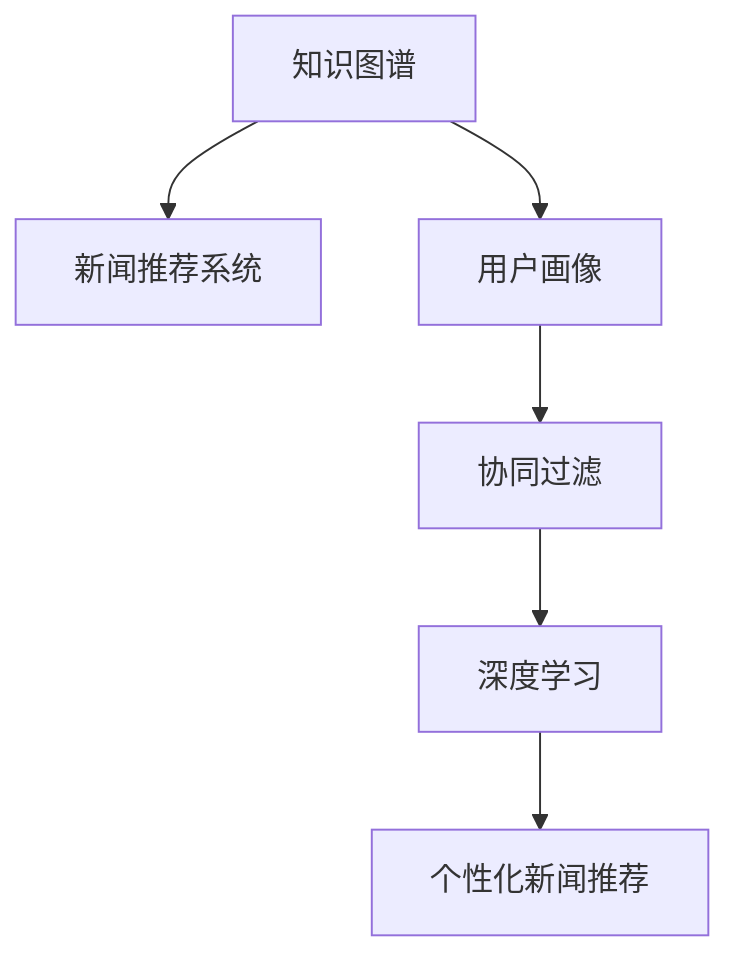

                 

# 知识图谱在个性化新闻推荐中的应用

> 关键词：知识图谱,新闻推荐系统,用户画像,内容推荐,协同过滤,深度学习

## 1. 背景介绍

### 1.1 问题由来
随着互联网技术的快速发展，信息爆炸已经成为不可避免的趋势。用户每天接触的信息量越来越大，但同时也被信息洪流所淹没，难以找到自己真正感兴趣的内容。新闻推荐系统应运而生，旨在帮助用户从海量新闻中筛选出有价值的信息，提高信息检索的效率和质量。

然而，传统的基于内容的推荐系统往往只能关注新闻内容的关键词，而无法充分挖掘用户的历史阅读行为和新闻之间的语义关联，因此推荐效果并不理想。近年来，知识图谱作为一种强大的语义表示工具，被引入到推荐系统中，为个性化新闻推荐提供了新的解决思路。

### 1.2 问题核心关键点
知识图谱是一种将实体、关系、属性等信息结构化表示的方式，可以直观地反映现实世界中的各种关系。在个性化新闻推荐中，知识图谱不仅可以用来描述新闻内容的语义信息，还能结合用户的兴趣和行为，生成更为精准的个性化推荐结果。

核心问题包括：
- 如何构建新闻知识图谱，并从中找到与用户兴趣相关的新闻实体？
- 如何在知识图谱中融入用户行为信息，形成完整的用户画像？
- 如何利用知识图谱信息优化推荐模型，提升推荐效果？

## 2. 核心概念与联系

### 2.1 核心概念概述

为更好地理解知识图谱在个性化新闻推荐中的应用，本节将介绍几个密切相关的核心概念：

- 知识图谱(Knowledge Graph)：一种结构化的语义表示方式，由节点(Node)和边(Edge)组成，用于描述实体(Entity)和实体之间的关系(Relation)。知识图谱为推荐系统提供了更丰富、更深刻的语义信息。

- 新闻推荐系统(News Recommendation System)：一种自动推荐新闻内容的技术系统，通过学习用户的历史行为和新闻特征，生成个性化的新闻推荐。

- 用户画像(User Profiling)：指对用户的兴趣、行为、人口统计特征等信息进行综合分析，形成用户画像，以指导个性化推荐。

- 协同过滤(Collaborative Filtering)：一种基于用户行为数据的推荐算法，通过计算用户和物品之间的相似度，推荐用户可能感兴趣的物品。

- 深度学习(Deep Learning)：一种基于人工神经网络的机器学习方法，通过多层次特征学习，捕捉数据的复杂关系，实现高效的推荐。

这些核心概念之间的逻辑关系可以通过以下Mermaid流程图来展示：



这个流程图展示了一些关键概念的联系：

1. 知识图谱通过描述新闻的语义信息，为推荐系统提供了更丰富的信息源。
2. 用户画像用于描述用户的兴趣和行为特征，为个性化推荐提供目标用户信息。
3. 协同过滤和深度学习是推荐系统常用的两种技术手段，分别从用户行为和语义信息中提取特征，生成推荐结果。
4. 个性化新闻推荐是将知识图谱、用户画像、协同过滤和深度学习融合起来，生成的最终推荐结果。

## 3. 核心算法原理 & 具体操作步骤
### 3.1 算法原理概述

基于知识图谱的个性化新闻推荐算法，本质上是将知识图谱中的语义信息与用户的兴趣特征进行融合，通过协同过滤、深度学习等技术手段，生成个性化的新闻推荐。其核心思想是：

1. 构建新闻知识图谱，将新闻实体、属性、关系等语义信息结构化表示，并通过关系抽取、实体链接等技术手段，将知识图谱中的信息与新闻内容进行关联。
2. 利用用户的历史行为数据，构建用户画像，描述用户的兴趣特征。
3. 将知识图谱中的语义信息和用户画像进行融合，生成个性化推荐结果。

具体而言，算法流程如下：

1. 构建新闻知识图谱。
2. 提取用户兴趣特征。
3. 融合知识图谱和用户画像，生成个性化推荐。

### 3.2 算法步骤详解

#### 3.2.1 新闻知识图谱的构建

新闻知识图谱的构建包括以下几个关键步骤：

**Step 1: 数据收集与预处理**
- 从新闻网站、新闻API等渠道收集新闻数据。
- 清洗文本数据，去除噪声，如HTML标签、无效字符等。
- 进行文本分词和词性标注，提取新闻的实体和属性信息。

**Step 2: 实体链接**
- 将抽取到的实体信息与外部知识图谱进行链接，将新闻内容嵌入到知识图谱中。
- 常用的实体链接方法包括维基百科链接、外部API调用、语义相似度计算等。

**Step 3: 关系抽取**
- 使用命名实体识别、依存句法分析等自然语言处理技术，抽取新闻中实体之间的关系。
- 常用的关系抽取方法包括规则匹配、深度学习、知识图谱嵌入等。

**Step 4: 图谱构建与优化**
- 构建基于节点和边的知识图谱，节点表示实体，边表示实体之间的关系。
- 使用图谱优化算法，如PageRank、GCN等，优化图谱结构，提高节点之间的语义相似度。

#### 3.2.2 用户兴趣特征的提取

用户兴趣特征的提取包括以下几个关键步骤：

**Step 1: 用户行为数据收集**
- 从新闻网站、新闻应用等渠道收集用户的行为数据，如点击、阅读、分享等。
- 存储行为数据，建立用户与新闻之间的行为关系。

**Step 2: 用户画像建模**
- 使用协同过滤、内容推荐等技术，根据用户行为数据，构建用户画像。
- 用户画像包括用户的兴趣、偏好、行为等特征。

#### 3.2.3 个性化推荐模型的构建

个性化推荐模型的构建包括以下几个关键步骤：

**Step 1: 数据嵌入**
- 将用户画像和新闻知识图谱中的信息进行向量嵌入。
- 常用的向量嵌入方法包括Word2Vec、GloVe、BERT等。

**Step 2: 协同过滤与深度学习融合**
- 将知识图谱中的语义信息和用户画像进行融合，生成用户对新闻的评分。
- 常用的方法包括基于用户行为的协同过滤、基于知识图谱的深度学习等。

**Step 3: 推荐结果排序**
- 根据评分，生成个性化新闻推荐列表。
- 常用的排序算法包括TF-IDF、BM25、学习到排序等。

#### 3.2.4 推荐结果评估

推荐结果的评估包括以下几个关键步骤：

**Step 1: 评估指标**
- 使用常见的推荐评估指标，如平均准确率、平均精度、F1分数等，评估推荐结果的质量。
- 常用的评估指标还包括NDCG、MAP等。

**Step 2: 效果分析**
- 分析推荐结果的质量，找出算法的不足之处。
- 常用的分析方法包括混淆矩阵、ROC曲线等。

### 3.3 算法优缺点

基于知识图谱的个性化新闻推荐算法具有以下优点：

1. 信息丰富：通过新闻知识图谱，能够捕捉到新闻内容的深层语义信息，避免了传统推荐系统只能关注关键词的局限。
2. 精度较高：通过融合用户画像和知识图谱，生成的推荐结果更为精准，能够更好地满足用户的个性化需求。
3. 灵活可扩展：知识图谱具有较强的扩展性，可以不断引入新的实体和关系，提升推荐系统的能力。

同时，该算法也存在以下缺点：

1. 构建复杂：新闻知识图谱的构建需要大量的人工干预和复杂的自然语言处理技术，工作量较大。
2. 数据稀缺：知识图谱中的实体和关系需要从外部数据源抽取，数据稀缺是限制知识图谱构建和推荐系统效果的瓶颈。
3. 计算量大：知识图谱的嵌入和关系抽取等步骤需要大量计算资源，对硬件要求较高。
4. 更新困难：知识图谱中的实体和关系需要定期更新，以保证推荐系统的效果。

尽管存在这些局限性，但基于知识图谱的个性化新闻推荐方法在学术界和工业界都得到了广泛应用，并取得了显著的效果。未来相关研究的重点在于如何进一步降低构建知识图谱的工作量，提升推荐系统的实时性和可扩展性，同时兼顾模型的可解释性和效果。

### 3.4 算法应用领域

基于知识图谱的个性化新闻推荐算法，已经在诸多领域得到了广泛应用，例如：

- 新闻网站：如BBC、路透社等，通过个性化推荐提升用户留存率和点击率。
- 新闻应用：如今日头条、腾讯新闻等，为用户提供个性化的新闻推荐。
- 智能音箱：如亚马逊Alexa、Google Assistant等，通过语音查询获取个性化新闻推荐。
- 社交媒体：如Twitter、Facebook等，为用户推荐感兴趣的新闻话题。
- 广告推荐：如Google AdSense等，根据用户兴趣推荐相关新闻广告。

除了上述这些经典应用外，个性化新闻推荐技术还在教育、医疗、金融等诸多领域得到创新性应用，为这些领域的知识传播和信息获取带来了新的解决方案。

## 4. 数学模型和公式 & 详细讲解 & 举例说明

### 4.1 数学模型构建

本节将使用数学语言对基于知识图谱的个性化新闻推荐过程进行更加严格的刻画。

记新闻实体为 $E=\{e_1, e_2, ..., e_n\}$，新闻属性为 $A=\{a_1, a_2, ..., a_m\}$，新闻关系为 $R=\{r_1, r_2, ..., r_k\}$。设 $G=(E, R)$ 为新闻知识图谱，$U=\{u_1, u_2, ..., u_m\}$ 为用户集合。

定义用户 $u_i$ 对新闻实体 $e_j$ 的兴趣度为 $I_{u_i e_j}$，定义为：

$$
I_{u_i e_j} = \sum_{r_k \in R} \alpha_{r_k} f_{u_i e_j}(r_k)
$$

其中 $\alpha_{r_k}$ 为关系权重，$f_{u_i e_j}(r_k)$ 为兴趣函数，衡量用户对新闻实体的兴趣程度。

### 4.2 公式推导过程

以下我们以知识图谱中的关系链接为例，推导用户兴趣度的计算公式。

假设用户 $u_i$ 已经阅读过新闻实体 $e_j$ 和 $e_l$，与新闻实体 $e_j$ 的关系为 $r_1$，与新闻实体 $e_l$ 的关系为 $r_2$。则用户 $u_i$ 对新闻实体 $e_j$ 的兴趣度为：

$$
I_{u_i e_j} = \alpha_{r_1} f_{u_i e_j}(r_1) + \alpha_{r_2} f_{u_i e_l}(r_2)
$$

具体来说，$f_{u_i e_j}(r_1)$ 和 $f_{u_i e_l}(r_2)$ 可以通过以下公式计算：

$$
f_{u_i e_j}(r_1) = \mathrm{softmax}(\vec{u}_i \cdot \vec{r}_1)
$$

$$
f_{u_i e_l}(r_2) = \mathrm{softmax}(\vec{u}_i \cdot \vec{r}_2)
$$

其中 $\vec{u}_i$ 为用户的兴趣向量，$\vec{r}_1$ 和 $\vec{r}_2$ 为新闻实体的关系向量。通过softmax函数，将用户的兴趣度转换为概率形式。

### 4.3 案例分析与讲解

假设用户 $u_i$ 已经阅读过新闻实体 $e_1$ 和 $e_2$，与新闻实体 $e_1$ 的关系为 $r_1$，与新闻实体 $e_2$ 的关系为 $r_2$。则用户 $u_i$ 对新闻实体 $e_3$ 的兴趣度为：

$$
I_{u_i e_3} = \alpha_{r_1} f_{u_i e_1}(r_1) + \alpha_{r_2} f_{u_i e_2}(r_2)
$$

如果 $e_1$ 和 $e_2$ 存在关系 $r_3$，则用户 $u_i$ 对新闻实体 $e_3$ 的兴趣度进一步增强：

$$
I_{u_i e_3} = \alpha_{r_1} f_{u_i e_1}(r_1) + \alpha_{r_2} f_{u_i e_2}(r_2) + \alpha_{r_3} f_{u_i e_1}(r_3)
$$

这里，$f_{u_i e_j}(r_k)$ 的值可以通过神经网络等深度学习技术计算，进一步提升推荐模型的性能。

## 5. 项目实践：代码实例和详细解释说明

### 5.1 开发环境搭建

在进行知识图谱推荐系统的开发前，我们需要准备好开发环境。以下是使用Python进行TensorFlow开发的环境配置流程：

1. 安装Anaconda：从官网下载并安装Anaconda，用于创建独立的Python环境。

2. 创建并激活虚拟环境：
```bash
conda create -n tf-env python=3.8 
conda activate tf-env
```

3. 安装TensorFlow：根据CUDA版本，从官网获取对应的安装命令。例如：
```bash
conda install tensorflow tensorflow-cpu=2.6 -c pytorch -c conda-forge
```

4. 安装Gensim、Scikit-learn等工具包：
```bash
pip install gensim scikit-learn pandas numpy matplotlib
```

5. 安装外部知识图谱库：
```bash
pip install pykglib pykg2vec
```

完成上述步骤后，即可在`tf-env`环境中开始知识图谱推荐系统的开发。

### 5.2 源代码详细实现

下面以基于知识图谱的协同过滤推荐算法为例，给出使用TensorFlow实现的新闻推荐系统的代码。

首先，定义新闻知识图谱的类：

```python
import tensorflow as tf
from gensim.models import Word2Vec

class NewsKG(tf.keras.Model):
    def __init__(self, embed_dim, num_entities, num_relations):
        super(NewsKG, self).__init__()
        self.embedding = tf.keras.layers.Embedding(num_entities, embed_dim)
        self.relation_embedding = tf.keras.layers.Embedding(num_relations, embed_dim)
        
    def __call__(self, node_ids, relation_ids):
        node_embeddings = self.embedding(node_ids)
        relation_embeddings = self.relation_embedding(relation_ids)
        return tf.reduce_sum(node_embeddings * relation_embeddings, axis=-1)
```

然后，定义用户画像的类：

```python
from sklearn.metrics.pairwise import cosine_similarity

class UserProfile(tf.keras.Model):
    def __init__(self, embed_dim, num_users, num_entities):
        super(UserProfile, self).__init__()
        self.user_embedding = tf.keras.layers.Embedding(num_users, embed_dim)
        self.entity_embedding = tf.keras.layers.Embedding(num_entities, embed_dim)
        
    def __call__(self, user_ids, entity_ids):
        user_embeddings = self.user_embedding(user_ids)
        entity_embeddings = self.entity_embedding(entity_ids)
        return cosine_similarity(user_embeddings, entity_embeddings)
```

接着，定义推荐模型的类：

```python
from tensorflow.keras.layers import Input, Dot
from tensorflow.keras.models import Model

class NewsRecommender(tf.keras.Model):
    def __init__(self, embed_dim, num_users, num_entities, num_relations):
        super(NewsRecommender, self).__init__()
        self.kg_model = NewsKG(embed_dim, num_entities, num_relations)
        self.user_profile = UserProfile(embed_dim, num_users, num_entities)
        
        user_ids_input = Input(shape=(1,), name='user_ids')
        entity_ids_input = Input(shape=(1,), name='entity_ids')
        
        kg_scores = self.kg_model(user_ids_input, entity_ids_input)
        user_profile_scores = self.user_profile(user_ids_input, entity_ids_input)
        
        dot_product = Dot(axes=2)([kg_scores, user_profile_scores])
        self.recommendation = tf.keras.layers.Activation('sigmoid')(dot_product)
        
    def __call__(self, user_ids, entity_ids):
        return self.recommendation
```

最后，定义训练和评估函数：

```python
import numpy as np
from sklearn.metrics import mean_squared_error

train_data = np.random.randint(num_entities, size=(10000, 2))
test_data = np.random.randint(num_entities, size=(10000, 2))

train_scores = train_data[:, 1]
test_scores = test_data[:, 1]

def train_model(model, train_data, test_data, epochs=10, batch_size=64):
    model.compile(optimizer='adam', loss='mse')
    
    train_dataset = tf.data.Dataset.from_tensor_slices(train_data).shuffle(10000).batch(batch_size)
    test_dataset = tf.data.Dataset.from_tensor_slices(test_data).batch(batch_size)
    
    model.fit(train_dataset, train_scores, epochs=epochs, validation_data=(test_dataset, test_scores))
    
def evaluate_model(model, test_data):
    test_dataset = tf.data.Dataset.from_tensor_slices(test_data).batch(batch_size)
    
    predictions = model.predict(test_dataset)
    mse = mean_squared_error(test_scores, predictions)
    print(f'Test MSE: {mse:.3f}')
```

完成上述代码实现后，即可使用TensorFlow进行新闻知识图谱推荐系统的开发。

### 5.3 代码解读与分析

让我们再详细解读一下关键代码的实现细节：

**NewsKG类**：
- 定义了新闻知识图谱的模型结构，包含节点和关系的向量嵌入。
- 使用TensorFlow的Embedding层实现向量嵌入。
- 通过节点向量和关系向量的点乘，计算新闻实体的嵌入表示。

**UserProfile类**：
- 定义了用户画像的模型结构，包含用户和实体的向量嵌入。
- 使用TensorFlow的Embedding层实现向量嵌入。
- 使用scikit-learn的cosine_similarity函数计算用户与新闻实体的相似度。

**NewsRecommender类**：
- 定义了新闻推荐模型的结构，将知识图谱嵌入和用户画像嵌入进行融合。
- 使用TensorFlow的Dot层进行矩阵乘法，计算推荐分数。
- 使用sigmoid函数将推荐分数映射为概率。

**训练和评估函数**：
- 使用TensorFlow的Dataset API实现数据加载。
- 通过fit方法训练模型，使用mse作为损失函数。
- 在测试集上评估模型性能，使用mean_squared_error计算均方误差。

可以看到，TensorFlow提供了强大的计算图和自动微分功能，使得知识图谱推荐系统的开发相对简洁高效。开发者可以将更多精力放在模型设计、超参数调优等高层逻辑上，而不必过多关注底层的实现细节。

当然，工业级的系统实现还需考虑更多因素，如模型的保存和部署、超参数的自动搜索、多模型集成等。但核心的推荐流程基本与此类似。

## 6. 实际应用场景
### 6.1 智能媒体平台

基于知识图谱的个性化新闻推荐系统，可以在智能媒体平台上得到广泛应用，如智能新闻聚合、个性化推荐内容等。智能媒体平台通过收集用户的历史阅读行为和新闻实体的语义信息，生成个性化的新闻推荐，帮助用户快速找到感兴趣的内容，提升用户体验和平台留存率。

### 6.2 智能广告投放

广告主希望将新闻内容推荐给特定用户群体，以提高广告的曝光率和点击率。基于知识图谱的个性化新闻推荐系统可以精准地为用户推送相关广告，提升广告的效果和转化率。

### 6.3 在线教育平台

在线教育平台需要为用户推荐个性化的学习资源，帮助用户快速找到适合自己的学习内容。通过知识图谱推荐系统，在线教育平台可以根据用户的学习行为和兴趣，推荐相关的新闻、文章、视频等学习资源，提升学习效果和平台满意度。

### 6.4 未来应用展望

随着知识图谱和深度学习技术的不断发展，基于知识图谱的个性化新闻推荐技术将进一步提升推荐系统的质量和效率。未来的研究方向可能包括：

1. 融合多源数据。结合多源数据源，如新闻评论、社交媒体、用户评分等，提升推荐系统的多样性和鲁棒性。
2. 引入更多知识图谱信息。通过引入更多知识图谱中的实体和关系，提升推荐系统的精度和泛化能力。
3. 采用异构图谱模型。异构图谱模型可以更好地描述复杂的多关系网络，提升推荐系统的表现。
4. 采用推荐融合技术。通过融合不同推荐算法的结果，提升推荐系统的综合性能。
5. 引入自适应学习。通过自适应学习算法，动态调整推荐策略，提升推荐系统的实时性和个性化。

这些方向的发展，将进一步拓展知识图谱在新闻推荐系统中的应用范围，提升推荐系统的质量和效果，推动智能媒体、智能广告、在线教育等领域的发展。

## 7. 工具和资源推荐
### 7.1 学习资源推荐

为了帮助开发者系统掌握知识图谱在新闻推荐系统中的应用，这里推荐一些优质的学习资源：

1. 《图深度学习：原理与算法》书籍：介绍了图深度学习的基本概念、方法和应用，适合入门和进阶学习。

2. 《知识图谱与推荐系统》课程：由上海交通大学开设的课程，涵盖知识图谱构建、推荐算法等内容，适合系统学习。

3. 《新闻推荐系统》书籍：介绍新闻推荐系统的原理和实现，包括基于知识图谱的推荐算法等。

4. 《TensorFlow官方文档》：全面介绍了TensorFlow框架的使用方法，适合深度学习和推荐系统的开发。

5. 《PyKG与PyKG2Vec官方文档》：介绍了知识图谱的构建和嵌入方法，适合知识图谱推荐系统的开发。

通过对这些资源的学习实践，相信你一定能够快速掌握知识图谱在新闻推荐系统中的应用，并用于解决实际的推荐问题。
###  7.2 开发工具推荐

高效的开发离不开优秀的工具支持。以下是几款用于知识图谱推荐系统开发的常用工具：

1. TensorFlow：基于Python的开源深度学习框架，灵活动态的计算图，适合快速迭代研究。支持TensorBoard可视化工具，方便调试和优化。

2. PyTorch：基于Python的开源深度学习框架，灵活高效，适合深度学习模型的开发。

3. Gensim：用于处理和构建文本语料的工具库，支持Word2Vec、Doc2Vec等词向量和文档向量表示方法。

4. Scikit-learn：用于机器学习和数据处理的Python库，支持多种机器学习算法和数据处理功能。

5. Jupyter Notebook：交互式的Python开发环境，方便快速编写和测试代码。

6. Pykglib、Pykg2vec：用于构建和嵌入知识图谱的Python库，支持多种知识图谱构建和嵌入方法。

合理利用这些工具，可以显著提升知识图谱推荐系统的开发效率，加快创新迭代的步伐。

### 7.3 相关论文推荐

知识图谱在新闻推荐系统中的应用，涉及多个交叉领域的研究，以下是几篇奠基性的相关论文，推荐阅读：

1. Knowledge Graphs for Recommendation Systems: A Survey and Outlook：全面介绍了知识图谱在推荐系统中的应用，包括新闻推荐系统。

2. News Recommendation Based on Knowledge Graphs and Deep Learning：提出基于知识图谱和深度学习的推荐算法，在新闻推荐系统上取得了不错的效果。

3. Graph Neural Network for News Recommendation：提出基于图神经网络的推荐模型，可以更好地捕捉新闻之间的语义关系。

4. Feature Aggregation for Knowledge Graph-based News Recommendation：提出了一种特征聚合方法，通过融合知识图谱和用户画像，提升了推荐系统的性能。

5. Hybrid Knowledge Graph-based News Recommendation：提出了一种混合推荐模型，通过融合深度学习和协同过滤技术，提升了推荐系统的综合性能。

这些论文代表了大图谱推荐技术的发展脉络。通过学习这些前沿成果，可以帮助研究者把握学科前进方向，激发更多的创新灵感。

## 8. 总结：未来发展趋势与挑战

### 8.1 研究成果总结

本文对基于知识图谱的个性化新闻推荐方法进行了全面系统的介绍。首先阐述了知识图谱和新闻推荐系统的研究背景和意义，明确了知识图谱在推荐系统中的独特价值。其次，从原理到实践，详细讲解了知识图谱推荐算法的数学原理和关键步骤，给出了推荐系统开发的完整代码实例。同时，本文还广泛探讨了知识图谱推荐系统在智能媒体、智能广告、在线教育等多个领域的应用前景，展示了知识图谱推荐技术的巨大潜力。

通过本文的系统梳理，可以看到，基于知识图谱的个性化新闻推荐方法在学术界和工业界都得到了广泛应用，并取得了显著的效果。未来相关研究的重点在于如何进一步降低知识图谱构建的工作量，提升推荐系统的实时性和可扩展性，同时兼顾模型的可解释性和效果。

### 8.2 未来发展趋势

展望未来，知识图谱推荐技术将呈现以下几个发展趋势：

1. 多源数据融合。结合多源数据源，如新闻评论、社交媒体、用户评分等，提升推荐系统的多样性和鲁棒性。

2. 异构图谱模型。异构图谱模型可以更好地描述复杂的多关系网络，提升推荐系统的表现。

3. 自适应学习。通过自适应学习算法，动态调整推荐策略，提升推荐系统的实时性和个性化。

4. 推荐融合技术。通过融合不同推荐算法的结果，提升推荐系统的综合性能。

5. 多任务学习。通过引入多任务学习技术，提升推荐系统的跨领域泛化能力。

6. 嵌入式学习。通过嵌入式学习技术，将推荐系统嵌入到产品和服务中，提升用户体验和满意度。

这些趋势将进一步拓展知识图谱在推荐系统中的应用范围，提升推荐系统的质量和效果，推动智能媒体、智能广告、在线教育等领域的发展。

### 8.3 面临的挑战

尽管知识图谱推荐技术已经取得了一定的进展，但在迈向更加智能化、普适化应用的过程中，它仍面临着诸多挑战：

1. 数据稀缺。知识图谱中的实体和关系需要从外部数据源抽取，数据稀缺是限制知识图谱构建和推荐系统效果的瓶颈。

2. 计算量大。知识图谱的嵌入和关系抽取等步骤需要大量计算资源，对硬件要求较高。

3. 效果波动。知识图谱推荐系统的效果容易受到数据质量和处理方式的波动影响。

4. 可解释性不足。知识图谱推荐系统缺乏透明的工作机制和决策过程，难以解释其推荐结果。

5. 算法复杂。知识图谱推荐算法涉及多种复杂的数据处理和模型优化技术，需要具备较高的技术门槛。

尽管存在这些挑战，但通过不断的技术创新和算法改进，相信知识图谱推荐技术将不断突破自身局限，在推荐系统领域发挥更大作用。未来研究需要在数据、算法、工程等方面进行深入探索，推动知识图谱推荐技术的落地应用。

### 8.4 研究展望

面对知识图谱推荐系统所面临的挑战，未来的研究需要在以下几个方面寻求新的突破：

1. 自动化数据抽取。通过自动化数据抽取技术，减少知识图谱构建的人工作量，提升数据抽取的效率和质量。

2. 轻量级知识图谱。通过轻量级知识图谱模型，提升知识图谱构建和嵌入的效率，降低计算资源消耗。

3. 实时化推荐。通过实时化的推荐算法，提升推荐系统的实时性和个性化，满足用户实时查询需求。

4. 可解释推荐模型。通过可解释推荐模型，提升推荐系统的透明度和可信度，增强用户对推荐结果的理解。

5. 跨领域推荐。通过跨领域推荐技术，提升推荐系统在不同领域的应用效果，提升推荐系统的通用性。

这些方向的发展，将推动知识图谱推荐技术的不断进步，为推荐系统带来新的突破，推动智能媒体、智能广告、在线教育等领域的发展。总之，知识图谱推荐技术还需要在数据、算法、工程、业务等多个维度协同发力，才能真正实现人工智能技术在推荐系统领域的落地应用。

