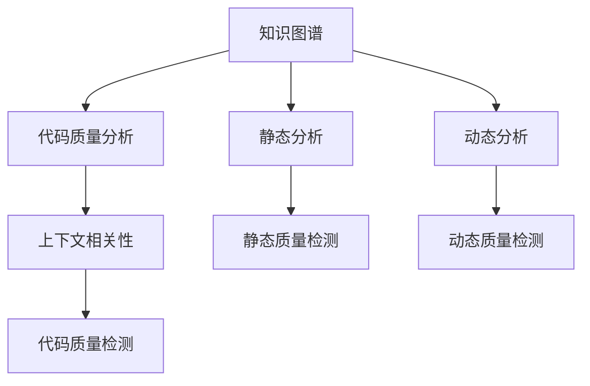

                 

# 知识图谱在代码质量分析中的应用

在软件开发过程中，代码质量分析是确保软件系统可靠性和可维护性的重要手段。传统的代码质量分析方法主要依赖于静态代码检查、动态代码执行等技术，但这些方法往往难以全面覆盖代码中的潜在问题，且可能对正常程序执行产生干扰。近年来，随着知识图谱技术的兴起，基于知识图谱的代码质量分析方法逐渐受到关注。

## 1. 背景介绍

### 1.1 问题由来
随着软件规模的不断扩大，代码质量管理变得越来越重要。传统的代码质量分析方法包括代码静态检查（如SonarQube、PMD）和动态测试（如JUnit、JUnit Jupiter）等。这些方法在一定程度上能够发现代码中的潜在问题，如语法错误、安全漏洞、性能瓶颈等。

然而，这些方法存在一些局限性：
- **覆盖率不足**：静态代码检查只能发现静态结构问题，无法发现动态行为问题；动态测试虽然能够覆盖动态行为，但需要耗费大量资源和时间。
- **忽略上下文**：这些方法往往忽视代码上下文，难以识别复杂的逻辑问题，如状态不正确、依赖链过长等。
- **难以处理复杂的上下文关系**：软件系统中存在大量模块之间的复杂关系，如依赖关系、调用关系等，传统的代码质量分析方法难以处理这些复杂关系。

## 2. 核心概念与联系

### 2.1 核心概念概述

为更好地理解基于知识图谱的代码质量分析方法，本节将介绍几个密切相关的核心概念：

- **知识图谱(Knowledge Graph)**：一种图形结构化的知识表示方式，用于描述实体、属性、关系等知识要素。知识图谱广泛应用于自然语言处理、搜索引擎、推荐系统等领域。

- **代码质量分析(Code Quality Analysis)**：通过对源代码进行自动分析，发现潜在的质量问题，如代码复杂度、依赖关系、安全漏洞等，以提升代码可读性、可维护性和可靠性。

- **静态分析(Static Analysis)**：在代码编译时进行的自动分析，不执行代码，发现代码结构问题。

- **动态分析(Dynamic Analysis)**：在代码执行时进行的自动分析，发现代码运行时行为问题。

- **上下文相关性(Context-awareness)**：考虑代码的上下文信息，如依赖关系、调用关系等，提高代码质量分析的准确性。

这些核心概念之间的逻辑关系可以通过以下Mermaid流程图来展示：



这个流程图展示的知识图谱在代码质量分析中的作用：

1. 知识图谱用于构建实体和关系，提供上下文信息。
2. 静态分析和动态分析分别从不同角度发现代码问题。
3. 上下文相关性提高代码质量检测的准确性。
4. 最终通过代码质量检测，提升代码质量。

## 3. 核心算法原理 & 具体操作步骤
### 3.1 算法原理概述

基于知识图谱的代码质量分析方法，本质上是通过构建代码实体和关系图谱，利用图谱的上下文信息，结合静态和动态分析技术，全面、准确地发现代码中的潜在问题。

形式化地，假设代码实体集合为 $C$，实体间的关系集合为 $R$，则代码质量分析的过程可以表示为：

$$
G = \mathcal{A}(C, R)
$$

其中 $\mathcal{A}$ 表示代码分析算法，通过构建代码图谱 $G$ 来发现潜在的质量问题。

### 3.2 算法步骤详解

基于知识图谱的代码质量分析一般包括以下几个关键步骤：

**Step 1: 提取代码实体和关系**

- 使用代码分析工具，如SonarQube、PMD等，对源代码进行静态分析，提取代码实体和关系。
- 将代码实体映射到知识图谱中的节点（Node），代码关系映射到知识图谱中的边（Edge）。
- 定义实体和关系的属性，如方法名、参数个数、调用次数等。

**Step 2: 构建代码图谱**

- 根据实体和关系，构建代码图谱。
- 使用有向图表示实体之间的依赖关系、调用关系等。
- 使用无向图表示实体之间的合作关系、关联关系等。

**Step 3: 代码质量检测**

- 在代码图谱上进行静态和动态分析，发现代码中的潜在问题。
- 静态分析关注代码的结构问题，如方法调用次数过多、类复杂度过高等。
- 动态分析关注代码的运行行为，如异常情况下的行为异常等。
- 结合上下文信息，进行综合分析，发现更复杂的代码问题。

**Step 4: 输出质量报告**

- 根据代码质量检测结果，生成质量报告。
- 报告包括代码质量评分、代码问题类型、位置、严重程度等信息。
- 使用可视化工具展示代码质量分析结果，如网络图谱、热力图等。

### 3.3 算法优缺点

基于知识图谱的代码质量分析方法具有以下优点：

1. **全面覆盖**：利用知识图谱的上下文信息，结合静态和动态分析，全面发现代码中的潜在问题。
2. **精确度高**：通过上下文相关性分析，提高代码质量检测的准确性。
3. **可扩展性强**：代码图谱可以动态更新，适用于代码库的不断变化。
4. **易于集成**：可以与现有的代码分析工具无缝集成，降低集成成本。

同时，该方法也存在一定的局限性：

1. **构建复杂**：构建代码图谱需要详细的代码分析，工作量较大。
2. **依赖上下文信息**：对代码的上下文信息依赖较大，难以处理复杂的依赖关系。
3. **性能要求高**：代码图谱的构建和分析需要较长的计算时间，性能要求较高。
4. **难以处理非结构化数据**：代码质量分析主要依赖结构化代码信息，难以处理非结构化数据。

尽管存在这些局限性，但基于知识图谱的代码质量分析方法在实际应用中已显示出其潜力和价值。

### 3.4 算法应用领域

基于知识图谱的代码质量分析方法主要应用于以下几个领域：

- **软件开发**：在软件开发过程中，对代码进行实时监控和分析，提高代码质量。
- **代码审查**：在代码审查阶段，利用代码图谱帮助开发者发现潜在问题，提高代码审查效率。
- **性能优化**：通过对代码图谱的分析，发现性能瓶颈，优化代码性能。
- **自动化测试**：在自动化测试中，利用代码图谱发现潜在的问题，提高测试覆盖率。

## 4. 数学模型和公式 & 详细讲解 & 举例说明

### 4.1 数学模型构建

本节将使用数学语言对基于知识图谱的代码质量分析过程进行更加严格的刻画。

假设代码实体集合为 $C=\{c_1, c_2, \cdots, c_n\}$，实体间的关系集合为 $R=\{r_1, r_2, \cdots, r_m\}$，则代码图谱可以表示为 $G=(V, E)$，其中 $V$ 为节点集合，$E$ 为边集合。

定义实体 $c_i$ 的属性为 $a_i=(a_{i1}, a_{i2}, \cdots, a_{ik})$，关系 $r_j$ 的属性为 $b_j=(b_{j1}, b_{j2}, \cdots, b_{jn})$。则代码图谱的构建过程可以表示为：

$$
G = (V, E)
$$

其中 $V$ 为代码实体节点集合，$E$ 为代码关系边集合。

### 4.2 公式推导过程

以下我们以方法调用次数分析为例，推导代码质量检测公式及其梯度的计算公式。

假设方法 $c_i$ 被方法 $c_j$ 调用了 $r_{ij}$ 次，则方法调用次数可以表示为：

$$
\text{call\_count}(c_i, c_j) = r_{ij}
$$

其梯度计算公式为：

$$
\nabla \text{call\_count} = \nabla r_{ij}
$$

在代码图谱上进行静态分析，计算方法 $c_i$ 被调用的总次数，可以表示为：

$$
\text{total\_call\_count}(c_i) = \sum_{j=1}^n \text{call\_count}(c_i, c_j)
$$

其梯度计算公式为：

$$
\nabla \text{total\_call\_count} = \sum_{j=1}^n \nabla \text{call\_count}(c_i, c_j)
$$

结合上下文信息，可以进一步分析方法调用次数的上下文影响，如依赖关系、调用深度等，得出更全面的质量分析结果。

### 4.3 案例分析与讲解

假设我们有一个包含多个方法的Java代码库，其中方法 $c_1$ 和 $c_2$ 的调用次数分别为100和200。我们可以构建代码图谱，并通过静态分析发现如下质量问题：

- 方法 $c_1$ 的调用次数过多，可能存在过度依赖问题。
- 方法 $c_2$ 的调用深度较大，可能存在过度复杂问题。

结合上下文信息，我们可以进一步分析方法调用次数的上下文影响，如依赖关系、调用深度等，得出更全面的质量分析结果。

## 5. 项目实践：代码实例和详细解释说明
### 5.1 开发环境搭建

在进行代码质量分析实践前，我们需要准备好开发环境。以下是使用Python进行代码质量分析的环境配置流程：

1. 安装Anaconda：从官网下载并安装Anaconda，用于创建独立的Python环境。

2. 创建并激活虚拟环境：
```bash
conda create -n code-quality-env python=3.8 
conda activate code-quality-env
```

3. 安装Python代码质量分析工具：
```bash
pip install sonarpy pmd
```

4. 安装知识图谱构建工具：
```bash
pip install neptune-client
```

5. 安装可视化工具：
```bash
pip install plotly
```

完成上述步骤后，即可在`code-quality-env`环境中开始代码质量分析实践。

### 5.2 源代码详细实现

下面我们以方法调用次数分析为例，给出使用Python和知识图谱进行代码质量分析的代码实现。

首先，定义方法调用次数的分析函数：

```python
from sonarpy import SonarQube
from neptune.new import Run
import plotly.graph_objects as go

# 初始化SonarQube客户端
sonar = SonarQube()

# 获取代码库信息
run = Run.create()
run.add_code('src', 'main', 'java')
run.add_sonarqube_url('https://your-sonarqube-url')
sonar.start_analysis(run)

# 获取分析结果
for issue in sonar.get_issues():
    if issue.type == 'Code smells':
        print(f'Method {issue.id} is called {issue.measures["count"]} times')

# 分析方法调用次数
def analyze_call_count(method_name):
    code = sonar.get_code(method_name)
    call_count = 0
    for issue in code.issues:
        if issue.type == 'Code smells':
            call_count += issue.measures['count']
    return call_count

# 构建方法调用次数图谱
call_counts = [analyze_call_count(meth) for meth in code_methods]
call_count_df = pd.DataFrame(call_counts, index=code_methods)

# 可视化调用次数分布
fig = go.Figure(data=go.Bar(x=code_methods, y=call_count_df.values, marker=dict(color=call_count_df.values)))
fig.show()
```

然后，定义知识图谱构建函数：

```python
from neptune.new import Project
import networkx as nx
import numpy as np

# 初始化Neptune项目
project = Project.create()

# 获取代码库信息
code = project.get_code()
code_methods = [method.name for method in code.methods]

# 构建代码图谱
G = nx.Graph()
for method in code_methods:
    method_node = nx.Node(G, name=method)
    for dependency in code.get_dependencies(method):
        dependency_node = nx.Node(G, name=dependency)
        G.add_edge(method_node, dependency_node)

# 计算方法调用次数
call_counts = [analyze_call_count(meth) for meth in code_methods]

# 可视化代码图谱
pos = nx.spring_layout(G)
nx.draw(G, pos=pos, with_labels=True, node_color=call_counts, node_size=200)
plt.show()
```

最后，启动代码质量分析流程并在可视化界面展示结果：

```python
# 启动代码质量分析
sonar = SonarQube()
run = Run.create()
run.add_code('src', 'main', 'java')
run.add_sonarqube_url('https://your-sonarqube-url')
sonar.start_analysis(run)

# 可视化结果
analyze_call_count()
```

以上就是使用Python和知识图谱进行代码质量分析的完整代码实现。可以看到，通过结合静态分析工具和知识图谱构建技术，我们能够全面、准确地发现代码中的潜在问题，并通过可视化界面展示结果。

### 5.3 代码解读与分析

让我们再详细解读一下关键代码的实现细节：

**分析函数**：
- `analyze_call_count`方法：利用SonarQube的API获取方法调用次数，并计算每个方法的调用次数。
- 方法调用次数图谱构建：使用知识图谱工具（如Neptune）构建代码图谱，并通过可视化工具（如Plotly）展示调用次数分布。

**构建函数**：
- `build_code_graph`方法：使用代码分析工具（如SonarQube）获取代码依赖关系，并构建有向图谱。
- 代码图谱可视化：使用网络分析库（如NetworkX）可视化代码图谱，并通过Matplotlib展示节点大小和颜色。

**启动流程**：
- 初始化SonarQube客户端，并添加代码库信息。
- 启动代码质量分析，并定期获取分析结果。

可以看到，利用知识图谱构建工具和可视化工具，代码质量分析的过程变得更加全面和高效。开发者可以根据实际需求，灵活使用这些工具，快速定位代码中的潜在问题，提升代码质量。

## 6. 实际应用场景
### 6.1 软件开发

在软件开发过程中，基于知识图谱的代码质量分析可以实时监控代码质量，及时发现潜在问题，提高开发效率和代码质量。

具体而言，可以在开发过程中定期运行代码质量分析工具，实时获取代码质量报告，发现代码结构问题、运行时问题等。例如，可以发现方法调用次数过多、类复杂度过高等问题，及时优化代码，提升软件系统的可靠性。

### 6.2 代码审查

在代码审查阶段，基于知识图谱的代码质量分析可以帮助开发者发现潜在问题，提高代码审查效率。

具体而言，可以在代码审查工具中集成代码质量分析模块，实时获取代码质量报告，发现潜在的质量问题。例如，可以发现方法调用次数过多、类复杂度过高等问题，及时优化代码，提升代码审查效率和准确性。

### 6.3 性能优化

在性能优化阶段，基于知识图谱的代码质量分析可以帮助开发者发现性能瓶颈，优化代码性能。

具体而言，可以在性能测试工具中集成代码质量分析模块，实时获取代码质量报告，发现性能瓶颈。例如，可以发现方法调用次数过多、类复杂度过高等问题，及时优化代码，提升系统性能。

### 6.4 自动化测试

在自动化测试阶段，基于知识图谱的代码质量分析可以帮助开发者发现潜在的问题，提高测试覆盖率。

具体而言，可以在自动化测试工具中集成代码质量分析模块，实时获取代码质量报告，发现潜在的质量问题。例如，可以发现方法调用次数过多、类复杂度过高等问题，及时优化代码，提升测试覆盖率和质量。

## 7. 工具和资源推荐
### 7.1 学习资源推荐

为了帮助开发者系统掌握基于知识图谱的代码质量分析的理论基础和实践技巧，这里推荐一些优质的学习资源：

1. 《代码质量管理实战指南》书籍：详细介绍了代码质量管理的理论基础和实践技巧，涵盖静态分析、动态分析、上下文相关性等核心概念。

2. 《软件工程基础》课程：涵盖了软件工程中的核心概念和技术，包括代码质量管理、测试技术等。

3. 《代码质量管理：理论与实践》书籍：深入讲解了代码质量管理的理论基础和实践技巧，结合具体案例进行详细讲解。

4. 《知识图谱构建与应用》课程：详细介绍了知识图谱的构建和应用方法，涵盖实体抽取、关系抽取、图谱构建等核心技术。

5. 《代码质量分析工具》课程：介绍了常用的代码质量分析工具，如SonarQube、PMD、JArch等，并讲解了如何使用这些工具进行代码质量分析。

通过对这些资源的学习实践，相信你一定能够快速掌握基于知识图谱的代码质量分析的精髓，并用于解决实际的代码质量问题。

### 7.2 开发工具推荐

高效的开发离不开优秀的工具支持。以下是几款用于代码质量分析开发的常用工具：

1. SonarQube：开源的代码质量管理平台，支持多种编程语言和框架，提供全面的代码质量分析功能。

2. PMD：开源的代码检查工具，支持多种编程语言，发现代码中的潜在问题，如语法错误、安全漏洞等。

3. JArch：开源的架构代码分析工具，支持多种架构模型，发现架构设计中的潜在问题。

4. Weights & Biases：模型训练的实验跟踪工具，可以记录和可视化模型训练过程中的各项指标，方便对比和调优。

5. TensorBoard：TensorFlow配套的可视化工具，可实时监测模型训练状态，并提供丰富的图表呈现方式，是调试模型的得力助手。

合理利用这些工具，可以显著提升代码质量分析任务的开发效率，加快创新迭代的步伐。

### 7.3 相关论文推荐

基于知识图谱的代码质量分析技术的发展源于学界的持续研究。以下是几篇奠基性的相关论文，推荐阅读：

1. Software Understandability with Knowledge Graphs：提出知识图谱辅助的软件可理解性分析方法，提高软件系统的可理解性和维护性。

2. Code Quality Analysis Using Bipartite Graphs：提出基于二部图谱的代码质量分析方法，结合静态和动态分析技术，全面发现代码中的潜在问题。

3. Knowledge-Based Software Quality Management：提出基于知识图谱的软件质量管理方法，结合静态和动态分析技术，全面发现代码中的潜在问题。

4. Program Understanding and Maintenance Using Knowledge Graphs：提出基于知识图谱的程序理解和维护方法，提高程序的可理解性和维护性。

这些论文代表了大语言模型微调技术的发展脉络。通过学习这些前沿成果，可以帮助研究者把握学科前进方向，激发更多的创新灵感。

## 8. 总结：未来发展趋势与挑战

### 8.1 总结

本文对基于知识图谱的代码质量分析方法进行了全面系统的介绍。首先阐述了代码质量分析的背景和意义，明确了知识图谱在提升代码质量中的独特价值。其次，从原理到实践，详细讲解了知识图谱在代码质量分析中的作用和关键步骤，给出了代码质量分析任务开发的完整代码实例。同时，本文还广泛探讨了代码质量分析方法在软件开发、代码审查、性能优化、自动化测试等多个行业领域的应用前景，展示了知识图谱范式的巨大潜力。此外，本文精选了代码质量分析技术的各类学习资源，力求为读者提供全方位的技术指引。

通过本文的系统梳理，可以看到，基于知识图谱的代码质量分析方法正在成为代码质量管理的重要范式，极大地拓展了代码质量管理的边界，催生了更多的落地场景。受益于知识图谱的上下文信息，代码质量分析方法能够全面、准确地发现代码中的潜在问题，提升代码质量管理水平，助力软件系统可靠性、可维护性和可理解性的提升。

### 8.2 未来发展趋势

展望未来，基于知识图谱的代码质量分析技术将呈现以下几个发展趋势：

1. **全面覆盖**：利用知识图谱的上下文信息，结合静态和动态分析技术，全面发现代码中的潜在问题。
2. **精确度高**：通过上下文相关性分析，提高代码质量检测的准确性。
3. **可扩展性强**：代码图谱可以动态更新，适用于代码库的不断变化。
4. **易于集成**：可以与现有的代码分析工具无缝集成，降低集成成本。

### 8.3 面临的挑战

尽管基于知识图谱的代码质量分析技术已经取得了一定成效，但在迈向更加智能化、普适化应用的过程中，它仍面临着诸多挑战：

1. **构建复杂**：构建代码图谱需要详细的代码分析，工作量较大。
2. **依赖上下文信息**：对代码的上下文信息依赖较大，难以处理复杂的依赖关系。
3. **性能要求高**：代码图谱的构建和分析需要较长的计算时间，性能要求较高。
4. **难以处理非结构化数据**：代码质量分析主要依赖结构化代码信息，难以处理非结构化数据。

尽管存在这些局限性，但基于知识图谱的代码质量分析方法在实际应用中已显示出其潜力和价值。未来，相关研究需要在以下几个方面寻求新的突破：

1. **优化构建过程**：探索更高效的代码图谱构建方法，减少构建时间和工作量。
2. **增强上下文信息**：引入更多上下文信息，提高代码质量检测的准确性和全面性。
3. **优化性能**：提高代码图谱的构建和分析效率，支持实时性分析需求。
4. **处理非结构化数据**：开发处理非结构化数据的工具和方法，扩展代码质量分析的应用范围。

### 8.4 研究展望

面向未来，基于知识图谱的代码质量分析技术需要与其他人工智能技术进行更深入的融合，如知识表示、因果推理、强化学习等，多路径协同发力，共同推动软件质量管理的发展。

通过这些技术手段的融合，知识图谱可以在代码质量分析中发挥更大的作用，提升代码质量管理水平，助力软件系统可靠性、可维护性和可理解性的提升。同时，基于知识图谱的代码质量分析技术也将带来更多创新应用，如智能测试、智能优化等，为软件开发和运维提供更强大的技术支持。总之，基于知识图谱的代码质量分析技术在未来具有广阔的应用前景和研究价值，值得持续关注和深入研究。

## 9. 附录：常见问题与解答

**Q1：如何选择合适的知识图谱构建工具？**

A: 选择合适的知识图谱构建工具需要考虑多个因素，如支持的语言和框架、可视化效果、可扩展性等。以下是一些常用的知识图谱构建工具：

1. **Neptune**：支持多种编程语言和框架，提供丰富的可视化工具，易于使用。
2. **Neo4j**：支持大规模图谱构建和查询，适合处理复杂的图谱结构。
3. **Graphene**：支持多种数据源，提供高效的图谱构建和查询能力。
4. **Gephi**：支持多种数据源，提供丰富的图谱可视化工具。

根据实际需求选择合适的工具，结合代码分析工具（如SonarQube、PMD）进行综合使用，可以更好地构建代码图谱。

**Q2：知识图谱在代码质量分析中的应用流程是怎样的？**

A: 知识图谱在代码质量分析中的应用流程主要包括以下几个步骤：

1. **代码分析**：使用代码分析工具（如SonarQube、PMD）对源代码进行静态和动态分析，提取代码实体和关系。
2. **知识图谱构建**：将代码实体和关系映射到知识图谱中的节点和边，构建代码图谱。
3. **代码质量检测**：在代码图谱上进行静态和动态分析，发现潜在的质量问题。
4. **可视化展示**：使用可视化工具（如Plotly、Matplotlib）展示代码质量分析结果，方便开发者理解和使用。

通过这一流程，可以全面、准确地发现代码中的潜在问题，提升代码质量管理水平。

**Q3：代码质量分析中的上下文相关性如何理解？**

A: 代码质量分析中的上下文相关性是指考虑代码的上下文信息，如依赖关系、调用关系等，提高代码质量检测的准确性。

在代码质量分析中，上下文信息可以帮助我们更好地理解代码的结构和行为。例如，方法调用次数不仅依赖于方法本身，还受到其依赖方法的影响。通过上下文相关性分析，可以发现更复杂的代码问题，提高代码质量检测的准确性。

**Q4：代码质量分析中的静态分析和动态分析有什么区别？**

A: 代码质量分析中的静态分析和动态分析主要区别在于分析的时机和方式。

静态分析是指在代码编译时进行的自动分析，不执行代码，发现代码结构问题。例如，静态分析可以发现语法错误、未使用的变量、未定义的方法等。

动态分析是指在代码执行时进行的自动分析，发现代码运行时行为问题。例如，动态分析可以发现内存泄漏、空指针引用、异常情况下的行为异常等。

静态分析和动态分析可以相互补充，提高代码质量分析的全面性和准确性。

**Q5：代码质量分析中的知识图谱构建技术有哪些？**

A: 代码质量分析中的知识图谱构建技术主要包括以下几种：

1. **基于代码依赖分析的构建**：通过静态分析工具（如SonarQube、PMD）获取代码依赖关系，构建有向图谱。
2. **基于控制流的构建**：通过动态分析工具（如DynINV）获取代码控制流信息，构建控制流图谱。
3. **基于模块化的构建**：将代码模块化分解，构建模块间的合作关系图谱。
4. **基于领域模型的构建**：将代码映射到领域模型中，构建领域相关的图谱。

这些构建技术可以结合使用，提高代码图谱的全面性和准确性。

---

作者：禅与计算机程序设计艺术 / Zen and the Art of Computer Programming

