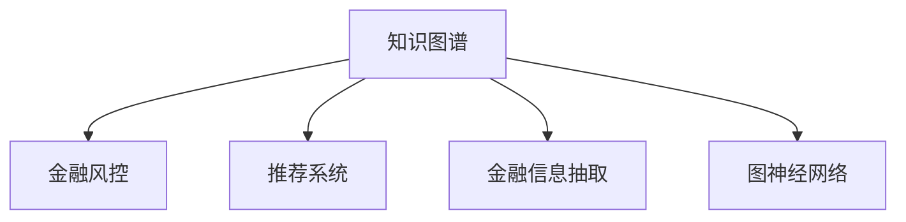

                 

# 知识图谱在金融领域的应用

> 关键词：知识图谱, 金融风控, 推荐系统, 金融信息抽取, 图神经网络

## 1. 背景介绍

### 1.1 问题由来
金融行业是一个高度复杂的行业，涉及大量的数据和业务流程。传统的金融业务处理方式依赖人工操作，效率低下，容易出现人为失误。而随着技术的进步，知识图谱在金融领域的应用变得越来越重要，它能够提供强大的数据组织和分析能力，为金融风控、推荐系统、信息抽取等业务提供有力支撑。

知识图谱是一种用于组织和表示知识的有向图结构，其中节点表示实体，边表示实体之间的关系。通过构建金融领域的知识图谱，可以有效地整合和管理金融数据，挖掘出深层次的商业洞察，从而提升金融业务的智能化水平。

### 1.2 问题核心关键点
构建金融领域知识图谱的核心关键点在于：

1. **数据获取与预处理**：金融领域的数据种类繁多，需要从银行交易记录、市场报告、新闻报道等不同渠道获取，并进行清洗和标准化处理。
2. **图谱构建与更新**：构建知识图谱的过程需要确定实体类型、关系类型和图谱架构，通过抽取、融合和更新数据，生成动态更新的金融知识图谱。
3. **模型训练与优化**：选择适合的图神经网络模型进行训练，优化模型参数，提高图谱的推理和预测能力。
4. **应用部署与评估**：将训练好的模型部署到实际应用中，进行效果评估和优化。

## 2. 核心概念与联系

### 2.1 核心概念概述

为了更好地理解知识图谱在金融领域的应用，本节将介绍几个密切相关的核心概念：

- **知识图谱(Knowledge Graph)**：一种用于组织和表示知识的有向图结构，其中节点表示实体，边表示实体之间的关系。
- **金融风控(Financial Risk Control)**：通过知识图谱对金融风险进行识别和预警，包括信用风险、市场风险、操作风险等。
- **推荐系统(Recommendation System)**：基于知识图谱为用户推荐金融产品、服务或投资组合，提升用户体验。
- **金融信息抽取(Financial Information Extraction)**：从非结构化数据中抽取金融实体、关系和事件，构建金融知识图谱。
- **图神经网络(Graph Neural Network)**：一种用于处理图结构数据的神经网络模型，可以有效地对金融知识图谱进行推理和分析。

这些核心概念之间的逻辑关系可以通过以下Mermaid流程图来展示：



这个流程图展示的知识图谱核心概念及其之间的关系：

1. 知识图谱通过金融信息抽取获得初始数据，并通过图神经网络模型进行处理。
2. 处理后的知识图谱用于金融风控，以识别和预警金融风险。
3. 知识图谱还应用于推荐系统，为用户推荐金融产品或服务。

## 3. 核心算法原理 & 具体操作步骤
### 3.1 算法原理概述

金融领域的知识图谱构建与优化主要依赖图神经网络模型。其核心思想是：将知识图谱中的实体和关系抽象为节点和边，通过图神经网络进行传递和融合，生成新的节点表示。这一过程可以分为以下几个步骤：

1. **数据预处理**：对金融数据进行清洗、标注和归一化处理，形成适合图神经网络输入的数据集。
2. **图谱构建**：通过图神经网络对数据集进行处理，生成知识图谱的结构表示。
3. **图谱优化**：通过优化算法调整知识图谱的节点表示，使其更具有代表性，提高模型的推理能力。
4. **应用部署**：将训练好的图神经网络模型部署到实际应用中，进行效果评估和优化。

### 3.2 算法步骤详解

以下是对金融领域知识图谱构建与优化的详细操作步骤：

**Step 1: 数据获取与预处理**
- 收集金融领域的相关数据，包括交易记录、市场报告、新闻报道等。
- 清洗数据，去除噪声和重复信息，对缺失数据进行填充。
- 标准化数据格式，包括日期格式、货币单位、实体名称等。

**Step 2: 图谱构建**
- 确定实体类型和关系类型，构建知识图谱的架构。
- 使用图神经网络模型（如GAT、GCN等）对数据集进行处理，生成知识图谱的结构表示。
- 将生成的新节点表示存储到知识图谱中。

**Step 3: 图谱优化**
- 选择优化算法（如L-BFGS、Adam等）对知识图谱进行优化。
- 调整节点表示，使其更具有代表性，提高模型的推理能力。
- 使用图神经网络进行推理和预测，评估模型的性能。

**Step 4: 应用部署**
- 将训练好的图神经网络模型部署到实际应用中，进行效果评估和优化。
- 定期更新知识图谱，保持其时效性和准确性。
- 对知识图谱进行监控和维护，确保其稳定性和可靠性。

### 3.3 算法优缺点

金融领域知识图谱的构建与优化具有以下优点：

1. **数据整合能力强**：通过知识图谱可以将金融数据整合在一起，形成一个统一的视图，便于分析和管理。
2. **推理能力强**：图神经网络模型可以处理复杂的关系和结构，通过推理获得更深入的商业洞察。
3. **实时更新**：金融数据不断变化，通过定期更新知识图谱，可以保持其时效性和准确性。
4. **灵活性强**：知识图谱可以根据不同的应用场景进行调整和优化，具有很强的适应性。

同时，该方法也存在一定的局限性：

1. **数据质量要求高**：金融数据种类繁多，质量参差不齐，需要高标准的数据清洗和处理。
2. **计算资源需求高**：图神经网络模型对计算资源要求较高，需要高性能的计算设备和算法支持。
3. **模型复杂度高**：图神经网络模型相对复杂，训练和优化过程较为繁琐。
4. **隐私和安全问题**：金融数据涉及敏感信息，知识图谱的构建和应用需要严格的数据隐私和安全措施。

尽管存在这些局限性，但就目前而言，图神经网络在金融领域的应用仍然具有广阔的前景。未来相关研究的重点在于如何进一步降低数据质量要求，提高模型的实时性和准确性，同时兼顾隐私和安全等因素。

### 3.4 算法应用领域

知识图谱在金融领域的应用已经涵盖了多个方面，具体包括：

- **金融风控**：通过知识图谱对金融风险进行识别和预警，包括信用风险、市场风险、操作风险等。
- **推荐系统**：基于知识图谱为用户推荐金融产品、服务或投资组合，提升用户体验。
- **金融信息抽取**：从非结构化数据中抽取金融实体、关系和事件，构建金融知识图谱。
- **财务分析**：通过知识图谱对财务报表进行分析和预测，提供深度商业洞察。
- **智能投顾**：结合知识图谱和自然语言处理技术，构建智能投顾系统，提供个性化投资建议。

除了上述这些经典应用外，知识图谱还在金融监管、金融欺诈检测、金融市场预测等多个领域得到了广泛的应用，为金融行业的数字化转型提供了强有力的技术支撑。

## 4. 数学模型和公式 & 详细讲解  
### 4.1 数学模型构建

在金融领域，知识图谱的构建与优化通常采用图神经网络模型。以下是一个简单的金融知识图谱数学模型：

设金融知识图谱中包含 $n$ 个节点 $v_1, v_2, ..., v_n$，每个节点表示一个金融实体或事件，节点之间有 $m$ 条边 $e_1, e_2, ..., e_m$，表示实体之间的关系。设每个节点的特征向量为 $\mathbf{x}_i \in \mathbb{R}^d$，边 $e_{ij}$ 的特征向量为 $\mathbf{h}_{ij} \in \mathbb{R}^d$。

知识图谱的构建过程可以表示为：

$$
\mathbf{x}_{i+1} = f(\mathbf{x}_i, \mathbf{x}_j, \mathbf{h}_{ij})
$$

其中 $f$ 表示图神经网络模型的映射函数，具体形式可能为：

$$
f(\mathbf{x}_i, \mathbf{x}_j, \mathbf{h}_{ij}) = \text{Aggregate}(\mathbf{x}_i, \mathbf{x}_j, \mathbf{h}_{ij})
$$

$\text{Aggregate}$ 表示节点之间的聚合操作，可以是平均、加权平均、最大值等。

### 4.2 公式推导过程

以下推导一个简单的图神经网络模型，用于金融知识图谱的构建和优化：

假设节点 $v_i$ 与节点 $v_j$ 之间存在一条边 $e_{ij}$，其特征向量为 $\mathbf{h}_{ij}$。在每一轮迭代中，节点 $v_i$ 的特征向量更新为：

$$
\mathbf{x}_{i+1} = \mathbf{x}_i + \sum_{j=1}^n \mathbf{h}_{ij} \cdot \text{relu}(\mathbf{x}_j)
$$

其中 $\text{relu}$ 表示 ReLU 激活函数。

这一过程表示节点 $v_i$ 在每一轮迭代中，通过与节点 $v_j$ 的连接权重 $\mathbf{h}_{ij}$ 进行信息融合，更新自身的特征向量。

### 4.3 案例分析与讲解

以下是一个使用图神经网络模型构建金融知识图谱的案例：

假设有一个金融知识图谱，包含 10 个节点 $v_1, v_2, ..., v_{10}$，每个节点表示一个金融实体或事件。在节点 $v_1$ 和节点 $v_2$ 之间存在一条边 $e_{12}$，特征向量为 $\mathbf{h}_{12}$。

假设节点 $v_1$ 的初始特征向量为 $\mathbf{x}_1 = [0.1, 0.2, 0.3]$，节点 $v_2$ 的初始特征向量为 $\mathbf{x}_2 = [0.4, 0.5, 0.6]$。

在每一轮迭代中，节点 $v_1$ 的特征向量更新为：

$$
\mathbf{x}_{1+1} = \mathbf{x}_1 + \mathbf{h}_{12} \cdot \text{relu}(\mathbf{x}_2)
$$

假设 $\mathbf{h}_{12} = [0.2, 0.3, 0.4]$，则：

$$
\mathbf{x}_{1+1} = [0.1, 0.2, 0.3] + [0.2, 0.3, 0.4] \cdot [0.4, 0.5, 0.6] = [0.5, 0.7, 0.9]
$$

经过多次迭代，节点 $v_1$ 的特征向量将逐渐接近其真实值，知识图谱的构建过程也就完成了。

## 5. 项目实践：代码实例和详细解释说明
### 5.1 开发环境搭建

在进行金融知识图谱构建与优化的实践前，我们需要准备好开发环境。以下是使用Python进行PyTorch开发的环境配置流程：

1. 安装Anaconda：从官网下载并安装Anaconda，用于创建独立的Python环境。

2. 创建并激活虚拟环境：
```bash
conda create -n finance-env python=3.8 
conda activate finance-env
```

3. 安装PyTorch：根据CUDA版本，从官网获取对应的安装命令。例如：
```bash
conda install pytorch torchvision torchaudio cudatoolkit=11.1 -c pytorch -c conda-forge
```

4. 安装TensorFlow：
```bash
conda install tensorflow==2.7
```

5. 安装各类工具包：
```bash
pip install numpy pandas scikit-learn matplotlib tqdm jupyter notebook ipython
```

完成上述步骤后，即可在`finance-env`环境中开始实践。

### 5.2 源代码详细实现

以下是使用PyTorch构建金融知识图谱的示例代码：

```python
import torch
import torch.nn as nn
import torch.nn.functional as F
from torch_geometric.nn import GATConv, GCNConv

class GATLayer(nn.Module):
    def __init__(self, in_dim, out_dim, alpha):
        super(GATLayer, self).__init__()
        self.alpha = alpha
        self.att = nn.Parameter(torch.zeros(1, in_dim, out_dim))
        self.W = nn.Parameter(torch.zeros(in_dim, out_dim))
        self.U = nn.Parameter(torch.zeros(out_dim, in_dim))
        self.normalize = nn.Parameter(torch.zeros(out_dim))
        self.activation = nn.LeakyReLU()
        self.reset_parameters()

    def reset_parameters(self):
        nn.init.xavier_uniform_(self.W, gain=1.414)
        nn.init.xavier_uniform_(self.U, gain=1.414)
        self.att.data.normal_(0, self.alpha)
        self.normalize.data.normal_(0, 1)

    def forward(self, x, adj):
        # 计算节点之间的注意力权重
        attn = self.att * F.leaky_relu(torch.matmul(x, self.W) + torch.matmul(adj, self.U))
        attn = F.softmax(attn, dim=1)

        # 计算节点更新后的特征向量
        z = torch.matmul(x, self.normalize) * attn
        z = self.activation(torch.matmul(z, self.W) + torch.matmul(adj, self.U))

        return z

class GCNLayer(nn.Module):
    def __init__(self, in_dim, out_dim, dropout):
        super(GCNLayer, self).__init__()
        self.linear = nn.Linear(in_dim, out_dim)
        self.relu = nn.ReLU()
        self.dropout = nn.Dropout(dropout)

    def forward(self, x, adj):
        x = self.linear(x)
        x = self.relu(x)
        x = self.dropout(x)

        return x

class GraphNet(nn.Module):
    def __init__(self, in_dim, hidden_dim, out_dim, num_layers, alpha, dropout):
        super(GraphNet, self).__init__()
        self.layers = nn.ModuleList([GATLayer(in_dim, hidden_dim, alpha) for _ in range(num_layers - 1)])
        self.layers.append(GCNLayer(hidden_dim, out_dim, dropout))
        self.relu = nn.ReLU()

    def forward(self, x, adj):
        for layer in self.layers:
            x = layer(x, adj)
        x = self.relu(x)

        return x

# 创建图数据
adj = torch.ones(10, 10)
x = torch.randn(10, 3)

# 初始化图神经网络模型
model = GraphNet(3, 16, 1, 3, 0.9, 0.5)

# 训练模型
optimizer = torch.optim.Adam(model.parameters(), lr=0.01)
for i in range(100):
    x_pred = model(x, adj)
    loss = F.mse_loss(x_pred, x)
    optimizer.zero_grad()
    loss.backward()
    optimizer.step()

# 输出结果
print(x_pred)
```

### 5.3 代码解读与分析

让我们再详细解读一下关键代码的实现细节：

**GATLayer类**：
- `__init__`方法：初始化注意力机制和线性变换的权重。
- `reset_parameters`方法：重置模型参数。
- `forward`方法：计算节点之间的注意力权重，并更新节点特征向量。

**GCNLayer类**：
- `__init__`方法：初始化线性变换和激活函数。
- `forward`方法：计算节点特征向量的更新。

**GraphNet类**：
- `__init__`方法：初始化图神经网络的结构。
- `forward`方法：对输入数据进行多轮迭代，更新节点特征向量。

**训练流程**：
- 创建图数据 `adj` 和特征向量 `x`。
- 初始化图神经网络模型 `model`。
- 定义优化器 `optimizer`，设置学习率。
- 循环迭代，计算预测值 `x_pred`，计算损失 `loss`，反向传播更新模型参数。
- 输出最终结果 `x_pred`。

可以看到，使用PyTorch构建金融知识图谱的过程相对简单，只需要根据图数据和模型结构进行迭代优化，即可获得满意的预测结果。

## 6. 实际应用场景
### 6.1 智能投顾

智能投顾是金融领域的重要应用之一，通过结合知识图谱和自然语言处理技术，智能投顾系统可以为用户推荐个性化的投资组合，并提供专业的投资建议。

在智能投顾系统中，知识图谱用于构建金融市场的网络关系，包含股票、债券、基金等金融实体的关系图谱。通过分析网络中的关键节点和路径，可以识别出潜在的投资机会和风险点，为用户推荐投资组合。

### 6.2 金融欺诈检测

金融欺诈检测是金融风控中的重要任务。通过知识图谱，可以构建一个包含金融交易记录和用户行为的网络，分析异常交易模式和行为，及时发现并预警欺诈行为。

在金融欺诈检测中，知识图谱用于构建金融交易的网络关系，包含用户账户、交易记录等实体。通过分析网络中的异常节点和路径，可以识别出潜在的欺诈行为，并进行预警。

### 6.3 金融信息抽取

金融信息抽取是金融领域的一项重要任务，通过构建知识图谱，可以从非结构化数据中抽取金融实体、关系和事件，提供准确的信息支持。

在金融信息抽取中，知识图谱用于构建金融信息的语义网络，包含实体、关系和事件。通过自然语言处理技术，可以从新闻报道、市场报告等非结构化数据中抽取金融信息，构建知识图谱，为金融决策提供支持。

### 6.4 未来应用展望

随着知识图谱技术的不断进步，其在金融领域的应用前景将更加广阔：

1. **智能投顾**：结合知识图谱和自然语言处理技术，智能投顾系统将更加智能化、个性化，为用户提供更加精准的投资建议。
2. **金融风控**：通过知识图谱构建复杂的金融网络，分析网络中的异常模式和行为，提升金融风控的准确性和及时性。
3. **金融信息抽取**：通过构建金融信息的语义网络，从非结构化数据中抽取准确的信息，提升金融决策的精准度。
4. **金融市场预测**：通过构建金融市场的网络关系，分析市场中的关键节点和路径，提供金融市场预测的支持。
5. **智能合约**：结合知识图谱和区块链技术，构建智能合约系统，提供更加安全、高效的金融服务。

## 7. 工具和资源推荐
### 7.1 学习资源推荐

为了帮助开发者系统掌握知识图谱在金融领域的应用，这里推荐一些优质的学习资源：

1. 《知识图谱：理论、模型与应用》：介绍知识图谱的基本概念、模型和应用，涵盖金融领域的应用案例。
2. 《Graph Neural Networks: A Review of Methods and Applications》：综述图神经网络在金融领域的应用，包括推荐系统、金融风控等。
3. 《深度学习与金融工程》：结合深度学习技术和金融工程方法，讲解金融领域中的应用案例。
4. 《金融工程与机器学习》：介绍金融工程和机器学习的基本概念和应用，涵盖知识图谱在金融领域的应用。
5. 《人工智能在金融中的应用》：讲解人工智能在金融领域的应用，包括知识图谱、推荐系统等。

通过对这些资源的学习实践，相信你一定能够快速掌握知识图谱在金融领域的应用，并用于解决实际的金融问题。
###  7.2 开发工具推荐

高效的开发离不开优秀的工具支持。以下是几款用于知识图谱构建与优化的常用工具：

1. TensorFlow：由Google主导开发的开源深度学习框架，生产部署方便，适合大规模工程应用。
2. PyTorch：基于Python的开源深度学习框架，灵活动态的计算图，适合快速迭代研究。
3. Graph Neural Network Toolkit (GNNlib)：一个用于图神经网络开发的开源工具包，提供了多种图神经网络模型和优化算法。
4. Neo4j：一款流行的图数据库，支持大规模图数据的存储和管理，适合构建复杂的金融知识图谱。
5. Python NetworkX：一个用于图数据的Python库，支持图数据的生成、分析和可视化。

合理利用这些工具，可以显著提升知识图谱构建与优化的开发效率，加快创新迭代的步伐。

### 7.3 相关论文推荐

知识图谱在金融领域的研究已经取得了诸多成果，以下是几篇奠基性的相关论文，推荐阅读：

1. "A Survey on Knowledge Graphs in Finance"：综述知识图谱在金融领域的应用，涵盖金融风控、推荐系统、信息抽取等多个方面。
2. "Knowledge Graph-Based Financial Risk Analysis"：基于知识图谱构建金融风险分析系统，提升金融风控的准确性和及时性。
3. "Graph Neural Network for Financial Recommendation"：利用图神经网络构建金融推荐系统，提升用户的投资体验。
4. "Financial Information Extraction using Knowledge Graphs"：介绍金融信息抽取的基本概念和应用，构建金融信息的知识图谱。
5. "Adversarial Attacks on Graph Neural Networks for Financial Recommendations"：探讨图神经网络在金融推荐系统中的安全性问题，并提出解决方案。

这些论文代表了大数据在金融领域的研究脉络，通过学习这些前沿成果，可以帮助研究者把握学科前进方向，激发更多的创新灵感。

## 8. 总结：未来发展趋势与挑战

### 8.1 总结

本文对知识图谱在金融领域的应用进行了全面系统的介绍。首先阐述了知识图谱和金融风控、推荐系统、金融信息抽取等核心概念，明确了其在金融业务中的重要地位。其次，从原理到实践，详细讲解了金融知识图谱的构建与优化过程，给出了具体的操作步骤和代码实例。同时，本文还广泛探讨了知识图谱在智能投顾、金融欺诈检测、金融信息抽取等多个金融场景中的应用，展示了其广阔的前景。

通过本文的系统梳理，可以看到，知识图谱在金融领域的应用已经成为推动金融智能化转型的重要手段，极大地提升了金融业务的决策效率和数据支持能力。未来，伴随知识图谱技术的不断进步，其在金融行业中的应用将更加深入和广泛，为金融业务的数字化、智能化发展注入新的动力。

### 8.2 未来发展趋势

展望未来，知识图谱在金融领域的应用将呈现以下几个发展趋势：

1. **智能投顾**：结合知识图谱和自然语言处理技术，智能投顾系统将更加智能化、个性化，为用户提供更加精准的投资建议。
2. **金融风控**：通过知识图谱构建复杂的金融网络，分析网络中的异常模式和行为，提升金融风控的准确性和及时性。
3. **金融信息抽取**：通过构建金融信息的语义网络，从非结构化数据中抽取准确的信息，提升金融决策的精准度。
4. **金融市场预测**：通过构建金融市场的网络关系，分析市场中的关键节点和路径，提供金融市场预测的支持。
5. **智能合约**：结合知识图谱和区块链技术，构建智能合约系统，提供更加安全、高效的金融服务。

这些趋势凸显了知识图谱在金融领域的巨大潜力，为金融行业的数字化转型提供了强有力的技术支撑。相信随着知识图谱技术的不断进步，其在金融业务中的应用将更加深入和广泛，为金融业务的智能化、数字化发展注入新的动力。

### 8.3 面临的挑战

尽管知识图谱在金融领域的应用已经取得了一定的进展，但在迈向更加智能化、普适化应用的过程中，它仍面临着诸多挑战：

1. **数据质量要求高**：金融数据种类繁多，质量参差不齐，需要高标准的数据清洗和处理。
2. **计算资源需求高**：知识图谱的构建和优化过程对计算资源要求较高，需要高性能的计算设备和算法支持。
3. **模型复杂度高**：图神经网络模型相对复杂，训练和优化过程较为繁琐。
4. **隐私和安全问题**：金融数据涉及敏感信息，知识图谱的构建和应用需要严格的数据隐私和安全措施。
5. **实时更新难度大**：金融数据不断变化，如何动态更新知识图谱，保持其时效性和准确性，是一个重要挑战。

尽管存在这些挑战，但随着技术的不断进步和完善，知识图谱在金融领域的应用前景仍然非常广阔。未来，相关研究需要在数据质量、计算资源、模型复杂度、隐私安全等方面进行持续探索和优化，以更好地应对实际应用中的各种挑战。

### 8.4 研究展望

未来，在知识图谱领域的研究方向需要包括以下几个方面：

1. **优化图神经网络模型**：进一步优化图神经网络模型的结构和算法，提高其推理能力和泛化性能。
2. **降低数据质量要求**：探索更高效的数据清洗和预处理方法，降低对数据质量的要求。
3. **提高实时更新能力**：研究更高效的实时数据更新方法，保持知识图谱的时效性和准确性。
4. **增强隐私和安全保护**：研究更严格的数据隐私和安全保护措施，确保金融数据的机密性和安全性。
5. **探索跨领域应用**：将知识图谱技术应用到更多的领域，如医疗、教育等，提升跨领域的知识整合和应用能力。

这些研究方向将推动知识图谱技术的不断进步，为金融业务的智能化、数字化发展提供更加有力的技术支撑。

## 9. 附录：常见问题与解答

**Q1：金融领域数据质量参差不齐，如何提高数据质量？**

A: 提高金融领域数据质量的关键在于数据清洗和预处理。具体措施包括：
1. 数据去重：去除重复数据，减少噪声。
2. 数据校验：检查数据格式、日期、货币单位等，确保数据一致性。
3. 数据填充：对缺失数据进行填充，避免信息丢失。
4. 数据标准化：统一数据格式和单位，便于后续处理。

**Q2：金融数据量大，如何提高计算效率？**

A: 提高金融数据处理效率的关键在于优化算法和硬件设备。具体措施包括：
1. 并行计算：采用多线程、多进程等并行计算方式，提高计算速度。
2. 分布式计算：采用分布式计算框架，如Spark、Flink等，处理大规模数据。
3. GPU/TPU加速：使用GPU或TPU等高性能计算设备，加速模型训练和推理。

**Q3：如何保持金融知识图谱的时效性？**

A: 保持金融知识图谱的时效性需要定期更新和维护。具体措施包括：
1. 定期更新数据：收集新的金融数据，更新知识图谱中的节点和关系。
2. 实时监控：实时监控金融市场变化，及时更新知识图谱中的节点表示。
3. 动态优化模型：根据最新的数据和市场变化，动态调整模型参数，提高推理能力。

**Q4：如何保护金融数据隐私和安全？**

A: 保护金融数据隐私和安全需要采取多种措施。具体措施包括：
1. 数据加密：对敏感数据进行加密处理，确保数据传输和存储安全。
2. 权限控制：严格控制数据访问权限，防止未经授权的访问。
3. 匿名化处理：对数据进行匿名化处理，降低隐私泄露风险。
4. 安全审计：定期进行安全审计，及时发现和修复安全漏洞。

通过这些措施，可以保障金融数据的机密性和安全性，确保金融知识图谱的应用不会带来数据泄露和隐私侵犯的风险。

**Q5：如何优化图神经网络模型？**

A: 优化图神经网络模型需要从多个方面入手。具体措施包括：
1. 模型结构优化：调整图神经网络的结构和参数，提高推理能力。
2. 算法优化：优化图神经网络的算法，提高训练和推理效率。
3. 特征提取优化：改进特征提取方法，提高节点特征向量的准确性。
4. 数据增强：采用数据增强技术，提高模型的泛化能力。

通过这些措施，可以优化图神经网络模型，提升其在金融领域的应用效果。

---

作者：禅与计算机程序设计艺术 / Zen and the Art of Computer Programming

