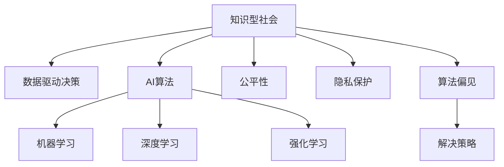

                 

# 知识型社会的特征与挑战

> 关键词：知识型社会, AI, 数据驱动, 算法自动化, 伦理道德, 公平性, 隐私保护

## 1. 背景介绍

### 1.1 问题由来
随着科技的迅猛发展，知识型社会的概念逐步深入人心。传统农业社会和工业社会主要依赖体力劳动和资源驱动，而知识型社会则更多依赖脑力劳动和技术驱动。在信息时代，知识和信息成为了最重要的生产要素之一，智能化和自动化技术在各个领域得到广泛应用，极大地提升了社会生产效率和人民生活质量。然而，在知识型社会的建设过程中，也面临诸多挑战，如AI伦理、隐私保护、公平性等。本文将深入探讨知识型社会的特征与挑战，并尝试提出一些解决策略。

### 1.2 问题核心关键点
知识型社会的核心特征是高度智能化和信息化。具体而言，以下几方面反映了知识型社会的基本特征：

- **数据驱动决策**：决策和规划更多依赖于数据分析和模型预测，而非经验判断。
- **AI自动化**：自动化技术在生产、服务和管理等领域广泛应用，大幅提升了效率和精度。
- **算法优化**：通过不断优化算法模型，提高系统的预测准确率和响应速度。
- **人机协作**：人工智能与人类的协作不断深化，提升了整体工作效率。
- **知识共享**：知识共享平台和知识图谱的建设，促进了知识传播和创新。

与此同时，知识型社会也面临着诸多挑战，如算法偏见、隐私侵犯、公平性问题等。如何平衡技术进步与社会伦理，是知识型社会建设过程中必须面对的问题。

## 2. 核心概念与联系

### 2.1 核心概念概述

为更好地理解知识型社会的特征与挑战，本节将介绍几个密切相关的核心概念：

- **知识型社会**：以知识和信息为核心驱动力的社会形态，依赖于高度自动化和智能化的技术，促进了生产力和社会进步。
- **AI算法**：指用于自动化决策、智能控制等任务的计算机程序，包括机器学习、深度学习、强化学习等各类算法。
- **数据驱动决策**：利用大数据和数据分析技术，支持决策制定和政策优化。
- **公平性**：指技术应用过程中的伦理和法律约束，保证所有群体都能公平受益。
- **隐私保护**：指在数据收集、处理和应用过程中，保护个人隐私权益，防止信息泄露和滥用。
- **算法偏见**：指算法模型在训练和应用过程中，存在对某些群体或属性的不公平对待。

这些核心概念之间的逻辑关系可以通过以下Mermaid流程图来展示：



这个流程图展示出知识型社会的核心概念及其之间的关系：

1. 知识型社会依赖于数据驱动决策，AI算法是其重要工具。
2. 数据驱动决策需要高度自动化和智能化的算法模型作为支撑。
3. 算法模型在公平性、隐私保护和偏见避免等方面面临诸多伦理和法律约束。
4. 解决策略需在算法优化、数据治理、伦理规范等方面协同发力。

## 3. 核心算法原理 & 具体操作步骤
### 3.1 算法原理概述

知识型社会的核心算法原理主要依赖于数据驱动和AI技术，通过算法模型自动处理和分析海量数据，支持决策制定和智能化控制。

在知识型社会中，核心算法包括：

- **机器学习算法**：基于数据训练模型，用于分类、回归、聚类等任务，支持智能决策。
- **深度学习算法**：通过多层神经网络模拟人类认知过程，适用于图像、语音、自然语言处理等复杂任务。
- **强化学习算法**：通过与环境的交互，训练智能体做出最优决策，广泛应用于游戏、机器人等领域。

这些算法的核心原理是，通过优化模型参数，使得模型能够最大程度拟合数据，从而支持智能化和自动化决策。

### 3.2 算法步骤详解

以机器学习算法为例，其核心步骤包括：

1. **数据预处理**：对原始数据进行清洗、归一化和特征选择等预处理操作，以提高模型训练效果。
2. **模型训练**：利用数据集训练模型，通过梯度下降等优化算法不断更新模型参数。
3. **模型评估**：使用验证集或测试集评估模型性能，通过交叉验证等方法确保模型泛化能力。
4. **模型应用**：将训练好的模型应用于实际问题，进行预测或分类等任务。

具体步骤如下：

1. **数据准备**：收集、清洗和标注数据集，确保数据质量。
2. **模型选择**：根据任务需求选择合适的算法模型，如决策树、随机森林、支持向量机等。
3. **模型训练**：将数据集划分为训练集和验证集，使用训练集训练模型，在验证集上调整模型参数。
4. **模型评估**：在测试集上评估模型性能，如准确率、召回率、F1分数等。
5. **模型部署**：将训练好的模型部署到生产环境，进行实际应用。

### 3.3 算法优缺点

知识型社会的核心算法具有以下优点：

1. **高效准确**：通过自动化和智能化手段，算法可以快速处理大量数据，提高决策效率和准确性。
2. **灵活可扩展**：算法模型可以不断优化和扩展，适应新的数据和任务需求。
3. **数据驱动**：算法基于大量数据进行训练，能够从海量信息中提取有价值的模式和规律。
4. **模型可解释**：许多现代算法（如决策树、线性回归等）能够提供可解释的模型输出，便于理解和调试。

但这些算法也存在一些缺点：

1. **数据依赖性强**：算法的效果高度依赖于数据的质量和数量，数据偏差可能导致算法偏见。
2. **模型复杂度高**：深度学习等算法模型通常结构复杂，训练和推理成本高。
3. **算法鲁棒性差**：在面对噪声数据或异常情况时，算法容易产生误判。
4. **算法不透明**：黑盒模型（如深度学习）难以解释其内部工作机制，难以进行调试和优化。

### 3.4 算法应用领域

知识型社会的核心算法广泛应用于各个领域，如金融、医疗、制造、零售、交通等。具体而言：

- **金融领域**：通过机器学习和深度学习算法，进行风险评估、信用评分、投资预测等。
- **医疗领域**：利用算法进行疾病诊断、药物研发、患者监测等。
- **制造业**：应用算法优化生产流程、质量控制、供应链管理等。
- **零售行业**：通过算法优化库存管理、价格策略、客户推荐等。
- **交通运输**：利用算法优化交通流量、路线规划、自动驾驶等。

此外，在智慧城市、智慧农业、智能家居等新兴领域，算法也发挥了重要作用，推动了相关技术的发展。

## 4. 数学模型和公式 & 详细讲解  
### 4.1 数学模型构建

在知识型社会中，算法模型通常依赖于数据驱动决策。以下以线性回归为例，展示其数学模型构建过程：

假设我们有一组训练数据集 $(x_i,y_i)$，其中 $x_i$ 为自变量，$y_i$ 为因变量。线性回归模型的目标是找到一个线性函数 $y=\hat{y}=\theta_0+\theta_1x$，使得预测值 $\hat{y}$ 尽量接近真实值 $y$。

记损失函数为 $L(\theta) = \frac{1}{2} \sum_{i=1}^n (y_i - \hat{y}_i)^2$，最小化损失函数可以得到最优参数：

$$
\theta^* = \mathop{\arg\min}_{\theta} L(\theta)
$$

通过求偏导数，可以得到参数更新公式：

$$
\theta_j = \theta_j - \eta \frac{1}{n} \sum_{i=1}^n (y_i - \hat{y}_i)x_{ij}
$$

其中 $\eta$ 为学习率，用于控制参数更新的幅度。

### 4.2 公式推导过程

以线性回归为例，推导其参数更新公式。

记 $J(\theta) = \frac{1}{2} \sum_{i=1}^n (y_i - \theta_0 - \theta_1 x_i)^2$，求其最小值。对 $\theta_0$ 和 $\theta_1$ 分别求偏导数：

$$
\frac{\partial J}{\partial \theta_0} = \sum_{i=1}^n (y_i - \theta_0 - \theta_1 x_i) = 0
$$

$$
\frac{\partial J}{\partial \theta_1} = \sum_{i=1}^n -2(y_i - \theta_0 - \theta_1 x_i)x_i = 0
$$

解以上方程组，可以得到：

$$
\theta_0 = \bar{y} - \theta_1 \bar{x}
$$

$$
\theta_1 = \frac{\sum_{i=1}^n (y_i - \bar{y})x_i}{\sum_{i=1}^n (x_i - \bar{x})^2}
$$

其中 $\bar{x}$ 和 $\bar{y}$ 分别为样本均值。

### 4.3 案例分析与讲解

以房价预测为例，展示线性回归模型的应用。

假设我们有 $N$ 个房屋的面积和价格数据，其中 $x_i$ 为房屋面积，$y_i$ 为房价。我们可以使用线性回归模型 $y = \theta_0 + \theta_1 x$ 来预测房价。

首先，对数据进行标准化处理，使得 $x_i$ 和 $y_i$ 均值为0，标准差为1。然后，利用训练集进行模型训练，求得最优参数 $\theta_0$ 和 $\theta_1$。

假设训练集为 $(x_1,y_1),(x_2,y_2),\ldots,(x_N,y_N)$，预测新房屋的面积为 $x_{N+1}$，则房价预测值为：

$$
y_{N+1} = \theta_0 + \theta_1 x_{N+1}
$$

## 5. 项目实践：代码实例和详细解释说明
### 5.1 开发环境搭建

在进行项目实践前，我们需要准备好开发环境。以下是使用Python进行Scikit-learn开发的环境配置流程：

1. 安装Anaconda：从官网下载并安装Anaconda，用于创建独立的Python环境。

2. 创建并激活虚拟环境：
```bash
conda create -n sklearn-env python=3.8 
conda activate sklearn-env
```

3. 安装Scikit-learn：
```bash
pip install scikit-learn
```

4. 安装各类工具包：
```bash
pip install numpy pandas matplotlib scikit-learn
```

完成上述步骤后，即可在`sklearn-env`环境中开始项目实践。

### 5.2 源代码详细实现

这里我们以房价预测为例，给出使用Scikit-learn库进行线性回归模型的PyTorch代码实现。

首先，定义数据处理函数：

```python
import numpy as np
from sklearn.preprocessing import StandardScaler
from sklearn.linear_model import LinearRegression

def load_data(path):
    data = np.loadtxt(path, delimiter=',')
    x = data[:, 0]  # 房屋面积
    y = data[:, 1]  # 房价
    return x, y
```

然后，定义模型和训练函数：

```python
def train_model(x, y, learning_rate=0.01, epochs=1000):
    scaler = StandardScaler()
    x_scaled = scaler.fit_transform(x.reshape(-1, 1))
    y_scaled = np.array(y).reshape(-1, 1)

    model = LinearRegression()
    for _ in range(epochs):
        model.partial_fit(x_scaled, y_scaled, np.array([-10, 10]))
    return model
```

最后，启动训练流程并在测试集上评估：

```python
x_train, y_train = load_data('train.txt')
x_test, y_test = load_data('test.txt')

model = train_model(x_train, y_train)
y_pred = model.predict(x_test)

print('R-squared:', np.corrcoef(y_test, y_pred)[0][1])
```

以上就是使用Scikit-learn库进行房价预测的完整代码实现。可以看到，Scikit-learn库提供了丰富的机器学习算法，可以方便快捷地进行模型训练和评估。

### 5.3 代码解读与分析

让我们再详细解读一下关键代码的实现细节：

**load_data函数**：
- 读取数据文件，将房屋面积和房价数据分离，并返回给模型处理。

**train_model函数**：
- 对数据进行标准化处理，确保数据均值为0，标准差为1。
- 定义线性回归模型，并使用训练集进行模型训练。
- 循环迭代，每次用部分数据训练模型，以避免过拟合。

**train_model函数**：
- 使用训练集对模型进行训练，返回训练好的模型。
- 使用测试集进行模型评估，输出R-squared系数。

可以看到，Scikit-learn库的易用性和丰富功能，使得线性回归模型的实现变得非常简单。开发者可以将更多精力放在数据处理、模型改进等高层逻辑上，而不必过多关注底层的实现细节。

当然，工业级的系统实现还需考虑更多因素，如模型保存和部署、超参数自动搜索、更灵活的算法组合等。但核心的线性回归模型基本与此类似。

## 6. 实际应用场景
### 6.1 智能金融

智能金融系统通过算法驱动，自动进行风险评估、信用评分、投资预测等任务，极大地提升了金融服务的效率和准确性。例如，银行可以利用机器学习算法分析客户信用记录和行为数据，自动进行信用评分，决定是否放贷。投资公司可以通过深度学习算法分析市场数据和宏观经济指标，进行投资组合优化和预测。

### 6.2 智慧医疗

智慧医疗系统通过算法驱动，自动进行疾病诊断、药物研发、患者监测等任务。例如，医院可以利用机器学习算法分析患者病历和基因数据，辅助医生进行疾病诊断和治疗方案制定。制药公司可以通过算法分析药物效果和副作用，加速新药研发进程。

### 6.3 智能制造

智能制造系统通过算法驱动，自动进行生产流程优化、质量控制和供应链管理等任务。例如，工厂可以利用机器学习算法分析设备运行数据，预测设备故障，进行预防性维护。物流公司可以通过算法优化运输路线和库存管理，提升物流效率和降低成本。

### 6.4 未来应用展望

随着算法技术的不断演进，知识型社会的应用场景将更加广泛和深入。未来，基于算法的应用将渗透到更多领域，如智慧城市、智慧农业、智能家居等。

在智慧城市中，智能交通系统可以通过算法优化交通流量和路线规划，提升城市运行效率。智慧农业系统可以通过算法优化农业生产，提升农产品产量和质量。智能家居系统可以通过算法分析用户行为，自动调节家庭设备，提升居住舒适度。

此外，在智慧医疗、智能金融、智能制造等领域，算法还将进一步提升相关领域的智能化和自动化水平，推动产业升级和经济发展。

## 7. 工具和资源推荐
### 7.1 学习资源推荐

为了帮助开发者系统掌握算法驱动的知识型社会理论基础和实践技巧，这里推荐一些优质的学习资源：

1. 《机器学习实战》系列书籍：通过实际案例展示机器学习算法的应用，适合初学者入门。
2. Coursera《机器学习》课程：斯坦福大学开设的机器学习课程，系统介绍了机器学习算法的基本概念和应用。
3. Kaggle平台：数据科学竞赛平台，提供丰富的数据集和算法竞赛，锻炼算法建模能力。
4. TensorFlow官方文档：提供丰富的机器学习算法和深度学习框架，适合深度学习入门者。
5. PyTorch官方文档：提供丰富的深度学习框架和算法库，适合深度学习研究者。

通过对这些资源的学习实践，相信你一定能够快速掌握算法驱动的知识型社会精髓，并用于解决实际的算法问题。
###  7.2 开发工具推荐

高效的开发离不开优秀的工具支持。以下是几款用于算法驱动的知识型社会开发的常用工具：

1. Python：Python语言简单易用，拥有丰富的科学计算和机器学习库，是算法开发的首选语言。
2. R语言：R语言也是数据科学和统计分析的重要工具，拥有丰富的统计分析和数据可视化库。
3. Jupyter Notebook：Jupyter Notebook提供交互式的代码运行环境，支持数据可视化和机器学习算法的实现。
4. Weights & Biases：模型训练的实验跟踪工具，可以记录和可视化模型训练过程中的各项指标，方便对比和调优。
5. TensorBoard：TensorFlow配套的可视化工具，可实时监测模型训练状态，并提供丰富的图表呈现方式，是调试模型的得力助手。

合理利用这些工具，可以显著提升算法驱动的知识型社会开发效率，加快创新迭代的步伐。

### 7.3 相关论文推荐

算法驱动的知识型社会技术发展源于学界的持续研究。以下是几篇奠基性的相关论文，推荐阅读：

1. Hinton et al., "Deep Learning" (2012)：提出深度学习算法，推动了深度学习技术的发展。
2. Bengio et al., "Representation Learning: A Review and New Perspectives" (2015)：综述了机器学习算法的发展，提出了新的研究方向。
3. Goodfellow et al., "Generative Adversarial Nets" (2014)：提出生成对抗网络算法，推动了生成模型的发展。
4. Schölkopf et al., "Learning with Kernels: Support Vector Machines, Regularization, Optimization, and Beyond" (2001)：介绍了核方法，推动了算法优化的发展。
5. Russell et al., "Human-in-the-Loop Machine Learning" (2017)：提出人机协作的机器学习算法，推动了智能系统的进步。

这些论文代表了大规模数据驱动和算法驱动的知识型社会发展脉络。通过学习这些前沿成果，可以帮助研究者把握学科前进方向，激发更多的创新灵感。

## 8. 总结：未来发展趋势与挑战
### 8.1 总结

本文对知识型社会的特征与挑战进行了全面系统的介绍。首先阐述了知识型社会的核心特征和应用场景，明确了算法驱动在知识型社会建设中的重要地位。其次，从原理到实践，详细讲解了机器学习和深度学习等核心算法的构建和应用，给出了算法驱动的项目实践代码实例。同时，本文还广泛探讨了算法驱动在金融、医疗、制造等多个领域的应用前景，展示了其巨大的应用潜力。最后，本文精选了算法驱动的学习资源和工具，力求为开发者提供全方位的技术指引。

通过本文的系统梳理，可以看到，算法驱动的知识型社会正在成为科技发展的重要方向，极大地提升了社会生产效率和人民生活质量。未来，伴随算法技术的不断演进，知识型社会的应用场景将更加广泛和深入，为人类社会带来深远影响。

### 8.2 未来发展趋势

展望未来，知识型社会的算法驱动技术将呈现以下几个发展趋势：

1. **算法自动化**：随着自动化技术的发展，越来越多的算法开发和部署将由机器人或智能系统自动完成，进一步提升生产效率。
2. **数据共享与协同**：算法驱动系统将更加依赖数据共享和协同，提升数据利用率和算法准确性。
3. **算法优化**：通过算法优化和模型压缩等技术，算法驱动系统将更加高效和轻量级，适应多样化的应用场景。
4. **跨领域融合**：算法驱动系统将更加注重跨领域的融合，推动多学科交叉创新。
5. **智能化增强**：算法驱动系统将更加智能化，能够进行自我学习和优化，提升系统的自主性。
6. **伦理规范**：随着算法驱动系统应用的普及，伦理规范和法律约束将更加严格，确保算法应用的安全性和公平性。

以上趋势凸显了算法驱动技术的发展方向。这些方向的探索发展，将推动知识型社会向更加智能化、自动化和协同化的方向迈进，为人类社会带来更多福利和创新。

### 8.3 面临的挑战

尽管算法驱动的知识型社会技术已经取得了瞩目成就，但在迈向更加智能化、普适化应用的过程中，它仍面临着诸多挑战：

1. **数据质量和隐私**：数据质量和隐私保护是算法驱动技术应用的基础，如何确保数据准确性和隐私安全，仍是重要挑战。
2. **算法公平性和透明性**：算法模型的公平性和透明性仍是关键问题，如何在不同群体中实现公平，并确保算法的可解释性，需要更多的研究和规范。
3. **算法偏见**：算法模型在训练和应用过程中，存在对某些群体或属性的不公平对待，如何解决算法偏见问题，仍需深入研究。
4. **算法鲁棒性**：算法在面对噪声数据或异常情况时，容易产生误判，如何提高算法的鲁棒性，仍需不断优化和改进。
5. **算法可扩展性**：大规模数据和复杂算法的应用，需要更高的计算资源和更高效的算法结构，如何优化算法可扩展性，仍需更多探索。

### 8.4 研究展望

面对算法驱动知识型社会面临的诸多挑战，未来的研究需要在以下几个方面寻求新的突破：

1. **算法优化和优化**：开发更加高效、可扩展的算法模型，提高算法的性能和应用效果。
2. **数据治理和隐私保护**：研究数据治理和隐私保护技术，确保数据的质量和隐私安全。
3. **算法公平性和透明性**：加强算法公平性和透明性研究，确保算法在不同群体中的公平应用。
4. **算法偏见识别和解决**：开发算法偏见识别和解决方法，确保算法模型无偏见。
5. **算法鲁棒性提升**：研究算法鲁棒性提升方法，确保算法在噪声数据和异常情况下的稳定性和准确性。
6. **算法跨领域融合**：研究算法跨领域融合技术，推动多学科交叉创新。

这些研究方向的探索，将引领算法驱动技术迈向更高的台阶，为构建安全、可靠、智能的知识型社会提供重要支持。

## 9. 附录：常见问题与解答

**Q1：算法驱动技术如何保障数据隐私？**

A: 数据隐私保护是算法驱动技术应用的基础，保障数据隐私的方法包括：

1. 数据加密：对敏感数据进行加密存储和传输，确保数据在传输和存储过程中的安全性。
2. 差分隐私：通过加入噪声干扰数据，保护个体隐私，同时不影响数据分析结果。
3. 数据匿名化：对数据进行匿名化处理，确保数据无法关联到个体。
4. 联邦学习：通过分布式计算，在多个节点上训练模型，保护数据隐私。

通过这些方法，可以有效地保障算法驱动技术的数据隐私。

**Q2：算法驱动技术如何避免算法偏见？**

A: 算法偏见是算法驱动技术应用中需要解决的重要问题，避免算法偏见的方法包括：

1. 数据平衡：确保训练数据中不同群体的样本数量平衡，防止数据偏见。
2. 偏见检测：对模型进行偏见检测，识别出偏见所在，并进行修正。
3. 公平性约束：在模型训练过程中，加入公平性约束，确保不同群体的公平对待。
4. 多模型集成：通过集成多个模型，平衡不同模型的偏见，提升模型公平性。

通过这些方法，可以有效地避免算法驱动技术中的算法偏见。

**Q3：算法驱动技术在实际应用中面临哪些挑战？**

A: 算法驱动技术在实际应用中面临以下挑战：

1. 数据质量和隐私：数据质量和隐私保护是算法驱动技术应用的基础，如何确保数据准确性和隐私安全，仍是重要挑战。
2. 算法公平性和透明性：算法模型的公平性和透明性仍是关键问题，如何在不同群体中实现公平，并确保算法的可解释性，需要更多的研究和规范。
3. 算法偏见：算法模型在训练和应用过程中，存在对某些群体或属性的不公平对待，如何解决算法偏见问题，仍需深入研究。
4. 算法鲁棒性：算法在面对噪声数据或异常情况时，容易产生误判，如何提高算法的鲁棒性，仍需不断优化和改进。
5. 算法可扩展性：大规模数据和复杂算法的应用，需要更高的计算资源和更高效的算法结构，如何优化算法可扩展性，仍需更多探索。

通过了解这些挑战，可以更好地应对实际应用中的问题。

**Q4：算法驱动技术的未来发展方向是什么？**

A: 算法驱动技术的未来发展方向包括：

1. 算法自动化：随着自动化技术的发展，越来越多的算法开发和部署将由机器人或智能系统自动完成，进一步提升生产效率。
2. 数据共享与协同：算法驱动系统将更加依赖数据共享和协同，提升数据利用率和算法准确性。
3. 算法优化：通过算法优化和模型压缩等技术，算法驱动系统将更加高效和轻量级，适应多样化的应用场景。
4. 跨领域融合：算法驱动系统将更加注重跨领域的融合，推动多学科交叉创新。
5. 智能化增强：算法驱动系统将更加智能化，能够进行自我学习和优化，提升系统的自主性。
6. 伦理规范：随着算法驱动系统应用的普及，伦理规范和法律约束将更加严格，确保算法应用的安全性和公平性。

以上方向将引领算法驱动技术迈向更高的台阶，为知识型社会的智能化、自动化和协同化提供重要支持。

---

作者：禅与计算机程序设计艺术 / Zen and the Art of Computer Programming

