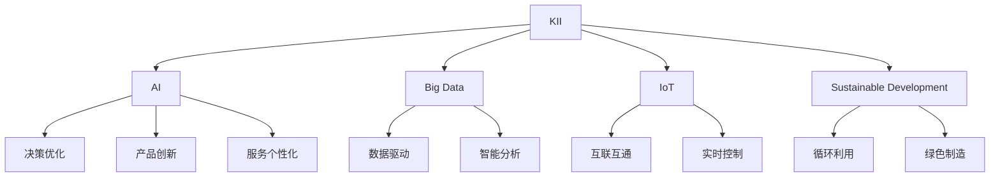

                 

# 知识密集型产业的发展趋势

## 1. 背景介绍

### 1.1 问题由来
知识密集型产业（Knowledge-Intensive Industries, KII）是现代经济中对知识资源依赖程度高、产出成果知识附加值大的产业，如研发、教育、信息技术、金融、生物医药、文化创意等领域。这些产业在推动经济发展、提升社会生产力、增强国家竞争力等方面发挥了重要作用。近年来，随着人工智能（AI）、大数据、物联网（IoT）等新兴技术的迅速发展，知识密集型产业正处于一场深刻变革之中。本文旨在深入探讨知识密集型产业的发展趋势，分析影响其成长与转型的关键因素，为产业界和学界提供有价值的参考。

### 1.2 问题核心关键点
知识密集型产业发展的核心关键点主要包括：
- **数字化转型**：通过引入人工智能、大数据、云计算等技术，实现生产、运营、管理的全流程数字化。
- **智能化升级**：利用AI技术进行决策优化、产品创新、服务个性化等，提升产业智能化水平。
- **知识共享与协作**：构建开放的创新平台，促进知识的共享和应用，形成协同创新的生态系统。
- **可持续发展**：通过节能减排、循环利用等措施，实现产业的绿色发展和可持续发展。
- **全球化竞争**：在全球范围内，基于创新能力、品牌影响力、市场布局等进行激烈竞争。

### 1.3 问题研究意义
研究知识密集型产业的发展趋势，对于把握行业动态、制定科学发展战略、推动产业创新具有重要意义：
- **政策制定**：帮助政府制定符合产业特点的扶持政策，促进产业健康发展。
- **企业发展**：指导企业明确技术应用方向，提升核心竞争力。
- **人才培养**：引导高等教育机构调整课程设置，培养符合产业需求的人才。
- **学术研究**：为学者提供研究数据和理论基础，推动知识前沿的探索。

## 2. 核心概念与联系

### 2.1 核心概念概述
- **知识密集型产业（KII）**：指那些在生产过程中高度依赖于知识资源的产业，如研发、教育、信息技术、金融、生物医药、文化创意等。
- **人工智能（AI）**：通过机器学习、深度学习等技术，使计算机系统具备智能行为，包括感知、学习、推理等能力。
- **大数据（Big Data）**：指规模大、速度快、种类多的数据集合，通过对大数据的分析利用，可揭示隐藏在数据中的模式和规律。
- **物联网（IoT）**：通过互联网将各种设备、系统互联，实现信息的高效传输和智能化的管理与控制。
- **可持续发展**：在经济发展的同时，注重环境保护和资源节约，实现生态与经济的和谐共生。

这些概念之间的逻辑关系可以通过以下Mermaid流程图来展示：



这个流程图展示了大语言模型的核心概念及其之间的关系：

1. KII通过引入AI、大数据、IoT等技术，实现智能化升级。
2. AI在KII中主要应用于决策优化、产品创新、服务个性化等方面。
3. 大数据为KII提供了数据驱动的智能分析能力。
4. IoT使KII的设备和系统互联互通，实现实时控制。
5. 可持续发展关注环境保护和资源循环利用，是KII发展的长期目标。

## 3. 核心算法原理 & 具体操作步骤
### 3.1 算法原理概述

知识密集型产业的发展离不开技术的支撑。人工智能、大数据、物联网等技术的应用，使得KII产业在生产、运营、管理等方面实现了智能化和数字化。其中，人工智能技术通过算法优化、知识推理、决策支持等方式，在KII中发挥着关键作用。

知识密集型产业中应用的主要AI技术包括：
- **机器学习（Machine Learning, ML）**：通过对历史数据的学习，发现数据中的规律，进行预测和分类。
- **深度学习（Deep Learning, DL）**：通过多层次神经网络结构，处理复杂非线性的数据模式。
- **自然语言处理（Natural Language Processing, NLP）**：使计算机能够理解和生成自然语言，提升信息交互的效率和质量。
- **计算机视觉（Computer Vision, CV）**：使计算机能够识别、处理视觉信息，广泛应用于图像识别、视频分析等领域。
- **增强学习（Reinforcement Learning, RL）**：通过与环境的交互，学习最优的决策策略，应用于智能控制系统、游戏AI等领域。

### 3.2 算法步骤详解

以知识密集型产业中的智能决策系统为例，基于人工智能的微调流程一般包括：
1. **数据采集与处理**：收集KII产业的相关数据，包括生产数据、市场数据、客户数据等。对数据进行清洗、标注，使其适合于AI模型的训练。
2. **模型选择与设计**：根据具体任务，选择合适的AI模型架构。如对于图像识别任务，可以选择卷积神经网络（CNN）；对于文本分类任务，可以选择递归神经网络（RNN）或Transformer模型。
3. **模型训练与微调**：利用标注数据对模型进行训练，通过损失函数最小化，调整模型参数。在训练过程中，可以引入正则化、dropout等技术，防止过拟合。
4. **模型评估与优化**：在验证集上评估模型性能，根据评估结果，调整模型参数、优化算法超参数，提升模型效果。
5. **模型部署与应用**：将训练好的模型部署到生产环境中，进行实时决策支持或业务优化。

### 3.3 算法优缺点

基于AI的微调方法在知识密集型产业中具有以下优点：
- **提升决策效率**：AI算法可以快速处理大量数据，发现隐藏在数据中的模式和规律，提供决策支持。
- **优化生产过程**：通过智能分析，优化生产流程，提高资源利用率。
- **增强创新能力**：AI技术能够处理非结构化数据，提升企业的创新能力和市场竞争力。

同时，这些方法也存在一定的局限性：
- **依赖高质量数据**：模型的训练效果依赖于数据的质量和数量，数据的标注成本较高。
- **模型复杂度高**：复杂的AI模型需要较高的计算资源，对于中小企业可能存在一定的技术壁垒。
- **解释性不足**：AI模型的决策过程缺乏可解释性，难以对其推理逻辑进行分析和调试。
- **安全性风险**：AI模型可能出现预测偏差、过拟合等问题，对决策产生负面影响。

### 3.4 算法应用领域

AI技术在知识密集型产业中的应用广泛，包括但不限于以下领域：
- **智能制造**：通过智能化的生产系统，提升制造效率和产品质量。
- **智能物流**：利用大数据和IoT技术，实现物流系统的智能化和可视化管理。
- **金融科技**：通过AI技术进行风险控制、智能投顾、智能客服等，提升金融服务质量。
- **医疗健康**：利用AI进行疾病预测、药物研发、医疗影像分析等，提升医疗服务水平。
- **教育科技**：通过AI进行个性化学习、智能评估、智能辅导等，提升教育效果和体验。
- **文化创意**：利用AI进行内容创作、智能推荐、版权保护等，提升文化产业的创新能力。

## 4. 数学模型和公式 & 详细讲解 & 举例说明

### 4.1 数学模型构建

在知识密集型产业中，AI模型的应用通常涉及复杂的数学模型和算法。以机器学习为例，常用的数学模型包括线性回归、逻辑回归、支持向量机（SVM）、决策树、随机森林、神经网络等。这些模型在KII产业中的应用，通常需要经过以下步骤：
1. **数据预处理**：对数据进行归一化、标准化、缺失值处理等，保证数据的质量和一致性。
2. **特征选择与提取**：从原始数据中提取有用的特征，减少冗余信息。
3. **模型训练**：通过训练数据集，优化模型参数，最小化损失函数。
4. **模型评估与验证**：在测试数据集上评估模型性能，进行交叉验证，防止过拟合。

### 4.2 公式推导过程

以线性回归为例，其数学模型和公式推导如下：

假设有一个线性回归模型 $y = \beta_0 + \beta_1x_1 + \beta_2x_2 + \ldots + \beta_nx_n$，其中 $\beta$ 为回归系数，$x_i$ 为输入特征，$y$ 为输出目标。

模型的训练目标是最小化损失函数：

$$
\mathcal{L}(\beta) = \frac{1}{2m}\sum_{i=1}^m(y_i - \hat{y}_i)^2
$$

其中，$m$ 为样本数量，$\hat{y}_i = \beta_0 + \beta_1x_{i1} + \beta_2x_{i2} + \ldots + \beta_nx_{in}$ 为模型对样本 $i$ 的预测值。

通过梯度下降等优化算法，可以求解 $\beta$：

$$
\beta \leftarrow \beta - \eta\nabla_{\beta}\mathcal{L}(\beta)
$$

其中，$\eta$ 为学习率。

### 4.3 案例分析与讲解

以智能制造中的预测性维护为例，通过机器学习模型预测设备故障，及时进行维护，减少生产停机时间，提升设备利用率。

假设有一组设备维护数据，包含设备编号、维护时间、维修费用、停机时间等。通过线性回归模型，预测设备未来的故障概率和维护费用。具体步骤如下：
1. **数据预处理**：对设备编号进行编码，将时间转换为标准格式，对维修费用和停机时间进行归一化处理。
2. **特征选择**：选择设备编号、维护时间、维修费用、停机时间等作为输入特征。
3. **模型训练**：利用历史数据集，训练线性回归模型，最小化损失函数。
4. **模型评估与验证**：在测试数据集上评估模型性能，使用R²、MAE等指标衡量模型的拟合优度和预测精度。
5. **预测应用**：将新设备的维护数据输入模型，预测其未来的故障概率和维护费用，指导生产维护决策。

## 5. 项目实践：代码实例和详细解释说明

### 5.1 开发环境搭建

在进行知识密集型产业中的AI应用开发时，我们需要准备好开发环境。以下是使用Python进行Scikit-Learn开发的环境配置流程：

1. 安装Anaconda：从官网下载并安装Anaconda，用于创建独立的Python环境。

2. 创建并激活虚拟环境：
```bash
conda create -n kii-env python=3.8 
conda activate kii-env
```

3. 安装Scikit-Learn：
```bash
pip install scikit-learn
```

4. 安装各类工具包：
```bash
pip install numpy pandas matplotlib
```

完成上述步骤后，即可在`kii-env`环境中开始AI应用开发。

### 5.2 源代码详细实现

下面我们以智能制造中的预测性维护为例，给出使用Scikit-Learn进行线性回归模型的PyTorch代码实现。

```python
import pandas as pd
from sklearn.model_selection import train_test_split
from sklearn.linear_model import LinearRegression
from sklearn.metrics import mean_squared_error, r2_score

# 加载数据集
data = pd.read_csv('maintenance_data.csv')

# 数据预处理
X = data[['device_id', 'maintenance_time', 'maintenance_cost', 'downtime']]
y = data['downtime']
X_train, X_test, y_train, y_test = train_test_split(X, y, test_size=0.2, random_state=42)

# 训练模型
model = LinearRegression()
model.fit(X_train, y_train)

# 预测并评估
y_pred = model.predict(X_test)
mse = mean_squared_error(y_test, y_pred)
r2 = r2_score(y_test, y_pred)
print(f"Mean Squared Error: {mse:.2f}")
print(f"R-squared: {r2:.2f}")
```

### 5.3 代码解读与分析

让我们再详细解读一下关键代码的实现细节：

**数据预处理**：
- 使用Pandas库加载数据集，进行数据清洗和特征选择。
- 对连续型数据进行归一化处理，保证数据的一致性。

**模型训练**：
- 使用Scikit-Learn库中的LinearRegression模型进行线性回归训练，最小化损失函数。
- 通过交叉验证，防止过拟合，提高模型泛化能力。

**模型评估**：
- 使用均方误差和R²系数评估模型的预测精度和拟合优度。
- 在测试集上使用评估指标衡量模型的性能。

**预测应用**：
- 将新设备的维护数据输入模型，进行故障概率和维护费用的预测。
- 根据预测结果，指导生产维护决策，优化生产流程。

可以看到，Scikit-Learn库使得AI模型的实现变得简洁高效。开发者可以将更多精力放在模型选择、数据处理、特征工程等高层逻辑上，而不必过多关注底层的实现细节。

## 6. 实际应用场景

### 6.1 智能制造

智能制造是知识密集型产业中应用AI技术的典型场景。通过引入AI技术，实现生产过程的智能化和自动化，提升生产效率和产品质量。

在智能制造中，AI技术的应用包括但不限于以下方面：
- **预测性维护**：通过机器学习模型预测设备故障，及时进行维护，减少生产停机时间，提升设备利用率。
- **质量控制**：利用计算机视觉技术检测产品缺陷，提升产品质量。
- **供应链管理**：通过大数据和IoT技术，实现供应链的智能监控和优化。
- **自动化生产**：利用机器人技术进行自动化生产，提高生产效率。

### 6.2 智能物流

智能物流是KII产业中的另一个重要应用场景。通过引入AI技术，提升物流系统的智能化水平，提高物流效率和用户体验。

在智能物流中，AI技术的应用包括但不限于以下方面：
- **路径规划**：利用机器学习算法优化物流路径，减少运输成本和时间。
- **库存管理**：通过预测需求，优化库存水平，减少库存积压和缺货风险。
- **异常检测**：利用异常检测算法监控物流系统，及时发现并处理异常情况。
- **自动化分拣**：利用机器人和自动化设备进行货物分拣，提高分拣效率。

### 6.3 金融科技

金融科技是KII产业中的新兴领域，通过AI技术提升金融服务的智能化水平，优化金融服务流程，提升客户体验。

在金融科技中，AI技术的应用包括但不限于以下方面：
- **智能投顾**：通过机器学习算法分析市场数据，提供智能投资建议。
- **风险控制**：利用AI技术进行信用评估、欺诈检测，提升金融风险控制能力。
- **智能客服**：通过自然语言处理技术，实现智能客服，提升客户体验。
- **数据驱动决策**：通过大数据分析，提升金融决策的科学性和准确性。

### 6.4 医疗健康

医疗健康是知识密集型产业中的重要领域，通过AI技术提升医疗服务的智能化水平，提升医疗服务质量和效率。

在医疗健康中，AI技术的应用包括但不限于以下方面：
- **疾病预测**：利用机器学习模型预测疾病发展趋势，提前进行干预。
- **药物研发**：通过AI技术进行药物筛选和设计，提升新药研发效率。
- **医学影像分析**：利用计算机视觉技术分析医学影像，提升诊断准确性。
- **智能医疗助手**：通过自然语言处理技术，提供智能医疗助手，提升医疗服务效率。

### 6.5 教育科技

教育科技是知识密集型产业中的新兴领域，通过AI技术提升教育服务的智能化水平，优化教育过程，提升教育效果。

在教育科技中，AI技术的应用包括但不限于以下方面：
- **个性化学习**：通过机器学习算法分析学生行为数据，提供个性化学习建议。
- **智能评估**：利用AI技术进行智能评估，提升评估的准确性和公正性。
- **智能辅导**：通过自然语言处理技术，提供智能辅导，提升学习效果。
- **知识图谱构建**：利用知识图谱技术，构建知识体系，提升教育资源的共享和应用。

## 7. 工具和资源推荐

### 7.1 学习资源推荐

为了帮助开发者系统掌握知识密集型产业中AI技术的应用，这里推荐一些优质的学习资源：

1. **《深度学习》书籍**：Ian Goodfellow等著，全面介绍了深度学习的理论和实践，是AI学习的经典教材。
2. **Coursera深度学习课程**：由斯坦福大学Andrew Ng教授主讲，涵盖深度学习的基础和高级内容，适合初学者和进阶者。
3. **Kaggle竞赛平台**：提供丰富的AI竞赛项目，通过实际项目练习，提升AI开发能力。
4. **GitHub开源项目**：包含大量AI应用案例，通过阅读和复现项目，学习最佳实践。
5. **arXiv论文库**：提供最新的AI研究成果，跟踪前沿技术动态，提升学术水平。

通过这些资源的学习实践，相信你一定能够快速掌握知识密集型产业中AI技术的精髓，并用于解决实际的产业问题。

### 7.2 开发工具推荐

高效的开发离不开优秀的工具支持。以下是几款用于知识密集型产业中AI开发的工具：

1. **Jupyter Notebook**：一个交互式编程环境，支持多种语言和库，方便开发和共享代码。
2. **TensorFlow**：由Google主导开发的开源深度学习框架，生产部署方便，适合大规模工程应用。
3. **PyTorch**：Facebook开发的深度学习框架，灵活动态，适合快速迭代研究。
4. **Scikit-Learn**：基于Python的机器学习库，提供了丰富的算法和工具，方便快速开发。
5. **Hadoop**：用于大数据处理和分析的开源框架，支持分布式计算，提升数据处理效率。
6. **Kafka**：用于数据流处理的开源平台，支持高吞吐量的数据传输和处理。

合理利用这些工具，可以显著提升知识密集型产业中AI开发效率，加速创新迭代的步伐。

### 7.3 相关论文推荐

知识密集型产业中AI技术的发展源于学界的持续研究。以下是几篇奠基性的相关论文，推荐阅读：

1. **《深度学习》书籍**：Ian Goodfellow等著，全面介绍了深度学习的理论和实践，是AI学习的经典教材。
2. **Coursera深度学习课程**：由斯坦福大学Andrew Ng教授主讲，涵盖深度学习的基础和高级内容，适合初学者和进阶者。
3. **Kaggle竞赛平台**：提供丰富的AI竞赛项目，通过实际项目练习，提升AI开发能力。
4. **GitHub开源项目**：包含大量AI应用案例，通过阅读和复现项目，学习最佳实践。
5. **arXiv论文库**：提供最新的AI研究成果，跟踪前沿技术动态，提升学术水平。

这些论文代表了大语言模型微调技术的发展脉络。通过学习这些前沿成果，可以帮助研究者把握学科前进方向，激发更多的创新灵感。

## 8. 总结：未来发展趋势与挑战

### 8.1 总结

本文对知识密集型产业中的AI应用进行了全面系统的介绍。首先阐述了知识密集型产业的发展背景和AI技术的应用价值，明确了AI技术在KII产业中的重要作用。其次，从原理到实践，详细讲解了AI技术在KII产业中的核心算法和操作步骤，给出了具体的应用案例和代码实现。同时，本文还探讨了AI技术在KII产业中的实际应用场景，展示了AI技术的广阔前景。

通过本文的系统梳理，可以看到，AI技术在知识密集型产业中的广泛应用，正在推动产业实现智能化和数字化转型。未来，伴随AI技术的不断演进，知识密集型产业必将在更多领域迎来新的突破。

### 8.2 未来发展趋势

展望未来，知识密集型产业中的AI技术将呈现以下几个发展趋势：

1. **智能化水平提升**：随着AI技术的不断进步，知识密集型产业的智能化水平将进一步提升，实现全流程自动化和智能化。
2. **跨领域融合**：AI技术将与其他领域的技术进行深度融合，如物联网、大数据、区块链等，形成更加智能化、高效的产业生态。
3. **数据驱动决策**：通过大数据分析和AI技术，实现数据驱动的决策优化，提升产业的运营效率和市场竞争力。
4. **可持续发展**：AI技术将推动产业向绿色、低碳方向发展，实现资源的高效利用和循环利用。
5. **全球化竞争**：在全球范围内，基于AI技术的产业将形成新的竞争格局，推动全球经济的发展和变革。

以上趋势凸显了知识密集型产业中AI技术的广阔前景。这些方向的探索发展，必将进一步提升产业的智能化水平，为经济社会发展注入新的动力。

### 8.3 面临的挑战

尽管知识密集型产业中的AI技术已经取得了瞩目成就，但在迈向更加智能化、普适化应用的过程中，它仍面临着诸多挑战：

1. **数据隐私和安全**：AI模型需要大量的数据进行训练，如何保护数据隐私和安全，是一个重要的问题。
2. **模型鲁棒性不足**：AI模型在面对复杂和多样化的数据时，可能出现预测偏差、过拟合等问题。
3. **计算资源限制**：大规模AI模型的训练和推理需要大量的计算资源，如何优化计算资源的使用，是一个重要的研究方向。
4. **伦理和法律问题**：AI模型的应用可能带来伦理和法律问题，如何制定合理的法律法规，是一个重要的课题。
5. **知识整合能力不足**：现有的AI模型往往局限于特定领域，难以灵活吸收和运用更广泛的先验知识。

这些挑战需要学界和产业界共同努力，通过技术创新和政策制定，才能克服。

### 8.4 研究展望

面对知识密集型产业中AI技术所面临的种种挑战，未来的研究需要在以下几个方面寻求新的突破：

1. **数据隐私保护**：开发更加安全的数据加密和隐私保护技术，确保数据的安全和隐私。
2. **模型鲁棒性提升**：引入更多鲁棒性增强技术，如对抗训练、鲁棒性优化等，提升AI模型的泛化能力和稳定性。
3. **计算资源优化**：开发更加高效的计算框架和模型压缩技术，优化计算资源的使用，实现高效的计算和推理。
4. **伦理和法律研究**：制定合理的伦理和法律框架，规范AI模型的应用，保障社会的公平和正义。
5. **知识整合能力增强**：将符号化的先验知识与AI模型进行融合，增强模型的知识整合能力，实现更加全面、准确的信息处理。

这些研究方向的探索，必将引领知识密集型产业中AI技术迈向更高的台阶，为构建安全、可靠、可解释、可控的智能系统铺平道路。面向未来，知识密集型产业中的AI技术还需要与其他技术进行更深入的融合，如知识表示、因果推理、强化学习等，多路径协同发力，共同推动知识密集型产业的创新和进步。

## 9. 附录：常见问题与解答

**Q1：知识密集型产业中的AI技术发展前景如何？**

A: 知识密集型产业中的AI技术具有广阔的发展前景。随着AI技术的不断进步，KII产业将实现全流程自动化和智能化，提升产业的运营效率和市场竞争力。

**Q2：知识密集型产业中AI技术面临的主要挑战是什么？**

A: 知识密集型产业中AI技术面临的主要挑战包括数据隐私和安全、模型鲁棒性不足、计算资源限制、伦理和法律问题以及知识整合能力不足等。

**Q3：如何提高AI模型的鲁棒性和泛化能力？**

A: 提高AI模型的鲁棒性和泛化能力可以通过以下方法：引入对抗训练、鲁棒性优化等技术，增强模型的泛化能力和稳定性；开发更加高效的计算框架和模型压缩技术，优化计算资源的使用；引入更多的先验知识，增强模型的知识整合能力。

**Q4：如何在保护数据隐私和安全的前提下，进行AI模型的训练？**

A: 在保护数据隐私和安全的前提下，进行AI模型的训练可以通过以下方法：开发更加安全的数据加密和隐私保护技术，确保数据的安全和隐私；采用差分隐私技术，在保护隐私的前提下，进行模型训练。

**Q5：知识密集型产业中AI技术的应用有哪些典型场景？**

A: 知识密集型产业中AI技术的应用场景包括智能制造、智能物流、金融科技、医疗健康、教育科技等。

通过对这些问题的解答，相信你一定能够对知识密集型产业中AI技术的应用和发展有一个更加全面的了解。

---

作者：禅与计算机程序设计艺术 / Zen and the Art of Computer Programming

