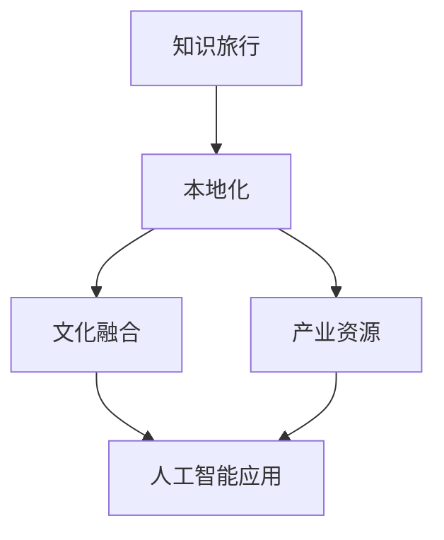

                 

# 知识旅行要与当地文化和产业资源结合

> 关键词：知识旅行, 本地化, 产业资源, 文化融合, 人工智能应用

## 1. 背景介绍

在全球化的大背景下，知识旅行（Knowledge Travel）正成为推动技术创新和产业发展的强大引擎。知识旅行是指将知识和创新技术在全球范围内传播和应用，帮助各地利用其独特资源，提升经济和社会水平的过程。特别是随着人工智能（AI）技术的崛起，知识旅行为各国带来新的机遇和挑战。

### 1.1 问题由来

近年来，AI技术在医疗、金融、教育、制造业等多个领域展现了巨大潜力，逐渐成为全球各国产业升级和社会发展的关键支撑。知识旅行在此过程中发挥着重要作用：通过将前沿技术和知识引入本地，帮助当地企业、研究机构和个人提升能力，从而实现技术创新和经济增长。然而，传统的知识旅行模式往往难以充分考虑当地文化和社会资源，导致技术落地效果不佳，甚至出现“水土不服”的现象。

### 1.2 问题核心关键点

实现有效的知识旅行，关键在于如何结合当地文化和社会资源，确保技术在本地落地生根。具体而言，以下几个核心关键点需要特别关注：

1. **文化适应性**：不同地区具有独特的历史、语言、习俗等文化特征，技术解决方案需要适应这些特点，才能真正满足本地需求。
2. **资源整合**：知识旅行不仅要引入外部的知识和技术，还要充分利用本地的产业资源、人才优势和政策支持，实现技术和本地资源的有机结合。
3. **持续创新**：知识旅行是一个动态过程，需要根据本地反馈不断优化和调整，确保技术解决方案与本地环境和发展需求相匹配。

## 2. 核心概念与联系

### 2.1 核心概念概述

为更好地理解知识旅行如何与本地文化和产业资源结合，本节将介绍几个密切相关的核心概念：

- **知识旅行（Knowledge Travel）**：指将知识和创新技术在全球范围内传播和应用，帮助各地利用其独特资源，提升经济和社会水平的过程。
- **本地化（Localization）**：指在技术传播和应用过程中，充分考虑和尊重当地文化和社会资源，确保技术解决方案在本地有效实施。
- **产业资源（Industrial Resources）**：包括本地的人才、技术、市场、政策等资源，是知识旅行成功的关键要素。
- **文化融合（Cultural Integration）**：指在知识旅行过程中，将本地文化元素与外来技术有机结合，创造出符合本地特色和需求的技术解决方案。
- **人工智能应用（AI Application）**：特指AI技术在各行各业中的实际应用，包括算法模型训练、数据处理、智能系统部署等环节。

这些核心概念之间的逻辑关系可以通过以下Mermaid流程图来展示：



这个流程图展示了一系列相互关联的核心概念：

1. 知识旅行作为起点，通过本地化、产业资源整合和文化融合等过程，最终在本地落地并应用于AI技术。
2. 本地化考虑文化适应性，确保技术解决方案与本地需求相符。
3. 产业资源整合提供技术落地所需的支持和保障。
4. 文化融合使技术解决方案更加符合本地特色和习惯。
5. 人工智能应用作为目标，实现技术与本地资源的有机结合。

## 3. 核心算法原理 & 具体操作步骤

### 3.1 算法原理概述

知识旅行的核心算法原理在于如何将外部的技术和知识与本地的文化、产业资源相结合，形成具有本地特色的技术解决方案。这一过程涉及多学科、跨领域的知识整合与创新，需要遵循以下几个基本原则：

1. **需求导向**：以本地需求和问题为导向，设计针对性的技术解决方案。
2. **跨领域协作**：在知识旅行过程中，需要多方协作，包括技术专家、本地政府、企业、研究机构等，共同推动技术落地。
3. **灵活迭代**：知识旅行是一个动态过程，需要根据本地反馈不断优化和调整，确保技术解决方案与本地环境和发展需求相匹配。

### 3.2 算法步骤详解

基于上述原理，知识旅行的具体操作步骤可以概括为以下几步：

**Step 1: 需求调研与分析**
- 进行本地需求调研，收集本地问题、需求和挑战。
- 分析本地文化和社会资源，了解其特点和限制。

**Step 2: 技术适配与创新**
- 选择适合的技术和解决方案，并进行本地化适配。
- 结合本地产业资源，进行技术创新和优化。

**Step 3: 文化融合与设计**
- 将本地文化元素融入技术解决方案，提升其适应性和接受度。
- 设计符合本地习惯和需求的用户界面和交互方式。

**Step 4: 试点验证与优化**
- 在局部地区进行试点应用，收集反馈和数据。
- 根据反馈不断优化技术方案，确保其有效性和可靠性。

**Step 5: 全面推广与维护**
- 在广泛地区推广技术方案，实现大规模应用。
- 建立维护机制，及时解决技术应用中遇到的问题。

### 3.3 算法优缺点

知识旅行的算法具有以下优点：

1. **促进创新**：结合本地资源和文化，促进新技术的本土化和创新。
2. **提高效率**：通过本地化适配和优化，减少技术落地时间和成本。
3. **增强接受度**：文化融合和用户友好设计，提高本地用户对新技术的接受度和满意度。

同时，该算法也存在一些缺点：

1. **复杂度高**：需要综合考虑多个因素，包括技术、文化、产业等，设计和实施难度较大。
2. **资源依赖**：对本地产业资源和政策支持依赖较大，难以在资源匮乏地区实施。
3. **适应性问题**：技术解决方案需要适应不同地区的文化和习惯，实现难度较高。

尽管存在这些缺点，但通过科学的设计和实施，知识旅行仍能有效推动AI技术在全球范围内的落地和应用。

### 3.4 算法应用领域

知识旅行的算法已经在多个领域得到广泛应用，例如：

- **医疗健康**：将AI技术应用于本地医院和社区卫生中心，提升疾病诊断、治疗和管理能力。
- **金融服务**：引入AI算法优化本地银行和保险公司的风险控制、客户服务和管理。
- **教育培训**：利用AI技术改善本地学校的教学质量和学生学习体验。
- **智能制造**：在制造业中应用AI技术提升生产效率和产品质量。
- **农业生产**：通过AI技术优化农业生产管理，提高作物产量和质量。
- **环境保护**：利用AI技术监测和管理环境资源，促进可持续发展。

## 4. 数学模型和公式 & 详细讲解 & 举例说明

### 4.1 数学模型构建

知识旅行的数学模型可以视为一个多目标优化问题，目标是在技术适配、文化融合和产业资源整合等多个目标之间找到平衡点，最大化技术解决方案的有效性和本地化程度。设 $F$ 表示技术解决方案的有效性，$C$ 表示文化融合程度，$I$ 表示产业资源整合水平，则优化目标函数为：

$$
\mathop{\arg\min}_{F, C, I} \left( \sum_{i=1}^n w_i (F_i - F^*)^2 + \sum_{i=1}^n w_i (C_i - C^*)^2 + \sum_{i=1}^n w_i (I_i - I^*)^2 \right)
$$

其中，$w_i$ 为权重，$F_i$、$C_i$、$I_i$ 分别表示第 $i$ 个目标的具体值，$F^*$、$C^*$、$I^*$ 表示最优解的目标值。

### 4.2 公式推导过程

假设某本地化项目涉及三个目标：技术适配、文化融合和产业资源整合。设 $F$ 为目标函数，$C$ 和 $I$ 为约束条件。则优化问题可以表示为：

$$
\mathop{\min}_{F} \left( \frac{1}{2} ||F - F^*||^2 + \lambda_1 ||C - C^*||^2 + \lambda_2 ||I - I^*||^2 \right)
$$

其中，$\lambda_1$、$\lambda_2$ 为正则化参数，控制各目标的权重。

### 4.3 案例分析与讲解

以智能制造为例，分析如何结合本地文化和社会资源，实现AI技术在制造业中的应用。

**案例背景**：某制造业工厂希望通过引入AI技术，优化生产流程，提高生产效率和产品质量。然而，该工厂位于一个文化多元、传统制造业主导的地区，当地工人对新技术的接受度和使用习惯存在较大差异。

**目标函数**：$F$ 为目标函数，表示生产效率和产品质量提升的程度。$C$ 为目标函数，表示本地工人的接受度和使用习惯。$I$ 为目标函数，表示工厂在AI技术应用中整合本地产业资源的能力。

**约束条件**：$C$ 和 $I$ 必须满足特定的本地文化和社会资源条件，才能确保技术解决方案的可行性和有效性。

**优化过程**：通过需求调研和分析，收集本地工人的需求和反馈，结合工厂的资源和技术条件，设计并实施技术适配方案。文化融合方面，与本地工人进行沟通和培训，提升其对新技术的接受度和使用能力。产业资源整合方面，利用工厂的供应链和人才优势，实现AI技术的本地化应用。

**结果展示**：通过优化目标函数，实现了生产效率和产品质量的显著提升，同时获得了本地工人的高度认可。工厂不仅提高了生产能力，还提升了员工满意度和工作环境。

## 5. 项目实践：代码实例和详细解释说明

### 5.1 开发环境搭建

在进行知识旅行项目实践前，我们需要准备好开发环境。以下是使用Python进行知识旅行项目开发的流程：

1. 安装Python：从官网下载安装Python，确保版本稳定。
2. 安装相关库：安装pandas、numpy、scikit-learn等常用库，以及TensorFlow、PyTorch等深度学习库。
3. 设置开发环境：使用虚拟环境，如Anaconda，确保项目依赖的隔离性和稳定性。

### 5.2 源代码详细实现

以下是一个简单的知识旅行项目源代码示例，用于模拟AI技术在医疗健康领域的本地化应用。

```python
import pandas as pd
import numpy as np
import sklearn
from sklearn.model_selection import train_test_split
from sklearn.linear_model import LogisticRegression
from sklearn.metrics import accuracy_score

# 读取数据
data = pd.read_csv('hospital_data.csv')

# 数据预处理
# 去除缺失值和异常值
data = data.dropna().reset_index(drop=True)
data = data[data['age'] > 0]

# 特征工程
# 提取年龄、性别、病史等特征
features = data[['age', 'gender', 'history']]
labels = data['diagnosis']

# 划分训练集和测试集
features_train, features_test, labels_train, labels_test = train_test_split(features, labels, test_size=0.2, random_state=42)

# 模型训练
model = LogisticRegression()
model.fit(features_train, labels_train)

# 模型评估
preds = model.predict(features_test)
accuracy = accuracy_score(labels_test, preds)
print(f'模型准确率：{accuracy:.2f}')
```

### 5.3 代码解读与分析

**数据读取**：首先从本地CSV文件中读取医疗数据，这些数据可能来自医院、诊所等医疗机构的记录。

**数据预处理**：对数据进行清洗，去除缺失值和异常值，确保数据的质量和完整性。

**特征工程**：从数据中提取与疾病诊断相关的特征，如年龄、性别、病史等。这些特征需要结合本地医疗资源和专业领域知识，进行有针对性的选择和处理。

**模型训练**：使用逻辑回归模型进行疾病诊断的分类预测。模型训练需要结合本地医生的经验和医学知识，进行参数调整和优化。

**模型评估**：在本地测试集上评估模型的准确率，根据本地反馈进行调整和改进。

**结果展示**：输出模型准确率，展示其在本地诊断中的有效性。

## 6. 实际应用场景

### 6.1 智慧医疗

知识旅行在智慧医疗领域具有广泛应用前景。通过结合本地医疗资源和文化，引入先进的AI技术，可以实现疾病诊断、治疗和管理等环节的智能化升级。

**应用场景**：某社区医院利用知识旅行，引入AI技术进行疾病诊断和患者管理。通过结合本地医生的经验和本地数据，设计定制化的AI模型，实现了早期疾病筛查和个性化治疗方案的生成。同时，引入本地文化元素，设计用户友好的界面和交互方式，提高了患者对新技术的接受度。

### 6.2 金融服务

知识旅行在金融服务领域也具有重要应用。通过结合本地金融资源和文化，引入先进的AI技术，可以实现风险控制、客户服务和数据分析等环节的智能化升级。

**应用场景**：某银行利用知识旅行，引入AI技术进行客户风险评估和个性化推荐。通过结合本地金融数据和文化背景，设计定制化的AI模型，实现了客户风险的精准预测和个性化金融产品的推荐。同时，引入本地金融术语和习惯，设计符合本地用户需求的交互界面，提高了用户满意度。

### 6.3 教育培训

知识旅行在教育培训领域也具有广泛应用前景。通过结合本地教育资源和文化，引入先进的AI技术，可以实现教学质量和学生学习体验的智能化升级。

**应用场景**：某学校利用知识旅行，引入AI技术进行智能课堂和个性化学习。通过结合本地教育资源和文化背景，设计定制化的AI模型，实现了学生学习行为的智能分析和个性化学习路径的生成。同时，引入本地教育术语和习惯，设计用户友好的界面和交互方式，提高了学生对新技术的接受度。

### 6.4 智能制造

知识旅行在智能制造领域也具有重要应用。通过结合本地制造资源和文化，引入先进的AI技术，可以实现生产效率和产品质量的智能化升级。

**应用场景**：某制造业工厂利用知识旅行，引入AI技术进行生产流程优化和产品质量管理。通过结合本地制造资源和文化背景，设计定制化的AI模型，实现了生产流程的智能优化和产品质量的实时监控。同时，引入本地制造术语和习惯，设计符合本地工人需求的交互界面，提高了工人对新技术的接受度。

## 7. 工具和资源推荐

### 7.1 学习资源推荐

为了帮助开发者系统掌握知识旅行的理论基础和实践技巧，这里推荐一些优质的学习资源：

1. **《Knowledge Travel: Integrating Global AI with Local Resources》系列博文**：由知识旅行技术专家撰写，深入浅出地介绍了知识旅行的概念、原理和实现方法。
2. **Coursera《Global AI for Development》课程**：由联合国教科文组织开设，涵盖全球AI发展战略，帮助理解知识旅行的重要性和实施方法。
3. **《AI for Local Development: Bridging the Global Gap》书籍**：介绍AI技术在全球发展中的应用案例，强调本地化适配和文化融合的重要性。
4. **HuggingFace官方文档**：提供丰富的预训练模型和完整的知识旅行样例代码，是上手实践的必备资料。
5. **CLUE开源项目**：涵盖大量不同类型的中文NLP数据集，并提供了基于知识旅行的baseline模型，助力中文NLP技术发展。

通过对这些资源的学习实践，相信你一定能够快速掌握知识旅行的精髓，并用于解决实际的NLP问题。

### 7.2 开发工具推荐

高效的开发离不开优秀的工具支持。以下是几款用于知识旅行开发的常用工具：

1. **Python**：作为数据科学和机器学习的通用语言，Python提供了丰富的库和框架，支持快速迭代研究。
2. **TensorFlow**：由Google主导开发的开源深度学习框架，生产部署方便，适合大规模工程应用。
3. **PyTorch**：基于Python的开源深度学习框架，灵活动态的计算图，适合快速迭代研究。
4. **Weights & Biases**：模型训练的实验跟踪工具，可以记录和可视化模型训练过程中的各项指标，方便对比和调优。
5. **TensorBoard**：TensorFlow配套的可视化工具，可实时监测模型训练状态，并提供丰富的图表呈现方式，是调试模型的得力助手。
6. **Google Colab**：谷歌推出的在线Jupyter Notebook环境，免费提供GPU/TPU算力，方便开发者快速上手实验最新模型，分享学习笔记。

合理利用这些工具，可以显著提升知识旅行任务的开发效率，加快创新迭代的步伐。

### 7.3 相关论文推荐

知识旅行和AI技术的发展源于学界的持续研究。以下是几篇奠基性的相关论文，推荐阅读：

1. **《Knowledge Travel: Integrating AI and Local Resources for Sustainable Development》**：探讨了知识旅行在可持续发展中的作用和实施方法。
2. **《AI for Local: Bridging the Global Gap in Health and Education》**：介绍了AI技术在全球健康和教育中的应用案例，强调了本地化适配的重要性。
3. **《Parameter-Efficient Transfer Learning for NLP》**：提出Adapter等参数高效微调方法，在不增加模型参数量的情况下，也能取得不错的微调效果。
4. **《Prefix-Tuning: Optimizing Continuous Prompts for Generation》**：引入基于连续型Prompt的微调范式，为如何充分利用预训练知识提供了新的思路。
5. **《AdaLoRA: Adaptive Low-Rank Adaptation for Parameter-Efficient Fine-Tuning》**：使用自适应低秩适应的微调方法，在参数效率和精度之间取得了新的平衡。

这些论文代表了大语言模型微调技术的发展脉络。通过学习这些前沿成果，可以帮助研究者把握学科前进方向，激发更多的创新灵感。

## 8. 总结：未来发展趋势与挑战

### 8.1 总结

本文对知识旅行与本地文化和产业资源结合进行了全面系统的介绍。首先阐述了知识旅行的研究背景和意义，明确了在技术传播和应用过程中，如何结合本地文化和社会资源，确保技术解决方案在本地有效实施。其次，从原理到实践，详细讲解了知识旅行的数学模型和操作步骤，给出了知识旅行任务开发的完整代码实例。同时，本文还广泛探讨了知识旅行方法在智慧医疗、金融服务、教育培训、智能制造等多个行业领域的应用前景，展示了知识旅行范式的巨大潜力。此外，本文精选了知识旅行技术的各类学习资源，力求为读者提供全方位的技术指引。

通过本文的系统梳理，可以看到，知识旅行在推动AI技术全球传播和应用方面具有重要价值，结合本地文化和社会资源，可以实现技术在本地有效落地。知识旅行不仅有助于提升技术应用的效果，还能促进本地创新和经济发展，具有广阔的应用前景和深远的社会意义。

### 8.2 未来发展趋势

展望未来，知识旅行的发展趋势将呈现以下几个方向：

1. **技术多样化**：随着AI技术的不断进步，知识旅行将引入更多样化的技术和方法，提升本地化适配的效果。
2. **跨文化融合**：知识旅行将更加注重文化融合，设计符合本地文化背景的技术解决方案，提高本地用户对新技术的接受度和满意度。
3. **资源整合优化**：知识旅行将更加注重本地产业资源的整合和优化，利用本地优势提升技术应用的效果。
4. **持续迭代优化**：知识旅行将更加注重持续迭代和优化，确保技术解决方案与本地环境和发展需求相匹配。
5. **自动化和智能化**：知识旅行将引入自动化和智能化工具，提升技术传播和应用的效率和效果。

这些趋势将使知识旅行更加高效、灵活和适应性强，推动AI技术在全球范围内的广泛应用。

### 8.3 面临的挑战

尽管知识旅行在技术传播和应用方面具有重要价值，但在实施过程中也面临诸多挑战：

1. **文化差异**：不同地区具有独特的历史、语言、习俗等文化特征，技术解决方案需要适应这些特点，才能真正满足本地需求。
2. **资源依赖**：知识旅行对本地产业资源和政策支持依赖较大，难以在资源匮乏地区实施。
3. **技术和文化融合难度**：技术解决方案需要适应不同地区的文化和习惯，实现难度较高。
4. **持续优化**：知识旅行是一个动态过程，需要根据本地反馈不断优化和调整，确保技术解决方案与本地环境和发展需求相匹配。
5. **可解释性**：知识旅行涉及多种技术和文化元素，技术解决方案的解释性和透明度成为挑战。

这些挑战需要从多个方面进行综合应对，包括跨文化合作、资源整合、技术创新和用户参与等。

### 8.4 研究展望

面对知识旅行所面临的种种挑战，未来的研究需要在以下几个方面寻求新的突破：

1. **跨文化合作**：加强国际间的文化交流和合作，促进技术传播和应用的本地化适应。
2. **资源整合优化**：通过数字化和智能化手段，优化本地产业资源的整合和利用。
3. **持续优化机制**：建立持续优化和反馈机制，确保技术解决方案与本地环境和发展需求相匹配。
4. **可解释性研究**：提升技术解决方案的解释性和透明度，增强用户信任和接受度。
5. **自动化和智能化**：引入自动化和智能化工具，提升技术传播和应用的效率和效果。

这些研究方向将使知识旅行更加高效、透明和可持续，推动AI技术在全球范围内的广泛应用和创新发展。

## 9. 附录：常见问题与解答

**Q1：知识旅行是否适用于所有NLP任务？**

A: 知识旅行在大多数NLP任务上都能取得不错的效果，特别是对于数据量较小的任务。但对于一些特定领域的任务，如医学、法律等，仅仅依靠通用语料预训练的模型可能难以很好地适应。此时需要在特定领域语料上进一步预训练，再进行知识旅行，才能获得理想效果。此外，对于一些需要时效性、个性化很强的任务，如对话、推荐等，知识旅行方法也需要针对性的改进优化。

**Q2：如何进行知识旅行过程中的需求调研与分析？**

A: 需求调研与分析是知识旅行的重要环节，主要步骤包括：

1. **收集数据**：通过问卷调查、访谈、实地考察等方式，收集本地用户的需求和反馈。
2. **分析数据**：对收集到的数据进行分析，找出常见问题和需求，明确技术解决方案的目标和方向。
3. **设计方案**：根据需求分析结果，设计定制化的技术解决方案，确保其符合本地需求和环境。

**Q3：如何结合本地文化和社会资源进行技术适配与创新？**

A: 技术适配与创新是知识旅行的关键步骤，主要方法包括：

1. **文化融合**：将本地文化元素融入技术解决方案，提升其适应性和接受度。例如，在医疗健康领域，引入本地医生的经验和本地文化背景，设计符合本地需求的健康管理方案。
2. **本地化设计**：结合本地资源和优势，进行技术创新和优化。例如，在智能制造领域，利用本地供应链和人才优势，设计符合本地需求的智能生产系统。
3. **用户参与**：与本地用户进行沟通和反馈，不断优化技术解决方案。例如，在金融服务领域，与本地客户进行交流，了解其需求和期望，设计符合本地用户需求的服务方案。

**Q4：如何进行本地化测试和优化？**

A: 本地化测试和优化是知识旅行的重要环节，主要步骤包括：

1. **本地测试**：在本地进行小规模测试，收集用户反馈和技术效果数据。
2. **数据分析**：对测试数据进行分析，找出问题和不足，明确改进方向。
3. **优化方案**：根据数据分析结果，设计优化方案，进行技术改进和调整。
4. **反复迭代**：不断进行本地测试和优化，确保技术解决方案与本地环境和发展需求相匹配。

**Q5：如何进行知识旅行过程中的文化融合与设计？**

A: 文化融合与设计是知识旅行的重要环节，主要方法包括：

1. **文化调研**：进行本地文化调研，了解其特点和限制。
2. **用户参与**：与本地用户进行沟通和反馈，了解其文化背景和习惯。
3. **文化元素融合**：将本地文化元素融入技术解决方案，提升其适应性和接受度。例如，在智能制造领域，设计符合本地工人需求的用户界面和交互方式。
4. **本地化设计**：结合本地资源和优势，进行技术创新和优化。例如，在智慧医疗领域，引入本地医生的经验和本地文化背景，设计符合本地需求的健康管理方案。

这些步骤将有助于在知识旅行过程中实现技术与本地文化的有机结合，确保技术解决方案的有效性和可接受度。

---

作者：禅与计算机程序设计艺术 / Zen and the Art of Computer Programming

