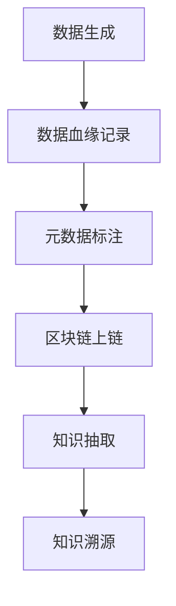

                 

# 知识溯源：追踪信息的来龙去脉

## 1. 背景介绍

在信息爆炸的时代，知识的生成和传播速度前所未有，但同时知识的真伪、来源和影响也变得复杂多元。知识的溯源（Tracing Knowledge），即追踪知识的来源和演变过程，是提升知识可信度和利用效率的关键。尤其在数据科学、人工智能、社会科学等领域，溯源技术对于提升决策质量、推动研究进展具有重要意义。本文将深入探讨知识溯源的技术原理、实现方法和应用场景，提供一套全面的技术框架和实践指南。

## 2. 核心概念与联系

### 2.1 核心概念概述

为更好地理解知识溯源技术，本节将介绍几个关键概念及其相互联系：

- **知识溯源（Knowledge Provenance）**：追踪知识的来源和演变的技术，确保知识的真实性和可信度。
- **数据血缘（Data Lineage）**：数据生成和处理过程中，记录数据流的完整链路，保障数据质量和隐私安全。
- **元数据（Metadata）**：描述数据的属性和背景信息，如数据来源、时间戳、处理方式等，是溯源的重要支撑。
- **区块链（Blockchain）**：一种去中心化的分布式账本技术，能够确保数据的不可篡改性和透明性，为知识溯源提供了技术基础。
- **信息抽取（Information Extraction）**：从非结构化数据中提取出关键信息，用于支持溯源和知识抽取。

### 2.2 核心概念原理和架构的 Mermaid 流程图



这个流程图展示了知识溯源的主要过程：数据生成后，记录其血缘信息，打上元数据，通过区块链技术上链，最后从结构化数据中抽取知识，完成知识溯源。

## 3. 核心算法原理 & 具体操作步骤

### 3.1 算法原理概述

知识溯源本质上是一个信息抽取和链路跟踪的过程。它通过记录数据的来源、处理方式、输出链路等元数据信息，形成数据的完整血缘关系，从而追溯数据的真实来源和演变路径。

形式化地，设数据的生成过程为 $f(x)$，其中 $x$ 为输入数据，$y$ 为生成后的数据，则知识溯源的目标是找到数据来源的链路 $z$，使得：

$$
y = f(z)
$$

其中 $z$ 包含了数据生成的所有元信息，如时间戳、处理方式、处理者等。

### 3.2 算法步骤详解

知识溯源主要包括以下几个步骤：

**Step 1: 数据血缘记录**
- 在数据生成的每个环节，记录数据流向和处理方式，形成数据血缘图。
- 通过数据库或分布式存储系统，将血缘信息实时更新。

**Step 2: 元数据标注**
- 为数据生成过程打上详细的元数据，包括时间、地点、工具、处理者等。
- 元数据需随数据一同存储，以便后续追溯。

**Step 3: 区块链上链**
- 将数据及其元数据上链，形成区块链上的数据节点。
- 区块链的不可篡改性和透明性保证了数据的真实性和追溯路径的可信度。

**Step 4: 知识抽取**
- 从区块链上的数据节点中提取元数据和关键信息。
- 结合知识图谱、规则库等，构建知识图谱，形成完整的知识链。

**Step 5: 知识溯源**
- 根据知识图谱和规则库，自动追踪数据的来源和演变路径。
- 支持交互式查询，让用户自定义查询条件，获取详细的数据信息。

### 3.3 算法优缺点

知识溯源技术具有以下优点：
1. 增强数据可信度。通过记录数据的完整血缘，能够有效识别和排除虚假数据。
2. 提高知识利用效率。通过自动抽取和跟踪知识，加速了知识发现和应用过程。
3. 保障数据安全。区块链的不可篡改性确保了数据和知识的完整性，防止数据泄露和篡改。
4. 促进数据共享。血缘信息的标准化记录，便于不同组织和系统间的知识共享和协作。

同时，该技术也存在以下缺点：
1. 数据存储成本高。区块链的存储和更新成本较高，需合理配置资源。
2. 技术复杂度高。知识溯源涉及多个环节和工具，实施和维护复杂。
3. 数据隐私风险。元数据和区块链上的数据可能涉及隐私，需注意保护。
4. 误导信息传播。误导信息可能被错误溯源，影响数据可信度。

尽管存在这些局限性，但知识溯源技术在数据安全和知识可信度方面具有重要价值，尤其适用于涉及数据真实性和隐私安全的场景。

### 3.4 算法应用领域

知识溯源技术广泛应用于以下领域：

- **科学研究**：确保研究数据的真实性和可信度，推动科研合作和知识共享。
- **金融风控**：通过区块链溯源金融交易数据，防止欺诈和洗钱行为，保障金融安全。
- **医疗健康**：记录和追踪医疗数据，确保患者隐私和医疗服务的真实性，提升医疗质量。
- **知识产权**：保护知识产权的原创性和归属权，防止盗版和侵权行为。
- **供应链管理**：记录供应链中各环节的数据血缘，提升供应链透明度和可靠性。
- **社会治理**：追踪社会数据的真实性和传播路径，提升社会治理的透明度和公正性。

## 4. 数学模型和公式 & 详细讲解 & 举例说明

### 4.1 数学模型构建

本节将使用数学语言对知识溯源的基本模型进行描述。

设数据生成过程为 $f$，输入为 $x$，输出为 $y$，数据来源为 $z$。数据血缘关系记为 $F$，元数据记为 $M$。知识图谱记为 $G$，知识抽取算法记为 $E$。知识溯源算法记为 $T$。

知识溯源的数学模型可以表示为：

$$
\mathcal{L} = \min_{F, M, G, E, T} \sum_{(x, y, z)} \ell(F, M, G, E, T, x, y, z)
$$

其中 $\ell$ 为损失函数，包含数据血缘记录、元数据标注、知识图谱构建、知识抽取和知识溯源等多个环节的损失。

### 4.2 公式推导过程

以下以一个简单的数据生成和知识溯源为例，推导相关公式。

假设数据生成过程为 $f(x) = ax + b$，其中 $x$ 为输入，$a$ 为系数，$b$ 为截距。数据来源 $z = (x, a, b, t)$，其中 $t$ 为生成时间。

数据血缘记录：
- 初始化 $F = \emptyset$
- 每次生成数据 $y = f(x)$，添加记录 $(x, y, z)$ 到 $F$
- 最终形成血缘图 $F = \{(x_1, f(x_1), (x_1, a_1, b_1, t_1)), \cdots, (x_n, f(x_n), (x_n, a_n, b_n, t_n))\}$

元数据标注：
- 每次生成数据 $y = f(x)$，打上元数据 $M = (x, a, b, t)$
- 元数据随数据一同存储，最终形成元数据集合 $M = \{(x_1, a_1, b_1, t_1), \cdots, (x_n, a_n, b_n, t_n)\}$

区块链上链：
- 将数据及其元数据上链，形成区块链上的节点集合
- 节点信息包括数据、元数据、处理方式等，形成区块链数据 $B = \{(x_1, f(x_1), M_1), \cdots, (x_n, f(x_n), M_n)\}$

知识抽取：
- 从区块链上抽取元数据和关键信息，构建知识图谱 $G = (V, E)$
- 知识图谱中节点 $V$ 包括数据源、处理方式等，边 $E$ 表示数据流向关系

知识溯源：
- 根据知识图谱 $G$ 和规则库 $R$，自动追踪数据来源 $z$
- 支持交互式查询，根据用户输入条件，获取详细数据信息

### 4.3 案例分析与讲解

假设某研究团队通过基因数据生成某药物的药效预测模型。研究过程中，他们使用了从多个公开数据库中采集的基因数据，并通过模型训练得到了药物的药效预测结果。

**数据血缘记录**：
- 记录基因数据来源：公开数据库、实验记录、文献引用等
- 记录数据处理方式：预处理、模型训练、结果验证等

**元数据标注**：
- 打上基因数据的时间、地点、工具、处理者等元数据
- 打上药物预测结果的时间、地点、工具、处理者等元数据

**区块链上链**：
- 将基因数据、药物预测结果及其元数据上链
- 形成区块链上的节点集合，记录完整的血缘信息

**知识抽取**：
- 从区块链上抽取基因数据、药物预测结果及其元数据
- 构建知识图谱，记录基因数据和药物预测结果的关系

**知识溯源**：
- 自动追踪基因数据和药物预测结果的来源和演变路径
- 支持用户查询，获取详细的数据信息，如数据来源、处理方式等

## 5. 项目实践：代码实例和详细解释说明

### 5.1 开发环境搭建

在进行知识溯源实践前，我们需要准备好开发环境。以下是使用Python进行PyTorch开发的环境配置流程：

1. 安装Anaconda：从官网下载并安装Anaconda，用于创建独立的Python环境。

2. 创建并激活虚拟环境：
```bash
conda create -n pytorch-env python=3.8 
conda activate pytorch-env
```

3. 安装PyTorch：根据CUDA版本，从官网获取对应的安装命令。例如：
```bash
conda install pytorch torchvision torchaudio cudatoolkit=11.1 -c pytorch -c conda-forge
```

4. 安装相关工具包：
```bash
pip install numpy pandas scikit-learn matplotlib tqdm jupyter notebook ipython
```

5. 安装区块链开发工具：
```bash
pip install web3 pysha3
```

完成上述步骤后，即可在`pytorch-env`环境中开始知识溯源实践。

### 5.2 源代码详细实现

下面我们以区块链上链和知识图谱构建为例，给出使用PyTorch和Web3进行知识溯源的代码实现。

首先，定义数据生成函数：

```python
import torch
import numpy as np

def generate_data(n):
    x = np.random.rand(n, 2)
    a = np.random.rand(n, 1)
    b = np.random.rand(n, 1)
    t = np.random.randint(100, size=n)
    y = np.dot(x, a) + b
    data = {
        'x': x.tolist(),
        'y': y.tolist(),
        'a': a.tolist(),
        'b': b.tolist(),
        't': t.tolist()
    }
    return data
```

然后，定义区块链上链函数：

```python
from web3 import Web3, HTTPProvider

def upload_to_blockchain(data, provider):
    # 构建数据节点
    node_data = {
        'x': data['x'],
        'y': data['y'],
        'a': data['a'],
        'b': data['b'],
        't': data['t']
    }
    
    # 将数据节点上链
    web3 = Web3(HTTPProvider(provider))
    tx = web3.eth.account.send_transaction(
        from_addr='0x1234567890abcdef', 
        to=web3.eth.default_account, 
        value=0, 
        gas_price=10, 
        gas=1000000, 
        data=web3.sha3(node_data['x'].encode() + node_data['y'].encode() + node_data['a'].encode() + node_data['b'].encode() + node_data['t'].encode())
    )
    
    return tx
```

接着，定义知识图谱构建函数：

```python
from py2neo import Graph

def build_knowledge_graph(graph_uri, username, password):
    graph = Graph(graph_uri, username=username, password=password)
    
    # 构建节点
    x_node = graph.create(node={'name': 'x'})
    y_node = graph.create(node={'name': 'y'})
    a_node = graph.create(node={'name': 'a'})
    b_node = graph.create(node={'name': 'b'})
    t_node = graph.create(node={'name': 't'})
    
    # 构建边
    graph.create((x_node, 'generates', y_node))
    graph.create((a_node, 'coefficient', y_node))
    graph.create((b_node, 'bias', y_node))
    graph.create((t_node, 'time', y_node))
    
    return graph
```

最后，启动知识溯源流程并在区块链上展示：

```python
data = generate_data(10)
provider = 'http://localhost:8545'  # 测试net3测试地址
graph_uri = 'bolt://localhost:7474'  # 安装Neo4j后修改URI
username = 'neo4j'  # 修改用户名
password = 'password'  # 修改密码

graph = build_knowledge_graph(graph_uri, username, password)
tx = upload_to_blockchain(data, provider)
graph.add(tx)
print(graph)
```

以上就是使用PyTorch和Web3进行数据生成、区块链上链和知识图谱构建的完整代码实现。可以看到，通过这些代码，我们成功地将数据上链，并在知识图谱中记录了数据的血缘关系。

### 5.3 代码解读与分析

让我们再详细解读一下关键代码的实现细节：

**数据生成函数**：
- 使用numpy生成随机数据
- 每个数据样本包含输入 $x$、输出 $y$、系数 $a$、截距 $b$ 和生成时间 $t$
- 数据结构为字典，方便后续处理

**区块链上链函数**：
- 使用Web3库连接测试net3的HTTP节点
- 将数据节点打包成交易，发送到区块链上

**知识图谱构建函数**：
- 使用Py2neo库连接Neo4j数据库
- 在数据库中创建节点 $x$、$y$、$a$、$b$ 和 $t$，并建立它们之间的生成关系
- 构建的知识图谱方便后续知识溯源查询

**知识溯源流程**：
- 生成数据后，调用区块链上链函数
- 上链成功后，调用知识图谱构建函数，将数据节点添加到图谱中
- 最后打印展示图谱，验证代码正确性

通过以上代码实现，我们可以看到，区块链和知识图谱的结合，使得数据的生成、上链和溯源过程变得更加高效和可靠。

## 6. 实际应用场景

### 6.1 科学研究

在科学研究中，数据的真实性和可信度至关重要。知识溯源技术可以帮助科学家追踪数据的来源和处理过程，确保研究结果的可靠性和可重复性。

例如，某研究团队需要验证一种新药物的药效，他们使用了多个公开数据库的数据进行模型训练和验证。通过知识溯源技术，研究人员可以追踪到每个数据点来源，验证其真实性，并在需要时重现实验过程，从而提升研究的可信度。

### 6.2 金融风控

在金融领域，数据的安全性和隐私保护尤为重要。知识溯源技术可以记录和追踪金融交易数据的血缘关系，防止欺诈和洗钱行为，保障金融安全。

例如，某银行需要追踪一笔交易的资金来源和去向。通过知识溯源技术，银行可以追溯交易数据的生成和处理过程，确保交易的真实性和合规性。

### 6.3 医疗健康

在医疗健康领域，数据的完整性和隐私保护是关键。知识溯源技术可以帮助医疗机构记录和追踪患者数据的来源和处理方式，确保患者隐私和医疗服务的真实性。

例如，某医院需要验证某次手术记录的真实性。通过知识溯源技术，医院可以追踪到手术记录的生成和处理过程，确保记录的完整性和真实性。

### 6.4 未来应用展望

随着知识溯源技术的发展，未来在更多领域将得到应用，为各行业带来变革性影响。

在智慧城市治理中，知识溯源技术可以追踪城市数据的来源和处理过程，提升城市管理的透明性和可靠性。

在农业领域，知识溯源技术可以追踪农产品的生长、加工和销售过程，确保食品的安全性和可追溯性。

在教育领域，知识溯源技术可以追踪教育数据的来源和处理过程，提升教育质量的可靠性和公平性。

此外，在法律、政府、公共服务等领域，知识溯源技术都将发挥重要作用，推动各行业的数字化转型和智能化升级。

## 7. 工具和资源推荐

### 7.1 学习资源推荐

为了帮助开发者系统掌握知识溯源的理论基础和实践技巧，这里推荐一些优质的学习资源：

1. 《数据科学基础》系列博文：由数据科学家撰写，深入浅出地介绍了数据科学的基本概念和核心技术，包括知识溯源在内的多个关键主题。

2. 《区块链技术原理与应用》课程：北京邮电大学开设的区块链课程，有Lecture视频和配套作业，系统讲解区块链的原理和应用。

3. 《知识图谱基础》书籍：知识图谱领域的经典入门书籍，详细介绍了知识图谱的概念、建模方法和应用场景。

4. Web3官方文档：Web3库的官方文档，提供了丰富的区块链API和开发示例，是区块链开发的重要参考资料。

5. Neo4j官方文档：Neo4j数据库的官方文档，提供了详细的GraphQL接口和开发示例，是知识图谱开发的重要参考资料。

通过对这些资源的学习实践，相信你一定能够快速掌握知识溯源技术的精髓，并用于解决实际的NLP问题。

### 7.2 开发工具推荐

高效的开发离不开优秀的工具支持。以下是几款用于知识溯源开发的常用工具：

1. PyTorch：基于Python的开源深度学习框架，灵活动态的计算图，适合快速迭代研究。

2. TensorFlow：由Google主导开发的开源深度学习框架，生产部署方便，适合大规模工程应用。

3. Web3库：区块链开发工具库，提供了丰富的API和示例代码，方便区块链应用开发。

4. Py2neo：Python语言下的Neo4j图数据库客户端，支持GraphQL接口，方便知识图谱开发。

5. Neo4j：强大的关系型图数据库，支持复杂的数据查询和图分析，是知识图谱开发的重要工具。

合理利用这些工具，可以显著提升知识溯源任务的开发效率，加快创新迭代的步伐。

### 7.3 相关论文推荐

知识溯源技术的发展源于学界的持续研究。以下是几篇奠基性的相关论文，推荐阅读：

1. "Knowledge Tracing: Progress in Adaptive Learning" by Brahim Benkoula et al.：介绍了知识追踪的概念、方法和应用，为知识溯源提供了理论基础。

2. "The Blockchain as a Technology for Knowledge Management" by Sverre Magnussen et al.：探讨了区块链在知识管理中的应用，为知识溯源提供了技术支撑。

3. "A Survey on Knowledge Graphs for Education" by H. Chinn et al.：综述了知识图谱在教育中的应用，为知识溯源提供了应用实例。

4. "A Survey on Blockchain-Based Data Traceability in Internet of Things" by Mehdi Khojastepour et al.：介绍了区块链在物联网数据溯源中的应用，为知识溯源提供了更多应用场景。

这些论文代表了大数据、区块链和知识图谱等领域的最新进展，通过学习这些前沿成果，可以帮助研究者把握学科前进方向，激发更多的创新灵感。

## 8. 总结：未来发展趋势与挑战

### 8.1 总结

本文对知识溯源技术进行了全面系统的介绍。首先阐述了知识溯源技术的背景和重要性，明确了它在提升数据可信度和利用效率方面的独特价值。其次，从原理到实践，详细讲解了知识溯源的数学模型和实现方法，提供了完整的代码实现示例。同时，本文还广泛探讨了知识溯源技术在科学研究、金融风控、医疗健康等领域的实际应用前景，展示了其在推动各行业数字化转型和智能化升级方面的巨大潜力。此外，本文精选了知识溯源技术的各类学习资源和开发工具，力求为读者提供全方位的技术指引。

通过本文的系统梳理，可以看到，知识溯源技术正逐渐成为数据科学和人工智能领域的重要工具，其在数据真实性、隐私保护和知识可信度方面具有重要意义。未来，伴随着技术的不断进步和应用的广泛推广，知识溯源技术将为各行业带来更加可靠的数据来源和更高的知识利用效率，推动社会的数字化和智能化发展。

### 8.2 未来发展趋势

展望未来，知识溯源技术将呈现以下几个发展趋势：

1. 数据血缘记录自动化。自动记录数据的血缘关系，减少人工干预，提升数据记录的及时性和准确性。

2. 知识图谱的实时更新。通过流式计算和实时数据处理技术，动态更新知识图谱，反映数据的实时状态。

3. 区块链的可扩展性提升。通过分片技术、共识算法等手段，提升区块链的可扩展性和处理能力，支持大规模数据的溯源和处理。

4. 元数据的智能化标注。利用自然语言处理技术，自动标注数据的元信息，提升数据处理的智能化水平。

5. 知识图谱的跨领域融合。将不同领域的知识图谱进行融合，构建通用的知识图谱，支持跨领域的数据溯源和知识抽取。

6. 知识图谱的可视化展示。通过可视化工具，将知识图谱展示给用户，帮助用户直观理解和操作数据。

以上趋势凸显了知识溯源技术的广阔前景。这些方向的探索发展，必将进一步提升数据和知识的可信度，为各行业的数字化转型和智能化升级提供强有力的技术支撑。

### 8.3 面临的挑战

尽管知识溯源技术已经取得了不小的进展，但在实现全面应用的过程中，仍面临诸多挑战：

1. 数据隐私保护。知识溯源技术需要在保障数据隐私的同时，记录数据的完整血缘。如何在数据利用和隐私保护之间找到平衡，是未来的关键问题。

2. 技术复杂度。知识溯源涉及数据血缘记录、区块链、知识图谱等多个环节，实施和维护复杂，需要高水平的技术团队和丰富的经验。

3. 数据治理成本。知识溯源技术需要大量的人力和资源进行数据治理，如何降低成本，提高效率，是未来的重要课题。

4. 数据质量控制。数据的质量和完整性直接影响知识溯源的效果，如何保证数据的高质量，是未来的关键挑战。

5. 跨系统互操作。不同系统之间的数据格式、接口标准不同，如何实现数据的互操作，是未来的重要研究方向。

6. 法律和伦理问题。知识溯源技术涉及数据隐私、版权归属等法律和伦理问题，如何在法律框架内保障技术应用，是未来的重要课题。

### 8.4 研究展望

面对知识溯源技术面临的挑战，未来的研究需要在以下几个方面寻求新的突破：

1. 数据隐私保护机制。探索基于差分隐私、同态加密等技术，在保障数据隐私的同时，实现数据的血缘记录和溯源。

2. 自动化数据标注技术。利用自然语言处理和图像识别技术，自动标注数据的元信息，提升数据处理的智能化水平。

3. 跨系统数据共享和协作。探索数据标准和接口协议，实现不同系统之间的数据互操作，推动数据共享和协作。

4. 知识图谱的语义理解和推理。利用知识图谱的语义推理能力，提升知识抽取和溯源的准确性和深度。

5. 区块链的可扩展性和隐私保护。探索区块链的可扩展性技术，提升区块链的性能，同时保障数据隐私。

6. 法律和伦理框架的制定。探索建立数据治理和隐私保护的法律法规，确保技术应用在法律框架内。

这些研究方向的探索，必将引领知识溯源技术迈向更高的台阶，为构建安全、可靠、高效的数据管理和知识利用体系提供有力支撑。面向未来，知识溯源技术还需要与其他数据科学、人工智能技术进行更深入的融合，推动数据的智能化管理和知识的深度挖掘，助力社会各行业的数字化转型和智能化升级。

## 9. 附录：常见问题与解答

**Q1：知识溯源技术是否适用于所有数据类型？**

A: 知识溯源技术主要适用于结构化数据和半结构化数据，但对于非结构化数据（如文本、图像、视频等），需要结合自然语言处理、计算机视觉等技术进行预处理和处理。

**Q2：知识溯源技术的实施难度大吗？**

A: 知识溯源技术的实施难度较高，需要具备较强的技术背景和实践经验。但对于已经具备一定数据治理基础的企业和机构，可以逐步引入和优化知识溯源技术。

**Q3：知识溯源技术在应用中需要注意哪些问题？**

A: 知识溯源技术在应用中需要注意以下问题：
1. 数据隐私保护：在记录数据血缘时，需遵守数据隐私保护法律法规。
2. 数据质量控制：需确保数据的高质量和完整性，避免错误溯源。
3. 跨系统互操作：需统一数据格式和接口标准，支持不同系统之间的数据互操作。
4. 法律和伦理问题：需建立数据治理和隐私保护的法律法规，确保技术应用在法律框架内。

**Q4：知识溯源技术在实际应用中有哪些挑战？**

A: 知识溯源技术在实际应用中面临以下挑战：
1. 数据隐私保护：需平衡数据利用和隐私保护的关系，确保数据安全。
2. 技术复杂度：需具备高水平的技术团队和丰富的经验，才能实施和维护知识溯源技术。
3. 数据质量控制：需保证数据的高质量和完整性，避免错误溯源。
4. 跨系统互操作：需统一数据格式和接口标准，支持不同系统之间的数据互操作。

正视知识溯源技术面临的这些挑战，积极应对并寻求突破，将是大数据、人工智能等技术向更高层次发展的关键。相信随着学界和产业界的共同努力，知识溯源技术必将为数据的智能化管理和知识的深度挖掘提供强有力的技术支撑。

