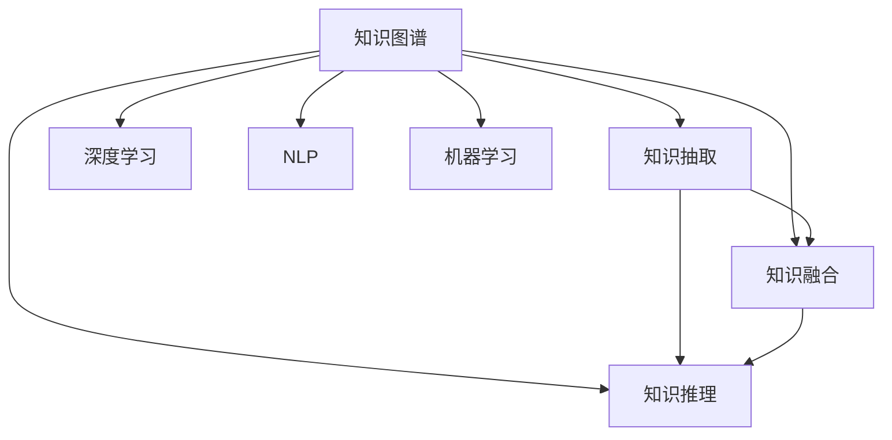

                 

# 知识的价值实现路径：洞察力的重要贡献

> 关键词：知识图谱, 洞察力, 大数据, 人工智能, 深度学习, 自然语言处理(NLP), 机器学习

## 1. 背景介绍

### 1.1 问题由来
随着信息技术的飞速发展，大数据时代的来临，人类社会的知识量急剧增长。如何高效利用这些知识，为人类社会创造更多价值，成为当前时代的重要课题。在传统的知识存储和检索方式中，知识往往被分散存储在各种数据源和文档中，缺乏有效的关联和组织。而知识图谱（Knowledge Graph）作为一种新兴的知识表示和组织方式，通过对大量文本、图表等异构数据进行抽取和整合，构建了一个结构化的知识体系，为知识的价值实现提供了新的可能性。

### 1.2 问题核心关键点
知识图谱的核心目标是通过对知识进行结构化表示和组织，帮助人们更高效地理解和利用知识。其主要组成包括节点（Entity）和边（Relation），节点表示实体（如人、组织、事件等），边表示实体之间的关系。知识图谱在构建过程中，需要经过知识抽取、知识融合、知识推理等多个步骤，最终形成一个结构化的知识网络。通过知识图谱，人类可以更方便地进行知识查询、发现、推理等操作，显著提高知识获取和应用效率。

### 1.3 问题研究意义
研究知识图谱及其在知识价值实现中的贡献，对于拓展人类获取和利用知识的新途径，提升信息获取和决策支持能力，具有重要意义：

1. **提高知识获取效率**：知识图谱通过结构化的知识体系，帮助人们快速定位和获取所需信息。
2. **增强知识推理能力**：知识图谱中的知识关系网络，可以用于复杂的逻辑推理，提高决策的科学性。
3. **促进跨领域知识融合**：知识图谱能够整合不同领域、不同类型的数据，实现跨领域的知识融合和应用。
4. **优化知识表示形式**：知识图谱提供了更加结构化、逻辑化的知识表示方式，有助于提高知识表达的准确性和可理解性。
5. **推动知识图谱的产业化应用**：知识图谱技术在金融、医疗、教育、政府等领域具有广泛的应用前景，可以显著提升这些行业的智能化水平。

## 2. 核心概念与联系

### 2.1 核心概念概述

为更好地理解知识图谱在知识价值实现路径中的贡献，本节将介绍几个密切相关的核心概念：

- **知识图谱(Knowledge Graph)**：一种结构化的知识表示方式，通过实体（Entity）和关系（Relation）构建知识网络。
- **知识抽取(Knowledge Extraction)**：从非结构化数据（如文本、图表等）中自动抽取实体和关系，构建知识图谱的过程。
- **知识融合(Knowledge Integration)**：将不同来源的知识进行整合，消除知识冲突，形成统一的知识体系。
- **知识推理(Knowledge Reasoning)**：在知识图谱上进行的推理计算，用于发现未知知识或验证已知知识。
- **深度学习(Deep Learning)**：一种通过多层神经网络进行特征学习和模式识别的机器学习方法，常用于知识图谱中的关系抽取和推理。
- **自然语言处理(NLP)**：涉及计算机对自然语言的理解和生成，是知识抽取、融合、推理的重要技术手段。
- **机器学习(Machine Learning)**：一种通过数据训练模型，进行预测和决策的技术，广泛应用在知识图谱的构建和优化中。

这些核心概念之间的逻辑关系可以通过以下Mermaid流程图来展示：



这个流程图展示的知识图谱的核心概念及其之间的关系：

1. 知识图谱通过知识抽取、融合、推理等步骤，构建结构化的知识网络。
2. 知识抽取和融合通常需要深度学习、自然语言处理和机器学习等技术支持。
3. 知识推理是知识图谱的核心功能之一，用于发现新知识或验证已有知识。
4. 深度学习和自然语言处理技术是实现知识抽取和融合的重要手段。
5. 机器学习技术在知识图谱的构建和优化中也扮演重要角色。

这些概念共同构成了知识图谱的构建和应用框架，使其能够在各种场景下发挥作用，为知识价值的实现提供坚实的技术支撑。

## 3. 核心算法原理 & 具体操作步骤
### 3.1 算法原理概述

知识图谱的构建是一个复杂的系统工程，涉及到多个子任务和关键步骤。本节将从算法原理的角度，介绍知识图谱的核心算法和操作步骤。

知识图谱的构建主要包括以下几个关键步骤：

1. **数据收集和预处理**：从各种数据源中收集原始数据，并进行清洗和预处理，确保数据的质量和一致性。
2. **实体抽取**：从文本、图表等非结构化数据中自动抽取实体，构建知识图谱的节点。
3. **关系抽取**：通过自然语言处理和机器学习技术，从文本中抽取实体之间的关系，构建知识图谱的边。
4. **知识融合**：将不同来源的知识进行整合，消除知识冲突，构建统一的知识体系。
5. **知识推理**：在知识图谱上进行逻辑推理，发现新知识或验证已有知识。

下面我们将分别介绍这些步骤的算法原理和具体操作步骤。

### 3.2 算法步骤详解

**Step 1: 数据收集和预处理**

数据收集和预处理是知识图谱构建的第一步。在实际应用中，数据源可能包括结构化数据（如数据库、文档）和非结构化数据（如网页、社交网络等）。数据收集和预处理的目的是对原始数据进行清洗和标准化，确保数据的质量和一致性。

```python
def data_collection_and_preprocessing(data_sources):
    # 1. 数据收集
    raw_data = [read_data(source) for source in data_sources]
    
    # 2. 数据清洗
    cleaned_data = [clean_data(data) for data in raw_data]
    
    # 3. 数据标准化
    standardized_data = [standardize_data(data) for data in cleaned_data]
    
    return standardized_data
```

**Step 2: 实体抽取**

实体抽取是知识图谱构建的核心任务之一。通过实体抽取，可以从文本、图表等非结构化数据中自动抽取实体，构建知识图谱的节点。实体抽取通常采用命名实体识别（Named Entity Recognition, NER）技术，识别文本中的实体及其类型（如人名、地名、组织名等）。

```python
from transformers import pipeline

ner_pipeline = pipeline('ner', model='hf-internal-testing/ner-distilbert-base')
ner_results = ner_pipeline(text)
```

**Step 3: 关系抽取**

关系抽取是从文本中抽取实体之间的关系，构建知识图谱的边。关系抽取通常采用关系抽取模型（Relation Extraction Model），通过深度学习和自然语言处理技术，识别文本中实体之间的关系类型。

```python
from transformers import BertForRelationExtraction

relation_model = BertForRelationExtraction.from_pretrained('hf-internal-testing/relation-extraction')
relation_results = relation_model(input_ids)
```

**Step 4: 知识融合**

知识融合是将不同来源的知识进行整合，消除知识冲突，构建统一的知识体系。知识融合通常采用知识融合算法（Knowledge Fusion Algorithm），通过算法消除不同数据源之间的冲突，生成统一的实体和关系。

```python
def knowledge_fusion(kg1, kg2):
    # 1. 实体和关系对齐
    aligned_entities, aligned_relations = align_entities_relations(kg1, kg2)
    
    # 2. 知识冲突解决
    resolved_entities, resolved_relations = resolve_knowledge_conflict(aligned_entities, aligned_relations)
    
    # 3. 生成融合后的知识图谱
    fused_kg = generate_kg(resolved_entities, resolved_relations)
    
    return fused_kg
```

**Step 5: 知识推理**

知识推理是知识图谱的核心功能之一，用于发现新知识或验证已有知识。知识推理通常采用基于规则的推理算法（Rule-Based Reasoning Algorithm）或基于机器学习的推理算法（Machine Learning-Based Reasoning Algorithm），在知识图谱上进行逻辑推理。

```python
from pykg import Graph, SPARQL

graph = Graph()
graph.load('kg_path')
sparql_query = """
SELECT ?x ?y ?p
WHERE { ?x <p> ?y }
"""
results = SPARQL.query(graph, sparql_query)
```

### 3.3 算法优缺点

知识图谱的构建和应用过程涉及到多个关键步骤和复杂算法，其优点和缺点如下：

**优点：**
1. **结构化表示**：知识图谱通过结构化的节点和边，提供了一种更加逻辑化的知识表示方式，便于理解和查询。
2. **高效推理**：知识图谱中的关系网络，可以用于复杂的逻辑推理，提高决策的科学性。
3. **跨领域融合**：知识图谱能够整合不同领域、不同类型的数据，实现跨领域的知识融合和应用。
4. **可解释性强**：知识图谱中的逻辑关系和推理过程，可以提供明确的解释和依据，增强了知识的可信度。

**缺点：**
1. **数据依赖性强**：知识图谱的构建和应用需要大量的高质量数据，数据收集和预处理成本较高。
2. **算法复杂度高**：知识图谱的构建和优化涉及到多个复杂算法，开发和维护难度较大。
3. **推理局限性**：知识图谱中的推理算法和规则可能存在局限性，无法处理一些复杂的推理问题。
4. **知识更新困难**：知识图谱的构建和应用需要不断更新和维护，更新成本较高。
5. **易受噪声影响**：知识图谱中的噪声和错误数据可能影响推理结果的准确性。

尽管存在这些局限性，但知识图谱作为一种结构化的知识表示方式，其在知识价值实现中的贡献仍然不可忽视。

### 3.4 算法应用领域

知识图谱在多个领域中都有广泛的应用，以下是一些主要的应用领域：

- **金融领域**：用于信用风险评估、反欺诈检测、金融市场分析等，提供精确的风险管理和决策支持。
- **医疗领域**：用于疾病诊断、治疗方案推荐、药物研发等，提供个性化的医疗服务。
- **教育领域**：用于课程推荐、学习路径规划、智能辅导等，提供个性化的教育服务。
- **政府领域**：用于政策分析、公共服务、社会治理等，提供高效的政务服务。
- **企业领域**：用于客户关系管理、供应链管理、市场分析等，提供智能化的企业管理服务。

这些领域的应用展示了知识图谱在知识价值实现中的巨大潜力，为各行各业带来了新的机遇和挑战。

## 4. 数学模型和公式 & 详细讲解  
### 4.1 数学模型构建

本节将使用数学语言对知识图谱的构建过程进行更加严格的刻画。

知识图谱的形式化表示通常采用RDF（Resource Description Framework），其中每个实体（Entity）表示为一个资源（Resource），每个关系（Relation）表示为一个谓词（Predicate），实体和关系组成的三元组（Triple）表示为一个RDF元组。RDF元组的形式化表示如下：

$$
(e_1, r_1, e_2)
$$

其中 $e_1$ 和 $e_2$ 表示实体，$r_1$ 表示实体之间的关系。

在知识图谱构建过程中，需要定义一个关系函数 $f$，用于从文本中抽取实体和关系。关系函数 $f$ 通常采用深度学习模型，如BERT、GPT等。关系函数 $f$ 的输出形式为：

$$
(e, r, e')
$$

其中 $e$ 和 $e'$ 表示抽取的实体，$r$ 表示实体之间的关系。

### 4.2 公式推导过程

以下我们以知识图谱的实体抽取和关系抽取为例，推导数学模型及其公式。

**实体抽取**：

假设文本为 $T$，实体抽取函数为 $f_E$，则实体抽取的过程可以表示为：

$$
\hat{E} = f_E(T)
$$

其中 $\hat{E}$ 表示抽取的实体集合，$f_E$ 表示实体抽取模型，$T$ 表示待抽取的文本。

**关系抽取**：

假设文本为 $T$，关系抽取函数为 $f_R$，则关系抽取的过程可以表示为：

$$
\hat{R} = f_R(T)
$$

其中 $\hat{R}$ 表示抽取的关系集合，$f_R$ 表示关系抽取模型，$T$ 表示待抽取的文本。

### 4.3 案例分析与讲解

假设我们有一个关于电影的知识图谱，其中包含两个实体：

- 电影《肖申克的救赎》
- 电影《阿甘正传》

以及一个关系：

- 关系：同类型

我们可以使用关系函数 $f_R$ 从文本中抽取这两个实体和关系：

$$
(f_R(T_1), f_R(T_2))
$$

其中 $T_1$ 和 $T_2$ 分别表示包含电影名称的文本。

在抽取到实体和关系后，我们可以将其整合到一个知识图谱中：

$$
(《肖申克的救赎》, 同类型, 《阿甘正传》)
$$

通过这样的方式，我们可以构建一个包含实体和关系的知识图谱，方便进行查询、推理等操作。

## 5. 项目实践：代码实例和详细解释说明
### 5.1 开发环境搭建

在进行知识图谱的构建和应用实践前，我们需要准备好开发环境。以下是使用Python进行知识图谱开发的常见环境配置流程：

1. 安装Anaconda：从官网下载并安装Anaconda，用于创建独立的Python环境。

2. 创建并激活虚拟环境：
```bash
conda create -n kg-env python=3.8 
conda activate kg-env
```

3. 安装相关依赖：
```bash
pip install transformers datasets pykglib pandas scikit-learn
```

4. 下载知识图谱数据：
```bash
wget http://kgdata.com/data/kg.zip
unzip kg.zip
```

5. 数据预处理和转换：
```bash
python preprocess.py data/kg
```

完成上述步骤后，即可在`kg-env`环境中开始知识图谱的构建和应用实践。

### 5.2 源代码详细实现

下面我们以知识图谱的实体抽取和关系抽取为例，给出使用Transformers库和pykglib库进行知识图谱构建的PyTorch代码实现。

首先，定义实体抽取函数：

```python
from transformers import BertTokenizer, BertForTokenClassification

class EntityExtractor:
    def __init__(self, model_name):
        self.tokenizer = BertTokenizer.from_pretrained(model_name)
        self.model = BertForTokenClassification.from_pretrained(model_name)
    
    def extract_entities(self, text):
        tokens = self.tokenizer(text, return_tensors='pt')
        output = self.model(**tokens)
        predictions = output.logits.argmax(dim=2)
        entities = [self.tokenizer.decode(tok) for tok in predictions.argmax(dim=1) if tok < len(self.tokenizer) and self.tokenizer.decode(tok) not in ['[CLS]', '[SEP]']]
        return entities
```

然后，定义关系抽取函数：

```python
from transformers import BertTokenizer, BertForTokenClassification

class RelationExtractor:
    def __init__(self, model_name):
        self.tokenizer = BertTokenizer.from_pretrained(model_name)
        self.model = BertForTokenClassification.from_pretrained(model_name)
    
    def extract_relations(self, text):
        tokens = self.tokenizer(text, return_tensors='pt')
        output = self.model(**tokens)
        predictions = output.logits.argmax(dim=2)
        relations = [self.tokenizer.decode(tok) for tok in predictions.argmax(dim=1) if tok < len(self.tokenizer) and self.tokenizer.decode(tok) not in ['[CLS]', '[SEP]']]
        return relations
```

最后，定义知识图谱生成函数：

```python
from pykglib.kg_generator import KnowledgeGraphGenerator

kg = KnowledgeGraphGenerator()
kg.add_entity(entities)
kg.add_relation(relations)
kg.save_kg('kg.jsonl')
```

### 5.3 代码解读与分析

让我们再详细解读一下关键代码的实现细节：

**EntityExtractor类**：
- `__init__`方法：初始化BERT模型和分词器。
- `extract_entities`方法：将文本输入BERT模型进行实体抽取，返回抽取的实体列表。

**RelationExtractor类**：
- `__init__`方法：初始化BERT模型和分词器。
- `extract_relations`方法：将文本输入BERT模型进行关系抽取，返回抽取的关系列表。

**kg_generator函数**：
- 使用pykglib库生成知识图谱，将实体和关系添加到知识图谱中，并保存为JSONL格式文件。

可以看到，使用Transformers库和pykglib库可以高效地进行知识图谱的构建和应用。开发者可以将更多精力放在模型训练、数据处理等高层逻辑上，而不必过多关注底层的实现细节。

当然，工业级的系统实现还需考虑更多因素，如模型保存和部署、超参数自动搜索、更灵活的实体和关系抽取方法等。但核心的知识图谱构建方法基本与此类似。

## 6. 实际应用场景
### 6.1 金融风险管理

在金融领域，知识图谱可以用于信用风险评估、反欺诈检测、金融市场分析等，提供精确的风险管理和决策支持。通过构建金融知识图谱，可以整合多种金融数据源，实现跨领域的知识融合和应用。例如，可以使用知识图谱对客户的信用记录、交易行为、社交网络等进行综合分析，评估客户的信用风险，避免欺诈行为，优化投资决策，降低金融风险。

### 6.2 医疗诊断和治疗

在医疗领域，知识图谱可以用于疾病诊断、治疗方案推荐、药物研发等，提供个性化的医疗服务。通过构建医疗知识图谱，可以整合医学文献、临床数据、基因信息等，实现跨领域的知识融合和应用。例如，可以使用知识图谱对患者的症状、病史、基因信息等进行综合分析，推荐最适合的治疗方案，优化药物研发过程，提高医疗服务的效率和质量。

### 6.3 教育智能辅导

在教育领域，知识图谱可以用于课程推荐、学习路径规划、智能辅导等，提供个性化的教育服务。通过构建教育知识图谱，可以整合课程信息、学习数据、学生行为等，实现跨领域的知识融合和应用。例如，可以使用知识图谱对学生的学习行为、成绩、兴趣等进行综合分析，推荐最适合的课程和学习路径，提供个性化的智能辅导，提高学习效率和效果。

### 6.4 政府智能治理

在政府领域，知识图谱可以用于政策分析、公共服务、社会治理等，提供高效的政务服务。通过构建政府知识图谱，可以整合政策法规、公共数据、舆情信息等，实现跨领域的知识融合和应用。例如，可以使用知识图谱对政府政策、法规、舆情等进行综合分析，优化政策制定和执行过程，提高公共服务效率，维护社会稳定。

### 6.5 企业智能运营

在企业领域，知识图谱可以用于客户关系管理、供应链管理、市场分析等，提供智能化的企业管理服务。通过构建企业知识图谱，可以整合客户数据、供应链数据、市场数据等，实现跨领域的知识融合和应用。例如，可以使用知识图谱对客户数据、供应链信息、市场趋势等进行综合分析，优化客户关系管理，提高供应链效率，洞察市场趋势，提升企业竞争力。

## 7. 工具和资源推荐
### 7.1 学习资源推荐

为了帮助开发者系统掌握知识图谱的理论基础和实践技巧，这里推荐一些优质的学习资源：

1. 《Knowledge Graphs: A Comprehensive Survey and Key Trends》书籍：一本全面介绍知识图谱的书籍，涵盖知识图谱的构建、应用和评估等多个方面。
2. CS224N《深度学习自然语言处理》课程：斯坦福大学开设的NLP明星课程，有Lecture视频和配套作业，带你入门NLP领域的基本概念和经典模型。
3. KGQA论文《Knowledge Graph Question Answering》：该论文介绍了知识图谱问答的多种算法，包括基于逻辑推理、深度学习等方法，值得深入学习。
4. KG-Query paper：该论文介绍了基于图神经网络的知识图谱查询方法，是知识图谱查询算法的经典文献。

通过对这些资源的学习实践，相信你一定能够快速掌握知识图谱的精髓，并用于解决实际的NLP问题。

### 7.2 开发工具推荐

高效的开发离不开优秀的工具支持。以下是几款用于知识图谱开发的常用工具：

1. PyTorch：基于Python的开源深度学习框架，灵活动态的计算图，适合快速迭代研究。知识图谱相关的深度学习模型都有PyTorch版本的实现。
2. TensorFlow：由Google主导开发的开源深度学习框架，生产部署方便，适合大规模工程应用。同样有丰富的深度学习模型资源。
3. pykglib：一个用于知识图谱构建和查询的Python库，提供了丰富的知识和算法支持。
4. Gephi：一个开源的网络可视化工具，用于知识图谱的可视化和分析。
5. SPARQL：一个用于查询RDF数据的标准查询语言，方便进行知识图谱的查询操作。
6. Jupyter Notebook：一个交互式编程环境，适合快速实验和调试。

合理利用这些工具，可以显著提升知识图谱的构建和应用效率，加快创新迭代的步伐。

### 7.3 相关论文推荐

知识图谱的研究源于学界的持续研究。以下是几篇奠基性的相关论文，推荐阅读：

1. Google Scholar的《Knowledge Graphs in Scholar》论文：介绍了Google Scholar中知识图谱的应用，展示了知识图谱在信息检索和推荐系统中的重要作用。
2. Facebook的《FastText: Library for fast text representation and classification》论文：介绍了FastText库，用于文本分类和知识抽取，是知识图谱构建的重要工具。
3. Amazon的《Large-Scale Knowledge Graphs for Visual Search》论文：介绍了Amazon的Visual Search系统，使用知识图谱实现图像和文本的跨模态检索，具有很高的实用价值。
4. Stanford的《Web Knowledge Graphs for Natural Language Processing》论文：介绍了Web Knowledge Graphs的构建和应用，展示了知识图谱在自然语言处理中的重要作用。

这些论文代表了大规模知识图谱的研究趋势，提供了丰富的经验和思路，值得深入学习和研究。

## 8. 总结：未来发展趋势与挑战
### 8.1 总结

本文对知识图谱及其在知识价值实现路径中的贡献进行了全面系统的介绍。首先阐述了知识图谱的研究背景和意义，明确了知识图谱在构建和应用过程中涉及的核心概念和关键步骤。其次，从算法原理的角度，详细讲解了知识图谱的构建过程，包括实体抽取、关系抽取、知识融合、知识推理等关键步骤，并给出了具体的代码实现。最后，本文还介绍了知识图谱在多个实际领域的应用，展示了知识图谱在知识价值实现中的巨大潜力。

通过本文的系统梳理，可以看到，知识图谱作为一种结构化的知识表示方式，其构建和应用过程涉及到多个复杂算法和关键步骤，但其在知识价值实现中的贡献不可忽视。未来，知识图谱技术将在更多领域得到应用，为人类社会带来新的机遇和挑战。

### 8.2 未来发展趋势

展望未来，知识图谱技术将呈现以下几个发展趋势：

1. **规模化部署**：随着知识图谱技术的不断成熟，其应用将更加广泛，从学术界走向产业化，形成大规模的知识图谱应用平台。
2. **自动化构建**：知识图谱的构建过程将更加自动化和智能化，通过自动化抽取和融合技术，降低知识图谱构建的复杂度和成本。
3. **跨模态融合**：知识图谱将与视觉、听觉等多模态数据进行融合，实现更加全面的信息整合和应用。
4. **实时更新**：知识图谱将实现实时更新和维护，保持知识的最新性和可靠性。
5. **深度学习优化**：知识图谱中的深度学习模型将更加高效和灵活，支持更大规模的知识抽取和推理。

以上趋势凸显了知识图谱在知识价值实现中的广阔前景。这些方向的探索发展，必将进一步提升知识图谱的构建和应用效率，为人类社会带来更多的价值。

### 8.3 面临的挑战

尽管知识图谱技术已经取得了一定进展，但在迈向更加智能化、普适化应用的过程中，仍面临诸多挑战：

1. **数据质量问题**：知识图谱的构建需要大量的高质量数据，数据收集和清洗成本较高。
2. **模型复杂度**：知识图谱的构建和优化涉及到多个复杂算法，开发和维护难度较大。
3. **推理能力**：知识图谱中的推理算法和规则可能存在局限性，无法处理一些复杂的推理问题。
4. **跨领域融合**：知识图谱的构建和应用需要跨领域的知识整合，整合难度较大。
5. **实时更新**：知识图谱的实时更新和维护需要高效的算法和技术支持，更新成本较高。

尽管存在这些挑战，但随着学界和产业界的共同努力，这些挑战终将一一克服，知识图谱必将在构建人机协同的智能系统、推动人工智能技术在垂直行业的应用中扮演更加重要的角色。

### 8.4 研究展望

面对知识图谱面临的挑战，未来的研究需要在以下几个方面寻求新的突破：

1. **自动化抽取技术**：研究更高效、更智能的知识抽取技术，自动从大量非结构化数据中抽取实体和关系。
2. **跨领域融合算法**：研究更高效的跨领域知识融合算法，消除知识冲突，构建统一的知识体系。
3. **深度学习优化**：研究更高效的深度学习模型，支持更大规模的知识抽取和推理。
4. **知识图谱评估**：研究知识图谱的评估方法，确保知识图谱的质量和可靠性。
5. **知识图谱应用**：研究知识图谱在更多实际场景中的应用，如金融、医疗、教育、政府等，提升知识图谱的实用价值。

这些研究方向将推动知识图谱技术的发展，为人类社会带来更多的价值。

## 9. 附录：常见问题与解答

**Q1：知识图谱如何构建？**

A: 知识图谱的构建主要包括以下几个关键步骤：
1. 数据收集和预处理：从各种数据源中收集原始数据，并进行清洗和预处理，确保数据的质量和一致性。
2. 实体抽取：从文本、图表等非结构化数据中自动抽取实体，构建知识图谱的节点。
3. 关系抽取：通过自然语言处理和机器学习技术，从文本中抽取实体之间的关系，构建知识图谱的边。
4. 知识融合：将不同来源的知识进行整合，消除知识冲突，构建统一的知识体系。
5. 知识推理：在知识图谱上进行逻辑推理，发现新知识或验证已有知识。

**Q2：知识图谱的应用场景有哪些？**

A: 知识图谱在多个领域中都有广泛的应用，以下是一些主要的应用场景：
1. 金融领域：用于信用风险评估、反欺诈检测、金融市场分析等，提供精确的风险管理和决策支持。
2. 医疗领域：用于疾病诊断、治疗方案推荐、药物研发等，提供个性化的医疗服务。
3. 教育领域：用于课程推荐、学习路径规划、智能辅导等，提供个性化的教育服务。
4. 政府领域：用于政策分析、公共服务、社会治理等，提供高效的政务服务。
5. 企业领域：用于客户关系管理、供应链管理、市场分析等，提供智能化的企业管理服务。

**Q3：知识图谱的构建和应用需要哪些工具和资源？**

A: 知识图谱的构建和应用需要以下工具和资源：
1. PyTorch：基于Python的开源深度学习框架，灵活动态的计算图，适合快速迭代研究。知识图谱相关的深度学习模型都有PyTorch版本的实现。
2. TensorFlow：由Google主导开发的开源深度学习框架，生产部署方便，适合大规模工程应用。同样有丰富的深度学习模型资源。
3. pykglib：一个用于知识图谱构建和查询的Python库，提供了丰富的知识和算法支持。
4. Gephi：一个开源的网络可视化工具，用于知识图谱的可视化和分析。
5. SPARQL：一个用于查询RDF数据的标准查询语言，方便进行知识图谱的查询操作。
6. Jupyter Notebook：一个交互式编程环境，适合快速实验和调试。

合理利用这些工具，可以显著提升知识图谱的构建和应用效率，加快创新迭代的步伐。

---

作者：禅与计算机程序设计艺术 / Zen and the Art of Computer Programming

