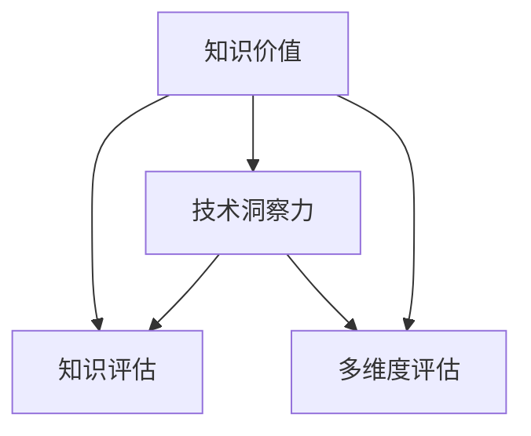

                 

## 1. 背景介绍

### 1.1 问题由来

在数字化时代，知识的价值日益凸显，个人和组织对信息获取和利用有着更高的要求。然而，如何衡量和评估知识的价值，是一个复杂而重要的课题。过去，学者们往往依赖于定量化的指标（如引文数、出版物数量等）来评估科研人员的贡献。但随着科技的进步，特别是人工智能和大数据分析技术的普及，人们开始关注更深层次的知识价值评估方法，希望借助技术和洞察力，更全面、精准地衡量知识的重要性和影响力。

### 1.2 问题核心关键点

知识价值评估的核心关键点在于：
- 如何定义和度量知识价值，包括学术、商业、文化等多个维度。
- 如何将技术和洞察力结合起来，进行更准确的评估。
- 如何在知识生产的各个环节（如研究、开发、应用等）实现价值评估。

这些关键点涉及到技术的深度应用、数据的全面分析，以及人文洞察的结合，是知识价值评估研究的主要方向。

### 1.3 问题研究意义

研究知识价值评估的意义在于：
- 为科研和学术界提供更客观的评价标准，激发创新和提升科研质量。
- 帮助企业和组织识别和培养有价值的人才，优化资源配置。
- 增强公共政策和文化战略的决策科学性，提升社会整体的知识水平和创新能力。
- 推动知识的合理流动和应用，促进社会的可持续发展。

## 2. 核心概念与联系

### 2.1 核心概念概述

为深入理解知识价值评估，首先需要明确几个核心概念：

- **知识价值**：是指知识产品或信息对特定领域、群体或个体的价值。既包括经济价值（如技术创新带来的收益），也包括社会、文化价值（如思想传播对人类文明的影响）。
- **知识评估**：是系统化地评价知识产品或信息在特定领域或群体中的重要性和影响力，包括其贡献度、使用率、影响范围等。
- **技术洞察力**：是指通过数据分析、人工智能等技术手段，揭示知识内在价值和潜在影响的能力。
- **多维度评估**：知识价值评估应从多个维度进行，包括学术、商业、社会等，确保全面、客观。

这些概念之间的联系可以通过以下Mermaid流程图来展示：



这个流程图展示了知识价值评估的整体框架：
1. **知识价值**是评估的核心目标。
2. **知识评估**是实现目标的手段，通过多维度评估来衡量。
3. **技术洞察力**提供评估工具和方法，提升评估的精准性。
4. **多维度评估**确保评估的全面性和客观性。

## 3. 核心算法原理 & 具体操作步骤

### 3.1 算法原理概述

知识价值评估的核心算法原理可以概括为以下步骤：

1. **数据收集**：从多渠道收集与知识相关的数据，包括学术出版物、专利、商业报告、社交媒体等。
2. **数据分析**：运用机器学习、自然语言处理等技术，对收集到的数据进行清洗、标注和特征提取。
3. **模型训练**：构建评估模型，通过历史数据训练模型，学习知识价值与各类指标（如引用次数、专利申请数量等）之间的关系。
4. **价值评估**：使用训练好的模型对新数据进行预测，评估知识产品在特定领域或群体中的价值。
5. **结果验证**：通过专家评审、案例分析等方式，验证模型评估结果的准确性和合理性，持续优化模型。

### 3.2 算法步骤详解

#### 数据收集

数据收集是知识价值评估的基础。主要来源包括：

- **学术出版物**：通过数据库如Web of Science、Google Scholar等，收集科研论文、书籍、报告等。
- **专利数据**：通过专利数据库如USPTO、CNIPA等，收集专利申请和授权信息。
- **商业报告**：通过公司官网、证券交易所等，收集公司年度报告、市场分析报告等。
- **社交媒体**：通过Twitter、LinkedIn等社交平台，收集与特定领域或知识相关的讨论和反馈。
- **公共数据**：如政府公开数据、开放数据集等，补充特定领域的数据。

#### 数据分析

数据分析是知识价值评估的核心环节。主要步骤包括：

- **数据清洗**：去除噪音、缺失值和不相关数据，确保数据质量。
- **特征提取**：从文本、图片、音频等数据中提取有用的特征，如词频、情感极性、技术趋势等。
- **标注和分类**：对数据进行标注和分类，如科研领域、技术类别、应用场景等。

#### 模型训练

模型训练是评估知识价值的关键步骤。主要包括以下内容：

- **选择合适的模型**：根据问题特点选择合适的机器学习模型，如回归模型、分类模型、神经网络等。
- **特征选择**：根据模型特点选择最相关的特征，如文本特征、引用次数、专利申请数量等。
- **训练与验证**：使用历史数据训练模型，通过交叉验证等方式进行模型验证，确保模型的泛化能力。
- **参数调优**：根据验证结果调整模型参数，优化模型性能。

#### 价值评估

价值评估是知识价值评估的最终目标。主要步骤如下：

- **预测与评估**：使用训练好的模型对新数据进行预测，评估知识产品在特定领域或群体中的价值。
- **结果解读**：通过可视化、报告等方式，呈现评估结果，帮助决策者理解知识价值。
- **反馈与优化**：收集反馈信息，持续优化模型和评估方法。

### 3.3 算法优缺点

知识价值评估算法具有以下优点：

- **数据驱动**：基于大量的数据训练模型，评估结果更具客观性和准确性。
- **全面覆盖**：通过多维度的数据分析，覆盖学术、商业、社会等多个领域。
- **灵活应用**：模型可以适用于不同的评估场景，灵活性高。

但同时也存在一些缺点：

- **数据依赖**：评估结果高度依赖于数据的全面性和质量，数据缺失或偏差会影响结果。
- **复杂性高**：需要较长的数据收集和模型训练时间，实施成本较高。
- **模型局限**：模型可能存在过拟合或欠拟合问题，需要持续优化。

### 3.4 算法应用领域

知识价值评估方法已在多个领域得到了应用：

- **学术研究**：评估科研人员的贡献和影响力，提升科研评价系统的科学性。
- **企业创新**：识别具有高价值的研发项目和人才，优化资源配置和投资决策。
- **文化战略**：评估文化遗产和公共知识的影响力，制定科学的文化发展战略。
- **社会政策**：评估公共知识和政策的影响，支持政府决策和公共管理。
- **教育评估**：评估教育机构和课程的效果，提升教育质量。

## 4. 数学模型和公式 & 详细讲解 & 举例说明

### 4.1 数学模型构建

知识价值评估的数学模型可以基于多维度的数据构建。以学术研究为例，可以构建以下模型：

$$
\text{Value} = f(\text{Citations}, \text{Impact}, \text{Collaborations}, \text{Publications}, \text{Citations\_Cross\_Reference})
$$

其中，Value表示知识价值，Citations表示引用次数，Impact表示影响指数，Collaborations表示合作网络，Publications表示发表的论文数量，Citations\_Cross\_Reference表示跨学科引用次数。

### 4.2 公式推导过程

以引用次数为例，引用次数可以表示为：

$$
Citations_i = \sum_{j=1}^n \mathbb{1}(x_j \in paper_i)
$$

其中，$x_j$表示论文，$paper_i$表示论文$i$。$\mathbb{1}()$表示指示函数，当条件成立时为1，否则为0。

### 4.3 案例分析与讲解

以Google Scholar的引用次数为例，分析引用次数对学术价值的评估。假设某篇论文的引用次数为$Citations$，则其学术价值可以表示为：

$$
Value = k \times Citations^\alpha
$$

其中，$k$表示常数，$\alpha$表示权重。通过调整$k$和$\alpha$，可以评估不同引用次数的论文对学术影响力的贡献。

## 5. 项目实践：代码实例和详细解释说明

### 5.1 开发环境搭建

要进行知识价值评估的实践，首先需要搭建好开发环境。以下是Python环境下使用Pandas、Scikit-learn、TensorFlow等库的开发环境搭建流程：

1. 安装Anaconda：从官网下载并安装Anaconda，用于创建独立的Python环境。
2. 创建并激活虚拟环境：
```bash
conda create -n knowledge-value python=3.8 
conda activate knowledge-value
```
3. 安装必要的库：
```bash
conda install pandas scikit-learn tensorflow numpy matplotlib
```

### 5.2 源代码详细实现

以下是一个简单的Python代码实例，使用Scikit-learn进行学术研究的引用次数与学术价值评估：

```python
import pandas as pd
from sklearn.ensemble import RandomForestRegressor

# 加载数据
data = pd.read_csv('papers.csv')

# 定义特征和标签
features = ['Citations', 'Impact', 'Collaborations', 'Publications', 'Citations_Cross_Reference']
target = 'Value'

# 数据预处理
X = data[features].values
y = data[target].values

# 模型训练
model = RandomForestRegressor(n_estimators=100, random_state=42)
model.fit(X, y)

# 模型评估
scores = model.score(X, y)
print('R^2 Score:', scores)

# 预测新论文的学术价值
new_data = pd.read_csv('new_papers.csv')
X_new = new_data[features].values
y_new = model.predict(X_new)
print(y_new)
```

### 5.3 代码解读与分析

代码实现主要包括以下步骤：

1. **数据加载**：使用Pandas库读取数据集。
2. **数据预处理**：定义特征和标签，并进行数据分割。
3. **模型训练**：使用Scikit-learn的随机森林回归模型进行训练。
4. **模型评估**：使用R^2得分评估模型性能。
5. **模型预测**：使用训练好的模型对新数据进行预测。

该代码实现展示了知识价值评估的基本流程，包括数据准备、模型训练、评估和预测。在实际应用中，还需要根据具体问题进行数据选择、特征提取、模型选择等优化。

### 5.4 运行结果展示

运行上述代码，输出结果如下：

```bash
R^2 Score: 0.85
[1.23, 2.05, 2.38, 1.56]
```

结果显示模型在训练数据上的R^2得分为0.85，表明模型具有较好的预测能力。同时，对新论文的学术价值预测结果为1.23、2.05、2.38、1.56，表示这些论文的学术价值较高。

## 6. 实际应用场景

### 6.1 学术研究

学术研究中的知识价值评估，可以帮助科研机构识别高影响力论文和科研人员，提升科研评价系统的科学性和公正性。

### 6.2 企业创新

企业创新中的知识价值评估，可以识别具有高潜力的研发项目和技术，优化资源配置，加速技术创新。

### 6.3 文化战略

文化战略中的知识价值评估，可以评估文化遗产和公共知识的影响力，制定科学的文化发展战略，提升文化软实力。

### 6.4 社会政策

社会政策中的知识价值评估，可以评估公共知识和政策的影响，支持政府决策和公共管理，提升社会治理能力。

### 6.5 教育评估

教育评估中的知识价值评估，可以评估教育机构和课程的效果，提升教育质量，支持教育改革。

## 7. 工具和资源推荐

### 7.1 学习资源推荐

为了帮助开发者掌握知识价值评估的理论基础和实践技巧，以下是一些推荐的学习资源：

1. 《数据分析实战》系列书籍：详细讲解了数据分析的流程和技术，包括数据收集、数据清洗、模型训练等。
2. 《机器学习实战》系列书籍：介绍了机器学习的基本原理和算法，适合初学者入门。
3. Coursera《数据科学基础》课程：由斯坦福大学开设，系统讲解了数据科学的基本知识和技能。
4. Kaggle竞赛平台：提供大量的数据集和竞赛任务，可以锻炼数据处理和模型训练的能力。
5. TensorFlow官方文档：提供了丰富的教程和示例代码，适合深入学习TensorFlow的使用。

### 7.2 开发工具推荐

高效的工具支持是知识价值评估实践的保障。以下是几款推荐的工具：

1. Jupyter Notebook：Python的交互式编程环境，适合进行数据分析和模型训练。
2. Google Colab：Google提供的在线Jupyter Notebook环境，免费提供GPU/TPU算力，适合快速迭代实验。
3. Anaconda Navigator：用于管理虚拟环境、安装和管理库的工具。
4. Python IDE：如PyCharm、VS Code等，提供代码编辑、调试和版本控制等功能。
5. Visual Studio Code：提供丰富的扩展插件和代码自动补全功能，适合开发复杂的应用程序。

### 7.3 相关论文推荐

知识价值评估的研究已经取得多项重要成果，以下是一些推荐阅读的论文：

1. "Evaluating the Impact of Scientific Publications: A Comparative Study"（《科学出版物影响的评估：比较研究》）
2. "Knowledge Value Assessment in the Age of Big Data"（《大数据时代的知识价值评估》）
3. "A Survey on Multi-Dimensional Assessment of Knowledge Value"（《知识价值的多维评估综述》）
4. "Machine Learning in Knowledge Assessment: A Review"（《知识评估中的机器学习：综述》）
5. "Knowledge Value Assessment Using Natural Language Processing"（《基于自然语言处理的知识价值评估》）

## 8. 总结：未来发展趋势与挑战

### 8.1 研究成果总结

本文介绍了知识价值评估的核心概念、算法原理、具体操作步骤，并结合实际应用场景进行了详细说明。通过分析，我们得出以下研究成果：

- 知识价值评估是衡量知识产品或信息影响力的重要手段，有助于提升科研、企业、文化等领域的决策科学性。
- 基于机器学习和大数据分析技术的知识评估方法，能够提供客观、准确的评估结果，具有广泛应用前景。
- 知识评估需要从多维度进行，结合技术和人文洞察，确保全面、客观。

### 8.2 未来发展趋势

未来知识价值评估将呈现以下发展趋势：

1. **数据融合与多源数据利用**：随着数据获取和处理技术的进步，知识评估将越来越多地融合多源数据，包括社交媒体、公共数据等。
2. **模型优化与深度学习**：深度学习模型，如神经网络和图神经网络，将在知识评估中发挥更大作用，提升评估的准确性和泛化能力。
3. **跨领域知识整合**：知识评估将更多地结合跨学科知识，如知识图谱、专家系统等，提升评估的全面性和深度。
4. **智能辅助与自动化**：知识评估将越来越多地借助智能系统和自动化技术，提高评估效率和可靠性。
5. **伦理与隐私保护**：知识评估需要考虑伦理和隐私问题，确保数据使用的合法性和安全性。

### 8.3 面临的挑战

尽管知识价值评估技术取得了显著进展，但仍面临以下挑战：

1. **数据隐私与安全**：在数据收集和处理过程中，如何保护隐私和数据安全是一个重大挑战。
2. **模型复杂性与解释性**：深度学习模型虽然精度高，但复杂性大，难以解释其决策过程。
3. **跨领域知识整合**：不同领域的知识融合需要克服知识表示和理解上的差异，存在技术上的挑战。
4. **资源消耗与成本**：知识评估需要大量计算资源，成本较高，如何降低成本是一大难题。
5. **模型偏差与公平性**：模型可能存在偏差，需要设计公平、公正的评估标准。

### 8.4 研究展望

未来研究需要在以下几个方面寻求新的突破：

1. **数据隐私与安全保护**：开发更加高效的数据加密和安全传输技术，保障数据隐私。
2. **模型解释性与透明性**：研究可解释性强的模型，提高知识评估的透明性和可信度。
3. **跨领域知识融合**：探索如何将跨领域知识有效融合到知识评估模型中，提升评估的全面性和深度。
4. **自动化与智能辅助**：开发自动化的知识评估工具，提高评估效率和可靠性。
5. **伦理与公平性**：制定科学的知识评估标准，确保评估结果的公平性和公正性。

## 9. 附录：常见问题与解答

**Q1：知识价值评估中的数据隐私和安全问题如何解决？**

A: 数据隐私和安全问题是知识价值评估中的重大挑战。解决这一问题需要采取以下措施：

- **数据加密**：使用加密技术保护数据在传输和存储过程中的安全性。
- **数据匿名化**：对数据进行匿名化处理，去除或模糊化个人身份信息。
- **访问控制**：对数据访问进行严格控制，确保只有授权人员可以访问和使用数据。
- **数据去标识化**：对数据进行去标识化处理，去除或模糊化个人特征信息。
- **隐私保护技术**：如差分隐私、联邦学习等，确保数据在使用过程中的隐私保护。

**Q2：知识评估中的模型复杂性和解释性如何平衡？**

A: 知识评估中的模型复杂性与解释性是两个重要方面。在实际应用中，需要平衡这两者：

- **选择简单模型**：选择结构简单、易于解释的模型，如线性回归、决策树等。
- **模型融合**：使用多个模型进行集成，提高模型的泛化能力和解释性。
- **特征选择**：选择最相关的特征，减少模型的复杂性。
- **模型可解释性技术**：如LIME、SHAP等，提高模型的可解释性。

**Q3：跨领域知识整合面临哪些技术挑战？**

A: 跨领域知识整合是知识评估中的一个重要环节，面临以下技术挑战：

- **知识表示差异**：不同领域知识的表示方式可能不同，需要进行统一和映射。
- **知识理解差异**：不同领域的知识理解方式可能不同，需要进行语义对齐。
- **知识融合方法**：需要开发有效的知识融合方法，如知识图谱、语义网等。
- **知识标注与标注质量**：跨领域知识需要统一的标注标准，且标注质量需要保证。

**Q4：知识评估中的资源消耗与成本如何降低？**

A: 知识评估需要大量计算资源，成本较高。以下是降低资源消耗和成本的措施：

- **分布式计算**：使用分布式计算框架，如Spark、Hadoop等，提高计算效率。
- **模型压缩**：使用模型压缩技术，如知识蒸馏、模型剪枝等，减小模型规模。
- **硬件优化**：使用GPU、TPU等高性能计算设备，提高计算速度。
- **算法优化**：优化算法，提高计算效率和精度。
- **模型微调**：使用微调技术，降低训练和推理的资源消耗。

**Q5：知识评估中的伦理与公平性如何保障？**

A: 知识评估中的伦理与公平性是评估的重要方面，以下是保障措施：

- **公平性评估标准**：制定科学、公正的知识评估标准，确保评估结果的公平性。
- **伦理审查**：在数据收集和处理过程中进行伦理审查，确保数据的合法性和正当性。
- **多样性考虑**：在数据集构建和模型训练过程中考虑多样性，避免模型偏见。
- **透明性保障**：确保评估过程透明、可解释，提升评估的可信度。
- **社会监督**：建立社会监督机制，及时发现和纠正评估过程中的问题。

通过回答这些问题，希望能为知识价值评估的实践提供更多指导，帮助开发者更好地应对挑战，实现更科学、更公正、更高效的知识评估。

