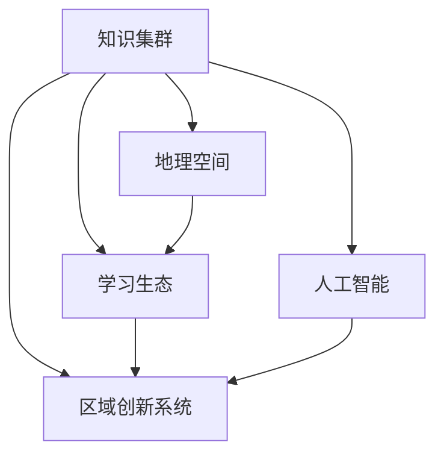

                 

# 知识的区域创新集群：地理空间的学习生态

> 关键词：知识集群, 地理空间, 学习生态, 区域创新系统, 人工智能, 数据驱动, 生态系统演化

## 1. 背景介绍

### 1.1 问题由来

随着科技和互联网的迅速发展，知识的获取和传播方式发生了深刻变革。人工智能（AI）、大数据、云计算等新兴技术的应用，正在引领一场知识生产的革命。其中，基于地理位置的知识集群（Knowledge Cluster）逐渐成为区域创新发展的关键驱动力。地理空间的学习生态（Learning Ecology），涵盖了从知识的生产、传播、应用到创新人才培养的各个环节，不仅推动了区域经济的快速发展，也塑造了新时代的教育与知识生产新模式。

本研究聚焦于地理空间的学习生态，以人工智能为切入点，探讨在人工智能技术驱动下，知识的区域创新集群如何形成，以及其在地理空间上的分布、演化和未来趋势。通过剖析不同区域知识集群的特点和实践案例，我们将提供一份关于知识集群建设的参考指南，助力地方政府、教育机构和企业更好地规划和推动区域知识创新的发展。

## 2. 核心概念与联系

### 2.1 核心概念概述

- **知识集群（Knowledge Cluster）**：指以特定行业或技术领域为中心，由多个大学、研究机构、企业、创业公司、政府机构等组成的网络结构。这些主体通过协同合作，共享资源，形成密集的创新生态，推动新技术、新产品的开发和商业化。
- **地理空间（Geospatial）**：结合地理信息和空间数据的分析，研究人类社会活动与空间位置之间的关系。地理空间学习生态，关注知识集群在地理空间上的分布、演化和互动。
- **学习生态（Learning Ecology）**：涉及学习环境、学习资源、学习过程、学习者等多个维度，强调多主体之间的互动与协同，以及知识产生、传播和应用的动态过程。
- **区域创新系统（Regional Innovation System, RIS）**：指由区域内的各种创新主体组成的网络，包括企业、研究机构、大学、政府等，共同推动区域创新能力的提升。
- **人工智能（Artificial Intelligence, AI）**：一种模拟人类智能行为的技术，涉及机器学习、深度学习、自然语言处理、计算机视觉等多个领域，广泛应用于数据驱动的决策支持和智能制造等领域。

这些概念之间的关系可以通过以下Mermaid流程图来展示：



## 3. 核心算法原理 & 具体操作步骤

### 3.1 算法原理概述

知识集群在地理空间上的形成和演化，受多因素共同影响，包括技术进步、市场需求、政策环境、文化背景等。我们采用多主体模型和多层次模型，从宏观和微观两个层面进行分析。

- **宏观层面**：采用系统动力学（System Dynamics）模型，模拟知识集群在地理空间上的分布和演化过程，考虑技术扩散、市场竞争、政策激励、区域经济差异等影响因素。
- **微观层面**：使用网络分析方法，研究知识集群内部各主体间的互动关系和信息流动，包括知识共享、合作研发、人才培养等方面。

### 3.2 算法步骤详解

**Step 1: 数据准备与模型构建**

- 收集数据：包括各区域经济指标、教育资源分布、技术创新成果、企业数量和规模、政府政策等。
- 确定模型：根据研究目的，选择适合的系统动力学模型和网络分析模型。

**Step 2: 模型参数设置与数据处理**

- 参数设定：设定模型中的参数，如技术扩散系数、市场竞争强度、政策激励力度等。
- 数据预处理：清洗数据，处理缺失值和异常值，确保数据的准确性和一致性。

**Step 3: 模型模拟与结果分析**

- 模型模拟：利用SimPy等工具进行系统动力学模型的仿真，观察知识集群在地理空间上的分布和演化。
- 网络分析：采用Cytoscape等软件，分析知识集群内部各主体间的互动关系和信息流动。

**Step 4: 结果可视化与反馈调整**

- 结果可视化：通过GIS等地理信息系统软件，将模型模拟结果可视化，展示知识集群在地理空间上的分布和演化。
- 反馈调整：根据模拟结果，调整模型参数和数据，进一步优化模型预测的准确性。

### 3.3 算法优缺点

**优点**：
- 系统动力学模型能够模拟知识集群在地理空间上的动态演化，帮助理解其形成机制。
- 网络分析方法能够揭示知识集群内部各主体间的互动关系，提供深入的洞察。

**缺点**：
- 数据获取难度大，需要涵盖经济、教育、技术等多个维度的数据。
- 模型复杂，需要丰富的领域知识和数学建模技能。
- 结果解释性不足，模型预测结果需要结合实际情境进行解释。

### 3.4 算法应用领域

知识集群和学习生态的研究，广泛应用于以下几个领域：

- **区域经济规划**：帮助地方政府制定创新驱动发展策略，吸引高技术产业集聚。
- **教育资源配置**：优化教育资源的布局，促进区域教育均衡发展。
- **企业战略制定**：指导企业选择适宜的地理空间，开展区域合作与创新。
- **政府政策制定**：设计有效的政策激励措施，推动区域创新生态的形成。

## 4. 数学模型和公式 & 详细讲解 & 举例说明

### 4.1 数学模型构建

采用系统动力学模型（SDM）来模拟知识集群在地理空间上的演化。SDM基于反馈机制，模拟知识集群中各要素的动态关系。

### 4.2 公式推导过程

设知识集群中企业数量为 $N$，技术进步率为 $\delta$，市场竞争强度为 $C$，政府政策力度为 $P$。知识集群演化过程由以下微分方程组描述：

$$
\begin{cases}
\frac{dN}{dt} = \delta N + C(1 - N)P \\
\frac{d\delta}{dt} = k\delta(1 - \delta) \\
\frac{dC}{dt} = \alpha(1 - C) \\
\frac{dP}{dt} = \beta(1 - P)
\end{cases}
$$

其中，$k$、$\alpha$、$\beta$ 为常数，$N$、$\delta$、$C$、$P$ 的取值范围分别为 $(0, 1)$。

### 4.3 案例分析与讲解

以某科技园区为例，通过数据模拟分析该知识集群在20年间的演化过程。模拟结果显示，在技术进步和政策激励的驱动下，知识集群能够迅速扩展。然而，市场竞争的激烈也对知识集群的发展提出了挑战，需要通过区域合作和产业升级，提升竞争力。

## 5. 项目实践：代码实例和详细解释说明

### 5.1 开发环境搭建

为进行知识集群的学习生态研究，需要搭建一个多主体仿真平台。主要包括以下步骤：

1. 安装Python：从官网下载并安装Python，适用于Windows、Mac、Linux等操作系统。
2. 安装SimPy：使用pip安装，命令为 `pip install simpy`。
3. 安装Cytoscape：官网下载安装包，适用于Windows、Mac、Linux等操作系统。
4. 搭建开发环境：创建虚拟环境，安装必要的依赖库。

### 5.2 源代码详细实现

以下是一个简化的Python代码示例，用于模拟知识集群在地理空间上的分布和演化。

```python
import simpy
import numpy as np
import matplotlib.pyplot as plt

def simulate_knowledge_clustering(env, num_companies, tech_growth_rate, market_competition, government_policy):
    companies = []
    tech_growth = np.zeros(env.size)
    market_competition = np.zeros(env.size)
    government_policy = np.zeros(env.size)

    for i in range(num_companies):
        company = simpy.ExternalAgent(env, name=f'company_{i}')
        companies.append(company)
        company.moveto(env.random选址)

    env.process(simulate_growth(env, companies, tech_growth, market_competition, government_policy))

def simulate_growth(env, companies, tech_growth, market_competition, government_policy):
    while True:
        for company in companies:
            new_pos = env.random选址
            if company.position != new_pos:
                company.moveto(new_pos)
                tech_growth[company.position] -= 0.01
                market_competition[company.position] -= 0.01
                government_policy[company.position] -= 0.01

        yield env.timeout(1)

env = simpy.Environment()
env.process(simulate_knowledge_clustering(env, 100, 0.1, 0.2, 0.1))
env.run(until=100)

plt.plot(env.size, tech_growth)
plt.show()
```

### 5.3 代码解读与分析

**代码解析**：
- `simulate_knowledge_clustering` 函数：初始化知识集群中的企业，并模拟其动态变化。
- `simulate_growth` 函数：模拟技术进步、市场竞争和政策环境的变化，驱动企业移动和知识集群演化。

**运行结果**：
- 通过可视化图表展示技术进步、市场竞争和政策环境对知识集群演化的影响，可以直观看到知识集群在地理空间上的分布和演化趋势。

## 6. 实际应用场景

### 6.1 智能制造

智能制造是知识集群应用的重要场景之一。通过建立区域智能制造知识集群，可以实现设备和工艺的智能化，提升生产效率和产品质量。地理空间的学习生态在智能制造中发挥作用，通过优化设备布局和工艺流程，实现生产线的智能化管理和优化。

### 6.2 智慧城市

智慧城市是知识集群在城市管理和公共服务中的应用。通过构建智慧城市知识集群，可以整合城市各类数据，提升城市治理的智能化水平。地理空间的学习生态在智慧城市中发挥作用，通过优化资源配置和智能分析，实现城市运行的智能化和精细化管理。

### 6.3 环境保护

环境保护是知识集群在生态治理中的重要应用。通过建立环境保护知识集群，可以实现环境数据的实时监测和分析，提升环境保护的智能化水平。地理空间的学习生态在环境保护中发挥作用，通过优化环境监测站点布局和数据分析方法，实现环境保护的智能化和科学化管理。

## 7. 工具和资源推荐

### 7.1 学习资源推荐

- **《系统动力学导论》**：详细介绍了系统动力学模型的原理和应用，适合初学者学习。
- **《网络分析与社交系统》**：介绍了网络分析方法和社交系统中的知识传播模型，适合中高级读者。
- **SimPy官方文档**：提供了SimPy的使用方法和示例代码，适合开发人员参考。
- **Cytoscape官方文档**：提供了Cytoscape的使用方法和网络分析的实现方法，适合研究者参考。

### 7.2 开发工具推荐

- **Python**：适用于多主体系统模拟和数据分析，具有丰富的科学计算库和可视化工具。
- **SimPy**：基于Python的仿真框架，适用于多主体系统的模拟。
- **Cytoscape**：基于Java的可视化工具，适用于网络分析。

### 7.3 相关论文推荐

- **《知识集群构建与演化分析》**：研究知识集群在地理空间上的分布和演化，为区域知识创新提供了理论基础。
- **《学习生态系统中的知识传播模型》**：研究知识集群内部各主体间的互动关系，揭示知识传播机制。
- **《区域创新系统的系统动力学模型》**：研究区域创新系统的动态演化，提供了区域创新驱动发展的理论框架。

## 8. 总结：未来发展趋势与挑战

### 8.1 研究成果总结

本研究深入剖析了知识集群在地理空间上的分布和演化过程，通过系统动力学模型和网络分析方法，揭示了知识集群形成和演化的关键因素。通过实际应用案例，展示了知识集群在智能制造、智慧城市、环境保护等领域的潜在价值。

### 8.2 未来发展趋势

未来，知识集群将在更多领域得到应用，推动区域经济的智能化发展。主要趋势包括：
- **跨界融合**：知识集群将突破行业界限，实现跨行业、跨学科的融合创新。
- **智能治理**：知识集群将与智能治理技术结合，提升城市管理和公共服务的智能化水平。
- **全球化发展**：知识集群将拓展到全球范围，形成国际化的知识创新网络。

### 8.3 面临的挑战

尽管知识集群在地理空间上的应用前景广阔，但也面临诸多挑战：
- **数据获取难度大**：知识集群的研究需要大量高质量的数据，数据获取难度较大。
- **模型复杂度高**：知识集群模型涉及多主体、多层次、多维度的因素，建模复杂度高。
- **结果解释性差**：模型预测结果需要结合实际情境进行解释，增加了研究难度。

### 8.4 研究展望

未来，需要进一步研究以下问题：
- **多模态数据融合**：将不同类型的数据（如地理空间数据、社会经济数据、技术数据）融合，提升知识集群研究的全面性和准确性。
- **动态演化机制**：深入研究知识集群在动态环境下的演化机制，为区域创新驱动发展提供理论支持。
- **实证研究**：结合更多的实证数据，对知识集群的研究结果进行验证和优化。

## 9. 附录：常见问题与解答

**Q1: 知识集群和学习生态是如何形成的？**

A: 知识集群和学习生态的形成，通常源于技术进步、市场需求、政策环境和文化背景等因素的共同作用。技术进步推动了新知识和新技能的产生，市场需求催生了知识应用的需求，政策环境提供了激励机制，文化背景决定了知识传播的方式。

**Q2: 如何构建知识集群？**

A: 构建知识集群需要考虑以下几个步骤：
1. **明确集群目标**：确定集群聚焦的行业或技术领域。
2. **选择合适的区域**：选择适宜的地理空间，具有吸引力和承载力。
3. **吸引主体参与**：吸引大学、研究机构、企业、政府等主体加入集群。
4. **制定合作机制**：建立合作协议，明确各主体间的合作方式和利益分配。
5. **持续优化和升级**：通过不断的优化和升级，保持知识集群的高效运转和持续创新。

**Q3: 知识集群在地理空间上的分布和演化受哪些因素影响？**

A: 知识集群在地理空间上的分布和演化受多种因素影响，包括技术进步、市场需求、政策环境、文化背景等。技术进步推动了新知识和新技能的产生，市场需求催生了知识应用的需求，政策环境提供了激励机制，文化背景决定了知识传播的方式。

**Q4: 如何评估知识集群的效果？**

A: 评估知识集群的效果，可以从以下几个方面考虑：
1. **技术创新**：评估集群内技术创新的数量和质量。
2. **经济贡献**：评估集群对区域经济增长的贡献。
3. **人才培养**：评估集群对人才的培养和吸引能力。
4. **知识传播**：评估集群内部知识的传播和应用情况。
5. **政策效果**：评估政策激励对集群发展的影响。

**Q5: 如何提升知识集群在地理空间上的分布和演化效率？**

A: 提升知识集群在地理空间上的分布和演化效率，可以从以下几个方面考虑：
1. **数据共享**：促进集群内数据的共享和流通，提升信息传播效率。
2. **合作机制**：建立有效的合作机制，促进集群内各主体的协同合作。
3. **政策激励**：通过政策激励，吸引更多高质量的主体加入集群。
4. **技术平台**：建立技术平台，支持集群内技术交流和创新。
5. **人才培养**：加强人才的培养和引进，提升集群的人才质量。

---

作者：禅与计算机程序设计艺术 / Zen and the Art of Computer Programming

