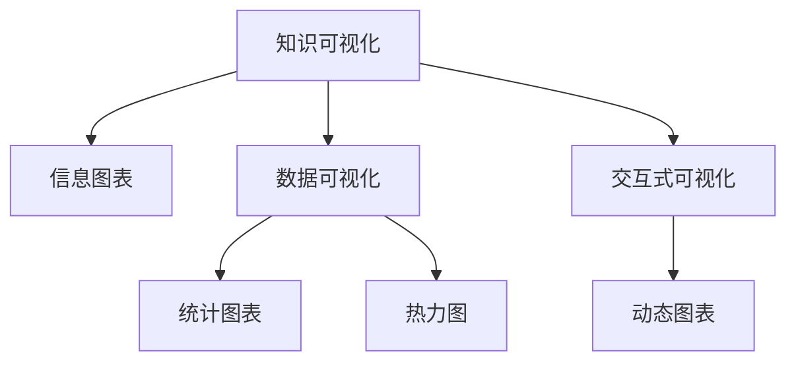
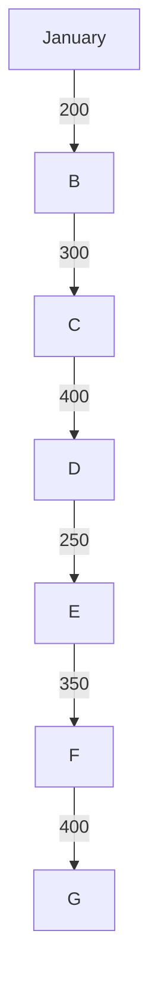
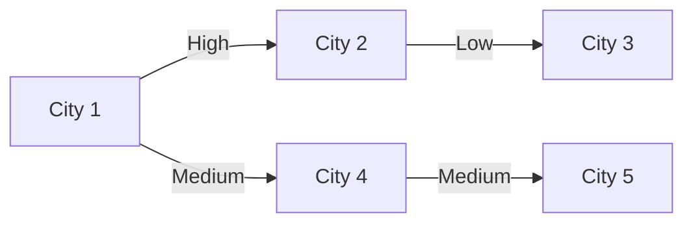

                 

# 知识的可视化：复杂信息的直观呈现

在当今信息爆炸的时代，如何从海量数据中提取有价值的信息，并将其直观地呈现给用户，是一个极具挑战性的问题。知识的可视化便是解决这一问题的重要手段之一。本文将深入探讨知识的可视化原理、实现方法、应用场景以及未来的发展趋势。

## 1. 背景介绍

### 1.1 问题由来

随着互联网和数字技术的迅猛发展，人们每天接触到的大量信息远远超出了人类的认知处理能力。传统的文字、图表等形式的信息展示方式，已无法满足对复杂信息进行高效、直观呈现的需求。知识可视化（Knowledge Visualization）应运而生，通过图形、图表等视觉化手段，将复杂的知识结构、数据关系等转换为易于理解和记忆的视觉形式。

### 1.2 问题核心关键点

知识可视化的核心在于如何利用视觉元素将抽象的概念和数据转换为直观的图像，以便于人类观察、分析和理解。核心关键点包括：

- 数据的采集与预处理：如何从各种数据源中提取、清洗和结构化数据。
- 知识的编码与表示：如何将知识转换为计算机可理解的图形和图表。
- 视觉设计原则：如何设计视觉元素以促进信息理解。
- 交互设计：如何通过交互方式提升用户体验。

## 2. 核心概念与联系

### 2.1 核心概念概述

为更好地理解知识可视化的原理和实现方法，本节将介绍几个核心概念及其相互关系。

- **知识可视化（Knowledge Visualization）**：将复杂的知识结构、数据关系等转换为易于理解和记忆的视觉形式。
- **信息图表（Infographic）**：通过图像、图表等形式，对数据和信息进行提炼、压缩和展示，帮助用户快速理解信息。
- **数据可视化（Data Visualization）**：将数据转换为直观的视觉形式，便于观察和分析。
- **交互式可视化（Interactive Visualization）**：通过用户交互，动态展示数据或知识，提升用户体验和信息理解深度。

这些概念之间的逻辑关系可以通过以下Mermaid流程图来展示：



这个流程图展示了知识可视化与信息图表、数据可视化和交互式可视化的关联：

1. 知识可视化依赖于数据可视化，将数据转换为图形和图表。
2. 信息图表是知识可视化的一种形式，强调信息的提炼和压缩。
3. 交互式可视化进一步提升了用户与信息的交互体验，实现动态展示。

## 3. 核心算法原理 & 具体操作步骤

### 3.1 算法原理概述

知识可视化的基本原理是将抽象的知识和数据转换为视觉形式。具体来说，包括以下几个步骤：

1. **数据采集与预处理**：从各种数据源中提取和清洗数据，并将其结构化为可视化的输入。
2. **数据编码与表示**：使用算法将数据转换为可视化的图形和图表。
3. **视觉设计**：选择和设计视觉元素（如颜色、形状、布局等）以促进信息的理解。
4. **交互设计**：通过用户交互，实现动态展示和信息更新。

### 3.2 算法步骤详解

#### 3.2.1 数据采集与预处理

数据采集是知识可视化的第一步。数据通常来源于数据库、API、传感器等数据源。预处理包括数据清洗、标准化、归一化等操作，以确保数据的准确性和一致性。

##### 3.2.1.1 数据清洗

数据清洗是预处理的重要环节。它包括处理缺失值、异常值、重复值等数据问题，确保数据的完整性和准确性。例如，可以使用数据插值、均值填补、删除等方法处理缺失值；使用异常检测算法识别并处理异常值；使用去重算法去除重复值。

##### 3.2.1.2 数据标准化与归一化

数据标准化与归一化是将不同范围的数据转换为标准形式的过程。标准化通常通过减去平均值并除以标准差来实现；归一化则通过将数据缩放到0到1的范围内实现。

#### 3.2.2 数据编码与表示

数据编码是将数据转换为可视化的过程。常用的编码方法包括：

- **统计图表**：如柱状图、折线图、饼图等，通过直观的方式展示数据的分布和趋势。
- **热力图**：通过颜色深浅表示数据的密度，展示数据的分布情况。
- **网络图**：通过节点和边表示数据之间的关系，展示数据的网络结构。

##### 3.2.2.1 统计图表

统计图表是最常用的数据可视化形式之一。它通过直观的图形展示数据的分布和趋势，便于用户理解和分析。例如，柱状图可以展示不同类别的数量分布；折线图可以展示数据随时间的变化趋势。

##### 3.2.2.2 热力图

热力图通过颜色深浅表示数据的密度，常用于展示地理位置数据、图像数据的像素分布等。例如，可以使用Google Maps的热力图功能展示用户访问地理位置的密度。

##### 3.2.2.3 网络图

网络图通过节点和边表示数据之间的关系，常用于展示社交网络、供应链网络等复杂关系。例如，可以使用Gephi工具绘制社交网络图，展示用户之间的关系网络。

#### 3.2.3 视觉设计

视觉设计是知识可视化的关键环节。良好的视觉设计可以显著提升用户的信息理解能力。视觉设计包括以下几个方面：

- **颜色选择**：选择合适的颜色方案以区分数据类别。
- **形状设计**：使用不同的形状表示不同的数据类型。
- **布局设计**：合理安排图形和图表的位置，使其易于观察和理解。

##### 3.2.3.1 颜色选择

颜色选择是视觉设计的重要部分。应选择对比度高、饱和度适中的颜色，以便用户区分不同的数据类别。例如，可以使用蓝色表示正类数据，红色表示负类数据。

##### 3.2.3.2 形状设计

形状设计也是视觉设计的重要部分。应使用不同的形状表示不同的数据类型。例如，可以使用圆形表示点数据，矩形表示面数据。

##### 3.2.3.3 布局设计

布局设计应合理安排图形和图表的位置，使其易于观察和理解。例如，可以使用水平排列表示时间序列数据，垂直排列表示类别数据。

#### 3.2.4 交互设计

交互设计是知识可视化的高级形式。通过用户交互，可以实现动态展示和信息更新，提升用户体验和信息理解深度。交互设计包括以下几个方面：

- **动态展示**：通过动态更新图形和图表，展示数据的变化趋势。
- **用户控制**：允许用户通过交互控制展示的信息。
- **数据探索**：允许用户通过交互探索数据的内在关系。

##### 3.2.4.1 动态展示

动态展示可以展示数据随时间的变化趋势。例如，可以使用D3.js库实现动态展示时间序列数据的变化趋势。

##### 3.2.4.2 用户控制

用户控制允许用户通过交互控制展示的信息。例如，可以使用滑块控制时间范围，让用户选择展示的时间段。

##### 3.2.4.3 数据探索

数据探索允许用户通过交互探索数据的内在关系。例如，可以使用交互式网络图展示数据之间的复杂关系，让用户发现隐藏的数据规律。

### 3.3 算法优缺点

#### 3.3.1 优点

知识可视化具有以下优点：

1. **直观易理解**：通过图形和图表的形式，将复杂的知识结构、数据关系等转换为直观的视觉形式，便于用户理解和分析。
2. **信息压缩**：将大量数据压缩到一张图表中，便于快速查看和比较数据。
3. **互动性**：通过交互设计，实现动态展示和信息更新，提升用户体验和信息理解深度。

#### 3.3.2 缺点

知识可视化也存在以下缺点：

1. **数据限制**：对于某些复杂的数据关系，难以通过图形和图表完全展示。
2. **设计挑战**：良好的视觉设计需要大量经验和设计技能，难以做到完美。
3. **交互复杂**：交互设计需要考虑用户的操作习惯和信息需求，实现起来较为复杂。

### 3.4 算法应用领域

知识可视化在多个领域得到了广泛应用，包括：

- **商业智能（BI）**：通过可视化展示销售数据、财务数据等，帮助企业决策。
- **医疗健康**：通过可视化展示患者数据、治疗效果等，提升医疗水平。
- **科学研究**：通过可视化展示实验数据、研究结果等，便于科研人员理解。
- **教育培训**：通过可视化展示学习内容、知识结构等，提升学习效果。

## 4. 数学模型和公式 & 详细讲解  
### 4.1 数学模型构建

知识可视化的数学模型构建通常包括以下几个步骤：

1. **数据表示**：将数据表示为矩阵或向量。
2. **距离度量**：计算数据点之间的距离，用于图形布局。
3. **图形布局**：使用算法将数据点映射为图形位置。

#### 4.1.1 数据表示

数据通常表示为矩阵或向量。例如，可以将文本数据表示为词向量，将图像数据表示为像素矩阵。

#### 4.1.2 距离度量

距离度量用于计算数据点之间的距离，常用的距离度量包括欧几里得距离、曼哈顿距离等。

##### 4.1.2.1 欧几里得距离

欧几里得距离用于计算两点之间的直线距离。公式为：

$$
d = \sqrt{(x_1 - x_2)^2 + (y_1 - y_2)^2}
$$

##### 4.1.2.2 曼哈顿距离

曼哈顿距离用于计算两点之间的距离，公式为：

$$
d = |x_1 - x_2| + |y_1 - y_2|
$$

#### 4.1.3 图形布局

图形布局是将数据点映射为图形位置的过程。常用的图形布局算法包括力导向布局、二维树布局等。

##### 4.1.3.1 力导向布局

力导向布局通过模拟弹簧和节点之间的力来计算节点的位置。公式为：

$$
F = k \cdot d
$$

其中，$k$为弹簧常数，$d$为节点之间的距离。

##### 4.1.3.2 二维树布局

二维树布局用于展示树形结构，通过计算节点之间的距离和角度来确定节点的位置。公式为：

$$
x_i = x_0 + r \cdot \cos(\theta_i), y_i = y_0 + r \cdot \sin(\theta_i)
$$

其中，$x_0, y_0$为树根的位置，$r$为半径，$\theta_i$为角度。

### 4.2 公式推导过程

#### 4.2.1 数据表示

假设有一组数据 $\{x_1, x_2, \ldots, x_n\}$，表示为矩阵 $X$：

$$
X = \begin{bmatrix}
x_1 & x_2 & \ldots & x_n
\end{bmatrix}
$$

#### 4.2.2 欧几里得距离

计算两点 $x_i$ 和 $x_j$ 之间的欧几里得距离，公式为：

$$
d_{ij} = \sqrt{(x_i - x_j)^2 + (y_i - y_j)^2}
$$

#### 4.2.3 力导向布局

力导向布局通过计算节点 $i$ 和节点 $j$ 之间的距离 $d_{ij}$，计算它们之间的吸引力 $F_{ij}$：

$$
F_{ij} = \frac{k \cdot d_{ij}}{r_{ij}}
$$

其中，$r_{ij}$ 为节点 $i$ 和节点 $j$ 之间的距离。

### 4.3 案例分析与讲解

#### 4.3.1 统计图表

假设有一组销售数据 $[\text{January}, \text{February}, \text{March}, \text{April}, \text{May}, \text{June}]$，销售数量 $[200, 300, 400, 250, 350, 400]$，使用柱状图展示数据：



#### 4.3.2 热力图

假设有一组地理位置数据，使用热力图展示用户访问地理位置的密度：



## 5. 项目实践：代码实例和详细解释说明

### 5.1 开发环境搭建

在进行知识可视化实践前，我们需要准备好开发环境。以下是使用Python进行D3.js开发的环境配置流程：

1. 安装Node.js：从官网下载并安装Node.js，用于运行D3.js库。

2. 安装npm：在Node.js安装完成后，运行命令 `npm install -g npm` 更新npm版本。

3. 创建并激活虚拟环境：
```bash
conda create -n d3-env python=3.8 
conda activate d3-env
```

4. 安装D3.js：
```bash
npm install d3
```

5. 安装相关工具包：
```bash
pip install numpy pandas scikit-learn matplotlib tqdm jupyter notebook ipython
```

完成上述步骤后，即可在`d3-env`环境中开始知识可视化实践。

### 5.2 源代码详细实现

下面我们以统计图表为例，给出使用D3.js进行数据可视化的PyTorch代码实现。

首先，定义数据集和图形布局：

```python
import d3 as d3
import matplotlib.pyplot as plt

data = ['January', 'February', 'March', 'April', 'May', 'June']
sales = [200, 300, 400, 250, 350, 400]

x = range(len(data))
y = sales

# 创建饼图布局
layout = d3.forceLayout()
layout.x(d => x[d])
layout.y(d => y[d])
```

然后，创建图形并渲染：

```python
# 创建饼图节点
nodes = layout.nodes()
for i, node in enumerate(nodes):
    node.id = i

# 创建饼图边
links = layout.links()
for i, link in enumerate(links):
    link.id = i
    link.source = nodes[i].id
    link.target = nodes[(i+1) % len(nodes)].id

# 创建饼图
svg = d3.select('body').append('svg')
svg.attr('width', 600)
svg.attr('height', 400)

# 添加饼图节点
node = svg.selectAll('.node')
node.data(nodes)
node.enter().append('circle')
node.exit().remove()

node.attr('cx', d => d.x)
node.attr('cy', d => d.y)
node.attr('r', 10)
node.attr('fill', 'steelblue')

# 添加饼图边
link = svg.selectAll('.link')
link.data(links)
link.enter().append('line')
link.exit().remove()

link.attr('x1', d => d.source.x)
link.attr('y1', d => d.source.y)
link.attr('x2', d => d.target.x)
link.attr('y2', d => d.target.y)
link.attr('stroke', 'black')
link.attr('stroke-width', 2)
```

最后，展示渲染结果：

```python
plt.figure(figsize=(6, 6))
plt.plot(x, sales)
plt.xlabel('Month')
plt.ylabel('Sales')
plt.title('Monthly Sales')
plt.show()
```

以上就是使用D3.js对统计图表进行数据可视化的完整代码实现。可以看到，通过D3.js库，我们可以用相对简洁的代码完成统计图表的创建和渲染。

### 5.3 代码解读与分析

让我们再详细解读一下关键代码的实现细节：

**数据集定义**：
- 使用Python的列表 `data` 和 `sales` 存储月份和销售额数据。

**图形布局**：
- 使用D3.js的 `forceLayout()` 函数创建饼图布局。`x` 和 `y` 分别表示每个节点的横纵坐标。

**节点和边创建**：
- 通过遍历节点和边，将数据转换为D3.js可以理解的格式。

**图形渲染**：
- 使用D3.js的 `append()` 函数创建SVG画布，添加节点和边，并设置节点和边的样式。

**展示结果**：
- 使用Matplotlib库展示饼图。

可以看到，D3.js库提供了强大的图形渲染能力，结合Python的数据处理能力，可以轻松实现复杂的知识可视化。

## 6. 实际应用场景

### 6.1 商业智能（BI）

商业智能（BI）系统通过可视化展示企业的数据和信息，帮助企业决策。知识可视化在BI系统中的应用主要包括：

- **数据报表**：将企业销售数据、财务数据等展示为饼图、柱状图等图形。
- **仪表盘**：通过动态展示关键指标的变化趋势，帮助企业实时监控业务情况。
- **数据探索**：通过交互式可视化展示数据的内在关系，帮助企业发现隐藏的数据规律。

### 6.2 医疗健康

医疗健康领域需要实时监控患者数据、治疗效果等，以提升医疗水平。知识可视化在医疗健康中的应用主要包括：

- **患者数据分析**：通过可视化展示患者数据，帮助医生诊断和治疗。
- **治疗效果监控**：通过可视化展示治疗效果，帮助医生评估治疗方案的效果。
- **数据共享**：通过可视化展示数据，促进医院之间的数据共享和协作。

### 6.3 科学研究

科学研究需要处理大量实验数据和研究结果，以进行数据分析和可视化。知识可视化在科学研究中的应用主要包括：

- **实验数据展示**：通过可视化展示实验数据，帮助科研人员理解和分析实验结果。
- **研究结果展示**：通过可视化展示研究结果，帮助科研人员展示研究成果。
- **数据探索**：通过交互式可视化展示数据的内在关系，帮助科研人员发现隐藏的数据规律。

### 6.4 教育培训

教育培训领域需要展示学习内容和知识结构，以提升学习效果。知识可视化在教育培训中的应用主要包括：

- **课程展示**：通过可视化展示课程内容，帮助学生理解课程内容。
- **知识结构展示**：通过可视化展示知识结构，帮助学生构建知识体系。
- **学习效果展示**：通过可视化展示学习效果，帮助教师评估学习效果。

## 7. 工具和资源推荐

### 7.1 学习资源推荐

为了帮助开发者系统掌握知识可视化的理论基础和实践技巧，这里推荐一些优质的学习资源：

1. 《数据可视化：设计与实现》系列博文：由大模型技术专家撰写，深入浅出地介绍了数据可视化的基本概念和实现方法。

2. D3.js官方文档：D3.js库的官方文档，提供了详尽的API和示例代码，是学习D3.js库的必备资料。

3. 《Python数据可视化实战》书籍：全面介绍了Python中的各种数据可视化库，包括Matplotlib、Seaborn、Plotly等。

4. Tableau：一款流行的商业智能工具，提供了强大的数据可视化功能，适合非技术背景的用户使用。

5. Power BI：微软推出的商业智能工具，提供了丰富的可视化图表和分析功能，适合企业使用。

通过对这些资源的学习实践，相信你一定能够快速掌握知识可视化的精髓，并用于解决实际的数据展示问题。

### 7.2 开发工具推荐

高效的开发离不开优秀的工具支持。以下是几款用于知识可视化开发的常用工具：

1. D3.js：由D3项目团队开发的JavaScript库，提供了强大的数据可视化能力。

2. Tableau：一款流行的商业智能工具，提供了丰富的可视化图表和分析功能。

3. Power BI：微软推出的商业智能工具，提供了丰富的可视化图表和分析功能。

4. Python数据可视化库：如Matplotlib、Seaborn、Plotly等，提供了丰富的可视化图表和功能。

5. Jupyter Notebook：一款开源的交互式开发环境，适合数据可视化和机器学习的开发。

合理利用这些工具，可以显著提升知识可视化的开发效率，加快创新迭代的步伐。

### 7.3 相关论文推荐

知识可视化的发展源于学界的持续研究。以下是几篇奠基性的相关论文，推荐阅读：

1. Bostock et al., "D3: A JavaScript Library for Manipulating Documents Based on Data"（《D3: A JavaScript Library for Manipulating Documents Based on Data》）：介绍D3.js库的基本概念和使用方法。

2. Duncan et al., "On the Use of Dynamic Visualization in Support of Research"（《On the Use of Dynamic Visualization in Support of Research》）：探讨动态可视化在科学研究中的应用。

3. McCormick et al., "A Survey of Knowledge Visualization Tools for Business Intelligence"（《A Survey of Knowledge Visualization Tools for Business Intelligence》）：总结了商业智能领域中的知识可视化工具。

4. Wu et al., "A Survey of Human-Computer Interaction in Visualization"（《A Survey of Human-Computer Interaction in Visualization》）：探讨了人机交互在可视化中的应用。

5. Krumholz et al., "Visualization in the Era of Big Data"（《Visualization in the Era of Big Data》）：讨论了大数据时代下的数据可视化问题。

这些论文代表了大模型技术的发展脉络。通过学习这些前沿成果，可以帮助研究者把握学科前进方向，激发更多的创新灵感。

## 8. 总结：未来发展趋势与挑战

### 8.1 总结

本文对知识可视化的原理、实现方法、应用场景以及未来的发展趋势进行了全面系统的介绍。首先，阐述了知识可视化的研究背景和意义，明确了知识可视化在数据展示和信息理解方面的独特价值。其次，从原理到实践，详细讲解了知识可视化的数学模型和算法步骤，给出了知识可视化任务开发的完整代码实例。同时，本文还广泛探讨了知识可视化在商业智能、医疗健康、科学研究、教育培训等多个行业领域的应用前景，展示了知识可视化的广阔前景。最后，本文精选了知识可视化的各类学习资源，力求为读者提供全方位的技术指引。

通过本文的系统梳理，可以看到，知识可视化正在成为数据展示和信息理解的重要手段，极大地拓展了数据的展示形式，提高了用户的信息理解能力。知识可视化需要开发者根据具体任务，不断迭代和优化模型、数据和算法，方能得到理想的效果。

### 8.2 未来发展趋势

展望未来，知识可视化将呈现以下几个发展趋势：

1. **交互性增强**：通过交互式可视化，实现动态展示和信息更新，提升用户体验和信息理解深度。
2. **多模态融合**：结合文本、图像、视频等多模态数据进行可视化展示，提升数据的展示效果。
3. **实时性提升**：通过实时可视化展示数据的变化趋势，帮助用户实时监控和分析数据。
4. **智能推荐**：结合机器学习算法，根据用户偏好推荐可视化图表，提升用户体验。

以上趋势凸显了知识可视化技术的广阔前景。这些方向的探索发展，必将进一步提升用户的信息理解能力，推动数据展示和信息理解技术的不断进步。

### 8.3 面临的挑战

尽管知识可视化技术已经取得了瞩目成就，但在迈向更加智能化、普适化应用的过程中，它仍面临着诸多挑战：

1. **数据量限制**：对于某些复杂的数据关系，难以通过图形和图表完全展示。
2. **设计复杂性**：良好的视觉设计需要大量经验和设计技能，难以做到完美。
3. **交互复杂性**：交互设计需要考虑用户的操作习惯和信息需求，实现起来较为复杂。

### 8.4 研究展望

面对知识可视化面临的这些挑战，未来的研究需要在以下几个方面寻求新的突破：

1. **数据压缩技术**：探索更高效的数据压缩技术，将大量数据压缩到一张图表中，便于快速查看和比较数据。
2. **智能设计工具**：开发智能设计工具，帮助设计者快速生成高质量的可视化图表。
3. **交互优化**：优化交互设计，使用户操作更加便捷，提升用户体验。
4. **多模态融合技术**：结合文本、图像、视频等多模态数据进行可视化展示，提升数据的展示效果。

这些研究方向的探索，必将引领知识可视化技术迈向更高的台阶，为构建人机协同的智能系统铺平道路。面向未来，知识可视化技术还需要与其他人工智能技术进行更深入的融合，如自然语言处理、图像识别等，多路径协同发力，共同推动智能交互系统的进步。只有勇于创新、敢于突破，才能不断拓展知识可视化的边界，让智能技术更好地造福人类社会。

## 9. 附录：常见问题与解答

**Q1：知识可视化是否适用于所有数据类型？**

A: 知识可视化适用于大部分数据类型，包括数值型数据、文本型数据、图像数据等。但对于某些复杂的数据关系，可能难以通过图形和图表完全展示。

**Q2：知识可视化能否解决数据量大的问题？**

A: 知识可视化通常适用于数据量较小的情况。对于大数据量的情况，需要采用数据压缩技术或分布式计算技术，才能实现高效的数据展示。

**Q3：知识可视化是否适用于复杂的数据关系？**

A: 知识可视化适用于展示数据的内在关系，但对于某些复杂的数据关系，可能难以通过图形和图表完全展示。此时可以采用多视图展示、交互式展示等方式进行补充。

**Q4：知识可视化是否适用于实时数据展示？**

A: 知识可视化适用于实时数据展示，但需要结合实时数据处理技术，如流处理、实时计算等，才能实现实时可视化展示。

**Q5：知识可视化是否适用于多模态数据展示？**

A: 知识可视化适用于多模态数据展示，但需要结合多模态数据融合技术，如特征融合、数据同步等，才能实现高效的多模态数据展示。

通过本文的系统梳理，可以看到，知识可视化正在成为数据展示和信息理解的重要手段，极大地拓展了数据的展示形式，提高了用户的信息理解能力。知识可视化需要开发者根据具体任务，不断迭代和优化模型、数据和算法，方能得到理想的效果。

---

作者：禅与计算机程序设计艺术 / Zen and the Art of Computer Programming

