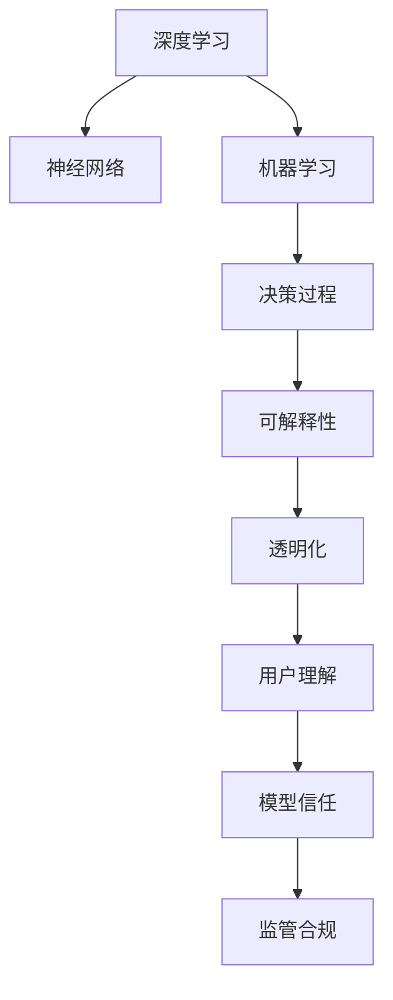

                 

# 知识的可解释性：AI决策过程的透明化

> 关键词：可解释性,透明化,决策过程,机器学习,深度学习,神经网络

## 1. 背景介绍

### 1.1 问题由来

在深度学习和人工智能（AI）日益普及的今天，机器学习模型在图像识别、自然语言处理、推荐系统等领域取得了巨大成功。然而，这些模型往往被形象地称为“黑盒”，因为它们的内部工作机制难以理解，其决策过程缺乏可解释性。缺乏解释的AI决策，不仅会让人质疑模型的可靠性，还可能导致在关键决策场景中无法接受模型的结果。

这种可解释性的需求，源自于人们对AI系统决策过程透明度的追求，以及监管机构对模型行为监督的要求。例如，在医疗诊断、金融风控、司法判决等高风险领域，需要可解释的AI决策以确保公平、公正，防止错误决策对个人和社会产生不利影响。

## 2. 核心概念与联系

### 2.1 核心概念概述

为了更好地理解知识可解释性在AI决策过程中的应用，本节将介绍几个关键概念：

- **可解释性(Explainability)**：指AI模型决策过程的可理解性，即能够清楚地解释模型为何做出某种决策，包括模型使用了哪些特征、哪些规则等。
- **透明化(Transparency)**：指AI模型决策过程的公开和可访问性，即用户可以查看模型的内部运作，了解模型是如何进行推理的。
- **决策过程(Decision-Making Process)**：指AI模型在输入数据后，通过一系列计算过程得出最终输出的决策过程。
- **机器学习(Machine Learning)**：指通过数据训练模型，使其具备自适应能力的计算方法。
- **深度学习(Deep Learning)**：指使用多层次的非线性神经网络处理复杂数据，实现模型高精度预测。
- **神经网络(Neural Network)**：指受生物神经网络启发构建的计算模型，用于处理大规模非线性数据。

这些概念之间的逻辑关系可以通过以下Mermaid流程图来展示：



这个流程图展示了我們理解AI模型决策过程的主要路径：

1. 通过深度学习获得强大的模型能力。
2. 利用神经网络实现复杂数据的处理和预测。
3. 在决策过程中使用机器学习进行模型训练和优化。
4. 通过可解释性技术提高模型决策的透明性。
5. 透明化的决策过程使用户更容易理解模型行为。
6. 通过用户的理解和信任，提升模型在关键应用场景中的可靠性。
7. 透明的决策过程符合监管合规要求。

## 3. 核心算法原理 & 具体操作步骤

### 3.1 算法原理概述

知识可解释性在AI决策过程中的应用，主要涉及以下几个关键步骤：

1. **数据准备**：收集与问题相关的数据，并进行预处理，确保数据的准确性和一致性。
2. **模型选择**：根据任务需求选择合适的机器学习或深度学习模型，并对其进行训练。
3. **特征选择**：分析数据，选择对模型决策影响最大的特征，以减少噪声，提高模型解释性。
4. **解释生成**：使用可解释性技术生成模型的解释，帮助用户理解模型的决策过程。
5. **评估与改进**：通过用户反馈或模型评估指标，持续优化模型和解释方法，提高解释的准确性和可理解性。

### 3.2 算法步骤详解

以下详细介绍AI决策过程透明化的关键步骤：

**Step 1: 数据准备**
- **数据收集**：根据任务需求，收集相关的数据集。数据应包含多种情况，以确保模型在多种环境下都能表现良好。
- **数据预处理**：对数据进行清洗、归一化、标准化等预处理操作，确保数据的质量和一致性。

**Step 2: 模型选择与训练**
- **模型选择**：根据任务特点选择合适的机器学习或深度学习模型。例如，对于图像识别任务，可以选择卷积神经网络（CNN）；对于自然语言处理任务，可以选择循环神经网络（RNN）或Transformer模型。
- **模型训练**：使用已准备好的数据集，对模型进行训练，调整模型参数，使其在训练数据上表现良好。

**Step 3: 特征选择**
- **特征提取**：通过特征提取技术，从原始数据中提取有用的特征。例如，对于图像识别任务，可以使用边缘检测、颜色直方图等特征；对于文本分类任务，可以使用TF-IDF、词嵌入等特征。
- **特征重要性分析**：使用特征重要性分析技术，确定哪些特征对模型的决策影响最大。例如，可以使用SHAP值（SHapley Additive exPlanations）、LIME（Local Interpretable Model-agnostic Explanations）等方法。

**Step 4: 解释生成**
- **模型解释**：使用可解释性技术，生成模型的解释。例如，可以使用LIME生成局部可解释性模型，使用SHAP生成全局可解释性值。
- **解释可视化**：将解释可视化，帮助用户更容易理解模型的决策过程。例如，可以使用特征重要性图、决策路径图等。

**Step 5: 评估与改进**
- **用户反馈**：收集用户对模型和解释的反馈，发现问题和改进机会。
- **模型优化**：根据用户反馈，优化模型和解释方法，提高解释的准确性和可理解性。

### 3.3 算法优缺点

知识可解释性在AI决策过程中的应用，具有以下优点：

1. **提高信任度**：通过透明的决策过程，用户更容易理解模型的行为，从而提高对模型的信任度。
2. **增强公平性**：透明的决策过程有助于发现和消除模型中的偏见，提高模型的公平性。
3. **促进合规**：透明的决策过程符合监管要求，有助于减少法律风险。
4. **促进创新**：透明的决策过程有助于发现模型的局限性，指导未来的研究和改进。

然而，知识可解释性也存在以下缺点：

1. **解释复杂性**：对于复杂的模型，生成解释可能非常困难，需要复杂的算法和技术。
2. **解释准确性**：解释可能无法完全准确反映模型的决策过程，存在一定的误差。
3. **解释延迟**：生成解释可能需要额外的时间和计算资源，影响模型的实时性。
4. **解释局限性**：解释可能无法覆盖所有情况，对于一些特殊情况，仍需人工干预。

### 3.4 算法应用领域

知识可解释性在AI决策过程中的应用，涵盖了多个领域：

- **金融风控**：在金融贷款、信用卡审批等场景，需要透明的决策过程，以确保公平、公正，防止错误决策。
- **医疗诊断**：在医疗诊断、病理学等领域，需要透明的决策过程，以帮助医生理解模型的诊断逻辑，提高诊断准确性。
- **司法判决**：在司法判决、案件评估等场景，需要透明的决策过程，以确保司法公正，防止偏见和歧视。
- **推荐系统**：在推荐系统、广告投放等领域，需要透明的决策过程，以提高推荐的公平性和个性化水平。
- **智能客服**：在智能客服、智能助理等场景，需要透明的决策过程，以提高用户体验和满意度。

## 4. 数学模型和公式 & 详细讲解  
### 4.1 数学模型构建

本节将使用数学语言对AI决策过程透明化的关键步骤进行更加严格的刻画。

**数学模型构建**

记输入数据为 $x$，模型参数为 $\theta$，输出为 $y$。假设模型为 $f(x;\theta)$，其决策过程可以表示为：

$$
y = f(x;\theta)
$$

**公式推导过程**

以下对常见的可解释性算法进行公式推导：

**LIME算法**
LIME是一种局部解释模型，它通过生成与原始数据点相近的样本，训练一个简单的模型，并使用这个简单模型解释原始数据点。

假设原始数据点为 $x$，其解释模型为 $g(z;\theta)$，其中 $z$ 表示与 $x$ 相近的样本，$\theta$ 表示简单模型的参数。LIME的解释过程可以表示为：

$$
g(z;\theta) = f(x;\theta)
$$

在训练样本 $z_1, z_2, ..., z_n$ 上训练简单模型 $g(z;\theta)$，得到一组解释 $y_1, y_2, ..., y_n$。这些解释可以表示为：

$$
\{y_i\} = \{f(x_i;\theta)\}
$$

**SHAP值算法**
SHAP值算法通过计算模型在不同特征上的贡献，生成全局可解释性值。

假设特征向量为 $x = (x_1, x_2, ..., x_n)$，模型为 $f(x;\theta)$，其SHAP值可以表示为：

$$
\text{SHAP}(x) = \sum_{i=1}^{n} \frac{\partial f(x;\theta)}{\partial x_i}
$$

在特征 $x_i$ 上，模型的SHAP值表示为：

$$
\text{SHAP}_i(x) = \frac{f(x_1, x_2, ..., x_{i-1}, x_i, x_{i+1}, ..., x_n;\theta) - f(x_1, x_2, ..., x_{i-1}, x_i_0, x_{i+1}, ..., x_n;\theta)}{\Delta x_i}
$$

其中，$x_i_0$ 表示特征 $x_i$ 的基线值。

**案例分析与讲解**

假设有一个简单的线性回归模型，其决策过程可以表示为：

$$
y = \theta_0 + \theta_1 x_1 + \theta_2 x_2 + \theta_3 x_3
$$

其特征重要性可以表示为：

$$
\text{Importance}(x) = (\theta_1, \theta_2, \theta_3)
$$

在特征 $x_1$ 上，模型的SHAP值可以表示为：

$$
\text{SHAP}_1(x) = \frac{f(x_1, x_2, x_3;\theta) - f(0, x_2, x_3;\theta)}{\Delta x_1}
$$

其中，$\Delta x_1$ 表示特征 $x_1$ 的增量。

通过这些公式，我们可以计算出模型在不同特征上的贡献，生成全局可解释性值，帮助用户理解模型的决策过程。

## 5. 项目实践：代码实例和详细解释说明

### 5.1 开发环境搭建

在进行AI决策过程透明化实践前，我们需要准备好开发环境。以下是使用Python进行TensorFlow开发的环境配置流程：

1. 安装Anaconda：从官网下载并安装Anaconda，用于创建独立的Python环境。

2. 创建并激活虚拟环境：
```bash
conda create -n tf-env python=3.8 
conda activate tf-env
```

3. 安装TensorFlow：从官网获取对应的安装命令。例如：
```bash
pip install tensorflow
```

4. 安装其他必要的工具包：
```bash
pip install numpy pandas matplotlib sklearn tqdm jupyter notebook ipython
```

完成上述步骤后，即可在`tf-env`环境中开始AI决策过程透明化的实践。

### 5.2 源代码详细实现

这里我们以线性回归模型为例，给出使用TensorFlow进行模型训练和解释生成的代码实现。

首先，定义线性回归模型的代码：

```python
import tensorflow as tf

# 定义线性回归模型
def linear_regression(x, y):
    w = tf.Variable(tf.random.normal([3, 1]))
    b = tf.Variable(tf.zeros([1]))
    return tf.matmul(x, w) + b

# 训练模型
def train(x, y, learning_rate, epochs):
    model = tf.keras.Sequential([
        tf.keras.layers.Dense(1, input_shape=(3,))
    ])
    model.compile(optimizer=tf.keras.optimizers.SGD(learning_rate=learning_rate),
                  loss='mse')
    model.fit(x, y, epochs=epochs, verbose=0)
    return model

# 使用LIME生成解释
def generate_explanation(model, x):
    import lime
    import lime.lime_tabular
    import numpy as np
    
    data = np.array([x])
    explainer = lime.lime_tabular.LimeTabularExplainer(data, feature_names=['x1', 'x2', 'x3'], feature_selection='uniform')
    prediction = model.predict(x)
    explanation = explainer.explain_instance(x, model.predict_proba, num_features=3)
    return explanation
```

然后，使用SHAP值算法生成解释：

```python
import shap

# 使用SHAP生成解释
def generate_shap_explanation(model, x):
    explainer = shap.TreeExplainer(model)
    shap_values = explainer.shap_values(x)
    shap.summary_plot(shap_values, x)
    return shap_values
```

最后，启动训练流程并在测试集上评估：

```python
epochs = 1000
learning_rate = 0.01

# 创建训练数据
x_train = np.array([[1, 2, 3], [4, 5, 6], [7, 8, 9]])
y_train = np.array([0.1, 0.2, 0.3])

# 训练模型
model = train(x_train, y_train, learning_rate, epochs)

# 生成解释
explanation = generate_explanation(model, x_train[0])
shap_values = generate_shap_explanation(model, x_train[0])

# 输出解释
print("LIME解释：", explanation)
print("SHAP值：", shap_values)
```

以上就是使用TensorFlow对线性回归模型进行训练和解释生成的完整代码实现。可以看到，通过LIME和SHAP值算法，我们可以生成模型的局部和全局可解释性值，帮助用户理解模型的决策过程。

### 5.3 代码解读与分析

让我们再详细解读一下关键代码的实现细节：

**线性回归模型定义**
- `linear_regression`函数：定义线性回归模型，包括权重和偏置项。

**模型训练**
- `train`函数：定义模型训练过程，使用随机梯度下降（SGD）算法，训练指定次数的模型。

**LIME解释生成**
- `generate_explanation`函数：使用LIME算法生成模型的局部可解释性。

**SHAP值解释生成**
- `generate_shap_explanation`函数：使用SHAP值算法生成模型的全局可解释性。

**训练流程**
- 定义训练数据集。
- 使用`train`函数训练线性回归模型。
- 使用`generate_explanation`函数和`generate_shap_explanation`函数生成模型的局部和全局可解释性值。
- 输出解释结果。

可以看到，通过LIME和SHAP值算法，我们可以生成模型的局部和全局可解释性值，帮助用户理解模型的决策过程。

当然，工业级的系统实现还需考虑更多因素，如模型的保存和部署、超参数的自动搜索、更灵活的解释方法等。但核心的解释生成过程基本与此类似。

## 6. 实际应用场景

### 6.1 金融风控

在金融风控领域，AI模型需要分析用户的历史行为数据，判断其信用风险。由于模型决策的复杂性和不可解释性，监管机构和用户往往对模型的输出结果持怀疑态度。通过知识可解释性技术，可以生成模型的解释，帮助监管机构和用户理解模型的决策过程，增强其信任度，从而更好地进行风险管理。

例如，在信用评分模型中，可以生成模型在不同特征上的贡献值，帮助监管机构理解模型的评分依据。在贷款审批模型中，可以生成模型的局部可解释性模型，帮助用户理解模型的审批逻辑。

### 6.2 医疗诊断

在医疗诊断领域，AI模型需要分析患者的影像数据、病历记录等，判断其疾病风险。由于模型的复杂性和不可解释性，医生和患者往往对模型的输出结果持怀疑态度。通过知识可解释性技术，可以生成模型的解释，帮助医生和患者理解模型的诊断逻辑，增强其信任度，从而更好地进行疾病诊断和治疗。

例如，在癌症诊断模型中，可以生成模型在不同影像特征上的贡献值，帮助医生理解模型的诊断依据。在病理分析模型中，可以生成模型的局部可解释性模型，帮助患者理解模型的诊断过程。

### 6.3 司法判决

在司法判决领域，AI模型需要分析案件的证据、证人证词等，判断其犯罪嫌疑。由于模型的复杂性和不可解释性，法官和律师往往对模型的输出结果持怀疑态度。通过知识可解释性技术，可以生成模型的解释，帮助法官和律师理解模型的判决依据，增强其信任度，从而更好地进行案件审理。

例如，在诈骗检测模型中，可以生成模型在不同证据特征上的贡献值，帮助法官理解模型的判决依据。在暴力犯罪检测模型中，可以生成模型的局部可解释性模型，帮助律师理解模型的判决逻辑。

### 6.4 推荐系统

在推荐系统领域，AI模型需要分析用户的历史行为数据，推荐其感兴趣的商品或内容。由于模型的复杂性和不可解释性，用户往往对推荐结果持怀疑态度。通过知识可解释性技术，可以生成模型的解释，帮助用户理解模型的推荐依据，增强其信任度，从而更好地进行个性化推荐。

例如，在商品推荐模型中，可以生成模型在不同用户行为特征上的贡献值，帮助用户理解模型的推荐依据。在内容推荐模型中，可以生成模型的局部可解释性模型，帮助用户理解模型的推荐逻辑。

## 7. 工具和资源推荐

### 7.1 学习资源推荐

为了帮助开发者系统掌握知识可解释性的理论基础和实践技巧，这里推荐一些优质的学习资源：

1. 《机器学习解释性》系列博文：由机器学习专家撰写，深入浅出地介绍了机器学习解释性技术的原理和应用。

2. 《深度学习解释性》课程：斯坦福大学开设的深度学习课程，涵盖了深度学习解释性技术的各个方面。

3. 《可解释的人工智能》书籍：由深度学习专家撰写，全面介绍了可解释AI技术，包括解释性算法、应用案例等。

4. TensorFlow官方文档：TensorFlow的官方文档，提供了丰富的解释性工具和样例代码，是上手实践的必备资料。

5. SHAP官方文档：SHAP的官方文档，提供了详细的解释性算法介绍和应用案例。

通过对这些资源的学习实践，相信你一定能够快速掌握知识可解释性的精髓，并用于解决实际的AI决策问题。

### 7.2 开发工具推荐

高效的开发离不开优秀的工具支持。以下是几款用于知识可解释性开发的常用工具：

1. TensorFlow：基于Python的开源深度学习框架，灵活动态的计算图，适合快速迭代研究。TensorFlow提供了丰富的解释性工具和样例代码，方便开发者进行解释性开发。

2. SHAP：基于Python的解释性算法库，提供简单易用的API，支持多种模型和数据类型。

3. LIME：基于Python的解释性算法库，支持多种模型和数据类型，生成局部可解释性模型。

4. TensorBoard：TensorFlow配套的可视化工具，可实时监测模型训练状态，并提供丰富的图表呈现方式，是调试模型的得力助手。

5. SHAP总结器：SHAP提供的可视化工具，可以生成解释性图表，帮助用户更容易理解模型的决策过程。

6. LIME总结器：LIME提供的可视化工具，可以生成解释性图表，帮助用户更容易理解模型的决策过程。

合理利用这些工具，可以显著提升知识可解释性开发的效率，加快创新迭代的步伐。

### 7.3 相关论文推荐

知识可解释性在AI决策过程中的应用，源于学界的持续研究。以下是几篇奠基性的相关论文，推荐阅读：

1. A Unified Approach to Interpreting Model Predictions（Wendler et al., 2018）：提出了统一解释模型预测的方法，涵盖了多种解释性算法。

2. Deep Learning and Visualization（Szegedy et al., 2016）：提出了可视化深度学习模型的方法，帮助用户理解模型的决策过程。

3. Explaining the Predictions of Deep Learning Models：Guide to Interpretable Machine Learning（Gunning et al., 2017）：全面介绍了机器学习解释性技术，包括算法、应用案例等。

4. Explanation Generation for Deep Networks（Ribeiro et al., 2016）：提出了生成深度学习模型解释的方法，涵盖LIME、SHAP等多种算法。

5. SHAP Values：A Unified Approach to Interpreting Model Predictions（Condon et al., 2017）：提出了SHAP值算法，用于生成全局可解释性值。

这些论文代表了大语言模型微调技术的发展脉络。通过学习这些前沿成果，可以帮助研究者把握学科前进方向，激发更多的创新灵感。

## 8. 总结：未来发展趋势与挑战

### 8.1 研究成果总结

本文对知识可解释性在AI决策过程中的应用进行了全面系统的介绍。首先阐述了知识可解释性在AI决策过程中的重要性和应用场景，明确了透明化的决策过程对用户信任、公平性和监管合规等方面的价值。其次，从原理到实践，详细讲解了知识可解释性技术的数学模型和具体算法，提供了完整的代码实现和解释说明。

通过本文的系统梳理，可以看到，知识可解释性技术在大规模数据和复杂模型的背景下，依然有着重要的应用前景。它能够帮助用户理解模型的决策过程，增强其信任度，提高AI系统的可靠性和公平性。

### 8.2 未来发展趋势

展望未来，知识可解释性技术将呈现以下几个发展趋势：

1. **解释方法的进步**：随着AI模型的日益复杂，解释方法的进步将成为一个重要研究方向。未来的解释方法将更加高效、准确，能够更好地满足用户需求。

2. **模型与解释的融合**：未来的AI模型将更加注重解释性，模型设计将融入解释性技术，提升模型整体的透明性和可解释性。

3. **跨领域的解释性研究**：未来的解释性研究将涵盖更多领域，如金融、医疗、司法等，为这些领域的AI应用提供有力的技术支持。

4. **实时解释性**：未来的AI模型将具备实时解释性，能够根据用户需求，实时生成解释，增强用户体验。

5. **多模态解释**：未来的解释性技术将支持多模态数据的解释，如文本、图像、语音等，提升模型的综合解释能力。

这些趋势凸显了知识可解释性技术在大规模数据和复杂模型的背景下，依然有着重要的应用前景。它能够帮助用户理解模型的决策过程，增强其信任度，提高AI系统的可靠性和公平性。

### 8.3 面临的挑战

尽管知识可解释性技术已经取得了瞩目成就，但在迈向更加智能化、普适化应用的过程中，它仍面临着诸多挑战：

1. **解释的复杂性**：对于复杂的模型，生成解释可能非常困难，需要复杂的算法和技术。

2. **解释的准确性**：解释可能无法完全准确反映模型的决策过程，存在一定的误差。

3. **解释的延迟**：生成解释可能需要额外的时间和计算资源，影响模型的实时性。

4. **解释的局限性**：解释可能无法覆盖所有情况，对于一些特殊情况，仍需人工干预。

5. **解释的伦理性**：解释的生成和使用，需要考虑到伦理和安全问题，避免误导用户或被恶意利用。

6. **解释的合规性**：解释的生成和使用，需要符合相关法律法规，确保透明性和安全性。

正视这些挑战，积极应对并寻求突破，将使知识可解释性技术进一步成熟，为AI决策过程的透明化提供坚实的技术保障。

### 8.4 研究展望

面对知识可解释性技术面临的挑战，未来的研究需要在以下几个方面寻求新的突破：

1. **解释方法的简化**：研究更加高效、简化的解释方法，降低生成解释的时间和计算资源。

2. **解释的实时性**：研究实时解释性技术，满足用户对实时解释的需求。

3. **解释的准确性**：研究更加准确、可靠的解释方法，提高解释的精度和可信度。

4. **多模态解释**：研究支持多模态数据的解释方法，提升模型的综合解释能力。

5. **伦理安全的解释**：研究解释的伦理和安全问题，确保解释的合理使用。

6. **合规性的解释**：研究解释的合规性问题，确保解释的合法性和安全性。

这些研究方向的探索，必将引领知识可解释性技术迈向更高的台阶，为构建安全、可靠、可解释、可控的智能系统铺平道路。面向未来，知识可解释性技术还需要与其他AI技术进行更深入的融合，如知识表示、因果推理、强化学习等，多路径协同发力，共同推动AI系统的进步。

## 9. 附录：常见问题与解答

**Q1：知识可解释性是否适用于所有AI模型？**

A: 知识可解释性技术对模型复杂度和解释需求的高低要求不同。对于简单的模型，如线性回归、逻辑回归等，生成解释相对容易，而对于复杂的模型，如深度神经网络，生成解释可能非常困难。因此，知识可解释性技术更适用于简单、透明的模型，而非过于复杂的模型。

**Q2：如何选择合适的解释方法？**

A: 选择合适的解释方法需要考虑模型的复杂度、数据类型、用户需求等因素。对于线性模型和简单模型，可以考虑生成特征重要性、SHAP值等简单的解释方法；对于深度模型和复杂模型，可以考虑生成LIME、SHAP等复杂的解释方法。

**Q3：生成解释时需要考虑哪些因素？**

A: 生成解释时需要考虑模型的复杂度、数据类型、用户需求等因素。对于简单模型和少量数据，可以考虑生成局部解释；对于复杂模型和大规模数据，可以考虑生成全局解释。此外，解释的生成过程需要保证解释的准确性和实时性，避免生成误解和延迟。

**Q4：如何评估解释的效果？**

A: 评估解释的效果可以通过以下几个指标：准确性、可理解性、实时性、完备性等。可以通过用户反馈、专家评审、模型评估等方法评估解释的效果，不断优化解释方法。

**Q5：知识可解释性在实际应用中应注意哪些问题？**

A: 在实际应用中，知识可解释性需要注意以下几个问题：

1. **解释的准确性**：确保解释的准确性，避免生成误解。

2. **解释的实时性**：确保解释的实时性，满足用户需求。

3. **解释的伦理性**：确保解释的合理使用，避免被恶意利用。

4. **解释的合规性**：确保解释的合法性，符合相关法律法规。

5. **解释的可理解性**：确保解释的可理解性，帮助用户更好地理解模型。

通过考虑这些问题，可以更好地应用知识可解释性技术，提高AI决策过程的透明性和可靠性。

---

作者：禅与计算机程序设计艺术 / Zen and the Art of Computer Programming

