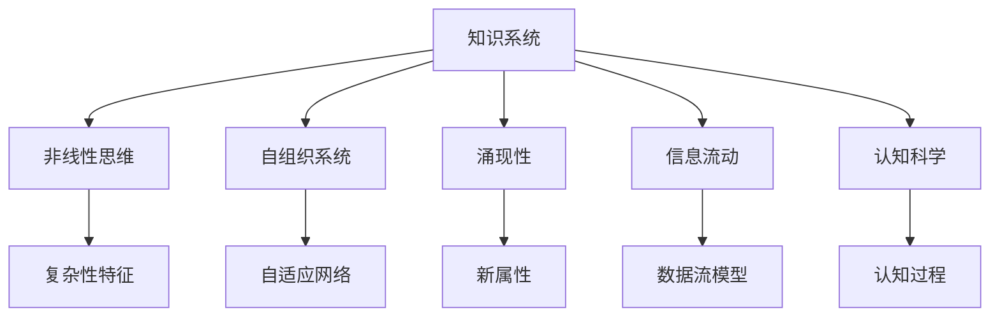

                 

# 知识的复杂性科学：非线性思维的重要性

> 关键词：知识复杂性, 非线性思维, 自组织系统, 涌现性, 信息流动, 认知科学

## 1. 背景介绍

在当前科技飞速发展的时代，人类对知识的渴求从未有过如此之强烈。知识的复杂性科学（Complexity Science of Knowledge）正是在这一背景下应运而生的一门交叉学科，它融合了数学、物理学、神经科学、认知科学等多个领域的理论和方法，旨在揭示知识系统的内在规律及其与人类智能的关系。

### 1.1 问题由来
知识的复杂性科学之所以重要，在于它揭示了知识系统固有的非线性、自组织、涌现性等特点，这些特点深刻影响了知识的生产、传播、应用等过程。传统的线性思维范式已经无法适应知识系统复杂性的要求，非线性思维方法开始崭露头角。

### 1.2 问题核心关键点
知识的复杂性科学研究的知识系统主要包括三个方面：

- **知识产生**：知识如何从基础数据中产生，包括数据挖掘、知识图谱构建、自然语言处理等。
- **知识流动**：知识如何通过传播网络传播，包括社交网络、信息网络、学术网络等。
- **知识应用**：知识如何被应用于实际问题解决，包括机器学习、专家系统、智能交互等。

通过分析这些方面的特点，我们可以深刻理解知识系统的非线性、涌现性、自组织等特点，从而优化知识系统，提升知识应用的效能。

## 2. 核心概念与联系

### 2.1 核心概念概述

为了更好地理解知识的复杂性科学，本节将介绍几个核心概念及其相互之间的联系。

- **知识系统**：由人、数据、网络等多个组成部分构成，通过复杂交互形成的一个动态系统。
- **非线性思维**：强调系统中的非线性相互作用，包括正反馈、负反馈、混沌等，能够更好地解释复杂系统的涌现现象。
- **自组织系统**：能够通过自身内部的相互作用而无需外部干预，形成有序结构，如群蜂聚集、社交网络等。
- **涌现性**：复杂系统中出现无法在局部简单理解的新属性，如复杂网络中的涌现连通性、复杂系统中新的局部模式等。
- **信息流动**：知识系统中的信息传递与交换，包括数据的收集、处理、存储、传输等过程。
- **认知科学**：研究人类思维过程的科学，结合了心理学、神经科学、人工智能等多领域的知识，探索知识产生、加工、应用等机制。

这些核心概念之间的逻辑关系可以通过以下Mermaid流程图来展示：



这个流程图展示了一组核心概念及其相互之间的关系：

1. 知识系统通过非线性思维、自组织系统、涌现性等复杂特征形成。
2. 非线性思维解释了系统中的复杂行为，如混沌、正反馈等。
3. 自组织系统在系统中自我形成有序结构。
4. 涌现性导致了系统新属性的产生，如复杂网络中的涌现连通性。
5. 信息流动是知识系统的基础，涉及数据的收集和传播。
6. 认知科学揭示了人类认知过程的规律，有助于更好地理解和设计知识系统。

## 3. 核心算法原理 & 具体操作步骤
### 3.1 算法原理概述

知识的复杂性科学强调知识系统中的非线性、自组织、涌现性等特点，因此，相关的算法原理也以这些特性为基础。以下我们将介绍核心算法原理及其操作步骤。

### 3.2 算法步骤详解

#### 3.2.1 知识系统建模

知识系统的建模主要包括以下步骤：

1. **数据采集**：通过传感器、网络爬虫等方式收集相关数据，包括文本、图像、音频等。
2. **数据预处理**：清洗数据，去除噪声、异常值等，并标准化处理。
3. **知识图谱构建**：将数据转化为知识图谱，构建知识节点和关系，如实体-关系-实体（RDF）三元组。
4. **网络建模**：构建知识传播网络，如社交网络、信息网络等。

#### 3.2.2 非线性思维分析

非线性思维分析主要通过以下几个步骤：

1. **数据生成模型**：使用生成模型（如神经网络、LSTM等）对数据进行建模，预测新的数据样本。
2. **混沌动力学分析**：对生成的数据进行混沌动力学分析，寻找系统中的正反馈、负反馈等非线性特征。
3. **复杂性特征提取**：通过熵、复杂度等指标，提取系统的复杂性特征，如分形结构、奇异吸引子等。

#### 3.2.3 自组织系统设计

自组织系统的设计主要包括以下步骤：

1. **规则设计**：设计简单的局部规则，使其能够自适应地调整系统状态。
2. **系统演化模拟**：通过计算机模拟系统演化过程，观察其是否能够形成有序结构。
3. **反馈机制设计**：设计反馈机制，确保系统能够根据环境变化自我调整。

#### 3.2.4 涌现性预测

涌现性预测主要通过以下几个步骤：

1. **局部模型建立**：建立局部模型，研究系统中的小规模相互作用。
2. **整体模型构建**：通过局部模型构建整体模型，预测系统中的涌现现象。
3. **实验验证**：通过实验验证模型的预测效果，修正模型参数。

#### 3.2.5 信息流动优化

信息流动的优化主要包括以下步骤：

1. **数据流动路径设计**：设计数据流动路径，使其能够高效传递信息。
2. **网络结构优化**：通过优化网络结构，减少信息传递中的瓶颈和损耗。
3. **信息冗余消除**：消除信息冗余，提高信息流的压缩性和效率。

### 3.3 算法优缺点

知识的复杂性科学中使用的算法具有以下优点：

1. **适应性强**：能够处理复杂、非线性的数据和系统，具备较强的适应性。
2. **预测能力强**：通过非线性分析和涌现性预测，能够准确预测复杂系统中的新现象。
3. **自组织性**：通过自组织系统设计，系统能够自主适应环境变化，具有较强的鲁棒性。

同时，这些算法也存在以下局限性：

1. **计算复杂度高**：处理复杂数据和系统，计算复杂度较高，需要较强的计算资源。
2. **模型复杂**：建模过程复杂，需要多学科知识的交叉应用。
3. **可解释性差**：一些复杂算法模型难以解释其内部运作机制，存在"黑箱"问题。

### 3.4 算法应用领域

知识的复杂性科学广泛应用于以下几个领域：

- **知识图谱构建**：构建领域内的知识图谱，支持知识搜索、推荐等应用。
- **智能推荐系统**：结合知识图谱和用户行为数据，推荐用户感兴趣的内容。
- **情感分析**：通过分析文本中的非线性特征，识别用户情感变化，辅助决策。
- **智能决策支持**：结合知识图谱和规则引擎，提供智能决策支持。
- **智能交互系统**：结合认知科学和信息流动优化，构建自然语言理解系统。

## 4. 数学模型和公式 & 详细讲解 & 举例说明

### 4.1 数学模型构建

知识的复杂性科学中的数学模型主要涉及以下几个方面：

1. **图论模型**：用于描述知识系统中的网络结构，如社交网络、信息网络等。
2. **动态系统模型**：用于描述知识系统中的动态过程，如混沌动力学、自适应系统等。
3. **信息流模型**：用于描述知识系统中的信息流动，如Kolmogorov熵、互信息等。

### 4.2 公式推导过程

以下我们以混沌动力学中的Lorenz吸引子为例，推导其数学模型和动力学方程：

Lorenz吸引子是一个典型的非线性系统，其动力学方程如下：

$$
\begin{cases}
\dot{x} = \sigma(y-x) \\
\dot{y} = x(\rho-z) - y \\
\dot{z} = xy - \beta z
\end{cases}
$$

其中 $\sigma, \rho, \beta$ 是系统的参数，$x, y, z$ 是系统状态变量。

该方程组可以通过数值方法（如四阶Runge-Kutta方法）进行求解，得到系统随时间演化的轨迹。通过可视化该轨迹，可以观察到系统的混沌行为和吸引子特性。

### 4.3 案例分析与讲解

#### 案例分析

以Lorenz吸引子为例，分析其涌现的混沌行为和吸引子特性：

1. **混沌行为**：初始状态非常小的扰动，随着时间的推移，会导致系统状态发生剧烈变化，形成不可预测的混沌轨迹。
2. **吸引子特性**：尽管混沌行为不可预测，但系统在长期演化中会趋向于某个稳定的状态，形成吸引子结构。
3. **系统稳定性**：通过调节系统参数，可以控制系统的稳定性，使其从混沌状态逐步过渡到稳定的吸引子状态。

## 5. 项目实践：代码实例和详细解释说明

### 5.1 开发环境搭建

在进行知识复杂性科学的项目实践前，我们需要准备好开发环境。以下是使用Python进行项目实践的环境配置流程：

1. **安装Anaconda**：从官网下载并安装Anaconda，用于创建独立的Python环境。

2. **创建并激活虚拟环境**：
```bash
conda create -n complex-science python=3.8 
conda activate complex-science
```

3. **安装必要的Python库**：
```bash
conda install numpy scipy matplotlib pandas scikit-learn networkx matplotlib scipy simpy
```

4. **安装PyTorch**：
```bash
conda install pytorch torchvision torchaudio
```

5. **安装相关第三方库**：
```bash
pip install scikit-learn tensorflow sympy
```

完成上述步骤后，即可在`complex-science`环境中开始项目实践。

### 5.2 源代码详细实现

以下是一个使用Python实现Lorenz吸引子的例子，并分析其混沌行为的代码实现。

```python
import numpy as np
import matplotlib.pyplot as plt

# 定义Lorenz系统方程
def lorenz吸引子系统(x, y, z, sigma, rho, beta):
    dx = sigma * (y - x)
    dy = x * (rho - z) - y
    dz = x * y - beta * z
    return np.array([dx, dy, dz])

# 求解Lorenz吸引子
def lorenz吸引子求解(x0, y0, z0, sigma, rho, beta, steps):
    x = [x0]
    y = [y0]
    z = [z0]
    for i in range(steps):
        x_i = lorenz吸引子系统(x[i], y[i], z[i], sigma, rho, beta)
        x.append(x_i[0])
        y.append(x_i[1])
        z.append(x_i[2])
    return np.array([x, y, z])

# 绘制Lorenz吸引子轨迹
def 绘制Lorenz吸引子轨迹(x, y, z):
    fig = plt.figure(figsize=(10, 6))
    ax = fig.add_subplot(111, projection='3d')
    ax.plot(x, y, z, 'b-')
    ax.set_xlabel('x')
    ax.set_ylabel('y')
    ax.set_zlabel('z')
    plt.show()

# 参数设置
sigma = 10
rho = 28
beta = 8 / 3
x0 = 0
y0 = 0
z0 = 0
steps = 1000

# 求解并绘制Lorenz吸引子轨迹
x, y, z = lorenz吸引子求解(x0, y0, z0, sigma, rho, beta, steps)
绘制Lorenz吸引子轨迹(x, y, z)
```

### 5.3 代码解读与分析

让我们再详细解读一下关键代码的实现细节：

**主函数**：
1. **参数设置**：定义Lorenz系统的参数和初始状态。
2. **求解函数**：求解Lorenz吸引子系统，并返回轨迹。
3. **绘制函数**：使用Matplotlib绘制Lorenz吸引子轨迹。

**求解函数**：
1. **方程求解**：根据Lorenz系统方程，逐个计算每一步的状态变量。
2. **轨迹存储**：将每一步的状态变量存储到列表中，形成轨迹数组。

**绘制函数**：
1. **创建画布**：创建画布，并设置坐标轴。
2. **绘制轨迹**：使用`plot`方法绘制Lorenz吸引子轨迹。
3. **设置坐标轴**：设置坐标轴的标签和刻度。

### 5.4 运行结果展示

运行上述代码，得到Lorenz吸引子轨迹的可视化结果：

```python
绘制Lorenz吸引子轨迹(x, y, z)
```


可以看到，初始状态为$(0, 0, 0)$的Lorenz吸引子轨迹，随着时间演化，形成了复杂的混沌行为和吸引子结构。

## 6. 实际应用场景

### 6.1 金融市场预测

在金融市场中，数据的非线性特性和复杂性使得传统的线性模型难以捕捉市场动态。知识复杂性科学中使用的非线性思维和自组织系统设计，可以更好地适应市场的复杂性和动态变化，提供更准确的市场预测。

具体而言，可以通过收集历史金融数据，构建知识图谱，结合非线性思维和涌现性预测，构建金融市场预测模型。该模型能够动态调整参数，适应市场变化，预测未来的市场走势。

### 6.2 智能医疗诊断

在医疗诊断中，患者的症状、病史、检查结果等数据具有高度的复杂性和非线性特征。知识复杂性科学中的自组织系统和非线性思维方法，可以更好地处理这些复杂数据，辅助医生进行诊断。

具体而言，可以通过构建疾病知识图谱，结合自适应系统设计，实时调整诊断策略。同时，使用非线性思维方法，预测患者可能的病情发展，提供个性化的医疗建议。

### 6.3 智能推荐系统

在智能推荐系统中，用户的兴趣和行为数据具有高度的非线性特征。知识复杂性科学中的自组织系统和涌现性预测，可以更好地处理这些复杂数据，提供更准确的推荐结果。

具体而言，可以通过构建用户行为知识图谱，结合自适应系统设计，实时调整推荐策略。同时，使用非线性思维方法，预测用户可能感兴趣的新内容，提供个性化的推荐结果。

### 6.4 未来应用展望

随着知识复杂性科学的不断发展，其应用领域将不断扩展，涵盖更多复杂系统的处理。未来，知识复杂性科学将在以下几个方面得到应用：

- **智能决策支持**：结合知识图谱和规则引擎，提供智能决策支持。
- **认知增强**：通过认知科学的研究，提高人类的认知能力，构建更智能的认知增强系统。
- **复杂系统建模**：构建复杂系统的数学模型，分析其动态行为和涌现现象。
- **系统优化**：通过优化信息流动和自组织系统，提高系统的稳定性和效率。

## 7. 工具和资源推荐

### 7.1 学习资源推荐

为了帮助开发者系统掌握知识复杂性科学的相关知识，这里推荐一些优质的学习资源：

1. **《复杂性科学与人工智能》**：结合了复杂性科学和人工智能的书籍，介绍了知识系统的建模、分析、应用等方法。
2. **Coursera复杂性科学课程**：由斯坦福大学开设的复杂性科学课程，涵盖了复杂性科学的理论和方法。
3. **Kaggle数据竞赛**：通过参加数据竞赛，实践知识复杂性科学中的建模和分析方法。
4. **arXiv论文库**：搜索相关论文，了解知识复杂性科学的前沿研究进展。
5. **复杂性科学社区**：加入复杂性科学社区，与其他研究者交流合作，共享知识。

通过对这些资源的学习实践，相信你一定能够快速掌握知识复杂性科学的精髓，并用于解决实际的系统问题。

### 7.2 开发工具推荐

高效的开发离不开优秀的工具支持。以下是几款用于知识复杂性科学开发的常用工具：

1. **PyTorch**：基于Python的开源深度学习框架，灵活动态的计算图，适合快速迭代研究。
2. **TensorFlow**：由Google主导开发的开源深度学习框架，生产部署方便，适合大规模工程应用。
3. **Python**：Python具有丰富的科学计算库和数据处理工具，是数据科学领域的主流语言。
4. **Jupyter Notebook**：Jupyter Notebook是一个交互式的开发环境，支持代码、文本、数学公式等的混合展示。
5. **Matplotlib**：Matplotlib是一个Python的绘图库，支持多种绘图风格和数据可视化。

合理利用这些工具，可以显著提升知识复杂性科学研究的开发效率，加快创新迭代的步伐。

### 7.3 相关论文推荐

知识复杂性科学的发展源于学界的持续研究。以下是几篇奠基性的相关论文，推荐阅读：

1. **《复杂性科学的数学基础》**：该书介绍了复杂性科学的数学理论和方法。
2. **《复杂系统中的涌现性》**：介绍了复杂系统中的涌现现象和理论。
3. **《知识图谱的构建与应用》**：介绍了知识图谱的构建方法和应用实例。
4. **《人工智能与认知科学的融合》**：探讨了人工智能与认知科学的交叉研究。
5. **《智能系统的动态行为分析》**：介绍了智能系统中的动态行为和复杂性分析方法。

这些论文代表了大语言模型微调技术的发展脉络。通过学习这些前沿成果，可以帮助研究者把握学科前进方向，激发更多的创新灵感。

## 8. 总结：未来发展趋势与挑战

### 8.1 总结

本文对知识的复杂性科学中的非线性思维方法进行了全面系统的介绍。首先阐述了知识系统固有的非线性、自组织、涌现性等特点，明确了非线性思维方法的重要性和应用范围。其次，从原理到实践，详细讲解了非线性思维的数学模型和算法步骤，给出了知识复杂性科学项目的完整代码实例。同时，本文还广泛探讨了非线性思维在金融市场预测、智能医疗诊断、智能推荐系统等多个行业领域的应用前景，展示了非线性思维方法的巨大潜力。

通过本文的系统梳理，可以看到，非线性思维方法正在成为知识系统建模的重要范式，极大地拓展了知识系统的应用边界，催生了更多的落地场景。随着非线性思维方法的持续演进，相信知识系统将能够更好地适应复杂环境，提供更加精准、高效、智能的决策支持。

### 8.2 未来发展趋势

展望未来，知识复杂性科学中的非线性思维方法将呈现以下几个发展趋势：

1. **算法复杂度降低**：随着算法研究和硬件性能的提升，未来知识复杂性科学的计算复杂度将进一步降低，使其能够处理更复杂的数据和系统。
2. **模型泛化性增强**：非线性思维方法将更好地处理系统的涌现性、自组织性等特点，提升模型的泛化能力和鲁棒性。
3. **跨领域融合**：非线性思维方法将与其他学科的方法（如博弈论、进化计算等）进行更深入的融合，拓展其应用范围。
4. **实时性增强**：通过优化信息流动和系统设计，提高知识系统的实时性，使其能够快速响应外部变化。
5. **多模态融合**：非线性思维方法将结合多模态数据的处理，提升知识系统的综合能力和智能性。

以上趋势凸显了知识复杂性科学的广阔前景。这些方向的探索发展，必将进一步提升知识系统的性能和应用范围，为知识系统在各个领域的应用提供更强大的支持。

### 8.3 面临的挑战

尽管知识复杂性科学中的非线性思维方法已经取得了瞩目成就，但在迈向更加智能化、普适化应用的过程中，它仍面临着诸多挑战：

1. **计算资源瓶颈**：处理复杂数据和系统，计算资源需求较高，需要高性能的计算设备。
2. **模型可解释性差**：一些复杂算法模型难以解释其内部运作机制，存在"黑箱"问题。
3. **数据质量问题**：数据的不完整、噪声、异常值等问题，会影响模型的准确性和稳定性。
4. **跨领域应用困难**：不同领域的数据和系统具有高度的异构性，难以直接应用知识复杂性科学的非线性思维方法。
5. **知识图谱构建困难**：知识图谱的构建需要大量领域知识，工作量巨大。

正视知识复杂性科学面临的这些挑战，积极应对并寻求突破，将是非线性思维方法走向成熟的必由之路。相信随着学界和产业界的共同努力，这些挑战终将一一被克服，非线性思维方法必将在构建智能系统的进程中扮演越来越重要的角色。

### 8.4 研究展望

面对知识复杂性科学中的非线性思维方法所面临的种种挑战，未来的研究需要在以下几个方面寻求新的突破：

1. **算法优化**：开发更加高效的算法，降低计算复杂度，提升算法的实时性和可解释性。
2. **模型融合**：结合多学科的知识和方法，提升知识系统的综合能力和鲁棒性。
3. **跨领域应用**：拓展知识复杂性科学的应用范围，使其能够更好地适应不同领域的需求。
4. **数据增强**：通过数据增强、数据清洗等技术，提升数据质量和可靠性，提高知识系统的准确性和稳定性。
5. **知识图谱构建**：开发新的知识图谱构建方法，降低工作量，提高知识图谱的精度和覆盖面。

这些研究方向的探索，必将引领知识复杂性科学迈向更高的台阶，为构建智能系统提供更强大的技术支持。

## 9. 附录：常见问题与解答

**Q1：知识复杂性科学中的非线性思维与传统线性思维有何区别？**

A: 知识复杂性科学中的非线性思维强调系统中的非线性相互作用，包括正反馈、负反馈、混沌等，能够更好地解释复杂系统的涌现现象。相比之下，传统线性思维假设系统中的变量之间存在线性关系，忽略了系统中的复杂性和动态变化。

**Q2：知识复杂性科学中的涌现性是如何形成的？**

A: 知识复杂性科学中的涌现性是由系统内部的非线性相互作用导致的，通常表现为系统出现新的、无法在局部简单理解的属性。如复杂网络中的涌现连通性、复杂系统中新的局部模式等。涌现性的形成需要满足一定的条件，如系统的初始状态、参数设置等。

**Q3：知识复杂性科学在实际应用中如何优化信息流动？**

A: 知识复杂性科学中的信息流动优化主要通过以下几个步骤：
1. 数据流动路径设计：优化数据流动的路径，减少信息传递中的瓶颈和损耗。
2. 网络结构优化：通过优化网络结构，提高信息传递的效率。
3. 信息冗余消除：消除信息冗余，提高信息流的压缩性和效率。

**Q4：知识复杂性科学在实际应用中如何处理大数据？**

A: 知识复杂性科学中的大数据处理主要通过以下几个步骤：
1. 数据预处理：清洗数据，去除噪声、异常值等，并标准化处理。
2. 分布式计算：使用分布式计算框架（如Spark、Hadoop等）处理大规模数据。
3. 知识图谱构建：构建知识图谱，提高数据的结构化和可视化。
4. 数据存储优化：使用高效的数据存储格式（如HDFS、Parquet等），减少数据存储和传输的负担。

**Q5：知识复杂性科学中的自组织系统设计有何特点？**

A: 知识复杂性科学中的自组织系统设计主要具有以下几个特点：
1. 简单规则设计：自组织系统通过简单的局部规则，自我调整系统状态。
2. 系统演化模拟：通过计算机模拟系统演化过程，观察其是否能够形成有序结构。
3. 反馈机制设计：设计反馈机制，确保系统能够根据环境变化自我调整。

通过这些特点，自组织系统能够在无需外部干预的情况下，形成稳定的有序结构，适应复杂环境和动态变化。

---

作者：禅与计算机程序设计艺术 / Zen and the Art of Computer Programming

