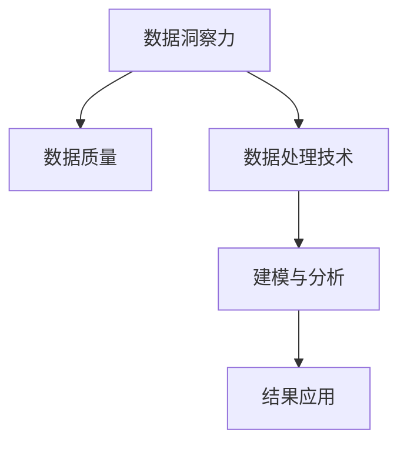

                 

# 知识的应用：洞察力指引知识的实践方向

> 关键词：知识应用, 洞察力, 知识实践, 数据洞察, 数据科学

## 1. 背景介绍

### 1.1 问题由来

在当今数字化、信息化日益加速的时代，数据正以前所未有的速度和规模涌现。面对海量数据，如何从其中提取有价值的信息、洞察背后的规律、为决策提供支持，已经成为各行各业亟需解决的重大问题。传统的业务分析方法已经无法应对这一挑战，需要引入更先进的知识应用技术，通过数据洞察力，推动业务的深度理解和持续优化。

在这一背景下，数据科学应运而生，迅速成为推动创新和增长的重要引擎。数据科学不仅仅是统计分析或机器学习，而是一个将数据转化为知识，指导决策和行动的综合领域。本文将深入探讨知识的应用，特别是通过数据洞察力指引知识的实践方向，帮助读者理解和掌握这一前沿技术。

### 1.2 问题核心关键点

数据洞察力是指从数据中提取知识并转化为行动的过程。这一过程涉及数据的收集、清洗、建模、分析和应用等多个环节，通过洞察数据背后的规律和趋势，指导业务决策，实现数据驱动的智能优化。

数据洞察力的实现需要掌握以下关键点：
- 数据质量：确保数据的准确性、完整性和一致性，是数据洞察力实现的基础。
- 数据处理技术：包括数据清洗、特征工程、数据转换等，使数据适合建模和分析。
- 建模与分析：选择合适的统计或机器学习模型，分析数据特征和趋势。
- 结果应用：将分析结果转化为可执行的决策和行动，实现业务改进。

通过理解和掌握这些核心点，可以更好地应用数据洞察力，提升决策质量和工作效率。

### 1.3 问题研究意义

数据洞察力在现代社会中的应用非常广泛，几乎涵盖了所有行业和领域。例如：

- 零售业：通过客户行为数据分析，优化库存管理和商品推荐，提升客户满意度和销售额。
- 金融业：利用市场数据和交易记录，进行风险评估和投资决策，实现资产增值。
- 制造业：通过设备运行数据和生产记录，优化生产流程和质量控制，降低成本和提高效率。
- 医疗健康：利用患者数据和医疗记录，进行疾病预测和个性化治疗，改善患者健康状况。

数据洞察力的成功应用，不仅可以提高决策的科学性和准确性，还能推动技术创新和业务模式的变革，为企业的可持续发展提供强大动力。因此，研究数据洞察力的应用，对于推动各行各业的数字化转型和智能化升级，具有重要的理论和实践意义。

## 2. 核心概念与联系

### 2.1 核心概念概述

为了更好地理解数据洞察力的应用，本节将介绍几个核心概念：

- 数据洞察力：指通过数据分析和建模，从数据中提取知识，指导决策和行动的过程。
- 数据质量：指数据的准确性、完整性、一致性和时效性，是数据洞察力实现的前提。
- 数据处理技术：包括数据清洗、特征工程、数据转换等，使数据适合建模和分析。
- 建模与分析：选择合适的统计或机器学习模型，分析数据特征和趋势。
- 结果应用：将分析结果转化为可执行的决策和行动，实现业务改进。

这些核心概念之间的逻辑关系可以通过以下Mermaid流程图来展示：



这个流程图展示了一个完整的从数据到决策的流程：

1. 数据洞察力需要高质量的数据作为基础。
2. 数据处理技术对原始数据进行清洗、特征提取等预处理，使其适合建模和分析。
3. 通过建模与分析，选择适合的统计或机器学习模型，揭示数据背后的规律和趋势。
4. 最终，将分析结果应用于实际决策和行动，实现业务改进。

## 3. 核心算法原理 & 具体操作步骤

### 3.1 算法原理概述

数据洞察力的实现离不开数据处理和建模分析。本节将详细介绍这两个核心步骤的算法原理和具体操作步骤。

### 3.2 算法步骤详解

#### 3.2.1 数据处理技术

数据处理技术是数据洞察力的第一步，主要包括以下几个关键环节：

1. **数据清洗**：识别和处理数据中的异常值、缺失值、重复值等，确保数据的准确性和完整性。
2. **特征工程**：根据业务需求和模型特点，从原始数据中提取有意义的特征，如统计特征、时间特征、文本特征等。
3. **数据转换**：将数据转换为适合建模的形式，如标准化、归一化、编码等。

#### 3.2.2 建模与分析

建模与分析是数据洞察力的核心步骤，通过选择合适的统计或机器学习模型，分析数据特征和趋势。常见的建模方法包括：

1. **统计分析**：利用描述性统计、假设检验等方法，了解数据的基本特征和分布。
2. **回归分析**：通过回归模型，建立自变量与因变量之间的关系，进行预测和解释。
3. **分类分析**：使用分类模型，如决策树、支持向量机等，对数据进行分类和聚类分析。
4. **聚类分析**：利用聚类算法，将数据分组为不同的簇，揭示数据的内在结构。
5. **时间序列分析**：使用时间序列模型，如ARIMA、LSTM等，分析时间序列数据的趋势和周期性。

#### 3.2.3 结果应用

将分析结果转化为可执行的决策和行动，是数据洞察力的最终目标。具体应用方式包括：

1. **决策支持**：根据分析结果，制定业务决策和优化方案。
2. **自动化流程**：利用机器学习模型，自动化处理和优化业务流程。
3. **用户交互**：通过可视化工具和仪表盘，展示数据分析结果，支持用户理解和应用。

### 3.3 算法优缺点

数据洞察力在提升决策科学性和业务效率方面具有显著优势：

优点：
- 数据驱动：基于数据而非经验或直觉进行决策，提高了决策的准确性和可靠性。
- 全面分析：综合利用多维数据，进行深入分析和挖掘，揭示数据背后的规律和趋势。
- 自动化处理：利用机器学习和自动化技术，提高处理效率和数据质量。
- 实时更新：结合最新数据，不断更新分析结果，保持决策的时效性和适应性。

缺点：
- 依赖数据质量：数据质量不高，可能导致分析结果失真，影响决策效果。
- 算法复杂性：不同模型和算法具有不同的复杂性和适用场景，需要根据具体情况选择。
- 结果解释：复杂模型和算法可能缺乏可解释性，难以理解和调试。
- 资源需求：高精度和复杂度的分析需要高性能计算资源，成本较高。

### 3.4 算法应用领域

数据洞察力已经在多个领域得到了广泛应用，例如：

1. **零售业**：通过客户行为数据分析，优化库存管理和商品推荐，提升客户满意度和销售额。
2. **金融业**：利用市场数据和交易记录，进行风险评估和投资决策，实现资产增值。
3. **制造业**：通过设备运行数据和生产记录，优化生产流程和质量控制，降低成本和提高效率。
4. **医疗健康**：利用患者数据和医疗记录，进行疾病预测和个性化治疗，改善患者健康状况。
5. **供应链管理**：利用供应链数据，优化库存管理和物流配送，提升供应链效率和客户满意度。

除了上述这些经典领域，数据洞察力还在更多场景中得到应用，如市场营销、人力资源、客户服务、公共管理等，为各行业带来了巨大的商业价值。

## 4. 数学模型和公式 & 详细讲解 & 举例说明

### 4.1 数学模型构建

数据洞察力的实现依赖于数学模型和统计方法。以下是几种常见的数学模型及其构建方法：

1. **线性回归模型**：用于建立自变量与因变量之间的线性关系，进行预测和解释。
   $$
   y = \beta_0 + \beta_1x_1 + \ldots + \beta_px_p + \epsilon
   $$
   其中，$y$ 为因变量，$x_1,\ldots,x_p$ 为自变量，$\beta_0,\ldots,\beta_p$ 为回归系数，$\epsilon$ 为误差项。

2. **决策树模型**：通过树形结构，对数据进行分类和预测。
   $$
   T = \{(x_i, f(x_i)), x_i \in \mathcal{X}, f(x_i) \in \mathcal{Y}\}
   $$
   其中，$T$ 为决策树，$x_i$ 为输入，$f(x_i)$ 为输出。

3. **支持向量机模型**：通过寻找最优超平面，对数据进行分类和回归分析。
   $$
   w \cdot x + b = 0
   $$
   其中，$w$ 为权重向量，$x$ 为输入，$b$ 为偏置。

### 4.2 公式推导过程

以线性回归模型为例，介绍其推导过程。

假设我们有一个线性回归问题，输入特征向量为 $X=[x_1,\ldots,x_p]$，目标变量为 $y$。根据最小二乘法，我们希望最小化损失函数：
$$
L = \frac{1}{2N} \sum_{i=1}^N(y_i - \hat{y}_i)^2
$$
其中，$\hat{y}_i = \beta_0 + \beta_1x_{i1} + \ldots + \beta_px_{ip}$ 为预测值，$y_i$ 为真实值，$N$ 为样本数量。

为了求最小化损失函数，我们需要对 $\beta_0,\ldots,\beta_p$ 求偏导数，并使其为0，即：
$$
\frac{\partial L}{\partial \beta_0} = -\frac{1}{N} \sum_{i=1}^N(y_i - \hat{y}_i) = 0
$$
$$
\frac{\partial L}{\partial \beta_j} = -\frac{1}{N} \sum_{i=1}^N(x_{ij} - \bar{x}_{j})(y_i - \hat{y}_i) = 0 \quad (j=1,\ldots,p)
$$
其中，$\bar{x}_j$ 为特征 $x_j$ 的均值。

解以上方程组，可以得到回归系数 $\beta_0,\ldots,\beta_p$ 的值，进而计算预测值 $\hat{y}_i$，实现线性回归模型的应用。

### 4.3 案例分析与讲解

以一个简单的房价预测为例，展示数据洞察力的应用过程。

假设我们有一组数据集，包含房屋面积、房间数量、位置等特征，以及对应的房价。我们的目标是构建一个线性回归模型，预测新房屋的房价。

1. **数据清洗**：删除缺失值，处理异常值，确保数据质量。
2. **特征工程**：提取特征，如房价、面积、房间数量、地理位置等。
3. **模型训练**：使用线性回归模型，训练模型参数 $\beta_0,\ldots,\beta_p$，得到预测公式。
4. **结果验证**：在测试集上验证模型性能，调整参数，优化模型。
5. **结果应用**：将新房屋的特征输入模型，得到预测房价，作为决策依据。

## 5. 项目实践：代码实例和详细解释说明

### 5.1 开发环境搭建

在进行数据洞察力实践前，我们需要准备好开发环境。以下是使用Python进行Scikit-learn开发的环境配置流程：

1. 安装Anaconda：从官网下载并安装Anaconda，用于创建独立的Python环境。
   ```bash
   conda create -n sklearn-env python=3.8 
   conda activate sklearn-env
   ```

2. 安装Scikit-learn：
   ```bash
   conda install scikit-learn
   ```

3. 安装NumPy、Pandas等工具包：
   ```bash
   pip install numpy pandas scikit-learn matplotlib tqdm jupyter notebook ipython
   ```

完成上述步骤后，即可在`sklearn-env`环境中开始数据洞察力的实践。

### 5.2 源代码详细实现

下面我们以线性回归模型为例，给出使用Scikit-learn进行房价预测的Python代码实现。

```python
import pandas as pd
from sklearn.model_selection import train_test_split
from sklearn.linear_model import LinearRegression
from sklearn.metrics import mean_squared_error

# 数据读取
data = pd.read_csv('house_prices.csv')

# 特征选择
X = data[['area', 'rooms', 'location']]
y = data['price']

# 数据分割
X_train, X_test, y_train, y_test = train_test_split(X, y, test_size=0.2, random_state=42)

# 模型训练
model = LinearRegression()
model.fit(X_train, y_train)

# 预测验证
y_pred = model.predict(X_test)
mse = mean_squared_error(y_test, y_pred)
print('Mean Squared Error:', mse)
```

以上就是使用Scikit-learn进行房价预测的完整代码实现。可以看到，Scikit-learn库提供了简单易用的API，使得数据洞察力的实现变得简洁高效。

### 5.3 代码解读与分析

让我们再详细解读一下关键代码的实现细节：

**数据读取和特征选择**：
- `pd.read_csv()`方法用于读取数据集，`dataframe`格式适合进行数据处理和分析。
- `X = data[['area', 'rooms', 'location']]`和`y = data['price']`分别选取特征和目标变量。

**数据分割**：
- `train_test_split()`方法用于将数据集分割为训练集和测试集，保持数据分布的一致性。

**模型训练**：
- `LinearRegression()`类用于创建线性回归模型，`fit()`方法用于模型训练。

**预测验证**：
- `y_pred = model.predict(X_test)`用于对测试集进行预测，`mean_squared_error()`方法用于计算预测值和真实值之间的均方误差。

**结果展示**：
- 最终输出均方误差，评估模型性能。

可以看到，Scikit-learn库提供了一套完整的数据处理和建模工具，使得数据洞察力的实践变得非常简单。通过学习和掌握这些工具，可以大大提高数据洞察力的应用效率和准确性。

## 6. 实际应用场景

### 6.1 智能推荐系统

数据洞察力在智能推荐系统中的应用非常广泛。通过分析用户行为和偏好，推荐系统可以精准推荐商品、内容或服务，提升用户体验和满意度。

具体而言，推荐系统可以通过以下步骤实现：
1. 收集用户浏览、点击、评分等行为数据。
2. 进行数据清洗和特征提取，如用户特征、商品特征、行为特征等。
3. 使用协同过滤、内容推荐、基于深度学习的推荐算法等，构建推荐模型。
4. 在实时数据上应用推荐模型，生成推荐结果。
5. 对推荐结果进行评估和反馈，不断优化模型性能。

推荐系统的成功应用，不仅提升了用户满意度，还能显著增加销售和转化率，为电商平台和内容提供商带来了巨大的商业价值。

### 6.2 智能客服系统

智能客服系统利用数据洞察力，通过分析用户历史行为和上下文信息，实现自动化的客户服务。

具体而言，智能客服系统可以通过以下步骤实现：
1. 收集用户历史聊天记录、客服对话记录等数据。
2. 进行数据清洗和特征提取，如用户情感、问题类型、回答质量等。
3. 使用自然语言处理、对话管理等技术，构建智能客服模型。
4. 在实时对话中应用模型，生成智能回复。
5. 对客服回复进行评估和反馈，不断优化模型性能。

智能客服系统的成功应用，不仅提高了客户服务的效率和质量，还能大大降低人力成本，为企业的客户服务提供了强大的技术支持。

### 6.3 金融风控系统

金融风控系统利用数据洞察力，通过分析客户交易记录、信用历史等数据，识别和预测风险，实现贷款审批和信用评估。

具体而言，金融风控系统可以通过以下步骤实现：
1. 收集客户交易记录、信用报告等数据。
2. 进行数据清洗和特征提取，如交易金额、频率、时间等。
3. 使用机器学习算法，构建风控模型。
4. 在贷款审批和信用评估中应用模型，进行风险评估和决策。
5. 对模型结果进行评估和反馈，不断优化模型性能。

金融风控系统的成功应用，不仅提高了贷款审批的效率和准确性，还能显著降低信用风险，为金融机构的稳健运营提供了保障。

## 7. 工具和资源推荐

### 7.1 学习资源推荐

为了帮助开发者系统掌握数据洞察力的理论基础和实践技巧，这里推荐一些优质的学习资源：

1. 《Python数据科学手册》：由数据科学专家编写，全面介绍了Python在数据科学中的应用，包括数据清洗、数据处理、建模分析等。

2. 《机器学习实战》：从实战角度出发，通过实例讲解了机器学习的基础知识和常用算法。

3. Kaggle：著名的数据科学竞赛平台，提供海量数据集和竞赛项目，是学习和应用数据洞察力的最佳场所。

4. Coursera和edX：提供大量数据科学和机器学习的在线课程，由世界各地的顶级大学和机构开设。

5. Scikit-learn官方文档：提供详细的API文档和示例代码，是学习和应用Scikit-learn库的重要资源。

通过对这些资源的学习实践，相信你一定能够快速掌握数据洞察力的精髓，并用于解决实际的业务问题。

### 7.2 开发工具推荐

高效的开发离不开优秀的工具支持。以下是几款用于数据洞察力开发的工具：

1. Jupyter Notebook：开源的交互式笔记本，支持Python、R等多种语言，非常适合数据科学研究和实验。

2. PyCharm：功能强大的Python IDE，提供代码编辑、调试、测试等全功能支持。

3. Tableau：强大的数据可视化工具，支持多种数据源，适合进行数据探索和报告生成。

4. Power BI：微软推出的商业智能工具，提供丰富的可视化仪表盘和报表功能。

5. RStudio：开源的R语言IDE，提供代码编辑、调试、测试等全功能支持。

6. MATLAB：功能强大的科学计算软件，支持多种数据处理和分析功能。

合理利用这些工具，可以显著提升数据洞察力的开发效率，加快创新迭代的步伐。

### 7.3 相关论文推荐

数据洞察力的发展源于学界的持续研究。以下是几篇奠基性的相关论文，推荐阅读：

1. 《机器学习》：由Tom Mitchell撰写，系统介绍了机器学习的基本概念和常用算法。

2. 《深度学习》：由Ian Goodfellow、Yoshua Bengio和Aaron Courville合著，全面介绍了深度学习的基础知识和最新进展。

3. 《数据挖掘：概念与技术》：由Jian Pei、Rajiv B. Singhal和Geoffrey Karypis合著，系统介绍了数据挖掘的基本概念和技术。

4. 《Python数据科学手册》：由Jake VanderPlas撰写，全面介绍了Python在数据科学中的应用。

5. 《Scikit-learn官方文档》：提供了Scikit-learn库的详细API文档和示例代码，是学习和应用Scikit-learn库的重要资源。

这些论文代表了大数据洞察力发展脉络。通过学习这些前沿成果，可以帮助研究者把握学科前进方向，激发更多的创新灵感。

## 8. 总结：未来发展趋势与挑战

### 8.1 总结

本文对数据洞察力的应用进行了全面系统的介绍。首先阐述了数据洞察力的背景和意义，明确了数据洞察力在提升决策科学性和业务效率方面的独特价值。其次，从原理到实践，详细讲解了数据处理和建模分析的算法原理和操作步骤，给出了数据洞察力任务开发的完整代码实例。同时，本文还广泛探讨了数据洞察力在推荐系统、智能客服、金融风控等多个行业领域的应用前景，展示了数据洞察力的巨大潜力。此外，本文精选了数据洞察力的各类学习资源，力求为读者提供全方位的技术指引。

通过本文的系统梳理，可以看到，数据洞察力在现代社会中的应用非常广泛，几乎涵盖了所有行业和领域。通过数据洞察力，从海量数据中提取知识，指导决策和行动，可以显著提升决策的科学性和业务效率，推动各行各业的数字化转型和智能化升级。

### 8.2 未来发展趋势

展望未来，数据洞察力技术将呈现以下几个发展趋势：

1. 数据规模持续增大。随着互联网、物联网等技术的快速发展，数据规模将持续增长，为数据洞察力提供了更加丰富和多样化的数据源。

2. 技术融合加速。数据洞察力将与其他新兴技术，如区块链、边缘计算、人工智能等进行深度融合，提升数据的实时性、可靠性和安全性。

3. 跨领域应用广泛。数据洞察力不仅在传统行业得到应用，还将拓展到新兴领域，如智慧城市、智能交通、健康医疗等，带来更多的商业机会和创新应用。

4. 数据隐私保护加强。数据洞察力在应用过程中，面临隐私和安全的挑战，需要通过数据匿名化、隐私保护等技术，确保数据安全。

5. 智能决策支持。数据洞察力将与智能决策系统进行深度融合，实现数据驱动的智能决策，提升决策的自动化和智能化水平。

6. 跨领域协同。数据洞察力将跨越不同领域，实现数据和知识的共享与协作，提升社会的整体数据洞察力水平。

以上趋势凸显了数据洞察力的广阔前景。这些方向的探索发展，必将进一步提升数据洞察力的应用效果，推动社会和经济的持续进步。

### 8.3 面临的挑战

尽管数据洞察力技术已经取得了显著进展，但在迈向更加智能化、普适化应用的过程中，它仍面临诸多挑战：

1. 数据质量瓶颈。数据质量不高，可能导致分析结果失真，影响决策效果。如何提高数据质量，是数据洞察力的基础问题。

2. 算法复杂性。不同模型和算法具有不同的复杂性和适用场景，需要根据具体情况选择。复杂模型和算法可能缺乏可解释性，难以理解和调试。

3. 资源需求。高精度和复杂度的分析需要高性能计算资源，成本较高。如何优化算法和模型，降低资源需求，是数据洞察力需要解决的重要问题。

4. 结果解释。复杂模型和算法可能缺乏可解释性，难以理解和调试。如何提高模型的可解释性，是数据洞察力需要解决的难点。

5. 数据隐私。数据洞察力在应用过程中，面临隐私和安全的挑战，需要通过数据匿名化、隐私保护等技术，确保数据安全。

6. 技术协同。数据洞察力需要与其他新兴技术，如区块链、边缘计算、人工智能等进行深度融合，提升数据的实时性、可靠性和安全性。

正视数据洞察力面临的这些挑战，积极应对并寻求突破，将是大数据洞察力走向成熟的必由之路。相信随着学界和产业界的共同努力，这些挑战终将一一被克服，大数据洞察力必将在构建数据驱动的智能社会中扮演越来越重要的角色。

### 8.4 未来突破

面对大数据洞察力所面临的种种挑战，未来的研究需要在以下几个方面寻求新的突破：

1. 探索更加高效的数据清洗和特征工程方法，提高数据质量。
2. 研究更加可解释和易用的机器学习模型，提高算法的透明度和可理解性。
3. 开发更加高效和灵活的算法和模型，降低计算资源的需求。
4. 结合人工智能技术，实现数据的实时处理和智能决策。
5. 引入区块链和边缘计算技术，提升数据的安全性和可靠性。
6. 加强跨领域数据的整合和共享，推动数据洞察力的普及和应用。

这些研究方向的探索，必将引领大数据洞察力技术迈向更高的台阶，为构建数据驱动的智能社会提供强大的技术支撑。面向未来，大数据洞察力技术还需要与其他新兴技术进行更深入的融合，如人工智能、区块链、边缘计算等，协同发力，共同推动社会的数字化转型和智能化升级。只有勇于创新、敢于突破，才能不断拓展大数据洞察力的边界，让智能技术更好地造福人类社会。

## 9. 附录：常见问题与解答

**Q1：数据洞察力是否适用于所有行业？**

A: 数据洞察力在大多数行业和领域都具有应用价值，特别是对于数据驱动型的行业，如零售、金融、医疗、制造等。然而，对于数据获取成本高、数据质量难以保证的行业，数据洞察力的效果可能会大打折扣。因此，在使用数据洞察力时，需要结合具体行业特点进行评估和选择。

**Q2：数据洞察力如何应对数据质量问题？**

A: 数据质量是数据洞察力的基础，可以通过以下方法应对数据质量问题：
1. 数据清洗：识别和处理数据中的异常值、缺失值、重复值等，确保数据的准确性和完整性。
2. 数据增强：通过数据合成、数据平衡等方法，提高数据的多样性和代表性。
3. 数据验证：对数据进行抽样检查和验证，确保数据的一致性和可靠性。

**Q3：数据洞察力在应用中如何平衡资源需求与效果？**

A: 数据洞察力在应用中需要平衡资源需求与效果，可以通过以下方法：
1. 算法优化：优化算法和模型结构，降低计算复杂度，提高运行效率。
2. 并行计算：利用多核、分布式计算等技术，加速数据处理和分析。
3. 模型压缩：采用模型压缩、剪枝等技术，减小模型大小，提高资源利用率。
4. 资源调度：合理调度计算资源，动态调整计算量，平衡性能和成本。

**Q4：数据洞察力如何处理跨领域数据？**

A: 数据洞察力在跨领域数据处理中，需要考虑以下方法：
1. 数据标准化：对不同来源的数据进行标准化，统一数据格式和结构。
2. 特征对齐：识别和提取不同领域的数据共性特征，进行特征对齐和融合。
3. 模型融合：结合不同领域的知识和模型，构建综合性的数据洞察力模型。
4. 数据共享：建立数据共享机制，促进不同领域的数据整合和协同应用。

**Q5：数据洞察力在应用中如何保障数据隐私？**

A: 数据洞察力在应用中需要保障数据隐私，可以通过以下方法：
1. 数据匿名化：对敏感数据进行匿名化处理，保护用户隐私。
2. 数据加密：对数据进行加密处理，防止数据泄露和攻击。
3. 访问控制：对数据访问进行严格的权限控制，确保数据安全。
4. 隐私保护：采用差分隐私、联邦学习等隐私保护技术，保护用户隐私。

通过合理应对这些挑战，数据洞察力技术将能够更好地应用于实际场景，推动社会的数字化转型和智能化升级。

