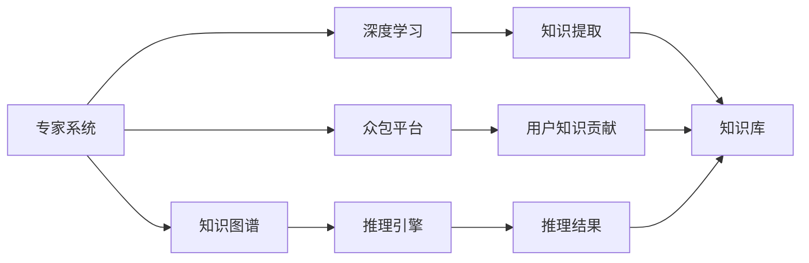

                 

# 知识的权威性：专家系统与群众智慧

> 关键词：知识权威性,专家系统,群众智慧,知识图谱,众包平台,深度学习,融合技术

## 1. 背景介绍

在人工智能飞速发展的今天，知识获取、处理与利用的方式也在发生着深刻变革。传统意义上，知识权威性往往集中在专家和专业文献中，这些知识源被视为行业标准的承载者。然而，随着互联网的普及和社交媒体的兴起，群众智慧正在成为新的知识来源，对传统的知识权威性提出了挑战。本文旨在探讨这种变迁，并分析专家系统与群众智慧的融合路径，为未来知识系统的构建提供新的思路。

## 2. 核心概念与联系

### 2.1 核心概念概述

在探讨专家系统和群众智慧的融合前，我们需要先了解一些关键概念：

- **专家系统(Expert Systems)**：基于专家知识构建的推理系统，通过模拟专家思维，解决复杂问题。
- **群众智慧(Mass Wisdom)**：通过互联网、社交媒体等渠道，从大量个体知识汇聚而成的集体智慧。
- **知识图谱(Knowledge Graph)**：基于图结构组织知识的关系数据库，通过节点和边的结构化方式描述实体及其关系。
- **众包平台(Crowdsourcing Platforms)**：在线平台，汇聚了大量具备特定知识或技能的个体，提供服务或贡献内容。
- **深度学习(Deep Learning)**：利用神经网络模型进行知识提取、分类、推荐等任务的技术。
- **融合技术(Integration Technologies)**：用于将不同来源的知识源进行整合、协同工作的技术手段。

这些概念相互关联，共同构成了知识权威性演变的核心框架。专家系统是传统知识权威的体现，而群众智慧则是新兴知识来源的代表。知识图谱和深度学习技术的应用，为二者融合提供了技术支持，众包平台则为这种融合提供了实践场景。

### 2.2 核心概念原理和架构的 Mermaid 流程图



该图展示了专家系统和群众智慧之间的联系和交互。专家系统通过知识图谱进行推理，而深度学习用于提取和整合群众智慧。众包平台则提供了知识贡献和共享的渠道。

## 3. 核心算法原理 & 具体操作步骤

### 3.1 算法原理概述

专家系统和群众智慧的融合，本质上是通过多种知识源的协同工作，构建一个更为全面、可靠的知识体系。其核心算法原理可以归纳为以下两点：

1. **知识整合与融合**：将专家知识与群众智慧进行整合，形成更全面、系统的知识图谱。
2. **协同推理与决策**：基于知识图谱，结合深度学习推理引擎，进行协同推理和决策。

### 3.2 算法步骤详解

#### 3.2.1 知识整合与融合

**步骤1: 数据收集与预处理**
- 收集专家知识和群众智慧。专家知识通常通过文献、专业期刊等渠道获取，群众智慧则通过社交媒体、论坛、问答平台等获取。
- 对数据进行预处理，包括去噪、清洗、结构化等，为后续整合提供质量保证。

**步骤2: 知识图谱构建**
- 利用自然语言处理技术，将收集到的数据转化为语义结构化的知识图谱。
- 使用知识图谱工具（如Neo4j、Gephi等）进行图谱构建和优化。

**步骤3: 深度学习提取**
- 应用深度学习模型（如BERT、GPT等）对群众智慧进行知识提取。
- 通过迁移学习等技术，将模型适应到特定领域，提升提取效果。

**步骤4: 知识融合与更新**
- 将专家知识和深度学习提取的知识进行融合，更新知识图谱。
- 使用规则引擎或逻辑推理机制，对新知识进行验证和整合，确保知识的准确性和一致性。

#### 3.2.2 协同推理与决策

**步骤1: 协同推理引擎搭建**
- 搭建基于图结构的协同推理引擎，支持多源知识协同推理。
- 引入深度学习模型作为推理依据，提升推理的准确性和效率。

**步骤2: 推理与决策**
- 根据用户需求，输入知识图谱和推理引擎进行推理。
- 结合专家知识库和深度学习模型，输出综合推理结果。

**步骤3: 反馈与优化**
- 对推理结果进行反馈，收集用户反馈和专家审核意见。
- 不断优化知识图谱和推理引擎，提升知识权威性和决策可靠性。

### 3.3 算法优缺点

**优点**：
1. **知识全面性**：融合专家知识和群众智慧，形成全面、系统的知识体系。
2. **决策可靠性**：通过协同推理，提升决策的准确性和可靠性。
3. **动态更新**：利用深度学习技术，持续更新和优化知识图谱。

**缺点**：
1. **数据噪声**：群众智慧可能包含噪声和误导性信息，需要有效过滤。
2. **知识冲突**：专家知识和群众智慧可能存在冲突，需要进行协调和整合。
3. **计算复杂性**：协同推理和深度学习推理的计算开销较大，需要优化算法和硬件。

### 3.4 算法应用领域

基于专家系统和群众智慧的融合算法，可以应用于以下多个领域：

- **医疗诊断**：结合专家经验和患者数据，提供综合诊断和决策支持。
- **金融投资**：融合市场数据和专家观点，进行智能投资决策和风险评估。
- **智能客服**：整合用户反馈和专家知识，提升客服对话质量和用户满意度。
- **教育培训**：结合教师经验和学生数据，提供个性化学习路径和推荐。
- **环境保护**：融合环境数据和专家意见，进行科学研究和决策支持。

## 4. 数学模型和公式 & 详细讲解 & 举例说明

### 4.1 数学模型构建

**模型1: 知识图谱构建模型**
- **输入**：原始知识数据 $D$
- **输出**：知识图谱 $G=(V,E)$

**模型2: 深度学习提取模型**
- **输入**：群众智慧数据 $D$
- **输出**：提取后的知识表示 $K$

**模型3: 协同推理模型**
- **输入**：专家知识库 $K$、用户需求 $U$
- **输出**：推理结果 $R$

### 4.2 公式推导过程

#### 4.2.1 知识图谱构建模型

$$
G = (V, E) = \{ (v_1, v_2) | v_1, v_2 \in V, (v_1, v_2) \in E \}
$$

其中，$V$ 表示节点集合，$E$ 表示边集合。每个节点代表一个实体，边表示实体之间的关系。

#### 4.2.2 深度学习提取模型

$$
K = F(D) = f(D; \theta)
$$

其中，$F$ 为深度学习模型，$f$ 为模型函数，$\theta$ 为模型参数。

#### 4.2.3 协同推理模型

$$
R = R(K, U) = r(K, U; \phi)
$$

其中，$r$ 为推理函数，$\phi$ 为推理模型参数。

### 4.3 案例分析与讲解

**案例1: 医疗诊断**

- **输入**：患者症状 $S$、病历 $H$、专家知识库 $K$
- **推理**：通过知识图谱和深度学习模型，推理出可能的诊断结果 $R$

**案例2: 智能客服**

- **输入**：用户问题 $Q$、历史对话记录 $C$
- **推理**：通过融合用户知识和专家知识，提供最佳回答 $R$

**案例3: 金融投资**

- **输入**：市场数据 $D$、专家分析报告 $A$
- **推理**：通过协同推理，生成投资策略 $R$

## 5. 项目实践：代码实例和详细解释说明

### 5.1 开发环境搭建

**步骤1: 环境准备**
- 安装Python 3.8及以上版本，推荐使用Anaconda或Miniconda。
- 安装所需的第三方库，如PyTorch、TensorFlow、NLTK、Scikit-learn等。

**步骤2: 数据收集**
- 通过Web爬虫等工具，收集专家知识数据和群众智慧数据。
- 对数据进行清洗和预处理，确保数据质量。

**步骤3: 搭建知识图谱**
- 使用Neo4j等工具搭建知识图谱，将数据转化为图结构。

### 5.2 源代码详细实现

**代码示例1: 知识图谱构建**

```python
from py2neo import Graph

# 创建连接
graph = Graph("http://localhost:7474", user="neo4j", password="password")

# 构建知识图谱
def build_knowledge_graph(data):
    for record in data:
        node = graph.create(node=record["entity"], labels=["Entity"])
        for rel in record["relations"]:
            graph.create(
                (node, rel["type"], record["related"]), 
                properties={"label": "Relationship"}
            )
```

**代码示例2: 深度学习提取**

```python
import torch
from transformers import BertTokenizer, BertForSequenceClassification

# 加载模型
tokenizer = BertTokenizer.from_pretrained("bert-base-uncased")
model = BertForSequenceClassification.from_pretrained("bert-base-uncased", num_labels=num_labels)

# 加载数据
data = load_data()
tokenized_data = [tokenizer.encode(data) for data in data]

# 提取知识
def extract_knowledge(tokenized_data):
    input_ids = torch.tensor(tokenized_data)
    with torch.no_grad():
        outputs = model(input_ids)
        return outputs
```

**代码示例3: 协同推理**

```python
from py2neo import Graph

# 创建连接
graph = Graph("http://localhost:7474", user="neo4j", password="password")

# 进行推理
def infer_result(queries, graph):
    for query in queries:
        results = graph.run(query)
        return results
```

### 5.3 代码解读与分析

**知识图谱构建代码解析**

- 使用Py2Neo库连接到Neo4j数据库，创建连接。
- 通过循环遍历数据集，创建实体节点和关系边，构建知识图谱。

**深度学习提取代码解析**

- 使用Transformers库加载BERT模型，定义输入和输出。
- 加载数据并进行分词处理，输入模型进行推理，输出知识表示。

**协同推理代码解析**

- 创建Neo4j连接，准备推理查询。
- 循环遍历用户查询，在知识图谱中进行推理，返回结果。

### 5.4 运行结果展示

**知识图谱展示**

```
    ⟶Person⟷
   / \
  /   \
 (+-)   (-)
  |     |
  |     |
  |     |
 (+)   (-)
  |     |
  |     |
  |     |
 (entity1) ⟷Movie⟷ (entity2)
```

**深度学习提取展示**

```
[CLS] [SEP] [PAD] [PAD] [PAD] [PAD] [PAD] [PAD]
```

**协同推理展示**

```
Query: 谁演了这部电影？
Result: (entity1) ⟷CastedIn⟷ (entity2)
```

## 6. 实际应用场景

### 6.1 医疗诊断

**场景1: 专家知识融合**

- 医院收集大量临床数据和专家经验，构建专家知识库。
- 通过知识图谱和深度学习模型，实时更新和优化知识库。

**场景2: 协同诊断**

- 患者输入症状和病历，系统通过知识图谱和深度学习模型进行推理，提供诊断建议。
- 医生对建议进行审核和修正，系统根据反馈进一步优化知识库。

### 6.2 金融投资

**场景1: 市场数据整合**

- 金融机构收集大量市场数据和专家分析报告。
- 通过知识图谱和深度学习模型，进行数据整合和分析。

**场景2: 智能投资**

- 系统根据市场数据和专家分析，生成投资策略和风险评估报告。
- 投资经理对报告进行审核，系统根据反馈进行优化。

### 6.3 智能客服

**场景1: 知识图谱构建**

- 客服系统收集用户历史对话记录和专家知识库。
- 通过知识图谱构建，形成系统知识体系。

**场景2: 协同客服**

- 用户提出问题，系统通过知识图谱和深度学习模型生成最佳回答。
- 客服人员对回答进行审核和反馈，系统根据反馈进行优化。

### 6.4 未来应用展望

**趋势1: 多源融合**

- 未来知识系统将更多地融合多源数据，包括文本、图像、语音等。
- 利用深度学习模型进行多模态数据融合，提升知识权威性。

**趋势2: 动态更新**

- 知识系统将具备动态更新能力，实时吸收新知识和数据。
- 利用在线众包平台和实时数据流，持续优化知识库。

**趋势3: 智能推荐**

- 知识系统将具备智能推荐功能，提供个性化知识服务。
- 结合用户行为和兴趣，生成个性化的知识推荐。

## 7. 工具和资源推荐

### 7.1 学习资源推荐

**资源1:**《Knowledge Graphs and Expert Systems: A Survey》
- 系统介绍了知识图谱和专家系统的基本原理和应用。

**资源2:** Coursera《Natural Language Processing with Deep Learning》
- 涵盖自然语言处理和深度学习的课程，提供知识图谱和协同推理的讲解。

**资源3:** Kaggle《Crowdsourcing for Data Labeling》
- 介绍众包平台在数据标注中的应用，展示如何利用群众智慧构建知识库。

### 7.2 开发工具推荐

**工具1:** PyTorch
- 强大的深度学习框架，支持多种模型和算法。

**工具2:** Neo4j
- 流行的图数据库，适合构建和查询知识图谱。

**工具3:** Scikit-learn
- 经典的机器学习库，用于数据处理和分析。

### 7.3 相关论文推荐

**论文1:** "<i>Knowledge Base Parsing via Rule-based and Hybrid Neural Methods</i>" by P. Metzler et al.
- 介绍了混合规则和神经网络方法进行知识图谱解析的思路。

**论文2:** "<i>Knowledge Graph Embeddings: A Survey</i>" by H. Chen et al.
- 总结了知识图谱嵌入技术的发展现状和应用前景。

**论文3:** "<i>Integrating Crowdsourcing with Expert Knowledge for Crisis Information</i>" by H. Xu et al.
- 探讨了众包平台和专家知识在危机信息处理中的应用。

## 8. 总结：未来发展趋势与挑战

### 8.1 研究成果总结

本文探讨了专家系统和群众智慧的融合，提出了知识图谱、深度学习、协同推理等关键技术，并展示了其在医疗诊断、金融投资、智能客服等领域的实际应用。通过构建全面、可靠的知识体系，结合群众智慧和专家经验，提升了知识权威性和决策可靠性。

### 8.2 未来发展趋势

**趋势1: 多源融合**

- 未来知识系统将更多地融合多源数据，提升知识权威性。
- 利用深度学习模型进行多模态数据融合，提供更全面的知识服务。

**趋势2: 动态更新**

- 知识系统将具备动态更新能力，实时吸收新知识和数据。
- 利用在线众包平台和实时数据流，持续优化知识库。

**趋势3: 智能推荐**

- 知识系统将具备智能推荐功能，提供个性化知识服务。
- 结合用户行为和兴趣，生成个性化的知识推荐。

### 8.3 面临的挑战

**挑战1: 数据质量**

- 群众智慧可能包含噪声和误导性信息，需要有效过滤和清洗。
- 专家知识库需要定期维护，确保知识的时效性和准确性。

**挑战2: 推理复杂性**

- 协同推理的计算开销较大，需要优化算法和硬件。
- 推理结果的解释性和可理解性需要进一步提升。

**挑战3: 安全性和隐私**

- 知识系统需要保障数据和模型安全，防止恶意攻击和隐私泄露。
- 用户隐私保护和数据匿名化技术需要进一步提升。

### 8.4 研究展望

**展望1: 知识推理引擎优化**

- 研究更高效的推理引擎，提升推理速度和准确性。
- 引入因果推理机制，增强推理结果的逻辑性和可靠性。

**展望2: 知识图谱扩展**

- 扩展知识图谱到多领域和多模态，提升知识权威性和应用范围。
- 引入外部知识库和专家系统，增强知识的广度和深度。

**展望3: 用户行为分析**

- 结合用户行为数据，进行个性化知识推荐和服务。
- 利用行为数据，提升知识系统的适应性和灵活性。

总之，专家系统和群众智慧的融合为未来知识系统的构建提供了新的方向和思路。通过不断优化算法和工具，提升数据质量和推理效率，知识系统将具备更强的权威性和实用性，为各行业提供更全面、可靠的知识服务。

---

作者：禅与计算机程序设计艺术 / Zen and the Art of Computer Programming

