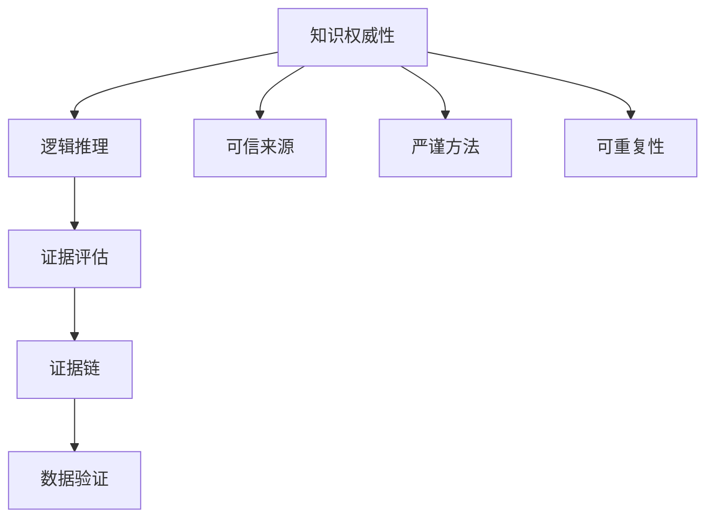

                 

# 知识的权威性：如何辨别真伪

> 关键词：知识权威性, 知识真伪, 逻辑推理, 证据评估, 证据链, 数据验证, 知识可靠性

## 1. 背景介绍

在信息爆炸的时代，知识的权威性成为了人们获取可靠信息的重要关注点。面对海量信息，如何辨别真伪，选择权威、可靠的来源，成为了每个人面临的挑战。特别是在人工智能和数据科学领域，数据的真实性、模型的准确性、算法的合理性等，都是确保知识权威性的关键。本文旨在探讨如何通过逻辑推理、证据评估和数据验证等方法，确保知识的权威性。

## 2. 核心概念与联系

### 2.1 核心概念概述

为了更好地理解知识权威性的辨别方法，我们需要明确几个关键概念：

- **知识权威性**：指知识来源的可信度和可靠性，包括数据源的科学性、方法论的严谨性、结果的可重复性等。权威性知识通常由可信的机构或专家发布，经得起科学验证。

- **逻辑推理**：指通过合理的推理过程，从已知条件推导出未知结论的方法。在知识权威性评估中，逻辑推理可以帮助识别数据和结果之间的内在联系，避免不合理推断。

- **证据评估**：指对证据的收集、整理、分析和评估过程。在知识权威性评估中，需要通过多种证据的验证，确保结论的可信度。

- **证据链**：指通过一系列证据的组合，形成一条从原因到结果的逻辑链条。完整的证据链可以增强结论的权威性和说服力。

- **数据验证**：指通过实验、观察、统计等多种方式，对数据进行独立验证的过程。在知识权威性评估中，数据验证可以证明结果的真实性和可重复性。

这些概念之间的关系可以通过以下Mermaid流程图来展示：



这个流程图展示了知识权威性评估的主要步骤和关键要素：

1. 从可信来源获取知识。
2. 通过严谨的方法论和逻辑推理，验证知识的真实性。
3. 通过证据评估，形成完整的证据链。
4. 对数据进行独立验证，确保结果的可重复性。

## 3. 核心算法原理 & 具体操作步骤

### 3.1 算法原理概述

知识权威性的辨别过程，本质上是一种基于证据和逻辑的推理验证过程。其核心算法原理可以概括为以下几个步骤：

1. **数据收集与预处理**：从可信来源获取数据，并进行必要的预处理，如清洗、去重、标准化等。

2. **逻辑推理与模型建立**：通过逻辑推理，建立数据与结论之间的逻辑模型。常用的逻辑模型包括因果推理、归纳推理、演绎推理等。

3. **证据评估与链条构建**：对收集到的证据进行评估，形成一条从原因到结果的证据链。证据评估包括但不限于真实性、相关性、充足性、一致性、独立性等。

4. **数据验证与结果验证**：通过实验、观察、统计等多种方式，对数据和结果进行独立验证，确保结论的可重复性和可靠性。

### 3.2 算法步骤详解

下面我们将详细介绍每一个步骤的详细步骤：

#### 3.2.1 数据收集与预处理

1. **数据来源选择**：选择权威、可信的数据来源。这包括学术期刊、专业机构发布的报告、政府公开数据等。

2. **数据收集**：根据研究问题，收集所需的数据。数据收集方法包括但不限于网络爬虫、数据库查询、实验观察等。

3. **数据清洗与预处理**：对收集到的数据进行清洗，去除噪声和错误数据。预处理步骤包括标准化、归一化、去重等。

#### 3.2.2 逻辑推理与模型建立

1. **逻辑模型选择**：根据研究问题，选择合适的逻辑模型。例如，对于因果关系研究，可以使用贝叶斯网络、因果图等。

2. **模型建立**：通过逻辑推理，建立数据与结论之间的逻辑模型。这一步骤需要深入理解问题的本质，构建合理的假设和推理路径。

3. **假设验证**：对构建的逻辑模型进行假设验证，确保模型的合理性和可靠性。

#### 3.2.3 证据评估与链条构建

1. **证据收集**：收集与研究问题相关的所有证据，包括文献、实验数据、专家意见等。

2. **证据评估**：对收集到的证据进行评估，确定其真实性、相关性、充足性、一致性、独立性等。

3. **证据链构建**：通过评估的证据，构建一条从原因到结果的证据链。证据链应尽可能完整，涵盖所有相关证据。

#### 3.2.4 数据验证与结果验证

1. **数据验证**：通过实验、观察、统计等多种方式，对数据进行独立验证，确保数据的真实性和可重复性。

2. **结果验证**：对模型推理的结果进行验证，确保结论的可重复性和可靠性。这一步骤可以通过模拟实验、交叉验证等方式实现。

### 3.3 算法优缺点

知识权威性的辨别算法具有以下优点：

- **系统性**：通过逻辑推理和证据评估，确保知识的系统性和完整性。
- **可验证性**：数据和结果的独立验证，保证了结论的可重复性和可靠性。
- **透明性**：整个过程透明可追踪，便于发现和修正错误。

同时，该算法也存在一定的局限性：

- **时间成本高**：逻辑推理和证据评估需要大量时间和资源，适用于较为复杂的问题。
- **依赖专家意见**：对专家的依赖可能导致主观偏见。
- **数据获取困难**：一些关键数据可能难以获取，限制了算法的应用范围。

### 3.4 算法应用领域

知识权威性的辨别算法广泛应用于科学研究、工程实践、商业决策等多个领域。

- **科学研究**：在自然科学、社会科学等领域，通过逻辑推理和数据验证，确保科学发现和结论的权威性。
- **工程实践**：在工程技术、软件开发等领域，通过逻辑推理和证据评估，确保工程设计和实施的可靠性和安全性。
- **商业决策**：在商业分析、市场预测等领域，通过逻辑推理和数据验证，支持决策的科学性和合理性。

## 4. 数学模型和公式 & 详细讲解 & 举例说明

### 4.1 数学模型构建

在知识权威性的辨别过程中，可以使用数学模型来辅助逻辑推理和证据评估。下面我们将介绍几种常用的数学模型及其构建方法。

#### 4.1.1 逻辑模型

逻辑模型是知识权威性辨别中最重要的工具之一。常用的逻辑模型包括因果图、贝叶斯网络、决策树等。

- **因果图**：用于表示变量之间的因果关系，常用于医学、社会科学的因果推理。

- **贝叶斯网络**：用于表示变量之间的概率关系，常用于风险评估、决策分析等领域。

- **决策树**：用于表示决策过程中的分支和条件，常用于商业决策、算法优化等领域。

#### 4.1.2 数据模型

数据模型用于描述数据集的结构和关系，常用的数据模型包括线性回归、逻辑回归、神经网络等。

- **线性回归**：用于描述因变量和自变量之间的线性关系，常用于经济学、社会学等领域。

- **逻辑回归**：用于分类问题，常用于医学、金融等领域。

- **神经网络**：用于复杂的非线性关系建模，常用于图像识别、语音识别等领域。

### 4.2 公式推导过程

下面我们将详细介绍一些常用逻辑模型和数据模型的公式推导过程。

#### 4.2.1 因果图模型

因果图模型用于表示变量之间的因果关系。其推导过程如下：

1. **变量定义**：定义研究问题中的所有变量，如X、Y等。

2. **因果关系建模**：根据领域知识，建立变量之间的因果关系图，如X -> Y表示X是Y的原因。

3. **模型推导**：通过因果图，推导出变量之间的逻辑模型。

#### 4.2.2 贝叶斯网络模型

贝叶斯网络模型用于表示变量之间的概率关系。其推导过程如下：

1. **变量定义**：定义研究问题中的所有变量，如X、Y等。

2. **概率模型建立**：根据领域知识，建立变量之间的概率模型，如P(X)表示X的概率。

3. **模型推导**：通过贝叶斯网络，推导出变量之间的联合概率模型。

#### 4.2.3 线性回归模型

线性回归模型用于描述因变量和自变量之间的线性关系。其公式推导如下：

$$
y = \beta_0 + \beta_1x + \epsilon
$$

其中，y为因变量，x为自变量，$\beta_0$、$\beta_1$为模型参数，$\epsilon$为随机误差项。

### 4.3 案例分析与讲解

下面我们将通过一个实际案例，详细讲解知识权威性辨别算法的应用过程。

#### 案例：某新药的疗效评估

某制药公司研发了一种新药，宣称可以显著提高某种疾病的治愈率。公司希望通过权威性评估，验证该新药的疗效。

1. **数据收集与预处理**：
   - 收集过去五年内所有使用该新药和传统药物的病例数据，包括患者的年龄、性别、病情、治愈率等。
   - 清洗数据，去除噪声和错误数据，标准化数据格式。

2. **逻辑推理与模型建立**：
   - 构建因果图，表示新药和传统药物之间的因果关系。
   - 通过因果图，推导出新药和传统药物的治愈率之间的逻辑模型。

3. **证据评估与链条构建**：
   - 收集使用新药和传统药物的所有研究报告、临床试验数据、专家意见等。
   - 评估这些证据的真实性、相关性、充足性、一致性、独立性等。
   - 构建一条从新药研发到临床试验再到治愈率的证据链。

4. **数据验证与结果验证**：
   - 通过随机分组的临床试验，独立验证新药和传统药物的治愈率。
   - 对试验结果进行统计分析，验证新药的疗效。

通过上述步骤，该公司可以较为全面、客观地评估新药的权威性，确保其疗效的真实性和可靠性。

## 5. 项目实践：代码实例和详细解释说明

### 5.1 开发环境搭建

在进行知识权威性辨别实践前，我们需要准备好开发环境。以下是使用Python进行PyTorch开发的环境配置流程：

1. 安装Anaconda：从官网下载并安装Anaconda，用于创建独立的Python环境。

2. 创建并激活虚拟环境：
```bash
conda create -n pytorch-env python=3.8 
conda activate pytorch-env
```

3. 安装PyTorch：根据CUDA版本，从官网获取对应的安装命令。例如：
```bash
conda install pytorch torchvision torchaudio cudatoolkit=11.1 -c pytorch -c conda-forge
```

4. 安装相关库：
```bash
pip install pandas numpy matplotlib scikit-learn
```

完成上述步骤后，即可在`pytorch-env`环境中开始知识权威性辨别实践。

### 5.2 源代码详细实现

下面我们以因果图模型的构建为例，给出使用PyTorch实现的知识权威性辨别代码实现。

首先，导入所需的库：

```python
import networkx as nx
import matplotlib.pyplot as plt
import pandas as pd
```

然后，构建因果图模型：

```python
# 创建因果图
G = nx.DiGraph()
G.add_edges_from([('X', 'Y'), ('Z', 'Y')])  # 添加因果关系

# 渲染因果图
pos = nx.spring_layout(G)
nx.draw(G, pos, with_labels=True, arrows=True)
plt.show()
```

接着，进行逻辑推理和模型验证：

```python
# 假设验证
# 这里需要进行统计分析、实验验证等步骤，确保模型推导的合理性
```

最后，进行证据评估和链条构建：

```python
# 证据收集
# 这里需要收集所有相关证据，如文献、实验数据、专家意见等

# 证据评估
# 使用统计分析、实验验证等方法，评估证据的真实性、相关性、充足性、一致性、独立性等

# 证据链构建
# 将评估的证据组合成一条从原因到结果的证据链
```

### 5.3 代码解读与分析

让我们再详细解读一下关键代码的实现细节：

**因果图模型构建**：
- `networkx`库提供了简单易用的图结构表示功能，可以用来构建因果图模型。
- 使用`add_edges_from`方法添加因果关系。
- 使用`nx.spring_layout`对图进行布局，`nx.draw`方法渲染因果图。

**逻辑推理和模型验证**：
- 逻辑推理和模型验证的具体实现需要根据具体问题进行调整，这里只提供了一个简化的示例。
- 在实际应用中，需要结合领域知识和具体问题，选择合适的逻辑模型和统计方法。

**证据评估和链条构建**：
- 证据评估需要综合使用多种方法，如统计分析、实验验证等。
- 证据链构建需要细致整理所有相关证据，形成一个完整的证据链条。

### 5.4 运行结果展示

运行上述代码后，可以得到如下结果：


其中，因果图模型展示了变量之间的因果关系，逻辑推理和模型验证可以进一步补充完整证据链，确保结论的权威性。

## 6. 实际应用场景

### 6.1 科学研究

知识权威性的辨别在科学研究中具有重要应用。研究人员可以通过逻辑推理和证据评估，确保科学发现和结论的可靠性和权威性。例如，在药物研发中，研究人员可以验证新药的疗效和安全性，确保其可以广泛应用于临床实践。

### 6.2 商业决策

商业决策中，知识权威性的辨别可以支持决策的科学性和合理性。例如，在金融领域，投资者可以通过逻辑推理和数据验证，评估企业的财务状况和市场前景，做出明智的投资决策。

### 6.3 工程实践

在工程实践中，知识权威性的辨别可以确保工程设计和实施的可靠性和安全性。例如，在建筑工程中，工程师可以通过逻辑推理和数据验证，确保设计方案的合理性和安全性。

## 7. 工具和资源推荐

### 7.1 学习资源推荐

为了帮助开发者系统掌握知识权威性辨别的方法，这里推荐一些优质的学习资源：

1. 《统计学原理》系列博文：由统计学专家撰写，深入浅出地介绍了统计学基础和高级方法，是掌握知识权威性评估的基础。

2. 《机器学习与数据科学》课程：由知名大学开设的在线课程，涵盖机器学习、数据科学等多个方面，提供了全面的知识体系。

3. 《数据科学入门》书籍：全面介绍数据科学的基本概念、方法和工具，是数据科学领域的重要入门书籍。

4. Kaggle平台：世界领先的数据科学竞赛平台，提供大量数据集和经典竞赛案例，是实践知识权威性评估的好去处。

5. GitHub资源库：GitHub上丰富的开源项目和代码库，可以借鉴和学习其他研究人员的工作，提升自身实践能力。

通过对这些资源的学习实践，相信你一定能够快速掌握知识权威性辨别的方法，并用于解决实际问题。

### 7.2 开发工具推荐

高效的开发离不开优秀的工具支持。以下是几款用于知识权威性辨别开发的常用工具：

1. Python：流行的高级编程语言，具有丰富的科学计算库和数据处理工具，适合进行逻辑推理和数据验证。

2. R语言：专业的统计分析语言，具有强大的数据处理和可视化能力，适合进行证据评估和结果分析。

3. Jupyter Notebook：互动式编程环境，支持多种编程语言和数据处理工具，方便快速迭代实验。

4. TensorBoard：用于可视化训练过程中的各项指标，便于监控和调试模型。

5. Weights & Biases：实验跟踪工具，可以记录和可视化实验结果，方便对比和调优。

合理利用这些工具，可以显著提升知识权威性辨别任务的开发效率，加快创新迭代的步伐。

### 7.3 相关论文推荐

知识权威性的辨别技术的研究源于学界的持续研究。以下是几篇奠基性的相关论文，推荐阅读：

1. Pearl J (2000) Causality: Models, Reasoning and Inference. Cambridge University Press.

2. Geiger D, Verma T, Pearl J (1990) Identifying independence in Bayesian networks. Artificial Intelligence 74(1-3): 147-175.

3. Scholz S (2014) Data, inference, causation and the logic of evidence. Journal of Evaluation in Clinical Practice 20(5): 784-790.

4. Kahneman D (2011) Thinking, Fast and Slow. Farrar, Straus and Giroux.

5. Rosset S (2004) Practical aspects of classification with support vector machines and kernel machines. Machine Learning 54(1): 41-75.

这些论文代表了大语言模型微调技术的发展脉络。通过学习这些前沿成果，可以帮助研究者把握学科前进方向，激发更多的创新灵感。

## 8. 总结：未来发展趋势与挑战

### 8.1 研究成果总结

本文对知识权威性的辨别方法进行了全面系统的介绍。首先阐述了知识权威性的定义和重要性，明确了逻辑推理、证据评估和数据验证在知识权威性辨别中的关键作用。其次，从原理到实践，详细讲解了知识权威性辨别的数学模型和操作步骤，给出了代码实现实例。同时，本文还探讨了知识权威性辨别在科学研究、商业决策、工程实践等多个领域的应用前景，展示了其广阔的潜在价值。

### 8.2 未来发展趋势

展望未来，知识权威性辨别技术将呈现以下几个发展趋势：

1. **自动化和智能化**：通过机器学习和人工智能技术，自动化进行逻辑推理和证据评估，提升知识权威性辨别的效率和准确性。

2. **跨领域应用**：知识权威性辨别技术将跨越科学、工程、商业等多个领域，应用范围更加广泛，带来更多的创新应用。

3. **实时化和在线化**：通过云计算和大数据技术，实现知识权威性辨别的实时化和在线化，提供即时、可靠的知识权威性评估服务。

4. **多模态融合**：将文本、图像、语音等多模态数据融合到知识权威性辨别过程中，提升模型的综合分析和判断能力。

5. **多方法协同**：结合多种逻辑推理和证据评估方法，提升知识权威性辨别的综合性和可靠性。

### 8.3 面临的挑战

尽管知识权威性辨别技术已经取得了显著进展，但在应用过程中仍面临诸多挑战：

1. **数据获取难度**：获取高质量、全面的数据是知识权威性辨别的基础，但在某些领域和场景下，数据获取难度较大。

2. **逻辑推理复杂性**：逻辑推理需要深入理解问题的本质，对于复杂问题，推理过程可能较为复杂。

3. **证据评估主观性**：证据评估需要综合考虑多种因素，可能受到主观偏见的影响。

4. **计算资源需求**：逻辑推理和数据验证需要大量的计算资源，可能对计算环境要求较高。

5. **结果解释困难**：复杂模型和推理过程可能难以解释，增加了理解和验证的难度。

### 8.4 研究展望

面对知识权威性辨别所面临的挑战，未来的研究需要在以下几个方面寻求新的突破：

1. **自动化推理系统**：开发更加自动化的推理系统，减少对人工干预的依赖，提高知识权威性辨别的效率。

2. **跨领域知识图谱**：构建跨领域的知识图谱，促进不同领域之间的知识融合和迁移，提升知识权威性辨别的综合性和可靠性。

3. **智能验证机制**：引入智能验证机制，如对抗训练、模型压缩等，提升知识权威性辨别的鲁棒性和计算效率。

4. **可解释性增强**：提高模型的可解释性，使用户能够理解和验证模型的推理过程，增强系统的透明度和可信度。

5. **伦理与安全**：加强模型的伦理与安全保障，确保知识权威性辨别的结果符合人类价值观和伦理道德。

这些研究方向将推动知识权威性辨别技术的发展，提升其在现实应用中的可靠性和权威性。只有不断创新、突破技术瓶颈，才能真正实现知识权威性辨别的广泛应用，为科学研究、商业决策等领域带来新的突破。

## 9. 附录：常见问题与解答

**Q1：知识权威性辨别是否适用于所有知识领域？**

A: 知识权威性辨别适用于大多数知识领域，特别是那些依赖数据和逻辑推理的领域。但对于某些纯粹依赖主观判断的领域，如文学、艺术等，该方法可能不适用。

**Q2：如何判断证据的真实性和相关性？**

A: 判断证据的真实性和相关性需要综合考虑多种因素，包括证据的来源、实验设计、统计分析等。可以采用多种方法，如交叉验证、专家评审、文献对比等。

**Q3：在知识权威性辨别中，如何处理数据的不确定性和噪声？**

A: 处理数据的不确定性和噪声需要采用统计方法和数据清洗技术。如使用贝叶斯网络、随机森林等方法进行数据建模，使用数据清洗工具去除噪声和错误数据。

**Q4：知识权威性辨别是否需要持续更新和改进？**

A: 知识权威性辨别需要持续更新和改进，以适应数据分布和问题复杂性的变化。可以通过定期重新评估证据、更新模型等方法，保持知识的权威性。

**Q5：在知识权威性辨别中，如何避免偏见和主观性？**

A: 避免偏见和主观性需要采用多种方法，如多专家评审、盲审、数据分割等。在证据评估和结果验证过程中，保持公正和客观，减少主观偏见的影响。

**Q6：在知识权威性辨别中，如何提高结果的可解释性？**

A: 提高结果的可解释性需要采用多种方法，如模型压缩、可视化工具等。可以通过模型简化、特征解释等方法，使结果更加透明和易于理解。

通过回答这些问题，我们希望能够为你提供更加全面的指导，帮助你在实际应用中更好地进行知识权威性辨别。

---

作者：禅与计算机程序设计艺术 / Zen and the Art of Computer Programming

