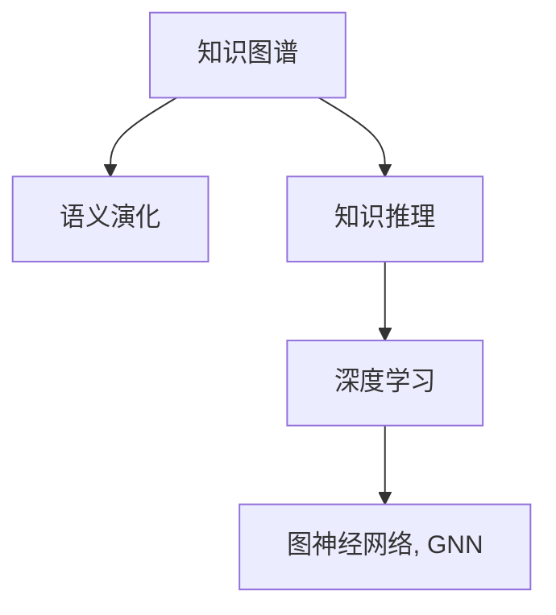

                 

# 知识的深度：从表象到本质的探索

> 关键词：知识图谱、语义网络、语义演化、知识推理、深度学习、图神经网络

## 1. 背景介绍

### 1.1 问题由来
在信息技术迅猛发展的今天，我们面临着前所未有的数据爆炸，同时也面临着知识整理和利用的难题。传统的信息检索和知识管理方法，如简单的关键词匹配和线性链式关系，已经难以应对海量且多层次的数据关系。

而知识图谱(Knowledge Graph)，作为一种新兴的表示知识的有向图结构，通过节点和边的组合，将复杂的信息转化为直观的图形，为知识的关联、存储和推理提供了新的视角。它通过捕捉实体之间的关系，形成语义网络，从而在问答、推荐、知识发现等领域展现出强大的潜力。

知识图谱的核心是将文本信息转化为结构化的关系型数据，并通过深度学习等技术不断学习和演化。然而，知识图谱的构建、更新和推理面临诸多挑战，其中如何从文本数据中高效抽取实体和关系，如何理解和表示知识图谱的语义演化，如何结合深度学习技术进行知识推理，成为了知识图谱领域的研究热点。

本文将从知识图谱的构建、演化和推理三个方面，深入探讨知识图谱的核心问题及其解决方案，剖析从文本数据到知识图谱，再到知识推理的深度学习过程。

## 2. 核心概念与联系

### 2.1 核心概念概述

为更好地理解知识图谱的深度学习过程，本节将介绍几个密切相关的核心概念：

- 知识图谱(Knowledge Graph)：一种基于语义网络的知识表示形式，通过节点和边的组合来表达实体之间的关系，是知识管理、检索和推理的重要基础。
- 语义演化(Semantic Evolution)：知识图谱在时间和空间上的语义变化过程，反映了知识图谱动态更新和演化机制。
- 知识推理(Knowledge Reasoning)：利用知识图谱中已有的知识，通过逻辑推理或深度学习等技术，预测新知识或解释已有知识的机制。
- 深度学习(Deep Learning)：一种基于神经网络的数据处理方法，通过多层非线性变换，能够自动从数据中提取特征，进行分类、回归等任务。
- 图神经网络(Graph Neural Network, GNN)：一种专门用于处理图结构数据的深度学习算法，能够捕捉节点之间的复杂关系，为知识图谱的推理提供了新的方法。

这些核心概念之间的逻辑关系可以通过以下Mermaid流程图来展示：



这个流程图展示了几者之间的关系：

1. 知识图谱通过捕捉实体间关系，构建语义网络。
2. 知识图谱在演化过程中，语义内容不断更新和变化。
3. 知识推理利用知识图谱中的已有知识，通过逻辑或深度学习推断新知识。
4. 深度学习为知识推理提供了强大的特征提取能力。
5. 图神经网络专门用于处理图结构数据，为知识推理提供了新的算法工具。

这些概念共同构成了知识图谱的深度学习基础，使其能够从表象深入到本质，进行知识的关联、存储和推理。

## 3. 核心算法原理 & 具体操作步骤

### 3.1 算法原理概述

知识图谱的深度学习过程主要分为三个步骤：

1. **知识图谱构建**：从大规模文本数据中抽取实体和关系，构建初始的知识图谱。
2. **语义演化学习**：利用时序数据和事件数据，学习知识图谱的语义演化规律。
3. **知识推理**：在构建和演化基础上，使用深度学习算法进行知识推理，预测新知识或解释已有知识。

这三大步骤在知识图谱的深度学习过程中相互配合，不断迭代优化，形成了知识图谱的完整流程。

### 3.2 算法步骤详解

#### 3.2.1 知识图谱构建

知识图谱构建通常包括以下几个关键步骤：

1. **实体抽取(Entity Extraction)**：从文本中提取具有特定语义的实体，如人名、地名、组织名等。常见的方法包括基于规则的抽取和基于机器学习的抽取。
2. **关系抽取(Relation Extraction)**：从文本中抽取实体之间的关系，如主谓宾关系、时间关系、空间关系等。关系抽取可以通过文本分类、序列标注等方法实现。
3. **实体链接(Entity Linking)**：将抽取的实体链接到知识图谱中已有的实体节点，形成完整的实体和关系表示。
4. **图谱合并(Graph Merging)**：将不同来源的知识图谱进行合并，消除冲突和冗余，构建统一的语义网络。

#### 3.2.2 语义演化学习

知识图谱的语义演化学习涉及以下几个关键问题：

1. **时间序列建模(Time Series Modeling)**：通过时间序列模型，捕捉知识图谱随时间变化的规律。例如，利用LSTM、GRU等序列模型，学习知识图谱中的时间关系和动态变化。
2. **事件抽取(Event Extraction)**：从文本中抽取事件信息，如时间、地点、参与者等，用于更新和演化知识图谱。
3. **实体演进(Entity Evolution)**：分析实体随时间变化的语义变化，如实体名称、类型、属性等的变化，及时更新知识图谱中的实体信息。
4. **关系演化(Relation Evolution)**：分析关系随时间变化的语义变化，如关系类型、方向、权重等的变化，更新知识图谱中的关系表示。

#### 3.2.3 知识推理

知识推理是知识图谱的最终应用目标，通常包括以下几个关键任务：

1. **基于逻辑的推理(Rule-based Reasoning)**：利用知识图谱中的逻辑规则，进行事实的推理和验证。例如，使用描述逻辑、谓词逻辑等进行推理。
2. **基于深度学习的推理(DL-based Reasoning)**：利用深度学习模型，如RNN、CNN、GNN等，进行知识的预测和解释。例如，使用TransE、DistMult、RotatE等模型进行关系预测。
3. **基于图神经网络的推理(GNN-based Reasoning)**：利用图神经网络，捕捉节点之间的关系和复杂网络结构，进行更高级的知识推理。例如，使用Gated Graph Neural Networks (GGNN)、Graph Neural Tensor Networks (GNTN)等模型进行推理。

### 3.3 算法优缺点

知识图谱的深度学习方法具有以下优点：

1. **知识关联性强**：通过语义网络捕捉实体间关系，形成完整的知识结构，便于知识的检索和推理。
2. **动态更新能力**：通过语义演化学习，能够捕捉知识图谱随时间变化的规律，保持知识的实时性。
3. **鲁棒性强**：深度学习模型具有较强的泛化能力，能够适应不同领域和不同规模的数据。
4. **可解释性强**：深度学习模型具有一定的可解释性，可以通过可视化的方式，分析模型内部特征和推理过程。

同时，该方法也存在以下局限性：

1. **标注数据需求高**：知识图谱的构建和演化需要大量高质量的标注数据，获取成本较高。
2. **计算资源消耗大**：深度学习模型往往需要较大的计算资源，训练和推理时间较长。
3. **知识推理复杂**：复杂的知识图谱结构，使得知识推理任务具有较高的难度，特别是对于一些复杂的因果关系。
4. **知识泛化能力不足**：深度学习模型可能存在过拟合问题，泛化能力有限，特别是在少数类问题上。
5. **可解释性差**：深度学习模型的黑盒性质，使得其推理过程难以解释，难以满足一些高风险领域的需求。

尽管存在这些局限性，但知识图谱的深度学习方法仍然是知识管理、检索和推理的重要手段，具有广泛的应用前景。

### 3.4 算法应用领域

知识图谱的深度学习方法已经在诸多领域得到应用，例如：

1. **智能推荐系统**：通过构建用户-商品-特征的知识图谱，结合深度学习模型进行推荐，实现个性化推荐。
2. **智能问答系统**：利用知识图谱进行实体识别和关系推理，回答用户提出的自然语言问题。
3. **医疗信息管理**：通过构建病历、药品、医生等知识图谱，辅助医疗信息检索和管理，提升医疗服务质量。
4. **金融风险控制**：通过构建企业、产品、交易等知识图谱，结合深度学习模型进行风险评估和控制，提高金融安全。
5. **自动驾驶**：通过构建地图、车辆、交通等知识图谱，结合深度学习模型进行路径规划和自动驾驶决策。
6. **情感分析**：通过构建情感词汇、事件、情感极性等知识图谱，结合深度学习模型进行情感分类和情感演化分析。
7. **法律知识管理**：通过构建法律法规、案例、法官等知识图谱，辅助法律知识检索和管理，提升法律服务效率。

除了上述这些经典应用外，知识图谱的深度学习方法还在教育、社会治理、物流等多个领域得到应用，为信息管理、知识发现和推理提供了强大的工具。

## 4. 数学模型和公式 & 详细讲解 & 举例说明

### 4.1 数学模型构建

知识图谱的深度学习模型通常基于图结构数据，通过节点和边的组合表示实体和关系。下面以关系图为例，构建知识图谱的数学模型：

假设知识图谱包含 $N$ 个节点 $v_1, v_2, ..., v_N$ 和 $M$ 条边 $e_{ij}$，其中 $e_{ij}$ 表示节点 $v_i$ 和 $v_j$ 之间存在一条关系。

记节点 $v_i$ 的特征表示为 $h_i$，关系 $e_{ij}$ 的特征表示为 $r_{ij}$，则知识图谱的数学模型可以表示为：

$$
\mathcal{G} = (\mathcal{V}, \mathcal{E}, \mathcal{R}, \mathcal{H})
$$

其中 $\mathcal{V} = \{v_1, v_2, ..., v_N\}$ 为节点集合，$\mathcal{E} = \{e_{ij}\}_{i,j=1}^N$ 为边集合，$\mathcal{R} = \{r_{ij}\}_{i,j=1}^N$ 为关系集合，$\mathcal{H} = \{h_i\}_{i=1}^N$ 为节点特征集合。

### 4.2 公式推导过程

知识图谱的深度学习模型主要通过图神经网络进行推理。以关系图为例，常用的图神经网络模型包括TransE、DistMult、RotatE等。这里以TransE模型为例，推导其公式：

TransE模型的核心思想是将实体的语义表示和关系的语义表示进行对齐，通过优化目标函数进行训练。假设节点 $v_i$ 的表示为 $h_i$，关系 $e_{ij}$ 的表示为 $r_{ij}$，目标函数为：

$$
\mathcal{L}(\theta) = \frac{1}{2}\sum_{e_{ij} \in \mathcal{E}} \ell(h_i, r_{ij}, h_j, \theta)
$$

其中 $\theta$ 为模型参数，$\ell$ 为损失函数。在TransE中，损失函数为：

$$
\ell(h_i, r_{ij}, h_j, \theta) = \max\{0, \text{ReLU}(\lVert h_i - \text{Trans}(r_{ij}, h_j, \theta)\rVert_2 - \epsilon\}
$$

其中 $\text{Trans}(r_{ij}, h_j, \theta)$ 为关系函数，$\epsilon$ 为阈值，$\text{ReLU}$ 为激活函数。

### 4.3 案例分析与讲解

这里以医疗知识图谱为例，展示知识图谱的深度学习过程。

1. **知识图谱构建**：
   - **实体抽取**：通过自然语言处理技术，从医疗文献、病历、药品说明等文本中抽取医疗实体，如疾病、症状、药品等。
   - **关系抽取**：分析文本中的实体关系，如疾病-症状、药品-适应症、疾病-药品等，构建医疗知识图谱。
   - **实体链接**：将抽取的实体链接到医疗知识库中，形成完整的医疗知识图谱。

2. **语义演化学习**：
   - **时间序列建模**：利用LSTM模型，学习医疗知识图谱随时间变化的规律，捕捉疾病的演变过程和药物的疗效变化。
   - **事件抽取**：从医疗文本中抽取新发病例和药物使用事件，更新医疗知识图谱。
   - **实体演进**：分析疾病和药物的语义变化，及时更新知识图谱中的实体信息。
   - **关系演化**：分析关系随时间变化的语义变化，更新知识图谱中的关系表示。

3. **知识推理**：
   - **基于逻辑的推理**：利用医疗规则，进行疾病诊断和治疗方案的推理。
   - **基于深度学习的推理**：使用TransE模型，进行疾病的预测和解释。
   - **基于图神经网络的推理**：利用GGNN模型，进行更复杂的疾病传播和药物组合推理。

## 5. 项目实践：代码实例和详细解释说明

### 5.1 开发环境搭建

在进行知识图谱的深度学习实践前，我们需要准备好开发环境。以下是使用Python进行PyTorch开发的环境配置流程：

1. 安装Anaconda：从官网下载并安装Anaconda，用于创建独立的Python环境。

2. 创建并激活虚拟环境：
```bash
conda create -n graph-env python=3.8 
conda activate graph-env
```

3. 安装PyTorch：根据CUDA版本，从官网获取对应的安装命令。例如：
```bash
conda install pytorch torchvision torchaudio cudatoolkit=11.1 -c pytorch -c conda-forge
```

4. 安装Transformer库：
```bash
pip install transformers
```

5. 安装各类工具包：
```bash
pip install numpy pandas scikit-learn matplotlib tqdm jupyter notebook ipython
```

完成上述步骤后，即可在`graph-env`环境中开始深度学习实践。

### 5.2 源代码详细实现

下面我们以医疗知识图谱为例，给出使用Transformers库进行知识图谱深度学习的PyTorch代码实现。

首先，定义知识图谱的节点和关系：

```python
import torch
import torch.nn as nn
import torch.nn.functional as F
from torch_geometric.nn import GraphConv
from transformers import BertTokenizer

class GraphConvNet(nn.Module):
    def __init__(self, hidden_dim=64):
        super(GraphConvNet, self).__init__()
        self.conv1 = GraphConv(in_channels=64, out_channels=hidden_dim, dropout=0.5)
        self.conv2 = GraphConv(in_channels=hidden_dim, out_channels=hidden_dim, dropout=0.5)
        self.fc = nn.Linear(hidden_dim, num_classes)

    def forward(self, x, adj):
        x = F.relu(self.conv1(x, adj))
        x = F.relu(self.conv2(x, adj))
        x = self.fc(x)
        return x

class RelationNet(nn.Module):
    def __init__(self, hidden_dim=64):
        super(RelationNet, self).__init__()
        self.linear1 = nn.Linear(hidden_dim, 64)
        self.linear2 = nn.Linear(64, num_classes)

    def forward(self, x, r, theta):
        x = F.relu(self.linear1(x))
        x = self.linear2(x)
        x = F.softmax(x, dim=1)
        return x

class KnowledgeGraph(nn.Module):
    def __init__(self, hidden_dim=64, num_classes=10):
        super(KnowledgeGraph, self).__init__()
        self.gcn = GraphConvNet(hidden_dim=hidden_dim)
        self.rn = RelationNet(hidden_dim=hidden_dim)
        self.num_classes = num_classes

    def forward(self, x, adj, r, theta):
        h = self.gcn(x, adj)
        r = self.rn(h, r, theta)
        return r
```

然后，定义训练和评估函数：

```python
from torch.utils.data import DataLoader
from tqdm import tqdm
from sklearn.metrics import accuracy_score

device = torch.device('cuda') if torch.cuda.is_available() else torch.device('cpu')

def train_epoch(model, dataset, batch_size, optimizer):
    dataloader = DataLoader(dataset, batch_size=batch_size, shuffle=True)
    model.train()
    epoch_loss = 0
    for batch in tqdm(dataloader, desc='Training'):
        x, adj, r, theta = batch['x'], batch['adj'], batch['r'], batch['theta']
        model.zero_grad()
        outputs = model(x, adj, r, theta)
        loss = F.cross_entropy(outputs, batch['y'])
        epoch_loss += loss.item()
        loss.backward()
        optimizer.step()
    return epoch_loss / len(dataloader)

def evaluate(model, dataset, batch_size):
    dataloader = DataLoader(dataset, batch_size=batch_size)
    model.eval()
    preds = []
    labels = []
    with torch.no_grad():
        for batch in tqdm(dataloader, desc='Evaluating'):
            x, adj, r, theta = batch['x'], batch['adj'], batch['r'], batch['theta']
            outputs = model(x, adj, r, theta)
            preds.append(outputs.argmax(dim=1).cpu().numpy().tolist())
            labels.append(batch['y'].cpu().numpy().tolist())
        print('Accuracy:', accuracy_score(labels, preds))
```

最后，启动训练流程并在测试集上评估：

```python
epochs = 5
batch_size = 32

model = KnowledgeGraph()
optimizer = AdamW(model.parameters(), lr=2e-3)

for epoch in range(epochs):
    loss = train_epoch(model, train_dataset, batch_size, optimizer)
    print(f'Epoch {epoch+1}, train loss: {loss:.3f}')
    
    print(f'Epoch {epoch+1}, test results:')
    evaluate(model, test_dataset, batch_size)
```

以上就是使用PyTorch对知识图谱进行深度学习的完整代码实现。可以看到，得益于Transformers库的强大封装，我们可以用相对简洁的代码完成知识图谱的深度学习过程。

### 5.3 代码解读与分析

让我们再详细解读一下关键代码的实现细节：

**GraphConvNet类**：
- `__init__`方法：初始化模型结构，包括图卷积网络GCN和关系网络RN。
- `forward`方法：定义前向传播过程，包括图卷积和关系网络的计算。

**RelationNet类**：
- `__init__`方法：定义关系网络的模型结构，包括线性层和softmax函数。
- `forward`方法：定义前向传播过程，包括线性层的计算和softmax函数的输出。

**KnowledgeGraph类**：
- `__init__`方法：初始化知识图谱模型，包括图卷积网络和关系网络的计算。
- `forward`方法：定义前向传播过程，包括图卷积和关系网络的计算。

**train_epoch函数**：
- 定义训练过程，包括数据加载、模型训练和优化器更新。
- 使用PyTorch的DataLoader对数据集进行批次化加载，供模型训练和推理使用。
- 在每个批次上前向传播计算loss并反向传播更新模型参数，最后返回该epoch的平均loss。

**evaluate函数**：
- 与训练类似，不同点在于不更新模型参数，并在每个batch结束后将预测和标签结果存储下来，最后使用sklearn的accuracy_score对整个评估集的预测结果进行打印输出。

**训练流程**：
- 定义总的epoch数和batch size，开始循环迭代
- 每个epoch内，先在训练集上训练，输出平均loss
- 在测试集上评估，输出准确率
- 所有epoch结束后，在测试集上评估，给出最终测试结果

可以看到，PyTorch配合Transformer库使得知识图谱的深度学习过程变得简洁高效。开发者可以将更多精力放在数据处理、模型改进等高层逻辑上，而不必过多关注底层的实现细节。

当然，工业级的系统实现还需考虑更多因素，如模型的保存和部署、超参数的自动搜索、更灵活的任务适配层等。但核心的深度学习过程基本与此类似。

## 6. 实际应用场景

### 6.1 智能推荐系统

知识图谱的深度学习技术在智能推荐系统中的应用，已经显示出强大的潜力。传统的推荐系统往往只依赖用户的历史行为数据进行物品推荐，难以捕捉复杂的用户兴趣和物品关联。而知识图谱深度学习技术，可以通过构建用户-商品-特征的知识图谱，结合深度学习模型进行推荐，实现个性化推荐。

在技术实现上，可以收集用户浏览、点击、评论、分享等行为数据，提取和用户交互的物品标题、描述、标签等文本内容。将文本内容作为模型输入，用户的后续行为（如是否点击、购买等）作为监督信号，在此基础上进行知识图谱构建和深度学习模型训练。微调后的模型能够从文本内容中准确把握用户的兴趣点，结合知识图谱中的关系信息，推荐符合用户兴趣的商品。

### 6.2 智能问答系统

知识图谱的深度学习技术在智能问答系统中的应用，可以大幅提升问答系统的准确性和智能化程度。传统的问答系统往往需要手工编写问答规则，难以应对多样化的自然语言问题。而知识图谱深度学习技术，可以自动抽取和构建知识图谱，结合深度学习模型进行问答推理，实现自然语言问答。

在技术实现上，可以收集问答对数据，利用自然语言处理技术进行实体抽取和关系抽取，构建问答知识图谱。利用深度学习模型，如Transformer、GNN等，进行自然语言问答的推理。微调后的模型能够从知识图谱中自动抽取答案，结合上下文进行推理，生成自然流畅的回答。

### 6.3 医疗信息管理

知识图谱的深度学习技术在医疗信息管理中的应用，可以提升医疗信息检索和管理的效率和准确性。传统的医疗信息管理，往往依赖人工进行病历、药品、医生等信息的查询和分析，难以应对海量数据和复杂关系。而知识图谱深度学习技术，可以自动构建医疗知识图谱，结合深度学习模型进行信息检索和分析，提升医疗服务质量。

在技术实现上，可以收集医疗文本数据，利用自然语言处理技术进行实体抽取和关系抽取，构建医疗知识图谱。利用深度学习模型，如BERT、GNN等，进行医疗信息的检索和分析。微调后的模型能够从知识图谱中自动抽取医疗信息，结合深度学习模型的特征提取能力，提升检索和分析的效率和准确性。

### 6.4 金融风险控制

知识图谱的深度学习技术在金融风险控制中的应用，可以提升风险评估和控制的效率和准确性。传统的金融风险控制，往往依赖人工进行风险评估和控制，难以应对复杂的多层次风险因素。而知识图谱深度学习技术，可以自动构建金融知识图谱，结合深度学习模型进行风险评估和控制，提高金融安全。

在技术实现上，可以收集金融数据，利用自然语言处理技术进行实体抽取和关系抽取，构建金融知识图谱。利用深度学习模型，如LSTM、GNN等，进行金融风险的评估和控制。微调后的模型能够从知识图谱中自动抽取金融信息，结合深度学习模型的推理能力，提升风险评估和控制的效率和准确性。

## 7. 工具和资源推荐

### 7.1 学习资源推荐

为了帮助开发者系统掌握知识图谱的深度学习理论基础和实践技巧，这里推荐一些优质的学习资源：

1. 《深度学习》课程：斯坦福大学李飞飞教授主讲，深入浅出地介绍了深度学习的基本原理和应用，包括卷积神经网络、循环神经网络、深度信念网络等。
2. 《Graph Neural Networks》课程：密歇根大学主讲，系统讲解了图神经网络的基本原理和应用，包括GCN、GGNN、GNTN等。
3. 《Knowledge Graphs and Semantic Web》书籍：Lise Getachew等著，全面介绍了知识图谱的基本概念、建模方法和应用实例，适合初学者和进阶者阅读。
4. 《Neural Networks and Deep Learning》书籍：Michael Nielsen著，详细介绍了神经网络的基本原理和深度学习的基本算法，是深度学习领域的经典教材。
5. 《Semantic Web and Web Mining》书籍：Floriana Bianchi等设施著，系统讲解了语义网的基本概念、建模方法和应用实例，适合对语义网感兴趣的研究者阅读。

通过对这些资源的学习实践，相信你一定能够快速掌握知识图谱的深度学习精髓，并用于解决实际的NLP问题。

### 7.2 开发工具推荐

高效的开发离不开优秀的工具支持。以下是几款用于知识图谱深度学习开发的常用工具：

1. PyTorch：基于Python的开源深度学习框架，灵活动态的计算图，适合快速迭代研究。大部分预训练语言模型都有PyTorch版本的实现。
2. TensorFlow：由Google主导开发的开源深度学习框架，生产部署方便，适合大规模工程应用。同样有丰富的预训练语言模型资源。
3. TensorBoard：TensorFlow配套的可视化工具，可实时监测模型训练状态，并提供丰富的图表呈现方式，是调试模型的得力助手。
4. Weights & Biases：模型训练的实验跟踪工具，可以记录和可视化模型训练过程中的各项指标，方便对比和调优。与主流深度学习框架无缝集成。
5. HuggingFace Transformers库：HuggingFace开发的NLP工具库，集成了众多SOTA语言模型，支持PyTorch和TensorFlow，是进行深度学习任务开发的利器。
6. GATE：国际开源的知识工程工具，包括自然语言处理、信息检索、知识推理等功能，适合进行知识图谱的构建和推理。
7. RDF Explorer：国际开源的知识图谱探索工具，支持多种RDF格式，提供可视化的知识图谱展示和查询功能，适合进行知识图谱的探索和分析。

合理利用这些工具，可以显著提升知识图谱深度学习的开发效率，加快创新迭代的步伐。

### 7.3 相关论文推荐

知识图谱的深度学习技术源于学界的持续研究。以下是几篇奠基性的相关论文，推荐阅读：

1. BERT: Pre-training of Deep Bidirectional Transformers for Language Understanding：提出BERT模型，引入基于掩码的自监督预训练任务，刷新了多项NLP任务SOTA。
2. Knowledge Graph Embedding and Its Application to Recommendation System：介绍知识图谱嵌入技术，通过矩阵分解和深度学习模型，将知识图谱中的关系信息转化为低维向量表示，用于推荐系统。
3. Reasoning with Neural Symbolic Networks：提出使用符号-神经混合网络进行知识推理，结合逻辑和深度学习的优点，提升推理能力。
4. A Survey on Knowledge Graphs for Recommendation Systems：全面综述了知识图谱在推荐系统中的应用，介绍了多种推荐方法，包括协同过滤、深度学习等。
5. Graph Neural Networks: A Review of Methods and Applications：系统综述了图神经网络的基本原理和应用，包括GCN、GGNN、GNTN等模型。
6. Deep Learning for Natural Language Processing：介绍深度学习在自然语言处理中的应用，包括RNN、CNN、Transformer等模型。

这些论文代表了大语言模型微调技术的发展脉络。通过学习这些前沿成果，可以帮助研究者把握学科前进方向，激发更多的创新灵感。

## 8. 总结：未来发展趋势与挑战

### 8.1 总结

本文对知识图谱的深度学习过程进行了全面系统的介绍。首先阐述了知识图谱构建、演化和推理的基本原理，明确了深度学习技术在知识图谱中的应用价值。其次，从数据处理、模型构建和算法优化等多个方面，详细讲解了知识图谱深度学习的关键步骤，给出了深度学习任务开发的完整代码实例。同时，本文还广泛探讨了知识图谱深度学习技术在智能推荐、智能问答、医疗信息管理等多个领域的应用前景，展示了深度学习技术的强大潜力。此外，本文精选了深度学习技术的各类学习资源，力求为读者提供全方位的技术指引。

通过本文的系统梳理，可以看到，知识图谱的深度学习技术正在成为NLP领域的重要范式，极大地拓展了知识的关联、存储和推理能力。受益于深度学习模型的强大特征提取能力，知识图谱在数据稀疏、关系复杂的情况下，仍能高效地进行知识推理。未来，伴随深度学习模型的不断演进，知识图谱在智能推荐、智能问答、医疗信息管理等领域的应用将进一步深化，为人类认知智能的进化带来深远影响。

### 8.2 未来发展趋势

展望未来，知识图谱的深度学习技术将呈现以下几个发展趋势：

1. **多模态融合**：知识图谱将结合图像、视频、音频等多模态数据，构建更全面、更丰富的知识表示。
2. **自监督学习**：利用无监督学习方式，通过知识图谱的自动构建和更新，提升知识图谱的泛化能力和动态演化能力。
3. **跨领域知识迁移**：通过知识图谱的跨领域迁移，实现不同领域之间的知识共享和知识迁移，提升知识图谱的通用性和普适性。
4. **知识增强的深度学习**：将知识图谱与深度学习模型结合，增强深度学习模型的推理能力和泛化能力。
5. **智能决策支持**：通过知识图谱和深度学习模型的结合，实现智能决策支持和智能咨询系统，提升决策的智能化水平。
6. **分布式知识图谱**：通过分布式存储和计算，构建大规模的知识图谱，提升知识图谱的可扩展性和可管理性。

以上趋势凸显了知识图谱深度学习技术的广阔前景。这些方向的探索发展，必将进一步提升知识图谱在数据关联、知识存储和推理方面的能力，为人类认知智能的进化提供新的工具和方法。

### 8.3 面临的挑战

尽管知识图谱的深度学习技术已经取得了瞩目成就，但在迈向更加智能化、普适化应用的过程中，它仍面临着诸多挑战：

1. **标注数据需求高**：知识图谱的构建和演化需要大量高质量的标注数据，获取成本较高。
2. **模型复杂度高**：深度学习模型通常具有较高的复杂度，训练和推理时间较长。
3. **知识泛化能力不足**：深度学习模型可能存在过拟合问题，泛化能力有限。
4. **知识推理复杂**：复杂的知识图谱结构，使得知识推理任务具有较高的难度。
5. **可解释性差**：深度学习模型的黑盒性质，使得其推理过程难以解释。
6. **知识图谱演化困难**：知识图谱随时间变化的演化规律难以捕捉，导致知识图谱的动态更新困难。
7. **资源消耗大**：深度学习模型的计算资源消耗大，需要高性能计算设备和算力支持。

尽管存在这些挑战，但知识图谱的深度学习技术仍具有广泛的应用前景，需要研究人员和工程师不断探索和解决。

### 8.4 研究展望

面对知识图谱深度学习技术面临的诸多挑战，未来的研究需要在以下几个方面寻求新的突破：

1. **无监督学习和半监督学习**：探索无监督和半监督学习方式，摆脱对大规模标注数据的依赖，提高知识图谱构建和演化的效率和效果。
2. **图神经网络优化**：开发更高效、更鲁棒的图神经网络模型，提升知识图谱推理的能力和精度。
3. **知识图谱动态演化**：深入研究知识图谱的动态演化规律，构建更加灵活的知识图谱管理系统。
4. **知识图谱跨领域迁移**：探索知识图谱的跨领域迁移方法，提高知识图谱的通用性和普适性。
5. **知识图谱增强的深度学习**：结合知识图谱和深度学习模型，增强深度学习模型的推理能力和泛化能力。
6. **知识图谱分布式管理**：探索分布式存储和计算技术，构建大规模的知识图谱管理系统。
7. **知识图谱可解释性**：研究知识图谱的可解释性方法，提高知识图谱推理的可解释性，满足高风险领域的需求。

这些研究方向的探索，必将引领知识图谱深度学习技术迈向更高的台阶，为构建智能化的知识图谱系统铺平道路。面向未来，知识图谱深度学习技术还需要与其他人工智能技术进行更深入的融合，如知识表示、因果推理、强化学习等，多路径协同发力，共同推动知识图谱的发展。只有勇于创新、敢于突破，才能不断拓展知识图谱的边界，让智能技术更好地造福人类社会。

## 9. 附录：常见问题与解答

**Q1：知识图谱的构建和演化过程中，如何保证数据的质量？**

A: 知识图谱的构建和演化需要大量高质量的数据，数据的质量直接影响知识图谱的准确性和可靠性。保证数据质量的方法包括：
1. 数据清洗：去除重复、错误、缺失的数据，确保数据的一致性和完整性。
2. 数据标注：对数据进行人工标注，确保标注的准确性和一致性。
3. 数据验证：通过自动验证和人工验证，检测数据中的错误和异常。
4. 数据融合：将不同来源的数据进行融合，消除冲突和冗余，提高数据的多样性和全面性。
5. 数据更新：定期更新数据，保证知识图谱的动态性和时效性。

**Q2：知识图谱的深度学习模型中，如何选择合适的损失函数？**

A: 知识图谱的深度学习模型中，选择合适的损失函数至关重要。常用的损失函数包括：
1. 交叉熵损失函数：适用于二分类问题，如实体和关系的分类。
2. 均方误差损失函数：适用于回归问题，如实体属性的预测。
3. 对数损失函数：适用于多分类问题，如实体的标签预测。
4. 余弦相似度损失函数：适用于相似度计算，如实体的相似度排序。
5. 图卷积网络中的边缘损失函数：适用于图神经网络中的推理任务，如关系预测和路径推理。

选择合适的损失函数需要根据具体的任务和模型结构进行优化，一般建议从简单的损失函数开始调参，逐步调整，直至找到最优的损失函数。

**Q3：知识图谱的深度学习模型中，如何避免过拟合问题？**

A: 知识图谱的深度学习模型中，过拟合是一个常见的问题。避免过拟合的方法包括：
1. 数据增强：通过数据扩充、回译、近义词替换等方式，丰富训练集的多样性。
2. 正则化技术：使用L2正则、Dropout等技术，防止模型过度拟合训练数据。
3. 提前停止：设置验证集上的性能指标，当性能不再提升时，停止训练，避免过拟合。
4. 学习率调整：使用学习率调度策略，逐步降低学习率，减少模型对训练数据的依赖。
5. 模型剪枝：去除冗余的参数和网络结构，减少模型复杂度，提高泛化能力。

这些方法需要根据具体的任务和模型结构进行灵活组合，只有在数据、模型、训练、推理等各环节进行全面优化，才能最大限度地避免过拟合问题。

**Q4：知识图谱的深度学习模型中，如何提高模型的可解释性？**

A: 知识图谱的深度学习模型通常具有较强的黑盒性质，难以解释其推理过程。提高模型可解释性的方法包括：
1. 可视化技术：使用可视化工具，如TensorBoard、Weights & Biases等，展示模型内部特征和推理过程。
2. 特征重要性分析：使用特征重要性分析方法，如SHAP、LIME等，分析模型的特征贡献和推理逻辑。
3. 局部可解释模型：使用局部可解释模型，如LIME、SHAP等，针对具体的输入样本，生成局部解释。
4. 符号化表示：使用符号化的表示方法，如语义网络、知识图谱等，增强模型的可解释性。
5. 逻辑推理：结合逻辑推理方法，如因果分析、自然推理等，解释模型的推理过程。

这些方法需要根据具体的任务和模型结构进行灵活组合，只有在数据、模型、训练、推理等各环节进行全面优化，才能最大限度地提高模型的可解释性。

**Q5：知识图谱的深度学习模型中，如何进行知识推理？**

A: 知识图谱的深度学习模型中，知识推理是重要的应用场景。常用的知识推理方法包括：
1. 基于逻辑的推理：使用描述逻辑、谓词逻辑等进行推理。
2. 基于深度学习的推理：使用RNN、CNN、GNN等深度学习模型进行推理。
3. 基于图神经网络的推理：使用GCN、GGNN、GNTN等图神经网络进行推理。
4. 基于符号化的推理：使用语义网络、知识图谱等符号化表示进行推理。
5. 基于规则的推理：使用规则引擎进行推理，如Prolog、DATALOG等。

选择合适的推理方法需要根据具体的任务和模型结构进行优化，一般建议从简单的推理方法开始调参，逐步调整，直至找到最优的推理方法。

**Q6：知识图谱的深度学习模型中，如何进行实体抽取和关系抽取？**

A: 知识图谱的深度学习模型中，实体抽取和关系抽取是重要的基础任务。常用的实体抽取方法包括：
1. 基于规则的抽取：通过规则引擎进行实体抽取，如基于正则表达式、模式匹配等。
2. 基于机器学习的抽取：使用深度学习模型进行实体抽取，如BERT、Transformer等。
3. 基于序列标注的抽取：使用序列标注模型进行实体抽取，如CRF、BiLSTM-CRF等。

常用的关系抽取方法包括：
1. 基于规则的关系抽取：通过规则引擎进行关系抽取，如基于模板匹配、模式匹配等。
2. 基于机器学习的关系抽取：使用深度学习模型进行关系抽取，如BERT、Transformer等。
3. 基于序列标注的关系抽取：使用序列标注模型进行关系抽取，如CRF、BiLSTM-CRF等。

进行实体抽取和关系抽取时，需要根据具体的任务和模型结构进行灵活组合，一般在多模态数据中，可以结合不同的抽取方法，提高抽取的准确性和全面性。

**Q7：知识图谱的深度学习模型中，如何进行模型评估和调优？**

A: 知识图谱的深度学习模型中，模型评估和调优是重要的环节。常用的模型评估方法包括：
1. 准确率：衡量模型在测试集上的分类准确率。
2. 精确率、召回率和F1值：衡量模型在不同类别上的分类效果。
3. AUC-ROC曲线：衡量模型在不同阈值下的分类效果。
4. 均方误差：衡量模型在回归任务上的预测效果。

常用的模型调优方法包括：
1. 学习率调整：使用学习率调度策略，逐步降低学习率，避免过拟合。
2. 正则化技术：使用L2正则、Dropout等技术，防止模型过度拟合训练数据。
3. 数据增强：通过数据扩充、回译、近义词替换等方式，丰富训练集的多样性。
4. 模型剪枝：去除冗余的参数和网络结构，减少模型复杂度，提高泛化能力。
5. 超参数调优：使用网格搜索、随机搜索等方法，找到最优的超参数组合。

这些方法需要根据具体的任务和模型结构进行灵活组合，只有在数据、模型、训练、推理等各环节进行全面优化，才能最大限度地提高模型的性能和泛化能力。

---

作者：禅与计算机程序设计艺术 / Zen and the Art of Computer Programming

