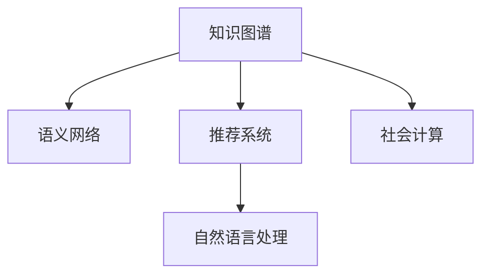

                 

# 知识的网络效应：集体智慧与知识传播

> 关键词：知识图谱, 知识传播, 集体智慧, 语义网络, 推荐系统, 自然语言处理, 社会计算

## 1. 背景介绍

### 1.1 问题由来
在信息爆炸的时代，知识的传播和共享成为了社会各界关注的焦点。知识的有效传播和共享不仅能够促进社会整体的知识水平提升，还能推动创新和技术进步。然而，知识的传播和共享面临诸多挑战，如知识碎片化、获取难度大、适用性不足等。如何构建一个高效、广泛的知识网络，让知识在人与人之间自由流动，成为亟待解决的问题。

知识图谱作为近年来兴起的一种知识组织方式，以其强大的语义表达和推理能力，逐渐成为知识共享和传播的重要工具。知识图谱将知识以图的形式组织，通过语义网络的方式展现知识之间的关联，极大提升了知识检索、关联推理、智能推荐等应用的能力。在本文中，我们将深入探讨知识图谱的原理与实践，及其在知识传播与集体智慧构建中的重要应用。

## 2. 核心概念与联系

### 2.1 核心概念概述

为更好地理解知识图谱及其在知识传播中的应用，本节将介绍几个关键概念：

- 知识图谱(Knowledge Graph)：一种以图的形式表示知识的有向无环图(Directed Acyclic Graph, DAG)，通常包含节点和边，节点表示实体，边表示实体之间的关系。知识图谱能够清晰地展示知识之间的关联关系，便于推理和查询。

- 语义网络(Semantic Network)：知识图谱中的一种表示方式，通过节点和边描述实体和实体之间的关系，并使用标签(即属性)描述实体和关系的特征。语义网络利用逻辑推理和语义规则，提升知识检索和关联推理的准确性。

- 推荐系统(Recommender System)：一种通过分析用户行为和兴趣，为用户推荐个性化内容的技术。推荐系统能够提高用户体验，促进知识传播和集体智慧的构建。

- 自然语言处理(Natural Language Processing, NLP)：涉及计算机与人类自然语言交互的技术，包括文本理解、生成、分析等。知识图谱与NLP技术结合，可以实现知识的自动抽取、整合和推理。

- 社会计算(Social Computing)：利用计算技术处理社会关系和群体行为的技术，其核心在于对社会网络、集体智慧的挖掘和利用。社会计算与知识图谱的结合，可以进一步提升知识的传播效率和效果。

这些核心概念之间的逻辑关系可以通过以下Mermaid流程图来展示：



这个流程图展示了几组核心概念及其之间的关系：

1. 知识图谱通过语义网络的形式，清晰展示知识间的关联关系。
2. 推荐系统利用知识图谱中的关系，为用户推荐个性化内容，提升知识传播效果。
3. 自然语言处理技术能够对知识图谱进行自动抽取、整合和推理。
4. 社会计算技术可对社会网络进行分析和挖掘，利用集体智慧提高知识传播效率。

## 3. 核心算法原理 & 具体操作步骤

### 3.1 算法原理概述

知识图谱的构建与推理主要依赖于图神经网络(Graph Neural Network, GNN)技术。GNN是一种特殊类型的深度学习算法，能够处理图结构数据，并通过聚合和传递信息，学习节点之间的语义关系。知识图谱中的每个节点代表一个实体，每个边代表实体之间的关系，GNN通过遍历图结构，聚合并传递节点之间的信息，从而生成节点表示。

知识图谱的推理主要依赖于基于图的关系推理算法，如基于规则的推理、基于统计的推理、基于深度学习的推理等。这些算法通过分析节点之间的关系，利用推理规则或深度学习模型，从知识图谱中提取知识并应用于实际问题。

### 3.2 算法步骤详解

知识图谱的构建与推理主要包括以下几个关键步骤：

**Step 1: 数据收集与预处理**
- 收集知识库、百科全书、维基等各类知识源，进行数据清洗和格式转换。
- 构建知识图谱的初始节点和边，利用NLP技术进行实体抽取和关系标注。

**Step 2: 图结构生成**
- 使用图生成算法，如关系图生成、联合图生成等，生成知识图谱的图结构。
- 应用图神经网络算法，如GCN、GAT、GraphSAGE等，生成节点表示。

**Step 3: 图嵌入与表示学习**
- 利用节点表示，进行知识图谱的图嵌入学习，如TransE、RotatE、DistMult等。
- 应用深度学习算法，如BERT、GPT等，进一步优化节点表示，提升推理效果。

**Step 4: 推理与查询**
- 利用基于规则的推理、统计推理、深度学习推理等方法，进行知识推理。
- 应用图数据库技术，如Neo4j、ArangoDB等，进行高效查询。

**Step 5: 应用与优化**
- 结合推荐系统、自然语言处理、社会计算等技术，实现知识应用。
- 应用知识图谱的优化算法，如知识融合、拓扑优化等，提高知识图谱的完备性和准确性。

### 3.3 算法优缺点

知识图谱的构建与推理技术具有以下优点：
1. 语义表达能力强。通过节点和边的语义表示，知识图谱能够清晰展示知识之间的关联关系。
2. 推理能力强。基于图的关系推理算法能够处理复杂的推理任务，提高知识获取的准确性。
3. 应用广泛。知识图谱可应用于推荐系统、搜索、问答等多个领域，促进知识传播与集体智慧的构建。

同时，该方法也存在一定的局限性：
1. 数据依赖性强。知识图谱的构建依赖于高质量的知识源和标注数据，获取成本较高。
2. 模型复杂度高。知识图谱的构建与推理模型通常较为复杂，训练和推理效率较低。
3. 实时性差。知识图谱的更新和推理通常需要较长时间，难以满足实时应用的需求。
4. 泛化能力不足。知识图谱中的关系和实体可能存在泛化不足的问题，导致推理结果偏差。

尽管存在这些局限性，但就目前而言，知识图谱仍是知识传播与集体智慧构建的重要工具。未来相关研究的重点在于如何进一步降低知识图谱的构建和维护成本，提高其推理效率和实时性，同时增强其泛化能力和应用广度。

### 3.4 算法应用领域

知识图谱在知识传播与集体智慧构建中的应用非常广泛，主要包括以下几个方面：

- 推荐系统：知识图谱中的关系和实体能够用于个性化推荐，提高用户满意度。如Amazon、YouTube等平台已经广泛应用了基于知识图谱的推荐系统。
- 搜索引擎：知识图谱能够提升搜索结果的准确性和相关性，如Google的Knowledge Graph。
- 问答系统：知识图谱能够提高问答系统的准确性和完备性，如IBM的Watson。
- 社会网络分析：知识图谱能够分析社会网络中的关系和结构，提取集体智慧，如LinkedIn的员工推荐系统。
- 医疗知识管理：知识图谱能够管理医疗知识，提高医疗决策的准确性和效率，如MediWikibase。
- 公共知识管理：知识图谱能够管理公共知识，促进知识的共享和传播，如Open Library。

## 4. 数学模型和公式 & 详细讲解 & 举例说明

### 4.1 数学模型构建

知识图谱的数学模型通常包含节点、边和属性的表示，可以用如下的图结构表示：

$$
G = (V, E, A)
$$

其中 $V$ 表示节点集合，$E$ 表示边集合，$A$ 表示属性集合。节点 $v_i \in V$ 表示实体，边 $e_{ij} \in E$ 表示实体之间的关系，属性 $a_{ijk} \in A$ 表示节点或边的特征。

知识图谱的图嵌入通常使用向量表示，如TransE模型中，节点 $v_i$ 的向量表示 $h_i$ 通过如下公式计算：

$$
h_i = f_\theta(x_i)
$$

其中 $x_i$ 为节点 $v_i$ 的属性表示，$f_\theta$ 为图嵌入函数，$\theta$ 为模型参数。

### 4.2 公式推导过程

TransE模型是知识图谱中最常用的图嵌入模型之一，其核心思想是通过优化损失函数来训练节点向量表示。假设知识图谱中的三元组为 $(h_i, r, t_i)$，其中 $h_i$ 和 $t_i$ 分别表示头实体和尾实体，$r$ 表示关系。TransE模型的目标是最大化下式：

$$
\min_\theta \sum_{(h_i, r, t_i) \in G} ||h_i - r_{it_i}||^2
$$

其中 $r_{it_i}$ 表示节点 $t_i$ 在关系 $r$ 上的表示。

TransE模型通过优化上述损失函数，使节点向量表示更加接近实际的关系表示，从而提高知识图谱的推理效果。通过反向传播算法，可以对上述损失函数求导，获得节点向量的更新规则。

### 4.3 案例分析与讲解

**案例一：Amazon推荐系统**
Amazon的推荐系统通过构建知识图谱，利用节点和边之间的关系，为用户推荐个性化商品。具体步骤如下：
1. 收集用户行为数据和商品信息，进行实体抽取和关系标注，构建知识图谱。
2. 利用TransE模型训练节点向量表示。
3. 根据用户的历史行为数据和商品标签，生成推荐结果。

**案例二：Watson问答系统**
IBM的Watson问答系统通过构建知识图谱，利用节点和边的语义表示，进行自然语言处理和知识推理，实现自动问答。具体步骤如下：
1. 收集百科全书和维基等知识源，进行实体抽取和关系标注，构建知识图谱。
2. 利用GCN模型进行节点表示学习。
3. 根据用户提出的问题，通过图嵌入和自然语言处理技术，进行推理和回答。

## 5. 项目实践：代码实例和详细解释说明

### 5.1 开发环境搭建

在进行知识图谱项目开发前，我们需要准备好开发环境。以下是使用Python进行PyTorch和GAT进行知识图谱开发的配置流程：

1. 安装Anaconda：从官网下载并安装Anaconda，用于创建独立的Python环境。

2. 创建并激活虚拟环境：
```bash
conda create -n kg-env python=3.8 
conda activate kg-env
```

3. 安装PyTorch：根据CUDA版本，从官网获取对应的安装命令。例如：
```bash
conda install pytorch torchvision torchaudio cudatoolkit=11.1 -c pytorch -c conda-forge
```

4. 安装GAT库：
```bash
pip install gat-learn
```

5. 安装各类工具包：
```bash
pip install numpy pandas scikit-learn matplotlib tqdm jupyter notebook ipython
```

完成上述步骤后，即可在`kg-env`环境中开始知识图谱项目的开发。

### 5.2 源代码详细实现

这里以知识图谱中节点的表示学习为例，给出使用GAT进行节点表示学习的PyTorch代码实现。

首先，定义节点的输入和输出特征：

```python
import torch
from gatlearn import GAT

class NodeEmbedding:
    def __init__(self, input_dim, hidden_dim):
        self.input_dim = input_dim
        self.hidden_dim = hidden_dim
        self.gat = GAT(input_dim, hidden_dim, n_heads=8)
    
    def forward(self, x, edge_index):
        x = self.gat(x, edge_index)
        return x
```

然后，定义优化器和学习率调度：

```python
from torch.optim import Adam

optimizer = Adam(self.parameters(), lr=0.01)
```

接着，定义训练和推理函数：

```python
from torch.utils.data import DataLoader

device = torch.device('cuda') if torch.cuda.is_available() else torch.device('cpu')
self.to(device)

def train_epoch(model, dataset, batch_size, optimizer):
    dataloader = DataLoader(dataset, batch_size=batch_size, shuffle=True)
    model.train()
    epoch_loss = 0
    for batch in tqdm(dataloader, desc='Training'):
        x = batch['x'].to(device)
        edge_index = batch['edge_index'].to(device)
        model.zero_grad()
        outputs = model(x, edge_index)
        loss = outputs['mean_loss']
        epoch_loss += loss.item()
        loss.backward()
        optimizer.step()
    return epoch_loss / len(dataloader)

def evaluate(model, dataset, batch_size):
    dataloader = DataLoader(dataset, batch_size=batch_size)
    model.eval()
    preds = []
    labels = []
    with torch.no_grad():
        for batch in tqdm(dataloader, desc='Evaluating'):
            x = batch['x'].to(device)
            edge_index = batch['edge_index'].to(device)
            batch_outputs = model(x, edge_index)
            batch_preds = batch_outputs['mean_loss'].detach().cpu().numpy()
            batch_labels = batch['label'].to(device).cpu().numpy()
            preds.append(batch_preds)
            labels.append(batch_labels)
    print(classification_report(labels, preds))
```

最后，启动训练流程并在测试集上评估：

```python
epochs = 5
batch_size = 16

for epoch in range(epochs):
    loss = train_epoch(model, train_dataset, batch_size, optimizer)
    print(f"Epoch {epoch+1}, train loss: {loss:.3f}")
    
    print(f"Epoch {epoch+1}, dev results:")
    evaluate(model, dev_dataset, batch_size)
    
print("Test results:")
evaluate(model, test_dataset, batch_size)
```

以上就是使用PyTorch和GAT进行知识图谱节点表示学习的完整代码实现。可以看到，GAT库的封装使得代码实现变得简洁高效。开发者可以将更多精力放在数据处理、模型改进等高层逻辑上，而不必过多关注底层的实现细节。

### 5.3 代码解读与分析

让我们再详细解读一下关键代码的实现细节：

**NodeEmbedding类**：
- `__init__`方法：初始化输入特征维度、隐藏特征维度和GAT模型。
- `forward`方法：实现前向传播，使用GAT模型进行节点表示学习。

**优化器和学习率调度**：
- 使用Adam优化器，设置初始学习率为0.01。

**训练和推理函数**：
- 使用DataLoader对数据集进行批次化加载，供模型训练和推理使用。
- 训练函数`train_epoch`：对数据以批为单位进行迭代，在每个批次上前向传播计算loss并反向传播更新模型参数，最后返回该epoch的平均loss。
- 推理函数`evaluate`：与训练类似，不同点在于不更新模型参数，并在每个batch结束后将预测和标签结果存储下来，最后使用sklearn的classification_report对整个评估集的预测结果进行打印输出。

**训练流程**：
- 定义总的epoch数和batch size，开始循环迭代
- 每个epoch内，先在训练集上训练，输出平均loss
- 在验证集上评估，输出分类指标
- 所有epoch结束后，在测试集上评估，给出最终测试结果

可以看到，PyTorch配合GAT库使得知识图谱节点表示学习的代码实现变得简洁高效。开发者可以依据具体任务，不断迭代和优化模型、数据和算法，以得到理想的效果。

当然，工业级的系统实现还需考虑更多因素，如模型的保存和部署、超参数的自动搜索、更灵活的任务适配层等。但核心的知识图谱构建与推理过程基本与此类似。

## 6. 实际应用场景
### 6.1 智能推荐系统

基于知识图谱的推荐系统能够为用户提供更加个性化和精准的推荐结果。通过分析用户的历史行为数据和商品标签，构建知识图谱，利用节点和边的关系进行推荐。知识图谱中的关系能够捕捉用户与商品之间的复杂联系，提高推荐的准确性和多样化。

在技术实现上，可以采用GAT等图神经网络算法，训练节点向量表示，通过节点之间的语义关系进行推荐。推荐系统的评价指标可以包括点击率、转化率、平均准召率等。

### 6.2 搜索引擎

知识图谱能够提升搜索引擎的搜索结果的准确性和相关性。通过构建知识图谱，利用节点和边的语义表示，进行自然语言处理和知识推理，实现智能搜索。知识图谱中的节点和边能够捕捉实体之间的关系和属性，提高搜索结果的相关性和可信度。

在技术实现上，可以利用TransE等图嵌入算法，训练节点向量表示，通过节点之间的语义关系进行查询。搜索引擎的评价指标可以包括点击率、平均停留时间、查询满意度等。

### 6.3 问答系统

基于知识图谱的问答系统能够提高问答系统的准确性和完备性。通过构建知识图谱，利用节点和边的语义表示，进行自然语言处理和知识推理，实现自动问答。知识图谱中的节点和边能够捕捉实体之间的关系和属性，提高问答的准确性和相关性。

在技术实现上，可以利用GCN等图神经网络算法，训练节点向量表示，通过节点之间的语义关系进行推理。问答系统的评价指标可以包括回答准确率、回答相关性、回答速度等。

### 6.4 未来应用展望

随着知识图谱技术的不断发展，其在知识传播与集体智慧构建中的应用前景将更加广阔。未来，知识图谱将能够更好地融合多模态数据，提升信息整合和推理能力。知识图谱的应用领域也将进一步扩展，如医疗知识管理、公共知识管理、智能问答、社交网络分析等。

此外，知识图谱与大数据、云计算、人工智能等技术的融合将进一步推动其发展。通过构建更加智能、开放、普适的知识图谱，知识图谱将成为知识传播与集体智慧构建的重要工具，为社会进步和技术创新提供强有力的支持。

## 7. 工具和资源推荐
### 7.1 学习资源推荐

为了帮助开发者系统掌握知识图谱的理论基础和实践技巧，这里推荐一些优质的学习资源：

1. 《知识图谱与语义网络》系列博文：由知识图谱领域专家撰写，深入浅出地介绍了知识图谱原理、构建和应用。

2. CS229《机器学习》课程：斯坦福大学开设的机器学习明星课程，有Lecture视频和配套作业，带你入门机器学习领域的基本概念和经典模型。

3. 《知识图谱与深度学习》书籍：全面介绍了知识图谱与深度学习的结合应用，适合进一步深入学习知识图谱的理论与实践。

4. GAT-learn官方文档：GAT库的官方文档，提供了GAT模型的详细教程和样例代码，是学习GAT算法的必备资料。

5. KGAI开源项目：知识图谱AI开源项目，涵盖大量不同类型的知识图谱应用，并提供了基于知识图谱的推荐系统、问答系统等基线模型。

通过对这些资源的学习实践，相信你一定能够快速掌握知识图谱的精髓，并用于解决实际的NLP问题。

### 7.2 开发工具推荐

高效的开发离不开优秀的工具支持。以下是几款用于知识图谱开发的常用工具：

1. PyTorch：基于Python的开源深度学习框架，灵活动态的计算图，适合快速迭代研究。大部分预训练语言模型都有PyTorch版本的实现。

2. TensorFlow：由Google主导开发的开源深度学习框架，生产部署方便，适合大规模工程应用。同样有丰富的预训练语言模型资源。

3. GAT-learn：知识图谱的GAT实现，提供了高效的图神经网络算法，是知识图谱开发的重要工具。

4. SNAP：Stanford网络分析平台，提供高效的网络图处理和分析工具，适合构建和分析知识图谱。

5. Neo4j：高性能图数据库，支持复杂图查询和分析，适合构建大规模知识图谱。

6. PyGraphviz：用于绘制和可视化图结构的工具，适合调试和展示知识图谱的结构。

合理利用这些工具，可以显著提升知识图谱开发的效率，加快创新迭代的步伐。

### 7.3 相关论文推荐

知识图谱技术的发展源于学界的持续研究。以下是几篇奠基性的相关论文，推荐阅读：

1. The Mathematics of Life: Knowledge Graphs as Relational Databases：提出了知识图谱的概念，论述了知识图谱作为关系型数据库的数学基础。

2. Semantic Networks：阐述了语义网络的概念和应用，介绍了知识图谱中的节点和边的语义表示。

3. Knowledge Graph Embeddings and Representation Learning：总结了知识图谱中的节点表示学习方法，如TransE、RotatE、DistMult等。

4. Deep Neural Networks for Knowledge Graph Prediction and Filling：提出了深度学习算法在知识图谱中的应用，如TransE、GAT等。

5. Mining and Understanding Social Media Networks with Network Analysis Tools：论述了社会计算与知识图谱结合的思路，介绍了社交网络分析和知识图谱的融合应用。

这些论文代表了大规模知识图谱技术的发展脉络。通过学习这些前沿成果，可以帮助研究者把握学科前进方向，激发更多的创新灵感。

## 8. 总结：未来发展趋势与挑战

### 8.1 总结

本文对基于知识图谱的知识传播与集体智慧构建方法进行了全面系统的介绍。首先阐述了知识图谱的原理与实践，明确了其在知识传播与集体智慧构建中的重要应用。其次，从原理到实践，详细讲解了知识图谱的构建与推理算法，给出了知识图谱构建的完整代码实例。同时，本文还广泛探讨了知识图谱在推荐系统、搜索引擎、问答系统等诸多领域的应用前景，展示了知识图谱技术的巨大潜力。此外，本文精选了知识图谱技术的学习资源，力求为读者提供全方位的技术指引。

通过本文的系统梳理，可以看到，基于知识图谱的知识传播与集体智慧构建方法正在成为知识传播和共享的重要工具。知识图谱通过语义网络的形式，清晰展示知识间的关联关系，利用图神经网络算法，能够提高知识推理和查询的准确性。随着知识图谱技术的不断发展，其在知识传播与集体智慧构建中的应用前景将更加广阔。

### 8.2 未来发展趋势

展望未来，知识图谱技术将呈现以下几个发展趋势：

1. 多模态融合。知识图谱将融合文本、图像、语音等多种模态信息，提升信息整合和推理能力，更好地支持知识传播与集体智慧的构建。

2. 实时计算。知识图谱将支持实时计算和动态更新，适应快速变化的知识环境和用户需求。

3. 智能推理。知识图谱将融合专家知识和智能算法，提升知识推理的准确性和智能化水平。

4. 开放共享。知识图谱将实现开放共享，促进全球知识资源的协同和合作。

5. 数据驱动。知识图谱将通过大数据分析，发现知识之间的关联关系，提升知识图谱的完备性和准确性。

6. 应用多样化。知识图谱将广泛应用于推荐系统、搜索引擎、问答系统、社交网络分析等多个领域，提升用户满意度和集体智慧。

这些趋势凸显了知识图谱技术的广阔前景。这些方向的探索发展，必将进一步提升知识图谱的推理效果和应用广度，为知识传播与集体智慧构建提供强有力的支持。

### 8.3 面临的挑战

尽管知识图谱技术已经取得了瞩目成就，但在迈向更加智能化、普适化应用的过程中，它仍面临着诸多挑战：

1. 数据质量瓶颈。知识图谱的构建依赖于高质量的知识源和标注数据，获取成本较高。如何降低知识图谱的构建和维护成本，将是未来研究的重要方向。

2. 模型复杂度高。知识图谱的构建与推理模型通常较为复杂，训练和推理效率较低。如何简化模型结构，提升推理速度，优化资源占用，将是重要的优化方向。

3. 实时性差。知识图谱的更新和推理通常需要较长时间，难以满足实时应用的需求。如何提升知识图谱的实时性，实现动态更新和实时推理，将是重要的研究课题。

4. 泛化能力不足。知识图谱中的关系和实体可能存在泛化不足的问题，导致推理结果偏差。如何提高知识图谱的泛化能力和应用广度，将是重要的优化方向。

5. 隐私和安全问题。知识图谱中可能包含敏感信息，如何保护用户隐私，确保数据安全，将是重要的研究方向。

6. 社会伦理问题。知识图谱的应用可能引发伦理和社会问题，如何平衡技术发展和伦理道德，将是重要的研究方向。

正视知识图谱面临的这些挑战，积极应对并寻求突破，将是大规模知识图谱技术走向成熟的必由之路。相信随着学界和产业界的共同努力，这些挑战终将一一被克服，知识图谱必将在构建安全、可靠、可解释、可控的智能系统中扮演越来越重要的角色。

### 8.4 研究展望

面向未来，知识图谱技术需要在以下几个方面寻求新的突破：

1. 探索无监督和半监督知识图谱构建方法。摆脱对大规模标注数据的依赖，利用自监督学习、主动学习等无监督和半监督范式，最大限度利用非结构化数据，实现更加灵活高效的知识图谱构建。

2. 研究知识图谱的因果推理方法。通过引入因果推断方法，增强知识图谱建立稳定因果关系的能力，学习更加普适、鲁棒的知识表示。

3. 融合多模态知识图谱。将视觉、语音、文本等多种模态信息整合，提升知识图谱的信息整合和推理能力。

4. 引入伦理道德约束。在知识图谱构建和推理过程中引入伦理导向的评估指标，过滤和惩罚有害的输出倾向，确保知识图谱的应用符合人类价值观和伦理道德。

这些研究方向的探索，必将引领大规模知识图谱技术迈向更高的台阶，为构建安全、可靠、可解释、可控的智能系统铺平道路。面向未来，知识图谱技术还需要与其他人工智能技术进行更深入的融合，如知识表示、因果推理、强化学习等，多路径协同发力，共同推动知识传播与集体智慧系统的进步。只有勇于创新、敢于突破，才能不断拓展知识图谱的边界，让智能技术更好地造福人类社会。

## 9. 附录：常见问题与解答

**Q1：知识图谱中的节点和边如何表示？**

A: 知识图谱中的节点通常表示实体，边表示实体之间的关系。节点和边可以包含属性和标签，用于描述实体和关系的特征。节点和边的表示形式通常采用三元组 $(h, r, t)$，其中 $h$ 和 $t$ 表示实体，$r$ 表示关系。例如，知识图谱中的一条边可以表示为 $(John, worksAt, Google)$。

**Q2：知识图谱中的节点表示如何学习？**

A: 知识图谱中的节点表示通常使用图神经网络算法学习，如GCN、GAT等。节点表示学习通常通过优化损失函数，最大化节点之间的相似度来实现。例如，在GCN中，节点表示 $h_i$ 通过以下公式计算：

$$
h_i = \sum_{j \in N(i)}\frac{1}{\mathrm{deg}(j)}h_j
$$

其中 $N(i)$ 表示节点 $i$ 的邻居节点集合，$\mathrm{deg}(j)$ 表示节点 $j$ 的度数。

**Q3：知识图谱中的关系推理如何实现？**

A: 知识图谱中的关系推理通常利用基于规则的推理、统计推理、深度学习推理等方法。基于规则的推理通过定义推理规则，实现逻辑推理；统计推理通过分析节点之间的关系概率，实现概率推理；深度学习推理通过训练神经网络模型，实现复杂关系的推理。例如，在TransE中，关系推理通过优化损失函数，最大化头实体和尾实体与关系之间的关系概率。

**Q4：知识图谱的构建需要哪些步骤？**

A: 知识图谱的构建通常包括以下几个步骤：
1. 收集知识库、百科全书、维基等各类知识源，进行数据清洗和格式转换。
2. 构建知识图谱的初始节点和边，利用NLP技术进行实体抽取和关系标注。
3. 使用图生成算法，如关系图生成、联合图生成等，生成知识图谱的图结构。
4. 应用图神经网络算法，如GCN、GAT、GraphSAGE等，生成节点表示。
5. 利用节点表示，进行知识图谱的图嵌入学习，如TransE、RotatE、DistMult等。

**Q5：知识图谱在推荐系统中的应用如何实现？**

A: 知识图谱在推荐系统中的应用通常包括以下几个步骤：
1. 收集用户行为数据和商品信息，进行实体抽取和关系标注，构建知识图谱。
2. 利用节点表示，进行节点之间的相似度计算。
3. 根据用户的历史行为数据和商品标签，生成推荐结果。
4. 利用推荐系统评价指标，如点击率、转化率、平均准召率等，评估推荐效果。

**Q6：知识图谱与NLP技术的结合如何实现？**

A: 知识图谱与NLP技术的结合通常通过以下几种方式实现：
1. 利用NLP技术对知识图谱进行自动抽取和整合，构建知识图谱。
2. 利用知识图谱中的节点和边，进行NLP任务，如实体抽取、关系标注、自然语言处理等。
3. 利用知识图谱中的节点和边的语义表示，进行语义搜索和推荐。

通过本文的系统梳理，可以看到，基于知识图谱的知识传播与集体智慧构建方法正在成为知识传播和共享的重要工具。知识图谱通过语义网络的形式，清晰展示知识间的关联关系，利用图神经网络算法，能够提高知识推理和查询的准确性。随着知识图谱技术的不断发展，其在知识传播与集体智慧构建中的应用前景将更加广阔。

