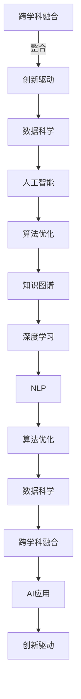

                 

# 知识的跨学科融合：创新的源泉

> 关键词：跨学科融合,创新驱动,数据科学,人工智能,算法优化,知识图谱,深度学习,自然语言处理(NLP)

## 1. 背景介绍

在当今知识爆炸的时代，各个学科领域之间的界限逐渐模糊，跨学科融合已成为推动科技进步和社会发展的关键力量。跨学科融合不仅能够整合不同领域的知识和技能，还能激发新的思维方式，孕育出颠覆性技术。作为一位计算机领域的大师，本文将从人工智能（AI）的角度出发，探讨知识的跨学科融合如何在AI领域中驱动创新，以及这些创新如何助力各行各业实现数字化转型。

## 2. 核心概念与联系

### 2.1 核心概念概述

在深入探讨知识的跨学科融合如何推动AI创新的过程中，我们需要明确几个核心概念：

- **跨学科融合**：指不同学科的知识、方法和理论在交叉点上进行整合，产生新的见解和解决方案的过程。
- **创新驱动**：强调技术创新在推动经济发展和社会进步中的关键作用。
- **数据科学**：涉及数据采集、处理、分析和可视化，旨在从数据中提取知识，支持决策制定。
- **人工智能**：使用算法和机器学习模型，模拟人类智能，实现自动化决策和问题解决。
- **算法优化**：通过改进算法，提高其效率和效果，以达到更好的性能。
- **知识图谱**：一种结构化的知识表示方法，用于描述实体及其之间的关系，支持自然语言理解和推理。
- **深度学习**：一种机器学习技术，通过多层次神经网络进行数据处理和分析，特别是非线性问题的解决。
- **自然语言处理（NLP）**：使用计算机技术处理和理解人类语言，支持文本分析、信息检索、语言生成等应用。

### 2.2 核心概念原理和架构的 Mermaid 流程图

以下是描述这些核心概念之间联系的 Mermaid 流程图：



这个图表展示了一个循环：跨学科融合通过整合不同领域的方法和理论，驱动创新。数据科学和人工智能作为核心的技术工具，在算法优化、知识图谱构建和NLP等方向上互相促进，共同推动AI应用的发展。

## 3. 核心算法原理 & 具体操作步骤

### 3.1 算法原理概述

跨学科融合在AI领域的核心算法原理，主要体现在以下几个方面：

1. **数据驱动的算法优化**：通过跨学科融合，将数据科学和统计学方法应用于AI算法优化，提高模型的准确性和泛化能力。
2. **跨领域知识图谱的构建**：知识图谱不仅在知识表示和推理方面具有优势，还能在AI中用于知识增强，提升NLP、视觉推理等任务的效果。
3. **跨学科理论的结合**：深度学习不仅借鉴了神经科学的原理，还结合了信号处理、优化理论等领域的知识，推动了AI技术的不断进步。
4. **算法在实际应用中的迭代**：AI算法在实际应用中，通过跨学科反馈不断迭代优化，提高其在实际场景中的效果。

### 3.2 算法步骤详解

1. **需求分析**：明确AI应用的具体需求和目标，包括性能指标、数据要求等。
2. **数据准备**：收集、清洗和预处理相关数据，确保数据的质量和可用性。
3. **模型选择**：根据任务特点，选择适合的人工智能算法和模型架构。
4. **跨学科融合**：整合数据科学、人工智能等领域的知识和技能，进行算法优化和模型训练。
5. **模型评估与调优**：使用科学和工程方法，评估模型性能并进行调优。
6. **应用部署**：将训练好的模型部署到实际应用中，进行实时处理和决策支持。
7. **持续优化**：根据反馈数据和业务需求，不断更新和优化模型，提升AI应用效果。

### 3.3 算法优缺点

#### 优点：

- **多角度分析**：跨学科融合能够提供多维度的分析视角，全面理解问题的本质和复杂性。
- **技术互补**：不同学科的技术和方法可以互补，提升整体的创新能力。
- **快速迭代**：跨学科融合能够加速算法迭代，快速响应市场需求和技术进步。

#### 缺点：

- **知识鸿沟**：不同学科之间的知识差异可能造成沟通和理解上的困难。
- **资源消耗**：跨学科融合通常需要更多的资源和时间，包括人力、数据和计算资源。
- **复杂性增加**：跨学科的整合增加了系统的复杂性，需要更多的专业知识和技术支持。

### 3.4 算法应用领域

跨学科融合在AI领域的应用广泛，涵盖以下几个主要方向：

1. **智能医疗**：通过整合医学、数据科学和人工智能，开发智能诊断、治疗方案推荐和个性化医疗等服务。
2. **自动驾驶**：结合计算机视觉、传感器技术和深度学习，实现环境感知、路径规划和决策支持。
3. **金融科技**：利用数据科学、机器学习和自然语言处理，进行风险评估、信用评分和自动化交易等。
4. **智能制造**：通过机器视觉、物联网和人工智能，实现生产过程的自动化和智能化管理。
5. **智慧城市**：融合地理信息系统（GIS）、物联网和大数据技术，构建智能交通、能源管理和公共服务系统。

## 4. 数学模型和公式 & 详细讲解 & 举例说明

### 4.1 数学模型构建

在AI领域，跨学科融合的数学模型构建通常涉及以下几个方面：

- **优化模型**：通过数据科学和统计学的优化方法，构建适用于AI任务的数学模型。
- **深度学习模型**：使用神经网络结构和激活函数，构建深度学习模型。
- **知识表示模型**：利用图论和符号逻辑，构建知识图谱和本体模型。

### 4.2 公式推导过程

以深度学习模型为例，其核心算法包括反向传播和梯度下降。假设一个简单的神经网络模型，其结构如下：

$$
y = \sigma(Wx + b)
$$

其中，$y$ 是输出，$x$ 是输入，$W$ 和 $b$ 是模型参数，$\sigma$ 是激活函数。

假设损失函数为均方误差（MSE），则损失函数的梯度为：

$$
\frac{\partial L}{\partial W} = \frac{\partial L}{\partial y} \cdot \frac{\partial y}{\partial x} \cdot \frac{\partial x}{\partial W}
$$

其中，$\frac{\partial L}{\partial y}$ 是输出层的梯度，$\frac{\partial y}{\partial x}$ 是激活函数的导数，$\frac{\partial x}{\partial W}$ 是权重矩阵的导数。

通过反向传播算法，可以计算出每个参数的梯度，并使用梯度下降法更新模型参数，完成模型的训练和优化。

### 4.3 案例分析与讲解

以NLP领域为例，使用跨学科融合的方法进行情感分析。情感分析的数学模型通常包括词向量表示、情感词典和深度学习模型。

1. **词向量表示**：使用数据科学中的文本预处理技术，将文本转换为词向量表示。
2. **情感词典**：构建或使用现有的情感词典，将情感标注与词向量关联。
3. **深度学习模型**：使用深度学习模型（如RNN、CNN、Transformer）进行情感分类。

## 5. 项目实践：代码实例和详细解释说明

### 5.1 开发环境搭建

在进行AI项目实践前，需要准备好开发环境。以下是使用Python进行TensorFlow开发的环境配置流程：

1. 安装Anaconda：从官网下载并安装Anaconda，用于创建独立的Python环境。
2. 创建并激活虚拟环境：
```bash
conda create -n tf-env python=3.8 
conda activate tf-env
```

3. 安装TensorFlow：根据CUDA版本，从官网获取对应的安装命令。例如：
```bash
conda install tensorflow-gpu=2.5.0 -c conda-forge
```

4. 安装各类工具包：
```bash
pip install numpy pandas scikit-learn matplotlib tqdm jupyter notebook ipython
```

完成上述步骤后，即可在`tf-env`环境中开始AI项目实践。

### 5.2 源代码详细实现

下面我们以情感分析任务为例，给出使用TensorFlow进行深度学习模型开发的PyTorch代码实现。

首先，定义情感分析任务的数学模型：

```python
import tensorflow as tf
from tensorflow.keras import layers

# 定义模型结构
model = tf.keras.Sequential([
    layers.Embedding(vocab_size, embedding_dim, input_length=max_length),
    layers.Bidirectional(layers.LSTM(64, return_sequences=True)),
    layers.Bidirectional(layers.LSTM(64)),
    layers.Dense(1, activation='sigmoid')
])
```

然后，定义模型训练函数：

```python
# 定义损失函数和优化器
loss_fn = tf.keras.losses.BinaryCrossentropy(from_logits=True)
optimizer = tf.keras.optimizers.Adam()

# 定义模型编译
model.compile(optimizer=optimizer, loss=loss_fn, metrics=['accuracy'])

# 定义训练函数
@tf.function
def train_step(inputs, targets):
    with tf.GradientTape() as tape:
        logits = model(inputs, training=True)
        loss = loss_fn(targets, logits)
    gradients = tape.gradient(loss, model.trainable_variables)
    optimizer.apply_gradients(zip(gradients, model.trainable_variables))
    return loss

# 训练模型
history = model.fit(train_dataset, epochs=10, validation_data=val_dataset)
```

最后，启动训练流程并在测试集上评估：

```python
# 定义测试函数
@tf.function
def test_step(inputs, targets):
    logits = model(inputs)
    loss = loss_fn(targets, logits)
    return loss

# 在测试集上评估模型
test_loss = test_step(test_dataset, test_dataset.labels)
print('Test loss:', test_loss.numpy())
```

以上就是使用TensorFlow进行情感分析任务开发的完整代码实现。可以看到，TensorFlow提供了丰富的工具和库，使得深度学习模型的构建和训练变得简洁高效。

### 5.3 代码解读与分析

让我们再详细解读一下关键代码的实现细节：

**model定义**：
- 使用`tf.keras.Sequential`构建模型，包含嵌入层、双向LSTM和全连接层。
- 嵌入层将输入的词向量转换为模型可以处理的向量表示。
- 双向LSTM层分别从左右两个方向处理输入，能够捕捉上下文信息。
- 全连接层进行二分类输出。

**训练函数train_step**：
- 使用`tf.GradientTape`记录梯度，`optimizer.apply_gradients`更新模型参数。
- 通过`@tf.function`装饰器，将函数编译为TensorFlow图，提高执行效率。

**测试函数test_step**：
- 直接输入测试集数据，计算模型预测结果和损失函数。

**训练和测试流程**：
- 定义损失函数和优化器，编译模型。
- 使用`model.fit`进行模型训练，`model.evaluate`进行模型评估。

可以看到，TensorFlow提供了强大的计算图优化和自动微分功能，使得深度学习模型的构建和训练变得简单易用。

## 6. 实际应用场景

### 6.1 智能医疗

在智能医疗领域，跨学科融合具有广泛的应用前景。例如，通过整合医学知识、数据科学和人工智能，可以开发智能诊断系统，提供快速准确的医疗服务。

具体而言，可以收集大量的医疗数据，包括电子病历、影像学数据和基因信息，进行数据预处理和特征工程。然后，利用深度学习模型进行疾病预测和诊断，结合专家知识库进行结果解释和建议。这样，不仅可以提高诊断的准确性，还能减少医生的工作量，提高医疗服务的效率和质量。

### 6.2 自动驾驶

自动驾驶技术需要融合计算机视觉、传感器技术和深度学习。通过跨学科融合，可以开发智能感知、路径规划和决策支持的系统。

在实际应用中，可以使用摄像头、激光雷达等传感器采集环境信息，通过深度学习模型进行目标检测和语义分割。然后，结合地图和GPS数据，进行路径规划和决策支持。这样，自动驾驶车辆就能够安全、可靠地行驶。

### 6.3 金融科技

金融科技需要结合数据科学、机器学习和自然语言处理。通过跨学科融合，可以开发风险评估、信用评分和自动化交易等服务。

具体而言，可以收集金融数据、市场数据和社会数据，进行数据预处理和特征工程。然后，利用深度学习模型进行风险评估和信用评分，结合自然语言处理技术进行情感分析和舆情监测。这样，金融机构可以更好地理解市场动态，做出明智的决策。

### 6.4 未来应用展望

未来，随着技术的不断进步，跨学科融合在AI领域的应用前景将更加广阔。以下是几个可能的方向：

1. **量子计算与AI结合**：通过跨学科融合，将量子计算技术引入AI，提高计算效率和处理能力。
2. **生物计算与AI结合**：通过跨学科融合，将生物计算技术引入AI，开发新型的神经网络结构和计算方法。
3. **跨模态信息融合**：通过跨学科融合，将视觉、听觉和触觉等多模态信息整合到AI系统中，提高系统的感知和理解能力。
4. **人机交互**：通过跨学科融合，将人机交互技术引入AI，开发智能助手、虚拟现实和增强现实系统。

## 7. 工具和资源推荐

### 7.1 学习资源推荐

为了帮助开发者系统掌握跨学科融合的理论基础和实践技巧，这里推荐一些优质的学习资源：

1. **《深度学习》课程**：斯坦福大学开设的深度学习课程，系统讲解了深度学习的理论和实践。
2. **《机器学习实战》书籍**：介绍机器学习的经典算法和实际应用，适合初学者入门。
3. **Kaggle平台**：提供数据科学和机器学习竞赛，通过实际项目学习跨学科融合技术。
4. **Coursera平台**：提供多门跨学科融合的课程，涵盖数据科学、人工智能和机器学习等领域。

通过对这些资源的学习实践，相信你一定能够快速掌握跨学科融合的精髓，并用于解决实际的AI问题。

### 7.2 开发工具推荐

高效的开发离不开优秀的工具支持。以下是几款用于AI项目开发的常用工具：

1. **TensorFlow**：由Google主导开发的深度学习框架，支持分布式计算和自动微分。
2. **PyTorch**：由Facebook开发的深度学习框架，支持动态计算图和GPU加速。
3. **Jupyter Notebook**：用于数据科学和机器学习的交互式环境，支持代码执行和结果展示。
4. **GitHub**：全球最大的代码托管平台，提供代码版本控制和协作功能。
5. **Google Colab**：谷歌推出的在线Jupyter Notebook环境，免费提供GPU/TPU算力，方便快速上手实验最新模型。

合理利用这些工具，可以显著提升AI项目的开发效率，加快创新迭代的步伐。

### 7.3 相关论文推荐

跨学科融合在AI领域的研究已经取得诸多突破，以下是几篇奠基性的相关论文，推荐阅读：

1. **Deep Learning**：Ian Goodfellow等著，系统介绍深度学习的基本原理和算法。
2. **Pattern Recognition and Machine Learning**：Christopher Bishop著，深入讲解机器学习的基础理论和应用。
3. **Knowledge Graphs**：Giuseppe Castagna等著，详细介绍知识图谱的概念、构建和应用。
4. **Human-Computer Interaction**：Brendan J. Frey等著，介绍人机交互的原理和设计方法。

这些论文代表了跨学科融合的研究前沿，通过学习这些前沿成果，可以帮助研究者把握学科前进方向，激发更多的创新灵感。

## 8. 总结：未来发展趋势与挑战

### 8.1 研究成果总结

跨学科融合在AI领域的探索和发展，已经取得了显著的进展。以下是对当前研究成果的总结：

1. **数据科学与人工智能的融合**：数据科学提供了数据预处理、特征工程和模型评估等技术，为AI模型的构建提供了坚实的基础。
2. **深度学习与自然语言处理的结合**：深度学习模型在NLP任务中取得了突破性进展，推动了语音识别、机器翻译和情感分析等技术的发展。
3. **知识图谱与深度学习的整合**：知识图谱为深度学习提供了丰富的背景知识，提高了模型的推理能力和泛化能力。
4. **跨模态信息融合**：通过跨模态信息融合，将视觉、听觉和触觉等多模态信息整合到AI系统中，提高了系统的感知和理解能力。

### 8.2 未来发展趋势

未来，跨学科融合在AI领域将继续深入发展，呈现以下几个趋势：

1. **多学科融合**：跨学科融合将更加深入，涵盖更多领域的知识和技能，推动AI技术的发展。
2. **算法创新**：通过跨学科融合，将不同领域的算法和技术进行创新性整合，开发更加高效、准确的AI模型。
3. **智能系统集成**：跨学科融合将推动智能系统在更多领域的集成和应用，实现智能化和自动化。
4. **伦理和社会责任**：跨学科融合将更多地考虑伦理和社会责任，确保AI技术的公平、透明和可解释性。

### 8.3 面临的挑战

尽管跨学科融合在AI领域取得了显著进展，但仍面临诸多挑战：

1. **数据隐私和安全**：跨学科融合涉及大量数据的整合和共享，如何保护数据隐私和安全是一个重要问题。
2. **算法复杂性**：跨学科融合增加了算法的复杂性，需要更多的专业知识和技术支持。
3. **跨学科沟通**：不同学科之间的沟通和协作可能存在障碍，需要建立有效的沟通机制。
4. **资源消耗**：跨学科融合通常需要更多的资源和时间，包括人力、数据和计算资源。
5. **伦理和法律问题**：跨学科融合可能带来新的伦理和法律问题，需要建立相应的规范和标准。

### 8.4 研究展望

未来，跨学科融合在AI领域的研究将面临以下方向：

1. **跨学科理论和方法的整合**：将不同学科的理论和方法进行整合，形成新的研究范式。
2. **智能系统的可持续发展**：研究智能系统的可持续发展，提高系统的可靠性和鲁棒性。
3. **跨学科伦理和法律问题**：研究跨学科融合带来的伦理和法律问题，建立相应的规范和标准。
4. **智能系统在垂直行业的应用**：研究智能系统在医疗、金融、制造等垂直行业的应用，提升行业效率和质量。

## 9. 附录：常见问题与解答

**Q1: 跨学科融合对AI技术有什么影响？**

A: 跨学科融合为AI技术带来了新的视角和方法，推动了AI技术的不断进步。通过整合不同学科的知识和技能，AI模型可以更好地理解和解决复杂问题，提高其性能和效果。

**Q2: 如何选择合适的跨学科融合方向？**

A: 选择合适的跨学科融合方向需要综合考虑任务需求、资源情况和团队能力。一般建议选择与业务紧密相关的领域，能够带来实际应用价值的跨学科融合方向。

**Q3: 跨学科融合在AI项目开发中需要注意哪些问题？**

A: 跨学科融合在AI项目开发中需要注意以下问题：
1. 数据隐私和安全：保护数据隐私和安全，避免数据泄露和滥用。
2. 算法复杂性：跨学科融合增加了算法的复杂性，需要更多的专业知识和技术支持。
3. 跨学科沟通：不同学科之间的沟通和协作可能存在障碍，需要建立有效的沟通机制。

**Q4: 如何提高跨学科融合项目的开发效率？**

A: 提高跨学科融合项目的开发效率需要综合考虑以下几个方面：
1. 选择合适的开发工具和平台，如TensorFlow、PyTorch等。
2. 利用数据科学和机器学习工具，进行数据预处理和特征工程。
3. 使用自动化工具，如Jupyter Notebook、GitHub等，提高开发效率。

这些问题的解答，希望能够帮助你更好地理解跨学科融合在AI领域的应用和发展，推动AI技术的不断创新和进步。

---

作者：禅与计算机程序设计艺术 / Zen and the Art of Computer Programming

