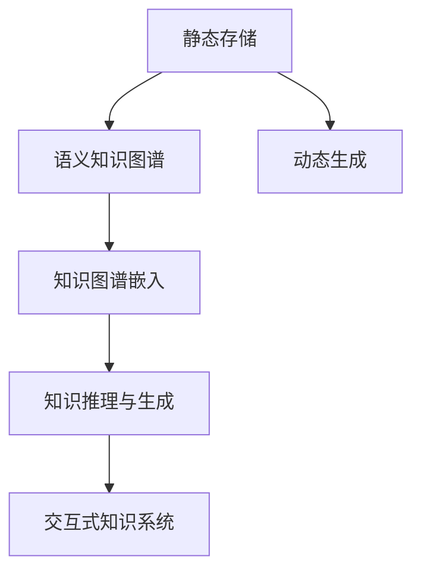
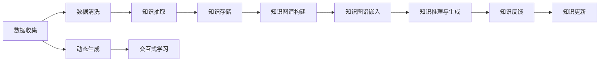

                 

# 知识的进化：从静态存储到动态生成

## 1. 背景介绍

### 1.1 问题由来
在互联网的推动下，信息爆炸、数据海量的时代已然来临。人类知识积累的数量和质量飞速增长，从传统图书馆中的纸质书籍到电子书籍，再到互联网上的丰富信息，知识存储方式不断演变，知识获取和应用变得更加便捷。然而，知识的存储形式依旧以静态、被动呈现为主，知识体系自身缺乏动态生成与演化的能力。

知识的进化需要突破传统的存储与展现方式，实现从静态到动态的转变，使知识体系能够与外部环境实时交互，不断吸收、更新和演化，适应变化多端的现实需求。

### 1.2 问题核心关键点
为更好地理解知识从静态存储到动态生成的进化，本节将介绍几个密切相关的核心概念：

- 静态存储与动态生成：静态存储指知识以固定形式固化存储，用户只能被动获取和浏览；动态生成则指知识体系能够实时响应环境变化，进行自我更新和演化。

- 语义知识图谱：以图结构形式存储和展现知识关系，支持知识推理和生成，能够动态适应新知识的出现和旧知识的更新。

- 知识图谱嵌入(Knowledge Graph Embedding, KGE)：使用神经网络模型将知识图谱中的节点和边嵌入到低维向量空间中，实现知识表示和推理。

- 知识推理与生成：利用知识图谱嵌入技术，实现从知识图谱到自然语言(Natural Language, NL)的自动生成与推理。

- 交互式知识系统：通过用户与系统的双向互动，动态更新知识体系，形成良性的知识进化闭环。

这些核心概念之间的逻辑关系可以通过以下Mermaid流程图来展示：



这个流程图展示了两大主题知识体系的演变路径：从静态存储到动态生成，再到交互式知识系统。

## 2. 核心概念与联系

### 2.1 核心概念概述

为更好地理解知识从静态存储到动态生成的进化，本节将介绍几个密切相关的核心概念：

- 静态存储与动态生成：静态存储指知识以固定形式固化存储，用户只能被动获取和浏览；动态生成则指知识体系能够实时响应环境变化，进行自我更新和演化。

- 语义知识图谱：以图结构形式存储和展现知识关系，支持知识推理和生成，能够动态适应新知识的出现和旧知识的更新。

- 知识图谱嵌入(Knowledge Graph Embedding, KGE)：使用神经网络模型将知识图谱中的节点和边嵌入到低维向量空间中，实现知识表示和推理。

- 知识推理与生成：利用知识图谱嵌入技术，实现从知识图谱到自然语言(Natural Language, NL)的自动生成与推理。

- 交互式知识系统：通过用户与系统的双向互动，动态更新知识体系，形成良性的知识进化闭环。

这些核心概念之间的逻辑关系可以通过以下Mermaid流程图来展示：


### 2.2 核心概念原理和架构的 Mermaid 流程图



### 2.3 核心概念联系

- **数据收集**：动态生成知识的基础是从大量数据中抽取关键信息。
- **数据清洗**：确保知识图谱的质量，去除错误和冗余信息。
- **知识抽取**：从原始数据中提取结构化的知识实体和关系。
- **知识存储**：构建语义知识图谱，用于存储和组织知识。
- **知识图谱嵌入**：将知识图谱中的节点和边嵌入低维空间，方便计算和推理。
- **知识推理与生成**：从知识图谱生成自然语言文本或解答，支持自动化知识生成。
- **知识反馈**：用户与系统交互，获取反馈信息，更新知识图谱。
- **知识更新**：动态更新知识图谱，保持其新鲜性和准确性。
- **交互式学习**：用户与系统相互学习，实现知识的动态增长。

这些概念共同构成了知识从静态存储到动态生成的完整链条，使得知识体系能够不断进化、丰富和优化。

## 3. 核心算法原理 & 具体操作步骤

### 3.1 算法原理概述

知识从静态存储到动态生成的进化，本质上是知识图谱嵌入技术的突破与应用。知识图谱嵌入技术通过神经网络模型将知识图谱中的节点和边嵌入低维向量空间，实现知识的有效表示和推理。

形式化地，假设知识图谱为G(V,E)，其中V表示知识节点集合，E表示知识边集合。知识图谱嵌入的目标是找到一个低维向量空间$\mathbb{R}^d$，使得知识节点和边能够映射到该空间中，并满足一定的相似性条件。

常用的知识图谱嵌入模型包括TransE、DistMult、ComplEx等，通过优化损失函数，最小化节点和边之间的距离，同时最大化节点和边之间的相似性。这些模型通常基于矩阵分解、神经网络等方法，将知识图谱表示为矩阵或张量，并通过迭代优化算法，求解最优嵌入。

### 3.2 算法步骤详解

知识图谱嵌入的算法步骤主要包括以下几个关键步骤：

1. **知识图谱构建**：从原始数据中抽取知识实体和关系，构建语义知识图谱G(V,E)。
2. **模型选择**：选择合适的知识图谱嵌入模型，如TransE、DistMult等。
3. **训练模型**：在知识图谱G(V,E)上训练嵌入模型，得到节点和边的低维向量表示。
4. **评估模型**：在测试集上评估模型的效果，如HITS、MRR、DCG等指标。
5. **应用模型**：将训练好的嵌入模型应用于知识推理、生成等任务中。

### 3.3 算法优缺点

知识图谱嵌入技术的优点包括：

- 能够有效表示知识图谱中的复杂关系，支持自动化的知识推理和生成。
- 支持大规模知识图谱的嵌入，适用于互联网、物联网等数据密集型场景。
- 可以与深度学习模型结合，实现端到端的知识表示和推理。

然而，该技术也存在一些局限性：

- 对于低频知识关系，嵌入模型的效果往往不佳，容易忽略掉这些关系。
- 嵌入模型的训练复杂度高，需要大量计算资源和时间。
- 嵌入模型的解释性较差，难以理解模型的决策过程。
- 嵌入模型对异常值和噪声数据的鲁棒性不足，容易受到干扰。

### 3.4 算法应用领域

知识图谱嵌入技术在多个领域中得到广泛应用：

- **知识图谱构建**：从大规模数据中构建语义知识图谱，实现知识的结构化存储和组织。
- **知识推荐**：利用知识图谱嵌入进行知识推理，生成推荐内容，提升个性化推荐效果。
- **问答系统**：从知识图谱中抽取信息，自动生成问题和答案，支持智能问答系统。
- **实体识别**：从文本中抽取实体和关系，构建知识图谱，提升信息抽取的准确性。
- **语义搜索**：将知识图谱中的信息映射到低维向量空间，支持高效的语义搜索。

这些应用场景展示了知识图谱嵌入技术的强大能力和广阔前景。

## 4. 数学模型和公式 & 详细讲解 & 举例说明

### 4.1 数学模型构建

知识图谱嵌入的核心是节点和边的低维向量表示。本节将使用数学语言对知识图谱嵌入的过程进行更加严格的刻画。

假设知识图谱为G(V,E)，其中V表示知识节点集合，E表示知识边集合。定义知识图谱的节点向量为$\mathbf{h}$，边的向量为$\mathbf{t}$。知识图谱嵌入的目标是找到一个低维向量空间$\mathbb{R}^d$，使得节点和边能够映射到该空间中，并满足一定的相似性条件。

### 4.2 公式推导过程

知识图谱嵌入的数学模型通常采用矩阵分解的方式，将知识图谱表示为矩阵形式。假设知识图谱G(V,E)可以表示为矩阵$\mathbf{H} \in \mathbb{R}^{n \times d}$，其中n为节点数，d为嵌入维度。边$\mathbf{t}=(\mathbf{h}^i \oplus \mathbf{h}^j)$，其中$\oplus$表示节点向量的拼接操作。

知识图谱嵌入的目标是最小化损失函数：

$$
L(\mathbf{H}) = \frac{1}{2}\sum_{(i,j) \in E} || \mathbf{t} - \mathbf{H}(\mathbf{h}^i \oplus \mathbf{h}^j) ||^2
$$

其中$|| \cdot ||$表示向量的L2范数，$(i,j)$表示知识图谱中的边。

### 4.3 案例分析与讲解

以TransE模型为例，TransE模型假设知识图谱中的边可以表示为$(h,r,t)$的形式，其中$h$和$t$为节点，$r$为边关系。TransE模型使用神经网络将$h$和$r$映射到低维向量空间，再通过非线性变换输出$t$。其数学形式如下：

$$
\mathbf{t} = \mathbf{W}_h\mathbf{h} + \mathbf{W}_r\mathbf{r} + b_t
$$

其中$\mathbf{W}_h$和$\mathbf{W}_r$为权重矩阵，$b_t$为偏置向量。

TransE模型通过优化损失函数$\mathcal{L}$进行训练，损失函数为：

$$
\mathcal{L} = -\frac{1}{2} \sum_{(i,j) \in E} (y - \sigma(\mathbf{t}))^2
$$

其中$y$为边的标签，$\sigma$为sigmoid函数，$\mathbf{t}$为边向量。

## 5. 项目实践：代码实例和详细解释说明

### 5.1 开发环境搭建

在进行知识图谱嵌入的实践前，我们需要准备好开发环境。以下是使用Python进行TensorFlow开发的开发环境配置流程：

1. 安装Anaconda：从官网下载并安装Anaconda，用于创建独立的Python环境。

2. 创建并激活虚拟环境：
```bash
conda create -n tensor_env python=3.8 
conda activate tensor_env
```

3. 安装TensorFlow：根据CUDA版本，从官网获取对应的安装命令。例如：
```bash
conda install tensorflow==2.7 -c tensorflow -c conda-forge
```

4. 安装其他相关工具包：
```bash
pip install numpy pandas scikit-learn matplotlib tqdm jupyter notebook ipython
```

完成上述步骤后，即可在`tensor_env`环境中开始知识图谱嵌入的实践。

### 5.2 源代码详细实现

下面我们以TransE模型为例，给出使用TensorFlow进行知识图谱嵌入的代码实现。

首先，定义知识图谱的节点和边：

```python
import tensorflow as tf
import numpy as np

# 定义节点和边向量
h = tf.Variable(tf.random.normal([n, d]))
r = tf.Variable(tf.random.normal([r, d]))
t = tf.Variable(tf.random.normal([n, d]))

# 定义边向量计算
t = tf.matmul(h, W_h) + tf.matmul(r, W_r) + b_t
```

然后，定义损失函数和优化器：

```python
# 定义损失函数
def loss_function(h, r, t):
    t = tf.matmul(h, W_h) + tf.matmul(r, W_r) + b_t
    return tf.reduce_mean(tf.square(t - t))

# 定义优化器
optimizer = tf.optimizers.Adam(learning_rate=0.01)
```

接着，定义训练和评估函数：

```python
# 定义训练函数
def train_epoch(model, dataset):
    for i in range(epochs):
        optimizer = tf.optimizers.Adam(learning_rate=0.01)
        with tf.GradientTape() as tape:
            loss = loss_function(h, r, t)
        gradients = tape.gradient(loss, [h, r, t])
        optimizer.apply_gradients(zip(gradients, [h, r, t]))

# 定义评估函数
def evaluate(model, dataset):
    # 计算预测准确率
    with tf.GradientTape() as tape:
        loss = loss_function(h, r, t)
    accuracy = tf.reduce_mean(tf.cast(tf.equal(tf.round(tf.matmul(h, W_h) + tf.matmul(r, W_r) + b_t), t))
```

最后，启动训练流程并在测试集上评估：

```python
# 定义训练和测试数据集
train_dataset = ...
test_dataset = ...

# 定义训练轮数和批次大小
epochs = 100
batch_size = 128

# 启动训练
for i in range(epochs):
    train_epoch(model, train_dataset)
    evaluate(model, test_dataset)

# 测试结果
print("测试结果：准确率：{:.4f}%".format(accuracy * 100))
```

以上就是使用TensorFlow进行知识图谱嵌入的完整代码实现。可以看到，TensorFlow提供了高度自动化的框架和工具，使得知识图谱嵌入的开发更加便捷高效。

### 5.3 代码解读与分析

让我们再详细解读一下关键代码的实现细节：

**定义节点和边向量**：
- `h`、`r`、`t`分别表示节点向量、边关系向量、边向量，通过随机初始化获取。
- `W_h`、`W_r`、`b_t`分别表示节点向量、边关系向量的权重矩阵和偏置向量。

**定义损失函数**：
- 将节点和边向量映射到边向量，计算预测结果与实际边标签之间的平方误差，平均后作为损失函数。

**定义优化器**：
- 使用Adam优化器，设定学习率为0.01。

**训练和评估函数**：
- `train_epoch`函数：对数据集进行批量处理，计算损失函数和梯度，并使用Adam优化器更新模型参数。
- `evaluate`函数：计算预测准确率，评估模型效果。

**训练和测试流程**：
- 定义训练轮数和批次大小，进行多轮训练和测试。
- 训练函数：对每个批次的数据进行前向传播和反向传播，更新模型参数。
- 测试函数：计算预测结果与实际标签的误差，并输出准确率。

可以看到，TensorFlow提供了完整的计算图和自动求导功能，大大简化了模型的定义和训练过程。通过学习这些关键代码，相信你一定能够快速掌握知识图谱嵌入的精髓，并用于解决实际的NLP问题。

当然，工业级的系统实现还需考虑更多因素，如模型的保存和部署、超参数的自动搜索、更灵活的任务适配层等。但核心的知识图谱嵌入算法基本与此类似。

## 6. 实际应用场景

### 6.1 智能推荐系统

知识图谱嵌入技术在智能推荐系统中的应用，可以通过构建用户-物品-属性图谱，进行知识推理和生成，生成个性化推荐内容。

具体而言，可以收集用户的浏览、购买、评分等行为数据，构建用户行为图谱。同时，收集物品的属性信息，构建物品属性图谱。通过知识图谱嵌入技术，对用户和物品进行低维向量表示，并计算它们之间的相似度。最后，通过相似度计算推荐算法，生成个性化推荐列表。

### 6.2 问答系统

基于知识图谱嵌入技术的问答系统，可以自动生成问题和答案，实现智能问答。

具体而言，可以构建一个包含知识节点和知识边的图谱，其中节点表示实体和属性，边表示实体-属性、属性-属性、实体-实体等关系。利用知识图谱嵌入技术，对节点和边进行低维向量表示，并通过推理引擎生成问题和答案。在问答过程中，系统通过查询知识图谱，自动抽取相关信息，输出问题答案。

### 6.3 信息抽取

知识图谱嵌入技术在信息抽取中的应用，可以自动从文本中抽取实体和关系，构建知识图谱。

具体而言，可以构建一个包含文本和知识边的图谱，其中节点表示文本段落和实体，边表示实体-属性、属性-属性、实体-实体等关系。利用知识图谱嵌入技术，对节点和边进行低维向量表示，并通过推理引擎生成知识图谱。在信息抽取过程中，系统通过查询知识图谱，自动抽取文本中的实体和关系，生成结构化的知识库。

### 6.4 未来应用展望

随着知识图谱嵌入技术的不断发展，未来的应用场景将更加丰富，涵盖更多行业和领域：

- **智能医疗**：构建医学知识图谱，利用知识推理生成医疗建议和治疗方案。
- **金融风控**：构建金融知识图谱，利用知识推理生成风险评估和预警。
- **社交网络**：构建社交网络图谱，利用知识推理生成推荐内容和社区互动。
- **智能制造**：构建工业知识图谱，利用知识推理生成生产流程和设备维护方案。
- **智慧交通**：构建交通知识图谱，利用知识推理生成交通规划和调度方案。

这些应用场景展示了知识图谱嵌入技术的强大能力和广阔前景。

## 7. 工具和资源推荐

### 7.1 学习资源推荐

为了帮助开发者系统掌握知识图谱嵌入技术的理论基础和实践技巧，这里推荐一些优质的学习资源：

1. 《知识图谱理论与应用》系列书籍：涵盖了知识图谱构建、嵌入、推理等基本概念和前沿方法，适合入门和进阶学习。

2. 《知识图谱与深度学习》课程：由斯坦福大学开设的深度学习课程，涉及知识图谱嵌入、推理等主题，内容丰富。

3. 《TensorFlow 知识图谱嵌入》文档：TensorFlow官方提供的知识图谱嵌入教程，涵盖TransE、DistMult等模型的实现和应用。

4. KGEmbedding开源项目：提供了知识图谱嵌入的多种模型实现和评估指标，方便开发者快速上手。

5. CKGbench项目：提供了多领域知识图谱的数据集和评估标准，助力知识图谱嵌入的研究和应用。

通过对这些资源的学习实践，相信你一定能够快速掌握知识图谱嵌入的精髓，并用于解决实际的NLP问题。

### 7.2 开发工具推荐

高效的开发离不开优秀的工具支持。以下是几款用于知识图谱嵌入开发的常用工具：

1. TensorFlow：基于Python的开源深度学习框架，生产部署方便，支持大规模模型训练。

2. PyTorch：基于Python的开源深度学习框架，灵活动态的计算图，适合快速迭代研究。

3. GATE（General Architecture for Text Engineering）：开源的自然语言处理平台，支持知识抽取、实体识别等任务。

4. Neo4j：基于图数据库的软件，支持大规模图谱的存储和查询，适合知识图谱的应用场景。

5. SNARK：基于Python的知识图谱推理工具，支持多种推理引擎和推理算法。

6. TensorBoard：TensorFlow配套的可视化工具，可实时监测模型训练状态，并提供丰富的图表呈现方式。

通过这些工具，可以显著提升知识图谱嵌入任务的开发效率，加快创新迭代的步伐。

### 7.3 相关论文推荐

知识图谱嵌入技术的发展源于学界的持续研究。以下是几篇奠基性的相关论文，推荐阅读：

1. TransE: Learning Entity Embeddings in Knowledge Graphs：提出TransE模型，将知识图谱嵌入到低维向量空间，实现知识推理。

2. DistMult: Distilling Entity Embeddings with Multi-headed Attention：提出DistMult模型，将知识图谱嵌入到低维向量空间，实现高效的推理。

3. SimplE: A Simple Architecture for Knowledge Graph Embedding：提出SimplE模型，将知识图谱嵌入到低维向量空间，实现高效的推理。

4. RDF2Vec: Embedding RDF Graphs into Vector Space：提出RDF2Vec模型，将RDF图嵌入到低维向量空间，实现高效的查询和推理。

5. SEBGI: Scalable End-to-end Knowledge Graph Embedding：提出SEBGI模型，将知识图谱嵌入到低维向量空间，实现高效的推理和查询。

这些论文代表了大规模知识图谱嵌入技术的发展脉络。通过学习这些前沿成果，可以帮助研究者把握学科前进方向，激发更多的创新灵感。

## 8. 总结：未来发展趋势与挑战

### 8.1 研究成果总结

本文对知识从静态存储到动态生成的进化，即知识图谱嵌入技术进行了全面系统的介绍。首先阐述了知识图谱嵌入技术在知识从静态存储到动态生成的进化中的核心作用，明确了知识图谱嵌入在知识推理、生成和交互式学习等任务中的独特价值。其次，从原理到实践，详细讲解了知识图谱嵌入的数学原理和关键步骤，给出了知识图谱嵌入任务开发的完整代码实例。同时，本文还广泛探讨了知识图谱嵌入技术在多个行业领域的应用前景，展示了知识图谱嵌入技术的强大能力和广阔前景。

通过本文的系统梳理，可以看到，知识图谱嵌入技术在构建动态生成知识体系方面具有重要价值，其核心是知识图谱的构建、嵌入和推理。该技术的不断演进，将极大地提升知识表示和推理的自动化水平，推动人工智能技术的发展。

### 8.2 未来发展趋势

展望未来，知识图谱嵌入技术将呈现以下几个发展趋势：

1. 模型结构更加复杂：随着深度学习模型和复杂关系推理的不断发展，知识图谱嵌入模型将变得更加复杂，能够处理更加多样化的知识关系。

2. 知识表示更加丰富：未来的知识图谱将不仅包含静态结构化知识，还将涵盖文本、图像、音频等多模态信息，实现多模态融合的知识表示。

3. 推理能力更加智能：基于深度学习模型的知识图谱推理将更加智能化，能够适应更加复杂的推理任务，如因果推理、反事实推理等。

4. 应用场景更加广泛：知识图谱嵌入技术将进一步深入到医疗、金融、制造等垂直领域，实现更精准、更高效的知识推理和生成。

5. 实时性更加提高：通过分布式计算和加速算法，知识图谱嵌入模型将具备更强的实时性，能够及时响应外部环境的变化。

6. 交互性更加优化：基于交互式学习模型，知识图谱将能够主动与用户互动，不断更新和演化，形成良性循环。

以上趋势凸显了知识图谱嵌入技术的广阔前景。这些方向的探索发展，必将进一步提升知识图谱嵌入技术的性能和应用范围，为构建智能知识体系铺平道路。

### 8.3 面临的挑战

尽管知识图谱嵌入技术已经取得了显著成果，但在迈向更加智能化、普适化应用的过程中，它仍面临着诸多挑战：

1. 数据质量问题：知识图谱的构建依赖于大规模高质量数据，而数据的获取和标注往往需要大量人力和时间成本。

2. 推理模型的鲁棒性：知识图谱嵌入模型对噪声数据和异常值的鲁棒性不足，容易受到干扰，导致推理结果不准确。

3. 模型的可解释性：现有的知识图谱嵌入模型往往是"黑盒"系统，难以解释模型的决策过程，对某些领域的应用存在挑战。

4. 高效的推理算法：现有的推理算法往往效率不高，难以满足实时性要求，需要进一步优化。

5. 跨领域知识的融合：不同领域之间的知识存在差异，难以进行有效的融合，需要构建跨领域知识图谱。

6. 知识图谱的动态更新：如何动态更新知识图谱，保持其新鲜性和准确性，是一个重要的研究方向。

这些挑战需要学界和产业界共同努力，积极探索新的解决方案，推动知识图谱嵌入技术的进一步发展和应用。

### 8.4 研究展望

面向未来，知识图谱嵌入技术需要在以下几个方向进行突破：

1. 探索多模态知识图谱的构建方法，实现知识图谱的多模态融合。

2. 开发更加高效的推理算法，支持大规模知识图谱的实时推理。

3. 构建跨领域知识图谱，实现不同领域知识的有效融合和交互。

4. 引入深度学习模型，实现更加精准的知识图谱嵌入和推理。

5. 引入因果推理和强化学习，增强知识图谱推理的智能性和主动性。

6. 引入用户交互，实现知识图谱的动态更新和进化。

这些研究方向将引领知识图谱嵌入技术迈向更高的台阶，为构建智能知识体系提供强有力的技术支撑。

## 9. 附录：常见问题与解答

**Q1：知识图谱嵌入技术适用于所有领域吗？**

A: 知识图谱嵌入技术在知识管理、信息检索、推荐系统等领域具有显著优势，但并不适用于所有领域。例如，对于一些情感化、个性化较强的领域，传统的知识图谱嵌入技术可能无法很好地满足需求。

**Q2：如何选择合适的知识图谱嵌入模型？**

A: 选择合适的知识图谱嵌入模型需要考虑以下几个因素：
1. 数据类型：不同类型的知识图谱适合不同的模型。例如，稀疏图谱适合使用TransE，稠密图谱适合使用DistMult。
2. 推理需求：不同类型的推理需求适合不同的模型。例如，反事实推理适合使用SimplE，因果推理适合使用SEBGI。
3. 计算资源：不同模型的计算复杂度不同，需要根据计算资源选择合适的模型。

**Q3：知识图谱嵌入技术如何处理异常值和噪声？**

A: 知识图谱嵌入技术可以通过以下方法处理异常值和噪声：
1. 数据清洗：通过数据预处理，去除异常值和噪声。
2. 鲁棒损失函数：使用鲁棒损失函数，增强模型对异常值和噪声的鲁棒性。
3. 数据增强：通过数据增强，生成更多训练样本，增强模型的鲁棒性。

**Q4：知识图谱嵌入技术在实际应用中需要注意哪些问题？**

A: 知识图谱嵌入技术在实际应用中需要注意以下问题：
1. 数据质量：确保知识图谱的数据质量，去除错误和冗余信息。
2. 计算资源：选择适合的模型和计算资源，避免过度计算。
3. 模型评估：选择合适的评估指标，评估模型效果。
4. 系统部署：优化系统部署，确保知识图谱推理的实时性。
5. 交互性：设计良好的用户交互界面，增强系统的人机交互能力。

这些问题的解决，将有助于知识图谱嵌入技术的实际应用和推广。

---

作者：禅与计算机程序设计艺术 / Zen and the Art of Computer Programming

