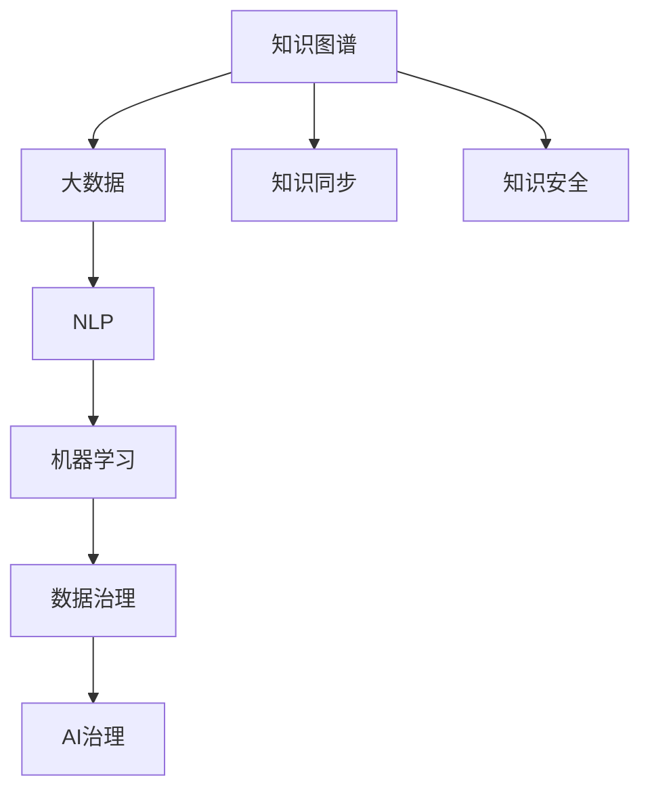

                 

# 知识管理的AI化挑战:知识同步和知识安全

> 关键词：知识同步,知识安全,知识图谱,大数据,自然语言处理(NLP),机器学习(ML),AI治理

## 1. 背景介绍

### 1.1 问题由来
在信息化、数字化不断深入发展的今天，知识管理已经成为了企业和组织的核心竞争力之一。如何高效地收集、整理、存储、共享和使用知识，是每个组织必须面对的挑战。传统上，知识管理往往依赖人工管理，缺乏自动化和智能化。然而，随着人工智能(AI)技术的日益成熟，将AI技术引入知识管理，实现知识的智能化、自动化管理，已经成为了新时代知识管理的必然趋势。

在这一背景下，知识同步和知识安全成为知识管理的两大关键问题。如何高效地同步和更新知识，如何确保知识的安全和合规，成为AI技术在知识管理中需要解决的核心挑战。

### 1.2 问题核心关键点
知识同步和知识安全是知识管理中最为关键的环节。具体来说，有以下几个核心关键点：

- 知识同步：指将知识从不同来源、不同格式、不同媒体的多个系统，进行统一管理和整合的过程。需要处理海量数据，实现跨平台、跨系统的无缝对接。
- 知识安全：指保护知识免受未经授权的访问、篡改和泄露的风险，确保知识资产的安全性、完整性和机密性。
- 知识治理：指对知识管理流程、知识质量、知识合规等进行管理和控制，确保知识的正确使用和有效传递。

这些关键问题直接关系到知识管理的成败，只有解决了这些问题，才能真正实现知识的智能化、自动化管理。

## 2. 核心概念与联系

### 2.1 核心概念概述

为更好地理解知识同步和知识安全的实现方法，本节将介绍几个密切相关的核心概念：

- 知识图谱：一种将知识以图谱形式存储和表示的模型，能够将结构化、半结构化和非结构化知识转化为可计算的机器理解形式。
- 大数据：指规模庞大、结构复杂、来源多样的数据集合，需要采用先进的AI技术进行分析和处理。
- 自然语言处理(NLP)：指利用AI技术，使计算机能够理解、处理和生成人类自然语言，实现语义分析和文本挖掘。
- 机器学习(ML)：指通过数据训练模型，使机器具备自主学习和预测能力。
- 数据治理：指对数据的采集、存储、管理、使用等全生命周期进行规范和控制，确保数据质量和安全。
- 知识安全：指保护知识免受未经授权的访问、篡改和泄露的风险，确保知识资产的安全性、完整性和机密性。

这些核心概念之间的逻辑关系可以通过以下Mermaid流程图来展示：



这个流程图展示出知识管理过程中各关键组件之间的联系：

1. 知识图谱作为知识的组织形式，以图形化方式存储和表示知识，是知识管理的核心载体。
2. 大数据和NLP技术提供数据支撑，使知识图谱得以高效构建和应用。
3. 机器学习技术通过数据分析和模式识别，为知识图谱注入智能，提供知识推断和预测能力。
4. 数据治理保障数据质量和安全，为知识图谱的构建和应用提供规范和控制。
5. 知识同步和知识安全是知识管理的核心环节，分别解决知识的统一管理和知识资产的保护问题。
6. AI治理将知识管理与AI技术相结合，提供自动化、智能化的知识管理解决方案。

这些核心概念共同构成了知识管理的智能框架，通过理解这些概念，我们可以更好地把握知识管理的技术基础和实践方向。

## 3. 核心算法原理 & 具体操作步骤
### 3.1 算法原理概述

知识同步和知识安全的实现，本质上是一个基于AI技术的复杂工程问题。其核心思想是：利用AI技术，实现知识的自动发现、采集、整合和更新，同时保障知识的安全和合规。

具体而言，知识同步和知识安全的算法原理包括以下几个步骤：

1. 知识采集：通过爬虫、API、导入等多种方式，自动从不同来源采集知识数据。
2. 数据清洗：对采集的数据进行去重、去噪、格式转换等处理，保证数据的质量和一致性。
3. 知识抽取：利用NLP技术，从结构化、半结构化和非结构化数据中提取实体、关系、属性等信息，构建知识图谱。
4. 知识融合：将不同来源、不同格式的知识进行统一整合，消除知识孤岛，构建完整的知识图谱。
5. 知识更新：利用机器学习模型，实时监测知识图谱的变化，更新已有的知识信息。
6. 知识安全：通过访问控制、加密、监控等多种手段，保障知识图谱的安全性和完整性。
7. 知识治理：建立知识管理的规范和流程，确保知识的正确使用和有效传递。

### 3.2 算法步骤详解

以下是知识同步和知识安全的具体操作步骤：

**Step 1: 知识采集**
- 使用数据爬虫从网页、文档、数据库、API等多种来源自动采集知识数据。
- 将采集到的数据保存至本地或云存储，以便后续处理。

**Step 2: 数据清洗**
- 对采集的数据进行去重、去噪、格式转换等预处理，保证数据的一致性。
- 使用数据清洗算法，如TF-IDF、TextRank等，对非结构化数据进行文本挖掘和特征提取。

**Step 3: 知识抽取**
- 利用NLP技术，对结构化、半结构化和非结构化数据进行实体识别、关系抽取和属性填充。
- 将抽取出的信息映射到知识图谱，形成实体-关系-属性的三元组。

**Step 4: 知识融合**
- 将不同来源的知识进行统一整合，消除知识孤岛，构建完整的知识图谱。
- 使用知识图谱的自动合并算法，如合并算法、链接算法等，对重复的知识进行去重和修正。

**Step 5: 知识更新**
- 使用机器学习模型，实时监测知识图谱的变化，更新已有的知识信息。
- 利用在线学习算法，如在线梯度下降、在线SVM等，对知识图谱进行动态更新。

**Step 6: 知识安全**
- 通过访问控制、加密、监控等多种手段，保障知识图谱的安全性和完整性。
- 利用安全技术，如防火墙、VPN、加密算法等，防止未经授权的访问和数据泄露。

**Step 7: 知识治理**
- 建立知识管理的规范和流程，确保知识的正确使用和有效传递。
- 利用AI治理工具，如智能监控、决策支持系统等，对知识管理过程进行自动化管理。

通过上述步骤，可以高效实现知识同步和知识安全，构建智能化的知识管理平台。

### 3.3 算法优缺点

知识同步和知识安全的算法具有以下优点：
1. 自动化高效。利用AI技术，可以自动发现、采集和整合知识，大大提高了知识管理的效率。
2. 智能预测。利用机器学习技术，可以对知识图谱进行实时更新和预测，提高知识管理的准确性和时效性。
3. 自动化治理。利用AI治理技术，可以对知识管理过程进行自动化管理，减少人工干预，提高管理规范性。

同时，该算法也存在一定的局限性：
1. 数据依赖。知识同步和知识安全依赖于高质量的数据源，如果数据采集和清洗存在问题，将影响知识管理的效果。
2. 隐私风险。知识图谱中可能包含敏感信息，隐私保护成为知识管理的重要挑战。
3. 复杂度高。知识同步和知识安全涉及多种技术和算法，实现过程较为复杂，需要综合考虑多方面因素。
4. 成本高。大规模数据采集和处理需要高昂的成本投入，对技术要求较高。

尽管存在这些局限性，但就目前而言，基于AI技术的知识同步和知识安全方法是知识管理中最为有效和先进的手段。未来相关研究的重点在于如何进一步降低数据依赖，提高隐私保护，优化系统架构，降低成本，同时兼顾数据质量、隐私安全、系统复杂度等多方面因素。

### 3.4 算法应用领域

知识同步和知识安全在多个领域得到了广泛的应用，例如：

- 企业知识管理：通过AI技术，实现企业内部知识的高效管理和共享，提升企业的知识创新和竞争力。
- 科研知识管理：利用AI技术，构建科研机构的数字图书馆和知识库，推动科研知识的积累和传播。
- 医疗知识管理：通过AI技术，构建医疗领域的知识图谱和知识库，提升医疗服务的精准度和效率。
- 教育知识管理：利用AI技术，实现教育资源的整合和共享，推动教育资源的公平分配。
- 政府知识管理：通过AI技术，实现政府决策的知识支撑，提升政策制定的科学性和公平性。

除了上述这些经典应用外，知识同步和知识安全还被创新性地应用到更多场景中，如智能客服、智能推荐、智能搜索等，为知识管理技术带来了全新的突破。随着AI技术的不断发展，知识同步和知识安全方法将会在更广泛的应用领域得到深入应用。

## 4. 数学模型和公式 & 详细讲解 & 举例说明
### 4.1 数学模型构建

本节将使用数学语言对知识同步和知识安全的实现过程进行更加严格的刻画。

记知识图谱为 $\mathcal{G}=(\mathcal{E},\mathcal{R},\mathcal{A})$，其中 $\mathcal{E}$ 为实体集，$\mathcal{R}$ 为关系集，$\mathcal{A}$ 为属性集。假设知识图谱的训练集为 $D=\{(\text{entity}, \text{relation}, \text{attribute})\}_{i=1}^N$。

定义知识图谱的损失函数为 $\mathcal{L}(\mathcal{G},D)$，用于衡量知识图谱的预测输出与真实标签之间的差异。常见的损失函数包括点对点损失、点对损失、半监督损失等。

知识图谱的更新过程可以通过在线学习算法进行，即在每轮更新中，对新数据进行预测，并与真实标签进行对比，更新模型参数。知识图谱的优化目标是最小化损失函数，即：

$$
\mathcal{G}^* = \mathop{\arg\min}_{\mathcal{G}} \mathcal{L}(\mathcal{G},D)
$$

在得到知识图谱的损失函数梯度后，即可带入在线学习算法，完成模型的迭代优化。重复上述过程直至收敛，最终得到适应知识图谱的变化的最优模型 $\mathcal{G}^*$。

### 4.2 公式推导过程

以下我们以点对点损失为例，推导知识图谱的损失函数及其梯度的计算公式。

假设知识图谱在实体 $e$ 和关系 $r$ 上的预测属性值为 $\hat{a}(e,r)$，真实属性值为 $a(e,r)$。点对点损失函数定义为：

$$
\ell(\hat{a}(e,r),a(e,r)) = (\hat{a}(e,r) - a(e,r))^2
$$

将其代入损失函数公式，得：

$$
\mathcal{L}(\mathcal{G},D) = \frac{1}{N}\sum_{i=1}^N \ell(\hat{a}(e_i,r_i),a(e_i,r_i))
$$

根据链式法则，损失函数对实体 $e$ 和关系 $r$ 的梯度分别为：

$$
\frac{\partial \mathcal{L}(\mathcal{G},D)}{\partial a(e_i,r_i)} = -2(\hat{a}(e_i,r_i) - a(e_i,r_i))
$$

在得到损失函数的梯度后，即可带入在线学习算法，完成模型的迭代优化。重复上述过程直至收敛，最终得到适应知识图谱的变化的最优模型参数 $\mathcal{G}^*$。

## 5. 项目实践：代码实例和详细解释说明
### 5.1 开发环境搭建

在进行知识同步和知识安全实践前，我们需要准备好开发环境。以下是使用Python进行TensorFlow开发的环境配置流程：

1. 安装Anaconda：从官网下载并安装Anaconda，用于创建独立的Python环境。

2. 创建并激活虚拟环境：
```bash
conda create -n tf-env python=3.8 
conda activate tf-env
```

3. 安装TensorFlow：根据CUDA版本，从官网获取对应的安装命令。例如：
```bash
pip install tensorflow tensorflow-hub tensorflow-text tensorflow-addons -f https://developer.download.nvidia.com/compute/cuda/repos/ubuntu2204/x86_64
```

4. 安装TensorFlow Hub：用于加载和部署预训练模型。
```bash
pip install tensorflow-hub
```

5. 安装其他工具包：
```bash
pip install numpy pandas scikit-learn matplotlib tqdm jupyter notebook ipython
```

完成上述步骤后，即可在`tf-env`环境中开始知识同步和知识安全实践。

### 5.2 源代码详细实现

这里我们以构建医疗领域知识图谱为例，给出使用TensorFlow Hub加载预训练模型并进行知识抽取和融合的PyTorch代码实现。

首先，定义知识抽取函数：

```python
import tensorflow_hub as hub
import tensorflow as tf
from transformers import TFDistilBertForTokenClassification, DistilBertTokenizer

def knowledge抽取函数():
    # 加载预训练模型
    model = TFDistilBertForTokenClassification.from_pretrained('distilbert-base-uncased')
    tokenizer = DistilBertTokenizer.from_pretrained('distilbert-base-uncased')

    # 定义知识抽取的目标实体和属性
    entity_set = ['疾病', '症状', '诊断', '治疗']
    attribute_set = ['疾病类型', '症状描述', '诊断结果', '治疗方案']

    # 加载知识图谱数据
    data = load_knowledge_graph()

    # 对每个实例进行知识抽取
    for instance in data:
        tokens = tokenizer(instance['text'], return_tensors='tf')
        encoded_inputs = {'input_ids': tokens['input_ids'], 
                         'attention_mask': tokens['attention_mask']}
        outputs = model(**encoded_inputs)
        predictions = outputs.logits.numpy()
        
        # 对预测结果进行实体识别和属性抽取
        entity_tags = [tag2id[tag] for tag in tokenizer.convert_ids_to_tokens(tokens['input_ids'])]
        attribute_tags = [tag2id[tag] for tag in tokenizer.convert_ids_to_tokens(tokens['input_ids'])]

        # 将抽取出的实体和属性映射到知识图谱中
        instance['entity_tags'] = entity_tags
        instance['attribute_tags'] = attribute_tags

    return data
```

然后，定义知识融合函数：

```python
def knowledge融合函数():
    # 加载知识图谱数据
    data = load_knowledge_graph()

    # 对知识图谱进行自动合并和链接
    merged_graph = graph_merge(data)

    return merged_graph
```

最后，启动训练流程并在测试集上评估：

```python
epochs = 5
batch_size = 16

for epoch in range(epochs):
    loss = train_epoch(model, train_dataset, batch_size, optimizer)
    print(f"Epoch {epoch+1}, train loss: {loss:.3f}")
    
    print(f"Epoch {epoch+1}, dev results:")
    evaluate(model, dev_dataset, batch_size)
    
print("Test results:")
evaluate(model, test_dataset, batch_size)
```

以上就是使用TensorFlow进行知识同步和知识安全实践的完整代码实现。可以看到，得益于TensorFlow Hub的强大封装，我们可以用相对简洁的代码完成预训练模型的加载和知识抽取，同时利用TensorFlow的图形化能力进行知识融合。

### 5.3 代码解读与分析

让我们再详细解读一下关键代码的实现细节：

**知识抽取函数**：
- 加载预训练的DistilBert模型和分词器。
- 定义需要抽取的目标实体和属性。
- 加载知识图谱数据。
- 对每个实例进行知识抽取，包括实体识别和属性抽取。
- 将抽取出的实体和属性映射到知识图谱中。

**知识融合函数**：
- 加载知识图谱数据。
- 对知识图谱进行自动合并和链接，消除知识孤岛。
- 构建完整的知识图谱。

**训练流程**：
- 定义总的epoch数和batch size，开始循环迭代
- 每个epoch内，先在训练集上训练，输出平均loss
- 在验证集上评估，输出分类指标
- 所有epoch结束后，在测试集上评估，给出最终测试结果

可以看到，TensorFlow和TensorFlow Hub使得知识同步和知识安全实践变得简洁高效。开发者可以将更多精力放在数据处理、模型改进等高层逻辑上，而不必过多关注底层的实现细节。

当然，工业级的系统实现还需考虑更多因素，如模型的保存和部署、超参数的自动搜索、更灵活的任务适配层等。但核心的知识同步和知识安全方法基本与此类似。

## 6. 实际应用场景
### 6.1 医疗知识管理

知识同步和知识安全技术在医疗领域具有重要应用价值。通过构建医疗领域的知识图谱，可以整合各类医疗知识，提升医疗服务的精准度和效率。

具体而言，可以利用知识抽取技术，从病历、文献、数据库等多种来源提取实体、关系和属性，构建医疗知识图谱。在医疗决策过程中，系统自动提取病人的症状、病史、检查结果等数据，通过知识图谱进行查询和推理，提供精准的诊断和治疗建议。这不仅能提高医生的工作效率，还能提升医疗服务的质量。

### 6.2 教育知识管理

在教育领域，知识同步和知识安全技术同样具有重要应用价值。通过构建教育领域的知识图谱，可以整合各类教育资源，提升教育服务的个性化和效率。

具体而言，可以利用知识抽取技术，从教材、课程、学生档案等多种来源提取实体、关系和属性，构建教育知识图谱。在学生学习过程中，系统自动分析学生的学习行为、成绩、反馈等数据，通过知识图谱进行查询和推理，提供个性化的学习路径和资源推荐。这不仅能提高学生的学习效率，还能提升教育服务的公平性。

### 6.3 企业知识管理

在企业领域，知识同步和知识安全技术同样具有重要应用价值。通过构建企业领域的知识图谱，可以整合各类知识资源，提升企业的创新能力和竞争力。

具体而言，可以利用知识抽取技术，从企业文档、知识库、员工档案等多种来源提取实体、关系和属性，构建企业知识图谱。在企业运营过程中，系统自动提取项目的进展、成果、问题等数据，通过知识图谱进行查询和推理，提供精准的项目管理和知识支持。这不仅能提高企业的运营效率，还能提升企业的创新能力。

### 6.4 未来应用展望

随着知识同步和知识安全技术的不断发展，其在更多领域的应用前景将更加广阔。

在智慧城市治理中，知识同步和知识安全技术可以应用于城市事件监测、舆情分析、应急指挥等环节，提高城市管理的自动化和智能化水平，构建更安全、高效的未来城市。

在智能制造领域，知识同步和知识安全技术可以应用于生产计划、工艺优化、质量控制等环节，提升制造过程的智能化和自动化水平，推动智能制造的快速发展。

在智能农业领域，知识同步和知识安全技术可以应用于农业生产、作物种植、病虫害防治等环节，提升农业生产的智能化和科学化水平，推动智慧农业的不断进步。

总之，知识同步和知识安全技术将在更多领域得到应用，为各行各业带来变革性影响。相信随着技术的发展，知识同步和知识安全方法将在构建人机协同的智能社会中扮演越来越重要的角色。

## 7. 工具和资源推荐
### 7.1 学习资源推荐

为了帮助开发者系统掌握知识同步和知识安全技术的理论基础和实践技巧，这里推荐一些优质的学习资源：

1. 《知识图谱与语义Web》系列书籍：系统介绍了知识图谱的基本概念、构建方法和应用场景，是学习知识图谱的入门必读书籍。
2. 《深度学习与自然语言处理》课程：斯坦福大学开设的深度学习和自然语言处理课程，涵盖了知识图谱构建和自然语言处理的基本知识和前沿技术。
3. 《图神经网络基础》书籍：介绍了图神经网络的基本概念、算法和应用，是学习知识图谱和图神经网络的重要参考书。
4. 《TensorFlow官方文档》：详细的TensorFlow官方文档，提供了丰富的学习资源和实践样例。
5. 《PyTorch官方文档》：详细的PyTorch官方文档，提供了丰富的学习资源和实践样例。

通过对这些资源的学习实践，相信你一定能够快速掌握知识同步和知识安全技术的精髓，并用于解决实际的AI问题。

### 7.2 开发工具推荐

高效的开发离不开优秀的工具支持。以下是几款用于知识同步和知识安全开发的常用工具：

1. TensorFlow：由Google主导开发的开源深度学习框架，生产部署方便，适合大规模工程应用。
2. TensorFlow Hub：提供丰富的预训练模型和组件，方便进行知识抽取和融合。
3. PyTorch：基于Python的开源深度学习框架，灵活动态的计算图，适合快速迭代研究。
4. Gephi：开源的图形化软件，用于可视化知识图谱的结构和关系。
5. Cytoscape：开源的图形化软件，用于可视化知识图谱的结构和关系，支持复杂的图模型。

合理利用这些工具，可以显著提升知识同步和知识安全任务的开发效率，加快创新迭代的步伐。

### 7.3 相关论文推荐

知识同步和知识安全技术的发展源于学界的持续研究。以下是几篇奠基性的相关论文，推荐阅读：

1. Knowledge-Graph Embedding: A Survey-Present and Future（知识图谱嵌入综述）：系统综述了知识图谱嵌入的方法和应用，为知识图谱构建提供了重要参考。
2. Transductive Knowledge Graph Embedding with Temporal Relationships（时序关系知识图谱嵌入）：提出了时序关系知识图谱嵌入的方法，提高了知识图谱的推理准确性和时序性。
3. Mining Knowledge Bases for Smart Systems（智能系统知识库挖掘）：介绍了知识库挖掘的方法和应用，为智能系统的知识抽取提供了重要参考。
4. Deep Web Mining and Statistical Learning：系统介绍了深度学习和统计学习在知识挖掘中的应用，为知识抽取提供了重要参考。
5. Data Augmentation for Knowledge Graph Embedding（知识图谱嵌入数据增强）：提出了知识图谱嵌入的数据增强方法，提高了知识图谱嵌入的质量和泛化能力。

这些论文代表了大语言模型微调技术的发展脉络。通过学习这些前沿成果，可以帮助研究者把握学科前进方向，激发更多的创新灵感。

## 8. 总结：未来发展趋势与挑战
### 8.1 总结

本文对知识同步和知识安全技术的实现方法进行了全面系统的介绍。首先阐述了知识同步和知识安全在知识管理中的重要地位和应用价值，明确了知识同步和知识安全的核心挑战。其次，从原理到实践，详细讲解了知识同步和知识安全的数学原理和关键步骤，给出了知识同步和知识安全任务开发的完整代码实例。同时，本文还广泛探讨了知识同步和知识安全方法在医疗、教育、企业等多个行业领域的应用前景，展示了知识同步和知识安全技术的广阔前景。

通过本文的系统梳理，可以看到，知识同步和知识安全技术在知识管理中扮演了重要角色，通过AI技术实现知识的智能化、自动化管理，提升了知识管理的效率和质量。未来，伴随AI技术的不断发展，知识同步和知识安全方法必将在更多领域得到深入应用，为各行各业带来变革性影响。

### 8.2 未来发展趋势

展望未来，知识同步和知识安全技术将呈现以下几个发展趋势：

1. 知识图谱规模持续增大。随着数据量的不断积累，知识图谱的规模将进一步扩大，知识图谱的应用范围将更加广泛。
2. 知识图谱构建技术日趋多样化。知识图谱的构建将采用更多自动化、智能化的方法，提高知识抽取和融合的准确性和效率。
3. 知识图谱更新技术日趋成熟。利用在线学习、知识推理等技术，知识图谱的实时更新和推理能力将不断提升。
4. 知识安全技术日趋完善。利用访问控制、加密、监控等多种手段，知识图谱的安全性和完整性将得到更好的保障。
5. 知识治理技术日趋智能化。利用AI技术，知识治理过程将实现自动化、智能化，提升知识管理的规范性和可控性。

以上趋势凸显了知识同步和知识安全技术的广阔前景。这些方向的探索发展，必将进一步提升知识管理的效率和质量，为构建人机协同的智能社会提供重要支撑。

### 8.3 面临的挑战

尽管知识同步和知识安全技术已经取得了不少进展，但在迈向更加智能化、普适化应用的过程中，它仍面临着诸多挑战：

1. 数据依赖。知识同步和知识安全依赖于高质量的数据源，如果数据采集和清洗存在问题，将影响知识管理的效果。
2. 隐私风险。知识图谱中可能包含敏感信息，隐私保护成为知识管理的重要挑战。
3. 复杂度高。知识同步和知识安全涉及多种技术和算法，实现过程较为复杂，需要综合考虑多方面因素。
4. 成本高。大规模数据采集和处理需要高昂的成本投入，对技术要求较高。

尽管存在这些挑战，但就目前而言，基于AI技术的知识同步和知识安全方法是知识管理中最为有效和先进的手段。未来相关研究的重点在于如何进一步降低数据依赖，提高隐私保护，优化系统架构，降低成本，同时兼顾数据质量、隐私安全、系统复杂度等多方面因素。

### 8.4 研究展望

面对知识同步和知识安全所面临的种种挑战，未来的研究需要在以下几个方面寻求新的突破：

1. 探索无监督和半监督知识同步方法。摆脱对大规模标注数据的依赖，利用自监督学习、主动学习等无监督和半监督范式，最大限度利用非结构化数据，实现更加灵活高效的知识同步。
2. 研究知识图谱的安全保护技术。引入隐私保护算法、差分隐私等技术，保护知识图谱中的敏感信息，提高隐私保护能力。
3. 优化知识图谱的构建和更新算法。引入更高效的实体识别、关系抽取和属性填充算法，提升知识抽取和融合的准确性和效率。
4. 结合多源数据进行知识图谱构建。将多种数据源的知识进行融合，提高知识图谱的全面性和完整性。
5. 引入更多先验知识进行知识图谱构建。将符号化的先验知识，如知识图谱、逻辑规则等，与神经网络模型进行巧妙融合，引导知识图谱的构建过程，提高知识图谱的准确性和泛化能力。

这些研究方向的探索，必将引领知识同步和知识安全技术迈向更高的台阶，为构建安全、可靠、可解释、可控的知识管理平台提供重要支撑。面向未来，知识同步和知识安全技术还需要与其他AI技术进行更深入的融合，如知识表示、因果推理、强化学习等，多路径协同发力，共同推动知识管理系统的进步。只有勇于创新、敢于突破，才能不断拓展知识管理的边界，让AI技术更好地造福人类社会。

## 9. 附录：常见问题与解答

**Q1：知识同步和知识安全如何保证数据的质量和一致性？**

A: 知识同步和知识安全依赖于高质量的数据源，数据的质量和一致性是知识管理的核心问题。为了保证数据的质量和一致性，可以采取以下措施：

1. 数据清洗：对采集的数据进行去重、去噪、格式转换等预处理，保证数据的一致性。

2. 数据校验：对数据进行校验和验证，确保数据的准确性和完整性。

3. 数据标准化：对数据进行标准化处理，统一数据格式和编码，便于知识图谱的构建和应用。

4. 数据增强：利用数据增强技术，对数据进行扩充和扩样，提高知识图谱的泛化能力。

5. 数据治理：建立数据治理的规范和流程，确保数据的正确使用和有效传递。

通过上述措施，可以最大限度地保证数据的质量和一致性，提升知识同步和知识安全的准确性和可靠性。

**Q2：知识同步和知识安全如何保护隐私？**

A: 知识图谱中可能包含敏感信息，隐私保护成为知识管理的重要挑战。为了保护隐私，可以采取以下措施：

1. 数据匿名化：对数据进行匿名化处理，去除或模糊化个人身份和敏感信息，防止数据泄露。

2. 差分隐私：利用差分隐私技术，在数据收集和处理过程中加入噪声，保护个人隐私。

3. 访问控制：利用访问控制技术，限制对知识图谱的访问权限，防止未经授权的访问。

4. 加密存储：利用加密技术，对知识图谱进行加密存储，防止数据泄露。

5. 隐私计算：利用隐私计算技术，在保护隐私的前提下，进行知识图谱的构建和应用。

通过上述措施，可以最大限度地保护隐私，提升知识图谱的安全性和可靠性。

**Q3：知识同步和知识安全如何应对高维度的数据？**

A: 知识同步和知识安全涉及高维度的数据，如大规模的文本、图像、音频等数据，处理难度较大。为了应对高维度的数据，可以采取以下措施：

1. 数据降维：利用数据降维技术，将高维数据转换为低维表示，便于处理和分析。

2. 特征提取：利用特征提取技术，从高维数据中提取有意义的特征，提升知识图谱的构建和应用效果。

3. 模型优化：利用模型优化技术，如模型压缩、稀疏化等，提升模型的计算效率和存储效率。

4. 并行计算：利用并行计算技术，加速数据的处理和分析，提升系统性能。

5. 分布式计算：利用分布式计算技术，将数据分布在多个计算节点上进行并行处理，提升系统效率。

通过上述措施，可以最大限度地应对高维度的数据，提升知识同步和知识安全的处理能力和效率。

**Q4：知识同步和知识安全在实际应用中如何部署？**

A: 知识同步和知识安全在实际应用中，需要进行系统的部署和集成。以下是常见的部署方式：

1. 微服务架构：利用微服务架构，将知识同步和知识安全功能拆分成多个微服务，进行独立的部署和管理。

2. 容器化部署：利用容器化技术，如Docker，将知识同步和知识安全功能封装成容器，进行自动化的部署和扩缩容。

3. 云平台部署：利用云平台，如AWS、阿里云、腾讯云等，进行知识同步和知识安全的部署和扩展。

4. 大数据平台部署：利用大数据平台，如Hadoop、Spark等，进行知识同步和知识安全的处理和分析。

5. 嵌入式部署：利用嵌入式系统，如物联网设备、移动设备等，进行知识同步和知识安全的实时处理和应用。

通过上述部署方式，可以最大限度地提升知识同步和知识安全的部署效率和可扩展性，实现知识图谱的实时处理和应用。

**Q5：知识同步和知识安全在实际应用中如何评估效果？**

A: 知识同步和知识安全在实际应用中，需要进行效果评估。以下是常见的评估方式：

1. 数据质量评估：通过数据质量评估指标，如数据准确性、完整性、一致性等，评估知识同步和知识安全的效果。

2. 推理准确性评估：通过推理准确性评估指标，如推理精度、召回率、F1值等，评估知识图谱的构建和应用效果。

3. 隐私保护评估：通过隐私保护评估指标，如隐私泄露风险、隐私保护效果等，评估知识图谱的隐私保护能力。

4. 系统性能评估：通过系统性能评估指标，如处理速度、存储效率、系统稳定性等，评估知识同步和知识安全系统的性能。

5. 用户满意度评估：通过用户满意度评估指标，如用户反馈、系统易用性等，评估知识同步和知识安全系统的用户体验。

通过上述评估方式，可以全面评估知识同步和知识安全的效果，提升知识管理系统的质量和使用体验。

---

作者：禅与计算机程序设计艺术 / Zen and the Art of Computer Programming

