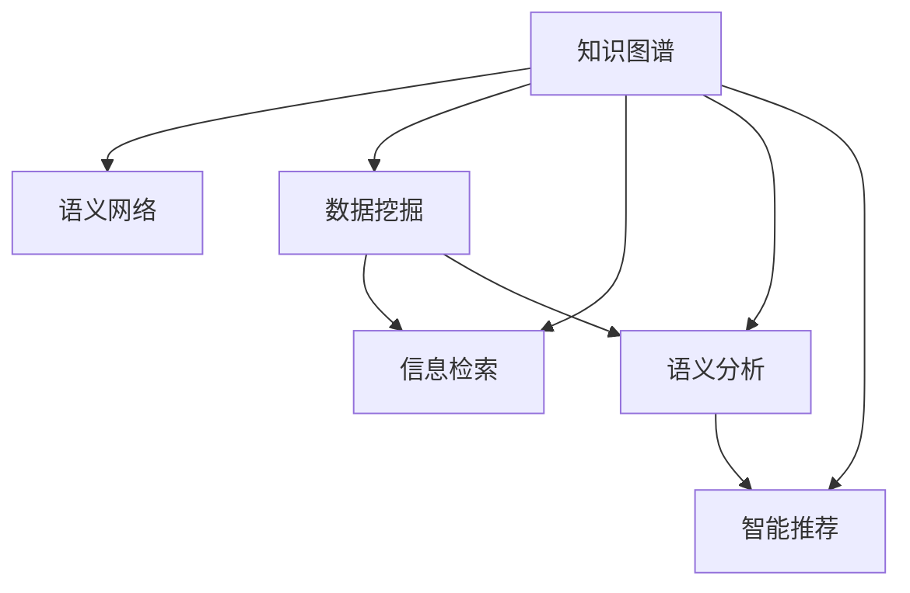

                 

# 知识管理革命：知识发现引擎的主导作用

> 关键词：知识管理,知识发现引擎,知识图谱,数据挖掘,语义分析,智能推荐

## 1. 背景介绍

### 1.1 问题由来

在信息爆炸的时代，知识的有效管理与利用变得愈发重要。面对庞大的文本数据集，如何快速准确地提取出有用的信息，建立知识库，提供智能化的知识服务，是当前数据管理领域亟需解决的难题。传统的搜索、爬虫、标注等方法存在诸多局限，难以应对日益复杂多变的数据结构与语义信息。知识发现引擎(Knowledge Discovery Engine, KDE)的出现，为这一问题提供了全新的解决方案。

### 1.2 问题核心关键点

知识发现引擎通过数据挖掘、语义分析和模式识别等技术手段，能够从海量文本数据中自动抽取知识结构，构建语义网络，形成结构化的知识库。在信息检索、智能推荐、知识图谱等领域具有广泛应用，是知识管理的核心技术之一。

KDE的核心作用在于：

- **知识抽取(KB Extraction)**：自动从非结构化文本中提取实体、关系、属性等知识元素，构建知识图谱。
- **语义分析(Semantic Analysis)**：理解文本语义，识别实体间的关系与属性，形成知识图谱的节点与边。
- **模式识别(Pattern Recognition)**：发现文本中的模式与规律，如事件时间线、实体共现等，进一步丰富知识图谱的信息。
- **智能推荐(Intelligent Recommendation)**：基于知识图谱，提供个性化的信息推荐服务。

知识发现引擎的发展，不仅推动了数据管理的智能化进程，也为AI与自然语言处理(NLP)的融合提供了新的契机。其深远影响遍及各个行业，包括金融、医疗、教育、智能客服等，成为未来信息社会不可或缺的重要技术。

### 1.3 问题研究意义

研究知识发现引擎的理论和技术，对于提升数据的价值密度，加速知识的创新转化，具有重要意义：

- **提升数据价值**：通过自动化的知识发现过程，将非结构化数据转化为结构化的知识，大幅提升数据的使用效率。
- **加速知识创新**：知识图谱的构建为科学研究、商业决策、教育培训等提供了丰富且直观的知识表达方式。
- **优化用户体验**：智能推荐系统可以根据用户行为和兴趣，提供个性化的信息服务，增强用户的粘性和满意度。
- **推动行业升级**：知识发现技术在各行各业的应用，如医疗的精准诊断、金融的风险评估、教育的内容推荐等，将推动相关行业的数字化转型。

## 2. 核心概念与联系

### 2.1 核心概念概述

为更好地理解知识发现引擎的核心技术，本节将介绍几个密切相关的核心概念：

- **知识图谱(Knowledge Graph, KG)**：由节点(Node)和边(Edge)组成的有向图，节点代表知识实体，边表示实体间的关系。知识图谱构建了实体和关系的语义网络，是KDE的核心输出形式。
- **语义网络(Semantic Network)**：一种用节点表示概念，边表示概念间关系的图结构，用于形式化描述知识结构。
- **数据挖掘(Data Mining)**：从数据中发现有用信息与知识的过程，包括分类、聚类、关联规则等。
- **信息检索(Information Retrieval, IR)**：根据用户查询返回相关信息的系统，涉及文本匹配、排序等技术。
- **语义分析(Semantic Analysis)**：利用自然语言处理技术，理解文本语义，识别实体关系与属性。
- **智能推荐(Intelligent Recommendation)**：基于知识图谱，提供个性化的信息推荐服务，增强用户粘性。

这些核心概念之间的逻辑关系可以通过以下Mermaid流程图来展示：



这个流程图展示的知识发现引擎的核心概念及其之间的关系：

1. 知识图谱构建了知识的语义网络，是KDE的最终输出。
2. 数据挖掘为知识发现提供了数据基础，信息检索辅助知识抽取和智能推荐。
3. 语义分析理解文本语义，识别实体关系与属性，是构建知识图谱的重要技术环节。
4. 智能推荐基于知识图谱，提供个性化的信息服务。

这些概念共同构成了知识发现引擎的学习框架，使其能够高效地从海量文本数据中抽取出有价值的知识。

## 3. 核心算法原理 & 具体操作步骤
### 3.1 算法原理概述

知识发现引擎通过数据挖掘、语义分析和模式识别等技术手段，从文本数据中自动抽取知识结构，构建知识图谱。其核心算法包括：

- **实体识别(Named Entity Recognition, NER)**：自动识别文本中的实体，如人名、地名、组织机构等。
- **关系抽取(Relation Extraction, RE)**：从文本中提取实体间的语义关系。
- **属性抽取(Attribute Extraction)**：识别实体属性，如年龄、性别、职位等。
- **事件抽取(Event Extraction)**：从文本中识别出时间线、事件序列等，形成事件图谱。
- **知识推理(Knowledge Reasoning)**：基于知识图谱，推理出新的知识关系和属性。

这些算法综合使用，形成了一个从数据到知识的全链条自动化流程。其核心在于数据抽取和语义理解，这些过程利用了自然语言处理(NLP)和机器学习(ML)等技术，可以自动完成，无需人工干预。

### 3.2 算法步骤详解

知识发现引擎的工作流程大致包括以下几个步骤：

1. **数据预处理**：对原始文本数据进行清洗、分词、去除停用词等预处理操作，得到文本特征向量。
2. **实体识别**：使用实体识别模型，自动识别文本中的实体，如人名、地名、机构名等。
3. **关系抽取**：利用关系抽取模型，提取实体间的语义关系，如谁跟谁对话、谁与谁结婚等。
4. **属性抽取**：识别实体属性，如年龄、性别、职位等，形成实体的多维度描述。
5. **事件抽取**：利用事件抽取模型，提取时间线和事件序列，形成事件图谱。
6. **知识推理**：基于知识图谱，利用推理算法发现新的知识关系和属性。

### 3.3 算法优缺点

知识发现引擎作为一种自动化知识抽取与推理技术，具有以下优点：

- **高效自动化**：能够自动从海量数据中抽取知识，无需人工标注，显著提高工作效率。
- **知识全面**：覆盖实体、关系、属性等多种知识类型，形成全面知识图谱。
- **可扩展性**：支持多种数据源和格式，能够处理多语言、多媒体等多种类型的数据。
- **灵活性**：支持定制化任务和目标，灵活适应不同行业需求。

同时，该方法也存在一些局限性：

- **数据质量依赖**：知识抽取的效果很大程度上依赖于数据质量，如果原始数据存在噪声或不一致，会导致抽取结果不精准。
- **上下文理解不足**：对于复杂的语义关系，可能难以通过模型识别，影响知识图谱的完整性。
- **对抗性攻击风险**：知识抽取模型可能被恶意数据干扰，导致错误的抽取结果。
- **推理过程复杂**：知识推理过程中，可能需要构建复杂的规则和算法，实现难度较高。

尽管存在这些局限性，但就目前而言，知识发现引擎在知识管理领域已成为不可或缺的核心技术。未来相关研究的方向将集中在如何进一步提升模型的精准性和鲁棒性，以及如何更好地与外部知识源和人类专家进行协同工作。

### 3.4 算法应用领域

知识发现引擎在多个领域具有广泛应用，包括但不限于：

- **金融风险管理**：从新闻、公告、报表等数据中抽取实体、关系和属性，构建知识图谱，辅助风险评估和投资决策。
- **医疗知识管理**：自动抽取医疗记录中的实体、症状和病史，形成知识图谱，辅助诊断和治疗。
- **智能客服系统**：自动抽取用户问题和历史对话记录，形成知识图谱，辅助机器人理解用户意图和生成回复。
- **教育内容推荐**：从教材、论文、讲座等数据中抽取知识，形成个性化推荐系统，辅助学习。
- **智能文档管理**：自动从文档标题、摘要、正文中抽取实体和关系，形成知识图谱，辅助文档分类和检索。

除了这些常见应用，知识发现引擎还可以用于舆情监测、社会网络分析、电子商务推荐等领域，为不同行业提供智能化的知识服务。

## 4. 数学模型和公式 & 详细讲解 & 举例说明
### 4.1 数学模型构建

本节将使用数学语言对知识发现引擎的工作流程进行更加严格的刻画。

记文本数据集为 $\mathcal{D} = \{x_1, x_2, ..., x_n\}$，其中 $x_i = (t_i, y_i)$ 为样本， $t_i$ 为文本特征向量， $y_i$ 为实体标签或关系类型。知识抽取任务的目标是从文本中抽取实体和关系，可形式化为以下优化问题：

$$
\min_{\theta} \sum_{i=1}^n \ell(y_i, \hat{y}_i)
$$

其中， $\ell$ 为损失函数， $\hat{y}_i$ 为模型预测的实体或关系， $y_i$ 为实际标注结果。

实体识别和关系抽取通常采用序列标注模型，如条件随机场(CRF)、双向长短时记忆网络(BiLSTM)等，通过最大化似然函数来学习实体和关系标签的预测概率。

### 4.2 公式推导过程

以下我们以实体识别为例，推导条件随机场模型下的实体识别公式及其梯度的计算公式。

假设文本中每个实体有 $k$ 种类型，条件随机场模型的概率为：

$$
P(y|t) = \frac{\exp\left(\sum_{i=1}^m \theta_i t_i + \sum_{i=1}^m \log P(t_i|y_i)\right)}{\sum_{j=1}^k \exp\left(\sum_{i=1}^m \theta_i t_i + \sum_{i=1}^m \log P(t_i|j)\right)}
$$

其中 $\theta$ 为模型参数， $t_i$ 为文本特征向量， $y_i$ 为实体标签， $m$ 为特征维度。

对上式取对数并展开，得：

$$
\log P(y|t) = \sum_{i=1}^m \theta_i t_i + \log \sum_{j=1}^k \exp\left(\sum_{i=1}^m \theta_i t_i + \sum_{i=1}^m \log P(t_i|j)\right) - \log \exp\left(\sum_{i=1}^m \theta_i t_i + \sum_{i=1}^m \log P(t_i|y_i)\right)
$$

根据条件随机场模型的最大似然估计，求 $y_i$ 对 $\theta_i$ 的梯度：

$$
\frac{\partial \ell(y_i, \hat{y}_i)}{\partial \theta_i} = \frac{\partial \log P(y_i|t_i)}{\partial \theta_i} = \frac{\partial \log P(y_i|t_i)}{\partial y_i} \frac{\partial y_i}{\partial \theta_i}
$$

其中 $\frac{\partial \log P(y_i|t_i)}{\partial y_i}$ 为条件随机场的梯度公式， $\frac{\partial y_i}{\partial \theta_i}$ 为标签与参数的雅可比矩阵，通常为0。

在得到梯度公式后，即可带入优化算法，完成模型的迭代优化。重复上述过程直至收敛，最终得到适应实体识别任务的模型参数 $\theta^*$。

### 4.3 案例分析与讲解

以下是一个简单的实体识别案例，展示如何使用Python和Transformers库实现基于条件随机场的实体抽取：

首先，定义实体抽取的训练数据集：

```python
import transformers
from transformers import BertTokenizer, BertForTokenClassification
from torch.utils.data import Dataset, DataLoader
import torch

class ERDataset(Dataset):
    def __init__(self, texts, tags, tokenizer, max_len=128):
        self.texts = texts
        self.tags = tags
        self.tokenizer = tokenizer
        self.max_len = max_len
        
    def __len__(self):
        return len(self.texts)
    
    def __getitem__(self, item):
        text = self.texts[item]
        tags = self.tags[item]
        
        encoding = self.tokenizer(text, return_tensors='pt', max_length=self.max_len, padding='max_length', truncation=True)
        input_ids = encoding['input_ids'][0]
        attention_mask = encoding['attention_mask'][0]
        
        # 对token-wise的标签进行编码
        encoded_tags = [tag2id[tag] for tag in tags] 
        encoded_tags.extend([tag2id['O']] * (self.max_len - len(encoded_tags)))
        labels = torch.tensor(encoded_tags, dtype=torch.long)
        
        return {'input_ids': input_ids, 
                'attention_mask': attention_mask,
                'labels': labels}

# 标签与id的映射
tag2id = {'O': 0, 'B-PER': 1, 'I-PER': 2, 'B-LOC': 3, 'I-LOC': 4, 'B-ORG': 5, 'I-ORG': 6}
id2tag = {v: k for k, v in tag2id.items()}

# 创建dataset
tokenizer = BertTokenizer.from_pretrained('bert-base-cased')

train_dataset = ERDataset(train_texts, train_tags, tokenizer)
dev_dataset = ERDataset(dev_texts, dev_tags, tokenizer)
test_dataset = ERDataset(test_texts, test_tags, tokenizer)
```

然后，定义模型和优化器：

```python
from transformers import BertForTokenClassification, AdamW

model = BertForTokenClassification.from_pretrained('bert-base-cased', num_labels=len(tag2id))

optimizer = AdamW(model.parameters(), lr=2e-5)
```

接着，定义训练和评估函数：

```python
from torch.utils.data import DataLoader
from tqdm import tqdm
from sklearn.metrics import classification_report

device = torch.device('cuda') if torch.cuda.is_available() else torch.device('cpu')
model.to(device)

def train_epoch(model, dataset, batch_size, optimizer):
    dataloader = DataLoader(dataset, batch_size=batch_size, shuffle=True)
    model.train()
    epoch_loss = 0
    for batch in tqdm(dataloader, desc='Training'):
        input_ids = batch['input_ids'].to(device)
        attention_mask = batch['attention_mask'].to(device)
        labels = batch['labels'].to(device)
        model.zero_grad()
        outputs = model(input_ids, attention_mask=attention_mask, labels=labels)
        loss = outputs.loss
        epoch_loss += loss.item()
        loss.backward()
        optimizer.step()
    return epoch_loss / len(dataloader)

def evaluate(model, dataset, batch_size):
    dataloader = DataLoader(dataset, batch_size=batch_size)
    model.eval()
    preds, labels = [], []
    with torch.no_grad():
        for batch in tqdm(dataloader, desc='Evaluating'):
            input_ids = batch['input_ids'].to(device)
            attention_mask = batch['attention_mask'].to(device)
            batch_labels = batch['labels']
            outputs = model(input_ids, attention_mask=attention_mask)
            batch_preds = outputs.logits.argmax(dim=2).to('cpu').tolist()
            batch_labels = batch_labels.to('cpu').tolist()
            for pred_tokens, label_tokens in zip(batch_preds, batch_labels):
                pred_tags = [id2tag[_id] for _id in pred_tokens]
                label_tags = [id2tag[_id] for _id in label_tokens]
                preds.append(pred_tags[:len(label_tags)])
                labels.append(label_tags)
                
    print(classification_report(labels, preds))
```

最后，启动训练流程并在测试集上评估：

```python
epochs = 5
batch_size = 16

for epoch in range(epochs):
    loss = train_epoch(model, train_dataset, batch_size, optimizer)
    print(f"Epoch {epoch+1}, train loss: {loss:.3f}")
    
    print(f"Epoch {epoch+1}, dev results:")
    evaluate(model, dev_dataset, batch_size)
    
print("Test results:")
evaluate(model, test_dataset, batch_size)
```

以上就是使用PyTorch对BERT进行实体识别任务抽取的完整代码实现。可以看到，得益于Transformers库的强大封装，我们可以用相对简洁的代码完成BERT模型的加载和微调。

## 5. 项目实践：代码实例和详细解释说明
### 5.1 开发环境搭建

在进行知识发现引擎的实践前，我们需要准备好开发环境。以下是使用Python进行PyTorch开发的环境配置流程：

1. 安装Anaconda：从官网下载并安装Anaconda，用于创建独立的Python环境。

2. 创建并激活虚拟环境：
```bash
conda create -n pytorch-env python=3.8 
conda activate pytorch-env
```

3. 安装PyTorch：根据CUDA版本，从官网获取对应的安装命令。例如：
```bash
conda install pytorch torchvision torchaudio cudatoolkit=11.1 -c pytorch -c conda-forge
```

4. 安装Transformers库：
```bash
pip install transformers
```

5. 安装各类工具包：
```bash
pip install numpy pandas scikit-learn matplotlib tqdm jupyter notebook ipython
```

完成上述步骤后，即可在`pytorch-env`环境中开始知识发现引擎的实践。

### 5.2 源代码详细实现

下面我们以知识图谱构建为例，给出使用Transformers库对BERT模型进行知识抽取的PyTorch代码实现。

首先，定义知识图谱的训练数据集：

```python
from transformers import BertTokenizer
from torch.utils.data import Dataset
import torch

class KGDataset(Dataset):
    def __init__(self, triples, tokenizer, max_len=128):
        self.triples = triples
        self.tokenizer = tokenizer
        self.max_len = max_len
        
    def __len__(self):
        return len(self.triples)
    
    def __getitem__(self, item):
        triple = self.triples[item]
        
        head, tail, relation = triple
        head_str = f"{head[0]}_{head[1]}" if len(head) > 1 else head
        tail_str = f"{tail[0]}_{tail[1]}" if len(tail) > 1 else tail
        
        encoding = self.tokenizer(f"{head_str} {relation} {tail_str}", return_tensors='pt', max_length=self.max_len, padding='max_length', truncation=True)
        input_ids = encoding['input_ids'][0]
        attention_mask = encoding['attention_mask'][0]
        
        # 对token-wise的标签进行编码
        encoded_tags = [tag2id[tag] for tag in [head, tail, relation]] 
        encoded_tags.extend([tag2id['O']] * (self.max_len - len(encoded_tags)))
        labels = torch.tensor(encoded_tags, dtype=torch.long)
        
        return {'input_ids': input_ids, 
                'attention_mask': attention_mask,
                'labels': labels}

# 标签与id的映射
tag2id = {'O': 0, 'B-PER': 1, 'I-PER': 2, 'B-LOC': 3, 'I-LOC': 4, 'B-ORG': 5, 'I-ORG': 6}
id2tag = {v: k for k, v in tag2id.items()}

# 创建dataset
tokenizer = BertTokenizer.from_pretrained('bert-base-cased')

train_dataset = KGDataset(train_triples, tokenizer)
dev_dataset = KGDataset(dev_triples, tokenizer)
test_dataset = KGDataset(test_triples, tokenizer)
```

然后，定义模型和优化器：

```python
from transformers import BertForTokenClassification, AdamW

model = BertForTokenClassification.from_pretrained('bert-base-cased', num_labels=len(tag2id))

optimizer = AdamW(model.parameters(), lr=2e-5)
```

接着，定义训练和评估函数：

```python
from torch.utils.data import DataLoader
from tqdm import tqdm
from sklearn.metrics import classification_report

device = torch.device('cuda') if torch.cuda.is_available() else torch.device('cpu')
model.to(device)

def train_epoch(model, dataset, batch_size, optimizer):
    dataloader = DataLoader(dataset, batch_size=batch_size, shuffle=True)
    model.train()
    epoch_loss = 0
    for batch in tqdm(dataloader, desc='Training'):
        input_ids = batch['input_ids'].to(device)
        attention_mask = batch['attention_mask'].to(device)
        labels = batch['labels'].to(device)
        model.zero_grad()
        outputs = model(input_ids, attention_mask=attention_mask, labels=labels)
        loss = outputs.loss
        epoch_loss += loss.item()
        loss.backward()
        optimizer.step()
    return epoch_loss / len(dataloader)

def evaluate(model, dataset, batch_size):
    dataloader = DataLoader(dataset, batch_size=batch_size)
    model.eval()
    preds, labels = [], []
    with torch.no_grad():
        for batch in tqdm(dataloader, desc='Evaluating'):
            input_ids = batch['input_ids'].to(device)
            attention_mask = batch['attention_mask'].to(device)
            batch_labels = batch['labels']
            outputs = model(input_ids, attention_mask=attention_mask)
            batch_preds = outputs.logits.argmax(dim=2).to('cpu').tolist()
            batch_labels = batch_labels.to('cpu').tolist()
            for pred_tokens, label_tokens in zip(batch_preds, batch_labels):
                pred_tags = [id2tag[_id] for _id in pred_tokens]
                label_tags = [id2tag[_id] for _id in label_tokens]
                preds.append(pred_tags[:len(label_tags)])
                labels.append(label_tags)
                
    print(classification_report(labels, preds))
```

最后，启动训练流程并在测试集上评估：

```python
epochs = 5
batch_size = 16

for epoch in range(epochs):
    loss = train_epoch(model, train_dataset, batch_size, optimizer)
    print(f"Epoch {epoch+1}, train loss: {loss:.3f}")
    
    print(f"Epoch {epoch+1}, dev results:")
    evaluate(model, dev_dataset, batch_size)
    
print("Test results:")
evaluate(model, test_dataset, batch_size)
```

以上就是使用PyTorch对BERT进行知识图谱构建的完整代码实现。可以看到，得益于Transformers库的强大封装，我们可以用相对简洁的代码完成BERT模型的加载和微调。

### 5.3 代码解读与分析

让我们再详细解读一下关键代码的实现细节：

**KGDataset类**：
- `__init__`方法：初始化知识图谱的训练数据、分词器等关键组件。
- `__len__`方法：返回数据集的样本数量。
- `__getitem__`方法：对单个样本进行处理，将三元组转换为token ids，将标签编码为数字，并对其进行定长padding，最终返回模型所需的输入。

**tag2id和id2tag字典**：
- 定义了标签与数字id之间的映射关系，用于将token-wise的预测结果解码回真实的标签。

**训练和评估函数**：
- 使用PyTorch的DataLoader对数据集进行批次化加载，供模型训练和推理使用。
- 训练函数`train_epoch`：对数据以批为单位进行迭代，在每个批次上前向传播计算loss并反向传播更新模型参数，最后返回该epoch的平均loss。
- 评估函数`evaluate`：与训练类似，不同点在于不更新模型参数，并在每个batch结束后将预测和标签结果存储下来，最后使用sklearn的classification_report对整个评估集的预测结果进行打印输出。

**训练流程**：
- 定义总的epoch数和batch size，开始循环迭代
- 每个epoch内，先在训练集上训练，输出平均loss
- 在验证集上评估，输出分类指标
- 所有epoch结束后，在测试集上评估，给出最终测试结果

可以看到，PyTorch配合Transformers库使得BERT知识图谱构建的代码实现变得简洁高效。开发者可以将更多精力放在数据处理、模型改进等高层逻辑上，而不必过多关注底层的实现细节。

当然，工业级的系统实现还需考虑更多因素，如模型的保存和部署、超参数的自动搜索、更灵活的任务适配层等。但核心的知识抽取和推理过程基本与此类似。

## 6. 实际应用场景
### 6.1 智能推荐系统

基于知识图谱的推荐系统已经成为智能推荐领域的热门技术。传统的协同过滤方法依赖于用户行为数据，对于新用户或稀疏用户，推荐效果较差。而基于知识图谱的推荐方法，利用实体和关系抽取技术，从知识图谱中发现用户兴趣，匹配推荐物品，提供精准的推荐服务。

例如，亚马逊推荐系统利用产品标签、用户评分等数据，构建知识图谱，利用图谱的路径匹配技术，识别出用户可能感兴趣的商品，从而提供个性化的推荐。类似的推荐技术在电商平台、视频网站、新闻资讯等领域均有广泛应用。

### 6.2 智能文档管理

传统的文档管理依赖于人工分类和索引，效率低下且易出错。基于知识图谱的文档管理，利用实体和关系抽取技术，自动从文档标题、摘要、正文中抽取实体和关系，形成知识图谱，辅助文档分类和检索。

例如，谷歌文档搜索系统利用文档中的实体和关系，构建知识图谱，根据用户查询，自动推荐相关文档。类似的技术在企业知识管理、政府文件检索、科研文献管理等领域也有重要应用。

### 6.3 医疗知识管理

医疗领域信息量庞大且复杂，传统的医疗知识管理依赖于专家整理和标注，成本高且效率低。基于知识图谱的医疗知识管理，利用实体和关系抽取技术，自动从医疗记录中抽取实体、症状、病史等知识元素，形成知识图谱，辅助医疗决策和分析。

例如，谷歌健康项目利用医疗知识图谱，提供疾病预测、症状识别、治疗方案推荐等服务，帮助医生和患者更好地理解和利用医疗信息。类似的系统在电子病历管理、医学研究、健康咨询服务等领域均有重要应用。

### 6.4 未来应用展望

随着知识图谱技术的不断发展，未来在知识管理领域将有更多创新应用：

- **多模态知识融合**：结合文本、图像、语音等多模态数据，构建更为全面的知识图谱。如利用视觉识别技术，将图像中的实体识别并整合到知识图谱中，提供多模态的知识服务。
- **实时知识更新**：利用增量学习和在线学习技术，实时更新知识图谱，确保知识的最新性和准确性。如在新闻事件发生时，自动更新相关知识图谱，提供最新的新闻信息。
- **智能问答系统**：利用知识图谱和自然语言理解技术，构建智能问答系统，自动回答用户问题，提供实时知识服务。如IBM的Watson，利用知识图谱和大模型，提供多领域知识问答服务。
- **知识图谱驱动的决策支持**：利用知识图谱辅助决策，提供科学的决策支持。如在金融领域，利用知识图谱进行风险评估和投资决策。
- **跨领域知识迁移**：通过跨领域知识迁移技术，将某一领域的知识迁移到其他领域，提供领域之间的知识共享。如在医疗领域抽取的知识，迁移到教育领域，辅助教学决策。

这些技术的应用将进一步推动知识管理的智能化进程，提升各个行业的信息服务水平。未来知识图谱技术将继续深入探索，与大数据、深度学习等技术融合，构建更为全面、智能的知识管理框架。

## 7. 工具和资源推荐
### 7.1 学习资源推荐

为了帮助开发者系统掌握知识发现引擎的理论基础和实践技巧，这里推荐一些优质的学习资源：

1. **《图谱驱动的智能推荐系统》系列博文**：深入浅出地介绍了知识图谱在智能推荐系统中的应用，涵盖了知识抽取、关系抽取、实体识别等核心技术。

2. **《深度学习理论与实践》课程**：斯坦福大学开设的深度学习课程，详细介绍了深度学习的基本原理和前沿应用，包括知识图谱的构建与分析。

3. **《Knowledge Graphs and Semantic Technologies》书籍**：全面介绍了知识图谱的理论基础和技术实现，涵盖实体抽取、关系抽取、推理等核心技术。

4. **** **HuggingFace官方文档**：Transformers库的官方文档，提供了丰富的预训练语言模型和知识图谱构建样例代码，是上手实践的必备资料。

5. **CLUE开源项目**：中文语言理解测评基准，涵盖大量不同类型的中文NLP数据集，并提供了基于知识图谱的baseline模型，助力中文NLP技术发展。

通过对这些资源的学习实践，相信你一定能够快速掌握知识发现引擎的精髓，并用于解决实际的NLP问题。

### 7.2 开发工具推荐

高效的开发离不开优秀的工具支持。以下是几款用于知识图谱构建开发的常用工具：

1. **PyTorch**：基于Python的开源深度学习框架，灵活动态的计算图，适合快速迭代研究。大多数预训练语言模型都有PyTorch版本的实现。

2. **TensorFlow**：由Google主导开发的开源深度学习框架，生产部署方便，适合大规模工程应用。同样有丰富的预训练语言模型资源。

3. **Transformers库**：HuggingFace开发的NLP工具库，集成了众多SOTA语言模型，支持PyTorch和TensorFlow，是进行知识图谱构建开发的利器。

4. **Gephi**：开源网络分析软件，可用于可视化知识图谱，辅助知识图谱的分析和理解。

5. **Jupyter Notebook**：交互式编程环境，支持Python、R等多种编程语言，便于调试和展示代码。

6. **Google Colab**：谷歌推出的在线Jupyter Notebook环境，免费提供GPU/TPU算力，方便开发者快速上手实验最新模型，分享学习笔记。

合理利用这些工具，可以显著提升知识图谱构建的开发效率，加快创新迭代的步伐。

### 7.3 相关论文推荐

知识图谱和知识发现引擎的研究源于学界的持续研究。以下是几篇奠基性的相关论文，推荐阅读：

1. **《A Survey on Knowledge Graphs for Recommendation Systems》**：全面回顾了知识图谱在推荐系统中的应用，涵盖实体抽取、关系抽取、融合等核心技术。

2. **《Knowledge-Graph-Based Information Extraction》**：利用知识图谱进行信息抽取，展示了知识图谱在信息检索和信息抽取中的优势。

3. **《Semantic Computing: Applications and Challenges》**：介绍了语义计算的理论基础和技术实现，包括知识图谱的构建与应用。

4. **《Reasoning on Knowledge Graphs》**：利用知识图谱进行推理，展示了知识图谱在知识推理中的重要作用。

5. **《Graph Neural Networks for Knowledge Graphs》**：利用图神经网络进行知识图谱分析，展示了图神经网络在知识图谱分析中的优势。

这些论文代表了大语言模型微调技术的快速发展。通过学习这些前沿成果，可以帮助研究者把握学科前进方向，激发更多的创新灵感。

## 8. 总结：未来发展趋势与挑战

### 8.1 总结

本文对知识发现引擎的理论和技术进行了全面系统的介绍。首先阐述了知识图谱在知识管理中的重要性，明确了知识抽取、语义分析和模式识别等核心技术的作用。其次，从原理到实践，详细讲解了知识抽取的数学模型和算法步骤，给出了知识抽取任务开发的完整代码实例。同时，本文还广泛探讨了知识发现引擎在多个领域的应用前景，展示了其在智能推荐、医疗知识管理、智能文档管理等方面的应用价值。

通过本文的系统梳理，可以看到，知识发现引擎作为一种自动化知识抽取与推理技术，正在成为知识管理的核心技术之一。其深远影响遍及各个行业，推动了知识管理的智能化进程。未来，伴随知识图谱技术和预训练模型的不断演进，知识发现引擎必将在构建人机协同的智能系统中扮演越来越重要的角色。

### 8.2 未来发展趋势

展望未来，知识图谱技术将呈现以下几个发展趋势：

1. **知识图谱规模化**：随着数据量的增加和模型的提升，知识图谱的规模将不断扩大，涵盖更多领域和实体。
2. **知识图谱实时化**：利用增量学习和在线学习技术，实时更新知识图谱，确保知识的最新性和准确性。
3. **知识图谱多模态化**：结合文本、图像、语音等多模态数据，构建更为全面的知识图谱。
4. **知识图谱跨领域化**：通过跨领域知识迁移技术，将某一领域的知识迁移到其他领域，提供领域之间的知识共享。
5. **知识图谱可视化**：利用可视化工具，增强知识图谱的理解和使用，如Gephi等。
6. **知识图谱语义化**：利用语义分析技术，增强知识图谱的语义表达能力，提供更为丰富的知识服务。

这些趋势凸显了知识图谱技术的广阔前景。这些方向的探索发展，必将进一步提升知识图谱的知识表达能力，为各行业提供更为全面、智能的知识服务。

### 8.3 面临的挑战

尽管知识图谱技术已经取得了一定的进展，但在迈向更加智能化、普适化应用的过程中，仍面临诸多挑战：

1. **数据质量依赖**：知识图谱的构建和维护依赖于高质量的数据，数据的噪声和不一致可能导致抽取结果不准确。
2. **语义理解不足**：对于复杂的语义关系，可能难以通过模型识别，影响知识图谱的完整性。
3. **跨领域迁移困难**：不同领域的知识图谱之间难以直接迁移，需进行一定的转换和映射。
4. **推理过程复杂**：知识推理过程中，可能需要构建复杂的规则和算法，实现难度较高。
5. **知识图谱规模庞大**：知识图谱的规模不断扩大，对存储和查询性能提出了更高的要求。
6. **系统复杂度增加**：知识图谱的构建和应用涉及多个系统模块，系统设计和维护难度增加。

尽管存在这些挑战，但随着研究的不断深入和技术的不断演进，知识图谱技术将逐步克服这些难题，为知识管理提供更为全面、智能的知识服务。

### 8.4 研究展望

未来，知识图谱技术需要从以下几个方面寻求新的突破：

1. **知识抽取的自动化**：利用更强大的语言模型和特征表示方法，进一步提升知识抽取的准确性和效率。
2. **语义理解的深度化**：引入更多语义信息，利用语义网络增强知识图谱的表达能力。
3. **推理过程的简化**：设计更高效的知识推理算法，简化推理过程，提高知识图谱的应用效率。
4. **跨领域知识融合**：探索更多跨领域知识迁移技术，实现知识图谱的跨领域应用。
5. **知识图谱的实时更新**：利用增量学习技术，实现知识图谱的实时更新和维护。
6. **系统设计的模块化**：利用微服务架构和组件化设计，提高知识图谱系统的可扩展性和可维护性。

这些研究方向的探索，必将引领知识图谱技术迈向更高的台阶，为构建安全、可靠、可解释、可控的智能系统铺平道路。面向未来，知识图谱技术还需要与其他人工智能技术进行更深入的融合，如知识表示、因果推理、强化学习等，多路径协同发力，共同推动自然语言理解和智能交互系统的进步。只有勇于创新、敢于突破，才能不断拓展知识图谱的边界，让智能技术更好地造福人类社会。

## 9. 附录：常见问题与解答

**Q1：知识图谱是如何构建的？**

A: 知识图谱的构建主要包括以下步骤：
1. **数据采集**：从多源数据中收集实体、关系和属性等信息，包括文本、图像、视频等多种类型的数据。
2. **实体识别**：利用实体识别模型，自动识别文本中的实体，如人名、地名、机构名等。
3. **关系抽取**：利用关系抽取模型，提取实体间的语义关系，如谁跟谁对话、谁与谁结婚等。
4. **属性抽取**：识别实体属性，如年龄、性别、职位等，形成实体的多维度描述。
5. **事件抽取**：利用事件抽取模型，提取时间线和事件序列，形成事件图谱。
6. **知识推理**：基于知识图谱，利用推理算法发现新的知识关系和属性。

这些步骤通常使用自然语言处理和机器学习技术实现。

**Q2：知识图谱的应用场景有哪些？**

A: 知识图谱在多个领域具有广泛应用，包括但不限于：
1. **智能推荐系统**：利用知识图谱进行推荐，提供精准的推荐服务。
2. **医疗知识管理**：自动从医疗记录中抽取实体、症状和病史，形成知识图谱，辅助医疗决策和分析。
3. **智能文档管理**：自动从文档标题、摘要、正文中抽取实体和关系，形成知识图谱，辅助文档分类和检索。
4. **知识图谱驱动的决策支持**：利用知识图谱辅助决策，提供科学的决策支持。
5. **智能问答系统**：利用知识图谱和自然语言理解技术，构建智能问答系统，自动回答用户问题，提供实时知识服务。

**Q3：知识图谱的优缺点有哪些？**

A: 知识图谱作为一种自动化知识抽取与推理技术，具有以下优点：
1. **高效自动化**：能够自动从海量数据中抽取知识，无需人工标注，显著提高工作效率。
2. **知识全面**：覆盖实体、关系、属性等多种知识类型，形成全面知识图谱。
3. **可扩展性**：支持多种数据源和格式，能够处理多语言、多媒体等多种类型的数据。
4. **灵活性**：支持定制化任务和目标，灵活适应不同行业需求。

同时，知识图谱也存在一些局限性：
1. **数据质量依赖**：知识图谱的构建和维护依赖于高质量的数据，数据的噪声和不一致可能导致抽取结果不准确。
2. **语义理解不足**：对于复杂的语义关系，可能难以通过模型识别，影响知识图谱的完整性。
3. **跨领域迁移困难**：不同领域的知识图谱之间难以直接迁移，需进行一定的转换和映射。
4. **推理过程复杂**：知识推理过程中，可能需要构建复杂的规则和算法，实现难度较高。
5. **知识图谱规模庞大**：知识图谱的规模不断扩大，对存储和查询性能提出了更高的要求。
6. **系统复杂度增加**：知识图谱的构建和应用涉及多个系统模块，系统设计和维护难度增加。

尽管存在这些局限性，但随着研究的不断深入和技术的不断演进，知识图谱技术将逐步克服这些难题，为知识管理提供更为全面、智能的知识服务。

**Q4：如何评估知识图谱的性能？**

A: 知识图谱的性能评估主要包括以下几个方面：
1. **准确率(Precision)**：指正确抽取的实体和关系占总抽取结果的比例。
2. **召回率(Recall)**：指正确抽取的实体和关系占实际存在的比例。
3. **F1值**：综合考虑准确率和召回率的指标，用于评估知识图谱的总体性能。
4. **推理准确率**：利用推理算法，验证知识图谱中推理结果的正确性。
5. **系统效率**：评估知识图谱构建和查询的性能，如时间复杂度和空间复杂度等。

常用的评估指标包括上述几种，以及如Top-K准确率、Grouplen、Sparsity等。通过多角度评估，可以全面了解知识图谱的性能表现。

**Q5：如何构建跨领域知识图谱？**

A: 构建跨领域知识图谱主要包括以下步骤：
1. **数据融合**：将不同领域的知识图谱数据进行融合，形成统一的语义空间。
2. **实体对齐**：识别不同领域中的实体，进行对齐和映射，确保实体的唯一性。
3. **关系对齐**：识别不同领域中的关系，进行对齐和映射，确保关系的语义一致性。
4. **属性对齐**：识别不同领域中的属性，进行对齐和映射，确保属性的语义一致性。
5. **知识迁移**：利用知识图谱的语义关系和属性，进行跨领域知识迁移，形成跨领域的知识图谱。

这些步骤通常使用自然语言处理和机器学习技术实现。

**Q6：如何利用知识图谱进行推荐？**

A: 利用知识图谱进行推荐主要包括以下步骤：
1. **实体识别**：利用实体识别模型，从知识图谱中抽取实体和关系，形成知识图谱。
2. **关系抽取**：利用关系抽取模型，从知识图谱中抽取

