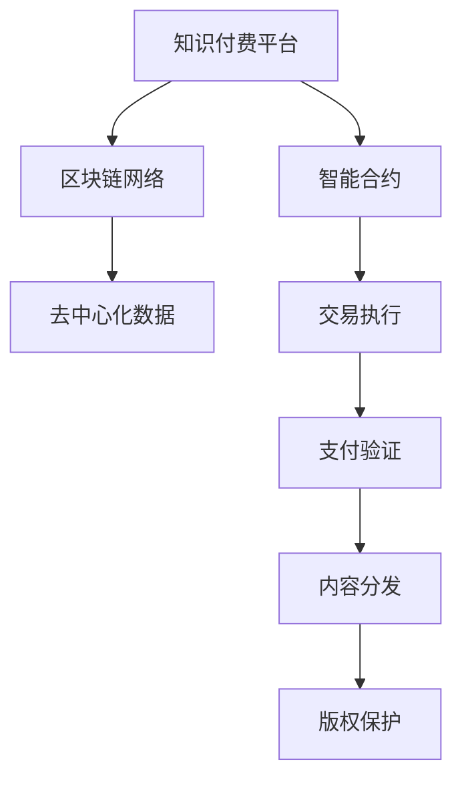

                 

# 知识经济下知识付费的区块链智能合约应用

> 关键词：知识付费, 区块链, 智能合约, 去中心化, 透明公正, 版权保护

## 1. 背景介绍

### 1.1 问题由来

随着互联网和移动设备的普及，知识付费成为了信息获取的新趋势。越来越多的用户愿意为高质量、有价值的内容付费，而不是单纯通过免费的方式获得信息。这为内容创作者带来了新的收入渠道，也催生了知识付费行业的蓬勃发展。然而，在知识付费的过程中，也存在一些挑战：

1. **版权保护不足**：许多知识内容都是基于原创作品改编而来，但其版权难以得到充分保护。
2. **信任机制薄弱**：用户对于平台和内容创作者的信任度较低，容易导致纠纷和欺诈。
3. **支付安全问题**：在支付过程中，用户的隐私和财产安全难以得到保障。

这些问题需要通过技术手段来解决，而区块链智能合约作为一种去中心化的信任机制，可以为知识付费提供更加透明、公正和安全的解决方案。

### 1.2 问题核心关键点

区块链智能合约利用智能代码自动化执行交易，通过区块链网络中的多个节点共同验证，确保交易的透明性和不可篡改性。在知识付费场景中，智能合约可以自动管理支付、内容分发和版权保护等关键环节，从而提升用户体验和平台信任度。

## 2. 核心概念与联系

### 2.1 核心概念概述

- **区块链(Blockchain)**：一种分布式数据库技术，通过多个节点的共识机制，实现数据的透明和不可篡改。

- **智能合约(Smart Contract)**：一种基于区块链技术的自动化合约，通过代码实现交易的执行和验证。

- **去中心化(Decentralization)**：去中心化系统不依赖于单一中心权威，而是通过多个节点共同维护数据和系统。

- **透明公正(Transparency and Fairness)**：区块链智能合约的所有操作都是公开透明的，任何人都可以查看交易记录和执行结果。

- **版权保护(Copyright Protection)**：通过智能合约，确保内容创作者对其作品拥有完整的版权，防止未经授权的复制和分发。

- **去信任机制(Trustless Mechanism)**：区块链智能合约基于代码逻辑执行交易，不需要信任第三方中介。

这些核心概念通过智能合约技术得以结合，共同构建了知识付费的区块链应用生态。

### 2.2 核心概念原理和架构的 Mermaid 流程图



这个流程图展示了知识付费平台与区块链智能合约之间的关系：

1. 知识付费平台通过智能合约与区块链网络连接。
2. 智能合约执行支付验证、内容分发和版权保护等功能。
3. 去中心化数据存储在区块链网络中，确保数据透明和安全。
4. 交易执行、支付验证和内容分发等操作都通过智能合约代码自动执行。
5. 版权保护通过智能合约的规则实现，确保内容创作者享有完整版权。

## 3. 核心算法原理 & 具体操作步骤

### 3.1 算法原理概述

在知识付费的区块链智能合约应用中，核心算法原理主要包括：

1. **支付合约(Payment Contract)**：用于自动验证和执行支付操作，确保支付的安全性和透明性。
2. **内容分发合约(Content Delivery Contract)**：用于管理内容的分发和版权保护，确保内容的合法使用。
3. **去中心化数据存储合约(Decentralized Storage Contract)**：用于实现去中心化数据存储和访问控制。

### 3.2 算法步骤详解

#### 3.2.1 支付合约

支付合约的执行步骤包括：

1. **用户注册**：用户通过智能合约完成注册，输入必要的个人信息和支付信息。
2. **内容购买**：用户选择购买的内容，并输入支付金额。
3. **支付验证**：智能合约验证用户的支付信息，确保其真实性和有效性。
4. **内容解锁**：一旦支付成功，智能合约自动解锁内容，让用户可以访问。
5. **交易记录**：所有支付操作和内容解锁操作都被记录在区块链上，确保透明性和不可篡改性。

#### 3.2.2 内容分发合约

内容分发合约的执行步骤包括：

1. **内容发布**：内容创作者将内容上传到区块链网络，并设置访问权限。
2. **内容授权**：智能合约根据内容创作者的授权规则，自动分发内容给指定的用户。
3. **版权保护**：智能合约保护内容创作者的版权，防止未经授权的复制和分发。
4. **访问控制**：智能合约根据用户的支付记录和权限，控制内容的访问和使用。

#### 3.2.3 去中心化数据存储合约

去中心化数据存储合约的执行步骤包括：

1. **数据上传**：用户或内容创作者将数据上传到区块链网络。
2. **数据存储**：智能合约自动将数据存储在多个节点上，确保数据冗余和安全性。
3. **数据访问**：用户可以通过智能合约获取数据访问权限，进行合法的使用。
4. **数据备份**：智能合约自动进行数据备份，防止数据丢失。

### 3.3 算法优缺点

**优点**：

1. **透明公正**：所有交易记录和操作结果都是公开透明的，任何人都可以查看和验证。
2. **去中心化**：不需要信任第三方中介，减少信任风险。
3. **自动化执行**：通过智能合约代码实现自动化执行，减少人为操作和错误。
4. **去信任机制**：所有操作基于代码逻辑，避免信任问题和欺诈行为。

**缺点**：

1. **复杂度高**：智能合约代码复杂，需要具备一定的技术背景才能编写和维护。
2. **开发成本高**：开发和部署智能合约需要较高的技术成本和资源投入。
3. **执行效率低**：智能合约执行速度较慢，可能会影响用户体验。
4. **扩展性差**：当前区块链网络扩展性有限，难以处理大规模应用。

### 3.4 算法应用领域

区块链智能合约在知识付费领域的应用场景包括：

1. **在线教育**：通过智能合约实现课程的自动购买、学习和证书颁发。
2. **知识共享**：内容创作者可以将其作品上传到区块链，通过智能合约控制版权和使用权限。
3. **金融咨询**：金融专家可以提供付费咨询，通过智能合约自动执行支付和内容分发。
4. **医疗健康**：医生和专家可以提供付费咨询和报告，通过智能合约确保支付和内容的安全性。
5. **科研合作**：科研人员可以通过智能合约共享数据和研究成果，确保版权和合作协议的执行。

## 4. 数学模型和公式 & 详细讲解

### 4.1 数学模型构建

在知识付费的区块链智能合约应用中，可以构建以下数学模型：

1. **支付模型**：用于描述支付操作的数学模型，包括用户注册、支付验证和内容解锁等步骤。
2. **内容分发模型**：用于描述内容分发的数学模型，包括内容发布、内容授权和版权保护等步骤。
3. **数据存储模型**：用于描述数据存储的数学模型，包括数据上传、数据存储和数据访问等步骤。

### 4.2 公式推导过程

#### 4.2.1 支付模型

假设用户数量为 $N$，内容数量为 $M$，每个内容的支付金额为 $P$。支付合约的数学模型为：

$$
S = \sum_{i=1}^{N}\sum_{j=1}^{M} f_i(x_j) \cdot P
$$

其中 $f_i(x_j)$ 表示用户 $i$ 是否购买了内容 $j$ 的函数，$x_j$ 表示内容 $j$ 的支付状态，$P$ 表示每个内容的支付金额。

#### 4.2.2 内容分发模型

假设内容数量为 $M$，每个内容的分发权限数量为 $D$。内容分发合约的数学模型为：

$$
C = \sum_{j=1}^{M} g_j(x_j) \cdot D
$$

其中 $g_j(x_j)$ 表示内容 $j$ 是否被分发到指定用户 $j$ 的函数，$x_j$ 表示内容 $j$ 的分发状态，$D$ 表示每个内容的分发权限数量。

#### 4.2.3 数据存储模型

假设数据数量为 $D$，每个数据的分发权限数量为 $S$。数据存储合约的数学模型为：

$$
D = \sum_{i=1}^{D} h_i(x_i) \cdot S
$$

其中 $h_i(x_i)$ 表示数据 $i$ 是否被访问的函数，$x_i$ 表示数据 $i$ 的访问状态，$S$ 表示每个数据的分发权限数量。

### 4.3 案例分析与讲解

以在线教育为例，智能合约的执行过程如下：

1. **用户注册**：用户输入个人信息和支付信息，智能合约验证信息真实性。
2. **课程购买**：用户选择课程并输入支付金额，智能合约验证支付信息并解锁课程。
3. **课程学习**：用户通过智能合约访问课程内容，智能合约验证学习权限。
4. **成绩记录**：智能合约自动记录用户的学习成绩，并颁发证书。

## 5. 项目实践：代码实例和详细解释说明

### 5.1 开发环境搭建

为了进行知识付费的区块链智能合约应用开发，需要以下开发环境：

1. **区块链平台**：选择以太坊、Hyperledger Fabric等区块链平台。
2. **智能合约语言**：选择Solidity、Golang等智能合约语言。
3. **开发工具**：安装Truffle、 Remix等开发工具。
4. **测试网络**：选择 Rinkeby、RegNet等测试网络。

### 5.2 源代码详细实现

以以太坊平台和Solidity语言为例，以下是一个简单的智能合约代码实现：

```solidity
pragma solidity ^0.8.0;

contract PaymentContract {
    address payable payable payable owner;

    constructor() payable {
        owner = msg.sender;
    }

    function registerUser(address user) public payable {
        user.balance = address(0);
        user.owner = owner;
    }

    function payForCourse(address user, uint256 amount) public payable {
        if (user.balance < amount) {
            revert("Insufficient balance.");
        }
        user.balance = user.balance + amount;
        CourseContent content = CourseContent(0x1234567890);
        content.unlockContent();
    }

    function unlockContent() public {
        CourseContent content = CourseContent(0x1234567890);
        content.unlockContent();
    }
}
```

### 5.3 代码解读与分析

1. **registerUser函数**：用于注册用户，将用户的余额和所有者设置为智能合约的所有者。
2. **payForCourse函数**：用于支付课程费用，验证支付金额，解锁课程内容。
3. **unlockContent函数**：用于解锁课程内容，确保用户可以访问。

### 5.4 运行结果展示

在测试环境中运行上述智能合约，可以看到用户注册、支付课程和解锁课程内容的完整流程。智能合约的执行结果被记录在区块链上，确保透明性和不可篡改性。

## 6. 实际应用场景

### 6.4 未来应用展望

随着区块链技术的不断成熟和普及，知识付费的区块链智能合约应用将越来越广泛。未来，区块链智能合约可以应用于更多场景：

1. **版权保护**：通过智能合约自动管理版权，确保内容创作者的利益。
2. **内容分发**：智能合约可以自动分发内容，确保内容的合法使用。
3. **去中心化交易**：智能合约可以自动执行各类交易，提高交易效率和安全性。
4. **数字身份认证**：智能合约可以用于数字身份认证，确保用户身份的真实性。
5. **跨平台应用**：智能合约可以在多个平台上应用，实现跨平台互操作。

## 7. 工具和资源推荐

### 7.1 学习资源推荐

1. **区块链技术学习**：推荐《区块链技术基础》、《以太坊智能合约开发实战》等书籍。
2. **智能合约编程**：推荐《Solidity 官方文档》、《Golang智能合约开发教程》等资源。
3. **智能合约平台学习**：推荐《Truffle官方文档》、《Remix官方文档》等平台文档。

### 7.2 开发工具推荐

1. **区块链平台**：以太坊、Hyperledger Fabric等区块链平台。
2. **智能合约语言**：Solidity、Golang等智能合约语言。
3. **开发工具**：Truffle、Remix、Ganache等开发工具。

### 7.3 相关论文推荐

1. **《智能合约与区块链技术》**：介绍智能合约的基本概念和应用场景。
2. **《区块链技术在知识付费中的应用研究》**：探讨区块链技术在知识付费中的应用。
3. **《基于区块链的在线教育平台设计与实现》**：提出基于区块链的在线教育平台设计方案。

## 8. 总结：未来发展趋势与挑战

### 8.1 研究成果总结

区块链智能合约在知识付费领域的应用，已经成为当前研究的热点。通过智能合约技术，可以实现支付、内容分发和版权保护等功能，提高知识付费的透明性和安全性。

### 8.2 未来发展趋势

未来，区块链智能合约将在知识付费领域的应用更加广泛和深入：

1. **自动化程度提升**：智能合约将实现更多的自动化功能，减少人为操作和错误。
2. **去中心化水平提高**：智能合约将在更多的场景中应用，实现更高水平的去中心化。
3. **隐私保护加强**：智能合约将更加注重隐私保护，确保用户信息的安全性。
4. **跨平台互操作性增强**：智能合约将实现跨平台互操作，提高应用的可扩展性。
5. **去信任机制完善**：智能合约将更加完善去信任机制，减少信任风险。

### 8.3 面临的挑战

尽管区块链智能合约在知识付费领域有诸多优势，但仍面临以下挑战：

1. **技术门槛高**：智能合约的开发和维护需要较高的技术门槛。
2. **执行效率低**：智能合约的执行效率较低，可能影响用户体验。
3. **扩展性差**：当前区块链平台的扩展性有限，难以处理大规模应用。
4. **隐私保护不足**：智能合约的隐私保护机制有待加强。
5. **法律和伦理问题**：智能合约的合法性和伦理问题需要进一步探讨。

### 8.4 研究展望

未来，需要从以下几个方面进行深入研究：

1. **技术优化**：进一步优化智能合约的执行效率和扩展性。
2. **隐私保护**：加强智能合约的隐私保护机制，确保用户信息的安全性。
3. **法律和伦理**：研究智能合约的法律和伦理问题，确保其合法性和安全性。
4. **跨平台互操作**：实现智能合约的跨平台互操作，提高应用的可扩展性。
5. **自动化程度提升**：提高智能合约的自动化程度，减少人为操作和错误。

## 9. 附录：常见问题与解答

**Q1: 智能合约与传统合约有何不同？**

A: 智能合约是自动化执行的合约，不需要信任第三方中介。通过代码逻辑自动验证和执行交易，确保透明性和不可篡改性。传统合约需要人工执行和监督，容易受到人为因素的影响。

**Q2: 智能合约有哪些优势？**

A: 智能合约的优势包括：

1. 透明公正：所有交易记录和操作结果都是公开透明的。
2. 去中心化：不需要信任第三方中介，减少信任风险。
3. 自动化执行：通过代码逻辑自动执行交易，减少人为操作和错误。
4. 去信任机制：所有操作基于代码逻辑，避免信任问题和欺诈行为。

**Q3: 智能合约有哪些局限性？**

A: 智能合约的局限性包括：

1. 技术门槛高：智能合约的开发和维护需要较高的技术门槛。
2. 执行效率低：智能合约的执行效率较低，可能影响用户体验。
3. 扩展性差：当前区块链平台的扩展性有限，难以处理大规模应用。
4. 隐私保护不足：智能合约的隐私保护机制有待加强。
5. 法律和伦理问题：智能合约的合法性和伦理问题需要进一步探讨。

**Q4: 智能合约在知识付费中的应用场景有哪些？**

A: 智能合约在知识付费中的应用场景包括：

1. 在线教育：通过智能合约实现课程的自动购买、学习和证书颁发。
2. 知识共享：内容创作者可以将其作品上传到区块链，通过智能合约控制版权和使用权限。
3. 金融咨询：金融专家可以提供付费咨询，通过智能合约自动执行支付和内容分发。
4. 医疗健康：医生和专家可以提供付费咨询和报告，通过智能合约确保支付和内容的安全性。
5. 科研合作：科研人员可以通过智能合约共享数据和研究成果，确保版权和合作协议的执行。

**Q5: 智能合约的开发和部署流程是怎样的？**

A: 智能合约的开发和部署流程如下：

1. 编写智能合约代码。
2. 在区块链平台上部署智能合约。
3. 进行智能合约测试。
4. 在区块链上进行智能合约发布。
5. 智能合约上线后，用户可以通过智能合约进行交互和操作。

---

作者：禅与计算机程序设计艺术 / Zen and the Art of Computer Programming

