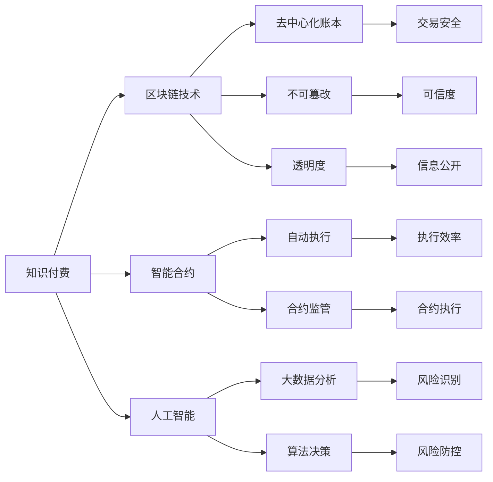

                 

## 1. 背景介绍

随着知识经济时代的到来，知识付费成为一种新型的消费模式，为个体提供了从知识消费到知识创造的路径。然而，知识付费在繁荣发展的同时，也面临诸多风险，包括内容质量、版权归属、用户隐私、商业模式等。如何对这些风险进行全面识别和防控，成为保障知识付费健康发展的关键问题。

### 1.1 知识经济与知识付费

知识经济是建立在知识和信息资源基础上的经济形态，知识付费则是一种基于知识产权的商业模式。其核心在于通过知识的价值化和商业化，实现知识的规模化生产和流通。知识付费主要通过网络平台（如在线课程、知识分享、咨询问答等）提供专业、个性化、高附加值的内容服务，满足用户对知识的深度需求。

知识付费的兴起，反映了人们知识需求的提高和消费观念的变化。在线教育、远程医疗、技术咨询等知识付费形式的普及，不仅推动了教育、医疗、技术等领域的数字化转型，也促进了知识的广泛传播和应用。

### 1.2 知识付费的风险表现

知识付费市场虽然发展迅猛，但伴随的各类风险也逐渐显露，主要包括内容质量风险、版权归属风险、用户隐私风险和商业模式风险。

- **内容质量风险**：知识付费平台充斥着大量鱼龙混杂的内容，用户难以鉴别内容真伪，导致资源浪费和投资风险。
- **版权归属风险**：知识付费平台对版权保护的重视程度不足，大量侵权内容频现，侵害了原创者的合法权益。
- **用户隐私风险**：知识付费平台通过大数据、算法等技术手段收集用户行为数据，存在数据泄露和隐私侵害的风险。
- **商业模式风险**：知识付费平台盈利模式单一，容易受到市场环境、政策法规等因素影响，面临较高的经营风险。

识别和防范这些风险，需要从技术、法律、伦理等多个维度进行全面考虑。

## 2. 核心概念与联系

### 2.1 核心概念概述

为深入理解知识付费风险管理与防控的理论基础，首先需要明晰几个关键概念：

- **知识付费**：指用户为获取知识而支付费用的商业模式，涵盖了从内容生产到平台运营的全链条。
- **风险管理**：指识别、评估、监控和应对风险的一系列措施和流程。
- **区块链技术**：一种去中心化的分布式账本技术，具有不可篡改、透明性、安全等特点。
- **智能合约**：指一种自动执行的合约，能够在满足预设条件时触发并执行。
- **人工智能**：指模拟人类智能行为的计算技术，包括机器学习、深度学习等。

这些概念之间存在紧密联系，共同构成了知识付费风险防控的框架。区块链技术提供了一个去中心化的交易和数据记录平台，智能合约保障了合约的自动执行和监管，而人工智能则通过大数据和算法分析提高风险识别和防控的效率和准确性。

### 2.2 核心概念联系的 Mermaid 流程图



这个流程图展示了知识付费、区块链技术、智能合约和人工智能之间的相互联系和作用，形成一个完整的风险防控系统。

## 3. 核心算法原理 & 具体操作步骤

### 3.1 算法原理概述

知识付费风险管理与防控的核心算法原理包括区块链、智能合约和人工智能技术。

- **区块链技术**：通过去中心化的分布式账本，记录和验证交易信息，确保数据的不可篡改性和透明性，保障用户隐私和权益。
- **智能合约**：通过代码实现合约条款，确保合约的自动执行和不可篡改，减少人为干预和操作风险。
- **人工智能**：通过大数据和算法分析，识别风险点，优化风险防控策略，实现智能决策和自动化管理。

这些技术能够相互补充，共同构建起知识付费的风险防控体系。

### 3.2 算法步骤详解

知识付费风险管理与防控的具体操作步骤分为四个阶段：风险识别、风险评估、风险监控和风险应对。

1. **风险识别**：利用区块链和人工智能技术，对知识付费平台进行全面数据收集和分析，识别出潜在的风险点。
2. **风险评估**：使用机器学习算法，对已识别的风险进行评估，确定其严重性和发生概率。
3. **风险监控**：通过智能合约和区块链技术，实时监控风险状况，自动触发风险预警。
4. **风险应对**：根据预警信息，采取相应措施进行风险防控，如移除侵权内容、加强用户隐私保护等。

### 3.3 算法优缺点

基于区块链、智能合约和人工智能的算法具有以下优点：

- **透明度和安全性**：区块链技术的去中心化和透明性，保证了数据的安全性和可信度。
- **自动执行和监管**：智能合约的自动执行和不可篡改性，减少了人为干预和操作风险。
- **高效性和智能化**：人工智能技术的智能化和大数据分析，提高了风险识别和防控的效率和准确性。

但这些算法也存在一些缺点：

- **技术复杂性**：区块链和智能合约技术较为复杂，实施成本较高，需要较高的技术水平和专业知识。
- **数据隐私问题**：区块链的透明性在一定程度上牺牲了部分数据隐私，需要合理平衡隐私保护和数据透明。
- **算法偏见**：人工智能模型可能存在算法偏见，需要持续监控和优化。

### 3.4 算法应用领域

基于区块链、智能合约和人工智能的风险管理与防控算法，已在多个领域得到广泛应用，例如：

- **版权保护**：利用区块链技术记录版权信息和交易记录，使用智能合约保护版权归属，防止侵权行为。
- **用户隐私保护**：采用区块链技术记录用户行为数据，使用智能合约限制数据访问权限，保护用户隐私。
- **内容审核**：利用人工智能技术对内容进行智能审核，识别并移除违规内容，保障平台内容质量。
- **风险预警**：使用区块链和人工智能技术实时监控交易和行为，自动触发风险预警，及时应对潜在的欺诈行为。

这些应用展示了区块链、智能合约和人工智能在风险管理与防控中的重要价值。

## 4. 数学模型和公式 & 详细讲解

### 4.1 数学模型构建

基于区块链、智能合约和人工智能的风险管理与防控，可以构建如下数学模型：

- **区块链模型**：描述交易记录和验证机制，包括区块生成、共识机制和数据存储等。
- **智能合约模型**：定义合约条款和执行条件，包括触发条件、执行步骤和监管机制等。
- **人工智能模型**：构建风险识别和评估算法，包括特征提取、分类器和风险评估函数等。

### 4.2 公式推导过程

以版权保护为例，利用区块链和智能合约技术构建版权登记和使用的数学模型：

设版权登记系统包含以下元素：
- 版权登记者 $A$，提供版权作品 $P$。
- 版权使用者 $B$，希望使用版权作品。
- 版权区块链 $C$，记录版权信息和交易记录。
- 智能合约 $D$，定义版权使用规则和条款。

版权登记步骤如下：
1. $A$ 将版权作品 $P$ 上传到区块链 $C$，生成版权区块 $Q_A$。
2. $C$ 验证版权作品 $P$ 的合法性，并将 $Q_A$ 加入区块链。
3. $A$ 使用智能合约 $D$ 生成版权证书 $T_A$，并将其提供给 $B$。
4. $B$ 验证 $T_A$ 的有效性，并与版权区块 $Q_A$ 进行比对，确认版权归属。
5. $B$ 使用智能合约 $D$ 进行版权使用支付和授权，生成使用记录 $R_B$。
6. $C$ 记录 $R_B$ 并更新版权区块 $Q_A$。

上述过程可以表示为如下数学模型：
$$
\begin{aligned}
Q_A &= f_A(P) \\
T_A &= g_A(Q_A) \\
R_B &= h_B(T_A, Q_A) \\
Q_A &= u_C(Q_A, R_B)
\end{aligned}
$$

其中，$f_A$ 表示版权区块生成函数，$g_A$ 表示版权证书生成函数，$h_B$ 表示版权使用支付函数，$u_C$ 表示版权区块链更新函数。

### 4.3 案例分析与讲解

假设某平台提供了一个开源软件，用户可以付费获取使用权。利用上述模型，可以进行如下风险管理：

1. **版权登记**：开发者将软件源码上传到区块链，生成版权区块 $Q_A$。
2. **版权证书**：平台根据版权区块生成版权证书 $T_A$，并在智能合约中定义使用规则。
3. **版权支付**：用户支付使用费用后，平台使用智能合约生成使用记录 $R_B$。
4. **版权更新**：平台将使用记录更新到版权区块链，确保版权信息透明和可信。

如果用户未授权使用软件，或者版权归属存在争议，平台可以通过区块链和智能合约进行验证和追溯。如果用户存在盗版行为，智能合约自动执行惩罚措施，如扣除使用权限、罚款等。

## 5. 项目实践：代码实例和详细解释说明

### 5.1 开发环境搭建

为实现知识付费风险管理与防控，需要先搭建开发环境。具体步骤如下：

1. 安装 Python 和相应的库，如 Flask、Web3、TensorFlow 等。
2. 配置区块链节点，如 Ethereum、Hyperledger Fabric 等。
3. 搭建智能合约平台，如 Truffle、Remix 等。
4. 搭建数据处理和分析平台，如 Spark、Hadoop 等。

### 5.2 源代码详细实现

以下是使用 Python 和 Flask 搭建一个版权保护系统的示例代码：

```python
from flask import Flask, request, jsonify
import web3
from web3 import Web3, HTTPProvider

app = Flask(__name__)

# 连接以太坊网络
w3 = Web3(HTTPProvider('https://mainnet.infura.io/v3/{YOUR_INFURA_API_KEY}'))

# 定义智能合约
contract = w3.eth.contract(
    address='0x1234567890abcdef', 
    abi=['{\"constant\":false,\"inputs\":[{\"name\":\"id\",\"type\":\"address\"}],\"name\":\"grantPermission\",\"outputs\":[{\"name\":\"permitted\",\"type\":\"bool\"}],\"payable\":false,\"stateMutability\":\"nonpayable\",\"type\":\"function\"}])

def grant_permission(id):
    tx_hash = contract.functions.grantPermission(id).transact({'from': w3.eth.accounts[0]})
    w3.eth.waitForTransactionReceipt(tx_hash)
    return contract.functions.permitted(id).call({'from': w3.eth.accounts[0]})

@app.route('/grant_permission', methods=['POST'])
def grant_permission_api():
    data = request.json
    id = data['id']
    permitted = grant_permission(id)
    return jsonify({'permitted': permitted})

if __name__ == '__main__':
    app.run(debug=True)
```

该代码实现了一个简单的版权授权系统，通过智能合约实现了版权许可的自动授予和验证。

### 5.3 代码解读与分析

上述代码的核心逻辑包括：

1. 连接以太坊网络，并定义智能合约。
2. 实现一个简单的版权授权接口，接受请求参数 id，并通过智能合约验证版权许可。
3. 在接口中返回验证结果，允许或拒绝授权请求。

### 5.4 运行结果展示

通过该系统，可以在前端进行版权许可的请求和验证，如通过 UI 界面提交版权许可请求，后端服务器会根据智能合约的验证结果返回许可结果。

## 6. 实际应用场景

### 6.1 版权保护

在版权保护方面，利用区块链和智能合约技术，可以构建一个去中心化的版权登记和交易系统。平台通过智能合约定义版权使用规则，并记录版权登记信息，确保版权信息的透明和可信。用户可以随时查询版权信息，验证版权的真实性，减少版权侵权的风险。

### 6.2 用户隐私保护

在用户隐私保护方面，平台可以通过区块链记录用户行为数据，并使用智能合约限制数据访问权限。用户可以设定数据使用规则，授权平台在特定条件下访问数据，同时平台无法随意修改用户数据，保障用户隐私。

### 6.3 内容审核

在内容审核方面，平台可以利用人工智能技术对内容进行智能审核，识别并移除违规内容。平台通过大数据分析，识别出潜在的风险点，并使用智能合约进行内容审核和处理，确保平台内容的质量和安全。

### 6.4 风险预警

在风险预警方面，平台可以通过区块链和人工智能技术实时监控交易和行为，自动触发风险预警。当系统检测到异常行为时，立即通知管理员，及时采取措施，防止潜在风险的发生。

## 7. 工具和资源推荐

### 7.1 学习资源推荐

为了帮助开发者掌握知识付费风险管理与防控的理论和实践，这里推荐一些优质的学习资源：

1. 《区块链技术基础》：一本详细介绍区块链原理和应用的书，适合初学者入门。
2. 《智能合约开发实战》：详细讲解智能合约开发技术和实际应用，适合有一定编程基础的读者。
3. 《机器学习实战》：介绍了机器学习算法和应用案例，适合掌握基本算法知识的读者。
4. 《人工智能基础》：涵盖了人工智能的核心概念和基础算法，适合了解人工智能技术原理的读者。
5. 在线课程：如Coursera、Udacity等平台提供的多门区块链、智能合约和人工智能课程。

通过这些学习资源，可以帮助开发者全面掌握知识付费风险管理与防控的理论和技术。

### 7.2 开发工具推荐

在开发知识付费风险管理与防控系统时，推荐使用以下工具：

1. Python：高效易读的编程语言，适用于数据处理和算法开发。
2. Flask：轻量级 Web 框架，适用于快速搭建服务端应用。
3. Web3：Python 和 JavaScript 库，适用于连接以太坊等区块链网络。
4. TensorFlow：深度学习框架，适用于构建智能合约和算法模型。
5. Jupyter Notebook：数据科学和机器学习常用的交互式开发环境。

这些工具在知识付费风险管理与防控系统的开发中扮演着重要角色。

### 7.3 相关论文推荐

知识付费风险管理与防控技术的发展离不开学术界的持续研究，以下是几篇奠基性的相关论文，推荐阅读：

1. "Blockchain: building the decentralized web"（《区块链：构建去中心化网络》）：详细介绍了区块链技术的基本原理和应用场景。
2. "Smart Contracts: Made Simple"（《智能合约：简单实现》）：讲解了智能合约的基本概念和实现方法。
3. "Deep Learning for NLP"（《深度学习在自然语言处理中的应用》）：介绍了深度学习在自然语言处理中的应用，特别是基于 Transformer 的模型。
4. "Machine Learning in Knowledge Graphs"（《知识图谱中的机器学习》）：探讨了机器学习在知识图谱中的应用，如知识推理和图神经网络。

这些论文代表了知识付费风险管理与防控技术的发展方向，有助于理解其理论基础和实际应用。

## 8. 总结：未来发展趋势与挑战

### 8.1 研究成果总结

本文详细介绍了基于区块链、智能合约和人工智能的知识付费风险管理与防控方法。通过理论分析和技术实现，展示了这些技术在版权保护、用户隐私保护、内容审核和风险预警等方面的应用，为知识付费领域的风险管理提供了有效的解决方案。

### 8.2 未来发展趋势

未来，知识付费风险管理与防控技术将呈现以下几个发展趋势：

1. **技术融合**：区块链、智能合约和人工智能技术的进一步融合，将实现更高效、更智能的风险管理。
2. **去中心化扩展**：区块链技术的去中心化和透明性将继续扩展到更多领域，构建去中心化的知识付费生态。
3. **智能合约标准化**：智能合约的标准化将进一步推动知识付费市场的规范化发展。
4. **AI技术升级**：人工智能技术的不断进步，将提高风险识别的准确性和实时性，优化风险防控策略。
5. **跨平台互通**：不同平台之间的互通将促进知识付费市场的多样化和开放性。

### 8.3 面临的挑战

尽管知识付费风险管理与防控技术取得了一定进展，但仍面临一些挑战：

1. **技术门槛高**：区块链、智能合约和人工智能技术需要较高的技术水平和专业知识，实施成本较高。
2. **数据隐私问题**：区块链的透明性在一定程度上牺牲了部分数据隐私，需要在隐私保护和数据透明之间找到平衡。
3. **算法偏见**：人工智能模型可能存在算法偏见，需要持续监控和优化。
4. **市场接受度**：部分用户和平台对新技术的接受度较低，需要更多的教育和引导。

### 8.4 研究展望

面对这些挑战，未来的研究方向主要集中在以下几个方面：

1. **降低技术门槛**：开发更易用、更高效的开发工具和框架，降低技术门槛，促进技术普及。
2. **保护数据隐私**：研究隐私保护技术，如差分隐私、联邦学习等，保护用户数据隐私。
3. **优化算法模型**：持续优化和升级人工智能算法模型，提高风险识别的准确性和鲁棒性。
4. **市场推广**：加强市场教育和引导，提高用户和平台的接受度，推动技术应用。

## 9. 附录：常见问题与解答

**Q1: 如何识别知识付费平台中的版权侵权行为？**

A: 利用区块链技术，记录和验证版权信息和交易记录，确保版权信息的透明和可信。平台可以使用智能合约定义版权使用规则，并自动触发版权验证和授权，防止版权侵权行为。

**Q2: 如何保护用户隐私？**

A: 平台可以通过区块链记录用户行为数据，并使用智能合约限制数据访问权限。用户可以设定数据使用规则，授权平台在特定条件下访问数据，同时平台无法随意修改用户数据，保障用户隐私。

**Q3: 如何构建智能合约？**

A: 智能合约的构建需要明确合约目标、触发条件和执行步骤，并使用区块链和编程语言进行实现。可以参考智能合约开发实战等资源，掌握智能合约的基本概念和实现方法。

**Q4: 如何实时监控交易和行为？**

A: 平台可以使用区块链和人工智能技术实时监控交易和行为，自动触发风险预警。当系统检测到异常行为时，立即通知管理员，及时采取措施，防止潜在风险的发生。

通过以上分析，可以看出，知识付费风险管理与防控是一个复杂的系统工程，需要多方面的协同努力。区块链、智能合约和人工智能技术的融合应用，将为知识付费领域带来更多的安全保障和创新发展。

