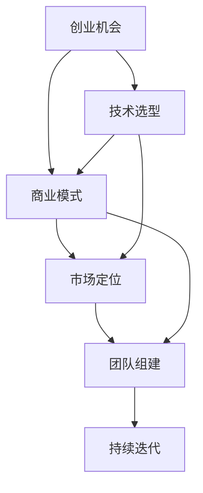

                 

# 知识经济下程序员的创业之路与机遇

## 1. 背景介绍

### 1.1 问题由来
在21世纪的知识经济时代，科技发展速度迅猛，信息技术在各领域的应用越来越广泛。程序员作为科技创新的主要推动力量，其创业之路正变得越来越宽广。编程语言、开发框架、云服务、人工智能、区块链等技术的兴起，为程序员提供了无数的创业机会。

### 1.2 问题核心关键点
程序员的创业之路面临的挑战包括技术选型、市场定位、商业化过程、团队组建等。同时，这些挑战也构成了程序员创业的机遇，比如通过技术创新解决痛点、以技术驱动市场、快速迭代和调整等。

### 1.3 问题研究意义
研究程序员的创业之路与机遇，对于程序员个人职业发展、提升科技创业成功率、推动科技产业繁荣具有重要意义。对创业过程中技术、市场、商业等各个维度的深刻理解，可以帮助程序员把握时代趋势，抓住机遇，实现技术与商业的有机结合。

## 2. 核心概念与联系

### 2.1 核心概念概述

在知识经济下，程序员的创业之路涉及多个核心概念，这些概念间相互关联，共同构成了创业的基础：

- **创业机会（Opportunity）**：指市场和用户需求与技术能力之间的结合点，是创业者成功的基础。
- **技术选型（Technology Selection）**：根据项目需求和市场需求，选择合适的技术栈和工具。
- **商业模式（Business Model）**：根据产品特性和市场需求，设计合理的盈利模式，比如SaaS、订阅制、自由软件等。
- **市场定位（Market Segmentation）**：明确目标用户群体，根据需求进行细分，定位产品特性。
- **团队组建（Team Formation）**：合理配置人才，构建高效协作的团队结构。
- **持续迭代（Iterative Development）**：根据市场反馈和数据，不断优化和升级产品。

这些概念通过以下Mermaid流程图来展示：



这个流程图展示了核心概念之间的逻辑关系：

1. 创业机会触发创业想法，并影响技术选型和商业模式。
2. 市场定位进一步细化商业模式，并推动团队组建。
3. 团队组建和持续迭代支持商业模式和市场定位，不断优化产品。

## 3. 核心算法原理 & 具体操作步骤

### 3.1 算法原理概述

创业者利用技术手段，通过分析市场需求和用户痛点，提出创新性解决方案。在这一过程中，以下算法原理是程序员创业的核心：

- **聚类算法（Clustering）**：用于用户需求的分析和细分，将需求相似的群体进行聚类，帮助制定市场定位策略。
- **决策树（Decision Tree）**：用于构建产品特性与市场反馈之间的映射关系，帮助评估商业模式和迭代方向。
- **回归分析（Regression Analysis）**：用于预测产品增长和用户行为，优化市场定位和持续迭代。
- **强化学习（Reinforcement Learning）**：用于在不断反馈中，调整产品策略和市场定位，提升用户体验和满意度。

### 3.2 算法步骤详解

创业路径可以分为以下几个关键步骤：

**Step 1: 识别创业机会**

- 分析市场和用户需求，寻找存在的问题和痛点。
- 使用聚类算法对需求进行细分，形成用户群体。
- 利用回归分析预测用户行为和市场潜力。

**Step 2: 技术选型**

- 根据用户需求，选择技术栈和工具。
- 采用强化学习进行技术方案的迭代优化。
- 考虑开源和商业化因素，平衡成本与效益。

**Step 3: 商业模式设计**

- 基于市场需求和用户群体，设计合理的盈利模式。
- 使用决策树分析市场竞争和产品特性，制定差异化策略。
- 评估商业模式对团队建设的影响。

**Step 4: 市场定位**

- 根据用户反馈和市场数据，调整产品特性和定价策略。
- 利用回归分析预测产品增长和用户行为。
- 持续进行市场细分和用户画像更新。

**Step 5: 团队组建**

- 根据项目需求，招聘适合的人才。
- 采用敏捷开发方法，提高团队协作效率。
- 建立激励机制，提升团队士气和工作满意度。

**Step 6: 持续迭代**

- 不断收集用户反馈和市场数据，优化产品功能。
- 使用决策树和回归分析评估迭代效果。
- 引入强化学习，优化产品策略和市场定位。

### 3.3 算法优缺点

创业者利用这些算法在创业过程中可以带来以下优势：

- **高效决策**：通过聚类、回归分析等算法，快速识别市场需求和用户痛点。
- **灵活迭代**：强化学习等算法帮助创业者在市场反馈中不断调整和优化产品。
- **成本控制**：开源和商业化工具的选择，平衡了技术成本和产品性能。

同时，这些算法也存在以下局限：

- **数据依赖**：算法的效果高度依赖于数据的准确性和完备性。
- **复杂度高**：对于创业初期的项目，过于复杂的算法可能导致开发难度增加。
- **适应性差**：市场环境变化快，算法模型需要不断更新以适应新情况。

## 4. 数学模型和公式 & 详细讲解

### 4.1 数学模型构建

在程序员的创业过程中，以下数学模型和公式是其核心：

- **用户行为分析模型**：预测用户行为的线性回归模型。
- **产品特性映射模型**：决策树模型，用于产品特性和市场反馈的映射。
- **聚类模型**：K-means算法，用于需求细分的聚类分析。

### 4.2 公式推导过程

以下公式展示了线性回归模型和决策树模型的推导过程：

$$
\hat{y} = \theta_0 + \sum_{i=1}^n \theta_i x_i
$$

其中 $\hat{y}$ 为预测值，$\theta_0$ 为截距，$\theta_i$ 为权重，$x_i$ 为特征向量。

决策树模型的构建过程包括：

- 划分特征空间：
  $$
  S_{ij} = \{ x | x_i \in \text{node}_j \}
  $$
- 选择最佳划分特征：
  $$
  \min_{i} \max_{j} \sum_{x \in S_{ij}} \ell(y_i, \hat{y}_i)
  $$
- 构建决策树：
  $$
  T = \{ (x, \text{label}(x)) | x \in S_j, \text{node}_j \in T \}
  $$

### 4.3 案例分析与讲解

以某社交平台为例，分析用户活跃度提升的决策过程：

1. **数据收集**：
   - 活跃度：每天登录次数、发布内容数量。
   - 用户属性：年龄、性别、注册时间。

2. **聚类分析**：
   - 使用K-means算法将用户分成几个群体，如重度用户、中度用户、轻度用户。
   - 不同群体的活跃度变化不同，需要分别分析。

3. **回归分析**：
   - 预测未来活跃度提升，建模如下：
     $$
     \hat{y} = \theta_0 + \sum_{i=1}^n \theta_i x_i
     $$
   - 其中 $x_i$ 为影响因素，如新功能引入、社区活动等。

4. **决策树模型**：
   - 将活跃度提升作为目标变量，构建决策树模型。
   - 树的结构如下：
     $$
     T = \{ (x, \text{label}(x)) | x \in S_j, \text{node}_j \in T \}
     $$
   - 通过决策树模型，分析不同用户群体对活跃度提升的影响。

## 5. 项目实践：代码实例和详细解释说明

### 5.1 开发环境搭建

程序员的创业项目通常涉及多种技术栈和框架，以下环境搭建步骤：

1. **安装Python**：
   - 安装Anaconda或Miniconda。
   - 创建虚拟环境。

2. **安装依赖库**：
   - 安装NumPy、Pandas、Scikit-Learn等数据科学库。
   - 安装Django、Flask等Web框架。
   - 安装TensorFlow、PyTorch等机器学习库。

3. **代码编辑器**：
   - 安装Visual Studio Code、PyCharm等代码编辑器。
   - 安装Git、GitHub等版本控制工具。

### 5.2 源代码详细实现

以下是一个基于线性回归和决策树的创业项目示例，展示如何预测用户活跃度提升：

```python
import pandas as pd
from sklearn.model_selection import train_test_split
from sklearn.linear_model import LinearRegression
from sklearn.tree import DecisionTreeRegressor
from sklearn.metrics import mean_squared_error

# 数据加载
data = pd.read_csv('user_engagement.csv')

# 特征选择
X = data[['age', 'gender', 'registration_time', 'days_since_last_login']]
y = data['daily_engagement']

# 数据划分
X_train, X_test, y_train, y_test = train_test_split(X, y, test_size=0.3, random_state=42)

# 线性回归模型
lr_model = LinearRegression()
lr_model.fit(X_train, y_train)
y_pred_lr = lr_model.predict(X_test)

# 决策树模型
dt_model = DecisionTreeRegressor()
dt_model.fit(X_train, y_train)
y_pred_dt = dt_model.predict(X_test)

# 评估模型
print('Linear Regression MSE:', mean_squared_error(y_test, y_pred_lr))
print('Decision Tree MSE:', mean_squared_error(y_test, y_pred_dt))
```

### 5.3 代码解读与分析

- **数据加载**：使用Pandas加载用户活跃度数据。
- **特征选择**：选择影响活跃度的关键特征。
- **数据划分**：将数据集划分为训练集和测试集。
- **线性回归**：构建线性回归模型，预测用户活跃度。
- **决策树**：构建决策树模型，分析用户群体对活跃度的影响。
- **模型评估**：使用均方误差（MSE）评估模型预测效果。

## 6. 实际应用场景

### 6.1 企业级应用

- **CRM系统**：利用聚类和回归分析，预测用户行为，优化客户服务流程。
- **库存管理**：通过决策树模型，预测产品销售趋势，优化库存管理。
- **营销活动**：利用强化学习算法，优化广告投放策略，提升营销效果。

### 6.2 电商应用

- **个性化推荐**：使用聚类算法，细分用户群体，进行个性化推荐。
- **广告投放**：使用决策树模型，分析用户行为，优化广告定向。
- **库存优化**：利用回归分析，预测销售趋势，优化库存管理。

### 6.3 健康医疗应用

- **疾病预测**：使用线性回归模型，预测疾病发病率，优化医疗资源配置。
- **患者管理**：利用决策树模型，分析患者行为，优化诊疗流程。
- **健康管理**：通过强化学习，优化健康干预策略，提升健康管理效果。

### 6.4 未来应用展望

未来，程序员的创业之路将更加多元和高效。以下是可能的趋势：

- **云计算和SaaS**：基于云计算的SaaS模式将大幅降低创业成本和门槛。
- **人工智能和大数据**：人工智能和大数据分析将为创业提供更多数据驱动的决策支持。
- **区块链技术**：区块链技术将为创业项目提供更加安全和透明的数据处理方式。
- **全栈开发**：程序员将需要具备全栈技能，快速适应技术变化。

## 7. 工具和资源推荐

### 7.1 学习资源推荐

- **Coursera和edX**：提供数据科学、机器学习、人工智能等领域的在线课程。
- **Kaggle**：提供大量开源数据集和竞赛，提升实战能力。
- **GitHub**：获取开源项目和代码，学习最新技术。
- **Medium和Towards Data Science**：阅读最新技术博客，获取行业动态。

### 7.2 开发工具推荐

- **Jupyter Notebook**：轻量级Python开发环境，支持代码编写和数据可视化。
- **Google Colab**：免费的云环境，适合快速原型开发和测试。
- **PyCharm**：Python开发工具，支持丰富的插件和自动化测试。
- **Visual Studio Code**：轻量级的代码编辑器，支持多种编程语言。

### 7.3 相关论文推荐

- **《Python数据分析与科学计算》**：介绍Python在数据分析和科学计算中的应用。
- **《深度学习》**：李宏毅教授的深度学习课程讲义，涵盖深度学习基础和最新技术。
- **《数据科学导论》**：周志华教授的入门书籍，讲解数据科学的理论基础和实践应用。

## 8. 总结：未来发展趋势与挑战

### 8.1 总结

本文系统介绍了程序员在知识经济下的创业之路，涉及多个核心概念和算法。通过数据分析和机器学习，程序员可以高效识别创业机会，设计合理的技术选型和商业模式，优化产品特性和市场定位。代码实例展示了如何将算法应用到实际项目中。

### 8.2 未来发展趋势

未来程序员的创业之路将更加智能化和数据驱动，以下是可能的趋势：

- **云计算和大数据**：云计算和大数据分析将提供更多资源和工具支持。
- **人工智能与机器学习**：人工智能和机器学习技术将为创业提供更多数据驱动的决策支持。
- **区块链和去中心化**：区块链技术将为创业项目提供更安全和透明的数据处理方式。
- **全栈开发**：程序员将需要具备全栈技能，快速适应技术变化。

### 8.3 面临的挑战

尽管创业机会和工具都在不断丰富，程序员在创业过程中仍面临以下挑战：

- **技术选型复杂**：多种技术栈和工具的选择，增加了创业难度。
- **数据质量不稳定**：数据的准确性和完备性，影响算法的决策效果。
- **市场竞争激烈**：创业项目需要不断创新和优化，才能保持竞争力。
- **团队协作困难**：高效协作的团队组建和培养，是创业成功的关键。
- **资源限制**：资金和人力限制，可能导致项目无法顺利进行。

### 8.4 研究展望

未来，程序员在创业过程中需要更多关注以下几个方面：

- **技术创新**：不断探索新的技术和算法，提升产品竞争力。
- **市场需求**：深入了解用户需求，提供更优质的产品和服务。
- **商业化**：设计合理的盈利模式，实现产品商业化。
- **用户体验**：优化产品设计，提升用户体验。

总之，程序员的创业之路充满机遇和挑战，但通过不断学习、探索和实践，必能在知识经济时代实现自己的创业梦想。

---

作者：禅与计算机程序设计艺术 / Zen and the Art of Computer Programming

