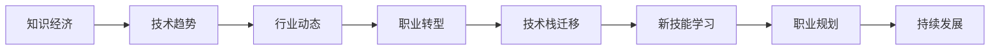

                 

## 1. 背景介绍

随着信息时代的到来，知识经济已经成为不可逆转的全球趋势。作为技术创新的核心力量，程序员在面对知识经济时代的新环境、新技术和新需求时，必须积极应对职业转型，以保持职业竞争力和市场地位。本文旨在探讨在知识经济下，程序员如何通过深入理解技术趋势、行业动态和自身优势，实现职业转型和技能提升。

## 2. 核心概念与联系

### 2.1 核心概念概述

- **知识经济**：以知识创新为核心驱动力的经济形态，强调创新、知识积累和知识产权保护。
- **程序员职业转型**：指程序员根据行业变化和个人职业规划，调整技术方向、职业路径和学习策略，以适应新环境、新需求。
- **技术趋势**：如云计算、人工智能、大数据、区块链等新兴技术，对程序员的职业选择具有重要影响。
- **行业动态**：如初创公司兴起、大型企业变革、市场需求变化等，对程序员的职业转型提供了重要参考。
- **职业规划**：涉及职业目标、学习路径、技能提升和职业发展等方面的规划和设计。

### 2.2 核心概念原理和架构的 Mermaid 流程图



## 3. 核心算法原理 & 具体操作步骤

### 3.1 算法原理概述

程序员职业转型涉及对新技术、新趋势的掌握和应用，以及对现有技术的升级和优化。其核心算法原理可以归纳为以下几个方面：

1. **知识积累**：通过学习和实践，掌握新技术和新理论，构建自身的知识体系。
2. **技能迁移**：将已有技能和经验，通过转译和应用，迁移到新领域或新工具。
3. **持续学习**：在知识经济时代，技术更新迭代迅速，持续学习是保持竞争力的关键。
4. **多维发展**：在技术深度和广度、个人项目和团队合作等方面进行全面发展。

### 3.2 算法步骤详解

**Step 1: 自我评估**

- 了解自身技能和经验，评估在知识经济时代的技术适配性。
- 识别出自身强项和短板，明确职业转型的方向和目标。

**Step 2: 技术栈迁移**

- 选择具备良好发展前景的技术栈或平台，进行深入学习和实践。
- 逐步放弃或优化现有的技术栈，避免技术“沉没成本”。

**Step 3: 新技能学习**

- 根据职业转型的方向，系统学习新领域的基础知识和技术。
- 通过在线课程、项目实践、技术社区等方式，不断提升新技能水平。

**Step 4: 实际项目实践**

- 在实际项目中应用新技能，解决实际问题，积累实战经验。
- 参与开源项目或社区活动，提升技术影响力和合作能力。

**Step 5: 职业规划与调整**

- 根据项目实践和新技能学习情况，调整职业规划，明确未来发展方向。
- 制定阶段性目标，定期评估职业发展进度，确保持续成长。

### 3.3 算法优缺点

**优点**：
- **高效适应性**：通过技术栈迁移和新技能学习，程序员可以快速适应新技术和市场需求。
- **全面发展**：新领域的知识和技能学习，提升技术深度和广度，增强职业竞争力。
- **持续进步**：在知识经济时代，持续学习和实践是保持竞争力的关键。

**缺点**：
- **学习成本高**：新技术和新领域的学习需要时间和精力投入。
- **适应风险高**：选择不合适的技术栈或学习方向，可能面临较大的职业风险。
- **资源投入大**：新技能的学习和项目实践需要资金、时间和精力的投入。

### 3.4 算法应用领域

- **云计算架构师**：掌握云平台（如AWS、Azure、Google Cloud）架构和运维技术。
- **人工智能工程师**：掌握机器学习、深度学习、自然语言处理等AI技术，应用在图像识别、语音识别、自然语言理解等领域。
- **大数据分析师**：掌握大数据处理、数据挖掘、数据可视化等技术，应用在大数据生态系统（如Hadoop、Spark）。
- **区块链开发者**：掌握区块链技术和智能合约开发，应用在加密货币、去中心化应用（DApp）等场景。
- **全栈工程师**：掌握前端、后端、数据库、移动端等多方面技术，构建全栈解决方案。

## 4. 数学模型和公式 & 详细讲解 & 举例说明

### 4.1 数学模型构建

在知识经济下，程序员职业转型涉及对技术趋势的把握和自身技能的学习。我们可以建立一个数学模型来描述这一过程。

设 $X$ 为程序员初始技能集，$Y$ 为新技能集，$Z$ 为转型后的职业技能集。则职业转型过程可以表示为：

$$
Z = f(X, Y)
$$

其中 $f$ 表示技能迁移和转化的函数，可以分解为多个子函数，如：

$$
f = g \circ h
$$

其中 $g$ 表示新技能学习过程，$h$ 表示技术栈迁移过程。

### 4.2 公式推导过程

- **技术栈迁移**：假设原有技能集 $X$ 和目标技能集 $Y$ 的交集为 $X \cap Y$，迁移过程可以表示为：

$$
Y_{\text{迁移}} = X \cap Y \cup (X - Y)
$$

其中 $X - Y$ 表示原有技能集中不再需要的部分。

- **新技能学习**：设 $X_{\text{学习}}$ 为需要学习的新技能，$Z_{\text{学习}}$ 为学习后的技能集。则：

$$
Z_{\text{学习}} = X_{\text{学习}} \cup Y_{\text{迁移}}
$$

- **技能转化**：设 $f_{\text{转化}}$ 为技能转化函数，则：

$$
Z = f_{\text{转化}}(Z_{\text{学习}})
$$

### 4.3 案例分析与讲解

以人工智能工程师转型为例：

1. **技术栈迁移**：从传统后端开发（如Java、Python）转型到AI领域，需要迁移的技能包括深度学习框架（如TensorFlow、PyTorch）、机器学习算法、数据处理技术等。

2. **新技能学习**：学习计算机视觉、自然语言处理、强化学习等AI相关领域的知识，提升在AI项目中的应用能力。

3. **技能转化**：将新技能与已有技术栈融合，应用在图像识别、语音识别、自然语言理解等领域，形成完整的AI解决方案。

## 5. 项目实践：代码实例和详细解释说明

### 5.1 开发环境搭建

在职业转型过程中，选择合适的开发环境至关重要。以下是基于Python的虚拟环境搭建步骤：

1. **安装Anaconda**：从官网下载并安装Anaconda，用于创建独立的Python环境。

2. **创建并激活虚拟环境**：
```bash
conda create -n myenv python=3.8 
conda activate myenv
```

3. **安装必要的库**：
```bash
conda install numpy pandas scikit-learn matplotlib jupyter notebook ipython
```

### 5.2 源代码详细实现

以下是一个简单的Python程序，用于数据预处理和模型训练，展示了学习新技能并应用于实际项目的过程：

```python
import pandas as pd
from sklearn.model_selection import train_test_split
from sklearn.linear_model import LogisticRegression
from sklearn.metrics import accuracy_score

# 数据加载
data = pd.read_csv('data.csv')

# 数据预处理
X = data.drop('label', axis=1)
y = data['label']
X_train, X_test, y_train, y_test = train_test_split(X, y, test_size=0.2, random_state=42)

# 模型训练
model = LogisticRegression()
model.fit(X_train, y_train)

# 模型评估
y_pred = model.predict(X_test)
accuracy = accuracy_score(y_test, y_pred)
print('Accuracy:', accuracy)
```

### 5.3 代码解读与分析

- **数据加载**：使用Pandas加载CSV格式的数据集。
- **数据预处理**：通过drop和split方法，将数据集划分为训练集和测试集。
- **模型训练**：使用Scikit-learn的LogisticRegression模型，对训练集进行拟合。
- **模型评估**：对测试集进行预测，并计算准确率。

## 6. 实际应用场景

### 6.1 云计算架构师

云计算架构师需要对云平台的技术栈有深入理解，能够设计和优化云架构，提升系统的性能和可扩展性。其主要工作包括：

- 设计云平台架构，如AWS、Azure、Google Cloud等。
- 优化云服务性能，如负载均衡、数据存储、网络安全等。
- 构建云应用，如云原生、微服务、容器化等。

### 6.2 人工智能工程师

人工智能工程师需要掌握AI核心技术，能够在图像识别、语音识别、自然语言处理等领域应用。其主要工作包括：

- 构建AI模型，如神经网络、深度学习模型等。
- 应用AI技术，如计算机视觉、自然语言处理等。
- 优化模型性能，如模型压缩、加速训练等。

### 6.3 大数据分析师

大数据分析师需要掌握大数据处理、数据挖掘和数据可视化技术，能够在大数据生态系统中进行数据处理和分析。其主要工作包括：

- 处理大数据，如Hadoop、Spark等。
- 数据挖掘，如关联规则、聚类、分类等。
- 数据可视化，如Tableau、PowerBI等。

### 6.4 区块链开发者

区块链开发者需要掌握区块链技术和智能合约开发，能够在加密货币和去中心化应用（DApp）中应用。其主要工作包括：

- 开发智能合约，如Solidity、Vyper等。
- 构建区块链应用，如以太坊、Hyperledger等。
- 优化区块链网络性能，如共识机制、分片等。

## 7. 工具和资源推荐

### 7.1 学习资源推荐

1. **Coursera**：提供广泛的在线课程，涵盖计算机科学、数据科学、人工智能等领域。
2. **edX**：提供由全球顶尖大学和机构提供的课程，涵盖多种学科和技术。
3. **Udacity**：提供以项目为中心的课程，涵盖人工智能、机器学习、云计算等。
4. **Kaggle**：提供数据科学竞赛平台，通过实际项目提升技能。
5. **Stack Overflow**：提供技术问答社区，解决编程难题和分享经验。

### 7.2 开发工具推荐

1. **GitHub**：提供代码托管和版本控制服务，方便团队协作和代码共享。
2. **JIRA**：提供项目管理工具，帮助团队跟踪任务和项目进度。
3. **Docker**：提供容器化部署解决方案，方便应用在不同环境中运行。
4. **Kubernetes**：提供容器编排和集群管理工具，提高应用的可伸缩性和可用性。
5. **PyCharm**：提供Python开发环境，支持多种框架和库。

### 7.3 相关论文推荐

1. **《云计算技术架构》**：详细介绍了云计算架构设计和技术实现。
2. **《人工智能基础》**：介绍了AI核心技术，如机器学习、深度学习等。
3. **《大数据技术与应用》**：介绍了大数据处理和分析技术。
4. **《区块链技术与应用》**：介绍了区块链技术和应用场景。
5. **《软件工程与项目管理》**：介绍了软件开发和项目管理方法。

## 8. 总结：未来发展趋势与挑战

### 8.1 研究成果总结

本文探讨了在知识经济下，程序员如何通过技术栈迁移和新技能学习，实现职业转型和技能提升。主要研究成果包括：

- 构建了程序员职业转型的数学模型，并推导了相关公式。
- 分析了职业转型过程中可能面临的技术栈迁移和新技能学习问题。
- 提供了实际项目实践的代码示例，展示了如何应用新技能解决实际问题。

### 8.2 未来发展趋势

未来，知识经济将继续推动技术创新和产业变革。程序员需要适应这一趋势，关注以下几个发展方向：

1. **云计算和分布式计算**：云计算和大数据处理技术将进一步发展，程序员需要掌握相关技术和工具。
2. **人工智能与机器学习**：AI技术和算法将不断进步，程序员需要掌握更多AI相关知识和技能。
3. **区块链与去中心化**：区块链技术将广泛应用于金融、供应链等领域，程序员需要了解相关应用场景和技术实现。
4. **新兴技术与应用**：如物联网、边缘计算、量子计算等新兴技术，程序员需要不断学习和实践。

### 8.3 面临的挑战

在职业转型过程中，程序员可能面临以下几个挑战：

1. **技术更新快**：知识经济时代技术更新迅速，需要不断学习和适应新技术。
2. **资源投入大**：学习新技术和实践新项目需要资金、时间和精力的投入。
3. **适应新环境**：新技术和新环境可能与原有经验不符，需要适应和调整。
4. **保持动力**：职业转型过程中可能会遇到挫折和困难，需要保持积极的心态和动力。

### 8.4 研究展望

未来，知识经济将继续推动技术创新和产业变革。程序员需要不断学习和实践，适应新环境和新需求，实现自身的职业发展和价值提升。研究展望包括：

1. **持续学习**：通过在线课程、项目实践和社区交流，不断提升自身技术水平。
2. **多维发展**：在技术深度和广度、项目实践和团队合作等方面进行全面发展。
3. **关注前沿技术**：关注新兴技术的发展动态，及时掌握和应用新技术。
4. **强化职业规划**：制定明确的职业目标和规划，定期评估和调整职业路径。

## 9. 附录：常见问题与解答

**Q1：如何选择合适的职业转型方向？**

A: 选择合适的职业转型方向需要考虑以下几个因素：

- **兴趣和爱好**：选择自己感兴趣和热爱的领域，有助于保持积极性和持久性。
- **市场需求**：关注市场需求和技术趋势，选择有发展前景的方向。
- **资源和能力**：评估自身资源和能力，选择适合自己的方向。

**Q2：如何高效学习新技能？**

A: 高效学习新技能可以通过以下方法：

- **系统学习**：通过在线课程、书籍和文档，系统学习新技能的基础知识和应用方法。
- **实践项目**：通过实际项目实践，巩固学习成果，积累实战经验。
- **社区交流**：加入技术社区和论坛，与同行交流经验，解决问题。

**Q3：如何应对转型过程中的挑战？**

A: 应对转型过程中的挑战可以通过以下方法：

- **心态调整**：保持积极心态，接受挑战和失败，不断学习和进步。
- **资源投入**：合理分配时间和资源，保证学习和实践的时间和精力。
- **寻求支持**：寻求导师、同事和社区的支持，共同解决问题和分享经验。

**Q4：如何选择适合的开发环境？**

A: 选择适合的开发环境需要考虑以下几个因素：

- **技术栈支持**：选择支持所需技术和工具的开发环境。
- **社区支持**：选择有活跃社区和开源项目支持的环境。
- **可扩展性**：选择易于扩展和集成的开发环境，方便后续项目开发。

**Q5：如何保持持续发展？**

A: 保持持续发展可以通过以下方法：

- **定期学习**：定期参加培训和课程，不断提升技术水平。
- **参与开源**：参与开源项目和社区活动，提升技术影响力和合作能力。
- **技术跟踪**：关注技术动态和前沿技术，保持持续学习和实践。

---

作者：禅与计算机程序设计艺术 / Zen and the Art of Computer Programming

