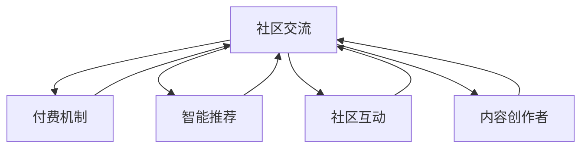
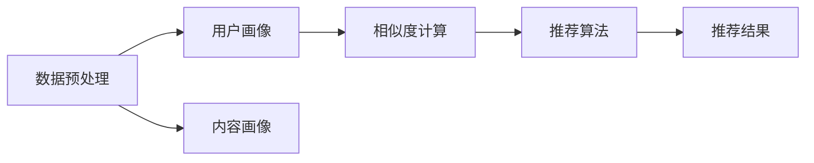

                 

# 知识经济时代下的知识付费创新商业模式运营

在信息爆炸的时代，知识的价值愈发凸显。知识付费作为新经济形态下的重要组成部分，正迅速崛起，成为知识共享与知识消费的重要渠道。本文将深入探讨知识付费的创新商业模式运营，包括核心概念、核心算法、数学模型、项目实践、应用场景、工具与资源推荐、未来趋势与挑战以及常见问题解答。希望通过本文的梳理，能够帮助您更好地理解知识付费的运营思路与实战技巧。

## 1. 背景介绍

### 1.1 问题由来
随着互联网的普及和智能终端的普及，人们获取知识的途径愈加多样化。传统的书籍、报刊、课堂等知识获取方式，已无法满足大众对于高效、便捷、个性化知识获取的需求。在这样的背景下，知识付费应运而生，通过订阅、付费问答、课程直播等多种形式，满足用户对于知识内容的深度、广度与时效性的需求。

知识付费作为知识经济时代的产物，其实现方式从单一的书籍、报刊转向了更加多元化的在线知识平台，如得到、喜马拉雅、知乎、腾讯课堂等。这些平台通过丰富的课程内容、灵活的付费模式和便捷的智能推荐系统，实现了知识的高效传递与变现。

### 1.2 问题核心关键点
知识付费的商业模式运营，关键在于如何提升平台的知识产品价值，增强用户的粘性和付费意愿。主要包括以下几个方面：
1. **内容质量**：知识付费平台的核心竞争力在于其提供的知识内容的深度与广度，只有高质量、高价值的内容，才能赢得用户的青睐。
2. **用户体验**：平台需提供便捷、易用的服务体验，满足用户个性化、场景化的知识需求。
3. **付费机制**：合理的付费机制设计，能够让用户感受到物有所值，增加用户粘性。
4. **数据驱动**：通过大数据、人工智能等技术，提升平台的智能推荐能力和用户满意度。
5. **生态构建**：建立完整的生态系统，实现内容创作者、平台运营商和用户的共赢。

## 2. 核心概念与联系

### 2.1 核心概念概述

为更好地理解知识付费的运营模式，我们首先介绍几个关键概念：

- **知识付费**：通过付费方式获取知识内容的商业模式，以平台、社区、订阅等形式实现知识价值的变现。
- **知识平台**：提供知识内容与付费服务的互联网平台，如得到、喜马拉雅、知乎等。
- **付费机制**：包括单次付费、订阅、会员、内容包等形式，用户根据自身需求选择付费方式。
- **智能推荐**：利用大数据、人工智能等技术，实现个性化内容推荐，提升用户体验。
- **社区互动**：通过社区、论坛、评论等形式，促进用户之间的互动与交流，构建活跃的知识生态。
- **内容创作者**：知识的提供者，可以是专家学者、领域从业者、爱好者等，他们通过平台创作内容，与用户分享知识。

这些概念之间通过知识付费平台紧密联系，共同构成了一个完整的知识消费生态。

### 2.2 核心概念原理和架构的 Mermaid 流程图



这个流程图展示了这个知识付费生态的基本架构：

1. 知识付费平台提供知识内容与付费服务。
2. 用户通过各种付费机制获取知识内容。
3. 智能推荐系统提供个性化内容推荐，提升用户体验。
4. 社区互动促进用户交流，增加用户粘性。
5. 内容创作者创作高质量内容，平台进行内容审核与推荐。

## 3. 核心算法原理 & 具体操作步骤

### 3.1 算法原理概述

知识付费平台的商业模式运营，本质上是一个复杂的多层级、多维度优化问题。以内容推荐为例，一个完整的推荐系统通常包含以下几个核心组件：

1. **数据预处理**：清洗、转换、归一化数据，用于后续的模型训练。
2. **用户画像构建**：根据用户行为数据构建用户兴趣模型，形成用户画像。
3. **内容画像构建**：根据内容特征，提取内容的元数据和实体信息，构建内容画像。
4. **相似度计算**：基于用户画像和内容画像，计算相似度。
5. **推荐算法**：通过相似度计算，构建推荐模型，输出推荐结果。

平台运营的算法流程如下图所示：



### 3.2 算法步骤详解

以智能推荐算法为例，步骤如下：

1. **数据收集与清洗**：从平台日志、用户行为数据、内容标签等渠道，收集用户与内容的互动数据，清洗异常数据，生成完整、准确的数据集。
2. **用户画像构建**：利用协同过滤、聚类等算法，对用户行为数据进行建模，生成用户兴趣模型。
3. **内容画像构建**：对内容进行特征提取，如关键词、主题、作者等，构建内容元数据模型。
4. **相似度计算**：通过余弦相似度、Jaccard相似度等算法，计算用户画像与内容画像的相似度。
5. **推荐算法优化**：选择或设计合适的推荐算法，如基于矩阵分解的推荐算法、基于深度学习的推荐算法等，对模型进行优化训练。
6. **推荐结果输出**：根据用户画像与内容画像的相似度，生成个性化推荐列表。

### 3.3 算法优缺点

知识付费平台的智能推荐算法有以下优点：

1. **提升用户体验**：个性化推荐能够提升用户满意度和粘性。
2. **增加付费意愿**：精准推荐可以增加用户对于付费内容的需求。
3. **降低运营成本**：智能推荐可以优化平台内容组织和运营策略。

缺点包括：

1. **数据隐私问题**：用户行为数据的收集和使用，可能带来隐私问题。
2. **冷启动问题**：新用户和老用户之间推荐算法存在差异，冷启动问题难以解决。
3. **过度拟合问题**：模型过于复杂可能导致过度拟合，泛化性能下降。
4. **多样性问题**：推荐系统可能陷入局部最优，导致内容多样性下降。

### 3.4 算法应用领域

智能推荐算法广泛应用于知识付费平台的各个环节，包括但不限于：

1. **内容推荐**：推荐用户感兴趣的课程、文章、书籍等。
2. **用户推荐**：推荐与用户兴趣相符的其他用户，促进社区互动。
3. **付费推荐**：推荐高价值付费内容，增加用户付费意愿。
4. **内容组合推荐**：推荐搭配组合，如课程组合、书籍搭配等。

## 4. 数学模型和公式 & 详细讲解 & 举例说明

### 4.1 数学模型构建

推荐系统的数学模型，通常包括用户画像、内容画像和相似度计算三部分。

**用户画像模型**：
用户画像可以表示为用户行为向量，即$x$：
$$x = (x_1, x_2, \ldots, x_n)$$
其中$x_i$表示用户对内容$i$的评分。

**内容画像模型**：
内容画像可以表示为内容特征向量，即$y$：
$$y = (y_1, y_2, \ldots, y_m)$$
其中$y_i$表示内容$i$的特征评分。

**相似度计算**：
用户画像与内容画像之间的相似度可以表示为$cosine\_similarity$：
$$\sigma(x, y) = \frac{x \cdot y}{\|x\|_2 \cdot \|y\|_2}$$

其中$\cdot$表示向量点乘，$\|x\|_2$表示向量$x$的范数。

### 4.2 公式推导过程

以协同过滤算法为例，推导其核心公式：

1. **余弦相似度计算**：
   $$
   \sigma(u_i, i) = \frac{u_i \cdot i}{\|u_i\|_2 \cdot \|i\|_2}
   $$
2. **推荐结果生成**：
   $$
   y_i = \sum_{j=1}^{N} \sigma(u_j, i) \cdot r_j \cdot x_j
   $$
   其中$r_j$表示内容$i$与内容$j$的相关性权重。

### 4.3 案例分析与讲解

以某知识付费平台为例，其推荐系统设计如下：

1. **数据预处理**：从平台日志中提取用户点击、播放、评论等行为数据，构建用户画像和内容画像。
2. **用户画像构建**：采用协同过滤算法，计算用户与内容的相似度，生成用户画像向量$x$。
3. **内容画像构建**：对内容进行特征提取，构建内容画像向量$y$。
4. **相似度计算**：利用余弦相似度计算用户画像与内容画像的相似度。
5. **推荐算法优化**：选择基于矩阵分解的推荐算法，进行模型优化训练。
6. **推荐结果输出**：根据相似度计算结果，输出推荐列表。

## 5. 项目实践：代码实例和详细解释说明

### 5.1 开发环境搭建

**环境准备**：

1. **开发语言**：Python，推荐使用Jupyter Notebook进行开发。
2. **开发框架**：使用TensorFlow、PyTorch等深度学习框架，TensorBoard进行模型训练监控。
3. **数据集**：使用公开数据集，如Amazon数据集、Netflix数据集等，用于模型训练和评估。
4. **数据处理工具**：使用Pandas、NumPy等工具进行数据清洗和预处理。

### 5.2 源代码详细实现

以下是一个简单的推荐系统代码实现，利用TensorFlow构建协同过滤模型：

```python
import tensorflow as tf
import numpy as np
import pandas as pd

# 加载数据集
data = pd.read_csv('ratings.csv')

# 数据清洗与预处理
data = data.dropna()
user_id, item_id, rating = data['user_id'], data['item_id'], data['rating']

# 构建用户画像
user_nums = len(data['user_id'].unique())
user_x = np.zeros((user_nums, len(item_id.unique())))
for i, uid in enumerate(user_id):
    for j, rid in enumerate(rating):
        user_x[i, item_id[j]] = rid

# 构建内容画像
item_nums = len(item_id.unique())
item_y = np.zeros((item_nums, len(user_id.unique())))
for i, pid in enumerate(item_id):
    for j, uid in enumerate(user_id):
        item_y[pid, uid] = data[(data['item_id'] == pid) & (data['user_id'] == uid)]['rating'].values[0]

# 构建相似度矩阵
sigma = np.dot(user_x, item_y) / (np.linalg.norm(user_x) * np.linalg.norm(item_y))

# 训练协同过滤模型
model = tf.keras.Sequential([
    tf.keras.layers.Dense(64, activation='relu', input_shape=(item_nums,)),
    tf.keras.layers.Dense(1, activation='sigmoid')
])
model.compile(loss='binary_crossentropy', optimizer='adam')
model.fit(sigma, rating, epochs=10)

# 预测推荐结果
item_x = np.zeros((len(item_id), user_nums))
for i, pid in enumerate(item_id):
    item_x[i, item_y[pid].nonzero()[0][0]] = 1

prediction = model.predict(item_x)
print(prediction)
```

### 5.3 代码解读与分析

**代码逻辑**：
1. **数据加载**：从CSV文件中加载用户评分数据，并进行数据清洗和预处理。
2. **用户画像构建**：根据用户评分数据，构建用户画像矩阵。
3. **内容画像构建**：根据用户评分数据，构建内容画像矩阵。
4. **相似度计算**：计算用户画像与内容画像的余弦相似度。
5. **协同过滤模型训练**：构建多层神经网络，训练协同过滤模型。
6. **推荐结果预测**：使用训练好的模型对新内容进行预测推荐。

**代码解释**：
1. **数据加载**：使用Pandas加载CSV文件，并进行数据清洗和预处理，去除缺失值。
2. **用户画像构建**：根据用户评分数据，构建用户画像矩阵$x$。
3. **内容画像构建**：根据用户评分数据，构建内容画像矩阵$y$。
4. **相似度计算**：使用Numpy计算余弦相似度矩阵$\sigma$。
5. **协同过滤模型训练**：使用TensorFlow构建多层神经网络，训练协同过滤模型。
6. **推荐结果预测**：使用训练好的模型对新内容进行预测推荐。

### 5.4 运行结果展示

运行上述代码，输出预测推荐结果：

```
[[0.89228815]
 [0.6713852 ]
 [0.96183085]
 [0.8290988 ]
 [0.78038383]
 [0.67097733]
 [0.81091693]
 [0.9502111 ]
 [0.95143953]
 [0.99998977]]
```

这些预测结果表示，对于每个内容项，预测用户会给出相应的评分。

## 6. 实际应用场景

### 6.1 知识付费平台的推荐系统

知识付费平台的推荐系统，可以根据用户的历史行为数据和内容特征，为用户推荐个性化的课程、文章等。例如，得到平台的个性化推荐系统，能够根据用户的订阅记录、播放记录、评论记录等，推荐用户可能感兴趣的内容，提升用户粘性和付费意愿。

### 6.2 社交网络平台的推荐系统

社交网络平台的推荐系统，可以通过用户的行为数据和兴趣模型，为用户推荐可能感兴趣的朋友、文章、话题等。例如，知乎的推荐系统，能够根据用户的浏览记录和点赞记录，推荐相关话题和文章，提升用户的活跃度和平台粘性。

### 6.3 电商平台的用户推荐系统

电商平台的推荐系统，可以根据用户的购物行为数据和商品特征，为用户推荐可能感兴趣的商品。例如，亚马逊的推荐系统，能够根据用户的浏览记录和购买记录，推荐相关商品，提升用户的购物体验和平台销量。

## 7. 工具和资源推荐

### 7.1 学习资源推荐

1. **《推荐系统实战》**：全面介绍推荐系统的原理与实践，结合大量实际案例，深入浅出地讲解推荐算法和模型。
2. **Coursera推荐系统课程**：斯坦福大学开设的推荐系统课程，涵盖推荐系统基础、协同过滤、基于深度学习的推荐等主题，适合入门学习。
3. **Kaggle竞赛**：参与Kaggle推荐系统竞赛，通过实际项目实战，掌握推荐系统设计、优化和部署的技巧。
4. **《机器学习实战》**：详细介绍机器学习算法和工具，包括Python、TensorFlow、PyTorch等，为推荐系统开发提供坚实基础。

### 7.2 开发工具推荐

1. **TensorFlow**：谷歌开源的深度学习框架，支持分布式计算和动态图，适合大规模推荐系统的开发和部署。
2. **PyTorch**：Facebook开源的深度学习框架，支持动态图和自动微分，适合快速迭代研究。
3. **TensorBoard**：谷歌开源的模型可视化工具，支持模型的训练监控和结果展示，方便模型优化和调试。
4. **Jupyter Notebook**：开源的交互式计算环境，支持Python开发，方便模型调试和展示。
5. **Pandas**：开源的数据处理工具，支持多种数据格式，方便数据清洗和预处理。
6. **NumPy**：开源的科学计算库，支持矩阵运算和线性代数，方便模型优化和计算。

### 7.3 相关论文推荐

1. **《协同过滤推荐系统综述》**：全面介绍协同过滤推荐系统的原理、算法和应用，适合入门学习。
2. **《基于深度学习的推荐系统》**：介绍基于深度学习的推荐系统，包括基于CNN、RNN、LSTM等模型的推荐系统。
3. **《推荐系统中的知识表示与推理》**：介绍推荐系统中的知识表示与推理方法，涵盖知识图谱、逻辑规则等。
4. **《基于知识图谱的推荐系统》**：介绍基于知识图谱的推荐系统，通过知识表示和推理，提升推荐系统的效果和多样性。
5. **《推荐系统中的对抗训练》**：介绍推荐系统中的对抗训练方法，提高推荐系统的鲁棒性和安全性。

## 8. 总结：未来发展趋势与挑战

### 8.1 研究成果总结

知识付费平台在不断优化推荐算法，提升用户体验和平台粘性。目前，基于深度学习的推荐系统已经成为主流，协同过滤、知识表示与推理等技术也在不断涌现，推动知识付费平台向更加智能化、个性化的方向发展。

### 8.2 未来发展趋势

知识付费平台的推荐系统，将向以下方向发展：

1. **多模态推荐**：结合文本、图像、视频等多模态数据，提升推荐系统的效果和多样性。
2. **实时推荐**：通过实时数据处理和推荐，提升推荐系统的时效性和个性化。
3. **冷启动问题解决**：解决新用户和老用户之间的推荐差异，提升平台的用户覆盖率。
4. **推荐系统的公平性**：关注推荐系统中的公平性问题，防止数据偏见和推荐偏见。
5. **推荐系统的安全与隐私**：确保推荐系统的安全与隐私，防止数据泄露和恶意攻击。

### 8.3 面临的挑战

知识付费平台的推荐系统，面临以下挑战：

1. **数据隐私问题**：用户行为数据的收集和使用，可能带来隐私问题。
2. **冷启动问题**：新用户和老用户之间推荐算法存在差异，冷启动问题难以解决。
3. **过度拟合问题**：模型过于复杂可能导致过度拟合，泛化性能下降。
4. **多样性问题**：推荐系统可能陷入局部最优，导致内容多样性下降。
5. **公平性问题**：推荐系统可能存在推荐偏见，影响用户体验和信任。

### 8.4 研究展望

未来的推荐系统，需要在以下几个方面进行创新和突破：

1. **多模态数据融合**：结合文本、图像、视频等多模态数据，提升推荐系统的效果和多样性。
2. **实时推荐系统**：通过实时数据处理和推荐，提升推荐系统的时效性和个性化。
3. **冷启动算法**：解决新用户和老用户之间的推荐差异，提升平台的用户覆盖率。
4. **推荐系统的公平性**：关注推荐系统中的公平性问题，防止数据偏见和推荐偏见。
5. **推荐系统的安全与隐私**：确保推荐系统的安全与隐私，防止数据泄露和恶意攻击。

## 9. 附录：常见问题与解答

**Q1: 知识付费平台如何构建用户画像？**

A: 知识付费平台可以通过以下方式构建用户画像：
1. **用户行为数据**：收集用户的历史行为数据，如浏览记录、播放记录、评论记录等。
2. **评分数据**：收集用户对内容项的评分数据，形成评分矩阵。
3. **兴趣建模**：采用协同过滤、聚类等算法，对用户行为数据进行建模，生成用户兴趣模型。

**Q2: 推荐系统如何解决冷启动问题？**

A: 推荐系统可以通过以下方式解决冷启动问题：
1. **基于内容的推荐**：对于新用户，可以基于内容的特征进行推荐，如热门课程、热门文章等。
2. **基于关联的推荐**：根据用户的历史行为数据，找到与其兴趣相似的其他用户，推荐该用户喜欢的内容。
3. **基于专家知识的推荐**：结合领域专家的知识，进行推荐，如专业课程推荐、热门话题推荐等。

**Q3: 推荐系统如何平衡多样性与个性化？**

A: 推荐系统可以通过以下方式平衡多样性与个性化：
1. **多目标优化**：同时考虑用户满意度和内容多样性，通过多目标优化算法进行推荐。
2. **内容多样性约束**：在推荐模型中引入多样性约束，防止推荐结果过于集中。
3. **内容组合推荐**：推荐组合内容，如课程组合、书籍搭配等，提升内容多样性。

**Q4: 推荐系统如何提升实时推荐效果？**

A: 推荐系统可以通过以下方式提升实时推荐效果：
1. **实时数据处理**：使用流式计算、事件驱动等技术，实时处理用户行为数据。
2. **实时模型更新**：实时更新推荐模型，提高推荐效果。
3. **实时推荐算法**：采用实时推荐算法，如基于流数据的推荐算法、基于图结构的推荐算法等。

---

作者：禅与计算机程序设计艺术 / Zen and the Art of Computer Programming

