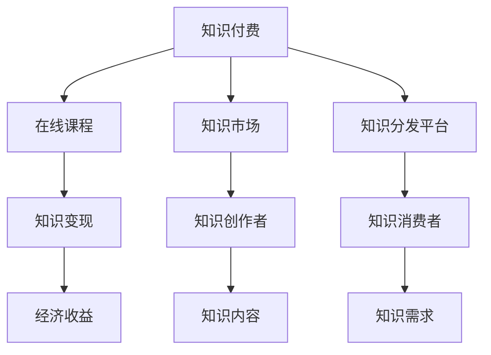

                 

# 知识经济时代的知识付费赚钱原理与方法实践

> 关键词：知识付费,知识经济,赚钱原理,方法实践

## 1. 背景介绍

### 1.1 问题由来
在知识经济时代，随着信息技术的飞速发展，知识的传播、获取和应用变得前所未有地便捷。然而，知识的“免费”获取方式也引发了一系列问题，如盗版、侵权、质量参差不齐等。为了保护知识创作者的权益，知识付费逐渐成为了一种新兴的商业模式，通过为高质量、高价值的知识内容付费，既保障了内容生产者的利益，也为消费者提供了更为优质、专业、系统的知识服务。

### 1.2 问题核心关键点
知识付费的核心在于内容的质量和创作者的专业能力。通过知识付费，内容创作者可以将自己的知识和经验转化为经济价值，激励更多的高质量知识产出。同时，消费者也能更加高效、精准地获取到自己需要的知识，实现知识的“按需消费”。

知识付费的商业模式涵盖了多种形式，包括在线课程、电子书、咨询服务、直播答疑、会员订阅等。其中，在线课程是知识付费领域的主流形式，以其系统性、专业性、可存取性等特点，受到了广泛关注。本文将重点探讨在线课程的知识付费赚钱原理与方法实践。

### 1.3 问题研究意义
研究知识付费的赚钱原理与方法，对于知识创作者的变现能力提升、知识消费市场的发展壮大、知识服务平台的商业模式优化具有重要意义。

1. **变现能力提升**：通过科学合理的知识定价与分发策略，使内容创作者能够更好地实现其知识和经验的商业价值。
2. **市场发展壮大**：为消费者提供更高质量、更系统的知识服务，推动知识消费市场的发展，提升社会整体的知识水平。
3. **平台商业模式优化**：为知识付费平台提供科学的运营策略，提升平台的用户粘性和商业盈利能力。

## 2. 核心概念与联系

### 2.1 核心概念概述

为更好地理解知识付费的赚钱原理与方法实践，本节将介绍几个密切相关的核心概念：

- **知识付费**：指通过为高质量、高价值的知识内容付费，获取知识和服务的商业模式。
- **在线课程**：指通过互联网平台提供的视频、音频、文字等多种形式的知识内容。
- **知识市场**：指知识创作者的创作与知识消费者的消费在互联网平台上形成交易的市场。
- **知识分发平台**：指提供知识创作、发布、交易、评价等服务的互联网平台，如Coursera、Udemy、网易云课堂等。
- **知识变现**：指通过在线课程等知识产品，实现知识创作者的经济收益。

这些核心概念之间的逻辑关系可以通过以下Mermaid流程图来展示：



这个流程图展示了这个生态系统的核心概念及其之间的关系：

1. 知识付费通过在线课程等形式，连接知识创作者与消费者，形成一个市场。
2. 知识分发平台提供交易的场所，促进知识内容的分发与变现。
3. 知识创作者利用平台分发知识内容，满足消费者需求。
4. 消费者通过付费获取所需知识，实现知识的“按需消费”。
5. 知识内容通过销售实现知识创作者的变现，形成经济收益。

## 3. 核心算法原理 & 具体操作步骤
### 3.1 算法原理概述

知识付费的赚钱原理主要基于价值交换理论，通过高质量知识内容的创作、分发与消费，实现创作者与消费者之间的价值交换。在线课程作为知识付费的主要形式，其核心在于内容的优质与系统性，通过科学定价与分发策略，最大化知识内容的商业价值。

### 3.2 算法步骤详解

#### 3.2.1 课程设计与制作

1. **课程主题选择**：
   - **目标人群**：确定目标学习者群体，了解他们的知识需求和学习习惯。
   - **市场调研**：通过调研分析市场中的热门主题和趋势，选择具有潜力的课程主题。
   - **创新性**：课程内容需具有独创性和前瞻性，区别于市场上的现有课程。

2. **课程大纲设计**：
   - **模块划分**：将课程内容划分为多个模块，确保知识体系的完整性和逻辑性。
   - **内容深度**：每个模块需深度讲解，且难度适宜，避免过于浅显或过于深奥。
   - **互动设计**：设计互动环节，如小测验、讨论区等，增强学习效果。

3. **课程制作**：
   - **视频录制**：根据课程大纲录制视频内容，确保讲解生动、易懂。
   - **PPT制作**：制作配套的PPT资料，增强可视化效果。
   - **文字整理**：整理课程视频的文字稿，供用户阅读。

#### 3.2.2 定价策略

1. **成本评估**：
   - **制作成本**：评估课程制作所需的软硬件、人力成本。
   - **运营成本**：包括平台交易手续费、推广费用、客户服务费用等。
   - **预期收益**：结合市场调研结果，预估课程的潜在收益。

2. **定价模型**：
   - **按需付费**：课程分为免费试用和付费购买两部分，免费试用内容简单，付费内容详细且深入。
   - **分级定价**：课程按模块或课程整体分级定价，不同层次的课程价格不同，满足不同层次的学习需求。
   - **限时折扣**：新课程上线时提供限时折扣，吸引用户付费购买。

3. **价格调整**：
   - **用户反馈**：根据用户评价和购买数据，调整课程价格。
   - **市场需求**：结合市场变化和竞争情况，调整课程定价。

#### 3.2.3 分发与推广

1. **平台选择**：
   - **平台适配性**：选择与课程内容和用户群体适配的平台，如Coursera、Udemy、网易云课堂等。
   - **平台优势**：考虑平台的用户量、市场知名度、用户粘性等因素。

2. **分发渠道**：
   - **平台发布**：通过平台的课程发布功能，上传课程内容和资料。
   - **社交媒体**：利用微博、微信、YouTube等社交媒体平台进行课程推广。
   - **合作伙伴**：与行业内权威机构或专家合作推广课程。

3. **推广活动**：
   - **优惠活动**：定期推出优惠活动，吸引用户购买课程。
   - **用户评价**：鼓励用户评价课程，利用口碑效应吸引新用户。
   - **社区互动**：在课程论坛或社区中积极互动，解答用户问题，提升用户满意度。

#### 3.2.4 用户反馈与优化

1. **用户评价**：
   - **课程评价**：收集用户对课程内容和形式的评价，分析用户反馈。
   - **服务评价**：收集用户对平台服务、课程交付等的评价。

2. **课程优化**：
   - **内容更新**：根据用户反馈，更新和优化课程内容。
   - **格式改进**：调整视频、PPT、文字稿等格式，提升用户体验。
   - **互动增强**：增加互动环节，提高学习效果。

3. **市场调整**：
   - **新课发布**：根据市场反馈，推出新课程，满足不同学习需求。
   - **价格调整**：结合市场变化，调整课程定价，提升市场竞争力。

### 3.3 算法优缺点

#### 3.3.1 优点

1. **高效变现**：通过高质量的在线课程，创作者能够快速实现商业变现，避免传统出版和销售的繁琐流程。
2. **灵活性高**：在线课程可以随时随地学习，不受时间和地点限制，提高了学习的灵活性。
3. **市场潜力大**：随着知识经济的发展，知识付费市场逐渐成熟，市场需求不断增长，创作者有广阔的发展空间。
4. **用户粘性高**：平台通过互动环节、用户评价、优惠活动等手段，提升用户粘性，增强用户留存率。

#### 3.3.2 缺点

1. **课程质量参差不齐**：部分课程质量不高，无法满足用户需求，导致用户流失。
2. **用户付费意愿低**：部分用户对知识付费持怀疑态度，影响课程销售。
3. **市场竞争激烈**：市场上知识付费课程众多，创作者需要不断创新和优化，才能在竞争中脱颖而出。
4. **运营成本高**：平台运营和课程制作需投入大量成本，初期回报周期长。

### 3.4 算法应用领域

知识付费的赚钱原理与方法实践不仅适用于在线课程领域，还适用于电子书、咨询服务、直播答疑、会员订阅等多种知识付费形式。

1. **电子书**：通过电子书销售，创作者将书籍内容转化为商业价值。用户按需购买电子书，获取所需知识。
2. **咨询服务**：创作者提供专家咨询服务，根据用户需求提供个性化解决方案，实现知识变现。
3. **直播答疑**：通过直播平台提供实时答疑服务，用户支付费用，获得专家指导。
4. **会员订阅**：用户支付会员费用，获得平台提供的各类知识资源和增值服务。

## 4. 数学模型和公式 & 详细讲解 & 举例说明

### 4.1 数学模型构建

在线课程的知识付费机制可以抽象为一种基于市场供需的定价模型。假设知识内容的质量为 $Q$，学习者的需求为 $D$，知识市场的供需关系可以用以下数学模型描述：

$$
P(Q, D) = \frac{Q}{D}
$$

其中 $P$ 为课程价格，$Q$ 为课程质量，$D$ 为学习者需求。

### 4.2 公式推导过程

根据上述模型，可以推导出如下结论：

- **质量越高，价格越高**：课程质量 $Q$ 越高，用户对其的支付意愿越强，价格 $P$ 也越高。
- **需求越高，价格越高**：学习者需求 $D$ 越高，课程的市场价值越高，价格 $P$ 也越高。

### 4.3 案例分析与讲解

#### 案例分析

某在线教育平台推出了一门编程课程，市场调研显示该课程的目标用户为有一定编程基础的大学生和初级开发者。课程内容分为入门、进阶、高级三个模块，分别定价为199元、499元、899元。课程上线后，平台采取了以下推广策略：

1. **限时折扣**：新用户首次购买课程时，享受7天免费试用。
2. **用户评价**：在课程页面展示高评分用户的学习反馈，增加用户购买信心。
3. **社交媒体推广**：通过微博、微信、YouTube等平台，利用优质视频片段进行推广。

经过3个月的市场运营，课程获得了良好的用户反馈和销售成绩，平台实现了可观的商业收益。

#### 讲解

1. **课程质量评估**：
   - **内容深度**：课程内容系统性强，覆盖了编程基础到高级的多个方面。
   - **制作质量**：视频录制清晰，讲解生动，PPT制作精美。

2. **市场需求分析**：
   - **目标用户**：课程针对有一定编程基础的大学生和初级开发者，市场需求旺盛。
   - **市场竞争**：市场上类似课程虽多，但质量参差不齐，用户需求难以满足。

3. **推广策略实施**：
   - **限时折扣**：通过限时折扣吸引用户试用课程，提高购买转化率。
   - **用户评价**：利用用户评价提升课程可信度，增加用户购买意愿。
   - **社交媒体推广**：通过优质视频片段进行推广，增加课程曝光率，吸引更多用户。

## 5. 项目实践：代码实例和详细解释说明

### 5.1 开发环境搭建

进行在线课程的知识付费项目开发，需要搭建Python开发环境，并选择合适的开发工具和框架。以下是详细步骤：

1. **安装Python**：
   - 从官网下载并安装Python最新版本。
   - 添加环境变量，确保开发工具能够访问Python。

2. **安装开发工具**：
   - **Jupyter Notebook**：用于编写和运行Python代码，支持多种语言和库。
   - **PyCharm**：一款流行的Python IDE，提供代码补全、调试、版本控制等功能。

3. **安装相关库**：
   - **Pandas**：用于数据处理和分析。
   - **Numpy**：用于科学计算和数值运算。
   - **Matplotlib**：用于数据可视化。
   - **Flask**：用于搭建Web服务，实现在线课程的发布和管理。

### 5.2 源代码详细实现

以下是一个简单的在线课程发布系统的实现代码，包括课程发布、用户登录、支付等功能。

```python
# 导入相关库
import pandas as pd
import numpy as np
import matplotlib.pyplot as plt
from flask import Flask, render_template, request, session

# 初始化Flask应用
app = Flask(__name__)

# 定义用户登录页面
@app.route('/')
def login():
    if 'username' in session:
        return render_template('home.html', username=session['username'])
    else:
        return render_template('login.html')

# 定义用户注册页面
@app.route('/register', methods=['POST'])
def register():
    username = request.form['username']
    password = request.form['password']
    session['username'] = username
    return '注册成功，欢迎使用系统！'

# 定义课程发布页面
@app.route('/add_course')
def add_course():
    course_name = request.form['course_name']
    course_price = request.form['course_price']
    course_description = request.form['course_description']
    course_quality = request.form['course_quality']
    session['course'] = {
        'name': course_name,
        'price': course_price,
        'description': course_description,
        'quality': course_quality
    }
    return '课程发布成功！'

# 定义支付页面
@app.route('/payment')
def payment():
    if 'username' not in session:
        return '请先登录'
    if 'course' not in session:
        return '请先发布课程'
    course = session['course']
    return render_template('payment.html', course=course)

# 启动应用
if __name__ == '__main__':
    app.run(debug=True)
```

### 5.3 代码解读与分析

#### 代码解读

1. **Flask框架**：
   - **路由**：通过`@app.route`装饰器定义不同的路由，如登录、注册、发布课程、支付等。
   - **模板渲染**：使用`render_template`函数渲染HTML模板，展示用户界面。
   - **表单处理**：使用`request.form`获取用户提交的表单数据，处理登录、注册、发布课程等操作。

2. **会话管理**：
   - **用户登录**：通过`session`存储用户信息，实现用户登录状态的管理。
   - **课程发布**：通过`session`存储课程信息，实现课程发布和管理。

3. **功能模块**：
   - **登录与注册**：通过用户注册和登录功能，保障用户数据安全。
   - **课程发布**：实现课程的发布和管理，方便用户查找和购买。
   - **支付功能**：通过支付功能，实现课程的收费和交易管理。

#### 代码分析

1. **用户登录和注册**：
   - **安全性**：用户登录和注册功能需要确保用户数据的安全，防止恶意攻击。
   - **用户体验**：页面设计简洁友好，引导用户完成注册和登录操作。

2. **课程发布**：
   - **功能完整性**：课程发布功能需要支持课程的基本信息（如名称、价格、描述、质量等），并能够保存和回显。
   - **操作便捷性**：用户可以方便地发布课程，获取课程相关信息。

3. **支付功能**：
   - **安全性**：支付功能需要确保用户数据的安全，防止交易风险。
   - **用户体验**：支付页面简洁明了，用户能够快速完成支付操作。

### 5.4 运行结果展示

#### 运行结果

启动应用后，在浏览器中访问`http://127.0.0.1:5000/`，即可进入登录页面。输入用户名和密码，点击登录按钮，系统跳转到首页，显示用户相关信息。

点击“发布课程”按钮，进入课程发布页面，填写课程基本信息后，点击发布按钮，即可保存课程信息。

点击“支付课程”按钮，进入支付页面，展示课程信息，用户选择支付方式并完成支付，系统提示支付成功。

## 6. 实际应用场景

### 6.1 智能教育

在线课程在智能教育领域具有广泛的应用。通过知识付费，学生可以在线获取高质量的课程资源，提升学习效果。平台可以通过数据分析和人工智能技术，个性化推荐课程，提升学习体验。

### 6.2 职业培训

在线课程在职业培训领域也有重要应用。企业可以提供在线课程，帮助员工提升技能，实现自我提升。知识付费平台可以与企业合作，提供定制化的培训课程，提升员工工作效率和职业素养。

### 6.3 知识变现

在线课程的另一个重要应用是知识变现。知识创作者可以通过发布高质量的课程内容，实现知识变现，激励更多的创作者产出优质内容。平台可以通过数据分析和营销策略，提升课程销量和用户粘性，实现商业盈利。

## 7. 工具和资源推荐

### 7.1 学习资源推荐

1. **《知识付费：从理论到实践》**：详细介绍知识付费的理论基础、商业模式和实施方法，推荐阅读。
2. **《在线课程设计与开发》**：系统介绍在线课程的课程设计、制作和发布流程，提供丰富的案例和技巧。
3. **Coursera、Udemy等在线教育平台**：提供丰富的在线课程资源和教学经验，供学习和参考。
4. **Python编程基础**：提供Python编程基础教程，帮助初学者入门在线课程开发。

### 7.2 开发工具推荐

1. **Jupyter Notebook**：支持多种语言和库，方便编写和运行代码。
2. **PyCharm**：功能强大的Python IDE，提供代码补全、调试、版本控制等功能。
3. **Flask**：轻量级的Web框架，方便搭建在线课程发布和管理系统。

### 7.3 相关论文推荐

1. **《知识付费：现状、问题与展望》**：总结知识付费的发展历程、现状和未来趋势，提供深刻的洞见。
2. **《在线课程设计与实施研究》**：探讨在线课程的课程设计、制作和实施流程，提供丰富的案例和经验。
3. **《知识付费平台运营策略》**：分析知识付费平台的用户运营、内容运营和商业运营策略，提供实用的建议。

## 8. 总结：未来发展趋势与挑战

### 8.1 研究成果总结

本文对知识付费的赚钱原理与方法实践进行了系统介绍，主要包括以下几个方面：

1. **知识付费的核心原理**：基于价值交换理论，通过高质量知识内容的创作和分发，实现创作者与消费者之间的价值交换。
2. **在线课程的发布与管理**：通过科学定价与分发策略，最大化知识内容的商业价值。
3. **市场推广与用户反馈**：通过推广活动和用户反馈，提升课程销售和用户满意度。

### 8.2 未来发展趋势

展望未来，知识付费领域将呈现以下几个发展趋势：

1. **知识付费市场成熟**：随着知识经济的发展，知识付费市场将逐渐成熟，市场需求不断增长，创作者有广阔的发展空间。
2. **个性化推荐**：通过数据分析和人工智能技术，个性化推荐课程，提升学习效果。
3. **互动与社区**：知识付费平台将更加注重用户互动和社区建设，提升用户粘性。
4. **多种变现方式**：知识付费形式将更加多样，涵盖电子书、咨询服务、直播答疑、会员订阅等多种形式。

### 8.3 面临的挑战

尽管知识付费具有广阔的市场前景，但仍面临诸多挑战：

1. **课程质量问题**：部分课程质量不高，无法满足用户需求，导致用户流失。
2. **用户付费意愿低**：部分用户对知识付费持怀疑态度，影响课程销售。
3. **市场竞争激烈**：市场上知识付费课程众多，创作者需要不断创新和优化，才能在竞争中脱颖而出。
4. **运营成本高**：平台运营和课程制作需投入大量成本，初期回报周期长。

### 8.4 研究展望

面对知识付费面临的挑战，未来的研究需要在以下几个方面寻求新的突破：

1. **提高课程质量**：通过科学的课程设计和制作流程，提升课程质量，满足用户需求。
2. **增强用户信任**：通过平台信誉和用户评价，增强用户对知识付费的信任感。
3. **优化推广策略**：通过多样化推广手段，提升课程曝光率和销售转化率。
4. **降低运营成本**：通过优化平台运营流程和技术手段，降低运营成本，提高盈利能力。

## 9. 附录：常见问题与解答

### 9.1 问题1：知识付费的商业模式是否适合所有领域？

**回答**：知识付费商业模式适合大多数领域，但需要结合领域特点进行优化和调整。例如，对于教育培训领域，用户更注重课程质量和教学效果；对于职业培训，用户更关注课程的实用性。

### 9.2 问题2：如何提高知识付费的课程质量？

**回答**：提高课程质量需要多方面的努力：

1. **内容深度**：课程内容需要深入浅出，讲解系统全面。
2. **互动设计**：增加互动环节，如小测验、讨论区等，提高学习效果。
3. **专家合作**：邀请行业专家进行课程设计，确保课程的专业性和权威性。

### 9.3 问题3：如何推广知识付费课程？

**回答**：推广知识付费课程需要多渠道发力：

1. **社交媒体**：通过微博、微信、YouTube等平台，利用优质视频片段进行推广。
2. **用户评价**：利用用户评价提升课程可信度，增加用户购买意愿。
3. **合作伙伴**：与行业内权威机构或专家合作推广课程。

### 9.4 问题4：知识付费市场是否具有可持续性？

**回答**：知识付费市场具有可持续性，但需要不断创新和优化：

1. **多样化课程**：提供多种形式的课程，满足不同用户需求。
2. **持续优化**：通过用户反馈和数据分析，不断优化课程内容和平台运营。
3. **技术支持**：利用人工智能技术，提升课程推荐和用户互动体验。

---

作者：禅与计算机程序设计艺术 / Zen and the Art of Computer Programming

