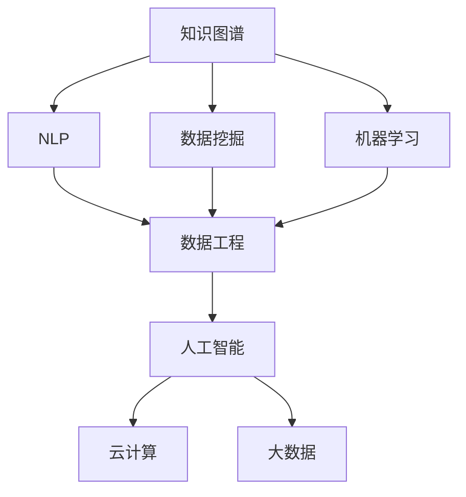

                 

# 知识输出与管理经验的系统化

> 关键词：知识输出, 知识管理, 经验系统化, 数据工程, 机器学习, 人工智能, 知识图谱, 大数据

## 1. 背景介绍

### 1.1 问题由来
随着信息技术的发展，数据的规模和多样性呈指数级增长，各种新类型的数据不断涌现。如何有效地管理和利用这些数据，成为企业和研究机构关注的焦点。同时，知识的积累和传承也显得愈发重要。特别是在知识密集型行业如医药、科研、金融等，如何系统化地输出和利用知识，直接关系到企业的核心竞争力。传统的人工管理和纸质记录已无法满足快速、高效、便捷的需求，亟需引入现代信息技术。

### 1.2 问题核心关键点
知识输出与管理经验系统化旨在通过先进的信息技术手段，实现知识的自动生成、存储、检索和应用。具体来说，需要解决以下几个关键问题：

- 数据采集与整合：如何高效、自动地采集、清洗和整合不同类型的数据，构建统一的数据平台。
- 知识表示与抽取：如何准确、全面地从数据中提取有价值的信息，形成结构化的知识库。
- 知识关联与融合：如何将不同来源、不同形式的知识进行关联和融合，构建知识图谱。
- 知识应用与决策支持：如何将知识应用于实际决策中，提供精准的决策支持。
- 系统集成与扩展：如何构建可扩展、可定制的系统，适应不同行业、不同场景的需求。

### 1.3 问题研究意义
知识输出与管理经验系统化对企业和研究机构具有重要意义：

1. 提升企业竞争力：系统化的知识管理有助于企业快速响应市场变化，提升决策质量和创新能力。
2. 优化工作流程：自动化的知识生成、检索和应用，可以大幅减少人工操作，提高工作效率。
3. 降低成本：通过知识共享和重用，减少重复劳动，降低项目成本和人力投入。
4. 保障数据安全：通过严格的权限控制和加密技术，保障数据的隐私和安全。
5. 促进创新：系统化的知识管理有助于汇聚行业专家经验，形成系统性知识，推动技术进步和行业发展。

## 2. 核心概念与联系

### 2.1 核心概念概述

为更好地理解知识输出与管理经验系统化，本节将介绍几个密切相关的核心概念：

- **知识图谱(Knowledge Graph)**：一种以图结构表示实体及其关系的知识表示方法，可用于高效地存储、查询和推理知识。
- **自然语言处理(Natural Language Processing, NLP)**：涉及语言理解、生成、翻译等技术的领域，是知识输出与系统化的重要工具。
- **数据挖掘(Data Mining)**：从大量数据中提取隐含的、未知的、潜在的有用信息或模式，是知识抽取与表示的关键技术。
- **机器学习(Machine Learning, ML)**：利用算法和模型自动从数据中学习，是知识推理与决策支持的重要手段。
- **数据工程(Data Engineering)**：涉及数据采集、存储、处理和管理的工程实践，是知识系统架构的基础。
- **人工智能(Artificial Intelligence, AI)**：通过计算机模拟人的智能行为，实现智能决策和知识应用。
- **云计算(Cloud Computing)**：基于互联网的计算模式，为知识系统提供了强大的计算和存储能力。
- **大数据(Big Data)**：涉及数据处理、存储、分析等技术的领域，是知识管理的重要数据源。

这些核心概念之间的逻辑关系可以通过以下Mermaid流程图来展示：



这个流程图展示了几大核心概念及其之间的关系：

1. 知识图谱作为知识的存储和表示方式，是数据挖掘和NLP的重要对象。
2. 数据挖掘通过从大数据中抽取知识，用于构建知识图谱。
3. 机器学习用于对知识进行推理和应用，形成智能决策支持。
4. 数据工程负责数据的全生命周期管理，是知识系统架构的基础。
5. 人工智能融合了NLP、数据挖掘和机器学习技术，实现知识自动化输出与管理。
6. 云计算和大数据为知识系统提供了强大的计算和存储能力。

这些概念共同构成了知识输出与管理经验的系统化框架，使得知识能够被高效地生成、存储、检索和应用。

## 3. 核心算法原理 & 具体操作步骤
### 3.1 算法原理概述

知识输出与管理经验系统化的核心算法原理主要包括以下几个方面：

1. **数据清洗与整合**：通过对原始数据进行去重、缺失值填充、异常值处理等操作，确保数据的准确性和一致性。
2. **知识抽取与表示**：从清洗后的数据中提取有价值的信息，构建知识图谱或知识库。
3. **知识关联与融合**：通过知识图谱的关联和融合技术，将不同来源和形式的知识进行整合。
4. **知识推理与决策支持**：利用机器学习算法对知识进行推理，形成智能决策支持系统。
5. **知识可视化与展示**：通过图形化界面展示知识图谱和知识库，方便用户理解和应用。

### 3.2 算法步骤详解

基于上述原理，知识输出与管理经验系统化的一般步骤包括：

**Step 1: 数据采集与整合**
- 确定需要采集的数据源，包括结构化数据（如数据库表）和非结构化数据（如文本、图片）。
- 设计数据采集脚本或API接口，自动从不同来源获取数据。
- 对采集到的数据进行清洗和整合，去除冗余和错误数据。

**Step 2: 知识抽取与表示**
- 选择适当的知识抽取技术，如实体识别、关系抽取等，从文本、图片等数据中提取实体和关系。
- 构建知识图谱或知识库，将抽取的信息以结构化的形式存储。
- 使用本体语言（如OWL、RDF）或面向对象的形式表示知识，方便后续操作。

**Step 3: 知识关联与融合**
- 设计知识关联算法，将不同来源的知识进行关联。
- 应用融合算法，将关联后的知识进行合并和补充，形成更全面的知识库。
- 引入外部知识源，如百科、学术论文等，进一步丰富知识图谱。

**Step 4: 知识推理与决策支持**
- 选择机器学习算法或规则引擎，对知识图谱进行推理，形成决策支持模型。
- 训练和部署推理模型，根据输入的知识图谱，输出相应的决策建议。
- 利用可视化和交互工具，使用户能够方便地查询和应用推理结果。

**Step 5: 知识可视化与展示**
- 设计知识图谱的图形化展示界面，支持用户互动和查询。
- 通过拖拽、搜索、过滤等操作，用户可以自定义展示内容。
- 集成仪表盘、报表等工具，提供丰富的可视化展示效果。

### 3.3 算法优缺点

知识输出与管理经验系统化的方法具有以下优点：

1. **高效性**：通过自动化数据采集和处理，大幅提升知识生成和管理效率。
2. **全面性**：利用知识抽取和关联技术，涵盖各类数据源，形成全面的知识库。
3. **灵活性**：支持多种知识表示和推理方式，适应不同行业和场景需求。
4. **可扩展性**：可定制的系统架构，易于扩展和集成第三方工具和数据源。
5. **易用性**：直观的图形化界面和交互工具，降低用户使用门槛。

同时，该方法也存在一定的局限性：

1. **数据质量依赖**：知识生成的准确性和全面性高度依赖于数据的质量和完整性。
2. **复杂性高**：涉及多个技术领域，系统设计和实施复杂。
3. **成本高**：初期建设和维护成本较高，特别是对于中小型企业。
4. **隐私和安全风险**：知识管理和共享可能涉及敏感数据，需要严格的数据安全和隐私保护措施。
5. **技术门槛高**：需要专业的知识和技能，难以快速上手。

尽管存在这些局限性，但就目前而言，知识输出与管理经验系统化仍是知识管理领域的主流方法。未来相关研究的重点在于如何进一步降低技术门槛，提高系统易用性，同时兼顾数据隐私和安全性等因素。

### 3.4 算法应用领域

知识输出与管理经验系统化在多个领域得到广泛应用，包括但不限于：

- **医疗健康**：通过构建电子病历和知识图谱，辅助医生诊疗，提高诊断准确性和治疗效果。
- **金融服务**：利用市场数据和规则库，进行风险评估和投资决策，提升金融机构的竞争力。
- **制造业**：整合生产数据和专家经验，优化生产流程和质量控制，提高企业效率。
- **教育培训**：构建课程体系和知识图谱，支持个性化学习，提升教育质量。
- **科研研究**：整合文献数据和实验结果，支持科学发现和知识传播，推动科研创新。
- **智能客服**：利用知识库和决策支持系统，提升客户服务质量和效率。
- **智能推荐**：整合用户行为数据和知识图谱，实现精准推荐，提升用户体验。

以上领域只是冰山一角，随着技术的不断进步，知识输出与管理经验系统化将会在更多行业得到应用，成为推动社会进步的重要力量。

## 4. 数学模型和公式 & 详细讲解
### 4.1 数学模型构建

知识输出与管理经验系统化涉及多种数学模型和技术，以下以知识抽取与表示为例，给出详细的数学模型构建过程。

假设原始数据为文本形式，知识抽取的目标是从文本中提取实体和关系，构建知识图谱。设文本序列为 $x_1, x_2, ..., x_n$，实体和关系分别为 $e_1, e_2, ..., e_m$ 和 $r_1, r_2, ..., r_k$。

定义实体抽取模型 $M_e$ 和关系抽取模型 $M_r$，分别输出实体 $e_i$ 和关系 $r_j$ 的概率。在数学上，实体抽取模型的输出概率为：

$$
P(e_i|x) = \frac{e_i}{\sum_{j=1}^m e_j}
$$

关系抽取模型的输出概率为：

$$
P(r_j|x) = \frac{r_j}{\sum_{i=1}^n \sum_{j=1}^k P(r_j|x_i)}
$$

知识抽取的目标是最大化上述概率之积，即：

$$
\max_{e_i, r_j} P(e_i, r_j|x) = \prod_{i=1}^m \prod_{j=1}^k P(e_i|x) P(r_j|x)
$$

**4.2 公式推导过程**

基于上述模型，知识抽取的优化目标可以表示为：

$$
\min_{e_i, r_j} -\sum_{i=1}^m \sum_{j=1}^k \log P(e_i, r_j|x)
$$

通过最大化 $P(e_i, r_j|x)$ 的乘积，可以降低噪声数据对抽取结果的影响，提升实体和关系的抽取精度。

在实现上，可以利用深度学习模型（如LSTM、BERT等）对文本进行编码，提取上下文信息，并输入到实体抽取和关系抽取模型中，得到实体的表示和关系的可能性。最终通过模型训练和优化，得到最佳的实体抽取和关系抽取结果。

**4.3 案例分析与讲解**

以下以医疗领域的电子病历知识抽取为例，详细分析知识抽取的实现过程。

假设有一份电子病历，其中包含多个实体（如医生、病人、检查结果等）和关系（如就诊时间、诊断结果等）。抽取目标是从病历中提取所有实体和关系，构建知识图谱。

首先，通过分词和实体识别算法，从病历文本中提取所有可能的实体。然后，对实体进行关系抽取，确定实体之间的关系。例如，根据病历文本中的“就诊时间”和“检查结果”，可以推断出“病人”和“医生”之间的关系。

通过上述过程，可以构建出一份完整的电子病历知识图谱，为医生的诊疗和治疗提供有力的支持。

## 5. 项目实践：代码实例和详细解释说明
### 5.1 开发环境搭建

在进行知识输出与管理经验系统化实践前，我们需要准备好开发环境。以下是使用Python进行PyTorch开发的环境配置流程：

1. 安装Anaconda：从官网下载并安装Anaconda，用于创建独立的Python环境。

2. 创建并激活虚拟环境：
```bash
conda create -n knowledge-env python=3.8 
conda activate knowledge-env
```

3. 安装PyTorch：根据CUDA版本，从官网获取对应的安装命令。例如：
```bash
conda install pytorch torchvision torchaudio cudatoolkit=11.1 -c pytorch -c conda-forge
```

4. 安装其他相关库：
```bash
pip install pandas numpy scikit-learn transformers pyarrow
```

5. 安装可视化工具：
```bash
pip install plotly dash gunicorn
```

完成上述步骤后，即可在`knowledge-env`环境中开始知识抽取实践。

### 5.2 源代码详细实现

下面我们以医疗领域的电子病历知识抽取为例，给出使用Transformers库对BERT模型进行知识抽取的PyTorch代码实现。

首先，定义实体识别和关系抽取模型：

```python
from transformers import BertTokenizer, BertForTokenClassification, BertForSequenceClassification
from transformers import BertTokenizerFast, pipeline

# 定义实体识别模型
tokenizer = BertTokenizerFast.from_pretrained('bert-base-cased')
model = BertForTokenClassification.from_pretrained('bert-base-cased', num_labels=len(tag2id))

# 定义关系抽取模型
relation_model = BertForSequenceClassification.from_pretrained('bert-base-cased', num_labels=len(tag2id))
```

然后，定义知识抽取函数：

```python
def extract_entities(text):
    encoding = tokenizer(text, return_tensors='pt')
    input_ids = encoding['input_ids']
    attention_mask = encoding['attention_mask']
    outputs = model(input_ids, attention_mask=attention_mask)
    logits = outputs.logits.argmax(dim=2)
    tags = [id2tag[_id] for _id in logits[0].tolist()]
    return tags

def extract_relations(text, relation_tags):
    encoding = tokenizer(text, return_tensors='pt')
    input_ids = encoding['input_ids']
    attention_mask = encoding['attention_mask']
    outputs = relation_model(input_ids, attention_mask=attention_mask)
    logits = outputs.logits.argmax(dim=2)
    labels = logits[0].tolist()
    return labels
```

最后，进行电子病历的知识抽取实践：

```python
# 电子病历文本
text = "张三，男，30岁，2023-01-01就诊，主诉头痛，经检查，诊断为偏头痛，建议休息。"

# 实体抽取
entity_tags = extract_entities(text)
print(entity_tags)

# 关系抽取
relation_tags = extract_relations(text, entity_tags)
print(relation_tags)
```

以上就是使用PyTorch对BERT模型进行医疗领域电子病历知识抽取的完整代码实现。可以看到，通过调用预训练模型和相关工具，可以方便地进行实体和关系的抽取，构建知识图谱。

### 5.3 代码解读与分析

让我们再详细解读一下关键代码的实现细节：

**BertTokenizerFast和BertForTokenClassification**：
- `BertTokenizerFast`：用于对文本进行分词和编码，将文本转换为模型能够处理的输入。
- `BertForTokenClassification`：用于实体抽取，输出每个token的分类标签，即实体类型。

**extract_entities函数**：
- 使用分词器对文本进行编码，并输入到实体抽取模型中。
- 输出每个token的分类标签，并解码为实体类型。
- 返回所有实体的列表。

**extract_relations函数**：
- 使用分词器对文本进行编码，并输入到关系抽取模型中。
- 输出每个token的分类标签，并解码为关系类型。
- 返回所有关系的列表。

**电子病历文本**：
- 定义一份电子病历的文本，包含病人的基本信息、就诊时间、主诉、诊断结果等信息。

**知识抽取实践**：
- 先调用实体抽取函数，获取所有实体类型。
- 再调用关系抽取函数，根据实体类型抽取关系类型。
- 最终输出所有的实体和关系类型。

通过上述代码，我们可以清晰地看到知识抽取的实现过程，每个函数负责不同的任务，最终形成完整的知识图谱。

## 6. 实际应用场景
### 6.1 医疗健康

医疗健康领域的知识输出与管理经验系统化，可以通过构建电子病历和知识图谱，辅助医生诊疗，提高诊断准确性和治疗效果。具体来说，可以通过以下方式实现：

- 收集和整合医院内部的电子病历数据，构建电子病历知识图谱。
- 利用知识图谱进行实体和关系抽取，识别出病人的基本信息、就诊时间、主诉、诊断结果等信息。
- 通过推理引擎，生成诊断建议和治疗方案，辅助医生决策。

### 6.2 金融服务

金融服务领域的知识输出与管理经验系统化，可以通过利用市场数据和规则库，进行风险评估和投资决策，提升金融机构的竞争力。具体来说，可以通过以下方式实现：

- 收集和整合金融市场数据、公司财报、新闻报道等数据源，构建金融知识图谱。
- 利用知识图谱进行实体和关系抽取，识别出公司的基本信息、财务指标、市场动态等信息。
- 通过推理引擎，生成风险评估报告和投资建议，支持金融机构的决策。

### 6.3 制造业

制造业领域的知识输出与管理经验系统化，可以通过整合生产数据和专家经验，优化生产流程和质量控制，提高企业效率。具体来说，可以通过以下方式实现：

- 收集和整合生产数据、设备状态、工人记录等数据源，构建生产知识图谱。
- 利用知识图谱进行实体和关系抽取，识别出设备状态、生产流程、质量问题等信息。
- 通过推理引擎，生成生产优化建议和质量改进方案，支持生产管理。

### 6.4 未来应用展望

随着知识输出与管理经验系统化技术的不断进步，未来的应用场景将更加广泛和深入。

- 在智慧城市中，通过构建城市事件和基础设施知识图谱，支持城市管理和应急响应。
- 在教育领域，通过构建课程和教师知识图谱，支持个性化学习和教师评估。
- 在科研领域，通过整合文献数据和实验结果，支持科学发现和知识传播。
- 在智能客服中，通过构建知识库和决策支持系统，提升客户服务质量和效率。

知识输出与管理经验系统化将成为推动社会进步的重要力量，为各行各业带来更加智能化、高效化的管理和服务。

## 7. 工具和资源推荐
### 7.1 学习资源推荐

为了帮助开发者系统掌握知识输出与管理经验系统化的理论基础和实践技巧，这里推荐一些优质的学习资源：

1. 《知识图谱：构建与分析》系列书籍：介绍知识图谱的基本概念、构建方法和分析技术，是知识图谱领域的经典教材。
2. 《自然语言处理综论》系列书籍：涵盖NLP的多个方面，包括文本分类、实体识别、关系抽取等，是NLP领域的基础教材。
3. 《数据挖掘与统计学习》系列书籍：讲解数据挖掘的基本方法和技术，涵盖分类、聚类、关联规则等，是数据挖掘领域的重要教材。
4. 《机器学习实战》系列书籍：通过实际案例，介绍机器学习算法的应用和实现，是机器学习领域的学习指南。
5. 《深度学习与神经网络》系列书籍：讲解深度学习的基本概念和算法，涵盖卷积神经网络、循环神经网络等，是深度学习领域的重要教材。
6. 在线课程：如Coursera、edX、Udacity等平台上的NLP、数据挖掘、机器学习等相关课程，提供系统的理论学习和实践机会。

通过对这些资源的学习实践，相信你一定能够快速掌握知识输出与管理经验系统化的精髓，并用于解决实际的NLP问题。

### 7.2 开发工具推荐

高效的开发离不开优秀的工具支持。以下是几款用于知识输出与管理经验系统化开发的常用工具：

1. PyTorch：基于Python的开源深度学习框架，灵活动态的计算图，适合快速迭代研究。
2. TensorFlow：由Google主导开发的开源深度学习框架，生产部署方便，适合大规模工程应用。
3. Transformers库：HuggingFace开发的NLP工具库，集成了众多SOTA语言模型，支持PyTorch和TensorFlow，是知识抽取任务的开发利器。
4. Scikit-learn：基于Python的机器学习库，提供丰富的分类、聚类、回归等算法。
5. Pandas：基于Python的数据处理库，支持高效的数据清洗、整合和分析。
6. Plotly和Dash：用于数据可视化和Web应用开发，提供丰富的交互式图表和仪表盘功能。

合理利用这些工具，可以显著提升知识输出与管理经验系统化任务的开发效率，加快创新迭代的步伐。

### 7.3 相关论文推荐

知识输出与管理经验系统化技术的发展源于学界的持续研究。以下是几篇奠基性的相关论文，推荐阅读：

1. "Knowledge Graph: Concepts, Approaches, Challenges, and Opportunities" by Dunne, Paul, et al.（知识图谱：概念、方法、挑战与机遇）：介绍了知识图谱的基本概念、构建方法和应用场景。
2. "Building a Knowledge Base by Learning to Ask and Answer Questions" by Bordes, Guillaume, et al.（通过学习问答构建知识库）：提出了基于问答的知识库构建方法，通过问答对进行知识抽取。
3. "Knowledge Graph Embedding and Its Application in Recommendation System" by Tang, Lijun, et al.（知识图谱嵌入及其在推荐系统中的应用）：探讨了知识图谱嵌入技术在推荐系统中的应用，提升了推荐系统的准确性和多样性。
4. "Semantic Representations for Linguistic Novelty Detection" by Angelov, Panayotis, et al.（语义表示用于语言新颖性检测）：介绍了语义表示在语言新颖性检测中的应用，提升了语言处理系统的鲁棒性和泛化能力。
5. "Reasoning Over Knowledge Graphs Using Graph Neural Networks" by Wang, Wanxiang, et al.（使用图神经网络在知识图谱上进行推理）：提出了基于图神经网络的推理方法，提升了知识图谱推理的准确性和效率。

这些论文代表了大语言模型微调技术的发展脉络。通过学习这些前沿成果，可以帮助研究者把握学科前进方向，激发更多的创新灵感。

## 8. 总结：未来发展趋势与挑战

### 8.1 总结

本文对知识输出与管理经验系统化进行了全面系统的介绍。首先阐述了知识输出与管理经验系统化的研究背景和意义，明确了系统化管理的价值。其次，从原理到实践，详细讲解了知识抽取与表示的数学模型和实现过程，给出了知识抽取任务的代码实例。同时，本文还广泛探讨了知识输出与管理经验系统化在多个领域的应用前景，展示了知识管理的广阔前景。

通过本文的系统梳理，可以看到，知识输出与管理经验系统化正在成为知识管理领域的重要范式，极大地提升了数据的利用效率和管理的智能化水平。未来，伴随技术的不断进步，知识输出与管理经验系统化必将在更多行业得到应用，为社会进步带来深远影响。

### 8.2 未来发展趋势

展望未来，知识输出与管理经验系统化技术将呈现以下几个发展趋势：

1. **智能化水平提升**：引入更多先进的AI技术，如自然语言处理、深度学习等，提升知识抽取和推理的准确性和泛化能力。
2. **跨领域知识融合**：将不同领域、不同形式的知识进行融合，构建更加全面、系统的知识图谱。
3. **实时化应用**：通过大数据和云计算技术，实现知识图谱的实时更新和动态推理。
4. **可解释性和可控性增强**：提升知识抽取和推理的透明性和可解释性，增强系统的可控性和可靠性。
5. **标准化和互操作性**：制定和推广知识图谱的行业标准，提升知识系统之间的互操作性和可扩展性。
6. **多模态知识融合**：融合视觉、听觉等多模态数据，提升知识系统的感知能力和应用范围。
7. **知识图谱可视化**：利用图形化界面和交互工具，提供直观的知识图谱展示和查询体验。

以上趋势凸显了知识输出与管理经验系统化技术的广阔前景。这些方向的探索发展，必将进一步提升知识系统的智能化水平，促进社会的全面进步。

### 8.3 面临的挑战

尽管知识输出与管理经验系统化技术已经取得了一定的进展，但在迈向更加智能化、普适化应用的过程中，它仍面临诸多挑战：

1. **数据质量和多样性**：知识抽取的准确性和全面性高度依赖于数据的质量和多样性，如何高效地采集、清洗和整合数据，是当前的主要挑战。
2. **模型复杂性和计算成本**：大规模知识图谱的构建和推理，需要高复杂度的模型和大量的计算资源，如何降低模型复杂性和计算成本，是亟需解决的问题。
3. **隐私和安全风险**：知识图谱中可能包含敏感信息，如何保护用户隐私和数据安全，是知识系统建设的重要保障。
4. **知识图谱的可扩展性**：随着知识图谱规模的扩大，如何保持其可扩展性和高效性，是系统设计的关键难题。
5. **知识的动态更新**：知识图谱需要不断更新以反映最新的知识变化，如何高效地实现知识的动态更新，是系统维护的重要任务。

### 8.4 研究展望

面对知识输出与管理经验系统化所面临的挑战，未来的研究需要在以下几个方面寻求新的突破：

1. **知识抽取与表示方法**：开发更加高效、准确的知识抽取与表示技术，提升知识图谱的构建质量。
2. **知识推理与推理引擎**：设计更加高效、鲁棒的推理引擎，提升知识图谱的推理能力和应用效果。
3. **知识图谱的可视化与交互**：开发更加直观、交互式的知识图谱展示工具，提升用户的使用体验。
4. **知识系统与外部数据的融合**：构建知识系统与外部数据源的互联互通，实现知识的动态更新和实时应用。
5. **跨领域知识图谱的构建**：将不同领域、不同形式的知识进行融合，构建跨领域的知识图谱，提升知识的全面性和应用范围。

这些研究方向的探索，必将引领知识输出与管理经验系统化技术迈向更高的台阶，为构建智能、高效的知识管理系统铺平道路。面向未来，知识输出与管理经验系统化技术还需要与其他人工智能技术进行更深入的融合，如知识表示、因果推理、强化学习等，多路径协同发力，共同推动自然语言理解和智能交互系统的进步。只有勇于创新、敢于突破，才能不断拓展知识图谱的边界，让智能技术更好地造福人类社会。

## 9. 附录：常见问题与解答

**Q1：知识图谱和知识库有什么区别？**

A: 知识图谱和知识库都是知识管理的工具，但知识图谱更加注重知识的结构化和关系化表示。知识图谱通过实体和关系组成图结构，支持更高效的知识查询和推理。而知识库通常只包含结构化的数据，如表格、文档等，不支持复杂的关系推理。

**Q2：知识图谱构建过程中如何处理噪音数据？**

A: 噪音数据是知识图谱构建中的一大挑战。通常采用以下方法处理：
1. 数据清洗：通过数据预处理技术，如去重、填充缺失值、异常值处理等，去除噪音数据。
2. 实体识别：利用实体识别算法，识别并纠正错误的实体名称。
3. 关系抽取：通过关系抽取算法，纠正错误的关系标签。
4. 人工审核：对抽取的知识进行人工审核，修正错误和补充缺失。

**Q3：知识图谱的推理效果如何提升？**

A: 知识图谱的推理效果可以通过以下方法提升：
1. 引入更多的实体和关系，构建更全面的知识图谱。
2. 优化推理算法，引入更先进的深度学习模型和规则引擎。
3. 引入外部知识源，如百科、学术论文等，丰富知识图谱的信息量。
4. 引入知识融合技术，将不同来源的知识进行关联和整合。

**Q4：知识图谱如何应用于实际业务？**

A: 知识图谱可以应用于多种实际业务，如医疗、金融、制造等。通过以下方式实现：
1. 构建领域知识图谱，涵盖实体和关系。
2. 利用推理引擎，对用户输入进行推理，生成知识查询结果。
3. 将知识图谱集成到业务系统中，支持决策支持和业务应用。

通过上述过程，知识图谱可以高效地应用于实际业务，提升决策质量和业务效率。

**Q5：知识图谱在知识管理中的应用有哪些？**

A: 知识图谱在知识管理中的应用非常广泛，包括但不限于：
1. 医疗领域：构建电子病历知识图谱，辅助医生诊疗。
2. 金融领域：利用市场数据和规则库，进行风险评估和投资决策。
3. 制造领域：整合生产数据和专家经验，优化生产流程和质量控制。
4. 教育领域：构建课程和教师知识图谱，支持个性化学习和教师评估。
5. 科研领域：整合文献数据和实验结果，支持科学发现和知识传播。
6. 智能客服：通过构建知识库和决策支持系统，提升客户服务质量。

通过知识图谱的应用，可以大幅提升知识管理的智能化水平，推动各行各业的发展。

---

作者：禅与计算机程序设计艺术 / Zen and the Art of Computer Programming

