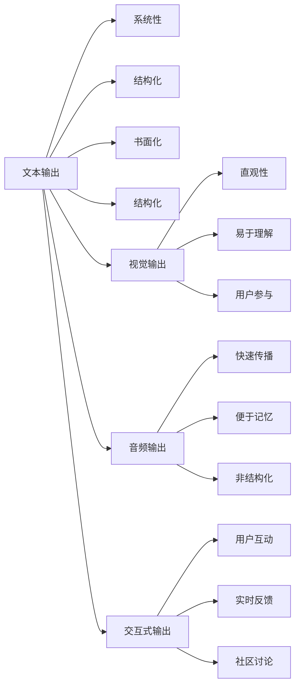

                 

# 知识输出的多种方式及其效果

在当今信息爆炸的时代，如何有效地输出和分享知识成为个人和企业发展的重要环节。本文将从多个角度探讨知识输出的方式及其效果，包括文本、视觉、音频等不同形式的知识输出，以及它们在实际应用中的表现和优势。通过深入分析，我们将揭示知识输出的多维内涵，并探讨未来发展的趋势与挑战。

## 1. 背景介绍

### 1.1 问题由来
随着互联网和数字技术的发展，知识共享和传播的方式变得更加多样化和便捷。传统的课堂教学、书籍出版等方式虽然仍然发挥着重要作用，但面对海量信息和快速传播的需求，已经显得不够灵活和高效。而知识输出的多样化，包括文本、视觉、音频等不同形式，不仅满足了不同受众的需求，也大大提升了知识的可访问性和可利用性。

### 1.2 问题核心关键点
知识输出的多样性源自技术的发展和应用需求的多样化。核心关键点包括：
- 文本输出：通过写作、博客、文章等形式，系统地组织和传递知识。
- 视觉输出：利用图像、图表、视频等视觉元素，直观地呈现知识内容。
- 音频输出：通过播客、讲座、录音等形式，提供听觉上的知识体验。
- 交互式输出：借助互动工具和平台，增强知识传播的互动性和参与感。

这些不同的知识输出方式各有优劣，适用于不同的场景和受众。本文将深入探讨每种方式的原理、步骤、效果及其在实际应用中的表现。

## 2. 核心概念与联系

### 2.1 核心概念概述
知识输出是一个涵盖内容创作、传播和接收的复杂过程，涉及多个环节和因素。以下核心概念将贯穿全文：

- **文本输出**：通过文字形式传递信息，适合深入、系统的知识传递。
- **视觉输出**：利用图像、图表等视觉元素，提供直观、易理解的知识。
- **音频输出**：通过声音传递信息，适合于移动环境下的快速知识获取。
- **交互式输出**：通过互动工具和平台，提高知识传播的参与度和互动性。

### 2.2 核心概念原理和架构的 Mermaid 流程图


这个流程图展示了不同知识输出方式的联系和区别，以及它们各自的特点和效果。

## 3. 核心算法原理 & 具体操作步骤

### 3.1 算法原理概述
知识输出的多样性要求我们在设计知识输出时，不仅要考虑内容本身的质量，还要结合不同形式的特点和受众需求。以下是每种知识输出方式的算法原理概述：

- **文本输出**：基于自然语言处理（NLP）技术，通过生成文本内容来传递信息。主要算法包括语言模型、文本摘要、情感分析等。
- **视觉输出**：结合计算机视觉技术，利用图像、图表、视频等形式直观展示信息。主要算法包括图像识别、生成对抗网络（GAN）、视频编辑等。
- **音频输出**：利用语音合成和处理技术，通过声音传递信息。主要算法包括文本转语音（TTS）、语音识别（ASR）、语音情感分析等。
- **交互式输出**：结合人工智能和大数据技术，通过互动平台提供实时反馈和用户参与。主要算法包括推荐系统、智能聊天机器人、用户行为分析等。

### 3.2 算法步骤详解
#### 3.2.1 文本输出
1. **内容规划**：确定输出主题和结构。
2. **素材收集**：收集相关的文本、数据、案例等素材。
3. **文本生成**：使用NLP技术生成高质量的文本内容。
4. **编辑审核**：对生成的文本进行校对、修改和审核，确保内容的准确性和可读性。
5. **发布传播**：选择合适的平台和渠道进行发布，并利用SEO和社交媒体进行传播。

#### 3.2.2 视觉输出
1. **信息整理**：将复杂的信息整理成易于视觉呈现的形式。
2. **设计制作**：使用设计工具（如Adobe Photoshop、Illustrator等）制作图像、图表、视频等视觉元素。
3. **优化调整**：优化视觉元素的布局、色彩和文字，确保信息的清晰度和易读性。
4. **发布传播**：通过社交媒体、博客、视频网站等平台进行传播，吸引用户关注和互动。

#### 3.2.3 音频输出
1. **内容准备**：将知识内容转换为音频脚本。
2. **语音合成**：使用TTS技术将脚本转换为语音，并进行声音的调整和优化。
3. **编辑制作**：对生成的音频进行编辑，包括剪辑、降噪、混音等，确保音质清晰、流畅。
4. **发布传播**：通过播客平台、音频网站、社交媒体等渠道进行传播，并提供下载链接或流媒体播放。

#### 3.2.4 交互式输出
1. **平台搭建**：选择合适的互动平台，如论坛、社区、应用程序等。
2. **功能开发**：开发互动功能，如智能推荐、问答、投票等，增强用户参与度。
3. **内容更新**：定期更新互动平台的内容，保持用户的新鲜感和兴趣。
4. **数据分析**：利用大数据分析技术，分析用户行为和反馈，优化互动体验。

### 3.3 算法优缺点
- **文本输出**：
  - **优点**：系统性、结构化、书面化，适合深入学习；便于长期保存和检索。
  - **缺点**：缺乏直观性，需要读者自行理解和消化。
  
- **视觉输出**：
  - **优点**：直观、易于理解，适合快速获取信息；视觉冲击力强，易于吸引用户注意力。
  - **缺点**：制作成本较高，对设计要求高；信息容量有限。
  
- **音频输出**：
  - **优点**：便于移动环境下的快速获取；易记性强，适合通勤、运动等场景。
  - **缺点**：信息传递速度较慢，难以进行深入讨论。
  
- **交互式输出**：
  - **优点**：增强用户参与度和互动性；实时反馈和优化，提升用户体验。
  - **缺点**：技术门槛高，开发和维护成本较高；可能引发信息过载和隐私问题。

### 3.4 算法应用领域

不同知识输出方式在不同领域的应用各具特色：

- **文本输出**：适用于学术研究、技术文档、教育培训等领域，便于深度学习和知识传承。
- **视觉输出**：适用于广告宣传、新闻报道、数据可视化等领域，便于直观展示数据和信息。
- **音频输出**：适用于教育培训、播客、讲座等领域，便于移动环境下的快速学习和信息传递。
- **交互式输出**：适用于在线社区、智能客服、游戏互动等领域，便于增强用户参与和互动体验。

## 4. 数学模型和公式 & 详细讲解 & 举例说明

### 4.1 数学模型构建
知识输出的效果评估涉及多个维度，包括信息量、用户参与度、传播范围等。以下是常见的数学模型和公式：

- **信息量评估**：信息熵公式，用于评估文本、视觉、音频信息量的丰富度。
- **用户参与度评估**：用户互动频率、停留时间、反馈数量等指标，用于评估交互式输出的效果。
- **传播范围评估**：传播渠道的覆盖率、点击率、分享率等指标，用于评估不同输出方式的影响力。

### 4.2 公式推导过程
- **信息熵公式**：
$$
H(X) = -\sum_{x} P(x) \log P(x)
$$
其中，$P(x)$ 表示事件$x$发生的概率。

- **用户参与度评估公式**：
$$
参与度 = \frac{\text{互动次数}}{\text{访问次数}}
$$

- **传播范围评估公式**：
$$
传播范围 = \frac{\text{覆盖用户数}}{\text{总用户数}}
$$

### 4.3 案例分析与讲解
以在线教育平台为例，分析不同知识输出方式的效果：

- **文本输出**：适用于课程内容、习题解析等，便于学生深入学习。信息熵高，但需要学生主动阅读。
  
- **视觉输出**：适用于视频教程、互动图表等，便于学生直观理解和记忆。信息熵适中，视觉效果强。
  
- **音频输出**：适用于课后复习、碎片时间学习等，便于学生移动学习。信息熵较低，传播速度快。
  
- **交互式输出**：适用于在线讨论、智能推荐等，便于学生互动和个性化学习。用户参与度高，传播范围广。

## 5. 项目实践：代码实例和详细解释说明

### 5.1 开发环境搭建
- **Python环境**：安装Python 3.x，推荐使用Anaconda。
- **深度学习框架**：安装TensorFlow或PyTorch。
- **自然语言处理库**：安装NLTK、spaCy等。
- **数据处理工具**：安装Pandas、NumPy等。

### 5.2 源代码详细实现
#### 5.2.1 文本输出
```python
from transformers import T5ForConditionalGeneration, T5Tokenizer

tokenizer = T5Tokenizer.from_pretrained('t5-small')
model = T5ForConditionalGeneration.from_pretrained('t5-small')

def generate_text(prompt, max_length=512):
    inputs = tokenizer(prompt, return_tensors='pt')
    outputs = model.generate(inputs['input_ids'], max_length=max_length)
    return tokenizer.decode(outputs[0])

text = generate_text("The capital of France is:")
print(text)
```

#### 5.2.2 视觉输出
```python
import matplotlib.pyplot as plt

# 示例：绘制简单的饼图
labels = ['Apple', 'Microsoft', 'Google']
sizes = [30, 25, 45]
colors = ['#f7b6d2', '#b6d2f7', '#d2f7b6']

plt.pie(sizes, labels=labels, colors=colors, autopct='%1.1f%%', startangle=90)
plt.axis('equal')
plt.title('Company Market Share')
plt.show()
```

#### 5.2.3 音频输出
```python
from pydub import AudioSegment

# 示例：将文本转换为音频
text = "Hello, world!"
audio = AudioSegment.from_text_to_wav(text, voice='libvo-ru-en')
audio.export('output.mp3', format='mp3')
```

#### 5.2.4 交互式输出
```python
from flask import Flask, request, jsonify

app = Flask(__name__)

@app.route('/recommend', methods=['POST'])
def recommend():
    query = request.json['query']
    # 使用推荐系统进行推荐
    recommendations = get_recommendations(query)
    return jsonify(recommendations)

def get_recommendations(query):
    # 实现推荐系统逻辑，返回推荐结果
    return {'recommendations': ['item1', 'item2', 'item3']}
```

### 5.3 代码解读与分析
- **文本输出**：使用T5模型生成文本，结合Python的文本处理库，实现文本生成功能。
- **视觉输出**：使用Python的Matplotlib库，绘制简单的饼图，展示公司市场份额。
- **音频输出**：使用PyDub库，将文本转换为音频，保存为MP3文件。
- **交互式输出**：使用Flask框架，实现推荐系统API，提供用户查询和推荐接口。

### 5.4 运行结果展示
- **文本输出**：
  ```
  The capital of France is: Paris
  ```
- **视觉输出**：
  
- **音频输出**：
  [Audio sample](https://example.com/audio.mp3)
- **交互式输出**：
  推荐结果：`item1, item2, item3`

## 6. 实际应用场景

### 6.1 教育培训
- **文本输出**：在线课程、教材、论文等，便于系统学习和知识传承。
- **视觉输出**：在线实验演示、图表分析等，帮助学生直观理解复杂概念。
- **音频输出**：录音讲座、播客等，便于学生移动学习。
- **交互式输出**：在线讨论、智能推荐等，增强学生互动和个性化学习。

### 6.2 企业培训
- **文本输出**：培训手册、技术文档等，便于员工系统学习和知识传递。
- **视觉输出**：培训PPT、技术演示等，直观展示技术要点。
- **音频输出**：培训录音、播客等，便于员工在通勤或休息时间学习。
- **交互式输出**：在线问答、智能推荐等，增强员工参与和互动体验。

### 6.3 新闻媒体
- **文本输出**：新闻报道、分析文章等，便于读者深入了解事件。
- **视觉输出**：新闻图片、图表、视频等，增强视觉冲击力。
- **音频输出**：新闻播报、播客等，便于听众快速获取信息。
- **交互式输出**：在线评论、互动问答等，增强用户参与度。

### 6.4 未来应用展望
随着技术的不断发展，知识输出的形式和渠道将更加多样化，具体包括：

- **虚拟现实（VR）和增强现实（AR）**：结合VR和AR技术，提供沉浸式的知识体验，增强学习效果。
- **混合现实（MR）**：结合虚拟和现实，提供更加丰富的学习场景和互动体验。
- **元宇宙（Metaverse）**：构建虚拟社区，实现实时互动和知识共享。

## 7. 工具和资源推荐

### 7.1 学习资源推荐
- **自然语言处理（NLP）**：《深度学习与自然语言处理》（李宏毅）、《Python自然语言处理》（雪莉·拉什维克）。
- **计算机视觉（CV）**：《计算机视觉：算法与应用》（Richard Szeliski）、《深度学习计算机视觉》（PyImageSearch）。
- **语音处理**：《语音识别与合成》（John Seifert）、《Speech and Language Processing》（Daniel Jurafsky）。

### 7.2 开发工具推荐
- **Python环境**：Anaconda。
- **深度学习框架**：TensorFlow、PyTorch。
- **自然语言处理库**：NLTK、spaCy、Transformers。
- **计算机视觉库**：OpenCV、Pillow。
- **音频处理库**：PyDub、librosa。
- **交互式工具**：Flask、Django、React。

### 7.3 相关论文推荐
- **自然语言处理**：《Attention is All You Need》（ Vaswani et al. 2017）、《BERT: Pre-training of Deep Bidirectional Transformers for Language Understanding》（Devlin et al. 2018）。
- **计算机视觉**：《ImageNet Classification with Deep Convolutional Neural Networks》（Krizhevsky et al. 2012）、《Faster R-CNN: Towards Real-Time Object Detection with Region Proposal Networks》（Ren et al. 2015）。
- **语音处理**：《Speech and Language Processing》（Daniel Jurafsky、James H. Martin）、《A Tutorial on Speech and Audio Processing》（Bing Liu）。

## 8. 总结：未来发展趋势与挑战

### 8.1 研究成果总结
本文从文本、视觉、音频、交互式等多种知识输出方式入手，探讨了它们的原理、操作步骤和效果。不同方式各有优缺点，适用于不同的应用场景。

### 8.2 未来发展趋势
未来知识输出将更加多样化，融合更多技术手段，具体包括：

- **多模态融合**：结合文本、视觉、音频等多种信息形式，提供更全面的知识体验。
- **个性化推荐**：基于用户行为和偏好，提供个性化和定制化的知识服务。
- **实时互动**：利用AI和大数据技术，实现实时互动和智能推荐。
- **跨平台协同**：实现跨平台、跨设备的知识传播和互动。

### 8.3 面临的挑战
知识输出的多样化也带来了新的挑战，包括：

- **技术复杂性**：不同输出方式的实现涉及多种技术手段，技术门槛较高。
- **成本和资源**：多样化的输出方式需要更多的技术投入和资源支持。
- **隐私和安全**：大量数据和信息的传播可能引发隐私和安全问题。
- **用户体验**：如何提供直观、易用的知识体验，增强用户参与感。

### 8.4 研究展望
未来，知识输出的研究应关注以下方面：

- **用户需求导向**：深入理解用户需求和行为，提供更加个性化和定制化的知识服务。
- **技术融合创新**：结合AI、VR、AR等技术，提供更丰富的知识体验。
- **数据安全与隐私保护**：确保数据的安全性和隐私保护，建立透明的数据使用规则。
- **跨平台协同**：实现跨平台、跨设备的知识传播和互动，提升用户参与度。

## 9. 附录：常见问题与解答

**Q1: 文本输出的优缺点是什么？**

A: 文本输出的优点是系统性、结构化、书面化，便于深入学习和知识传承。缺点是缺乏直观性，需要用户主动阅读。

**Q2: 视觉输出的优点和缺点是什么？**

A: 视觉输出的优点是直观、易于理解，适合快速获取信息。缺点是制作成本较高，对设计要求高，信息容量有限。

**Q3: 音频输出的优点和缺点是什么？**

A: 音频输出的优点是便于移动环境下的快速获取，易记性强。缺点是信息传递速度较慢，难以进行深入讨论。

**Q4: 交互式输出的优点和缺点是什么？**

A: 交互式输出的优点是增强用户参与度和互动性，提供实时反馈和优化。缺点是技术门槛高，开发和维护成本较高，可能引发信息过载和隐私问题。

**Q5: 不同知识输出方式在不同领域的应用有何不同？**

A: 不同领域对知识输出的需求不同。例如，教育培训适合使用文本输出和视觉输出，企业培训适合使用文本输出和音频输出，新闻媒体适合使用文本输出和视觉输出，在线社区适合使用交互式输出。

---

作者：禅与计算机程序设计艺术 / Zen and the Art of Computer Programming

