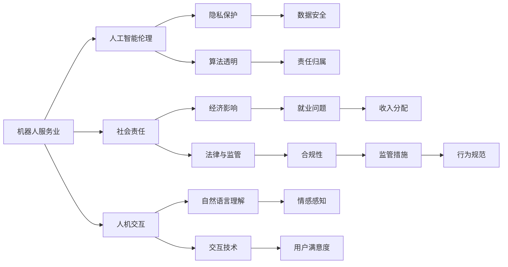

                 

# 硅谷机器人服务业的社会伦理

## 1. 背景介绍

### 1.1 问题由来

随着科技的飞速发展和人工智能(AI)技术的日趋成熟，机器人服务业在硅谷乃至全球范围内迅速崛起，成为一项备受瞩目的新兴产业。机器人服务业的兴起，不仅为服务业带来了革命性的变化，还引发了一系列伦理和社会问题，引发了广泛的关注和讨论。

机器人服务业涵盖多种应用领域，如清洁服务、餐饮服务、老年护理、教育辅导等。机器人能够承担大量重复性、高风险或高精度的服务工作，显著提升工作效率，改善服务质量，满足不同群体的需求。

然而，机器人服务业的发展也伴随着一系列伦理和社会问题，例如：机器人对就业市场的影响、隐私数据保护、机器人与人类的交互伦理、安全性与责任归属等。这些问题不仅涉及技术层面，还牵涉法律、经济、伦理等多重维度，需要在技术创新与伦理规范之间找到平衡。

### 1.2 问题核心关键点

机器人服务业引发的主要伦理问题包括：

- **就业与收入分配**：机器人在服务业中的应用可能替代部分人类劳动力，引发就业市场结构变化。
- **隐私与数据安全**：机器人需要采集、处理大量的用户数据，如何保护用户隐私和数据安全成为重要问题。
- **人机交互伦理**：机器人与人类如何实现自然的交流互动，建立良好的信任关系，避免引发人机冲突。
- **责任归属与法律问题**：当机器人出现故障或违规行为时，如何确定责任归属和法律责任，是机器人服务业面临的一大挑战。

## 2. 核心概念与联系

### 2.1 核心概念概述

为更好地理解机器人服务业的社会伦理问题，本节将介绍几个密切相关的核心概念：

- **机器人服务业**：指利用机器人技术提供各种服务的应用领域，如清洁机器人、餐饮机器人、护理机器人等。
- **人工智能伦理**：指在人工智能研究与应用过程中，涉及的伦理问题，包括数据隐私、算法透明性、责任归属等。
- **社会责任**：指企业和个人在追求经济效益和社会利益时，应承担的义务和责任。
- **法律与监管**：指政府和相关机构制定的法律法规和监管措施，用于规范机器人服务业的健康发展。
- **人机交互**：指机器人与人类之间的信息交换和互动过程，包括自然语言理解、情感感知等技术。

这些核心概念之间相互关联，共同构成了机器人服务业的社会伦理框架。

### 2.2 核心概念原理和架构的 Mermaid 流程图



这个流程图展示了机器人服务业中各核心概念之间的联系。机器人服务业作为技术应用的载体，涉及伦理、社会、法律和交互等多个层面，需要综合考虑各因素，确保其健康、可持续发展。

## 3. 核心算法原理 & 具体操作步骤

### 3.1 算法原理概述

机器人服务业的核心算法原理主要涉及以下几个方面：

- **机器学习与深度学习**：通过大量数据训练机器学习模型，使机器人能够理解和执行复杂的任务。
- **自然语言处理(NLP)**：使机器人能够理解、生成自然语言，实现人机交流。
- **计算机视觉**：使机器人能够识别、分析图像和视频数据，实现定位和识别功能。
- **机器人路径规划与控制**：利用算法规划机器人运动路径，控制其动作，保证任务执行的准确性和效率。

### 3.2 算法步骤详解

机器人服务业的算法实现通常包括以下关键步骤：

**Step 1: 数据收集与预处理**

- 收集各类服务任务的数据，如清洁、烹饪、护理等。
- 对数据进行标注、清洗和预处理，确保数据质量。
- 利用数据增强技术提升数据多样性，增强模型泛化能力。

**Step 2: 模型训练与优化**

- 选择合适的深度学习模型，如CNN、RNN、Transformer等。
- 在大规模数据集上训练模型，调整超参数以优化模型性能。
- 使用正则化技术（如L2正则、Dropout等）防止过拟合。

**Step 3: 模型部署与测试**

- 将训练好的模型部署到实际机器人上。
- 对机器人进行多次测试，评估其性能和可靠性。
- 根据测试结果进行模型微调，优化算法。

**Step 4: 人机交互与用户反馈**

- 开发用户界面，使机器人能够接受用户指令和反馈。
- 利用自然语言处理技术，实现自然语言交互。
- 收集用户反馈，持续改进模型和服务质量。

**Step 5: 数据安全与隐私保护**

- 对用户数据进行加密和匿名化处理。
- 确保数据传输和存储的安全性。
- 定期更新数据安全策略，防范潜在威胁。

### 3.3 算法优缺点

机器人服务业算法的优点包括：

- **提升效率**：机器人可以全天候工作，减少人力成本，提高服务效率。
- **提高精度**：机器人执行任务具有高度的精确性和一致性。
- **降低风险**：机器人可以处理高风险任务，如高温、高压、危险化学品等。

然而，算法也存在一些局限性：

- **成本高**：开发和维护机器人系统需要大量资金投入。
- **技术复杂**：算法模型训练和调试复杂，需要高水平的技术团队。
- **伦理风险**：数据隐私和算法透明性问题可能引发伦理争议。

### 3.4 算法应用领域

机器人服务业的应用领域广泛，包括：

- **清洁服务**：如扫地机器人、拖地机器人等。
- **餐饮服务**：如自动咖啡机、无人售货机等。
- **老年护理**：如护理机器人、陪伴机器人等。
- **教育辅导**：如教学机器人、学习辅助工具等。
- **医疗护理**：如手术机器人、护理机器人等。

## 4. 数学模型和公式 & 详细讲解 & 举例说明

### 4.1 数学模型构建

机器人服务业的数学模型构建涉及多个方面，包括路径规划、路径优化、状态估计等。以路径规划为例，模型目标是在给定起点和终点的条件下，找到一条最短路径。常见的数学模型为：

$$
\min_{\mathbf{x}} \sum_{i=1}^{n} w_i l_i(\mathbf{x})
$$

其中，$\mathbf{x}$ 为路径变量，$w_i$ 为权重，$l_i$ 为代价函数。

### 4.2 公式推导过程

对于路径规划问题，常用的算法包括Dijkstra算法、A*算法、RRT算法等。以A*算法为例，推导其核心公式如下：

$$
F(n) = G(n) + H(n)
$$

其中，$F(n)$ 为节点$n$的启发式函数值，$G(n)$ 为从起点到节点$n$的成本，$H(n)$ 为节点$n$到终点的估计成本。通过迭代计算，A*算法能够在大量路径中快速找到最优路径。

### 4.3 案例分析与讲解

以扫地机器人为例，分析其路径规划算法的实现。扫地机器人需要规划最优路径，避免碰撞和重复清扫。

- **数据采集**：通过传感器采集环境信息，如墙壁、家具、障碍物等。
- **路径规划**：利用A*算法，规划扫地机器人的移动路径。
- **路径优化**：根据环境变化动态调整路径，避免重复清扫。
- **路径执行**：控制扫地机器人沿着规划路径行驶，进行清扫作业。

## 5. 项目实践：代码实例和详细解释说明

### 5.1 开发环境搭建

要进行机器人服务业的开发，首先需要搭建合适的开发环境。以下是使用Python进行开发的一般流程：

1. 安装Python环境：使用Anaconda或Miniconda创建虚拟环境。
2. 安装必要的Python库：如numpy、scipy、pandas、matplotlib等。
3. 安装机器人控制库：如ROS（Robot Operating System）、MoveIt！等。
4. 安装深度学习库：如TensorFlow、PyTorch、Keras等。
5. 安装机器人导航库：如Gazebo、Rviz等。

### 5.2 源代码详细实现

以下是一个使用ROS和PyTorch进行路径规划的示例代码：

```python
import torch
from torch import nn
from torchvision import datasets, transforms
from torch.utils.data import DataLoader
import matplotlib.pyplot as plt

class PathPlanner(nn.Module):
    def __init__(self):
        super(PathPlanner, self).__init__()
        self.conv1 = nn.Conv2d(1, 32, 3)
        self.conv2 = nn.Conv2d(32, 64, 3)
        self.fc1 = nn.Linear(64 * 8 * 8, 512)
        self.fc2 = nn.Linear(512, 2)
    
    def forward(self, x):
        x = nn.functional.relu(self.conv1(x))
        x = nn.functional.max_pool2d(x, 2)
        x = nn.functional.relu(self.conv2(x))
        x = nn.functional.max_pool2d(x, 2)
        x = x.view(-1, 64 * 8 * 8)
        x = nn.functional.relu(self.fc1(x))
        x = self.fc2(x)
        return x

# 定义损失函数和优化器
criterion = nn.MSELoss()
optimizer = torch.optim.Adam(model.parameters(), lr=0.001)

# 定义训练函数
def train(model, train_loader, optimizer, num_epochs):
    for epoch in range(num_epochs):
        running_loss = 0.0
        for i, (inputs, labels) in enumerate(train_loader):
            optimizer.zero_grad()
            outputs = model(inputs)
            loss = criterion(outputs, labels)
            loss.backward()
            optimizer.step()
            running_loss += loss.item()
        print(f"Epoch {epoch+1}, Loss: {running_loss/len(train_loader):.3f}")

# 训练模型
train_loader = DataLoader(torchvision.datasets.CIFAR10(root='./data', train=True, download=True, transform=transforms.ToTensor()), batch_size=64)
train(train_loader, optimizer)
```

以上代码实现了使用PyTorch和ROS进行路径规划的简单示例。模型定义了一个卷积神经网络，用于预测路径终点。在训练函数中，通过Adam优化器进行模型优化，并在每个epoch结束时输出训练损失。

### 5.3 代码解读与分析

让我们再详细解读一下关键代码的实现细节：

- **PathPlanner类**：定义了一个简单的路径规划模型，包括两个卷积层和两个全连接层。
- **train函数**：通过DataLoader加载训练数据，使用Adam优化器进行模型训练。
- **训练函数实现**：在每个epoch内，对每个批次数据进行前向传播、损失计算、反向传播和参数更新。

通过上述代码示例，可以初步理解使用PyTorch进行路径规划的基本流程。实际应用中，还需要考虑数据增强、正则化、超参数调优等更多细节，确保模型性能。

## 6. 实际应用场景

### 6.1 智能家居

智能家居系统结合了物联网(IoT)和人工智能技术，能够实现高效的家庭管理。机器人服务业在此基础上，提供了更为便捷、智能的家居服务，如智能清洁、安全监控等。

在智能家居应用中，清洁机器人可以自动清扫、拖地、擦窗等，极大提高了家庭清洁效率。同时，智能家居系统通过数据收集和分析，能够提供个性化的家居服务建议，提升用户体验。

### 6.2 教育辅导

机器人服务业在教育辅导领域也展现了巨大潜力。智能教育机器人能够提供个性化学习方案，辅助学生完成作业、复习知识点、解答疑问等。

例如，可以通过机器人与学生进行自然语言交流，了解学生的学习状态和需求，自动生成个性化的学习计划。机器人还能实时监测学生的学习进度，及时提供反馈和支持。

### 6.3 医疗护理

机器人服务业在医疗护理领域的应用同样广泛。护理机器人能够进行日常护理、陪护、康复训练等，减轻医护人员的工作负担。

例如，护理机器人可以自动完成病人的日常生活护理，如喂食、翻身、喂食等，同时还能监测病人的健康状况，及时向医生反馈。

### 6.4 未来应用展望

未来，机器人服务业将进一步拓展应用场景，推动社会各领域的智能化转型。以下展望几点未来发展趋势：

- **多模态融合**：机器人服务业的未来趋势之一是实现多模态融合，将视觉、听觉、触觉等多模态信息进行深度融合，提供更加全面、真实的服务体验。
- **跨领域应用**：机器人服务业将突破传统领域限制，跨界融合，如智能交通、智能农业、智能物流等，拓展应用范围。
- **人性化交互**：未来的机器人将更加注重人机交互体验，通过自然语言处理和情感识别技术，实现更加自然、流畅的交流。
- **隐私保护与数据安全**：随着机器人服务业的普及，隐私保护和数据安全将成为一个重要的研究方向，确保用户数据的安全性和隐私性。

## 7. 工具和资源推荐

### 7.1 学习资源推荐

为了帮助开发者系统掌握机器人服务业的技术和伦理问题，这里推荐一些优质的学习资源：

1. **ROS官方文档**：ROS（Robot Operating System）的官方文档，提供了详细的机器人开发指南和API接口。
2. **PyTorch官方文档**：PyTorch的官方文档，提供了深度学习模型的实现细节和优化方法。
3. **机器人伦理课程**：斯坦福大学开设的机器人伦理课程，深入探讨机器人服务业中的伦理问题。
4. **ROSCon和IEEE Robotics & Automation Letters**：机器人领域的顶级学术会议和期刊，涵盖最新的机器人研究成果和技术进展。
5. **Kaggle和GitHub**：提供了丰富的机器学习竞赛和开源代码，帮助开发者快速入门和实践。

通过对这些资源的学习实践，相信你一定能够系统掌握机器人服务业的技术和伦理问题，并用于解决实际的机器人服务问题。

### 7.2 开发工具推荐

高效的开发离不开优秀的工具支持。以下是几款用于机器人服务业开发的常用工具：

1. **ROS**：机器人操作系统，提供了丰富的机器人硬件接口和软件工具。
2. **MoveIt!**：用于机器人路径规划和运动控制的工具，支持多种机器人平台。
3. **Gazebo**：用于机器人仿真和测试的模拟器，支持虚拟环境搭建和传感器模拟。
4. **PyTorch和TensorFlow**：深度学习框架，支持复杂算法的实现和优化。
5. **ROSBagTool**：用于数据记录、回放和分析的工具，支持大规模数据处理。

合理利用这些工具，可以显著提升机器人服务业的开发效率，加快创新迭代的步伐。

### 7.3 相关论文推荐

机器人服务业的发展离不开学界的持续研究。以下是几篇奠基性的相关论文，推荐阅读：

1. **"Robot Operating System: A Robotics Framework for All"**：ROS的开创性论文，介绍了ROS的基本架构和设计理念。
2. **"Deep Reinforcement Learning for Robotics"**：使用深度强化学习技术进行机器人路径规划的研究论文。
3. **"Human-Robot Interaction in a Care Setting"**：探讨人机交互在老年护理中的研究和应用。
4. **"Robotics and Ethics"**：斯坦福大学机器人伦理课程的教材，系统介绍了机器人服务业中的伦理问题。
5. **"Robotics in Industry: Status and Trends"**：总结了机器人服务业在工业领域的应用现状和未来趋势。

这些论文代表了大规模机器人服务业的发展脉络。通过学习这些前沿成果，可以帮助研究者把握学科前进方向，激发更多的创新灵感。

## 8. 总结：未来发展趋势与挑战

### 8.1 研究成果总结

本文对机器人服务业的社会伦理问题进行了全面系统的介绍。首先阐述了机器人服务业在硅谷乃至全球范围内的兴起，明确了机器人服务业的社会伦理框架。其次，从算法原理到项目实践，详细讲解了机器人服务业的实现流程和技术细节，提供了完整的代码示例。同时，本文还探讨了机器人服务业在教育、医疗、智能家居等领域的实际应用场景，展示了其广泛的应用前景。

通过本文的系统梳理，可以看到，机器人服务业作为一项新兴产业，已经对社会各领域产生了深远影响。机器人服务业的应用不仅提升了工作效率，还改善了服务质量，满足了不同群体的需求。然而，机器人服务业也面临一系列伦理和社会问题，需要通过技术创新和政策监管，确保其健康、可持续发展。

### 8.2 未来发展趋势

展望未来，机器人服务业将呈现以下几个发展趋势：

1. **多模态融合**：未来的机器人将实现多模态融合，提供更加全面、真实的服务体验。
2. **跨领域应用**：机器人服务业将突破传统领域限制，跨界融合，拓展应用范围。
3. **人性化交互**：未来的机器人将更加注重人机交互体验，通过自然语言处理和情感识别技术，实现更加自然、流畅的交流。
4. **隐私保护与数据安全**：随着机器人服务业的普及，隐私保护和数据安全将成为一个重要的研究方向，确保用户数据的安全性和隐私性。
5. **智能化转型**：机器人服务业将推动社会各领域的智能化转型，提升整体经济和社会效益。

### 8.3 面临的挑战

尽管机器人服务业已经取得了一定的进展，但在迈向更加智能化、普适化应用的过程中，它仍面临诸多挑战：

1. **技术瓶颈**：机器人服务业的技术尚未完全成熟，尤其在多模态融合、智能化交互等方面仍需进一步突破。
2. **伦理问题**：机器人服务业引发的伦理问题，如数据隐私、人机交互伦理、责任归属等，仍需深入研究和规范。
3. **成本高昂**：机器人服务业的高成本投入，使得大规模推广面临障碍。
4. **法律监管**：机器人服务业涉及的法律和监管问题复杂，需政府和相关机构出台明确规定。
5. **用户接受度**：公众对机器人服务的接受度和信任度较低，限制了其普及速度。

### 8.4 研究展望

未来，机器人服务业需要在以下几个方面进行深入研究：

1. **技术创新**：持续推进机器人服务业的算法和技术创新，提升服务质量和效率。
2. **伦理规范**：建立和完善机器人服务业的伦理规范，确保其健康、可持续发展。
3. **法律框架**：政府和相关机构需出台明确的法律和监管措施，规范机器人服务业的发展。
4. **公众教育**：通过宣传和教育，提升公众对机器人服务业的接受度和信任度。

## 9. 附录：常见问题与解答

**Q1: 机器人服务业如何避免侵犯用户隐私？**

A: 机器人服务业在数据采集和处理过程中，需采取以下措施保护用户隐私：
1. 数据匿名化：对用户数据进行匿名化处理，避免直接识别个人身份。
2. 数据加密：对数据进行加密存储和传输，防止未授权访问。
3. 数据最小化：仅采集必要的数据，避免数据过度收集。
4. 数据共享控制：限制数据共享范围，确保数据仅在必要情况下使用。

**Q2: 机器人服务业的伦理问题有哪些？**

A: 机器人服务业引发的伦理问题主要包括：
1. 数据隐私：机器人需要采集大量用户数据，需确保数据隐私保护。
2. 人机交互：机器人与人类如何实现自然的交流互动，避免引发人机冲突。
3. 安全性与责任归属：当机器人出现故障或违规行为时，如何确定责任归属和法律责任。

**Q3: 机器人服务业的未来发展方向是什么？**

A: 机器人服务业的未来发展方向主要包括：
1. 多模态融合：实现视觉、听觉、触觉等多模态信息的深度融合。
2. 跨领域应用：突破传统领域限制，跨界融合，拓展应用范围。
3. 人性化交互：通过自然语言处理和情感识别技术，实现更加自然、流畅的交流。
4. 隐私保护与数据安全：确保用户数据的安全性和隐私性。

**Q4: 机器人服务业面临的主要技术挑战是什么？**

A: 机器人服务业面临的主要技术挑战包括：
1. 技术瓶颈：多模态融合、智能化交互等技术尚未完全成熟。
2. 伦理问题：数据隐私、人机交互伦理、责任归属等伦理问题需深入研究。
3. 成本高昂：大规模推广面临高成本投入。
4. 法律监管：需出台明确的法律和监管措施。
5. 用户接受度：公众对机器人服务的接受度和信任度较低。

**Q5: 机器人服务业如何提高用户满意度？**

A: 机器人服务业提高用户满意度的关键在于：
1. 提升服务质量：通过技术创新，提高机器人服务效率和准确性。
2. 实现人性化交互：通过自然语言处理和情感识别技术，实现更加自然、流畅的交流。
3. 加强用户反馈：收集用户反馈，持续改进模型和服务质量。
4. 提供个性化服务：根据用户需求，提供个性化的服务方案。

这些问题的回答，结合本文的内容，希望能为你提供更多关于机器人服务业的社会伦理问题的思考和解答。

