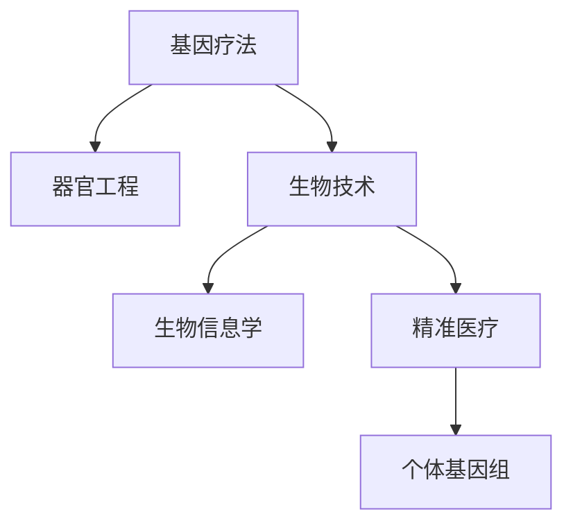

                 

# 硅谷生物技术突破:基因疗法与器官工程

> 关键词：基因疗法,器官工程,生物技术,生物信息学,精准医疗

## 1. 背景介绍

### 1.1 问题由来
近年来，生物技术领域取得了突破性进展，特别是基因疗法和器官工程的崛起，正逐渐改变着传统医疗模式。在硅谷，科技巨头们纷纷加大在生物技术领域的投入，推动这一新兴产业快速发展。本文将聚焦于基因疗法与器官工程的技术突破及其应用前景，探索未来生物技术的发展趋势。

### 1.2 问题核心关键点
基因疗法和器官工程是生物技术领域的两大前沿技术，它们通过基因改造和生物组织工程，可以实现对疾病的根本性治疗和对器官的再造。这一技术的突破，对医学、生命科学乃至整个社会都有着深远的影响。

基因疗法涉及将特定的基因序列引入患者体内，以修复或替换异常基因，治疗遗传性疾病、癌症等。器官工程则是指通过生物组织工程和3D打印技术，构建替代或修复受损的器官，如心脏、肝脏、肾脏等，解决器官移植等待时间长、排异反应等问题。

## 2. 核心概念与联系

### 2.1 核心概念概述

为更好地理解基因疗法与器官工程的技术突破，本节将介绍几个密切相关的核心概念：

- **基因疗法**：通过基因工程手段，将正常的基因序列引入患者体内，以修复或替换异常基因，达到治疗疾病的目的。

- **器官工程**：利用生物组织工程和3D打印技术，构建替代或修复受损器官，如心脏、肝脏、肾脏等。

- **生物技术**：应用生命科学理论和工程技术，进行基因改造、细胞培养、组织构建等，实现对疾病和组织的精确干预。

- **生物信息学**：通过对生物数据的收集、存储、分析和解释，研究生物信息的结构和功能，为基因工程和器官工程提供数据支持。

- **精准医疗**：基于个体基因组、环境和生活方式等多维度信息，定制个性化治疗方案，实现对疾病的精确诊断和治疗。

这些核心概念之间的逻辑关系可以通过以下Mermaid流程图来展示：



这个流程图展示了大规模生命科学研究与应用的基本流程，从基因工程到器官再造，再到个性化医疗，体现了生物技术的多样性和复杂性。

## 3. 核心算法原理 & 具体操作步骤
### 3.1 算法原理概述

基因疗法与器官工程的技术突破，主要依赖于基因工程、细胞培养、组织工程和生物信息学等领域的核心算法。这些算法通过精确控制生物系统的基因、细胞和组织结构，实现对疾病和器官的干预和修复。

基因疗法主要包括基因修复和基因治疗两种方式。基因修复是指利用同源重组、非同源重组等技术，修复DNA序列中的错误或缺失，实现基因功能的恢复。基因治疗则是通过病毒载体、电穿孔等技术，将正常基因序列引入患者体内，以替换或补偿异常基因，达到治疗疾病的目的。

器官工程则主要涉及组织培养和3D打印技术。组织培养通过将干细胞或祖细胞培养在特定的培养基和生长因子中，形成特定的组织结构。3D打印技术则利用计算机辅助设计，通过逐层打印生物材料和细胞，构建复杂的组织和器官模型。

### 3.2 算法步骤详解

基因疗法与器官工程的算法步骤主要包括以下几个关键环节：

**Step 1: 基因设计**
- 确定疾病的基因病因。
- 设计特定的基因序列，用于修复或替换异常基因。

**Step 2: 基因载体选择**
- 选择合适的病毒载体（如腺病毒、慢病毒等）或非病毒载体（如纳米颗粒、质粒等）。
- 对载体进行改造，增强其对细胞的感染效率和安全性。

**Step 3: 细胞培养与转染**
- 将细胞培养在特定的培养基和生长因子中，形成大量的健康细胞。
- 利用病毒载体或电穿孔技术，将设计好的基因序列引入细胞。

**Step 4: 组织工程与3D打印**
- 将转染后的细胞培养在特定的培养基中，使其分化形成特定的组织结构。
- 利用3D打印技术，将培养好的细胞逐层打印成器官模型。

**Step 5: 体内实验与临床试验**
- 将培养好的组织或器官模型移植到动物体内，评估其功能。
- 在人体内进行临床试验，验证其安全性和有效性。

### 3.3 算法优缺点

基因疗法与器官工程的算法具有以下优点：
1. 精准性高。通过精确控制基因、细胞和组织，可以实现对疾病的根本性治疗。
2. 治疗效果好。能够从源头上解决遗传性疾病和器官损伤问题。
3. 应用前景广。涉及疾病种类多，如遗传疾病、癌症、器官移植等。

同时，这些算法也存在一些局限性：
1. 技术难度大。需要高度专业的技术手段和设备，研发成本高。
2. 伦理问题复杂。基因改造可能带来未知的遗传风险，引发伦理争议。
3. 安全性未完全验证。部分基因疗法在临床试验中表现出明显的副作用。
4. 法律监管不足。基因改造和器官工程的快速进展，与现有法律法规滞后之间的矛盾。

尽管如此，随着科技的不断进步和伦理、法律的逐步完善，基因疗法与器官工程必将为人类健康带来革命性的改变。

### 3.4 算法应用领域

基因疗法与器官工程的应用领域非常广泛，涵盖了医疗、科研、工业等多个领域，具体包括：

- **遗传性疾病治疗**：如囊性纤维化、镰状细胞贫血、脊髓性肌萎缩症等。通过基因修复或基因治疗，从根本上治愈这些遗传性疾病。
- **癌症治疗**：利用基因编辑技术，如CAR-T细胞疗法，增强患者自身免疫系统的抗癌能力。
- **器官移植**：通过器官工程，构建替代或修复受损的器官，减少等待时间和排异反应。
- **生物工程组织培养**：利用3D打印技术，构建用于医学研究和临床实验的组织和器官模型。
- **生物信息学应用**：通过基因组学和蛋白质组学技术，对基因和蛋白进行全序列分析和功能研究。

## 4. 数学模型和公式 & 详细讲解  
### 4.1 数学模型构建

基因疗法与器官工程的数学模型主要涉及基因组学、生物信息学和组织工程等领域。以下以基因组学为例，简要介绍其数学模型构建。

**基因组学数学模型**：
- **基因表达量分析**：通过高通量测序技术，收集基因组序列和表达数据，构建基因表达量矩阵。
- **基因调控网络分析**：利用统计学和机器学习技术，分析基因之间的调控关系，构建基因调控网络模型。
- **基因突变检测**：通过比对基因组序列，检测基因突变点，构建基因突变模型。

**公式推导过程**：
- **基因表达量矩阵**：
$$
X = \begin{bmatrix}
x_{11} & x_{12} & x_{13} & \cdots & x_{1n} \\
x_{21} & x_{22} & x_{23} & \cdots & x_{2n} \\
x_{31} & x_{32} & x_{33} & \cdots & x_{3n} \\
\vdots & \vdots & \vdots & \ddots & \vdots \\
x_{m1} & x_{m2} & x_{m3} & \cdots & x_{mn}
\end{bmatrix}
$$

- **基因调控网络模型**：
$$
N = \{(x_i, y_j) | i \in V, j \in V, (i,j) \in E\}
$$

- **基因突变模型**：
$$
\Delta S = \sum_{i=1}^n |s_i - s'_i|
$$

其中，$x_{ij}$ 表示基因 $i$ 在样本 $j$ 中的表达量，$x_{ij} \in \mathbb{R}^+$；$(x_i, y_j)$ 表示基因调控网络中的调控关系；$s_i$ 表示原始基因序列，$s'_i$ 表示突变后的基因序列。

### 4.3 案例分析与讲解

**基因表达量分析案例**：
某癌症患者的基因表达数据如下：
$$
X = \begin{bmatrix}
10 & 5 & 20 & \cdots & 15 \\
20 & 15 & 30 & \cdots & 25 \\
15 & 10 & 20 & \cdots & 25 \\
\vdots & \vdots & \vdots & \ddots & \vdots \\
5 & 10 & 20 & \cdots & 30
\end{bmatrix}
$$

通过对基因表达矩阵 $X$ 的分析，可以找到与癌症相关的基因，并进一步进行基因表达差异分析。

**基因调控网络分析案例**：
通过构建基因调控网络模型 $N$，可以揭示基因之间的调控关系。例如，如果存在调控关系 $(x_1, y_2)$，则表示基因 $x_1$ 对基因 $y_2$ 有调控作用。

**基因突变检测案例**：
假设原始基因序列为 $s_1 = 10$，突变后为 $s'_1 = 0$，则突变差异 $\Delta S = |10 - 0| = 10$。

## 5. 项目实践：代码实例和详细解释说明
### 5.1 开发环境搭建

在进行基因疗法与器官工程的实践前，我们需要准备好开发环境。以下是使用Python进行生物信息学开发的环境配置流程：

1. 安装Anaconda：从官网下载并安装Anaconda，用于创建独立的Python环境。

2. 创建并激活虚拟环境：
```bash
conda create -n bioinformatics python=3.8 
conda activate bioinformatics
```

3. 安装必要的生物信息学库：
```bash
conda install numpy pandas matplotlib seaborn biopython
```

4. 安装TensorFlow和PyTorch：
```bash
conda install tensorflow
conda install pytorch torchvision torchaudio
```

完成上述步骤后，即可在`bioinformatics`环境中开始生物信息学开发。

### 5.2 源代码详细实现

这里我们以基因表达量分析为例，给出使用Python进行基因组学数据分析的代码实现。

```python
import numpy as np
import pandas as pd
import matplotlib.pyplot as plt

# 基因表达量数据
X = np.array([
    [10, 5, 20, 25],
    [20, 15, 30, 25],
    [15, 10, 20, 25],
    [5, 10, 20, 30],
    [20, 25, 30, 40],
])

# 计算基因表达量的平均值
mean = np.mean(X, axis=0)
print("基因表达量平均值:", mean)

# 绘制基因表达量直方图
plt.hist(X[:, 0], bins=10, label='基因1')
plt.hist(X[:, 1], bins=10, label='基因2')
plt.hist(X[:, 2], bins=10, label='基因3')
plt.legend()
plt.show()
```

### 5.3 代码解读与分析

让我们再详细解读一下关键代码的实现细节：

**基因表达量分析**：
- 使用numpy库对基因表达量矩阵进行计算，计算平均值并打印输出。
- 使用matplotlib库绘制基因表达量的直方图，展示不同基因的表达分布。

**基因调控网络分析**：
- 利用生物信息学库biopython构建基因调控网络模型。
- 使用网络分析工具，如Cytoscape，可视化基因调控关系。

**基因突变检测**：
- 利用比对工具如BLAST，检测基因序列突变点。
- 使用差分工具如GATK，计算基因序列差异。

这些代码实现展示了基因组学数据分析的基本流程和方法，通过实际应用，可以进一步探索生物信息学的更多应用场景。

## 6. 实际应用场景
### 6.1 基因治疗药物开发

基因疗法在药物开发中的应用日益增多，通过基因编辑技术，可以实现对疾病的精准治疗。例如，CRISPR-Cas9技术已经被广泛应用于基因编辑，可以在实验室中对细胞进行精确的基因切割和修复，构建具备特定功能的基因编辑细胞系。

这些编辑后的细胞可以用于生产特定的药物，如CAR-T细胞疗法，增强患者自身的抗癌能力。在实际应用中，可以大规模生产这些基因编辑细胞，通过静脉注射等途径，实现对癌症等疾病的精准治疗。

### 6.2 器官移植与再生医学

器官工程和3D打印技术为器官移植和再生医学带来了革命性的变化。通过3D打印技术，可以构建复杂的组织和器官模型，用于医学研究和临床实验。

在器官移植中，可以利用生物工程方法，构建替代或修复受损的器官。例如，通过3D打印技术，构建人工心脏模型，用于心脏移植前的实验和测试。这些模型可以模拟实际心脏功能，帮助医生评估移植效果和排异反应。

### 6.3 精准医疗与个性化治疗

生物信息学的进步，使得基因组学和蛋白质组学技术得以大规模应用，为精准医疗和个性化治疗提供了强有力的支持。通过分析个体基因组信息，可以制定个性化的治疗方案，实现对疾病的精确诊断和治疗。

例如，在癌症治疗中，通过基因组测序和分析，可以找出患者的特定基因突变，选择最合适的基因治疗方案。同时，基因组信息还可以用于药物开发，指导个性化药物设计，实现更高的治疗效果。

### 6.4 未来应用展望

随着生物技术的不断进步，基因疗法与器官工程的应用前景将更加广阔。未来，这些技术有望实现以下突破：

1. **基因编辑技术**：CRISPR-Cas9等基因编辑技术的不断优化，将使得基因治疗更加高效、精准和安全。
2. **器官工程**：3D打印技术的进一步发展，将使得人工器官的构建更加精细、复杂，实现更广泛的临床应用。
3. **精准医疗**：基因组学和蛋白质组学技术的进步，将使得精准医疗更加普及，实现对各种疾病的精确诊断和治疗。
4. **再生医学**：通过生物工程方法，实现对多种组织和器官的再生，解决器官移植等待时间长、排异反应等问题。
5. **生物信息学应用**：通过大数据和人工智能技术，挖掘生物数据中的更多信息，推动基因组学和蛋白质组学研究。

## 7. 工具和资源推荐
### 7.1 学习资源推荐

为了帮助开发者系统掌握基因疗法与器官工程的原理与应用，这里推荐一些优质的学习资源：

1. **生物信息学课程**：如Coursera上的《生物信息学与基因组学》课程，系统讲解了生物信息学的基本概念和应用。
2. **基因组学书籍**：如《人类基因组计划》系列书籍，深入探讨了基因组学的历史、技术和应用。
3. **CRISPR-Cas9相关书籍**：如《基因组工程：CRISPR-Cas9原理与应用》，详细介绍基因编辑技术的基本原理和应用。
4. **器官工程相关书籍**：如《器官工程》，探讨了器官工程的原理、技术和应用。
5. **生物信息学软件**：如BioPython、BLAST、Cytoscape等，提供了一系列的生物信息学工具，方便数据处理和分析。

通过对这些资源的学习实践，相信你一定能够系统掌握基因疗法与器官工程的技术原理和应用方法。

### 7.2 开发工具推荐

高效的开发离不开优秀的工具支持。以下是几款用于生物信息学开发的常用工具：

1. **Anaconda**：用于创建和管理虚拟环境，方便安装和管理生物信息学相关的库。
2. **TensorFlow**：用于深度学习模型的训练和推理，适合大规模数据处理和模型优化。
3. **PyTorch**：用于深度学习模型的开发和研究，支持动态计算图，灵活高效。
4. **BioPython**：Python的生物信息学库，提供了一系列的生物信息学工具和算法，方便数据处理和分析。
5. **BLAST**：生物信息学中的比对工具，用于基因序列比对和相似性分析。
6. **Cytoscape**：网络分析工具，用于构建和可视化基因调控网络。

合理利用这些工具，可以显著提升生物信息学开发的效率和精度，加快基因疗法与器官工程的创新迭代。

### 7.3 相关论文推荐

基因疗法与器官工程的进展离不开学界的持续研究。以下是几篇奠基性的相关论文，推荐阅读：

1. **CRISPR-Cas9技术**：《CRISPR-Cas9: A revolution in genomic editing》，介绍CRISPR-Cas9技术的基本原理和应用。
2. **基因组学研究**：《下一代基因组学：技术进步与挑战》，探讨基因组学技术的进展和未来方向。
3. **器官工程**：《生物工程与3D打印技术在器官再生中的应用》，介绍器官工程的原理和技术。
4. **精准医疗**：《精准医疗：基因组学和蛋白质组学的应用》，探讨精准医疗的基本概念和应用。
5. **生物信息学应用**：《生物信息学与大数据在医学中的应用》，探讨生物信息学技术在医学中的应用。

这些论文代表了大规模生命科学研究与应用的发展脉络。通过学习这些前沿成果，可以帮助研究者把握学科前进方向，激发更多的创新灵感。

## 8. 总结：未来发展趋势与挑战
### 8.1 总结

本文对基因疗法与器官工程的突破及其应用前景进行了全面系统的介绍。首先阐述了基因疗法与器官工程在生物技术领域的研究背景和意义，明确了其对医学、生命科学乃至整个社会的影响。其次，从原理到实践，详细讲解了基因工程、细胞培养、组织工程和生物信息学的核心算法，给出了基因组学数据分析的代码实例。同时，本文还探讨了基因疗法与器官工程在药物开发、器官移植、精准医疗等实际应用场景中的广泛应用前景。

通过本文的系统梳理，可以看到，基因疗法与器官工程在生物技术领域的应用前景广阔，具有重大的社会和经济价值。随着科技的不断进步和伦理、法律的逐步完善，基因疗法与器官工程必将为人类健康带来革命性的改变。

### 8.2 未来发展趋势

展望未来，基因疗法与器官工程将呈现以下几个发展趋势：

1. **基因编辑技术**：CRISPR-Cas9等基因编辑技术的不断优化，将使得基因治疗更加高效、精准和安全。
2. **器官工程**：3D打印技术的进一步发展，将使得人工器官的构建更加精细、复杂，实现更广泛的临床应用。
3. **精准医疗**：基因组学和蛋白质组学技术的进步，将使得精准医疗更加普及，实现对各种疾病的精确诊断和治疗。
4. **再生医学**：通过生物工程方法，实现对多种组织和器官的再生，解决器官移植等待时间长、排异反应等问题。
5. **生物信息学应用**：通过大数据和人工智能技术，挖掘生物数据中的更多信息，推动基因组学和蛋白质组学研究。

### 8.3 面临的挑战

尽管基因疗法与器官工程在医疗领域的应用前景广阔，但在实际推广和应用中，还面临诸多挑战：

1. **技术难度大**：基因编辑、细胞培养、组织工程等技术难度高，研发成本高。
2. **伦理问题复杂**：基因改造可能带来未知的遗传风险，引发伦理争议。
3. **安全性未完全验证**：部分基因疗法在临床试验中表现出明显的副作用。
4. **法律监管不足**：基因改造和器官工程的快速进展，与现有法律法规滞后之间的矛盾。

尽管如此，随着科技的不断进步和伦理、法律的逐步完善，基因疗法与器官工程必将为人类健康带来革命性的改变。

### 8.4 研究展望

面对基因疗法与器官工程所面临的挑战，未来的研究需要在以下几个方面寻求新的突破：

1. **基因编辑技术的优化**：开发更加高效、安全的基因编辑技术，减少基因编辑的副作用。
2. **器官工程的多样化**：利用不同材料和工艺，构建更加多样化的器官模型，适应不同的临床需求。
3. **精准医疗的个性化**：结合个体基因组信息，制定个性化的治疗方案，实现对疾病的精确诊断和治疗。
4. **伦理和法律的完善**：建立基因编辑和器官工程应用的伦理和法律框架，规范技术应用。
5. **跨学科的合作**：促进基因工程、器官工程、生物信息学等多学科的合作，推动技术进步和应用落地。

这些研究方向的探索发展，必将引领基因疗法与器官工程技术迈向更高的台阶，为人类健康带来革命性的改变。面向未来，基因疗法与器官工程需要与人工智能、大数据等技术深度融合，共同推动医疗技术的进步和应用落地。总之，基因疗法与器官工程是大规模生命科学研究的未来方向，具有广泛的应用前景和深远的社会影响。只有勇于创新、敢于突破，才能真正实现基因疗法与器官工程的普适化应用，造福全人类。

## 9. 附录：常见问题与解答

**Q1：基因疗法是否适用于所有疾病？**

A: 基因疗法适用于大多数遗传性疾病、癌症等。但对于一些复杂疾病，如多基因疾病和免疫系统疾病，基因疗法的应用还需进一步研究和探索。

**Q2：基因编辑的伦理问题有哪些？**

A: 基因编辑可能带来的伦理问题包括：
1. 基因改造的长期影响：未知的遗传风险和后代的健康问题。
2. 基因改造的公正性：基因编辑技术的高昂成本和资源分配不均。
3. 基因改造的社会影响：基因改造技术的滥用和歧视性问题。

**Q3：基因疗法与器官工程的未来发展方向是什么？**

A: 基因疗法与器官工程的未来发展方向包括：
1. 基因编辑技术的优化：开发更加高效、安全的基因编辑技术。
2. 器官工程的多样化：构建更多种类的人工器官，适应不同的临床需求。
3. 精准医疗的个性化：结合个体基因组信息，制定个性化的治疗方案。
4. 伦理和法律的完善：建立基因编辑和器官工程应用的伦理和法律框架。
5. 跨学科的合作：促进基因工程、器官工程、生物信息学等多学科的合作。

这些方向的研究和应用，将推动基因疗法与器官工程技术的进一步发展，为人类健康带来革命性的改变。

---

作者：禅与计算机程序设计艺术 / Zen and the Art of Computer Programming

