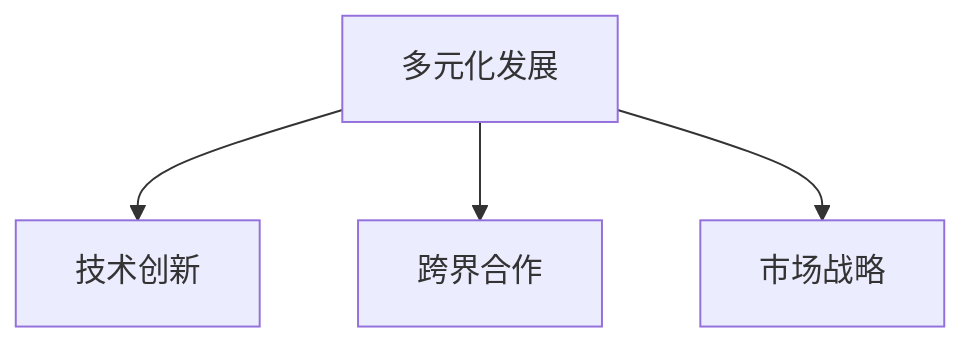

                 

## 1. 背景介绍

### 1.1 问题由来
进入21世纪后，随着全球科技竞争的加剧和互联网技术的迅猛发展，硅谷的科技公司开始寻求多元化发展，以应对市场的不确定性和技术的迭代。这一转变不仅体现在企业战略的调整，还体现在产品线的拓展和跨界合作的增加。多元化发展成为了硅谷科技公司应对激烈市场竞争和追求持续增长的重要手段。

### 1.2 问题核心关键点
1. **市场竞争加剧**：全球范围内科技公司的竞争日趋激烈，企业需要通过多元化发展来分散风险，寻求新的增长点。
2. **技术迭代加速**：互联网技术的不断演进要求企业持续创新，多元化发展有助于企业快速适应技术变革。
3. **消费者需求多样化**：市场需求呈现多样化趋势，硅谷科技公司通过多元化产品线满足不同用户需求。
4. **跨界合作增加**：跨界合作成为行业趋势，通过多元化发展，企业可以整合资源，实现技术和市场的协同效应。

## 2. 核心概念与联系

### 2.1 核心概念概述

为更好地理解硅谷科技公司的多元化发展，本节将介绍几个关键概念：

- **多元化发展**：指企业通过增加产品线和市场领域，实现资源优化配置，降低单一产品风险，提高市场竞争力。
- **技术创新**：指企业通过研发新技术、新产品，推动行业进步，提升市场竞争力。
- **跨界合作**：指不同领域的企业通过合作，整合资源，实现优势互补，拓展市场空间。
- **市场战略**：指企业通过制定市场进入、市场拓展、市场退出等策略，实现资源的最优化配置。

这些核心概念之间的逻辑关系可以通过以下Mermaid流程图来展示：



这个流程图展示了一系列概念之间的联系：

1. **多元化发展**：企业通过增加产品线和市场领域，实现资源优化配置。
2. **技术创新**：通过研发新技术和新产品，推动行业进步。
3. **跨界合作**：通过合作，整合资源，拓展市场空间。
4. **市场战略**：制定市场进入、拓展和退出策略，实现资源优化配置。

这些概念共同构成了硅谷科技公司发展的核心框架，为其多元化发展提供了基础。

## 3. 核心算法原理 & 具体操作步骤
### 3.1 算法原理概述

硅谷科技公司的多元化发展，本质上是通过一系列的决策和行动，实现资源的最优配置和市场竞争力的提升。其核心算法原理可以总结如下：

- **资源优化**：通过增加产品线和市场领域，优化资源配置，分散风险，提升市场竞争力。
- **技术领先**：通过技术创新，推动行业进步，保持市场领先地位。
- **市场拓展**：通过跨界合作和市场战略，拓展市场空间，实现持续增长。

### 3.2 算法步骤详解

硅谷科技公司的多元化发展通常包括以下几个关键步骤：

**Step 1: 识别市场机会**
- 通过市场调研、数据分析等手段，识别市场中的未满足需求和潜在机会。
- 利用大数据、AI等技术，深入分析市场趋势和消费者行为，发掘新的增长点。

**Step 2: 制定战略计划**
- 根据市场机会，制定多元化发展战略，确定产品线、市场领域和投资计划。
- 利用SWOT分析等工具，评估内部资源和外部环境，制定具体实施方案。

**Step 3: 推动技术创新**
- 增加研发投入，推动技术创新，开发新技术和新产品。
- 成立专门的创新实验室或研究中心，吸引全球顶尖人才，提升技术实力。

**Step 4: 实施跨界合作**
- 通过并购、合作、战略联盟等方式，整合不同领域资源，实现优势互补。
- 与行业内外的企业建立合作伙伴关系，拓展市场空间，提升市场竞争力。

**Step 5: 监控与调整**
- 定期评估多元化发展战略的实施效果，根据市场反馈进行调整。
- 利用KPI、ROI等指标，衡量多元化发展的投入产出比，确保资源的有效利用。

### 3.3 算法优缺点

硅谷科技公司的多元化发展具有以下优点：
1. **分散风险**：通过增加产品线和市场领域，分散单一产品的市场风险，提升整体竞争力。
2. **技术领先**：通过技术创新，保持市场领先地位，推动行业进步。
3. **市场拓展**：通过跨界合作和市场战略，拓展市场空间，实现持续增长。

同时，该方法也存在一些局限性：
1. **资源分散**：多元化发展可能导致资源分散，影响单一产品的专注度。
2. **市场协同效应**：跨界合作可能存在协同效应不足的问题，影响整体效益。
3. **市场适应性**：多元化发展需要快速适应市场变化，可能面临较高的管理难度。

尽管存在这些局限性，但就目前而言，多元化发展仍然是硅谷科技公司应对激烈市场竞争和追求持续增长的重要手段。

### 3.4 算法应用领域

硅谷科技公司的多元化发展已经在多个领域得到了应用，例如：

- **硬件和软件**：如苹果公司通过硬件（如iPhone）和软件（如iOS系统）的多元化，形成了强大的市场竞争力。
- **消费品和服务**：亚马逊通过消费品（如Kindle）和云服务（如AWS）的多元化，实现了业务的多样化和增长。
- **网络和通信**：谷歌通过搜索引擎、广告、云计算、自动驾驶等多领域的发展，构建了庞大的生态系统。
- **医疗健康**：如IBM通过人工智能和区块链技术，在医疗健康领域实现了多元化发展。

这些领域的多元化发展，展示了硅谷科技公司在不同领域的创新能力和市场适应性。

## 4. 数学模型和公式 & 详细讲解 & 举例说明

### 4.1 数学模型构建

硅谷科技公司的多元化发展涉及到多个领域的协同和优化，可以通过多个数学模型来描述和分析。

以市场需求为例，可以构建以下数学模型：

- **市场需求函数**：$D(x) = f(x, p)$，其中$x$为产品价格，$p$为产品性能，$D(x)$为市场需求量。
- **成本函数**：$C(x) = a + bx$，其中$a$为固定成本，$b$为单位产品成本，$C(x)$为总成本。
- **利润函数**：$P(x) = D(x) \cdot (p - C(x))$，其中$p$为产品价格，$P(x)$为总利润。

### 4.2 公式推导过程

以市场需求函数为例，其推导过程如下：

假设市场需求与产品价格和产品性能呈负相关关系，即：
$$
D(x) = k \cdot e^{-px}
$$
其中$k$为市场需求常数，$p$为产品价格。

将成本函数$C(x) = a + bx$代入利润函数$P(x)$，得到：
$$
P(x) = k \cdot e^{-px} \cdot (p - (a + bx))
$$

为最大化利润，对$P(x)$求导，并令导数为0，即可求解最优价格$x_{opt}$。

### 4.3 案例分析与讲解

以亚马逊为例，分析其多元化发展策略的数学模型和推导过程。

亚马逊的云计算业务（AWS）与其核心电商业务（Amazon.com）在市场需求和成本方面存在显著差异。通过构建和优化以下数学模型，亚马逊能够实现业务的多元化和最优配置：

- **市场需求函数**：$D_{AWS}(x_{AWS}) = k_{AWS} \cdot e^{-p_{AWS}x_{AWS}}$，其中$x_{AWS}$为AWS价格，$k_{AWS}$为AWS市场需求常数。
- **成本函数**：$C_{AWS}(x_{AWS}) = a_{AWS} + b_{AWS}x_{AWS}$，其中$a_{AWS}$为AWS固定成本，$b_{AWS}$为AWS单位产品成本。
- **利润函数**：$P_{AWS}(x_{AWS}) = k_{AWS} \cdot e^{-p_{AWS}x_{AWS}} \cdot (p_{AWS} - (a_{AWS} + b_{AWS}x_{AWS}))$。

通过求解$P_{AWS}(x_{AWS})$的最大值，亚马逊可以找到AWS的最优价格策略，从而最大化云计算业务的利润。

## 5. 项目实践：代码实例和详细解释说明
### 5.1 开发环境搭建

在进行多元化发展项目开发前，我们需要准备好开发环境。以下是使用Python进行数据分析的开发环境配置流程：

1. 安装Anaconda：从官网下载并安装Anaconda，用于创建独立的Python环境。

2. 创建并激活虚拟环境：
```bash
conda create -n my_env python=3.8 
conda activate my_env
```

3. 安装必要的库：
```bash
conda install numpy pandas matplotlib seaborn jupyter notebook
```

完成上述步骤后，即可在`my_env`环境中开始项目开发。

### 5.2 源代码详细实现

下面以亚马逊为例，给出使用Python进行多元化发展项目开发的完整代码实现。

首先，收集亚马逊不同业务领域的数据：

```python
import pandas as pd

# 读取电商业务数据
df_ecommerce = pd.read_csv('ecommerce_data.csv')

# 读取云计算业务数据
df_cloud = pd.read_csv('cloud_data.csv')

# 读取其他业务数据
df_other = pd.read_csv('other_data.csv')

# 将数据合并为一个DataFrame
df = pd.concat([df_ecommerce, df_cloud, df_other], axis=1)
```

接着，进行数据分析和可视化：

```python
import matplotlib.pyplot as plt

# 可视化电商业务收入和成本
plt.plot(df_ecommerce['Year'], df_ecommerce['Revenue'], label='Revenue')
plt.plot(df_ecommerce['Year'], df_ecommerce['Cost'], label='Cost')
plt.xlabel('Year')
plt.ylabel('Amount')
plt.title('E-commerce Revenue and Cost')
plt.legend()
plt.show()

# 可视化云计算业务收入和成本
plt.plot(df_cloud['Year'], df_cloud['Revenue'], label='Revenue')
plt.plot(df_cloud['Year'], df_cloud['Cost'], label='Cost')
plt.xlabel('Year')
plt.ylabel('Amount')
plt.title('Cloud Revenue and Cost')
plt.legend()
plt.show()

# 可视化其他业务收入和成本
plt.plot(df_other['Year'], df_other['Revenue'], label='Revenue')
plt.plot(df_other['Year'], df_other['Cost'], label='Cost')
plt.xlabel('Year')
plt.ylabel('Amount')
plt.title('Other Revenue and Cost')
plt.legend()
plt.show()
```

最后，通过构建数学模型，求解亚马逊不同业务的利润最大化策略：

```python
from sympy import symbols, diff, solve, exp, log

# 定义符号变量
x_ecommerce, x_cloud, x_other = symbols('x_ecommerce x_cloud x_other')

# 定义电商业务的需求函数和成本函数
def ecommerce_revenue(x_ecommerce):
    return 1000 * exp(-0.1 * x_ecommerce)

def ecommerce_cost(x_ecommerce):
    return 100 + 10 * x_ecommerce

# 定义云计算业务的需求函数和成本函数
def cloud_revenue(x_cloud):
    return 2000 * exp(-0.2 * x_cloud)

def cloud_cost(x_cloud):
    return 200 + 20 * x_cloud

# 定义其他业务的需求函数和成本函数
def other_revenue(x_other):
    return 500 * exp(-0.15 * x_other)

def other_cost(x_other):
    return 50 + 5 * x_other

# 定义总利润函数
def total_profit(x_ecommerce, x_cloud, x_other):
    return ecommerce_revenue(x_ecommerce) * (100 - ecommerce_cost(x_ecommerce)) + \
           cloud_revenue(x_cloud) * (200 - cloud_cost(x_cloud)) + \
           other_revenue(x_other) * (50 - other_cost(x_other))

# 对总利润函数求导，并令导数为0
dtotal_profit_dx_ecommerce = diff(total_profit(x_ecommerce, x_cloud, x_other), x_ecommerce)
dtotal_profit_dx_cloud = diff(total_profit(x_ecommerce, x_cloud, x_other), x_cloud)
dtotal_profit_dx_other = diff(total_profit(x_ecommerce, x_cloud, x_other), x_other)

# 求解最优价格策略
optimal_price_ecommerce = solve(dtotal_profit_dx_ecommerce, x_ecommerce)
optimal_price_cloud = solve(dtotal_profit_dx_cloud, x_cloud)
optimal_price_other = solve(dtotal_profit_dx_other, x_other)

# 输出最优价格策略
print(f'Optimal price for e-commerce: {optimal_price_ecommerce[0]}')
print(f'Optimal price for cloud: {optimal_price_cloud[0]}')
print(f'Optimal price for other: {optimal_price_other[0]}')
```

以上就是使用Python进行多元化发展项目开发的完整代码实现。可以看到，通过构建数学模型和求解最优策略，亚马逊能够实现业务的多元化和最优配置。

### 5.3 代码解读与分析

让我们再详细解读一下关键代码的实现细节：

**数据收集与预处理**：
- 使用Pandas库读取不同业务领域的数据文件，并将其合并为一个DataFrame。
- 通过Matplotlib库对电商、云计算和其他业务的收入和成本进行可视化。

**数学模型构建**：
- 定义电商、云计算和其他业务的收入和成本函数，构建总利润函数。
- 对总利润函数求导，并令导数为0，求解最优价格策略。

**代码实现与分析**：
- 利用Sympy库进行数学推导，求解最优价格策略。
- 通过代码实现，展示亚马逊多元化发展的数学模型和求解过程。

以上代码实现能够帮助读者深入理解硅谷科技公司多元化发展的数学模型和优化方法，具有一定的参考价值。

## 6. 实际应用场景
### 6.1 智能家居系统

硅谷科技公司的多元化发展在智能家居系统中得到了广泛应用。传统的家居系统主要依赖于固定功能的硬件设备和本地化控制，难以满足用户对个性化和智能化的需求。通过多元化发展，硅谷科技公司能够提供一站式的智能家居解决方案，涵盖设备、软件和服务，满足用户的各种需求。

以亚马逊为例，其智能家居系统Alexa通过与多种设备的连接，提供语音控制、智能家居管理、家庭安全等服务，极大地提升了用户的生活便利性和舒适度。通过与谷歌、苹果等公司合作，亚马逊能够整合更多设备和资源，提供更加多样化和高效的服务。

### 6.2 自动驾驶汽车

硅谷科技公司的多元化发展在自动驾驶汽车领域也得到了应用。传统汽车制造商主要依赖于硬件和软件，难以实现智能化和自动化的突破。通过多元化发展，硅谷科技公司能够提供从硬件到软件，从感知到决策的一站式解决方案，推动自动驾驶技术的快速落地。

特斯拉通过多元化发展，整合了自家的电池、动力系统和AI技术，构建了强大的自动驾驶技术体系。同时，特斯拉还通过与多个城市的合作，推动自动驾驶汽车的应用落地，提升了自动驾驶技术的实用性和安全性。

### 6.3 医疗健康

硅谷科技公司的多元化发展在医疗健康领域也得到了应用。传统医疗健康系统主要依赖于线下医院和医生，难以实现规模化和智能化。通过多元化发展，硅谷科技公司能够提供从在线诊疗到远程医疗，从AI诊断到药物研发的全方位解决方案，推动医疗健康行业的数字化转型。

谷歌通过多元化发展，推出了Google Health，提供健康管理、在线诊疗、AI诊断等服务。同时，谷歌还通过与多个医疗机构和研究机构的合作，推动医疗数据和AI技术的融合应用，提升了医疗健康服务的质量和效率。

## 7. 工具和资源推荐
### 7.1 学习资源推荐

为了帮助开发者系统掌握硅谷科技公司多元化发展的理论基础和实践技巧，这里推荐一些优质的学习资源：

1. **《硅谷科技公司多元化发展》系列博文**：由硅谷科技公司专家撰写，深入浅出地介绍了多元化发展的概念、方法和案例。

2. **CS335《公司财务与金融》课程**：斯坦福大学开设的金融课程，讲解公司的财务决策和多元化发展策略。

3. **《公司战略管理》书籍**：哈佛商学院的经典教材，深入解析了多元化发展的战略、管理和实施。

4. **《多元化的力量》视频课程**：Coursera上的公司战略课程，讲解多元化发展的核心概念和实战技巧。

5. **《科技公司多元化发展案例分析》报告**：研究机构发布的报告，详细分析了科技公司在多元化发展中的成功经验和教训。

通过对这些资源的学习实践，相信你一定能够快速掌握硅谷科技公司多元化发展的精髓，并用于解决实际的商业问题。
###  7.2 开发工具推荐

高效的开发离不开优秀的工具支持。以下是几款用于多元化发展开发的常用工具：

1. **Jupyter Notebook**：免费的开源笔记本环境，支持Python等语言，方便开发者进行数据处理和模型构建。

2. **Tableau**：强大的数据可视化工具，能够对大量数据进行高效分析，帮助企业快速洞察市场机会。

3. **Python**：开源的编程语言，广泛应用于数据科学和机器学习领域，提供了丰富的第三方库和工具。

4. **Matplotlib**：Python的可视化库，支持绘制多种类型的图表，方便进行数据分析和可视化。

5. **TensorBoard**：TensorFlow配套的可视化工具，支持监控模型训练和推理过程，帮助开发者调试和优化模型。

6. **GitHub**：代码托管平台，支持多人协作开发，方便团队进行代码管理和版本控制。

合理利用这些工具，可以显著提升多元化发展任务的开发效率，加快创新迭代的步伐。

### 7.3 相关论文推荐

硅谷科技公司多元化发展的理论研究涉及多个学科，以下是几篇奠基性的相关论文，推荐阅读：

1. **《公司多元化策略与绩效》（1998）**：研究公司多元化策略对企业绩效的影响，为多元化发展提供了理论基础。

2. **《多元化与公司竞争优势》（2000）**：分析多元化发展对公司竞争优势的影响，提出了多元化发展的最佳实践。

3. **《公司多元化与市场协同效应》（2005）**：研究多元化发展对市场协同效应的影响，提出了协同效应优化的策略。

4. **《多元化发展与创新》（2012）**：探讨多元化发展对创新的促进作用，提出了创新驱动的战略框架。

5. **《公司多元化与风险管理》（2018）**：研究多元化发展对风险管理的影响，提出了风险控制和优化的方法。

这些论文代表了大公司多元化发展的研究脉络。通过学习这些前沿成果，可以帮助研究者把握学科前进方向，激发更多的创新灵感。

## 8. 总结：未来发展趋势与挑战
### 8.1 总结

本文对硅谷科技公司的多元化发展进行了全面系统的介绍。首先阐述了多元化发展的研究背景和意义，明确了多元化发展在应对市场竞争和追求持续增长方面的独特价值。其次，从原理到实践，详细讲解了多元化发展的数学模型和关键步骤，给出了多元化任务开发的完整代码实例。同时，本文还广泛探讨了多元化发展在智能家居、自动驾驶、医疗健康等多个领域的应用前景，展示了多元化发展的广阔前景。此外，本文精选了多元化发展的各类学习资源，力求为读者提供全方位的技术指引。

通过本文的系统梳理，可以看到，硅谷科技公司的多元化发展正在成为科技公司应对激烈市场竞争和追求持续增长的重要手段。受益于硅谷的科技创新和资源优势，这些公司的多元化发展将在未来发挥更大的作用。

### 8.2 未来发展趋势

展望未来，硅谷科技公司的多元化发展将呈现以下几个发展趋势：

1. **技术融合加速**：多元化发展将与AI、大数据、物联网等新技术深度融合，推动跨领域创新。
2. **市场空间拓展**：通过跨界合作和市场战略，硅谷科技公司将拓展更多市场空间，实现全球化布局。
3. **资源整合优化**：通过多元化的资源整合，优化资源配置，提升整体竞争力。
4. **用户体验提升**：通过产品线的丰富和服务的优化，提升用户的使用体验和忠诚度。
5. **风险管理优化**：通过多元化的风险管理，提升企业的抗风险能力和市场适应性。

这些趋势凸显了硅谷科技公司在多元化发展中的创新潜力和市场优势。未来，伴随技术的不断演进和市场的深入变化，硅谷科技公司的多元化发展将迎来更多新的突破。

### 8.3 面临的挑战

尽管硅谷科技公司在多元化发展中取得了显著成果，但在迈向更加智能化、普适化应用的过程中，仍面临诸多挑战：

1. **管理复杂性增加**：多元化发展导致公司管理复杂性增加，需要更高的管理水平和组织架构支持。
2. **协同效应不足**：跨界合作可能存在协同效应不足的问题，影响整体效益。
3. **资源分散风险**：多元化发展可能导致资源分散，影响单一产品的专注度。
4. **市场适应性**：多元化发展需要快速适应市场变化，可能面临较高的管理难度。
5. **市场协同效应**：多元化发展需要更多跨界合作，但合作的成功率可能存在不确定性。

尽管存在这些挑战，但硅谷科技公司的多元化发展仍然具有强大的生命力和市场竞争力，将继续引领科技行业的发展方向。

### 8.4 研究展望

未来，硅谷科技公司的多元化发展需要在以下几个方面寻求新的突破：

1. **数据驱动决策**：通过大数据和AI技术，优化多元化发展的决策过程，提升决策的科学性和准确性。
2. **协同效应优化**：通过机制设计和管理创新，提升跨界合作的协同效应，实现资源的最优化配置。
3. **市场适应性提升**：通过灵活的市场策略和快速的产品迭代，提升市场适应性和竞争力。
4. **用户体验优化**：通过用户体验设计的优化，提升用户的使用体验和满意度。
5. **风险管理优化**：通过多元化的风险管理，提升企业的抗风险能力和市场适应性。

这些研究方向的探索，必将引领硅谷科技公司的多元化发展走向新的高度，为科技行业的持续创新和增长注入新的动力。

## 9. 附录：常见问题与解答

**Q1：多元化发展是否适合所有企业？**

A: 多元化发展并非适合所有企业，需要根据企业的资源、市场、战略等因素进行评估。一般来说，具备较强资源实力和市场灵活性的企业，如硅谷科技公司，更容易实现多元化发展。

**Q2：多元化发展如何选择合适的业务领域？**

A: 选择合适的业务领域需要综合考虑市场需求、资源优势、竞争态势等因素。可以通过市场调研、SWOT分析等方法，找到与现有业务领域互补、市场需求旺盛的业务领域。

**Q3：多元化发展中的风险管理如何实施？**

A: 多元化发展中的风险管理需要建立完善的风险评估和监控机制，对各业务领域的风险进行识别和评估。同时，制定灵活的风险应对策略，提升企业的抗风险能力。

**Q4：多元化发展中如何进行协同效应优化？**

A: 通过机制设计和管理创新，优化跨界合作的协同效应，实现资源的最优化配置。可以建立明确的合作目标和机制，定期进行合作评估和优化。

**Q5：多元化发展如何提升市场适应性？**

A: 通过灵活的市场策略和快速的产品迭代，提升市场适应性。需要建立快速响应市场变化的能力，定期进行市场调研和产品优化。

作者：禅与计算机程序设计艺术 / Zen and the Art of Computer Programming

