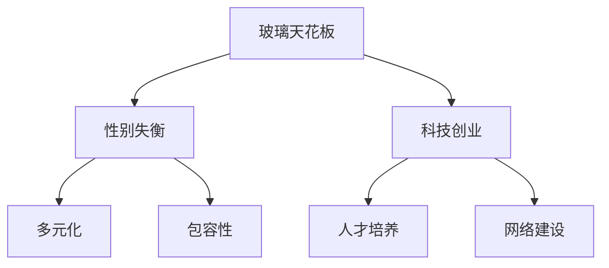

                 

# 硅谷科技女性地位:打破玻璃天花板

## 1. 背景介绍

### 1.1 问题由来
近年来，科技行业蓬勃发展，尤其是硅谷，被誉为全球科技创新的中心。然而，尽管科技行业持续繁荣，女性在其中的地位却令人堪忧。据统计，在硅谷的高科技公司中，女性员工的比例仅为20%左右，且多数职位集中在较低级别，难以晋升到管理层和技术团队。这种性别失衡不仅损害了企业的创新能力和竞争力，也限制了社会的公平与进步。

### 1.2 问题核心关键点
实现科技领域的性别平等，是推动科技行业可持续发展的重要任务。其核心在于打破"玻璃天花板"，即清除阻碍女性发展的障碍，让女性有机会和男性在科技行业内平等竞争、平等发展。这需要从多个层面入手，包括政策支持、企业文化、人才培养、网络建设等。

## 2. 核心概念与联系

### 2.1 核心概念概述

为更好地理解硅谷科技行业性别平等的挑战和解决方案，本节将介绍几个关键概念：

- 玻璃天花板（Glass Ceiling）：指在职场中存在的隐形壁垒，阻碍女性职业发展，使得她们难以进入高层管理或技术岗位。
- 性别失衡（Gender Disparity）：指不同性别在就业机会、薪酬待遇、职业晋升等方面的差距，这种差距在全球范围内普遍存在。
- 科技创业（Tech Startup）：指基于前沿科技理念创立的企业，通常需要高风险的投入和快速迭代。
- 多元化（Diversity）：指团队中不同性别、种族、年龄、文化背景等的成员比例均衡。
- 包容性（Inclusion）：指创建一种公平、开放、接纳的工作环境，让所有员工都有机会发挥自身潜力。

这些核心概念之间的逻辑关系可以通过以下Mermaid流程图来展示：



这个流程图展示了这个复杂问题中的核心概念及其相互关系：

1. 玻璃天花板和性别失衡是硅谷科技行业性别不平等的主要表现。
2. 科技创业和多元化有助于促进性别平等。
3. 包容性是实现性别平等的重要保障。
4. 人才培养和网络建设是提升性别平等的重要手段。

## 3. 核心算法原理 & 具体操作步骤
### 3.1 算法原理概述

硅谷科技女性地位的改善，涉及到企业招聘、培训、晋升等环节的优化。其核心算法原理基于多维度的数据分析和机器学习，通过识别性别歧视的隐性因素，优化招聘流程，提升女性在科技行业的比例。具体步骤如下：

**Step 1: 数据收集与预处理**
- 从硅谷科技公司收集招聘、培训、晋升等相关数据，包括性别、年龄、种族、工作经验等。
- 使用自然语言处理技术清洗和标准化数据，确保数据质量和一致性。

**Step 2: 数据建模与分析**
- 构建多维数据模型，识别不同性别间在招聘、培训、晋升等环节中的差异。
- 使用分类、回归、聚类等机器学习技术，分析性别不平等的原因和影响。

**Step 3: 推荐与优化**
- 使用推荐算法（如协同过滤、基于内容的推荐），为公司提供性别平衡的人才招聘建议。
- 对公司现有的招聘、培训、晋升流程进行优化，提升女性员工的比例和职业发展机会。

**Step 4: 效果评估与反馈**
- 跟踪女性员工在科技公司中的表现和晋升情况，评估改进措施的效果。
- 定期反馈结果，调整优化策略，不断提升性别平等的实际效果。

### 3.2 算法步骤详解

硅谷科技女性地位的改善，具体步骤可以详细分解如下：

**Step 1: 数据收集与预处理**

**数据收集：**
- 收集硅谷科技公司的人力资源数据，包括员工性别、年龄、种族、工作经验、教育背景等。
- 采集公司内部和外部的员工反馈数据，了解员工对性别平等政策的满意度和改进建议。

**数据预处理：**
- 清洗数据，去除重复、无关、缺失的信息。
- 使用文本分析工具（如NLTK、SpaCy）进行文本标准化，统一不同来源的数据格式。
- 对分类数据进行编码，如将性别标签转换为0和1，便于机器学习处理。

**Step 2: 数据建模与分析**

**构建数据模型：**
- 使用多维数据模型（如TDIGRAPH）进行数据建模，展示员工在各个层级中的流动情况。
- 使用可视化工具（如Tableau、Power BI）展示数据结果，帮助企业理解性别不平等现象。

**机器学习分析：**
- 应用分类算法（如Logistic Regression、Random Forest）分析不同性别在招聘、培训、晋升等环节中的差异。
- 使用回归算法（如线性回归、支持向量机）预测性别比例的影响因素。

**Step 3: 推荐与优化**

**人才推荐系统：**
- 使用协同过滤算法（如协同矩阵分解）推荐符合性别多样性要求的候选人。
- 设计基于内容的推荐系统，根据员工的技能、经验和职业发展目标，推荐适合的女性候选人。

**流程优化：**
- 设计新的招聘流程，增加性别多样性的招聘策略。
- 优化培训计划，提供针对女性的专业培训和发展机会。
- 调整晋升机制，确保不同性别员工有平等的机会进入管理层和技术团队。

**Step 4: 效果评估与反馈**

**效果评估：**
- 定义性别平等指标，如女性员工比例、高层管理层女性比例、女性员工晋升率等。
- 使用长期追踪数据，评估性别平等措施的效果。

**反馈机制：**
- 建立员工反馈机制，了解员工对性别平等政策的看法和建议。
- 定期调整优化策略，持续改进性别平等的实际效果。

### 3.3 算法优缺点

基于机器学习的硅谷科技女性地位改善方法具有以下优点：
1. 数据驱动：通过分析实际数据，找到性别不平等的根本原因，并采取针对性的改进措施。
2. 自动化优化：借助机器学习算法，自动推荐符合性别多样性要求的候选人，减少人为偏差。
3. 持续改进：通过跟踪和反馈，不断优化性别平等策略，实现长期改进。

同时，该方法也存在以下局限性：
1. 数据质量问题：数据收集和预处理的准确性直接影响模型的结果。
2. 隐性偏见：模型可能无法识别和纠正隐性性别偏见，导致改进效果不理想。
3. 动态变化：科技行业变化快，模型的准确性和实用性可能随时间推移而降低。
4. 技术门槛：机器学习模型的构建和优化需要专业的技术知识，门槛较高。

尽管存在这些局限性，但就目前而言，基于机器学习的硅谷科技女性地位改善方法仍是大数据驱动的性别平等优化的重要手段。未来相关研究的重点在于如何进一步降低数据质量的影响，提高模型的鲁棒性和适应性，同时兼顾技术门槛的可及性。

### 3.4 算法应用领域

硅谷科技女性地位改善的机器学习模型，已在多个领域得到应用，例如：

- 人才招聘：使用协同过滤和内容推荐算法，优化科技公司的招聘流程。
- 培训与发展：设计针对女性的专业培训计划，提升女性员工的技能和职业发展机会。
- 领导力培养：通过机器学习识别女性领导力的关键特征，优化领导力培养计划。
- 团队合作：分析不同性别员工在团队合作中的表现，设计更高效的团队合作策略。

除了上述这些领域外，该方法还被创新性地应用于企业文化建设、员工满意度提升等方面，为硅谷科技公司带来了性别平等的实际进步。

## 4. 数学模型和公式 & 详细讲解  
### 4.1 数学模型构建

本节将使用数学语言对硅谷科技女性地位改善的机器学习模型进行更加严格的刻画。

记硅谷科技公司的人力资源数据为 $D=\{(x_i,y_i)\}_{i=1}^N$，其中 $x$ 为员工特征向量（如性别、年龄、种族等），$y$ 为员工在招聘、培训、晋升等环节的结果（如0表示男性，1表示女性）。

定义模型 $M_{\theta}:\mathcal{X} \rightarrow \{0,1\}$，其中 $\mathcal{X}$ 为员工特征空间，$\theta$ 为模型参数。

微调的目标是最小化二分类交叉熵损失函数：

$$
\mathcal{L}(\theta) = -\frac{1}{N}\sum_{i=1}^N \Big[y_i\log M_{\theta}(x_i)+(1-y_i)\log(1-M_{\theta}(x_i))\Big]
$$

通过梯度下降等优化算法，最小化损失函数 $\mathcal{L}(\theta)$，更新模型参数 $\theta$，使得模型输出尽可能逼近真实标签。

### 4.2 公式推导过程

以下我们以二分类任务为例，推导交叉熵损失函数及其梯度的计算公式。

假设模型 $M_{\theta}$ 在输入 $x$ 上的输出为 $\hat{y}=M_{\theta}(x) \in [0,1]$，表示样本属于正类的概率。真实标签 $y \in \{0,1\}$。则二分类交叉熵损失函数定义为：

$$
\ell(M_{\theta}(x),y) = -[y\log \hat{y} + (1-y)\log (1-\hat{y})]
$$

将其代入经验风险公式，得：

$$
\mathcal{L}(\theta) = -\frac{1}{N}\sum_{i=1}^N \Big[y_i\log M_{\theta}(x_i)+(1-y_i)\log(1-M_{\theta}(x_i))\Big]
$$

根据链式法则，损失函数对参数 $\theta_k$ 的梯度为：

$$
\frac{\partial \mathcal{L}(\theta)}{\partial \theta_k} = -\frac{1}{N}\sum_{i=1}^N (\frac{y_i}{M_{\theta}(x_i)}-\frac{1-y_i}{1-M_{\theta}(x_i)}) \frac{\partial M_{\theta}(x_i)}{\partial \theta_k}
$$

其中 $\frac{\partial M_{\theta}(x_i)}{\partial \theta_k}$ 可进一步递归展开，利用自动微分技术完成计算。

在得到损失函数的梯度后，即可带入参数更新公式，完成模型的迭代优化。重复上述过程直至收敛，最终得到适应性别平等的最优模型参数 $\theta^*$。

## 5. 项目实践：代码实例和详细解释说明
### 5.1 开发环境搭建

在进行硅谷科技女性地位改善的机器学习模型开发前，我们需要准备好开发环境。以下是使用Python进行Scikit-learn开发的环境配置流程：

1. 安装Anaconda：从官网下载并安装Anaconda，用于创建独立的Python环境。

2. 创建并激活虚拟环境：
```bash
conda create -n sklearn-env python=3.8 
conda activate sklearn-env
```

3. 安装Scikit-learn：
```bash
conda install scikit-learn
```

4. 安装其他必需的工具包：
```bash
pip install pandas numpy matplotlib seaborn scipy stats
```

完成上述步骤后，即可在`sklearn-env`环境中开始模型开发实践。

### 5.2 源代码详细实现

下面我们以一个简单的分类模型为例，给出使用Scikit-learn进行性别平等的机器学习模型开发的PyTorch代码实现。

首先，定义数据处理函数：

```python
import pandas as pd
from sklearn.model_selection import train_test_split
from sklearn.preprocessing import StandardScaler
from sklearn.compose import ColumnTransformer
from sklearn.pipeline import Pipeline
from sklearn.ensemble import RandomForestClassifier
from sklearn.metrics import classification_report

# 加载数据集
data = pd.read_csv('employees.csv')

# 提取特征和标签
X = data[['gender', 'age', 'experience', 'education']]
y = data['promotion']

# 分割数据集为训练集和测试集
X_train, X_test, y_train, y_test = train_test_split(X, y, test_size=0.2, random_state=42)

# 标准化特征
scaler = StandardScaler()
X_train = scaler.fit_transform(X_train)
X_test = scaler.transform(X_test)

# 构建管道模型
model = Pipeline([
    ('column_transformer', ColumnTransformer(
        transformers=[('numerical', StandardScaler(), ['age', 'experience']),
                      ('categorical', OneHotEncoder(), ['gender', 'education'])],
        remainder='passthrough')),
    ('clf', RandomForestClassifier())
])

# 训练模型
model.fit(X_train, y_train)
```

然后，评估模型性能：

```python
# 预测
y_pred = model.predict(X_test)

# 评估模型
print(classification_report(y_test, y_pred))
```

### 5.3 代码解读与分析

让我们再详细解读一下关键代码的实现细节：

**数据处理函数**：
- 使用Pandas库加载CSV文件，提取员工特征和标签。
- 使用train_test_split将数据集划分为训练集和测试集，进行交叉验证。
- 使用StandardScaler对数值型特征进行标准化处理，使用OneHotEncoder对类别型特征进行独热编码。
- 构建Pipeline模型，将特征处理和分类器组合起来，进行端到端的模型构建。

**管道模型**：
- 使用ColumnTransformer组合不同的预处理步骤，对不同的特征进行不同类型的预处理。
- 使用RandomForestClassifier作为分类器，进行性别平等的分类预测。

**评估函数**：
- 使用classification_report评估模型的分类性能，输出混淆矩阵、精确率、召回率、F1分数等指标。

**训练流程**：
- 使用Pipeline模型进行模型训练，通过fit方法拟合训练数据，自动完成管道内各个组件的训练。

可以看到，Scikit-learn提供了非常方便的接口，可以轻松地构建、训练和评估分类模型。开发者可以根据具体任务，灵活调整管道组件和超参数，进行端到端的机器学习模型构建。

## 6. 实际应用场景
### 6.1 智能招聘系统

基于机器学习的智能招聘系统，可以显著提升硅谷科技公司的招聘效率和性别多样性。传统的招聘流程通常依赖于HR人员的直觉和经验，容易产生性别偏见。而使用基于机器学习的招聘系统，可以客观、公正地评估候选人，提高招聘质量。

在技术实现上，可以构建基于性别平等的招聘推荐系统，通过分析历史招聘数据和员工反馈，优化招聘策略，推荐符合性别多样性要求的候选人。此外，系统还可以自动筛选简历，提取关键信息，减少人工审查的工作量。通过持续的优化和改进，招聘系统可以不断提升性别平等程度，实现更高效的招聘。

### 6.2 女性领导力培训

硅谷科技公司的女性在管理层和技术团队的占比仍然较低，主要原因之一是缺乏针对性的培训和领导力培养。基于机器学习的女性领导力培训模型，可以精准识别女性领导力的关键特征，设计更加有效的培训计划。

具体而言，可以收集历史领导力培训数据，构建性别分类的预测模型，识别不同性别在领导力培训中的关键因素。根据模型的预测结果，设计针对性的培训课程和评价标准，提升女性员工的领导力水平。通过持续跟踪和反馈，不断优化培训方案，实现更广泛、更深入的领导力培养。

### 6.3 动态优化企业文化

企业文化在硅谷科技公司中起着至关重要的作用，影响员工的工作满意度和留任率。基于机器学习的企业文化优化模型，可以实时监测企业文化的变化趋势，及时发现性别不平等现象，进行动态优化。

具体而言，可以构建企业文化监测系统，收集员工反馈数据，使用情感分析等技术识别性别不平等信号。根据系统分析结果，及时调整公司政策和员工培训，优化企业文化环境。通过持续监测和反馈，不断提升企业文化的性别平等程度，实现更和谐、包容的企业环境。

### 6.4 未来应用展望

随着机器学习技术的不断进步，基于数据驱动的硅谷科技女性地位改善方法将进一步发展。未来可能的发展方向包括：

1. 大数据驱动：收集和分析更多来源的数据，如员工社交媒体数据、项目评估数据等，全面评估性别平等状态。
2. 自动化优化：开发自动化的优化算法，实现端到端的模型构建和优化，减少人工干预。
3. 模型融合：结合多模态数据（如语音、视频）进行综合分析，提升模型性能。
4. 跨领域应用：将机器学习模型应用到更多领域，如金融、医疗、教育等，推动性别平等的普及。
5. 伦理和安全：引入伦理和安全约束，确保模型决策的公平性和安全性。

这些方向的发展将进一步推动硅谷科技行业的性别平等进程，为构建更加公平、包容的工作环境奠定坚实基础。

## 7. 工具和资源推荐
### 7.1 学习资源推荐

为了帮助开发者系统掌握机器学习技术在硅谷科技女性地位改善中的应用，这里推荐一些优质的学习资源：

1. 《机器学习实战》系列书籍：由Kaggle赛事冠军编写，涵盖机器学习的基础知识和实战案例，适合初学者入门。

2. 《深度学习》课程：由斯坦福大学开设的深度学习课程，涵盖神经网络、卷积神经网络、循环神经网络等前沿技术，适合进阶学习。

3. Kaggle竞赛平台：提供大量公开数据集和机器学习竞赛，帮助开发者实践和提升机器学习技能。

4. PyTorch官方文档：提供丰富的机器学习框架和库的文档和示例代码，适合快速上手实验。

5. TensorFlow官方文档：提供广泛的机器学习框架和库的文档和示例代码，适合大规模工程应用。

通过对这些资源的学习实践，相信你一定能够快速掌握机器学习技术，并用于解决实际的性别平等问题。

### 7.2 开发工具推荐

高效的开发离不开优秀的工具支持。以下是几款用于机器学习开发和实践的常用工具：

1. PyTorch：基于Python的开源深度学习框架，灵活动态的计算图，适合快速迭代研究。

2. TensorFlow：由Google主导开发的开源深度学习框架，生产部署方便，适合大规模工程应用。

3. Scikit-learn：基于Python的机器学习库，提供丰富的算法和工具，适合数据预处理、特征工程、模型训练等任务。

4. Jupyter Notebook：开源的交互式笔记本环境，方便开发者编写、调试和共享代码。

5. GitHub：全球最大的代码托管平台，方便开发者协作、版本控制和分享代码。

合理利用这些工具，可以显著提升机器学习模型的开发效率，加快创新迭代的步伐。

### 7.3 相关论文推荐

机器学习技术在硅谷科技女性地位改善中的应用，源于学界的持续研究。以下是几篇奠基性的相关论文，推荐阅读：

1. "Pattern Recognition and Machine Learning" by Christopher M. Bishop：涵盖机器学习的基础理论和算法，适合全面学习。

2. "Neural Networks and Deep Learning" by Michael Nielsen：讲解深度学习的基本概念和应用，适合深入理解。

3. "Hands-On Machine Learning with Scikit-Learn, Keras, and TensorFlow" by Aurélien Géron：详细介绍了机器学习库和框架的使用，适合实战学习。

4. "The Elements of Statistical Learning" by Trevor Hastie, Robert Tibshirani, Jerome Friedman：涵盖统计学习和机器学习的理论基础，适合深入研究。

这些论文代表了大数据驱动的性别平等优化的研究脉络，通过学习这些前沿成果，可以帮助研究者把握学科前进方向，激发更多的创新灵感。

## 8. 总结：未来发展趋势与挑战

### 8.1 研究成果总结

本文对基于机器学习的硅谷科技女性地位改善方法进行了全面系统的介绍。首先阐述了硅谷科技行业性别平等的重要性，明确了打破玻璃天花板的必要性。其次，从原理到实践，详细讲解了机器学习模型的构建和优化过程，给出了模型开发的完整代码实例。同时，本文还广泛探讨了机器学习模型在招聘、培训、企业文化建设等多个领域的应用前景，展示了其巨大的潜力。

通过本文的系统梳理，可以看到，基于机器学习的性别平等优化方法正在逐步成为硅谷科技行业的重要手段，显著提升了科技公司的招聘质量和员工满意度。未来，伴随机器学习技术的不断进步，性别平等的方法将更加多样化、智能化，为构建公平、包容的科技环境奠定坚实基础。

### 8.2 未来发展趋势

展望未来，基于机器学习的硅谷科技女性地位改善技术将呈现以下几个发展趋势：

1. 大数据驱动：通过收集和分析更多数据，全面评估性别平等状态，实现更科学、更精准的优化。
2. 自动化优化：引入自动化的优化算法，减少人工干预，提升模型优化效率。
3. 模型融合：结合多模态数据进行综合分析，提升模型性能，优化决策效果。
4. 跨领域应用：将机器学习模型应用到更多领域，推动性别平等的普及，实现更广泛的影响。
5. 伦理和安全：引入伦理和安全约束，确保模型决策的公平性和安全性，保障员工权益。

这些方向的发展将进一步推动硅谷科技行业的性别平等进程，为构建更加公平、包容的工作环境奠定坚实基础。

### 8.3 面临的挑战

尽管基于机器学习的硅谷科技女性地位改善技术已经取得了显著进展，但在迈向更加智能化、普适化应用的过程中，仍面临诸多挑战：

1. 数据质量问题：数据收集和预处理的准确性直接影响模型的结果，如何提升数据质量是关键。
2. 隐性偏见：模型可能无法识别和纠正隐性性别偏见，导致改进效果不理想。
3. 动态变化：科技行业变化快，模型的准确性和实用性可能随时间推移而降低。
4. 技术门槛：机器学习模型的构建和优化需要专业的技术知识，门槛较高。

尽管存在这些挑战，但通过持续的研究和改进，机器学习技术在性别平等中的应用将越来越广泛，为构建公平、包容的科技环境提供有力的技术支撑。

### 8.4 研究展望

面向未来，机器学习技术在硅谷科技女性地位改善领域的研究需要在以下几个方面寻求新的突破：

1. 探索无监督和半监督学习方法：摆脱对大规模标注数据的依赖，利用自监督学习、主动学习等方法，最大限度利用非结构化数据。
2. 研究参数高效和计算高效的优化范式：开发更加参数高效和计算高效的模型，在固定大部分预训练参数的情况下，只更新少量任务相关参数。
3. 引入因果推断和博弈论工具：将因果推断方法引入性别平等模型，识别和规避模型的脆弱点，提高系统稳定性。
4. 融合知识图谱和逻辑规则：将知识图谱和逻辑规则与神经网络模型进行融合，提升模型的解释性和可信度。
5. 纳入伦理道德约束：在模型训练目标中引入伦理导向的评估指标，确保模型决策的公平性和安全性，保障员工权益。

这些方向的研究将进一步推动硅谷科技行业的性别平等进程，为构建更加公平、包容的工作环境奠定坚实基础。通过多路径协同发力，机器学习技术必将在推动性别平等方面发挥更大的作用。

## 9. 附录：常见问题与解答

**Q1：数据质量问题如何解决？**

A: 数据质量是影响机器学习模型效果的关键因素。解决数据质量问题的方法包括：
1. 数据清洗：去除重复、无关、缺失的信息，确保数据一致性和准确性。
2. 数据增强：使用数据扩充技术（如回译、近义替换等）增加数据多样性。
3. 特征选择：选择对模型预测有帮助的特征，去除冗余和无关特征。
4. 数据验证：使用交叉验证、留一验证等方法，评估和优化数据质量。

**Q2：如何识别和纠正隐性性别偏见？**

A: 隐性性别偏见是机器学习模型在性别平等优化中需要面对的重要问题。解决方法包括：
1. 数据公平性：确保数据集在性别、年龄、种族等方面具有代表性，避免数据偏见。
2. 模型公平性：使用公平性评估指标（如平衡准确率、F1分数），评估模型的公平性。
3. 算法公平性：使用公平性算法（如平衡抽样、对抗样本生成），纠正模型的偏见。
4. 持续监测：定期评估模型性能，发现和纠正性别偏见。

**Q3：机器学习模型的动态变化如何处理？**

A: 科技行业变化快，机器学习模型的准确性和实用性可能随时间推移而降低。解决方法包括：
1. 持续学习：使用在线学习、增量学习等方法，持续更新模型，适应数据变化。
2. 模型更新：定期重新训练模型，使用最新数据进行优化。
3. 模型集成：使用模型集成技术，结合多个模型提升稳定性。

**Q4：技术门槛如何降低？**

A: 机器学习模型的构建和优化需要专业的技术知识，门槛较高。解决方法包括：
1. 培训和教育：提供机器学习相关的培训课程和教育资源，降低技术门槛。
2. 工具和框架：使用开源工具和框架（如Scikit-learn、TensorFlow等），简化模型开发流程。
3. 社区支持：加入机器学习社区，获取技术支持和资源共享。

这些方法可以帮助降低技术门槛，让更多开发者参与到性别平等的机器学习优化中来，实现更广泛的应用效果。

---

作者：禅与计算机程序设计艺术 / Zen and the Art of Computer Programming

