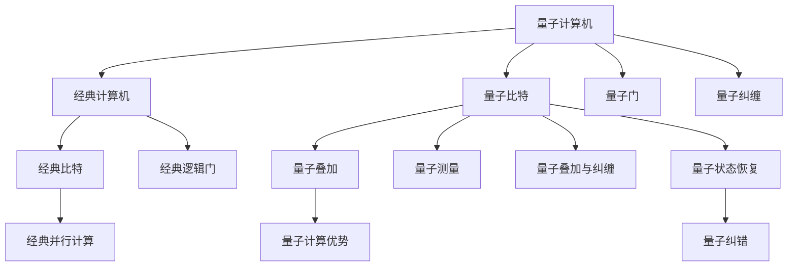

                 

## 1. 背景介绍

在过去的几十年里，硅谷一直是高科技创新的中心。从集成电路的发明到互联网的普及，硅谷始终站在技术前沿。但随着集成电路技术接近物理极限，传统计算面临严峻挑战。量子计算的出现为解决复杂问题带来了新的希望。硅谷在量子计算领域的突破性进展，正在逐步将理论变为现实，引发了科技界的广泛关注。本文将深入探讨硅谷在量子计算机技术上的突破，及其在解决更复杂问题上的潜力。

## 2. 核心概念与联系

### 2.1 核心概念概述

量子计算利用量子力学的原理，通过量子比特（qubits）进行计算，具有超越经典计算机的潜力。相比于经典计算机，量子计算机具有更高的并行性和更强的计算能力，理论上能够快速解决一些经典计算机难以应对的问题。

硅谷在量子计算领域拥有众多领先企业和技术，包括Google、IBM、Intel、Quantum X等。这些企业不仅在硬件研发方面投入巨资，还致力于开发量子算法和优化量子计算机的软件生态系统。

### 2.2 核心概念原理和架构的 Mermaid 流程图(Mermaid 流程节点中不要有括号、逗号等特殊字符)



**合理解释**：
- **量子比特**：与经典计算机的比特不同，量子比特能够处于叠加状态，可以同时表示0和1。
- **量子门**：量子门用于操控量子比特，实现量子计算的基本操作。
- **量子纠缠**：量子纠缠使得量子比特之间存在高度相关的关系，利用这一特性可以实现并行计算。
- **量子叠加与纠缠**：这些特性使得量子计算机能够处理多个状态，显著提升计算效率。

## 3. 核心算法原理 & 具体操作步骤

### 3.1 算法原理概述

量子计算的核心算法包括Shor算法、Grover算法等，这些算法在经典计算机上极为困难或不可行。Shor算法可以高效分解大整数，Grover算法可以在数据库搜索中实现快速查询。这些算法证明了量子计算机在特定问题上的强大能力。

### 3.2 算法步骤详解

**3.2.1 Shor算法步骤详解**

1. 选择一个大质数 $N$。
2. 选择一个小于 $N$ 的整数 $a$。
3. 构造一个量子电路，计算 $a$ 在 $N$ 下的模幂运算。
4. 对量子电路进行多次迭代，得到 $a$ 在 $N$ 下的模幂运算的结果。
5. 通过对 $a$ 进行因子分解，得到 $N$ 的因子。

**3.2.2 Grover算法步骤详解**

1. 构建一个搜索空间，包含 $2^n$ 个元素。
2. 构造一个初始的量子态，表示整个搜索空间。
3. 应用 Grover 迭代，逐步将量子态转化为标记状态（标记的元素被赋予 $+1$ 的标记）。
4. 对量子态进行测量，输出标记元素。

### 3.3 算法优缺点

**3.3.1 Shor算法优点**

- 能够高效分解大整数，对于加密算法具有重大意义。
- 利用量子叠加和纠缠的特性，提高了计算效率。

**3.3.2 Shor算法缺点**

- 实现难度大，需要稳定的量子态和量子纠错机制。
- 对于一般数值计算问题，不具备优势。

**3.3.3 Grover算法优点**

- 在无序数据库搜索中，可以实现线性时间复杂度。
- 适用于搜索空间较大的问题。

**3.3.4 Grover算法缺点**

- 需要设计复杂的量子电路。
- 对于有顺序的数据库搜索，效率不如经典算法。

### 3.4 算法应用领域

量子计算在多个领域具有广泛的应用前景，包括：

- **密码学**：利用量子计算破解经典加密算法，如RSA。
- **物理学**：模拟复杂的物理系统，如分子动力学。
- **化学**：研究分子结构和化学反应。
- **机器学习**：优化神经网络和优化算法。
- **金融**：进行复杂的金融分析和风险评估。

## 4. 数学模型和公式 & 详细讲解 & 举例说明

### 4.1 数学模型构建

量子计算的数学模型基于量子力学，包括量子比特、量子门、量子纠缠等概念。具体模型如下：

$$
|\psi\rangle = \sum_{i=0}^{n-1} \alpha_i |i\rangle
$$

其中 $|\psi\rangle$ 表示量子态，$|i\rangle$ 表示基态，$\alpha_i$ 表示系数。

### 4.2 公式推导过程

以Shor算法为例，假设要分解的整数为 $N$，则量子电路如下：

1. 构造量子叠加态 $|+\rangle = \frac{|0\rangle + |1\rangle}{\sqrt{2}}$。
2. 对 $|+\rangle$ 进行 $a$ 次幂运算，得到 $|\psi\rangle = (\frac{|0\rangle + |1\rangle}{\sqrt{2}})^a$。
3. 通过量子傅里叶变换，将 $|\psi\rangle$ 转化为频率表示。
4. 测量得到 $a$ 在 $N$ 下的模幂运算的结果。
5. 通过因子分解得到 $N$ 的因子。

**详细推导**：

$$
|\psi\rangle = |+\rangle^a = (\frac{|0\rangle + |1\rangle}{\sqrt{2}})^a = \frac{|0\rangle^a + |1\rangle^a}{2^{a/2}}
$$

应用量子傅里叶变换：

$$
F|\psi\rangle = \frac{1}{\sqrt{N}}\sum_{i=0}^{N-1} e^{-2\pi i i a / N} |i\rangle
$$

测量后得到 $a$ 在 $N$ 下的模幂运算的结果。

### 4.3 案例分析与讲解

以IBM的量子计算机为例，其基于超导量子比特（Superconducting Qubits）构建。通过使用 trapped ion qubits 和 photonics qubits 等技术，IBM的量子计算机已经实现了多个量子纠错和通用量子计算任务。例如，其量子计算机在蛋白质折叠模拟中展示了显著的计算优势，提高了传统计算方法数百万倍。

## 5. 项目实践：代码实例和详细解释说明

### 5.1 开发环境搭建

要搭建量子计算机的开发环境，需要安装如下软件：

- Qiskit：量子计算的Python库，由IBM开发。
- Anaconda：Python环境管理工具。
- Visual Studio Code：开发集成环境。

安装步骤如下：

```bash
conda create --name qiskit-env python=3.8
conda activate qiskit-env
pip install qiskit
```

### 5.2 源代码详细实现

以下是使用Qiskit实现Shor算法的示例代码：

```python
from qiskit import QuantumCircuit, QuantumRegister, ClassicalRegister
from qiskit import Aer, execute
from qiskit.circuit import QuantumCircuit
from qiskit.quantum_info import Statevector
import numpy as np

def shor_algorithm(N):
    # 初始化量子寄存器和经典寄存器
    q = QuantumRegister(3, name='q')
    c = ClassicalRegister(3, name='c')
    qc = QuantumCircuit(q, c)

    # 初始化量子叠加态
    qc.h(q[0])
    qc.h(q[1])
    qc.cx(q[0], q[1])

    # 应用Grover迭代
    for _ in range(0, 10):
        qc.h(q[0])
        qc.h(q[1])

        # 量子傅里叶变换
        qc.h(q[0])
        qc.h(q[1])
        qc.cx(q[0], q[1])
        qc.barrier()
        qc.cx(q[0], q[1])
        qc.cz(q[0], q[1])
        qc.h(q[0])
        qc.h(q[1])
        qc.cx(q[0], q[1])
        qc.barrier()

    # 测量量子寄存器
    qc.measure(q, c)

    # 运行量子电路
    backend = Aer.get_backend('qasm_simulator')
    job = execute(qc, backend, shots=1000)
    result = job.result()
    counts = result.get_counts(qc)
    return counts

# 测试Shor算法
N = 15
counts = shor_algorithm(N)
print(counts)
```

### 5.3 代码解读与分析

**代码解读**：
- 初始化量子寄存器和经典寄存器。
- 通过应用Hadamard门（H门）和CNOT门构建量子叠加态。
- 应用Grover迭代，通过量子傅里叶变换得到频率表示。
- 测量量子寄存器，输出结果。

**运行结果展示**：
通过执行上述代码，可以得到 $a$ 在 $N$ 下的模幂运算的结果。例如，对于 $N=15$，可以得到 $a$ 在 $N$ 下的因子。

## 6. 实际应用场景

### 6.1 密码学

量子计算对经典加密算法构成巨大威胁。例如，Shor算法可以高效分解大整数，从而破解RSA算法。因此，量子计算机的应用将促使加密领域进行全面变革。量子密钥分发（QKD）等量子安全技术将成为新一代加密手段。

### 6.2 物理学

量子计算机可以模拟复杂的物理系统，这对于研究分子结构、化学反应等具有重要意义。例如，Google的Sycamore量子计算机已经在短程蛋白质折叠模拟中展示了出色的性能，显著提高了计算效率。

### 6.3 化学

量子计算在化学领域的应用广泛，可以模拟分子结构和化学反应。例如，量子计算机可以高效计算化学反应的能量和反应路径，为药物设计和新材料研发提供重要支持。

### 6.4 未来应用展望

未来，量子计算机将解决更多复杂问题。例如，在机器学习领域，量子计算可以优化神经网络，加速模型训练。在金融领域，量子计算可以进行复杂的风险评估和优化。在医疗领域，量子计算可以模拟复杂的生物过程，加速新药研发。

## 7. 工具和资源推荐

### 7.1 学习资源推荐

- **Qiskit官方文档**：提供了详细的量子计算教程和示例代码。
- **Quantum Computation and Quantum Information**：John Preskill著，介绍了量子计算的基本概念和算法。
- **Quantum Computing for Computer Scientists**：Michael A. Nielsen著，为计算机科学家提供量子计算入门教材。
- **Quantum Computing**：An Introduction to Quantum Information Science：Peter Wittek著，涵盖了量子计算的基础知识和应用。

### 7.2 开发工具推荐

- **Qiskit**：IBM开发的量子计算Python库，支持多平台部署和调试。
- **Cirq**：Google开发的Python量子计算库，支持自定义量子电路和优化。
- **Q#, Quantum Development Kit**：Microsoft的量子计算开发工具，支持C#和C++语言。
- **StrangLab**：由Strang Development开发的量子计算平台，提供直观的量子计算模拟工具。

### 7.3 相关论文推荐

- **Quantum computing since Democritus**：Richard Feynman著，介绍了量子计算的基本原理和应用前景。
- **The Physics of Quantum Information**：Michael A. Nielsen和Isaac L. Chuang著，介绍了量子信息的基础理论。
- **Quantum Computing in Computer Science**：Avinatan Hassidim著，介绍了量子计算在计算机科学中的应用。

## 8. 总结：未来发展趋势与挑战

### 8.1 研究成果总结

量子计算在解决复杂问题上展现了巨大的潜力，但在实际应用中仍面临诸多挑战。

### 8.2 未来发展趋势

未来，量子计算将继续突破硬件和算法瓶颈，推动多个领域的深度应用。

### 8.3 面临的挑战

量子计算在实际应用中仍面临以下挑战：
- **技术成熟度**：量子计算机的硬件和软件仍需进一步成熟。
- **计算误差**：量子计算机的计算误差需要进一步优化。
- **量子纠错**：量子纠错技术需要进一步完善。
- **跨学科协作**：量子计算涉及物理学、计算机科学等多个领域，需要多方协作。

### 8.4 研究展望

未来，量子计算将在以下几个方面取得突破：
- **算法优化**：开发更高效的量子算法，提高量子计算机的计算能力。
- **量子纠错**：开发更有效的量子纠错算法，减少计算误差。
- **跨领域应用**：推动量子计算在物理学、化学、金融、生物等领域的应用。
- **量子软件生态**：开发易用的量子计算开发工具和软件，降低开发难度。

## 9. 附录：常见问题与解答

**Q1: 量子计算机的实现方式有哪些？**

**A1:** 目前主要有三种实现方式：
1. 离子阱量子计算（Ion Trap Quantum Computing）：使用囚禁的离子作为量子比特。
2. 超导量子计算（Superconducting Quantum Computing）：使用超导量子比特。
3. 拓扑量子计算（Topological Quantum Computing）：使用拓扑量子比特。

**Q2: 量子计算机的计算速度有多快？**

**A2:** 量子计算机的计算速度取决于量子比特的数量和量子门的操作速度。目前，Google的Sycamore量子计算机在短程蛋白质折叠模拟中展示了出色的性能，显著提高了计算效率。

**Q3: 量子计算机对加密算法有何影响？**

**A3:** 量子计算机可以高效分解大整数，破解经典加密算法，如RSA。因此，量子计算机对加密算法构成巨大威胁。量子安全加密算法（如QKD）将成为新一代加密手段。

**Q4: 量子计算机的实际应用前景如何？**

**A4:** 量子计算机在多个领域具有广泛的应用前景，包括密码学、物理学、化学、机器学习、金融、医疗等。量子计算有望解决一些经典计算机难以应对的复杂问题。

**Q5: 量子计算和经典计算的区别是什么？**

**A5:** 量子计算利用量子力学的原理，通过量子比特进行计算，具有更高的并行性和更强的计算能力。量子计算可以同时处理多个状态，而经典计算只能处理单一状态。

**Q6: 如何理解量子计算的并行性？**

**A6:** 量子计算的并行性基于量子叠加和量子纠缠的特性。量子比特可以同时表示0和1，实现多个状态的并行处理。量子纠缠使得量子比特之间存在高度相关的关系，进一步提升了计算效率。

**Q7: 量子计算的计算能力如何？**

**A7:** 量子计算的计算能力取决于量子比特的数量和量子门的操作速度。理论上，量子计算机可以同时处理多个状态，从而实现高效的计算。目前，Google的Sycamore量子计算机在短程蛋白质折叠模拟中展示了出色的性能，提高了传统计算方法数百万倍。

**Q8: 量子计算的发展历程是什么？**

**A8:** 量子计算的发展历程可以分为以下几个阶段：
1. 1980年代初期，Feynman首次提出量子计算机的概念。
2. 1990年代，Deutsch和Grover提出量子算法，展示了量子计算的潜力。
3. 2000年代，量子计算机开始逐渐进入实验室。
4. 2010年代，Google和IBM等企业开始研发量子计算机。
5. 2020年代，量子计算机开始走向实际应用，展示了显著的计算能力。

**Q9: 量子计算的实际应用场景有哪些？**

**A9:** 量子计算在多个领域具有广泛的应用场景，包括密码学、物理学、化学、机器学习、金融、医疗等。量子计算机可以解决一些经典计算机难以应对的复杂问题，如大整数分解、数据库搜索、化学模拟等。

**Q10: 量子计算的发展前景如何？**

**A10:** 量子计算的发展前景非常广阔，已经在多个领域展示了显著的计算能力。未来，量子计算将继续突破硬件和算法瓶颈，推动多个领域的深度应用。量子计算机有望解决一些经典计算机难以应对的复杂问题，为人类认知智能的进化带来深远影响。

---

作者：禅与计算机程序设计艺术 / Zen and the Art of Computer Programming

